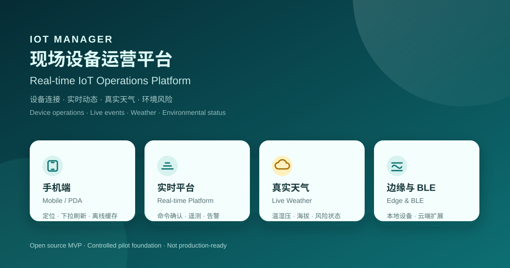
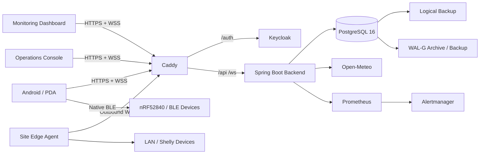
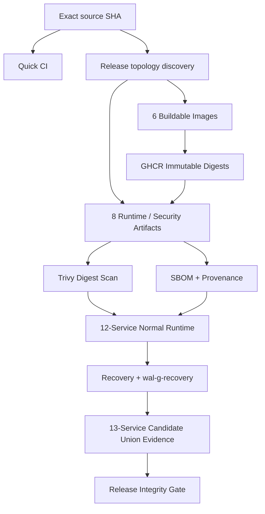

# IoT Manager

<p align="center">
  
</p>

<p align="center">
  <strong>面向现场设备、边缘网络与云端平台的可审计 IoT 运维系统</strong><br />
  <em>Auditable IoT operations across field devices, edge networks, and cloud-connected services.</em>
</p>

<p align="center">
  
  
  
  
  
  
  
</p>

> [!IMPORTANT] > **Current release status / 当前发布状态**
>
> IoT Manager 当前是 **R1 受控试点候选版本（Controlled-Pilot Candidate）**，不是已批准的正式生产版本。
>
> 源码已包含完整的受控试点业务主链、Docker 部署资产、Keycloak/OIDC、HTTPS/WSS、四角色 RBAC、逻辑恢复、监控告警与 CI/Release Integrity 基础。正式生产发布仍需完成：针对同一候选 SHA 的受保护 Release Integrity Gate、绿色 P0 Docker Runtime、真实远端 S3/WAL-G PITR、容量与稳定性基线，以及真实设备验收。
>
> 当前 [Quick CI 已通过](https://github.com/xxbb11122/IotManager/actions/runs/33642830708)，但最新 P0 Docker Runtime 尚未绿色通过；它仍是发布阻断项。详见 [项目进度评估](docs/PROJECT-PROGRESS-EVALUATION-2026-09-02.md)。

## What is IoT Manager?

**IoT Manager** 是一个面向现场局域网设备、边缘代理和云端设备的模块化 IoT 运维平台。

它不是单纯的设备开关面板，而是围绕 **设备身份、能力模型、命令确认、遥测、告警、实时状态、权限边界、恢复能力和可审计发布** 构建的完整运维链路。

The platform provides a unified operational boundary for:

- device onboarding, discovery, claim, grouping, and archive;
- versioned device capability profiles;
- acknowledged and idempotent device commands;
- telemetry, activity history, alerts, and real-time updates;
- Android/PDA, monitoring-dashboard, and operations-console experiences;
- Keycloak OIDC / PKCE authentication and site-scoped RBAC;
- Edge Agent connectivity for LAN devices;
- PostgreSQL backup, WAL-G recovery design, and observability;
- immutable release artifacts, SBOM, provenance, image scanning, and evidence gates.

## Why this project?

| 现实问题                   | IoT Manager 的处理方式                                             |
| -------------------------- | ------------------------------------------------------------------ |
| 多站点与多角色隔离         | Organization / Site Membership + OWNER / ADMIN / OPERATOR / VIEWER |
| 设备型号差异               | Versioned Device Profiles，而不是硬编码 UI                         |
| 指令是否真正执行           | Command lifecycle + acknowledgement + audit events                 |
| 局域网设备无法直接暴露公网 | Outbound Edge Agent WSS                                            |
| BLE 与云端控制共存         | Android native BLE + Backend / Edge abstraction                    |
| 网络不稳定                 | Cached snapshot、reconnect、idempotency、state reconciliation      |
| 运维可观测性               | Actuator + Prometheus + Alertmanager                               |
| 数据损坏与误操作           | Logical backup + WAL-G recovery design                             |
| 构建产物一致性             | Immutable digest + SBOM + provenance + runtime / recovery evidence |
| CI 平台偶发失败            | Stage isolation + retry / fallback policy + fail-closed Gate       |

## Core capabilities

### Device operations

- 设备发现、认领、分组、归档与活动追踪；
- 设备 Profile 与能力校验；
- 遥测、状态、告警和实时 WebSocket 更新；
- 单设备与批量命令；
- 命令幂等、ACK、失败状态与审计历史；
- 多站点数据边界与跨站访问隔离。

### Edge & field connectivity

- Android 原生 BLE 与 Web Bluetooth fallback；
- Site Edge Agent 通过 outbound WSS 连接平台；
- Shelly Plus Plug S Gen2 RPC 控制与状态回读；
- nRF52840 reference-switch BLE profile。

### Identity & security

- Keycloak OIDC 与 Authorization Code + PKCE；
- Spring Security OAuth2 Resource Server / JWT；
- OWNER / ADMIN / OPERATOR / VIEWER 四角色模型；
- Organization / Site membership authorization；
- Android Keystore token storage；
- Caddy HTTPS / WSS；
- per-Agent credential rotation / revocation；
- Docker Secret、私有运行时 Secret 卷与最小权限 PostgreSQL 应用角色。

### Weather & environmental context

- Open-Meteo 实时天气；
- 温度、湿度、气压、风、海拔和预报；
- ESD、condensation 与环境风险分级；
- 明确用户触发的一次性定位；
- 缓存、刷新限流和失败保留策略。

### Operations & recovery

- PostgreSQL 16 + Flyway；
- Logical Backup；
- WAL-G physical recovery design；
- Prometheus + Alertmanager；
- isolated logical recovery drill；
- protected PITR workflow boundary。

## Architecture



## Release Integrity

The following diagram is the **target release contract**, not a claim that the protected release gate has already passed.



| Evidence domain                 | Required result |
| ------------------------------- | --------------: |
| Buildable images                |       **6 / 6** |
| Runtime / security artifacts    |       **8 / 8** |
| Normal runtime services         |     **12 / 12** |
| Recovery-added services         |       **1 / 1** |
| Release-candidate service union |     **13 / 13** |
| Unexpected digest mismatch      |           **0** |
| Missing required evidence       |           **0** |

Release and recovery gates are **fail-closed**: a skipped scan, missing evidence, digest mismatch, terminated runner, failed recovery verification, or unapproved HIGH/CRITICAL finding cannot be treated as PASS.

## Current verified baseline

> Evidence is scoped to the 2026-09-02 assessment. Formal production approval still requires the complete protected Release Integrity Gate for one exact candidate SHA.

| Area               | Verified result                                                          | Evidence scope             |
| ------------------ | ------------------------------------------------------------------------ | -------------------------- |
| Backend            | 123 tests, 0 failures, 0 errors, 1 expected skip                         | Local + Quick CI           |
| Edge Agent         | 7 tests passed                                                           | Local + Quick CI           |
| Client             | 86 Node unit tests passed                                                | Local + Quick CI           |
| Frontend / Console | Playwright E2E + production build passed                                 | Local + Quick CI           |
| Android            | Capacitor sync + Debug APK build passed                                  | Local + Quick CI           |
| Auth & WSS         | PKCE / JWT / 4-role RBAC / WSS flows verified                            | Local integration evidence |
| Logical recovery   | Isolated restore and DB-permission validation passed                     | Local integration evidence |
| Release topology   | 8 artifacts / 6 buildable images / 13 service evidence objects validated | Contract validation        |
| Docker runtime     | Local full-stack evidence exists; latest GitHub P0 runtime is not green  | Release blocker            |

### Production-release blockers

1. a green P0 Docker Runtime run for the exact candidate SHA;
2. a clean protected GitHub Release Integrity Gate;
3. protected GHCR digest, scan, SBOM, provenance, and runtime-evidence closure;
4. real remote S3-compatible WAL-G PITR with measured RPO / RTO;
5. capacity, load, and long-running stability baselines;
6. real Android, BLE, Edge, and network-condition acceptance;
7. external weather-provider quota, failover, privacy, and operational review.

## Technology stack

| Layer             | Technology                                               |
| ----------------- | -------------------------------------------------------- |
| Backend           | Java 17, Spring Boot 3.5.x, Spring MVC, Spring WebSocket |
| Security          | Spring Security, OAuth2 Resource Server, JWT, Keycloak   |
| Persistence       | PostgreSQL 16, Spring Data JPA / Hibernate, Flyway       |
| Edge Agent        | Java 17, outbound WebSocket, profile-based drivers       |
| Web               | Node.js 22, Vite, ES Modules                             |
| Testing           | JUnit 5, Testcontainers, Playwright                      |
| Mobile            | Capacitor 8, Android API 24–36                           |
| Reverse proxy     | Caddy                                                    |
| Observability     | Spring Actuator, Micrometer, Prometheus, Alertmanager    |
| Backup / Recovery | PostgreSQL logical backup, WAL-G                         |
| Container         | Docker, Docker Compose, Buildx / BuildKit                |
| Registry          | GitHub Container Registry                                |
| Supply chain      | Trivy, Gitleaks, CycloneDX SBOM, Build provenance        |
| CI/CD             | GitHub Actions                                           |

## Repository layout

```text
IotManager/
├── backend/                 Spring Boot platform API
├── edge-agent/              Site Edge Agent
├── frontend/                Monitoring dashboard
├── console/                 Operations console
├── client/                  Web / Android PDA client
├── profiles/                Versioned device profiles
├── deploy/                  Docker / Caddy / Keycloak / PostgreSQL assets
├── scripts/
│   ├── ci/                  Release-integrity and evidence tooling
│   └── runtime/             Runtime / recovery orchestration
├── .github/workflows/       Quick CI, Runtime, Security, Recovery, Release Gate
└── docs/                    Audit, verification, runbooks, development records
```

## Quick start

### Requirements

- JDK 17 — Backend / Edge Agent
- JDK 21 — Android build
- Node.js 22
- Android SDK 36
- Docker + Docker Compose for the full deployment path

### Backend API

```bash
cd backend
mvn spring-boot:run
```

The default development profile uses a local H2 database and exposes the API at `http://localhost:8080`.

### Client

```bash
cd client
npm ci
npm run dev
```

### Monitoring frontend

```bash
cd frontend
npm ci
npm run dev
```

### Operations console

```bash
cd console
npm ci
npm run dev
```

### Strict verification

```bash
bash scripts/verify.sh --strict
```

```powershell
./scripts/verify.ps1 -Strict
```

For Docker Runtime, Android, release-integrity, and recovery verification, see:

- [Verification](docs/VERIFICATION.md)
- [CI / Release runbook](docs/CI-RELEASE-RUNBOOK.md)
- [Deployment](deploy/DEPLOYMENT.md)

## Device profiles

Current reference profiles include:

- `legacy-generic-v1`
- `nordic-nrf52840-switch-v1`
- `shelly-plus-plug-s-v1`

See [Device Profiles](profiles/README.md).

## Security boundary

The `dev` profile is for local development and must not be exposed as a production service.

Production-shaped operation requires JWT, HTTPS/WSS, explicit origins, site-scoped authorization, least-privilege DB roles, protected secrets, immutable release evidence, security scans, and recovery gates.

HIGH/CRITICAL findings remain release blockers unless fixed or covered by an explicitly approved, scoped, expiring VEX.

## Documentation

- [Project status](docs/PROJECT-PROGRESS-EVALUATION-2026-09-02.md)
- [Verification](docs/VERIFICATION.md)
- [CI / Release](docs/CI-RELEASE-RUNBOOK.md)
- [Deployment](deploy/DEPLOYMENT.md)
- [Device Profiles](profiles/README.md)
- [Edge Agent](edge-agent/README.md)
- [Image security](docs/IMAGE-SECURITY-STATUS.md)
- [R1 implementation status](docs/R1-COMPLETION-IMPLEMENTATION-STATUS.md)

## Project status summary

```text
Core product functionality       ████████▌░  R1 pilot candidate
Automated verification           ████████░░  Quick CI green; P0 runtime pending
Runtime & security foundation    ████████░░  controlled-pilot foundation
Release integrity                ██████▌░░░  protected Gate still required
Production operations            ██████░░░░  external / physical evidence pending
```

**Decision:** suitable for an **R1 controlled pilot**.

**Not yet approved:** formal production release.

<p align="center">
  <strong>IoT Manager</strong><br />
  Device operations · Edge connectivity · Real-time state · Recovery · Auditable delivery
</p>
