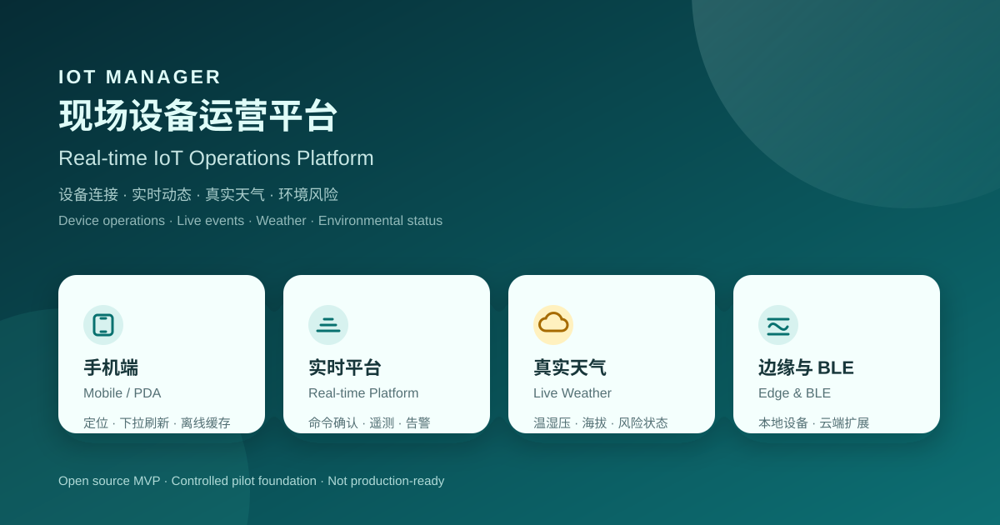
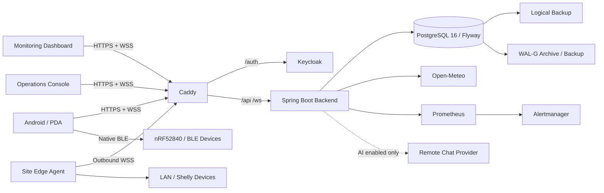
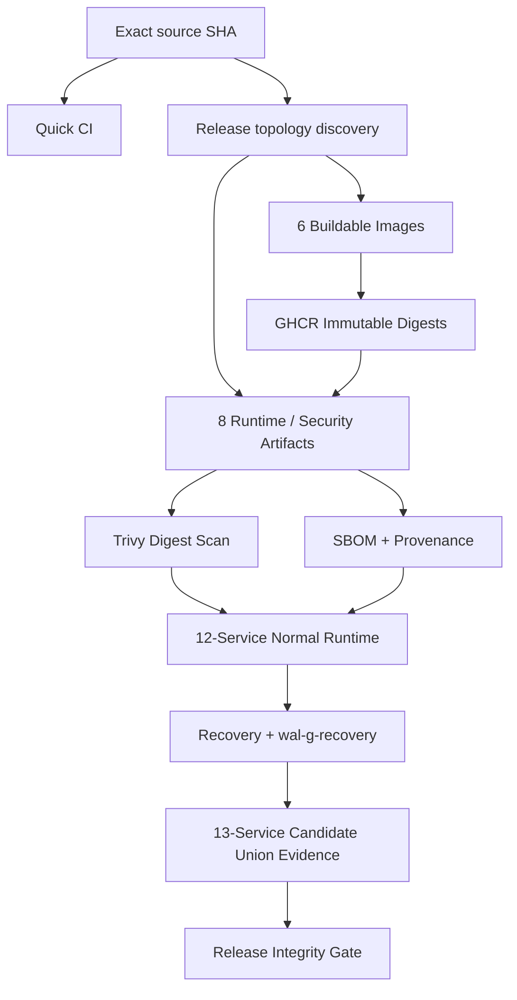

# IoT Manager

<p align="center">
  
</p>

<p align="center">
  <strong>面向现场设备、边缘网络与云端平台的可审计 IoT 运维系统</strong><br />
  <em>Auditable IoT operations across field devices, edge networks, and cloud-connected services.</em>
</p>

<p align="center">
  
  
  
  
  
  
  
</p>

> [!IMPORTANT]
> **Current release status / 当前发布状态**
>
> IoT Manager 当前是 **R1 受控试点候选项目（Controlled-Pilot Candidate）**，并非已批准的正式生产版本。新增的 App AI 聊天属于独立试验范围，生产默认关闭；站点知识库也默认关闭。
>
> 截至 **2026-10-01**，本地验证通过：Backend 189 项、Edge Agent 7 项、Client 194 项、监控端 2 项、控制台 1 项单元/集成测试；Client 关键浏览器场景 11 项、三端生产构建、Android 1.1.1 Debug APK 构建及 Compose 静态配置检查通过。新功能的真机、生产身份链路和发布证据仍需单独验收；推送后以[当前提交的 Quick CI](https://github.com/xxbb11122/IotManager/actions/workflows/ci.yml)及[P0 Docker Runtime](https://github.com/xxbb11122/IotManager/actions/workflows/runtime-e2e.yml)结果为准。
>
> **Passing local tests or Quick CI is not production approval.** 受保护的不可变发布门禁、签名版本回滚、远端 WAL-G PITR/RPO/RTO、持续负载、真实设备与新 APK 的完整 HTTPS/OIDC 验收尚未关闭。

## What is IoT Manager?

**IoT Manager** 是一个面向单组织多站点、现场局域网设备、边缘代理和云端服务的模块化 IoT 运维平台。当前部署基线是单主机 Docker Compose 的受控试点，不宣称多租户 SaaS 或高可用集群。

它不是单纯的设备开关面板，而是围绕 **设备身份、能力模型、命令确认、遥测、告警、实时状态、权限边界、恢复能力和可审计发布** 构建的完整运维链路。

The platform provides a unified operational boundary for:

- device onboarding, discovery, claim, grouping, and archive;
- versioned device capability profiles;
- acknowledged and idempotent device commands;
- telemetry, activity history, alerts, and real-time updates;
- Android/PDA, monitoring-dashboard, and operations-console experiences;
- an optional, server-mediated AI chat workspace with conversation history and versioned personas (disabled by default);
- Keycloak OIDC / PKCE authentication and site-scoped RBAC;
- Edge Agent connectivity for LAN devices;
- PostgreSQL backup, WAL-G recovery design, and observability;
- immutable release artifacts, SBOM, provenance, image scanning, and evidence gates.

## Why this project?

| 现实问题                   | IoT Manager 的处理方式                                             |
| -------------------------- | ------------------------------------------------------------------ |
| 多站点与多角色隔离         | Organization / Site Membership + OWNER / ADMIN / OPERATOR / VIEWER |
| 设备型号差异               | Versioned Device Profiles，而不是硬编码 UI                         |
| 指令是否真正执行           | Command lifecycle + acknowledgement + audit events                 |
| 局域网设备无法直接暴露公网 | Outbound Edge Agent WSS                                            |
| BLE 与云端控制共存         | Android native BLE + Backend / Edge abstraction                    |
| 网络不稳定                 | Cached snapshot、reconnect、idempotency、state reconciliation      |
| 运维可观测性               | Actuator + Prometheus + Alertmanager                               |
| 数据损坏与误操作           | Logical backup + WAL-G recovery design                             |
| 构建产物一致性             | Immutable digest + SBOM + provenance + runtime / recovery evidence |
| CI 平台偶发失败            | Stage isolation + retry / fallback policy + fail-closed Gate       |
| AI 运维辅助需要权限和成本边界 | 服务器侧模型密钥、站点隔离、请求恢复和默认关闭的功能开关             |

## Core capabilities

### Device operations

- 设备发现、认领、分组、归档与活动追踪；
- 设备 Profile 与能力校验；
- 遥测、状态、告警和实时 WebSocket 更新；
- 单设备与批量命令；
- 命令幂等、ACK、失败状态与审计历史；
- 多站点数据边界与跨站访问隔离。

### Edge & field connectivity

- Android 原生 BLE 与 Web Bluetooth fallback；
- Site Edge Agent 通过 outbound WSS 连接平台；
- Shelly Plus Plug S Gen2 RPC 控制与状态回读；
- nRF52840 reference-switch BLE profile 与参考固件源码；真实设备验收仍待完成。

### Identity & security

- Keycloak OIDC 与 Authorization Code + PKCE；
- Spring Security OAuth2 Resource Server / JWT；
- OWNER / ADMIN / OPERATOR / VIEWER 四角色模型；
- Organization / Site membership authorization；
- Android Keystore token storage；
- Caddy HTTPS / WSS；
- per-Agent credential rotation / revocation；
- Docker Secret、私有运行时 Secret 卷与最小权限 PostgreSQL 应用角色。

### Weather & environmental context

- Open-Meteo 实时天气；
- 温度、湿度、气压、风、海拔和预报；
- ESD、condensation 与环境风险分级；
- 明确用户触发的一次性定位；
- 缓存、刷新限流和失败保留策略。

### Mobile experience & optional AI / 移动体验与可选 AI

- Capacitor Android/PDA 客户端包含设备、AI、动态、添加四个主入口；局部状态更新、手动下拉刷新、重连与减少动态效果支持旨在降低频繁重绘和闪屏；
- AI 页面支持问答、会话历史、按角色管理的版本化性格及不重复提交的请求恢复；模型调用、密钥和权限检查均在后端；
- 生产环境默认 `IOT_AI_ENABLED=false`、`IOT_AI_KNOWLEDGE_ENABLED=false`。知识库/向量迁移代码已存在，但 Embedding 供应商与真实索引验收未完成，**不得将其描述为已上线功能**；
- Android 16 模拟器已完成安装包专项验证；真机 GPS/BLE、完整原生 OIDC 与真实模型调用仍是验收项。

### Operations & recovery

- PostgreSQL 16 + Flyway；
- Logical Backup；
- WAL-G 归档与物理恢复工作流；远端受保护 PITR 和目标 RPO/RTO 尚无正式验收证据；
- Prometheus + Alertmanager；
- isolated logical recovery drill；
- protected PITR workflow boundary。

## Architecture


```mermaid
flowchart LR
    A[Android / PDA] -->|HTTPS + WSS| C[Caddy]
    B[Monitoring Dashboard] -->|HTTPS + WSS| C
    O[Operations Console] -->|HTTPS + WSS| C
    C -->|/auth| K[Keycloak]
    C -->|/api /ws| S[Spring Boot Backend]
    S --> P[(PostgreSQL 16 / Flyway)]
    S --> W[Open-Meteo]
    S --> M[Prometheus]
    S -.->|AI enabled only| AI[Remote Chat Provider]
    E[Site Edge Agent] -->|Outbound WSS| C
    E --> D[LAN / Shelly Devices]
    A -->|Native BLE| N[nRF52840 / BLE Devices]
    P --> LB[Logical Backup]
    P --> WG[WAL-G Archive / Backup]
    M --> AM[Alertmanager]
```

## Release Integrity

The following diagram is the **target release contract**, not a claim that the protected release gate has already passed.


```mermaid
flowchart TD
    S[Exact source SHA] --> Q[Quick CI]
    S --> T[Release topology discovery]
    T --> B[6 Buildable Images]
    B --> R[GHCR Immutable Digests]
    T --> X[8 Runtime / Security Artifacts]
    R --> X
    X --> V[Trivy Digest Scan]
    X --> SB[SBOM + Provenance]
    V --> RT[12-Service Normal Runtime]
    SB --> RT
    RT --> RE[Recovery + wal-g-recovery]
    RE --> U[13-Service Candidate Union Evidence]
    U --> G[Release Integrity Gate]
```

| Evidence domain                 | Required result |
| ------------------------------- | --------------: |
| Buildable images                |       **6 / 6** |
| Runtime / security artifacts    |       **8 / 8** |
| Normal runtime services         |     **12 / 12** |
| Recovery-added services         |       **1 / 1** |
| Release-candidate service union |     **13 / 13** |
| Unexpected digest mismatch      |           **0** |
| Missing required evidence       |           **0** |

Release and recovery gates are **fail-closed**: a skipped scan, missing evidence, digest mismatch, terminated runner, failed recovery verification, or unapproved HIGH/CRITICAL finding cannot be treated as PASS.

## Current verification / 当前验证边界

以下是 **2026-10-01 本地工作树复测**，测试针对本次待提交代码；不等同于新 GitHub 提交的 CI、P0 运行态或正式发布 Gate 结果。

| 区域 | 本地结果 | 复现入口 / 范围 |
| --- | --- | --- |
| Backend / Edge Agent | 189 / 7 项测试通过，均为 0 失败、0 错误、0 跳过 | JDK 17，分别在 `backend/`、`edge-agent/` 执行 Maven `verify` |
| Client / Console / Monitoring | 194 / 1 / 2 项测试通过；三个 Vite 生产构建通过 | Node.js 22，各目录 `npm run test && npm run build` |
| Client 浏览器 | AI、底栏动效、启动动画与移动端主流程共 11 项通过 | `client/e2e/` Playwright；不等同于真机身份验收 |
| Android | 1.1.1 / `versionCode=3` Debug APK 构建成功 | JDK 23、本机 SDK 36、`client` 的 `npm run android:debug`；非正式签名 |
| Docker 配置 | Compose 配置展开通过 | 仅静态检查；不是新代码的全链路运行态证明 |
| Android 模拟器专项 | 同日此前记录的 11 项原生模拟验收通过 | [公开版进度与证据边界](docs/PROJECT-STATUS-2026-10-01.md)；本轮未重跑真机 |

**已发布的上一提交** `83e6bc7` 的 [Quick CI](https://github.com/xxbb11122/IotManager/actions/runs/36424040632) 与 [P0 Docker Runtime](https://github.com/xxbb11122/IotManager/actions/runs/36424040548) 均成功；该结果**不能直接外推**至本次新增 AI/Android 改动。新提交推送后，应以该 SHA 的工作流结果重新判断。受保护发布 Gate 仍未签发。

### Android debug package / 调试安装包

本地构建产物位于 `client/android/app/build/outputs/apk/debug/app-debug.apk`，不会纳入 Git。成功的 [Quick CI](https://github.com/xxbb11122/IotManager/actions/workflows/ci.yml) 会为**对应提交 SHA** 上传 `iot-manager-debug-apk-<SHA>`，Actions 产物保留 14 天。仅供开发与测试；正式发布必须使用受保护的 Release 签名并核对升级前证书与版本。

### Production-release blockers

1. a clean protected GitHub Release Integrity Gate for the exact candidate SHA, including immutable runtime evidence for all required services;
2. protected GHCR digest, scan, SBOM, provenance, and runtime-evidence closure;
3. signed candidate N and N−1 plus an approved protected runner to verify rollback from N to N−1;
4. real remote S3-compatible WAL-G PITR with measured RPO ≤ 15 minutes and RTO ≤ 60 minutes;
5. capacity, load, and long-running stability baselines;
6. real Android, GPS/weather, BLE, Edge, and network-condition acceptance;
7. external weather-provider quota, failover, privacy, and operational review;
8. for optional AI: real-provider quality/cost/privacy review, full HTTPS/OIDC/native acceptance, pgvector upgrade-and-restore evidence, and a separate knowledge-base/Embedding gate.

## Technology stack

| Layer             | Technology                                               |
| ----------------- | -------------------------------------------------------- |
| Backend           | Java 17, Spring Boot 3.5.16, Spring MVC, Spring WebSocket |
| Security          | Spring Security, OAuth2 Resource Server, JWT, Keycloak   |
| Persistence       | PostgreSQL 16, Spring Data JPA / Hibernate, Flyway; V27 requires pgvector 0.8.6 even when AI is off |
| Optional AI       | Spring AI 1.1.8, server-side OpenAI-compatible Chat adapter; disabled by default |
| Edge Agent        | Java 17, outbound WebSocket, profile-based drivers       |
| Web               | Node.js 22, Vite, ES Modules                             |
| Testing           | JUnit 5, Testcontainers, Playwright                      |
| Mobile            | Capacitor 8, Android API 24–36                           |
| Reverse proxy     | Caddy                                                    |
| Observability     | Spring Actuator, Micrometer, Prometheus, Alertmanager    |
| Backup / Recovery | PostgreSQL logical backup, WAL-G                         |
| Container         | Docker, Docker Compose, Buildx / BuildKit                |
| Registry          | GitHub Container Registry                                |
| Supply chain      | Trivy, Gitleaks, CycloneDX SBOM, Build provenance        |
| CI/CD             | GitHub Actions                                           |

## Repository layout

```text
IotManager/
├── backend/                 Spring Boot platform API
├── edge-agent/              Site Edge Agent
├── frontend/                Monitoring dashboard
├── console/                 Operations console
├── client/                  Web / Android PDA client
├── firmware/                nRF52840 reference firmware (device validation pending)
├── profiles/                Versioned device profiles
├── deploy/                  Docker / Caddy / Keycloak / PostgreSQL assets
├── scripts/
│   ├── ci/                  Release-integrity and evidence tooling
│   └── runtime/             Runtime / recovery orchestration
├── .github/workflows/       Quick CI, Runtime, Security, Recovery, Release Gate
└── docs/                    Audit, verification, runbooks, development records
```

## Quick start

### Requirements

- JDK 17 — Backend / Edge Agent
- JDK 21+ — Android build
- Node.js 22
- Android SDK Platform 36 + Build Tools 36.0.0 — Android build
- Docker + Docker Compose for the full deployment path

### Backend API

```bash
cd backend
mvn spring-boot:run
```

The default `dev` profile uses a local H2 database and exposes the API at `http://localhost:8080`. This profile is **not** the production identity, TLS, or persistence configuration.

### Client

```bash
cd client
npm ci
npm run dev
```

### Monitoring frontend

```bash
cd frontend
npm ci
npm run dev
```

### Operations console

```bash
cd console
npm ci
npm run dev
```

Local Vite defaults: monitoring `http://localhost:5173`, console `http://localhost:5174`, client `http://localhost:5175`. A physical phone cannot use the computer's `localhost`; configure a reachable HTTPS API, WSS endpoint and OIDC issuer before real-device acceptance. For the single-host Compose topology, external routes are `https://<DOMAIN>/`, `/console/`, `/api/v1`, `/auth/`, `wss://<DOMAIN>/ws/devices`, and `wss://<DOMAIN>/ws/edge/v1` (see [deployment runbook](deploy/DEPLOYMENT.md)).

### Android debug build

```bash
cd client
npm ci
npm run android:debug
```

The resulting `client/android/app/build/outputs/apk/debug/app-debug.apk` is a **debug-signed** test package. A release APK/AAB requires protected signing inputs and separate acceptance; do not replace an installed package with a different certificate without first planning data preservation.

### Docker integration and migration note

Use the [deployment runbook](deploy/DEPLOYMENT.md) for secret provisioning, two-stage Keycloak bootstrap, TLS/WSS, least-privilege database roles, backup and recovery. `docker compose config` verifies syntax only; it does not prove that services can start or that Gate 2/3 passed. **Flyway V27 uses pgvector even with AI disabled**: an existing PostgreSQL volume must receive the documented extension preflight before starting the updated backend. Never edit an applied migration or run a destructive restore on a live volume.

### Strict verification

```bash
bash scripts/verify.sh --strict
```

```powershell
./scripts/verify.ps1 -Strict
```

Targeted checks are `mvn verify` in `backend/` and `edge-agent/`, `npm run test && npm run build` in each Vite app, and `npm run test:e2e` in `client/`. CI additionally builds the Android Debug APK and runs source/security/SBOM gates. A successful Quick CI run is **not** the protected production-release gate.

For Docker Runtime, Android, release-integrity, and recovery verification, see:

- [Verification](docs/VERIFICATION.md)
- [CI / Release runbook](docs/CI-RELEASE-RUNBOOK.md)
- [Deployment](deploy/DEPLOYMENT.md)

## Device profiles

Current reference profiles include:

- `legacy-generic-v1`
- `nordic-nrf52840-switch-v1`
- `shelly-plus-plug-s-v1`

See [Device Profiles](profiles/README.md).

## Security boundary

The `dev` profile is for local development and must not be exposed as a production service.

Production-shaped operation requires JWT, HTTPS/WSS, explicit origins, site-scoped authorization, least-privilege DB roles, protected secrets, immutable release evidence, security scans, and recovery gates.

The mobile client does not store an AI supplier key. Remote Chat credentials belong in server-side protected secret files, not `.env`, browser storage, APK assets, Git history, logs or screenshots. The AI switch must remain off until the selected provider, privacy/cost limits, identity flow and recovery plan are accepted. Debug builds permit local cleartext development endpoints; release builds do not.

HIGH/CRITICAL findings remain release blockers unless fixed or covered by an explicitly approved, scoped, expiring VEX.

## Documentation

- [Verification](docs/VERIFICATION.md)
- [CI / Release](docs/CI-RELEASE-RUNBOOK.md)
- [Deployment](deploy/DEPLOYMENT.md)
- [Device Profiles](profiles/README.md)
- [Edge Agent](edge-agent/README.md)
- [Image security](docs/IMAGE-SECURITY-STATUS.md)
- [R1 implementation status](docs/R1-COMPLETION-IMPLEMENTATION-STATUS.md)
- [Current project status, AI scope and evidence audit](docs/PROJECT-STATUS-2026-10-01.md)
- [Mobile motion/flicker review](docs/APP-MOTION-FLICKER-IMPLEMENTATION-REPORT-2026-09-27.md)
- [Weather feature design](docs/weather-feature-development.md)
- [Historical assessment (2026-09-02)](docs/PROJECT-PROGRESS-EVALUATION-2026-09-02.md)

## Delivery decision / 交付判断

| 范围 | 当前判断 |
| --- | --- |
| 设备、站点、天气、边缘与三端界面 | 已有可运行实现，处于 R1 受控试点候选；新提交仍需同 SHA 的 CI/运行态复验 |
| App 动效与可选 AI Chat | 代码及本地/模拟器专项测试已完成；真实手机、完整 HTTPS/OIDC、真实模型与成本/隐私验收未完成 |
| 知识库、Embedding 与向量检索 | 保留代码和迁移，默认关闭；供应商、维度、索引、恢复及发布验收未完成 |
| 正式生产发布 | **未批准**；受保护发布、签名回滚、远端 PITR、RPO/RTO、容量和实体设备证据仍待补齐 |

**License:** this repository currently has no `LICENSE` file; public visibility alone does not define reuse terms. 请勿在 Issue、PR 或附件中上传真实密钥、Token 或现场隐私数据。

<p align="center">
  <strong>IoT Manager</strong><br />
  Device operations · Edge connectivity · Real-time state · Recovery · Auditable delivery
</p>
