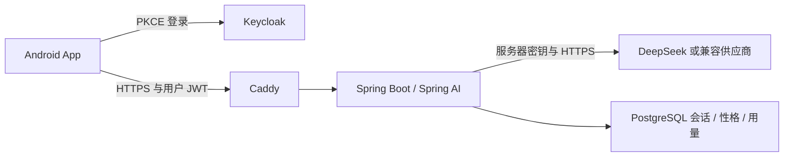

# App AI 功能开发方案

日期：2026-10-01。版本：1.1（审核修订）。状态：已核对当前代码并补齐实施约束；功能实现和 Android 验收待开展。

审核证据和问题关闭条件见 [App AI 方案审核报告](/E:/CC_testP/iot-manager/docs/APP-AI-PLAN-REVIEW-2026-10-01.md)。本文件中的“新增”“整改”均为开发要求。

## 1. 目标与首版范围

**实施进展：** 已按本方案完成 App 页面、后端契约、恢复与性格功能，并执行模拟及构建验证。当前代码、测试、安装包与尚未完成的原生验收见 [开发与验收记录](APP-AI-IMPLEMENTATION-2026-10-01.md)。本文后续“尚未执行”描述保留方案审核时的证据状态。

在现有 Android App（JavaScript / Vite / Capacitor 8）中完成可交付的 AI 助手。复用 Spring AI 后端与已配置的 DeepSeek 远程服务，App 通过项目服务器获得回答。更换供应商由服务器配置完成。

首版包含独立聊天页面、多轮文字问答、本人历史会话、服务状态、失败处理、AI 性格查看，以及 OWNER / ADMIN 的性格编辑和版本启用。知识库仍按既有决定关闭，界面明确说明站点文档暂不可用。设备控制继续使用现有授权和命令流程；AI 的设备能力为只读解释。

实施默认先在当前 Windows Docker 服务与 Android 测试设备之间联调，正式发布使用手机可访问的 HTTPS 域名。具体测试域名、地址和发布签名在对应阶段确定，不虚构地址。

## 2. 当前实现与实际缺口

| 当前证据 | 已有能力 | 本轮整改 |
| --- | --- | --- |
| `client/src/js/ai-chat-panel.js` | 悬浮按钮、提问、连续追问、新会话、引用文本、请求中断与迟到结果过滤。 | 接入正式导航，显示完整对话；补充发送状态、防连点、历史入口与服务状态。 |
| `client/src/main.js`、`client/src/js/ui.js` | 统一视图模型、导航、生命周期、登录、切站点和切服务器流程。 | AI 进入既有状态和导航体系，统一处理返回键、键盘、上下文失效及局部更新。 |
| `client/src/js/api.js` | 问答及单个会话读取、删除；支持用户令牌、401 刷新和 Retry-After。 | 补充 AI 状态、会话列表、消息分页、请求结果查询及性格接口。 |
| `backend/.../ai/AiController.java` | 问答、单会话、性格版本；知识库开关和站点访问校验。 | 增加本人会话列表与分页；补充重复请求处理。 |
| `AiRepository.messages()` | 单个会话读取最近 12 条消息，按时间倒序查询。 | 展示历史采用独立分页，不能把当前接口当作完整聊天记录；模型上下文仍限制容量。 |
| `AiChatService.chat()` | 先扣每日尝试额度，再查会话；生成后分步写入消息、用量和审计。部分本地解释直接返回。 | 明确请求登记、额度和消息提交的事务边界；本地回答同样保存历史；增加服务器会话并发约束。 |
| `AiManagementService` 与 `AiChatService` | 性格保存允许 4,000 字符；模型消息只取前 2,000 字符。 | 保留现有 4,000 字符契约，实际调用传入完整有效指令，校验整体上下文预算，消除静默截断。 |
| `AiManagementService.activatePersona()` | 保存有版本冲突校验；启用操作只有站点锁。 | 新 App 的启用操作增加预期当前启用版本，防止覆盖其他管理员的选择。 |
| `OidcSessionManager.beginLogin()` / `logout()` | 授权导航调用未等待异步完成。 | 接入原生浏览器时同步修改异步导航契约及失败、关闭处理。 |
| `client/capacitor.config.js` | `CapacitorHttp.enabled=true`，原生网络路径已启用。 | 在 Android 上验证请求、超时与中断语义，不能用浏览器测试替代。 |
| Android 配置 | `compileSdk` / `targetSdk` 为 36，已有 PKCE 自定义协议回调与 Keystore 会话存储。 | 核对 SDK、JDK、构建工具和签名；产出包含本轮页面的新 APK。 |

2026-09-30 的部署记录证明 Docker Web 页面到 DeepSeek 的真实聊天链路通过；该结果不等于 Android APK 已验收。本轮只做代码、配置和方案核对，没有重新执行真实模型调用或 Android 测试。

## 3. App 页面与交互

### 3.1 主入口

底部导航建议调整为“设备 / AI 助手 / 动态 / 添加”。桌面布局同步增加 AI 导航。使用现有颜色、字号、Lucide 图标和动效规则，AI 页面通过 `createClientUi` 构建，替换独立注入到 `document.body` 的悬浮面板。

AI 页面顶部显示当前组织、站点、配置状态和本会话性格版本；提供“历史”“新会话”“性格设置”。正文为消息列表，底部为输入框、字符计数和发送按钮。首版安全渲染纯文本并支持复制回答。

### 3.2 状态与发送规则

- 状态区分：尚未配置服务器、需要登录、未选授权站点、离线、AI 未开启、已配置、等待回答、失败、结果待确认。入口保留解释，帮助用户找到下一步。
- `/ai/status` 的 `CONFIGURED_REMOTE` 显示为“服务已配置”；只有真实问答成功才能说明本次调用成功。
- 问题长度默认上限为 2,000，实际值从服务端能力接口读取；长度计数遵循现有 Java / JavaScript 的 UTF-16 规则，补测 emoji 边界。空白问题不能提交。页面等待时禁用发送；服务器同时约束多设备对同一会话的发送，见第 4.4 节。
- 按真实服务器响应展示答案，保持连续追问的 `conversationId`。新会话和删除历史是两个独立操作；删除本人服务器记录需要明确确认。
- “取消等待”清理本地等待与迟到结果，不能承诺停止服务器生成或取消供应商费用。保留结果查询入口；恢复网络、切回前台时只查询已有请求，不自动再次提交问题。
- 文本和草稿保存在本次页面内存；冷启动需要恢复的会话 ID、请求 ID、提交时间等最小元数据按第 4.1 节分区，最多恢复 24 小时内的任务并遵循服务器 `expiresAt`。聊天正文在重新授权后从服务器读取，注销时清除恢复元数据。

### 3.3 AI 性格

所有站点成员可查看当前性格名称；OWNER / ADMIN 可填写名称、语气和回答风格，保存新版本并明确启用。保存沿用 `expectedVersion`，其值为已读取的最新保存版本；启用新增可选请求字段 `expectedActiveVersion`，其值为已读取的当前启用版本（无启用版本时为 0）。后端在同一个站点锁和短事务内比较，冲突返回 409 并要求重新加载。两种版本不能混用。旧客户端省略启用预期版本时保留原有按提交顺序覆盖的兼容行为。

新会话采用请求登记时的当前启用版本；旧会话沿用创建时固定的版本，包括 `personaVersion=null` 的默认性格。页面分别显示“当前站点性格”和“本会话性格”，避免更改后误以为所有旧对话立即生效。性格控制表达方式，设备授权和固定安全规则仍由后端执行。

## 4. 实现结构与接口改动

### 4.1 App 模块

| 文件或模块 | 职责 |
| --- | --- |
| `client/src/js/ai/ai-state.js`（新增） | 状态机、消息、当前会话、请求状态、上下文版本与失效清理；可独立测试。 |
| `client/src/js/ai/ai-controller.js`（新增） | 调用 API，防重复发送、结果恢复、错误映射和状态发布。 |
| `client/src/js/ai/ai-view.js`（新增） | 按视图模型构建聊天、历史和性格视图，不直接调用网络或设备适配器。 |
| `client/src/js/api.js` | 复用统一认证请求，新增明确的 AI 方法。 |
| `client/src/main.js` | 将 AI 绑定到登录、服务器、组织、站点及 App 生命周期。 |
| `client/src/js/ui.js`、`navigation-state.js`、`motion.js`、现有 CSS | AI 路由、子页面、导航动效、局部更新、焦点、键盘与安全区适配。 |

恢复元数据使用稳定分区：规范化 API 地址、OIDC issuer / clientId、经现有登录流程与 `/api/v1/me` 核验的用户 subject、组织和站点。仅服务器配置 ID 不足以识别被改过地址的服务器；访问令牌也不能作为分区键。恢复前重新检查本人和站点授权。

异步结果另带本次内存上下文修订号及任务 ID；修订号用于丢弃迟到结果，不写入冷启动恢复键。换账号、注销、切站点或切服务器时，清理当前内容、停止轮询并递增修订号。Token 刷新复用现有 `OidcSessionManager` 与原生安全存储，不使同一身份的会话失效。

### 4.2 后端接口

以下路径均在 `/api/v1/sites/{siteId}/ai` 下。既有接口保留兼容，新增分页字段不能破坏现有 Web 页面。

| 接口 | 状态 | 用途与约束 |
| --- | --- | --- |
| `GET /status` | 已有，保持原响应 | 保留 `enabled`、`knowledgeEnabled`、`state` 三字段契约。配置状态不代表供应商实时可用。 |
| `GET /capabilities` | 新增 | 返回契约版本、功能开关和长度 / 分页 / 恢复限制；AI 关闭时仍可读取，必须校验站点授权。 |
| `POST /chat` | 已有，兼容扩展 | 新 App 必须发送 UUID 格式的 `Idempotency-Key`；旧客户端无该字段时维持同步回答路径。 |
| `GET /conversations?cursor=...&limit=20` | 新增 | 本人当前站点的会话列表，含标题、更新时间和性格版本。标题由首条问题生成简短文本。 |
| `GET /conversations/{id}/messages?cursor=...&limit=...` | 新增 | 稳定排序分页，返回消息 ID、角色、时间和正文。服务端同时校验站点和会话所有者。 |
| `GET /conversations/{id}`、`DELETE /conversations/{id}` | 已有，复用 | 兼容当前读取接口与本人删除操作。 |
| `GET /requests/{clientRequestId}` | 新增 | 查询发送任务及原回答；`clientRequestId` 与幂等键相同，只允许原用户在原站点查询。 |
| `GET /persona`、`GET /persona/versions`、`PUT /persona`、`POST /persona/{version}/activate` | 已有，兼容扩展 | 管理操作限制 OWNER / ADMIN；启用增加可选 `expectedActiveVersion` 校验。 |

### 4.3 响应、恢复与旧版本兼容

新 App 的能力接口响应包含 `contractVersion`、`features`、`limits`；限值由真实服务器配置生成，默认问题 2,000、回答 8,000、性格指令 4,000、名称 80、分页最多 100 条；新增项目总输入预算 `maxInputChars` 默认 16,000（包含规则和格式开销），并在实现阶段核对所选模型的上下文与输出 token 配置。接口不调用模型，不返回密钥或供应商连接配置。旧服务器能力接口返回 404 时展示升级提示并禁用需要新契约的操作；基础问答可保留，但必须说明不具备请求恢复能力。

| 响应 | 契约与处理 |
| --- | --- |
| `POST /chat` 200 | 保留现有 `Reply` 字段；带幂等键的新契约可增加 `contextNotice: "HISTORY_OMITTED_OVERSIZE"`，告知超长历史未进入本次输入。成功重放返回原完整响应及同一个 `requestId`，不新增消息或模型调用。旧无键响应保持原字段。 |
| 带幂等键的 `POST /chat` 202 | 返回 `{clientRequestId, requestId, conversationId, state: "PROCESSING", retryAfterSeconds, expiresAt}`；只表示等待，不能作为回答显示。 |
| `GET /requests/{clientRequestId}` 200 | 返回任务标识、会话、原问题、`state`、`expiresAt`，便于从服务器恢复等待 / 失败状态；成功时带原 `result: Reply`，失败时带稳定错误码。状态为 `PROCESSING / SUCCEEDED / FAILED / UNKNOWN`。 |
| 409 | 分别用 `IDEMPOTENCY_CONFLICT / CONVERSATION_BUSY / PERSONA_VERSION_CONFLICT` 标明输入冲突、会话正在处理或性格冲突；不触发自动提交。 |
| 410 | 本人任务已删除或超过恢复期限，返回 `DELETED / EXPIRED`；清除本地恢复入口，不能恢复正文或重新派发。 |
| 404 / 403 | 未存在或非本人的任务统一 404；失去站点权限返回现有授权错误，清理该站点恢复状态。 |

`ApiClient.request()` 当前将所有 2xx 当作成功载荷返回。新增 AI 方法和控制器必须显式区分 200 回答与 202 任务；不改变设备等既有 API 的返回语义。无幂等键的旧客户端不返回 202，同会话忙碌时返回 409。

前台仅对 `PROCESSING` 做 GET 查询，使用 3 / 5 / 10 / 30 秒退避并遵循 `Retry-After`；后台、退出页面或上下文失效时暂停。超时后仍使用原键查询；`UNKNOWN` 表示供应商结果或费用无法确认，只有用户明确选择再次提问才创建新键，并提示可能重复产生费用。`FAILED` 的同键请求返回原失败；修改问题或明确重试使用新键。原有 401 刷新后重试保留请求键，其他网络或供应商错误不自动重发 POST。

### 4.4 请求事务与会话并发

1. **先鉴权和识别重放。** 先校验站点、JWT 用户、键格式和问题长度，再在该用户 / 站点内查原请求；已有键按摘要和终态处理，已删除或过期返回 410，不先查已被删除的会话而误返回 404。仅新请求检查既有会话所有权，以 `(site_id, actor_subject, idempotency_key)` 唯一约束登记。摘要包含规范化问题（仅 trim）和调用方传入的会话 ID（新会话为 null）；不要把首次创建的会话 ID 改入摘要，确保首问重放匹配。同键不同摘要返回 409。
2. **短事务登记。** 重放和查询先走已有记录，不预占每日额度和模型并发名额。新请求在一致锁顺序下登记请求（含原问题、摘要、原会话输入、固定服务器 requestId、阶段与期限）、占用会话任务槽、固定性格和创建必要会话，并预占一次每日 `CHAT_ATTEMPT`；任一拒绝整体回滚。延续当前 UTC 日窗口。无效会话、重复键和忙碌冲突不扣额度；已接受的本地回答或生成失败仍计一次尝试。该次数与供应商 token / 费用分开。
3. **跨设备串行。** 同一会话最多一个活动请求，使用数据库任务槽 / 租约和持有者标识，覆盖多台手机、多标签页及旧 Web 请求。第二个不同请求返回 409。同键返回原状态。锁顺序统一为站点、会话、请求；生成期间释放数据库锁和事务，不把站点锁一直持有到供应商返回。
4. **调用与故障界线。** 在调用前持久记录派发阶段，随后在事务外调用供应商。默认请求处理期限 120 秒，必须大于实际模型调用超时；实现时冻结配置关系。到期或进程崩溃后，确认未派发的任务终结为 `FAILED`，可能已派发的终结为 `UNKNOWN`；回收任务槽并使旧持有者失效。不能把所有超时当作可安全重试，也不能永久停留在处理中。
5. **原子完成。** 短事务内验证任务持有者、会话未删除和任务仍可完成，再保存用户 / 助手消息对、消息序号、结果关联、供应商用量、审计及 `SUCCEEDED`，一起提交。提交失败不出现半轮对话或可见成功；已派发但结果未落库按不确定处理。迟到持有者不能写入。此边界只能保证项目侧结果一致性，不能保证供应商计费在所有故障下恰好一次。
6. **本地回答走同一结果流程。** 知识库关闭、设备匹配不唯一、没有足够设备证据等本地解释也产生会话、固定性格版本、消息对和可恢复结果；标记 `LOCAL`。本轮知识库关闭范围内，本地路径先判断规则，不调用 Chat / Embedding，也不生成供应商用量。失败任务显示发送失败，不能伪造助手回答。

### 4.5 历史、保留和迁移

- **消息分页：** 新消息在完成事务中分配会话内递增序号，消息序号唯一；游标带初次读取的序号上界并校验站点 / 会话。不能只按可能相同的时间戳分页。列表默认 20 条、最多 100 条，按 `(updated_at, id)` 游标分页、客户端按 ID 去重；查询期间变动的会话通过刷新首屏体现，不承诺列表跨请求的完整快照。
- **历史与上下文：** 页面读取全部保留历史的分页。模型优先选择最近完整轮次，在最多 12 条、历史正文 4,000 字符预算内从最新向前取，最后恢复时间顺序。遇到最近一轮超过预算时不跳过它去取更旧轮次，首版不带历史并显示上下文长度提示；记录仍可查看。性格传入完整有效 4,000 字符，整体输入预算覆盖安全规则、性格、证据和当前问题，超出时明确拒绝，不能静默截断性格。
- **删除与保留：** 继续使用可配置会话保留期（当前默认 30 天）。本人删除和定期清理在事务内同步移除问题、答案、标题及请求中的正文 / 引用，并将关联请求标为 `DELETED / EXPIRED`、废止活动任务持有者，防止迟到结果重新写入。任务恢复到期也清除请求正文，幂等记录或最小墓碑至少保留 30 天；墓碑仅含归属、键摘要、终态和到期时间。查询与同键重放在墓碑有效期限内返回 410。墓碑清理后返回 404；App 不在 24 小时恢复窗口外自动重放。
- **数据库兼容：** 采用后续 Flyway 迁移增加请求表、任务槽、消息序号和索引；保留 V26 / V27 内容。旧消息以 `(created_at, id)` 确定性回填序号；相同时间的旧记录无法证明真实先后，只保留展示并把无法配对的轮次排除出模型上下文。新增字段允许旧后端写入；若回退产生无序号消息，重新升级后先完成补序，再宣布分页能力就绪。旧读取接口保持最近消息响应。
- **部署顺序：** 服务端先部署兼容增量并通过旧 Web / 旧 App 回归，再发布新 App。后端切换时暂停新 AI 请求并等待在途调用终结；同一阶段接收聊天的实例必须遵循同一个任务槽契约。新 App 按能力接口启用功能；回退前验证旧后端可运行在已迁移数据库上，不删除已迁移表或修改已执行迁移。回退期间请求恢复不可用时明确展示状态，停止自动操作。App 发布回退采用旧代码重新构建、同签名及递增 `versionCode`，不能把降低版本号的旧 APK 覆盖视为正常升级回退。

## 5. 手机到服务器的连接与登录

手机上的 `localhost` 指向手机自身。当前集成 Caddy 与 Keycloak 使用固定 `iot-manager.localhost`，真机接入需要一个手机可以解析并验证证书的服务器地址。地址变更须同时核对 Caddy、Keycloak 公共 hostname / issuer、Backend JWT issuer、App API / WebSocket / OIDC 配置与精确 Origin 白名单。

推荐正式环境使用受信任的 HTTPS 域名。局域网测试若采用内部 CA，要分别验证 App 和登录浏览器的信任链：App 的 Debug CA 配置只解决 App 的网络信任。Android 提供 Debug 专用信任锚配置，正式 APK 使用系统信任链；具体实现依据[Android 网络安全配置](https://developer.android.com/privacy-and-security/security-config)。

登录沿用 Authorization Code + PKCE、`iot-mobile` 公共客户端和 `com.iot.manager.client://oauth/callback`。原生授权导航封装为浏览器打开流程，可采用官方 [Capacitor Browser](https://capacitorjs.com/docs/apis/browser) 插件；其 `open()` 返回 Promise，`beginLogin()` 和 `logout()` 必须等待导航并处理打开失败。失败时只清理对应待完成 PKCE 事务；关闭浏览器时区分取消登录与已收到回调，不能清除另一流程或已建立的会话。限制同时发起一条授权流程。

保留 `appUrlOpen` 与 `getLaunchUrl` 对热启动、冷启动回调的处理，并继续核验 state、nonce、issuer；回调已经收到并正在兑换令牌时，关闭事件不得提前清理该事务。浏览器首屏加载事件不能作为登录成功证据。页面通过既有 `/api/v1/me` 获取身份与权限信息，App 只接收项目登录令牌及公开端点元数据。

当前已开启的 [CapacitorHttp](https://capacitorjs.com/docs/apis/http) 会将 fetch / XMLHttpRequest 接到原生网络实现，因此请求中断、超时、断网和重试必须在 Android 上验收。[Capacitor App](https://capacitorjs.com/docs/apis/app) 的返回键监听接管默认行为，AI 页面需进入现有 `ui.back()` 导航体系。

初次方案核对发现当时进程没有 `ANDROID_HOME` / `ANDROID_SDK_ROOT`，项目也没有 `client/android/local.properties`。该记录不能证明系统未安装 SDK；实施前重新定位并验证已有 SDK、Platform 36、构建工具及 Gradle 所需 JDK，再按需要补齐。发布包使用受保护签名配置。覆盖安装要求相同 `applicationId`、相同签名证书及更高 `versionCode`；当前 Debug / Release 配置不能保证任意旧包可以互相覆盖，必须核对已安装包证书和版本，保留原包及配置备份。

## 6. 错误处理与现有业务冲突

| 问题 | 方案 |
| --- | --- |
| 原悬浮面板覆盖底部导航、没有参与返回栈 | 改为 AI 主页面及历史 / 性格子页面；统一安全区和返回行为。 |
| 设备实时刷新重建聊天输入或使消息滚动跳动 | AI 采用独立资源状态与局部更新；输入焦点和消息列表只在相关变化时更新。 |
| 未登录与供应商认证失败混淆 | App 401 先刷新一次，失败后提示重新登录；502 / 503 等 AI 服务错误显示服务不可用及请求编号。 |
| 限流、预算耗尽和供应商忙碌 | 解析 429 / 503 与 Retry-After，显示等待时间；用户明确操作后才发送。 |
| 网络超时后重发造成重复计费 | 同键查询及复用已有结果，结果未确定时显示待确认；发送按钮防连点。 |
| 多设备追问同一会话打乱消息，或生成期间删除历史 | 后端任务槽串行、原子提交消息对；删除使任务持有者失效，同键不恢复已删除正文。 |
| 本地解释消失或最新上下文被旧消息占满 | 本地回答保存为完整轮次；优先选择最近完整历史，超长轮次明确提示。 |
| 切站点或注销后旧答案返回 | 使用上下文修订号、请求标识和身份隔离验证，所有显示动作均校验当前上下文。 |
| 性格保存长度与模型实际输入不一致 | 使用完整合法的 4,000 字符性格并校验上下文预算；App 与控制台同步字数提示。 |
| 旧服务器、Web 或 APK 与新契约冲突 | 保持旧响应，能力接口控制新功能；核对 APK 签名和版本，验证兼容升级与回退。 |

## 7. 开发顺序与完成标准

| 阶段 | 开发任务 | 完成标准 |
| --- | --- | --- |
| 1：契约和连接 | 冻结能力、响应、分页、事务和恢复契约；确定手机端点，核对 SDK 与异步登录导航。 | 模拟契约可执行；原生验收前完成 HTTPS / PKCE / 授权站点读取。 |
| 2：后端配套 | 列表、分页、请求登记、任务槽及恢复；本地回答保存、性格长度与最近上下文修复。 | 跨站 / 跨用户拒绝，额度、删除竞争和故障用例通过，原有接口兼容。 |
| 3：App 问答 | AI 正式导航、消息列表、发送状态、历史、新会话和错误提示。 | 模拟环境下可以连续对话；重复点击、断网和上下文切换不会显示错误数据。 |
| 4：性格与 Android 适配 | 保存 / 启用版本冲突、异步登录浏览器、返回键、软键盘、前后台与恢复。 | 四角色权限、登录失败 / 取消、热 / 冷启动及长文本输入通过真实 Android 验收。 |
| 5：真实联调与交付 | 使用新 APK 执行少量通用提问；检查用量、审计、升级和回退。 | App 经服务器取得 DeepSeek 回答，无 Embedding 调用；交付 APK、版本、校验值与验收记录。 |

功能开发可先使用模拟服务器完成第 2～4 阶段中的界面与状态部分；真机连接和安装条件是对应验收的前置条件。

## 8. 测试方案

1. **客户端状态测试：** 空问题、长度及 emoji 边界、连点、200 / 202 分支、延迟回答、取消 / 新会话、换账号 / 站点 / 服务器、令牌刷新保持原键、前台退避与后台停止查询。重启后的稳定分区恢复、地址被修改及 24 小时窗口单独验证。
2. **后端事务测试：** 同键并发仅一次尝试和模型调用；重放 / 查询不扣额度；无效或他人会话不扣额度；第二个不同键并发追问返回忙碌；消息对、用量、审计及结果提交故障均不出现半轮记录。保留全局模型并发限制。
3. **后端恢复与删除测试：** 调用前 / 调用后崩溃、超时期限、失效持有者、删除和定期清理与生成竞争；已删除正文不能经结果查询或重放读出，不能重新生成。验证 410 墓碑与过期清理 404、跨用户 / 跨站隔离。
4. **历史与性格测试：** 本地回答保存且零供应商调用；相同时间消息、序号分页和旧数据回填；超过 12 条和 4,000 字符时保留最近完整轮次。保存与启用分别执行双管理员冲突，默认性格固定；完整 4,000 字符指令含尾部标记送入模拟模型，并验证整体输入超限行为。
5. **浏览器与兼容测试：** 聊天导航、焦点、滚动、历史、恶意文本安全渲染；404 / 409 / 410 / 429 / 502 / 503 / 504；AI 关闭时状态和能力仍可查询。旧 Web、无键同步响应、新 App 对旧后端的能力降级及数据库升级 / 后端回退通过。
6. **Android 测试：** 一台模拟器和一台真机；PKCE 热 / 冷启动、浏览器打开拒绝 / 用户取消 / 回调与关闭竞争、证书、原生 HTTP 超时 / 中断、系统返回、键盘、安全区、旋转、前后台、网络切换、进程重启。记录签名、版本与覆盖安装结果。
7. **真实联调和主业务回归：** 使用服务器已配置的 DeepSeek 执行少量通用提问，检查请求、历史与用量，无 Embedding 调用；设备列表、BLE、设备命令、天气、站点切换和退出登录保持正常。其余测试使用模拟模型。

验收必须给出新 APK 的实际运行结果；浏览器通过不能替代原生 HTTP 与真机测试。后续迭代再加入知识库上传 / 引用查看、设备详情快捷提问、流式回答及语音等能力，分别补足供应商与传输契约。

## 9. 方案自检

| 自检项 | 结论 |
| --- | --- |
| 与当前 App 框架衔接 | 已按 `createClientUi`、视图模型、导航、动效与生命周期核对，采用现有模块体系。 |
| 后端功能是否被误当作已有 | 能力、列表、分页、请求恢复、会话任务槽及启用版本保护均标为新增或兼容扩展。 |
| 站点、身份和性格 | 服务端校验归属；恢复分区与内存修订号分开；保存 / 启用使用不同预期版本；旧会话固定版本。 |
| 原生环境差异 | 地址 / TLS、异步浏览器打开、回调、返回键和 CapacitorHttp 均设独立 Android 验收。 |
| 请求、额度和消息 | 登记 / 完成采用短事务，供应商调用在事务外；重放不扣额度，消息对原子保存，多设备会话串行。 |
| 取消、超时和删除 | 取消只影响本地；有界期限终结不确定任务；删除同步清除结果正文并阻止迟到写入。 |
| 历史和上下文 | 本地回答保留历史；消息序号稳定分页；模型优先最新完整轮次，完整性格或明确超限错误。 |
| 数据库和客户端兼容 | 追加迁移、旧响应不变、能力降级；服务端先部署，核对 APK 签名 / 版本并验证回退。 |
| 当前证据范围 | 已完成静态审核和文档交叉核对；新接口、功能测试、SDK 构建及新 APK 验收尚未执行。 |

本轮交付为开发方案；功能实现与运行验收按上述阶段执行。
