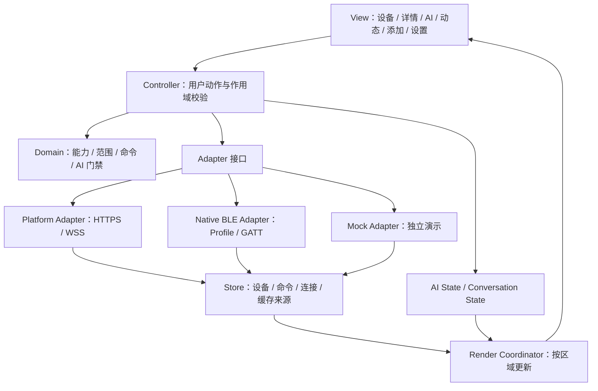

# IoT Manager App 开发框架、数据契约与实施汇总

版本：v1.0 · 汇总日期：2026-10-02 · 适用端：Android/PDA 与浏览器客户端。

**建议采用：原生 JavaScript ES Modules + 原生 DOM/CSS + 分层 Store/Controller/Adapter + Capacitor 8。界面按“导航轻毛玻璃、内容稳定高对比”实现，设备控制保留原生 range、能力模型和命令回执；独立演示通过 Mock Adapter 复现相同契约。**

这条路线与当前 App 的模块、离线缓存、原生 BLE、OIDC 和局部渲染相容。开发重点是补齐状态与接口边界，逐步拆分页面职责，复用已有逻辑；UI 框架迁移没有列入本轮实施范围。

本文是技术选型与开发约束汇总。表中的“当前”来自本次读取的源码、锁文件及配置，“建议/拟新增”表示待实施；历史测试结果不代表新代码已通过。本次仅交付这一份 Markdown，没有调整依赖或业务源码。

## 1. 汇总依据与当前结论

| 输入文件 | 可采用内容 | 使用方式 |
| --- | --- | --- |
| [v1.2 开发方案](E:/CC_testP/iot-manager/docs/CLIENT-APPLE-GLASS-DEVELOPMENT-DOCUMENT-2026-10-01.md) | 分层设计、原生滑块、取消守卫、AI 草稿、材质模式、验收矩阵 | 作为行为与视觉约束；双列示例需按本文第 7 节修正 |
| [独立组件](E:/CC_testP/iot-manager/client/apple-glass-standalone.js) | ES Modules、DOM 工厂、可注入文档对象的组件组织思路 | 接口及视觉参考；命令、滑块、AI 状态不能原样接入 |
| [预览页](E:/CC_testP/iot-manager/client/apple-glass-preview.html) | 页面组合与模拟场景素材 | 改为受 Store 驱动的演示，统一组件参数及回调 |
| [组件测试](E:/CC_testP/iot-manager/client/test/apple-glass-standalone.test.js) | 样式注入与组件正常路径冒烟 | 补充真实 DOM、预览接线和异常状态测试 |
| [深度审核](E:/CC_testP/iot-manager/docs/CLIENT-APPLE-GLASS-STANDALONE-DEEP-REVIEW-2026-10-02.md) | 16 个问题、复现证据与优先级 | 作为开发整改清单，见第 9 节 |

前次审核记录：原测试 10/10 通过；专项检查 49 项中 6 通过、43 未达预期，归并为 4 个 P1 和 12 个 P2。该结果仅对应 `client/` 根目录的待审组件与预览，不等于项目全量结果，也不等于 `demos/client-apple-glass/` 的测试结果。

## 2. 推荐技术栈与版本数据

### 2.1 客户端与原生构建

| 层次 | 当前基线 | 建议 |
| --- | --- | --- |
| UI 与语言 | JavaScript，`type=module`，原生 DOM/CSS | 沿用 ES Modules；通过 JSDoc 定义输入/输出，关键边界增加运行时验证 |
| 页面状态 | 自有 Store、导航状态、渲染协调器及 AI Controller | 统一状态来源，页面只展示数据、派发动作；避免组件内私藏业务状态 |
| 构建 | Vite **5.4.21**，package 声明 `^5.1.0` | 当前锁文件用于复现；长期目标迁移至官方支持分支，审核时优先评估 **8.3.x** |
| Node.js | 前次审核运行 **24.14.0** | 团队统一 Node **24.x** 并固定具体补丁；兼容验证环境可用 **22.12+** |
| Native shell | Capacitor core/android/cli **8.4.2** | 保留 Capacitor **8.x** 架构；核心包版本对齐，插件兼容性按锁文件和回归确认 |
| BLE | `@capacitor-community/bluetooth-le` **8.2.0** | 通过 Native BLE Adapter 使用，设备 Profile 决定能力与协议 |
| 应用生命周期 | `@capacitor/app` **8.1.1** | 前后台切换统一管理请求、订阅与动画 |
| 系统浏览器 | `@capacitor/browser` **8.0.4** | 沿用认证及外部页面入口 |
| 定位 | `@capacitor/geolocation` **8.2.1** | 由用户触发，并呈现许可、失败及定位来源 |
| 网络 | `@capacitor/network` **8.0.1** | 作为网络提示；业务可用性仍看端点、数据新鲜度与实际请求 |
| 非敏感设置 | `@capacitor/preferences` **8.0.1** | 端点和普通设置；认证凭据沿用 SecureSessionStore |
| 缓存 | `idb` **8.0.3** / IndexedDB | 沿用 CacheRepository 的作用域分区与 schema 迁移 |
| 图标 | `lucide` **1.26.0** | 使用可信内部图标定义，普通数据不作为 SVG/HTML 执行 |
| 浏览器测试 | Playwright **1.62.0** | 真实 DOM 集成测试、失败截图/trace、响应式和异常状态测试 |
| 单元测试 | Node.js `node:test`；fake-indexeddb **6.2.5** | 纯逻辑、状态机、缓存、Adapter 合约测试 |
| Android SDK | min **24**；compile/target **36** | 保留当前基线；最低 API 配置不等于所有 PDA 型号已验收 |
| Android 工具链 | AGP **8.13.0**；Gradle **8.14.3**；Java 编译目标 **21** | 保持已配置的组合，Android 构建使用匹配 JDK 21 |
| Android Studio | 本次未查询本机安装版本 | Capacitor 8 官方最低 **2025.2.1**，选择兼容该 Gradle/JDK 的版本 |
| App 标识/版本 | `com.iot.manager.client`；版本名 **1.1.3**；默认 versionCode **5** | 发版走现有覆盖参数和签名流程；不可复用旧 versionCode 替代新发布记录 |

版本依据：[package 与脚本](E:/CC_testP/iot-manager/client/package.json)、[实际锁定版本](E:/CC_testP/iot-manager/client/package-lock.json)、[Capacitor 配置](E:/CC_testP/iot-manager/client/capacitor.config.js)、[SDK 配置](E:/CC_testP/iot-manager/client/android/variables.gradle)、[AGP](E:/CC_testP/iot-manager/client/android/build.gradle)、[Gradle](E:/CC_testP/iot-manager/client/android/gradle/wrapper/gradle-wrapper.properties)、[Java 21 目标](E:/CC_testP/iot-manager/client/android/app/capacitor.build.gradle)、[App 版本配置](E:/CC_testP/iot-manager/client/android/app/build.gradle)。

Capacitor 8 要求 Node 22+，当前 Vite 文档要求 Node 20.19+ / 22.12+；两者组合采用 Node 24.x 或符合要求的 22.x。Android Studio、SDK、AGP 和 Gradle 的基线与官方升级指南相符。[Capacitor 8 升级要求](https://capacitorjs.com/docs/updating/8-0)、[Vite 环境要求](https://vite.dev/guide/)。

**Vite 5 是复现基线，不是长期推荐版本。** 官方支持列表已不包含 Vite 5；审核时 8.3 获常规更新。先在隔离工程验证升级，再核对 Vite 插件、构建输出、最低 WebView 和 Capacitor 同步，升级作为独立变更记录。本文没有宣称 8.3.x 已在本项目验证通过。[Vite 官方支持策略](https://vite.dev/releases)。

### 2.2 后端及现场链路

| 模块 | 当前配置/架构 | 与 App 的边界 |
| --- | --- | --- |
| 后端 | Spring Boot **3.5.16**，Java 目标 **17** | 设备、站点、权限、命令、遥测、活动、天气和 AI API |
| AI 服务 | Spring AI **1.1.8**，服务端模型调用 | 模型密钥留在后端；客户端问答和请求查询沿用站点范围 |
| 数据库 | PostgreSQL **16**，Flyway | 服务端维护主数据与审计；App 缓存仅为受限副本 |
| 认证 | Keycloak OIDC/PKCE、JWT 与站点角色校验 | App 使用现有会话服务；UI 可用性不替代后端授权 |
| 实时链路 | HTTPS + WSS | App 接收状态更新；断线后标注新鲜度并重新同步 |
| Edge Agent | Java 目标 **17**，站点代理通过 outbound WSS 连接平台 | 平台设备控制经后端/边缘；App 不直接绕过代理发送 LAN 协议 |
| 本地设备 | Android Native BLE + Profile registry | 本地 BLE 控制通过独立路由及连接许可 |

后端与边缘版本来自 [Backend POM](E:/CC_testP/iot-manager/backend/pom.xml)、[Edge POM](E:/CC_testP/iot-manager/edge-agent/pom.xml)；架构及数据库基线见 [README](E:/CC_testP/iot-manager/README.md) 和 [部署配置](E:/CC_testP/iot-manager/deploy/docker-compose.yml)。这些是配置快照，不是本轮后端运行验收。Android JDK 21 与后端 Java 17 目标属于不同构建环境。

## 3. 适合本 App 的分层架构



界面变化必须来自 Store 或 AI Controller。组件回调表达用户意图，不能自行把状态改为“已执行”。Adapter 负责请求、设备协议和返回结果，Domain 负责能力、范围及状态规则；认证和服务端授权仍沿用现有边界。

渲染保留现有区域、稳定节点标识和根节点事件委托。普通遥测只更新需要的区域；活动 range、输入焦点、草稿和滚动位置按现有协调器处理。安全状态变化必须立即校验，不能等待遥测批处理窗口才禁用控制。

### 3.1 现有模块的保留职责

以下路径均位于 `E:/CC_testP/iot-manager/client/src/`。

| 模块 | 保留/完善职责 |
| --- | --- |
| `main.js` | 应用组装、上下文、Adapter 与页面动作桥接；逐步提取重复业务流程 |
| `js/store.js` | 单一设备/命令/运行状态来源，不可变快照及变化域 |
| `js/ui.js` | 原页面构建器、事件委托、局部更新、控制许可和焦点 |
| `js/render-coordinator.js` / `js/dom-reconcile.js` | 合并发布与区域协调，保留合法活动节点 |
| `js/device-capabilities.js` / `js/command-state.js` | 能力归一化、目标状态与已上报状态区分 |
| `js/platform/command-dispatcher.js` / `connection-resolver.js` | 幂等标识、端点/BLE 路由及提交 |
| `js/adapters/` | Platform、BLE、Native BLE、Profile 等实际链路 |
| `js/platform/cache-repository.js` / `runtime-config.js` | 分区缓存、端点配置、新鲜度与非敏感设置 |
| `js/ai/ai-state.js` / `ai-controller.js` / `ai-view.js` | AI 草稿、发送门禁、请求恢复、会话与渲染 |
| `js/navigation-state.js` | 主导航与子页面、作用域变化、滚动/焦点返回 |
| `js/auth/` | OIDC/PKCE、会话刷新、安全存储和退出清理 |
| `js/motion-policy.js` / `motion.js` | reduced/hidden/degraded 策略与短时反馈 |
| `css/style.css` / `css/ai.css` | 视觉变量、布局、可访问性和材质降级 |

拟新增纯模块：`range-contract.js`（范围定义）、`range-guard.js`（手势意图）、`ai/ai-quick-prompts.js`（稳定预设）。其中范围错误标记、材质入口等仍是待实施项，不能因文档已描述而标记为现有能力。

## 4. 数据模型与状态契约

本节是客户端归一化/视图模型约束，包含建议扩展，**不是要求直接改变后端 DTO**。现有服务端字段以 [DeviceView](E:/CC_testP/iot-manager/backend/src/main/java/com/iot/manager/dto/DeviceView.java)、[DeviceCommandView](E:/CC_testP/iot-manager/backend/src/main/java/com/iot/manager/dto/DeviceCommandView.java) 和客户端 Adapter 为准。

### 4.1 Context：身份及作用域

| 字段 | 类型/来源 | 约束 |
| --- | --- | --- |
| endpointId / apiBaseUrl | string，当前端点 | 切换端点使旧任务失效 |
| issuer / clientId / subject | string 或 null，OIDC | 区分认证服务器、客户端及登录身份 |
| organizationCode | string 或 null | 不以显示名称作为缓存身份 |
| siteId | 后端站点 ID | AI 的站点路径使用 ID |
| siteCode | string | 设备查询、天气及实时范围按现有接口使用 code |
| scopeKey / epoch | 派生 key / 任务代次，建议统一管理 | 导航与异步回调重读当前范围，旧回调不覆盖新范围 |

AI 继续使用现有 `aiScopeKey(apiBaseUrl, issuer, clientId, subject, organization, siteId)`。缓存继续使用端点、组织、API、authPartition、siteCode 的既有分区方式；不同子系统的 key 不必强行变成相同字符串，但必须由同一个有效 Context 派生。

### 4.2 Device 与 Capability

| 字段 | 类型 | 用途与规则 |
| --- | --- | --- |
| id / publicId / deviceId | 平台 id 为 Long；其余按 DTO；本地绑定按 Adapter | 保留服务端类型；UI 比较可使用 String key，不能混用 ID 与显示名称 |
| name / type / location / siteCode | string 或 null | 用 textContent 展示；按当前站点归属读取 |
| reportedState | object | 已上报事实；命令提交不能直接写入 |
| desiredState | object | 用户期望或待确认目标；与事实分别显示 |
| commandStatus / lastCommandId / commandError | 归一化状态、string、string/null | 由命令事件派生，不靠卡片颜色推断 |
| connections / protocol / profileId / profileVersion | array / string / 版本号 | 连接路由与协议能力来源 |
| lastSeen / updatedAt / cachedAt | 时间字段 / 本地缓存毫秒时间 | 展示来源、新鲜度和缓存状态 |
| capability.id / label | string | 稳定控制标识与可访问名称 |
| controlType | switch / range / select / action 等既有归一化值 | 按能力生成控件，监测仪表不默认生成控制开关 |
| commandType / parameterKey / stateKey / fixedParameters | string / object | 控制提交及结果字段映射 |
| min / max / step / options | number / array | 保留负数、小数与非整除上限，不统一取整为百分比 |
| writable / enabled | boolean | 与角色、链路、缓存、待确认共同决定可用性 |
| rangeDefinitionInvalid | boolean，拟新增 | 显式非法范围在归一化与缓存中保留，不被默认值掩盖 |
| readOnly / reason | 派生视图状态 | 说明不可控原因，不把缓存或断线显示为正常 |

范围有效条件为有限 min/max/step、max>min、step>0。缺失值可沿用既有默认值；显式非法值不能当成缺失值。原生 input 归一化后的实际值供 output、aria-valuetext、填充与提交统一使用。

### 4.3 Command 状态机

| 状态 | 含义 | UI 与数据行为 |
| --- | --- | --- |
| PENDING | 已形成提交任务，等待发送 | 显示目标待确认，限制同一设备/能力的冲突操作 |
| SENT | 已发送，等待结果 | reportedState 保持最新事实；查询原命令，不自动创建新命令 |
| ACKNOWLEDGED | 回执确认 | 根据明确返回的 reportedState 更新事实；不把目标值自动当回执 |
| FAILED | 已知失败 | 显示原因，保留已上报事实，是否重试由明确动作及有效许可决定 |
| UNCONFIRMED | 结果未知 | 不显示成功、不自动重发；按既有策略核实状态 |
| 其他服务端状态 | 例如 REJECTED | 在 Adapter/状态归一化中明确映射或显示未知，不能默认成功 |

命令至少包含 commandId、idempotencyKey、deviceId、type、parameters、status、desiredState/reportedState 和 error；时间字段按返回协议读取。一个逻辑提交保留同一个幂等身份；结果查询和恢复不能重新执行该意图。

取消、多指、页面销毁、站点/设备切换、能力/范围失效、只读或待确认变化均须废弃未提交意图。取消不产生 sendCommand；普通上报刷新若契约仍有效，可保留当前拖动。该规则是独立演示与真实 App 共用的行为约束。

### 4.4 AI 数据、门禁及默认限额

| 字段/约束 | 当前默认或类型 | 开发要求 |
| --- | --- | --- |
| enabled / loading / busy | boolean | 状态来自 Controller 与后端能力，不固定显示“已就绪” |
| draft | string | 页面之外保存，通过 setDraft 更新，拒绝发送时保留 |
| pending | object 或 null | 请求 ID、问题、提交时间、处理中状态；存在时阻止新提交 |
| conversationId / messages / history | ID / array | 会话持久状态与 DOM 分离，同范围返回页面后可复查 |
| retryAt / now | 毫秒时间 | 冷却期间可填写草稿，实际发送等待门禁放行 |
| maxQuestionChars | **2000** | 本地默认；使用后端能力协商后的限制校验 |
| maxPersonaChars / maxPersonaNameChars | **4000 / 80** | 管理页长度及权限校验 |
| maxPageSize | **100** | API 分页请求上限；现有默认请求 limit=20 |
| recoveryWindowSeconds | **86400** | 本地恢复默认窗口；恢复查询同一请求，不重复问答 |
| 快捷问题 | 稳定 id + label + prompt，拟新增共享定义 | 点击只填写草稿；不从 DOM 任意文本构造业务预设 |
| 发送入口 | enabled 且非 busy/loading/pending、非空、长度合法、冷却结束 | 点击/键盘走相同 Controller；IME composing Enter 不提交 |

依据：[AI 状态与默认限额](E:/CC_testP/iot-manager/client/src/js/ai/ai-state.js)、[AI Controller](E:/CC_testP/iot-manager/client/src/js/ai/ai-controller.js)。AI 角色、会话范围、请求恢复和性格版本沿用现有模块。AI 消息默认文本展示；快捷问题本身不执行设备控制。

生产配置中的 AI 与知识库默认关闭，开启及实际模型调用有独立验收范围，见 [application-prod.yml](E:/CC_testP/iot-manager/backend/src/main/resources/application-prod.yml)。独立演示使用“本地模拟回答”标记，不宣称已访问实时天气、告警、真实遥测或边缘网关。

### 4.5 Runtime、缓存与时间

| 数据 | 规则 |
| --- | --- |
| accessRoute | 沿用 **SITE_API / CLOUD_API / BLE_LOCAL**；演示模式用独立 simulated 标记，不混入生产路由枚举 |
| connectionHealth | 连接状态、stale、重连次数、连接/断线时间和 error；“网络在线”不等于数据已同步 |
| 平台缓存 | 分区保存设备和天气，标注 cachedAt 与 stale；缓存平台数据只读，恢复有效同步后重新判断 |
| 本地 BLE | 依据实际连接、Profile 和本地能力判断，不因平台离线而伪装平台连接成功 |
| 天气 | 保留室外参考、更新时间、缓存/过期说明；室内设备测量与天气不能混为一个事实 |
| 缺失数据 | 采用未知/未配置/尚未同步；没有完整告警数据时不显示“0 告警”，没有测量时不显示毫秒延迟 |
| 会话设置 | 材质 auto/solid 在本会话导航间保留；持久化属于后续独立需求 |
| 时间转换 | 建议归一化时间带明确时区/来源；当前 Java DTO 使用 LocalDateTime，须确认服务端时区，不能擅自附加 Z 当成 UTC |

缓存结构沿用 [CacheRepository](E:/CC_testP/iot-manager/client/src/js/platform/cache-repository.js)：当前数据库 schema version=2，包括 platformDevices、platformWeather、localBindings、localActivity。退出平台身份时清理相应平台范围；本地绑定按其独立 forget 流程处理。

### 4.6 内存演示数据示例

以下展示“设备事实上报为 40，目标为 70，命令仍等待回执”。这是归一化演示模型片段，**不是后端请求体或完整 App Store**；rangeDefinitionInvalid 为拟新增字段。

```json
{
  "simulated": true,
  "device": {
    "id": 1001,
    "name": "演示照明设备",
    "siteCode": "DEMO-A",
    "status": "ONLINE",
    "reportedState": { "level": 40 },
    "desiredState": { "level": 70 },
    "commandStatus": "SENT"
  },
  "capability": {
    "id": "level",
    "label": "照明强度",
    "controlType": "range",
    "commandType": "set_level",
    "parameterKey": "level",
    "stateKey": "level",
    "min": 0,
    "max": 100,
    "step": 1,
    "writable": true,
    "enabled": true,
    "rangeDefinitionInvalid": false
  },
  "command": {
    "commandId": "demo-command-001",
    "idempotencyKey": "demo-intent-001",
    "deviceId": 1001,
    "type": "set_level",
    "parameters": { "level": 70 },
    "status": "SENT"
  }
}
```

UI 显示“上报 40 / 目标 70 待确认”，并限制冲突控制。模拟 ACK 明确携带 reportedState 后才确认结果；失败或未知分支保留有效上报值。禁止初始化就出现“硬件 ACK 已完成”。

## 5. 接口与通信数据

### 5.1 平台接口基线

基础路径为 `/api/v1`，完整地址由 Endpoint Profile 决定。下表已存在于 [ApiClient](E:/CC_testP/iot-manager/client/src/js/api.js)，不是本轮新建接口。

| 功能 | 方法与相对路径 | 关键约束 |
| --- | --- | --- |
| 当前身份 | GET `/me` | 认证状态与角色来源 |
| 站点 | GET `/sites` | 使用实际返回的 ID/code |
| 设备列表/详情 | GET `/devices`；GET `/devices/{deviceId}` | 查询按原契约传入组织/站点等字段 |
| 命令提交 | POST `/devices/{deviceId}/commands` | body 为 type、idempotencyKey、parameters；设备能力定义参数 |
| 原命令查询 | GET `/commands/{commandId}` | 查询不生成新逻辑提交 |
| 活动 | GET `/devices/{deviceId}/activity` | 刷新完成后更新 Store，不能仅显示同步成功 |
| LAN 候选 | GET `/discovery/lan?siteCode=...` | 实际服务端发现数据，独立演示返回内存候选 |
| LAN 认领 | POST `/discovery/lan/{candidateId}/claim` | 认领成功后更新列表，处理拒绝/失败 |
| 天气/预报 | GET `/sites/{siteCode}/weather`；GET `/sites/{siteCode}/weather/forecast` | 与室内设备遥测区分 |
| 天气刷新/位置 | POST `/sites/{siteCode}/weather/refresh`；POST `/sites/{siteCode}/weather/location` | 冷却、许可、缓存和新鲜度沿用原流程 |
| AI 能力/状态 | GET `/sites/{siteId}/ai/capabilities`；GET `/sites/{siteId}/ai/status` | 读取 enabled、features 与限制 |
| AI 问答 | POST `/sites/{siteId}/ai/chat` | body 为 question、conversationId；幂等能力启用时由 Controller 添加 Idempotency-Key header |
| AI 请求恢复 | GET `/sites/{siteId}/ai/requests/{key}` | 查询原请求，不重复 POST 问题 |
| AI 会话/消息 | GET `/sites/{siteId}/ai/conversations` 及 `/{id}/messages` | cursor/limit 分页 |
| 实时更新 | WSS `/ws/devices` | 按现有 RealtimeClient 的身份、站点和事件版本处理 |

平台命令的幂等键在当前 API **请求 body** 中；AI 幂等键按能力使用 **header**，不能将两种协议混为一套。设备控制 type 最长 100 字符、idempotencyKey 最长 128 字符，见 [DeviceCommandRequest](E:/CC_testP/iot-manager/backend/src/main/java/com/iot/manager/dto/DeviceCommandRequest.java)。

### 5.2 Adapter 合约与错误处理

沿用 listDevices、sendCommand、getCommand、subscribe、discoverLan、claimLan 等已有方法和返回字段。Mock Adapter 与实际 Adapter 返回相同业务结构，差异在数据来源与 simulated 标记。BLE 命令仍走 BLE Adapter，不伪装为平台 HTTP 请求。

校验从控制许可、范围及身份开始，经现有 Dispatcher/Adapter 提交。401/403 进入原认证或权限处理；429 使用 retryAfterSeconds 显示冷却；网络异常区分已知失败与结果未知。端点/站点改变时，通过现有任务取消及代次检查阻止旧回调覆盖新页面。

字段校验与角色校验在各自边界落实。普通名称、消息、说明、事件和候选数据均以文本渲染；可信图标和固定布局由内部代码生成。

## 6. 页面及功能边界

| 页面/区域 | 本阶段应提供 | 独立测试的可观察结果 |
| --- | --- | --- |
| 顶栏 | 站点、连接/账号、天气；完整站名可访问名称 | 切换实际改变 Context；缓存/断线/未配置有区别 |
| 设备 | 搜索、筛选、详情入口、状态和来源 | 不匹配查询为空；离线筛选不显示在线设备；列表不新增即时控制开关 |
| 详情 | 能力驱动控件、遥测、目标与上报、命令结果 | 控件标签/单位与设备匹配；取消不提交；ACK 后结果正确 |
| AI | 草稿、快捷提问、消息、会话、错误/恢复 | 草稿和会话可复查；忙碌/禁用/冷却门禁有效 |
| 动态 | 活动/告警与刷新状态 | 刷新影响数据；没有数据时显示未知或空态 |
| 添加 | 已有 LAN/BLE 流程，按真实能力或 Mock 展示 | 认领后列表新增；失败无成功提示；不调用未接入扫码能力 |
| 连接与显示设置 | 端点、链路、auto/solid、动效减量 | 设置有页面，材质与动效分别改变实际效果 |
| 控制抽屉/对话框 | 名称、焦点、关闭与返回 | 开启进入焦点、Escape/明确按钮关闭、返回原入口 |

主导航保留现有“设备、AI、动态、添加”，设置作为既有连接设置及其子页面维护。统一使用 navigation-state 和路由表驱动页面与高亮；每个可见入口都必须有已实现的行为或明确不可用说明。

相机扫码、PDA 硬件扫码、BLE 延迟测量、AI 实时天气/告警/命令检索及 AI 自动设备控制属于独立功能开发，不作为轻毛玻璃视觉改造的默认已具备能力。

## 7. 视觉、响应式与原生窗口参数

### 7.1 设计参数

| 项目 | 推荐基线/要求 |
| --- | --- |
| 页面/内容底色 | 沿用 `--canvas=#f3f6f7`、`--surface=#ffffff`，内容采用稳定底色 |
| 主要文字/语义色 | 沿用 `--ink=#152127`；blue/green/amber/red 的既有语义及文字说明 |
| 导航材质 | 支持时 rgba(255,255,255,0.90)、blur(12px)、saturate(115%)；默认实色可读 |
| 圆角/间距 | 卡片 18px；列表间距参考 12px；避免卡片内多层 backdrop-filter |
| 正文/辅助/次要信息 | 16px / 14px / 12px；可按设备和字号实测调整，错误与主要状态不可压成小字 |
| 触控区域 | 主操作至少 48×48 CSS px，并验证 Android 实际 dp/密度与 TalkBack |
| 对比度 | 普通文本目标至少 4.5:1，大字至少 3:1；不以颜色作为唯一状态说明 |
| AI 输入边框 | 静态渐变，聚焦适度强调；不增加常驻发光循环 |
| 字号压力 | 200% 仍允许折行、滚动，输入、发送与错误提示可达 |
| 材质模式 | auto/solid；高对比和强制颜色优先，solid 实际关闭滤镜 |
| 动效模式 | reduced/hidden/degraded 分别控制；不得通过清空最终 transform 破坏状态 |

Android 官方触控建议为 48dp、普通小字号文本对比度 4.5:1；CSS px 与 dp/sp 不能直接等同，必须结合 WebView 和设备密度验收。[Android 无障碍指南](https://developer.android.com/guide/topics/ui/accessibility/apps)。

### 7.2 按真实内容宽度选择列数

320–767 CSS px 使用单列。768px 以上仅在内容宽度足够时双列；820px 侧栏、横屏、分屏和字体放大均影响这一条件。

建议初值：最小卡片宽 300px、间距 12px，因此双列需内容宽度至少 612px。**300/612px 为待测设计初值**，200% 字号下应重新核查并允许保持单列，不能据此宣称已适配所有 PDA。

```css
.device-grid-frame { container-type: inline-size; }
.device-grid {
  display: grid;
  grid-template-columns: minmax(0, 1fr);
  gap: 12px;
}
@media (min-width: 768px) {
  @container (min-width: 612px) {
    .device-grid { grid-template-columns: repeat(2, minmax(0, 1fr)); }
  }
}
```

该片段表示建议的列数判定，实施时映射现有布局类，并在专用父容器上建立查询边界。旧 WebView 不支持容器查询时保留默认单列；仍须对最低目标 WebView 实测，不能只扩大桌面视口。

### 7.3 安全区、键盘与可访问性

```css
:root {
  --safe-top: var(--safe-area-inset-top, env(safe-area-inset-top, 0px));
  --safe-right: var(--safe-area-inset-right, env(safe-area-inset-right, 0px));
  --safe-bottom: var(--safe-area-inset-bottom, env(safe-area-inset-bottom, 0px));
  --safe-left: var(--safe-area-inset-left, env(safe-area-inset-left, 0px));
}
```

四方向边距分别由顶栏、内容及底栏负责，抽屉和键盘另按窗口实际布局避让；避免多层重复补偿。Capacitor 8 的 SystemBars 随 core 提供，可向 WebView 注入 `--safe-area-inset-*`；前端沿用注入变量及 env fallback。[SystemBars 官方说明](https://capacitorjs.com/docs/apis/system-bars)。

保留原生 `<input type="range">`、按钮和输入标签，确保值、名称、焦点及禁用状态可读。对话框须管理焦点和返回；快捷键、IME、TalkBack 与触摸均需验证。自定义滑块需要完整键盘与辅助技术适配，当前方案采用原生控件降低此类维护负担。[W3C Slider Pattern](https://www.w3.org/WAI/ARIA/apg/patterns/slider/)。

## 8. 独立演示工程的开发结构

仓库已存在 [demos/client-apple-glass](E:/CC_testP/iot-manager/demos/client-apple-glass/README.md)，有单独 package、锁文件、源码、构建及测试入口，可作为独立开发的承载目录。本次没有重新验证该目录的业务测试，也没有把待审根目录组件的结果套用到它。

建议在该独立工程维护如下职责；目录示意包含现有内容及后续可提取的模块，**不是声称所有示例文件已经创建**：

```text
demos/client-apple-glass/
├─ package.json / package-lock.json     独立依赖与脚本
├─ src/
│  ├─ main.js                          入口、动作桥接与场景选择
│  ├─ framework/                      固定来源的 UI/Domain 副本
│  ├─ demo-store.js                   模拟设备、命令、会话与来源标记
│  ├─ mock-ai.js                      AI 等待、拒绝、冷却、恢复
│  ├─ adapters/                       后续可提取：Mock 平台/BLE/缓存
│  └─ scenarios/                      后续可提取：确定性场景与测试数据
├─ test/                              状态机、范围、作用域与合约
├─ e2e/                               完整页面、原生输入与异常交互
├─ scripts/                           本机静态服务、构建包检查
├─ dist/                              独立构建
└─ source-provenance.json              来源、版本、哈希与调整记录
```

独立源码运行时不读取生产 `client/src` 或其业务实例。复用逻辑通过固定副本和来源记录管理；Mock 与实际 Adapter 的合约一致。之后迁回 App 时，只移植已验收的纯模块、样式增量和宿主适配，不带入 Mock 状态或测试台。

### 8.1 模拟场景与可观察数据

| 场景 | 必须观察到的结果 |
| --- | --- |
| 正常命令 | 拖动只预览；有效提交一次；等待模拟回执后才确认 |
| 失败 / 结果未知 | 未确认的状态不变成成功，原因明确，无自动重发 |
| 只读 / BLE 断开 / 未知 Profile | 按路由及能力阻止控制，有可理解的原因 |
| 非法范围 / 未知值 | 轨道不可提交，不发送 NaN/Infinity 或错误步长 |
| 多指 / cancel / 迟到事件 / 页面销毁 | 错误命令提交数为 **0** |
| 站点/身份/端点变化 | 老请求和回执不改写新范围的数据 |
| AI 处理中 / 拒绝 / 冷却 | 门禁、草稿、原请求查询和明确重试正确 |
| 搜索/筛选/导航 | 列表实际变化、可见入口可达、选中态与路由一致 |
| 保存/返回/复制 | 本会话数据可复查；实际复制成功后才显示成功 |
| 材质/动效/字号/安全区 | 设置改变真实表现，强制颜色和键盘仍可操作 |

测试台独立于普通业务页面；显示 simulated、提交/查询次数、命令及请求 ID、当前范围、事件日志。Mock 时延标注为模拟参数，不作为 BLE、网络或硬件延迟测量。使用可控时钟/回执，结果在提交时确定，保证复现一致。

### 8.2 组件契约

组件输入统一从视图模型生成，回调统一通过动作桥接进入 Controller。开发/测试环境验证必填字段、参数名及回调是否真实调用；关键数据缺失应展示原因，不能用别的设备类型默认值掩盖。

重点检查：顶栏 runtime/weather 与室内测量来源；列表 query/filter；详情 capability 和 device ID；候选设备 candidateId 及 claim；AI 预设 ID、draft 和 send。将这些组合在实际预览页上测试，避免再次出现组件单测用正确参数、页面却传错参数的情况。

## 9. 将审核问题转为开发任务

| 优先级 / 审核编号 | 开发动作 | 关闭证据 |
| --- | --- | --- |
| P1 / F01 | 外部字段改为文本渲染，可信图标与普通数据分开 | 五条注入路径均不执行事件处理器 |
| P1 / F02 | 原生 range、意图快照、取消和上下文守卫 | cancel/多指/迟到/移除后提交数为 0 |
| P1 / F03 | 列表进入详情、能力许可、命令状态机 | 拒绝不确认；初始化无 ACK；目标与上报分开 |
| P1 / F04 | 统一 AI Controller、发送门禁与草稿 | 未完成请求阻止再次提交；拒绝保留草稿；IME 不误发 |
| P2 / F05 | 范围契约及原生值归一化 | 小数/负数/非整除上限一致，非法定义禁用 |
| P2 / F06 | 统一参数、数据类型与回调，补齐组合测试 | 预览实际显示传入数据，操作调用正确 handler |
| P2 / F07 | Store 保存查询与筛选，派生结果列表 | 不匹配为空，过滤结果与状态一致 |
| P2 / F08 | 路由表与选中态统一，补全设置及入口 | 无空白路由、无旧高亮、入口可达 |
| P2 / F09 | 保存控制值、草稿、消息，清理旧异步任务 | 返回仍可复查，旧任务不作用于新范围 |
| P2 / F10 | 实际复制/刷新/切换与成功提示绑定 | 失败不报成功，动作可通过数据复查 |
| P2 / F11 | 单列小屏、字号、触控区域、稳定内容底色 | 200% 可用，48px 与对比度达到目标 |
| P2 / F12 | 控件名称、键盘、原生语义与对话框焦点 | Enter/方向键/Escape/焦点返回及读屏通过 |
| P2 / F13 | 四方向安全区映射与窗口补偿 | 注入测试及目标 Android/WebView 实测 |
| P2 / F14 | 轻导航玻璃、实色入口、高对比与动效策略 | solid 真正关闭滤镜；减少动效无非必要循环 |
| P2 / F15 | 从 mock DOM 冒烟扩展为异常、组合与浏览器测试 | 测试覆盖真实接线及失败分支，按实际范围标注 |
| P2 / F16 | 容器宽度与视口共同决定列数 | 宽视口/窄内容区及侧栏场景保持正确布局 |

建议实施顺序：**数据安全与控制契约 → 命令/AI 状态 → 参数及路由闭环 → 视觉/窗口/可访问性 → 工具链迁移验证 → 原生与实际链路验收**。每阶段形成可运行的独立构建及对应证据，保持源码基线可追踪。

## 10. 测试、性能与验收数据

| 验证层 | 重点 | 结果记录 |
| --- | --- | --- |
| 纯逻辑单元 | 能力、范围、命令、AI、缓存、任务范围 | 通过/失败/跳过、退出码、源码及依赖版本 |
| Adapter 合约 | Mock 与实际方法、参数及返回结构一致 | 请求/命令 ID、返回状态、错误分支 |
| 真实浏览器集成 | 实际预览参数、路由、状态与 DOM | 操作、期望/实际值、失败截图和 trace |
| 响应式与辅助模式 | 320/390/414/768/820/1024/1440px；窄内容区；200% 字号 | 内容宽度、按钮尺寸、裁切、对比度、焦点及模式 |
| 构建包冒烟 | 直接运行 dist，各页面及 Mock 闭环 | 构建标识、资源错误、外部请求及功能结果 |
| Android/PDA | 横屏、分屏、安全区、软键盘、返回键、TalkBack、BLE | 型号、OS/WebView、密度、模式、操作与结果 |
| 实际平台链路 | HTTPS/WSS、OIDC、权限、断线同步、回执 | 端点/身份/站点范围、相关日志与命令 ID |

Playwright 支持设备与媒体模式模拟，可覆盖视口、触摸环境、reduced motion 和 forced colors；这些模拟不能代替 PDA 的插件、许可及硬件验收。[Playwright Emulation](https://playwright.dev/docs/emulation)。

前次 49 项检查作为问题复现及回归目标保留；组件 API 改造后，要将断言映射到新入口。旧审核脚本绑定了旧工厂和 DOM，不能不作调整就当作新架构的完整回归，也不能把某个固定测试数量当作质量保证。

性能基线复用现有 Render Coordinator：默认批处理窗口 **150ms**、纯遥测间隔 **1000ms**。这些是协调参数，不是用户输入或安全校验的延迟目标。控制门禁、取消和身份变化即时处理；同机记录首屏耗时、输入反馈 p95、滚动长任务、内存变化及更新区域次数，再决定材质和批处理参数。本文不提供未经测量的帧率、耗电或“零开销”承诺。

下面是实施时的验证入口；**本次汇总没有执行业务测试、构建、安装或同步**：

```powershell
# 独立工程：按其锁文件验证；如升级 Vite，先更新并审核锁文件
npm --prefix demos/client-apple-glass ci
npm --prefix demos/client-apple-glass test
npm --prefix demos/client-apple-glass run test:e2e
npm --prefix demos/client-apple-glass run build

# 完成宿主接入后的 App 验收
npm --prefix client test
npm --prefix client run build
npm --prefix client run test:e2e
npm --prefix client run android:debug
```

Android 发布签名和版本覆盖参数沿用现有 android-build 脚本及 CI，凭据在仓库外提供。开发/静态演示服务只监听本机；正式 APK 接入实际端点时验证 HTTPS/WSS、OIDC 及目标设备，不把本机 Mock 的成功算为真实链路成功。

## 11. 开发交付与完成条件

每阶段交付源码与固定依赖、可运行 dist、模拟场景和操作说明、来源/改动清单、实际测试记录。最终 App 接入增加原生版本、硬件/端点验收及失败分支记录。

完成条件为：页面入口全部可达；数据来源真实且明确；正常提交一次，取消/失效不提交；待确认、失败、未知分别展示；AI 门禁与作用域正确；小屏/字号/键盘/读屏可用；降级可操作；独立 Mock 与生产构建边界清晰。尚未执行的真机或功能范围必须留在待验收列表。

该汇总支持按现有 App 契约逐步开发。当前四个待审文件仍以审核结论为准，只有相应实现及验证证据完成，才能标记为可用于功能测试或可接入 App。
