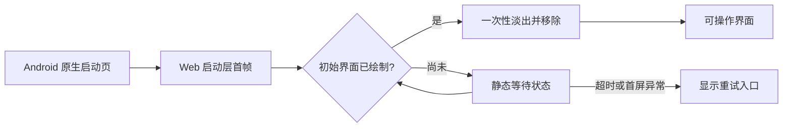

# IoT Manager 客户端启动动画方案与实现框架

> 状态：历史视觉候选方案，未实施图标分镜；本轮采用 ready-first 静态启动提示与可立即操作的应用壳层。\
> 范围：`client` 的 Android/PDA 冷启动及浏览器整页加载\
> 设计基线：[全 App 动效设计框架 v3](CLIENT-MOTION-FULL-COVERAGE-FRAMEWORK.md)\
> 实施说明：当前 `index.html` 已有静态启动状态和 noscript 说明；UI 同步挂载，配置/会话恢复随后显示独立 loading/ready/error。下文图标分镜保留作历史参考，不是本轮开发要求或验收完成证据，亦不作为进入可操作界面的强制等待门槛。Android 系统启动页仍需真机验收。

## 1. 历史候选方案的目标与当时现状

启动过程采用“原生启动页 → WebView 内的 App 图标短动画 → 可操作界面”的连续画面。图标和底色在两段之间保持一致，首屏出现后立即让出操作界面。启动动画只表达应用正在打开；站点、设备和天气数据的同步状态由各自页面显示。

方案编写时 Android 启动主题 `AppTheme.NoActionBarLaunch` 使用 Capacitor 默认的 `splash.png`，安装图标为 `@mipmap/ic_launcher`，Web 页面只有空的 `#app`。这些是历史输入，不是本轮完成声明。2026-09-27 的实现已加入 HTML 静态启动提示，`createClientUi()` 同步挂载，再由 `bootstrapRuntime()` 恢复配置与连接。未实施下文图标分镜，也未变更 Android 启动资源；首屏不等待接口、WebSocket、天气或 BLE。

## 2. 视觉方案：“图标亮相”

主视觉直接使用当前安装图标的完整图像，包括它的底板与图案。动效作用于图标容器，不依赖图标内部的线条、节点或颜色；未来替换图标时，只需更新素材和尺寸校验，不需要改动动画时序或控制器。

| 元素 | 规格 |
| --- | --- |
| 背景 | `#f3f6f7`，与客户端 `--canvas` 一致；原生窗口和 Web 首帧同色 |
| 主图形 | 当前 Android 安装图标的图案与底色；Web 端使用由该图标资源导出的素材 |
| 尺寸 | Web 端约 88 CSS px；Android 原生端按系统启动图标规则适配，并以视觉大小接近为准 |
| 布局 | 图标居中；兼容手机竖屏、PDA 横屏和安全区域 |
| 动画 | 图标保持可见，轻微放大后回到原尺寸；图标背后的一圈柔和光晕淡出一次 |
| 辅助文字 | 默认不显示；初始界面迟迟未绘制时才出现“正在准备界面” |

不使用百分比或“连接成功”等文案，因为启动阶段尚未得到这些结果。动画没有持续旋转或反复脉冲，也不会修改图标本身的图案。

### 图标替换约定

后续实施时建立一个明确的 `startupIcon` 素材入口：Android 启动主题使用安装图标资源，Web 启动层使用从当前图标资源导出的图像。现阶段以 `ic_launcher` 为临时来源；当正式 App 图标确定后，建立一份母版并同步生成 Android 安装图标和 Web 启动图，检查透明边距、系统遮罩、圆角、底色和视觉大小。启动控制器只引用该入口，不写入图标内部形状的动画路径。

### 分镜与时间预算

下表的时间从 **WebView 启动层首次可见** 算起。Android 系统启动页的显示时长由系统和设备启动速度决定，不将它计入 Web 动画时长。

| 时间 | 画面与行为 |
| --- | --- |
| 原生阶段 | 纯色底与居中 App 图标；静态画面可立即显示 |
| 0–120 ms | Web 首帧沿用相同背景与完整 App 图标，避免切换时出现空白 |
| 120–460 ms | 图标缓慢放大约 4% 后还原，背后的柔和光晕淡出一次 |
| 460–650 ms | 图标停在原尺寸；如果初始界面已绘制，启动层淡出，约 160 ms |
| 650 ms 后 | 初始界面尚未绘制时保留静态图标；必要时出现辅助文字，界面可用后立即退出 |

Web 层不人为等待网络。正常情况下，界面绘制后至启动层完全消失的额外时间以 **700 ms 内** 为目标；开启系统“减少动态效果”时，该额外时间以 **100 ms 内** 为目标。

```text
Android 系统启动页       WebView 首帧              首屏可操作
┌─────────────────┐     ┌─────────────────┐     ┌─────────────────┐
│                 │     │                 │     │ 设备运营  ...   │
│     App 图标    │  →  │     App 图标    │  →  │ 设备 / 天气 / ...│
│                 │     │    轻微呼吸一次  │     │                 │
└─────────────────┘     └─────────────────┘     └─────────────────┘
 静态、系统绘制             一次缩放、短淡出           局部加载状态
```

## 3. 技术框架

### 原生启动层

保留 `MainActivity` 单 Activity 启动结构。Android 启动主题指定统一的背景色、当前安装图标和启动后的普通主题；在 `onCreate()` 的 `super.onCreate()` 前安装 SplashScreen。系统负责显示静态启动图标，WebView 内完成一次性动效。普通主题的窗口背景和 WebView 背景也使用同一底色，覆盖 HTML 首帧绘制前的空档。Android 官方的 [SplashScreen 指南](https://developer.android.com/develop/ui/views/launch/splash-screen)和[迁移说明](https://developer.android.com/develop/ui/views/launch/splash-screen/migrate)是实施时的主题属性依据。

### Web 启动层

`index.html` 在 `#app` 之外预置独立的 `#startup-overlay`，并内联必要的首帧样式与一个极小的超时监护逻辑。后者独立于主模块运行，因此主脚本加载失败时仍可显示重试入口。动画样式与正常退出控制分别放入 `src/css/style.css` 和一个小型启动控制模块。控制器只接收“初始界面已绘制”事件，不订阅实时数据或页面导航。

建议的最小接口：

```js
const startup = createStartupTransition({ overlay, appRoot });
startup.markUiReady(); // createClientUi() 首次 render 完成后触发
startup.showFailure(); // 只有首屏始终未绘制时触发
startup.dispose();
```

`markUiReady()` 应等待至少一帧绘制，再在一次性短动画结束后移除覆盖层。移除后不再重建；前后台切换、站点切换、刷新、重连、登录状态变化均不触发启动动画。浏览器整页重新加载视为一次新启动。



### 可用性与异常规则

1. **首屏依据**：`createClientUi()` 的初次完整渲染与下一帧绘制；不等待 `bootstrapRuntime()` 的远端请求完成。
2. **超时**：`index.html` 的独立监护逻辑在初始界面 4 秒内仍未出现时，显示“界面启动未完成”和“重新加载”按钮；主模块成功启动后取消该计时器。具体阈值在真机测量后可调整。
3. **初始化错误**：首屏已出现而配置或网络初始化失败时，覆盖层退出，由现有错误提示承接。
4. **减少动态效果**：图标缩放、光晕和淡出动画全部关闭；首屏绘制后立即移除覆盖层。图标仍静态可见。
5. **无障碍**：装饰图标设为隐藏于辅助技术；等待文字用 `role="status"` 表达，覆盖层移除时取消状态播报。覆盖层存在期间不得让不可见的底层控件获得焦点。
6. **离线**：本地页面照常进入，后续网络和缓存状态由应用现有界面表达；断网不能使启动层一直覆盖界面。

## 4. 实施边界与文件规划

本文件只定义方案，以下是后续编码时的改动位置。

| 文件 | 计划内容 |
| --- | --- |
| `client/android/app/src/main/res/values/styles.xml` | 配置系统启动背景、图形和启动后主题 |
| `client/android/app/src/main/res/layout/activity_main.xml` | 将 WebView 绘制前的底色与启动页统一 |
| `client/android/app/src/main/res/mipmap-*/` | 当前 App 图标素材入口；未来图标更换时同步更新各密度资源 |
| `client/public/` | 增加由当前 App 图标源导出的 Web 启动素材，未来随图标一起替换 |
| `client/android/app/src/main/java/com/iot/manager/client/MainActivity.java` | 按 Android SplashScreen 流程安装启动页 |
| `client/index.html` | 添加可在主模块加载前显示的启动层、关键首帧样式和独立超时监护 |
| `client/src/css/style.css` | 图标一次性缩放、光晕、淡出、横屏布局与减少动态效果规则 |
| `client/src/js/platform/startup-transition.js` | 管理 ready、超时、异常和一次性清理 |
| `client/src/main.js` | 初次 UI render 后发送 ready 信号；保持现有数据初始化顺序 |

## 5. 验收口径

- Android 冷启动显示与安装图标一致的图案和底色，无旧 `splash.png` 图案、空白闪屏或明显的底色跳变；手机竖屏与 PDA 横屏的图标位置稳定。
- Web 动画只播放一次；返回前台、页面切换、缓存恢复、实时刷新和弱网重连不重播。
- 首屏绘制后可及时操作；设备接口缓慢或离线时，启动层不会挡住现有局部加载和错误提示。
- 系统减少动态效果开启后没有图标缩放、光晕或循环动画。
- 将临时图标换成另一张比例不同的图标后，启动流程、退出时机和错误重试仍可复用，只需重新导出素材并检查尺寸。
- 首屏初始化无法完成时，用户能看到明确错误与重试入口；覆盖层不会无限占据屏幕。
- 验证 Android API 24、30、31 及当前目标版本，并检查浏览器整页加载和 OAuth 冷启动回调路径。
