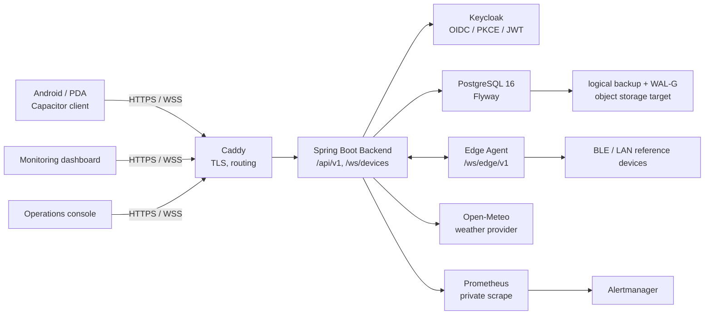

# IoT Manager 全维度项目审计报告 / Full Project Audit Report

**版本 / Version:** 1.1 
**审计日期 / Audit date:** 2026-09-01 
**发布基线 / Release baseline:** `main` @ `a3239cf2b7b90584abc7db75b9c510d2f66b6035` 
**补充审阅分支 / Supplementary branch reviewed:** `codex/enterprise-foundation` @ `7f2a0feb4b3f91fb9a0445a46cf4b7a1776f39a9` 
**审计结论 / Audit conclusion:** **可用于受控试点；不批准生产发布。** / **Suitable for a controlled pilot; not approved for production release.**

> 本报告以代码、部署清单、自动化工作流和可定位的历史运行证据为依据。它不把“已写代码”误记为“生产验证通过”，也不取代既有审批门禁。
>
> This report distinguishes implemented code, same-SHA verification, historical evidence, and unverified production claims. It does not override the approved release gates.

审批优先级保持为：[项目审批意见](PROJECT-APPROVAL-REVIEW.md) > [项目整改方案](PROJECT-IMPROVEMENT-PLAN.md) > 本状态报告 > 功能路线图。范围、Gate 及风险接受必须以审批意见为准。

## 1. 审计范围、基线与证据规则 / Scope, baseline, and evidence rules

本次审计覆盖产品定位、仓库资产、三端功能、后端/API/实时协议、数据与隐私、身份与授权、设备与边缘接入、天气、部署与备份、可观测性、测试/CI、Android 包、性能与运维、供应链与治理。审计对象是仓库当前可见资产，而不是对外部基础设施、真实设备或供应商合同的推定。

| 证据级别 / Evidence level | 含义 / Meaning |
| --- | --- |
| **E1 已实现 / Implemented** | 源码、配置或脚本存在，并已做静态审阅；不代表已运行。 |
| **E2 同基线验证 / Verified on baseline** | 自动化或本地验证作用于该发布基线或功能等价的未改动代码。 |
| **E3 历史运行证据 / Historical runtime evidence** | 早期 SHA 的端到端证据，可证明设计曾运行；代码、镜像或配置变动后必须重新取得。 |
| **E0 待验证/待决 / Pending** | 缺少可复现证据、需要真实环境/设备，或依赖管理审批。 |

`7f2a0fe` 相对发布基线只调整 Prometheus/Alertmanager 源码构建的依赖处理和并发度，以避免 CI 超时；在本报告截点，其镜像构建和 Docker Runtime E2E 尚未形成新的绿色证据。因此它是**待验证的工程优化**，不是新发布版本。

## 2. 执行摘要与总体评价 / Executive summary and assessment

IoT Manager 的定位明确：面向一个组织、多个站点的现场设备运维受控试点，提供 Android/PDA 现场操作、浏览器监控大屏和运维控制台。它不是面向公网的通用 SaaS，也不是已经达到无人值守生产运维标准的平台。

| 审计维度 / Dimension | 当前判断 / Assessment | 证据级别 | 发布影响 / Release impact |
| --- | --- | --- | --- |
| 核心设备运维与三端流程 | 覆盖设备、遥测、告警、命令、站点和实时更新的主流程。 | E1–E2 | 可进入受控试点。 |
| 身份、权限与站点隔离 | Keycloak PKCE/JWT、四角色和组织/站点作用域已落地；历史 Runtime E2E 覆盖四角色。 | E1–E3 | 需用最终 SHA 复验后才可作为准入证据。 |
| 真实设备与移动端 | 有 nRF52840 与 Shelly 参考接入，Android 有 BLE/GPS 边界；真机和真实设备矩阵未签收。 | E1 | P1 试点缺口。 |
| 天气与环境判定 | Open-Meteo、位置、海拔、温湿压、预报、颜色规则、隐私降精度和限流已实现。 | E1–E2 | 备用源与供应商治理仍待决。 |
| 部署、备份、恢复 | Compose、PostgreSQL、Keycloak、Caddy、逻辑备份、WAL-G、监控组件齐备；对象存储 PITR 演练未完成。 | E1–E3 | P0 生产阻断。 |
| 安全与镜像供应链 | 密钥扫描、依赖扫描、SBOM 与 fail-closed 流水线已配置；多个运行镜像仍有 HIGH/CRITICAL。 | E1–E2 | P0 生产阻断。 |
| 性能、可用性、运维成熟度 | 有限流、缓存、健康检查、指标和相关 ID；尚无容量基线、SLO/告警闭环或压测结果。 | E1 | P1/P2 缺口。 |
| 治理、合规与开源材料 | 审批与计划文档较完整，但根目录未见 LICENSE、SECURITY、CONTRIBUTING、CODEOWNERS 或 Dependabot 配置。 | E1 | 不阻断内部试点，但阻断对外正式发布准备。 |

**总体评分（审计判断，非认证）：** 产品功能 7/10；工程可验证性 6/10；安全发布准备度 3/10；生产运维准备度 3/10。优势是端到端主链路与安全边界设计已经成形；短板是最终 SHA 的运行证据、镜像漏洞闭环、物理恢复、真实设备/正式移动发布和运营治理。

## 3. 产品、用户与范围边界 / Product, users, and scope boundary

### 3.1 服务对象与业务目标

- **现场操作人员 / Field operator：** 通过 Android/PDA 发现、认领、查看、控制和处理设备。
- **监控人员 / Monitoring user：** 通过 Dashboard 观察设备状态、遥测、告警、天气和实时变化。
- **运维管理员 / Operations administrator：** 通过 Console 管理站点、设备 Profile、边缘 Agent、凭据和受控命令。
- **平台所有者 / Owner：** 负责组织、部署、审计、备份恢复和发布决策。

### 3.2 当前已批准范围

单组织、多站点、受控试点；现场 LAN 与远程 API/WSS 均可用；设备管理、命令审计、天气环境、最小生产基础设施、备份恢复和权限隔离均在范围内。

### 3.3 明确不应宣称已交付的范围

- 面向公众的多租户 SaaS、商业 SLA 或 24×7 托管；
- 事件闭环、设备健康分、命令模板、二维码认领（R1.1 候选）；
- Redis 实时总线/分布式锁、mTLS、k6 扩容压测、工单、报表、地图总览（R2 或以后）；
- 已签约天气备用供应商、已完成合规认证，或已完成所有真实设备兼容性认证。

## 4. 架构、仓库与运行拓扑 / Architecture, repository, and runtime topology

| 模块 / Module | 主要职责 / Responsibility | 审计状态 |
| --- | --- | --- |
| `backend/` | Spring Boot API、WebSocket、JPA/Flyway、权限、命令、天气、审计和指标。 | E1；JDK 17 严格 CI 已通过。 |
| `edge-agent/` | 面向局域网/设备的发现、遥测、控制、回读和凭据 WebSocket 接入。 | E1；JDK 17 严格 CI 已通过。 |
| `client/` | Vite + Capacitor Android/PDA，OIDC、BLE、GPS、连接设置、下拉刷新和本地偏好。 | E1–E2；Debug APK 已构建。 |
| `frontend/` | 浏览器监控大屏。 | E1–E2；生产构建与 Web 回归已通过。 |
| `console/` | 浏览器运维控制台。 | E1–E2；生产构建与 Web 回归已通过。 |
| `profiles/` | 可版本化的设备 Profile schema 与 nRF/Shelly/legacy 定义。 | E1。 |
| `firmware/` | nRF52840 reference switch 示例固件。 | E1；未完成实物验收。 |
| `deploy/` | Compose、Caddy、Keycloak、PostgreSQL/WAL-G、备份、监控配置和镜像 Dockerfile。 | E1；最终运行态待复验。 |
| `scripts/`、`.github/workflows/` | 本地验证、发布构建、Runtime E2E、恢复演练和 CI 安全门禁。 | E1–E2。 |
| `docs/` | 审批、计划、验证、安全、恢复和本报告。 | E1；存在需统一的历史状态表述，见第 15 节。 |

Compose 定义 13 个服务：初始化/密钥初始化、PostgreSQL、Keycloak、Backend、逻辑备份、WAL-G archive/backup、观测初始化、Prometheus、Alertmanager 和 Caddy。`internal` 与 `egress` 网络、持久卷及 runtime secrets 均有清单定义；运行时生成的 `deploy/.runtime/`、`.env`、密钥和恢复制品已被 Git 忽略，未被 Git 跟踪。

## 5. 功能交付与用户流程 / Functional delivery and user flows

| 功能域 / Domain | 已实现的行为 / Implemented behavior | 当前边界 / Boundary |
| --- | --- | --- |
| 设备资产 | 创建、更新、归档、按站点查看、空间/分组、统计、活动历史。 | 批量资产导入、生命周期 SLA、二维码认领未交付。 |
| 发现与认领 | LAN/Edge 发现候选设备、按 Profile 校验并认领。 | 真正现场网络/不同厂商兼容性未签收。 |
| 遥测与告警 | 采样、状态、告警查看/确认/解决、活动审计、站点作用域实时推送。 | 事件聚合、升级、值班/工单闭环未交付。 |
| 命令控制 | 单设备和最多 200 目标的站点批次；幂等键、过期、回执、read-back、审计。 | 命令模板、风险分级二次确认、跨站点批处理未交付。 |
| 设备 Profile | JSON schema、版本化定义，含只读/可控能力边界。 | Profile 发布审批、兼容性认证与健康分规则未交付。 |
| 多站点 | 组织/站点/空间模型、站点作用域授权及最小站点切换。 | 地图总览、跨站点趋势分析未交付。 |
| Android 体验 | OIDC 登录、连接设置、BLE/GPS、网络切换处理、天气设置、下拉刷新与缓存。 | 发布签名、可访问性审计、机型兼容性与升级回滚验收未完成。 |
| Web 体验 | Dashboard 与 Console 分离，走 API v1、JWT 和浏览器 WSS。 | 无独立的前端/控制台单元测试目录；需补覆盖率与可访问性指标。 |

## 6. API、实时协议与兼容性 / API, realtime protocol, and compatibility

### 6.1 HTTP API

后端有 13 个业务 Controller，涵盖设备、遥测、告警、命令/批次、Profile、分组、发现、站点、天气、边缘凭据和当前用户。新接口以 `/api/v1/**` 为规范路径；多数历史 `/api/**` 路径仍保留，版本拦截器提示客户端迁移。该兼容层是**过渡机制**，尚未看到正式弃用日期、OpenAPI 发布物或消费者兼容性政策。

### 6.2 实时协议

- `/ws/devices`：浏览器/客户端设备状态更新；JWT 在受限的 WebSocket subprotocol 或原生 Authorization 中解析，握手时复制站点作用域，服务端按站点广播。
- `/ws/edge/v1`：Edge Agent 使用独立的 `X-Iot-Agent-Credential` / token 凭据；生产配置要求安全传输。
- 响应与日志携带 `X-Request-Id`、`X-Trace-Id`；CORS/WS origin 使用统一白名单；生产 API 启用读/命令频率限制，天气刷新另有 `429 + Retry-After`。

**待补：** OpenAPI/AsyncAPI 契约、错误码目录、WebSocket 消息 schema 版本策略、弃用窗口、SDK/集成示例和外部兼容性测试。未经这些资产验证，不应承诺第三方长期集成兼容性。

## 7. 数据模型、迁移、留存与隐私 / Data, migration, retention, and privacy

### 7.1 主要数据域

核心实体覆盖组织、组织/站点成员关系、站点与空间、用户、设备、Profile、分组、遥测、告警、设备命令/批次/事件、Edge Agent 与凭据、活动审计、天气设置/快照/预报/供应商访问事件。命令、归档、认领、遥测和天气操作都有审计路径；审计上下文保存 actor、组织和站点，避免历史记录随设备移动而失去作用域。

### 7.2 Flyway 与数据库权限

- 通用迁移目录目前包含 `V1, V3, V4, V7, V9–V18`；这不是遗漏：生产 profile 额外加载 `db/migration-postgresql` 中的 `V2, V5, V6, V8`，用于 PostgreSQL 语法/文本处理差异。
- 该双目录设计在 `application-prod.yml` 中有注释，但**迁移编号说明没有独立文档和自动一致性检查**。这会提高新维护人员误判“缺号/重复号”的风险。
- 生产路径将 schema 变更交给 Flyway，应用账号为 DML 最小权限；Runtime E2E 曾验证 Backend 账号不能执行 DDL（E3）。

### 7.3 留存、恢复与数据治理结论

- 天气精确位置按代码实行 30 天降精度策略；供应商访问日志不保存原始坐标、完整 URL、token 或原始响应，并以 HMAC 配置指纹关联数据。
- 天气快照和预报按配置指纹隔离；位置或供应商变更会丢弃旧预报，保留历史快照但避免误作为新位置数据展示。
- 遥测、命令、告警、审计和备份的**统一留存期限、删除/导出流程、法律保全、个人数据主体请求流程**尚未定义或验收；这是试点数据治理缺口。
- 逻辑备份、篡改拒绝和独立恢复已有历史 E2E；受保护 S3/Object Lock 的物理 WAL/PITR、RPO ≤15 分钟、RTO ≤60 分钟仍为 E0。

## 8. 身份、授权与安全边界 / Identity, authorization, and security boundary

### 8.1 已实现控制

Keycloak Realm 定义 `OWNER`、`ADMIN`、`OPERATOR`、`VIEWER`；前端使用 Authorization Code + PKCE，后端作为 JWT resource server。HTTP 的粗粒度策略为：四角色可 GET，OWNER/ADMIN/OPERATOR 可写，只有 OWNER/ADMIN 可 DELETE；`/actuator/**` 限 OWNER/ADMIN，Prometheus scrape 使用 Docker Secret 建立的独立 `METRICS` 身份。边缘凭据管理 API 另限 OWNER/ADMIN。

组织/站点成员关系与 `SiteAccessService` 负责业务作用域判断，WebSocket 在握手后保持站点 scope。生产配置要求 TLS/WSS、显式 Web origin 白名单、非明文 Android release 流量和 Docker Secrets；请求/追踪 ID 与审计 actor 写入结构化上下文。

### 8.2 已知安全边界与缺口

| 项目 / Item | 状态 | 风险与要求 |
| --- | --- | --- |
| Git 历史秘密扫描、Maven/npm manifest 扫描、SBOM | 已在 CI 配置并有历史通过证据。 | 新基线每次仍须执行；SBOM 需保留和审阅许可证结果。 |
| 容器镜像扫描 | fail-closed 配置已实现。 | Keycloak、PostgreSQL/WAL-G、逻辑备份、Prometheus、Alertmanager 仍有 HIGH/CRITICAL，生产阻断。 |
| TLS/Caddy/WSS | 配置和历史 Runtime E2E 存在。 | 证书轮换、HSTS/CSP 策略、外网渗透测试和最终 SHA 复验未完成。 |
| API 限流 | 生产读 120/min、命令 30/min（可配置）；天气单独冷却。 | 单实例内存限流未等价于集群级防护；Redis/分布式限制按 R2 延后。 |
| Android 凭据 | Android Keystore 边界已实现。 | Root/Jailbreak、截屏、设备完整性、移动端日志泄露与离线数据加密未完成专项验证。 |
| 供应链治理 | digest/固定源码构建、Trivy、Gitleaks、CycloneDX 已配置。 | 无 Dependabot、SECURITY 联系方式、VEX 台账或第三方许可证审批流程。 |

没有发现被 Git 跟踪的 `deploy/.runtime/` 或明文 runtime secret；这是正面结论，但不能替代对 GitHub Secrets、部署主机权限、对象存储 IAM 和证书私钥保管的外部审计。

## 9. 天气、位置与环境风险系统 / Weather, location, and environmental risk

当前主供应商是 Open-Meteo。服务端获取天气状况、海拔、温度、相对湿度、气压、小时/日预报，并由 `EnvironmentStatusEvaluator` 根据已定义阈值输出绿色（适宜）、黄色（观察）、红色（风险）状态。客户端支持手机 GPS、手动坐标和失败后待提交位置；定位未成功时用户可手动填写，网络暂时不可达时保存待提交请求。

| 控制点 / Control | 当前实现 | 状态 |
| --- | --- | --- |
| 自动刷新体验 | 渲染节流、一次短重试、实时重同步冷却、下拉刷新冷却。 | E1–E2 |
| 天气刷新保护 | 本地 60 秒冷却；服务端返回 `429` 和 `Retry-After`；使用缓存回退。 | E1–E2 |
| 数据有效性 | 供应商响应需有完整当前值、24 小时和 7 天预报，否则显式失败。 | E1 |
| 位置隐私 | HMAC 指纹、30 天精确位置降精度、最小化供应商审计事件。 | E1 |
| 供应商故障 | 现有缓存回退和失败状态。 | E1 |
| 备用供应商 | QWeather/geocoding 曾列为候选。 | E0：合同、配额、隐私、密钥、跨境及可用性审批后才可启用。 |

仍需真机验证定位权限拒绝/仅粗略位置/系统定位关闭、室内/弱网、时区变更、供应商慢响应和网络切换；这些是用户此前实际遇到问题的关键验收项。

## 10. 设备、边缘与固件接入 / Device, edge, and firmware integration

仓库提供三个 Profile：`legacy-generic-v1`、`nordic-nrf52840-switch-v1`、`shelly-plus-plug-s-v1`，以及 nRF52840 reference switch 固件。Android BLE Adapter 为 nRF 参考路径建立了边界；Edge Agent 实现了 Shelly Plus Plug S Gen2 RPC 控制/回读的出站连接路径。Profile 能力可区分只读遥测与可控制设备，这为后续健康分、命令权限和 UI 行为提供基础。

**不能从源码推断的项目：** BLE 权限和扫描在目标 Android 版本/厂商 ROM 上的行为、真实 Shelly 固件版本兼容性、断网重连、设备离线命令过期、固件升级、LAN VLAN/防火墙策略、现场并发设备数量。必须形成“设备型号 × 固件 × 网络 × Android 机型 × 操作结果”的可签收矩阵。

## 11. 部署、备份、恢复与可观测性 / Deployment, backup, recovery, and observability

### 11.1 部署与恢复资产

生产 Compose 路径包括 PostgreSQL 16、Keycloak、Spring Boot、Caddy、逻辑备份、WAL-G archive/backup、Prometheus 和 Alertmanager。Backend readiness 显式包含数据库，不会在数据库不可用时把仅存活的进程误报为 ready；Caddy/数据库强调非 root 运行和 secrets 文件挂载。脚本覆盖逻辑备份、恢复、WAL 推送/拉取和独立恢复演练。

历史 Runtime E2E 曾覆盖两阶段栈启动、PKCE/JWT/RBAC、浏览器 WSS、边缘凭据 WSS、数据库重启 fail-closed、逻辑备份独立恢复与篡改备份拒绝（E3）。当前 `main` 之后的监控镜像构建改变尚无同 SHA 的完整 runtime 证据；近期 GitHub Hosted Runner 在镜像构建时收到外部 shutdown，不能解释为产品失败，也不能计为通过。

### 11.2 可观测性与运维

已实现 Prometheus 私有 scrape token、平台指标（包括活动 WSS session 与天气刷新）、Prometheus/Alertmanager 配置、请求/追踪 ID、MDC 日志上下文、健康/就绪端点和红线告警配置。缺少或未验收：

1. 生产仪表板、指标留存、告警接收人/升级规则、静默/抑制策略和告警演练；
2. SLI/SLO（可用性、命令成功率、刷新延迟、恢复目标）及错误预算；
3. 集中式日志、可查询审计、追踪采样、值班 Runbook、事故复盘流程；
4. 物理 PITR 在真正对象存储、Object Lock、最小 IAM 和隔离恢复项目上的证据。

## 12. 测试、CI、构建与安装包 / Test, CI, build, and APK

### 12.1 可复现验证现状

| 验证面 / Verification surface | 当前证据 | 结论 |
| --- | --- | --- |
| Backend + Edge Agent | GitHub Actions `33513293563` 的 JDK 17 作业成功，含 PostgreSQL Testcontainers。 | E2 |
| Dashboard、Console、Client Web | 同一运行的 Node 22 / Playwright / 生产构建作业成功。 | E2 |
| Android Debug | 同一运行的 JDK 21、API 36 作业成功；本地 2026-09-01 clean rebuild 成功。 | E2 |
| Compose 静态配置 | `docker compose ... config --quiet` 已通过。 | E2 |
| Docker 镜像安全 | 该运行的镜像构建被 Runner 取消，后续扫描被跳过。 | E0，不可标绿 |
| Docker Runtime E2E | 本次截点仍在执行/需重跑；早期 SHA 有完整通过记录。 | E3 / E0 |
| 物理 WAL-G 恢复 | 自托管保护恢复工作流已定义。 | E1，未见受保护环境执行证据 |

源树中有 37 个 Backend 测试文件、5 个 Edge Agent 测试文件、24 个 Client 测试文件；这是文件清点，不是测试用例数量、覆盖率或缺陷密度。`frontend/` 与 `console/` 未见各自独立的测试目录，因此 Web 回归应继续明确其由共享 Playwright 配置覆盖的范围，而不能以“构建成功”代替 UI 功能和可访问性测试。

### 12.2 当前 Android 安装包

| 属性 / Property | 值 / Value |
| --- | --- |
| 文件 / Artifact | `client/android/app/build/outputs/apk/debug/app-debug.apk` |
| 类型 / Type | Debug；不用于生产分发 |
| 构建时间 / Built | 2026-09-01 21:08:55 (Asia/Shanghai) |
| 大小 / Size | 5,785,066 bytes |
| SHA-256 | `1CBB6F4A8DB8C44E131019778F83415B9F4F31488F161BE104637CCA60CBA690` |
| 权限 / Permissions | 网络、网络状态、粗略/精确定位、按 Android 版本区分的 BLE scan/connect。 |

Release 构建已强制从仓库外提供 keystore 与四项 `IOT_RELEASE_*` 输入；release 禁止明文流量。但目前没有生产签名 APK/AAB、签名证书托管/轮换记录、版本号发布策略、覆盖安装/回滚测试、隐私说明或商店分发材料，故不得以此 Debug APK 对外发布。

## 13. 非功能需求与成熟度差距 / Non-functional requirements and maturity gaps

| 范畴 / Area | 已有能力 | 未达目标 / Required next evidence |
| --- | --- | --- |
| 可用性 | DB readiness、有限重试、缓存回退、命令状态机。 | HA/多副本、故障演练、SLO、外部依赖降级目标。 |
| 性能与容量 | API 限流、刷新冷却、批次上限 200。 | 设备数/遥测吞吐/同时在线 WSS/命令延迟基线；k6 和容量结论。 |
| 扩展性 | 站点 scope 与 Edge 连接设计。 | Redis Pub/Sub/Streams、分布式锁、水平扩展一致性（R2）。 |
| 可靠性 | 幂等、过期、回执、read-back、逻辑恢复历史证据。 | 物理 PITR、对象锁、定期恢复演练、RPO/RTO 实测。 |
| 可用性/无障碍 | 移动/网页主要流程可操作。 | WCAG/屏幕阅读器、键盘导航、色盲状态表达、字体缩放、低端机性能。 |
| 国际化 | 中文界面为主。 | 英文/多语言资源、时区/单位本地化测试。 |
| 可维护性 | 分层模块、Profile schema、CI、文档。 | 公共 API 契约、架构决策记录、贡献规范、变更日志、依赖自动更新。 |
| 合规与法务 | 最小化天气位置审计、降精度策略。 | 数据分类、保留/删除、隐私告知/同意、供应商 DPA、开源许可证清单与用户支持渠道。 |

## 14. 已修复缺陷集合 / Resolved defect set

| ID | 修复内容 / Resolution | 当前证据 |
| --- | --- | --- |
| FIX-01 | 高频自动刷新改为渲染节流、下拉刷新、短重试、60 秒天气冷却和服务端 `429/Retry-After`。 | E1–E2 |
| FIX-02 | 增加 API/WSS 连接设置、测试反馈和 Caddy API/WSS 边界说明，降低 LAN 地址失配。 | E1；现场网络待验收。 |
| FIX-03 | Backend 验证固定 JDK 17，Android 固定 JDK 21，规避 Java 24 与旧 Hibernate/Byte Buddy 组合启动失败。 | E2 |
| FIX-04 | 数据库中断时 JDBC rollback 的二次异常被受限处理，同时保持 readiness fail-closed。 | E1–E3 |
| FIX-05 | 加固 Linux Compose Secret、Caddy 非 root、开发 CA 信任和证据脱敏。 | E1–E3 |
| FIX-06 | Trivy 安装切换为固定、单次安装，并保持聚合 fail-closed。 | E1–E2 |
| FIX-07 | 修复 Caddy 构建元数据导致的 Go 依赖误归因；最新已知 Caddy 扫描 HIGH/CRITICAL 为 0。 | E2（旧基线） |
| FIX-08 | Alertmanager release tag 不含预构建 UI，改为由签名 tag 锁定前端依赖后构建再编译。 | E1；最终镜像验证待完成。 |

## 15. 审计发现、文档一致性与风险登记 / Findings, documentation consistency, and risk register

| ID | 严重度 | 发现 / Finding | 影响 | 整改要求 |
| --- | --- | --- | --- | --- |
| AUD-01 | P0 | Keycloak、PostgreSQL/WAL-G、逻辑备份、Prometheus、Alertmanager 仍存在未关闭 HIGH/CRITICAL 镜像发现。 | 不能生产发布。 | 支持的上游升级或逐项批准、到期的 VEX/风险接受；同 SHA 重扫。 |
| AUD-02 | P0 | 最终监控镜像构建尚无同 SHA 的完整 Docker Runtime E2E；Hosted Runner 外部 shutdown 造成构建取消。 | 运行态/扫描无法标绿。 | 使用可用 Runner 重跑或拆分构建；保留完整制品和作业链接。 |
| AUD-03 | P0 | 受保护 S3/Object Lock 物理 PITR 没有 RPO/RTO 实测。 | 灾备目标只是设计目标。 | 在隔离恢复项目演练，记录源/目标、时间、恢复点、证据脱敏。 |
| AUD-04 | P1 | 真实设备、Android 权限/定位、BLE、LAN/蜂窝切换和升级回滚没有签收矩阵。 | 现场可用性未知。 | 执行型号/固件/网络/机型矩阵并由业务验收。 |
| AUD-05 | P1 | API v1 已存在但缺 OpenAPI/AsyncAPI、弃用策略及消费者契约测试。 | 外部集成变更风险高。 | 发布契约、错误码、版本兼容政策和 regression suite。 |
| AUD-06 | P1 | 没有容量基线、SLO、告警路由演练或值班 Runbook。 | 无法量化可用性与扩容阈值。 | R1 收尾先定 SLI/SLO/Runbook；R2 前完成 k6 与演练。 |
| AUD-07 | P1 | 数据留存/删除/导出与个人信息处理制度不完整。 | 隐私和审计治理不足。 | 定义数据分类、期限、审批、清理和导出流程。 |
| AUD-08 | P1 | 备用天气供应商尚无合同、配额、隐私、密钥和故障切换批准。 | 不应启用或宣传高可用多源。 | 完成供应商评审后再接入/测试。 |
| AUD-09 | P2 | 根目录未见 LICENSE、SECURITY、CONTRIBUTING、CODEOWNERS、Dependabot。 | 外部协作、披露和供应链治理不完整。 | 补治理文件及责任人；将许可证审核接入 SBOM 流程。 |
| AUD-10 | P2 | 安全文档时间线有不一致：`IMAGE-SECURITY-STATUS.md` 仍以 Docker Scout 历史表达为主，而 CI 基线以 Trivy 为准；部分“最新复验”指向旧 SHA。 | 阅读者可能把历史结果误当作当前发布通过。 | 以本报告的证据等级为准，并统一每份文档的 SHA、工具、日期和结论。 |
| AUD-11 | P2 | Flyway 跨两个目录的迁移编号规则只有配置注释。 | 维护人员可能误判缺号/重复号。 | 增加迁移清单与 CI 一致性检查。 |

## 16. 发布门禁、优先级与下一步 / Release gates, priorities, and next steps

### P0：生产发布前必须关闭

1. 对全部运行镜像完成无 HIGH/CRITICAL 的重扫，或取得**逐条、有到期日、经批准**的风险接受/VEX；不得使用宽泛 ignore 或 `ignore-unfixed` 掩盖问题。
2. 在同一 SHA 上完成 Compose 启动、Keycloak、PostgreSQL、Caddy、Backend、PKCE/JWT/RBAC、WSS、恢复及证据脱敏的 Runtime E2E。
3. 在受保护对象存储和隔离目标上完成 WAL-G PITR 演练，实测并记录 RPO ≤15 分钟、RTO ≤60 分钟。
4. 决定并执行监控镜像构建策略，确保 CI 的 runner 资源限制不再阻断安全扫描证据。

### P1：受控试点扩大前完成

1. 签收真实 nRF/Shelly、Android 定位/BLE、局域网/蜂窝网络、升级/回滚和离线恢复矩阵。
2. 产出正式签名 Android APK/AAB，完成密钥托管、版本策略、安装/回滚、隐私材料和分发验收。
3. 为 API/WS 建立契约、错误码、弃用和消费者兼容性测试；补数据治理、隐私和供应商评审材料。
4. 建立告警路由、仪表板、SLI/SLO、运行手册和定期逻辑/物理恢复演练。

### P2：经 Gate 批准后安排

Redis 实时总线/分布式锁、mTLS、性能压测、事件闭环、健康分、命令模板、二维码认领、工单、报表、地图总览、无障碍/i18n 深化和仓库治理自动化。

## 17. 报告覆盖自检 / Report coverage checklist

本报告已覆盖以下项目，并对每项标注实现、验证或待验证状态：

- 产品定位、用户、范围与延期功能；
- 架构、仓库模块、Compose 服务及运行依赖；
- 三端 UI、设备、遥测、告警、命令、Profile、多站点、API 和 WebSocket；
- 数据模型、迁移、数据库权限、留存、备份、恢复、天气位置和隐私；
- OIDC/JWT/RBAC、站点隔离、密钥、TLS/WSS、限流、供应链与漏洞状态；
- 真实设备、固件、Edge Agent、Android 权限、Debug APK 和正式发布缺口；
- 可观测性、日志/追踪、告警、性能、扩展性、SLO、运维与灾备；
- 测试、CI、SBOM、文档治理、合规、风险登记、P0/P1/P2 和发布决策。

## 18. 关联证据 / Related evidence

- [Release verification](VERIFICATION.md)
- [Runtime image security status](IMAGE-SECURITY-STATUS.md)
- [Security baseline evidence](SECURITY-BASELINE-EVIDENCE-2026-09-01.md)
- [R1 completion implementation status](R1-COMPLETION-IMPLEMENTATION-STATUS.md)
- [P0 Docker full-chain plan](P0-DOCKER-FULL-CHAIN-DEVELOPMENT-PLAN.md)
- [Project improvement plan](PROJECT-IMPROVEMENT-PLAN.md)
- [Project approval review](PROJECT-APPROVAL-REVIEW.md)
- [Weather feature development](weather-feature-development.md)
