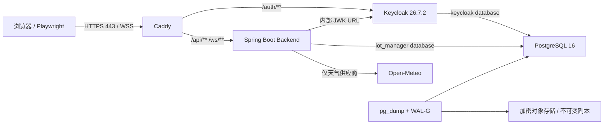

# IoT Manager P0 缺陷闭环与 Docker 全链路运行态开发方案

**版本：** 1.3
**日期：** 2026-08-30
**状态：** 已实现；本地 Docker 运行证据已通过，待 CI Gate 2 证据签发与镜像风险决策
**适用范围：** R0 → R1，单组织多站点受控试点
**目标链路：** PostgreSQL 16 + Keycloak + Backend + Caddy（含备份服务与安全验证）

## 1. 文档目的与审批边界

本文把已经批准的 `IMP-P0-01`～`IMP-P0-04` 转换为可直接开发、联调和验收的执行方案，
并关闭 PostgreSQL、Keycloak、Backend、Caddy 仅有配置/镜像而缺少完整运行态证据的问题。

### 0.1 本地运行证据（2026-08-30）

- `iot-manager-p0` 中 PostgreSQL、Keycloak、Backend、Caddy、逻辑备份、WAL-G 归档和
  base-backup sidecar 全部处于 healthy；宿主机仅发布 Caddy 的 80/443。
- `scripts/runtime/verify-stack.ps1` 已通过真实 TLS 入口的 OIDC、401、H2 404、308、
  CORS allow/deny、>1 MB `413` 和安全响应头检查。
- 已通过真实 Authorization Code + PKCE：OWNER 的 `/api/v1/me`、站点读取均为 `200`；
  集成 VIEWER 的站点读取为 `200`、写请求为 `403`。两类 subject 分别写入运行态文件，
  引导账户已补齐 Keycloak 必填资料，登录不会落入资料补全 required-action 页面。
- 浏览器 OIDC 已修复原生 `fetch` 绑定错误；真实 PKCE、四角色两站点边界、授权码/刷新令牌重放、浏览器 WSS 与边缘凭据轮换/吊销 Runtime E2E 为 5/5 通过。
- PostgreSQL/Backend 受控重启前后迁移、角色、设备和命令快照一致；暂停 PostgreSQL 时 Backend readiness 返回 HTTP 503，恢复后再次 healthy。PowerShell 与 Git Bash 两套脚本均已实际演练。
- 受控韧性演练还验证 Backend、backup、WAL-G archive/base-backup 的 `unless-stopped` 策略，数据库先停止后 Backend 保持同一容器进行有界 Flyway 连接重试，数据库恢复后无需人工 Backend 操作即可 healthy；演练窗口内不允许出现未处理 scheduler error。
- 最新逻辑备份已恢复到独立 Compose project，并确认 PostgreSQL Flyway V1～V18、关键表、角色种子和应用账号临时读写全部成功；篡改备份在 `pg_restore` 前被 SHA-256 校验拒绝。
- 逻辑 backup 现只挂载 `iot_manager_owner` Secret；它会导出 owner-owned recovery-drill schema，且恢复后的应用 DML 探针在 PostgreSQL 容器内执行，不向 backup sidecar 暴露应用密码。backup/WAL-G health 使用成功时间与新鲜度，而非历史文件或启动 ready 文件。
- 严格验证脚本在 JDK 17 / Node 22 下全绿：Backend 123、Edge Agent 7、Client 86 个单元测试均为 0 failures / 0 errors / 0 skipped；Frontend、Console、Client 各 1 个 Playwright 场景和三套 Vite 构建均通过。PostgreSQL 16 Testcontainers 冒烟已真实运行，不再以 Docker 不可用为由跳过。
- Android Debug APK 已在 JDK 21、Android API 36 / Build Tools 36.0.0 和 Node 22 下重新构建；Capacitor 同步后的公开 Web 资源凭据门禁通过。
- Backend 和 Edge Agent 的 Jackson 已统一升级至 `2.21.4`。源码、依赖、Compose 和 Secret 的阻断扫描继续由 CI 执行；运行镜像不再被笼统宣称为“0 风险”，当前精确的本地镜像审计和 Gate 2 决策见 [IMAGE-SECURITY-STATUS.md](IMAGE-SECURITY-STATUS.md)。
- PostgreSQL、Caddy 与逻辑备份服务已完成非 root 运行态验证：PostgreSQL/备份实际 UID 均为 `999`；Caddy 实际 UID 为 `65534`，仅保留 `NET_BIND_SERVICE` 并在 TLS 入口返回 HTTPS `200`。备份服务同时验证了只读根文件系统、零能力集和实际 `.dump/.sha256` 产物；Runtime CI 会重复断言这些约束。
- Backend、Caddy、Keycloak、PostgreSQL/WAL-G 及其构建基础镜像均固定为“版本 tag + 已验证 digest”；本地 Compose 已用这些固定引用重建可部署镜像。Prometheus `v3.14.0` 与 Alertmanager `v0.33.1` 同样已固定 digest 并通过运行态抓取验证。
- 已移除浏览器全局 Token 注入和 Android 发布链路的 `VITE_*ACCESS_TOKEN` 构建时令牌入口；`scripts/verify-public-build-env.js` 会阻断公开 Vite 变量中出现 Token、Secret、Password、Private Key 或 API Key，生产凭据由 OIDC 运行时会话提供。
- 已执行 `npm run android:sync` 并扫描 Android 将打包的 `app/src/main/assets/public`；该命令和 Android CI 都会在同步后、Gradle 打包前重复执行该扫描。JDK 21 本地 `assembleDebug` 已成功重建 APK；同一 Git SHA 的 CI 产物仍是正式发布证据。

上述是本地实现/联调证据，不替代 GitHub Actions 的干净 Runner 证据、生产域名 ACME
验证、真实设备 Gate 3 或正式发布审批。

文档优先级保持不变：

1. `PROJECT-APPROVAL-REVIEW.md`；
2. `PROJECT-IMPROVEMENT-PLAN.md`；
3. 本执行方案；
4. `FEATURE-EXPANSION-EVALUATION-AND-ROADMAP.md`。

本方案不引入 Redis、多实例、mTLS、工单、报表、二维码、OTA 或其他 R1.1/R2 功能，
也不构成公网生产发布授权。完成后形成的是 Gate 2 的 P0 证据包；真实 nRF52840、Shelly
和 Android 真机仍按 Gate 3 验收。

## 2. “全链路完成”的固定定义

仅看到四个容器处于 `running` 不算完成。全链路必须同时证明：

- 浏览器通过 Caddy 的 HTTPS 地址访问监控端和控制台；
- Caddy 将 `/auth/**` 转发到 Keycloak，将 `/api/**`、`/ws/**` 转发到 Backend；
- 浏览器使用 Authorization Code + PKCE 登录，Keycloak 签发的 JWT 被 Backend 正确验证；
- Backend 根据 PostgreSQL 中的用户、组织和站点成员关系执行 401、403 和站点隔离；
- Backend 在 PostgreSQL 16 上从空库执行 Flyway V1～V18，重启后数据仍存在；
- Keycloak 使用独立的 `keycloak` 数据库，Backend 使用独立的 `iot_manager` 数据库；
- PostgreSQL 初始化管理员只用于建库建角色，Flyway 使用迁移账号，Backend 使用无 DDL 权限的
  运行账号，任何应用账号都不是集群超级用户；
- WebSocket 无令牌、伪造令牌、越权站点订阅被拒绝，合法订阅只收到授权站点事件；
- HTTP 自动跳转 HTTPS，H2、8080、5432 和 Keycloak 内部端口不暴露到宿主公网；
- PostgreSQL 中断时 Backend 不回退 H2，并通过 readiness/日志明确失败；
- 备份可校验、可在独立实例恢复，并形成 RPO/RTO 证据；
- 所有测试从同一 Git 提交执行，日志中不出现密码、Token、完整坐标或私钥。

## 3. 当前基线与已确认缺口

### 3.1 已具备的资产

- Spring Security JWT Resource Server、RBAC、组织/站点成员关系和站点范围校验已实现；
- Web、Console、Android 已具备 Authorization Code + PKCE；
- Keycloak Realm、`iot-web`、`iot-mobile` 和四个 Realm Role 已定义；
- `prod` Profile 已关闭 H2 Console、模拟器并启用严格 CORS、JWT 和限流；
- PostgreSQL 方言迁移已拆分，GitHub Actions 的 PostgreSQL 16 Testcontainers 测试已通过；
- Caddy 已提供 HTTPS、静态站点、API/WebSocket/Keycloak 反向代理和安全响应头；
- Backend 镜像以 UID/GID 10001 的非 root 用户运行；
- 逻辑备份、SHA-256 校验和恢复脚本已经存在；
- GitHub Actions 已验证 Java、三套 Web、Playwright、Android APK 和容器镜像构建。

### 3.2 原始 Gate 2 运行态缺口及关闭矩阵

下表左侧保留首次审计发现，避免丢失问题来源；“当前状态”以 0.1 节的本地证据为准。
`本地关闭` 不等于 Gate 2 签发：凡需同一 Git SHA 的干净 Runner、受保护对象存储或人工签字的项目，
均明确保留为待办。

| 编号 | 原始缺口 | 当前状态 | Gate 2 剩余关闭条件 |
|---|---|---|---|
| P0-RUN-01 | Docker Client 可用但没有完整 Compose 运行证据 | **本地关闭**：`iot-manager-p0` 已实际健康运行并完成边界检查 | 在同一提交的干净 GitHub Actions Runner 重复运行完整栈 |
| P0-RUN-02 | Keycloak 与 Backend 无容器健康门禁 | **本地关闭**：健康探针与 `service_healthy` 依赖已验证 | CI Runtime 产物保留冷启动健康记录 |
| P0-RUN-03 | Caddy 与 Backend/首次 OWNER 启动耦合 | **本地关闭**：身份平面、Realm/OWNER 引导、业务平面两阶段流程已演练 | CI Runtime 产物保留第二次幂等执行记录 |
| P0-RUN-04 | 没有真实 Keycloak PKCE → JWT → API/WSS 证据 | **本地关闭**：PKCE、四角色两站点、401/403、重放/登出与浏览器 WSS 共 5/5 通过 | 同一 SHA 的 CI Runtime E2E 通过且上传脱敏结果 |
| P0-RUN-05 | PostgreSQL 持久化、故障与 fail-closed 未验证 | **本地关闭**：V1～V18、受控重启快照、断库 readiness 503、冷依赖启动的有界 Flyway 重试、恢复自动 healthy 和 scheduler 异常门禁均已演练 | CI Runtime 重复验证，保留迁移与快照摘要 |
| P0-RUN-06 | 备份仅在本机 Volume，缺少独立恢复与 WAL 证据 | **部分关闭**：owner-only 逻辑备份、SHA-256、独立恢复、业务表 DML 权限和篡改拒绝已通过；备份/WAL-G 新鲜度健康已实现 | 受保护 S3/Object Lock 上实际 WAL/PITR 演练，证明 RPO≤15 分钟、RTO≤60 分钟 |
| P0-RUN-07 | TLS、CORS、安全头、体积限制和私有端口未运行验证 | **本地关闭**：Caddy 安全矩阵与仅 80/443 发布已通过 | 干净 CI Runner 复现；生产环境另做 DNS/ACME 验收 |
| P0-RUN-08 | Agent Token/WSS 仅有代码级测试 | **模拟链路关闭**：签发、使用、轮换、吊销已穿过 Caddy WSS 验证 | 真正 nRF52840/Shelly 控制留给 Gate 3，不得以模拟替代 |
| P0-RUN-09 | CI 未启动完整栈 | **实现完成，证据待生成**：`runtime-e2e.yml` 与恢复工作流已加入 | 推送本次提交并取得成功 workflow URL/Artifact |
| P0-RUN-10 | 初始化、迁移、运行账号未分离 | **本地关闭**：三类账号分离，应用账号 DDL 拒绝已验证 | CI Runtime 执行应用账号越权用例并保留结果 |

## 4. 目标运行拓扑



公网入口只有 Caddy 的 80/443。PostgreSQL、Keycloak、Backend 和健康/指标端点只位于
Docker 内部网络。Backend 与 Caddy 加入受控 egress；PostgreSQL 不加入 egress。

## 5. 已冻结的技术决策

### 5.1 运行模式

- Gate 2 使用单主机 Docker Compose，不引入 Kubernetes；
- 开发验收域名固定为 `iot-manager.localhost`，使用独立的 Caddy integration 配置和内部 CA；
- 预生产/生产使用真实 DNS 与 ACME，禁止在生产配置中使用 `tls internal`；
- integration 与 production 共用业务拓扑，只允许 TLS 证书和测试用户配置不同；
- 使用独立 Compose project name `iot-manager-p0`，避免影响现有开发容器和 Volume。

### 5.2 数据库与迁移

- PostgreSQL 固定主版本 16；部署前记录镜像 digest，禁止只依赖浮动 tag；
- H2 只允许 `dev`/`test` Profile，`prod` 只加载 PostgreSQL 方言迁移；
- 通用迁移目录为 `db/migration`，差异迁移为 `db/migration-postgresql`；
- V1～V18 不再修改或重编号；V19 永久保留给 H2 专用长文本兼容迁移，后续 R1.1 共享或 PostgreSQL 迁移从 V20 起；
- Flyway 失败时 Backend 必须拒绝启动，不允许自动 repair 或 downgrade；
- PostgreSQL 的 `POSTGRES_USER` 改为一次性初始化管理员，不再等于 `IOT_DB_USERNAME`；
- 业务库固定使用 `iot_manager_owner`（Flyway/DDL）和 `iot_manager_app`（Backend/DML）两类角色；
- Backend 通过 `spring.flyway.user/password` 使用迁移账号，通过 `spring.datasource.*` 使用运行账号；
- `iot_manager_app` 为 `NOSUPERUSER NOCREATEDB NOCREATEROLE NOREPLICATION`，不拥有数据库或
  Schema；撤销 `PUBLIC` 默认权限后，仅授予所需表、序列和函数权限及相应 default privileges；
- `iot_manager_owner` 仅继承 `pg_read_all_settings`，并额外拥有
  `pg_backup_start/pg_backup_stop`，供 WAL-G 校验物理备份目录并执行物理备份；WAL 归档
  sidecar 仅访问私有 spool，不挂载 PostgreSQL 数据卷；不得将
  这些权限授予 `iot_manager_app`；
- Keycloak 使用独立数据库账号，允许管理自身数据库 Schema，但同样必须是
  `NOSUPERUSER/NOCREATEDB/NOCREATEROLE`；
- 初始化管理员、Keycloak、Flyway 和 Backend 四套凭据不得复用。

### 5.3 OIDC 与会话生命周期

- Web/Console/Android 都使用 public client + Authorization Code + PKCE S256；
- 禁止 Implicit Flow、Direct Access Grant 和内置客户端 Secret；
- Access Token 生命周期固定 5 分钟；SSO idle 30 分钟、max 8 小时；
- Refresh Token 开启轮换，最大复用次数为 0；Android offline session 最大 30 天；
- Realm Role 固定为 `OWNER/ADMIN/OPERATOR/VIEWER`；
- `iot-web` 的 Redirect URI 收紧为监控端和 `/console/` 两个明确地址，不使用全站 `/*`；
- Android Redirect URI 固定为 `com.iot.manager.client://oauth/callback`；
- Backend 验证外部 HTTPS issuer，JWK 通过内部 Keycloak 地址读取，避免公网 DNS 回环依赖。

### 5.4 首次 OWNER 与集成 VIEWER 引导

采用确定的两阶段流程：

1. 启动 PostgreSQL、Keycloak、Caddy；Caddy 不再硬依赖 Backend；
2. 运行 `reconcile-keycloak-realm`，使空 Realm 和既有 Realm 都收敛到已审批配置；
3. 运行一次性 `bootstrap-keycloak-owner` 脚本，通过 Keycloak Admin CLI 创建或查找 OWNER，
   仅在集成开关开启时创建 VIEWER；分配对应 Realm Role、补齐 Keycloak 必填用户资料，
   并输出各自不可变 subject；
4. 将 OWNER 与可选 VIEWER subject 分别写入受 ACL 保护、已被 Git 忽略的运行环境文件；
5. 启动 Backend，`ProductionBootstrapOwnerService` 幂等创建组织、站点、OWNER 成员关系，
   并只为显式配置的 VIEWER 创建站点级只读成员关系；
6. OWNER 首次 PKCE 登录成功后，轮换或移除 bootstrap admin。

脚本必须幂等；重复执行只能返回同一用户 subject，不能重复创建用户或角色。

### 5.5 健康和启动顺序

| 服务 | 健康依据 | 启动依赖 |
|---|---|---|
| PostgreSQL | `pg_isready` 对业务库成功 | 无 |
| Keycloak | 管理端口 `9000/health/ready` 返回 200 | PostgreSQL healthy |
| Backend | `8080/actuator/health/readiness` 返回 `UP` | PostgreSQL healthy、Keycloak healthy、OWNER 已配置 |
| Backup | 最近一次完整 `.dump/.sha256` success marker 未过期且 sidecar 匹配 | PostgreSQL healthy |
| WAL-G archive | 最近远端 probe 新鲜，且私有 spool 无超龄未上传 WAL | PostgreSQL healthy |
| WAL-G base backup | 最近一次远端 `backup-push` success marker 未过期 | PostgreSQL / WAL-G archive healthy |
| Caddy | 配置有效，443 可建立 TLS，`/auth` 可达 | Keycloak healthy；不硬依赖 Backend |

Backend 镜像安装固定版本的最小 HTTP 探针工具，保持非 root、`read_only` 根文件系统和 `/tmp`
tmpfs。健康探针不得调用需要管理员权限的 Actuator 端点。

### 5.6 Secret 与本地验收凭据

- `.env` 只保存域名、库名、限流等非敏感参数，不再保存任何密码或 HMAC Secret；
- integration 凭据由 `scripts/runtime/new-secrets.ps1/.sh` 随机生成到 Git 已忽略的
  `deploy/.runtime/iot-manager-p0/secrets/`；Windows 仅授予当前用户 ACL，Linux 权限固定为 `600`；
- 生产凭据固定从宿主机 `/etc/iot-manager/secrets/` 读取，由 `root:root` 持有且权限为 `0400`，
  通过受控的 `secret-volume-init` 一次性服务写入每个容器私有的 `/run/secrets` 命名卷；
  原始 `IOT_SECRET_DIR` 仅供该服务以只读方式读取，凭据必须通过带审计的带外流程写入。
  不能直接使用 Compose `file:` secrets：它们是保留宿主 UID 的 bind mount，Linux 上会使
  非 root 服务无法读取宿主用户拥有的 `0600` 文件。目标卷目录必须为服务 UID 所有的 `0700`，
  文件必须为 `0400`，并按最小权限分发。
- PostgreSQL 使用 `POSTGRES_PASSWORD_FILE`，Backend 使用 Spring Boot `configtree`，Keycloak
  通过最小入口脚本从 Secret 文件加载密码后 `exec kc.sh`；
- Compose 配置、`docker inspect`、进程参数、CI 日志和 Artifact 都不得出现 Secret 值；
- OWNER/VIEWER integration 密码仅在测试进程内存中使用，测试结束即删除 Secret 文件和账号。

## 6. 开发工作包

### P0-DKR-00：Docker 运行环境解锁

**修改范围：** 开发机和 CI 环境，不改业务代码。

- 启动 Docker Desktop Linux Engine；
- 验证 Compose v2、BuildKit、时间同步、DNS 和端口 80/443；
- 预留至少 4 CPU、8 GB 内存和 20 GB 可用磁盘；
- 检查现有容器和端口，禁止删除未知 Volume；
- 将 `docker version`、`docker info` 和 `docker compose version` 保存为证据。

**验收：** Docker Server 非空，`docker run --rm hello-world` 成功，80/443 无冲突。

### P0-DKR-01：Compose 健康门禁与首次启动顺序

**计划修改：**

- `deploy/docker-compose.yml`：增加 Keycloak/Backend/Caddy 健康检查；
- Backend 改为依赖 PostgreSQL、Keycloak `service_healthy`；
- Caddy 移除对 Backend 的硬启动依赖，只依赖 Keycloak healthy；
- Backend、backup、WAL-G archive/base-backup 采用 `unless-stopped`；Backend 使用 `24 × 5s` 有界 Flyway 连接重试，流量仍以 database readiness 为准；
- 增加 `stop_grace_period`、日志轮转、Backend `read_only/tmpfs/no-new-privileges`；
- 为 PostgreSQL、Keycloak、Flyway、Backend 和 bootstrap admin 增加独立 Secret mount；
- 锁定 PostgreSQL、Keycloak、Caddy、JDK、Maven、Node 基础镜像 digest；
- 新增 `deploy/docker-compose.integration.yml`，只覆盖本地 TLS 与测试域名；
- 修正部署手册中“先启动 Caddy 会自动拉起 Backend”的矛盾。

**验收：** 连续三次冷启动均无 Backend 重启风暴；Keycloak 未 healthy 时 Backend 不启动；
Backend 未启动时 `/auth/**` 仍可用。

### P0-DKR-02：Keycloak Realm 与 OWNER 自动引导

**计划修改：**

- `deploy/keycloak/iot-manager-realm.json`：固定 Token 生命周期、刷新轮换和精确 Redirect URI；
- 将单个通配 `IOT_WEB_REDIRECT_URI` 拆成 `IOT_DASHBOARD_REDIRECT_URI`（固定 `/`）与
  `IOT_CONSOLE_REDIRECT_URI`（固定 `/console/`），不接受 `/*`；
- 新增 `deploy/keycloak/bootstrap-owner.sh` 与 PowerShell 包装脚本；
- 新增 OWNER、VIEWER 两类 integration 用户的幂等创建流程；
- 输出 subject，不输出密码、Access Token 或 Admin Token；
- 登录成功后给出 bootstrap admin 轮换/删除步骤；
- Realm import 只负责空环境播种；新增 `reconcile-keycloak-realm.sh`，通过 `kcadm.sh` 对既有
  Realm 幂等更新 Token、Role、Client、Redirect URI 和 Web Origin，并导出脱敏配置摘要；
- reconcile 与 OWNER bootstrap 分开执行，任何一步失败都不得启动 Backend。

**验收：** PKCE S256 登录成功；重复 bootstrap 不产生重复用户；错误 Redirect URI、错误 state、
过期 code 和复用 refresh token 均被拒绝；reconcile 连续执行两次，第二次无配置漂移。

### P0-DKR-03：PostgreSQL、Flyway 与数据持久化

**计划修改：**

- 保留当前 PostgreSQL 专用 V2/V5/V6/V8；
- 将 `init-keycloak.sh` 收敛为幂等 `init-databases.sh`，创建初始化、迁移、运行和 Keycloak
  角色，并显式撤销默认 `PUBLIC` 权限；
- 配置 Flyway 专用数据源账号，Backend 正常请求只使用 `iot_manager_app`；
- 扩展 `PostgresFlywaySmokeTest`，覆盖空库、已有 V18 库和失败迁移拒绝启动；
- 在 full-stack 测试中查询 `flyway_schema_history`、数据库类型和 V18 关键表；
- 创建测试设备、告警、命令审计和天气快照，重启 PostgreSQL/Backend 后再次查询；
- 验证生产 Profile 无 H2 驱动回退路径，`/h2-console` 返回 404；
- 验证数据库连接超时、连接池耗尽告警和断库恢复；
- 以 Backend 账号尝试 `CREATE DATABASE/ROLE/TABLE/EXTENSION`，必须全部失败；以 Flyway 账号
  执行 V1～V18 成功，但不得创建角色或其他数据库。

**验收：** V1～V18 全部成功且 checksum 一致；重启不丢数据；破坏性迁移测试令 Backend
退出非零；断库期间 readiness 为 DOWN，恢复后无需清卷即可重新 UP。

### P0-DKR-04：Backend 认证、授权和健康闭环

**计划修改：**

- 为 Docker readiness 增加可重复探针；
- 增加 Keycloak 真实 JWT 的集成测试，不用伪造测试 Token 代替全链路用例；
- 固化 OWNER、VIEWER、无成员用户和跨站点用户矩阵；
- 验证 `/api/v1/sites`、设备、天气、命令和 Agent Credential API；
- 验证 `X-Request-Id/X-Trace-Id`、结构化日志和敏感字段脱敏；
- 保持私有 metrics，不经 Caddy 暴露 `/actuator/prometheus`。

**验收：** 未登录为 401；VIEWER 写入为 403；无成员或跨站点访问为 403；OWNER 只看到
自己的站点；私有 readiness 为 UP；公网 Actuator 不可访问。

### P0-DKR-05：Caddy TLS、公网边界和 WebSocket

**计划修改：**

- 新增 `deploy/Caddyfile.integration`，明确 `tls internal`；
- 生产 Caddyfile 保持 ACME，并为 `/auth/**` 补齐通用 HSTS/nosniff 头；
- Caddy 与 Backend 使用同一个精确 HTTPS Origin 白名单；P0 不接受 wildcard 或未审查的多 Origin；
- 保持 1 MB API 请求体上限，并在入口按 `Content-Length` 先返回 `413`，避免未鉴权大请求先返回 `401`；
- 增加 HTTP→HTTPS、TLS 主机名、HSTS、CSP、X-Content-Type-Options、X-Frame-Options 测试；
- 验证 `/console/` SPA fallback，不允许 API/WS/Auth 被静态 fallback 吞掉；
- 验证 WebSocket Upgrade、`iot-bearer.<token>` 子协议及跨站点订阅拒绝；
- 通过 `docker inspect` 确认只有 Caddy 发布 80/443。

**验收：** 不使用 `-k` 时 integration 主机在安装测试 CA 后 TLS 成功；非法 Origin 无
`Access-Control-Allow-Origin`；超过 1 MB 返回 413；5432/8080/Keycloak 内部端口不可从宿主访问。

### P0-DKR-06：备份、WAL 与独立恢复

**计划修改：**

- 保留每日 `pg_dump` 作为可移植逻辑备份；
- PostgreSQL 增加 WAL-G 连续归档，目标为受保护的 S3 兼容对象存储；
- integration 使用独立 recovery profile 模拟对象存储，生产使用加密、版本化和 Object Lock；
- 备份文件、WAL、校验和与恢复日志不得与运行数据库使用同一唯一 Volume；
- 新增 `scripts/runtime/recovery-drill.ps1/.sh`，只允许恢复到独立 Compose project；
- 恢复后自动验证 Flyway 版本、OWNER 成员关系、设备、命令审计、告警和天气历史；
- 记录备份结束时间、故障时间、恢复点、首次 readiness 和读写成功时间。

**验收：** RPO ≤15 分钟、RTO ≤60 分钟；校验和错误时拒绝恢复；恢复脚本默认拒绝指向
当前运行数据库；至少保留一份加密不可变/异地副本。

### P0-DKR-07：Agent Token 与安全命令

**计划修改：**

- 在完整栈中由 OWNER 签发一次性 Agent Credential；
- 使用模拟 Edge Agent 通过 Caddy WSS 建连，验证 Agent/Site 绑定；
- 覆盖创建、轮换、吊销、过期、错误 Token 和并发连接；
- 同一幂等键只产生一次物理执行记录；
- 过期命令不在 Agent 重连后重放；
- `UNCONFIRMED` 不显示为成功；
- nRF52840 和 Shelly 的低压/板载 LED 实测作为 Gate 3 证据，不在 Docker 中伪造为完成。

**验收：** 模拟 Agent 全链路自动化全部通过；真实设备项在 Gate 3 前保持显式未完成。

### P0-DKR-08：自动化和证据归档

**计划修改：**

- 新增 `scripts/runtime/verify-stack.ps1` 与 `verify-stack.sh`；
- 新增 `scripts/runtime/verify-resilience.ps1` 与 `verify-resilience.sh`，仅在显式确认后执行 PostgreSQL/Backend 重启持久化、数据库暂停 fail-closed、冷依赖 Flyway 重试、恢复自动 healthy、持续 restart-policy 和 scheduler error 验证；
- 新增 `scripts/verify-public-build-env.js`，阻止 Vite 公共构建变量承载任何 Token、Secret、Password、Private Key 或 API Key；
- 新增 `client/e2e/runtime-auth.spec.js`，通过浏览器真实执行 PKCE；
- 新增 `.github/workflows/runtime-e2e.yml`，在 deploy/security 相关变更和手动触发时启动完整栈；
- GitHub Runner 导入 integration Caddy CA 后执行 TLS 测试；
- 日志、Compose 配置、测试结果和恢复报告写入 `artifacts/p0-runtime/<timestamp>/`；
- Artifact 上传前执行 Token、密码、Cookie、经纬度和私钥扫描；
- 失败时自动收集脱敏后的 `compose ps`、health、关键日志和容器退出码。

**验收：** 同一提交在干净 Runner 可一键完成；测试不得跳过；任何 P0 用例失败则 workflow
失败，证据 Artifact 可追溯到 Git SHA。

## 7. 目标启动与联调流程

以下命令是已落地的固定入口。任何 Docker Server 不可用的环境都不得将静态校验误写为
Gate 2 运行态证据；本机的 `P0-RUN-01` 已由 0.1 节运行记录关闭，但仍须由同一 Git SHA
在干净 GitHub Actions Runner 中复现，才能进入 Gate 2 签发。

### 7.1 预检

```powershell
docker version
docker info
docker compose version
docker compose --project-name iot-manager-p0 `
  --env-file deploy/.env.integration `
  -f deploy/docker-compose.yml `
  -f deploy/docker-compose.integration.yml config --quiet
```

不得运行 `docker compose down -v`。测试 project 与现有 project 同名时立即停止。

### 7.2 启动身份平面

```powershell
docker compose --project-name iot-manager-p0 `
  --env-file deploy/.env.integration `
  -f deploy/docker-compose.yml `
  -f deploy/docker-compose.integration.yml `
  up -d --build volume-init postgres keycloak caddy

docker compose --project-name iot-manager-p0 ps
```

预期：PostgreSQL、Keycloak healthy，Caddy running；Backend 尚未启动；
`https://iot-manager.localhost/auth/realms/iot-manager/.well-known/openid-configuration` 可访问。

### 7.3 创建 OWNER 并启动业务平面

```powershell
./scripts/runtime/reconcile-keycloak-realm.ps1 `
  -ProjectName iot-manager-p0 `
  -EnvironmentFile deploy/.env.integration

./scripts/runtime/bootstrap-keycloak-owner.ps1 `
  -ProjectName iot-manager-p0 `
  -EnvironmentFile deploy/.env.integration

docker compose --project-name iot-manager-p0 `
  --profile application `
  --env-file deploy/.env.integration `
  --env-file deploy/.runtime/iot-manager-p0/runtime.env `
  -f deploy/docker-compose.yml `
  -f deploy/docker-compose.integration.yml `
  up -d --build backend backup wal-g-archive wal-g-backup
```

bootstrap 脚本只将 subject 写入受保护环境文件；OWNER 密码通过安全输入或 Secret 注入，
不作为命令行参数，不进入 Shell history。

### 7.4 执行全链路验收

```powershell
./scripts/runtime/verify-stack.ps1 `
  -ProjectName iot-manager-p0 `
  -EnvironmentFile deploy/.env.integration `
  -BaseUrl https://iot-manager.localhost
```

脚本成功的唯一退出码是 0。任何跳过、重试耗尽、日志泄密或预期状态不符都返回非零。

## 8. 必须执行的验收矩阵

| 用例 | 操作 | 预期结果 | P0 映射 |
|---|---|---|---|
| RT-001 | 冷启动身份平面 | PostgreSQL/Keycloak healthy，Auth Discovery 200 | P0-01/02/03 |
| RT-002 | 未登录请求 `/api/v1/devices` | 401，响应不泄露内部异常 | P0-01 |
| RT-003 | 请求 `/h2-console` | 404 | P0-02/03 |
| RT-004 | OWNER PKCE 登录 | S256、state/nonce 正确，站点列表仅含授权站点 | P0-01 |
| RT-005 | VIEWER 执行 GET/POST | GET 200，写操作 403 | P0-01 |
| RT-006 | 跨站点 API/WS | 403 或握手拒绝，无跨站点事件 | P0-01 |
| RT-007 | Token 过期/篡改/注销 | 刷新一次或重新登录；篡改与注销 Token 不可用 | P0-01 |
| RT-008 | HTTP、TLS、响应头 | HTTP 跳 HTTPS；TLS 可信；安全头齐全 | P0-02 |
| RT-009 | 非白名单 Origin/超大请求 | CORS 拒绝；>1 MB 返回 413 | P0-02 |
| RT-010 | 宿主端口扫描 | 仅 80/443 开放 | P0-02 |
| RT-011 | 空 PostgreSQL 启动 | V1～V18 成功，Backend readiness UP | P0-03 |
| RT-012 | Backend/PostgreSQL 重启 | 数据、成员关系和迁移历史保持 | P0-03 |
| RT-013 | PostgreSQL 中断 | readiness DOWN，无 H2 回退；恢复后重新 UP | P0-03 |
| RT-014 | 逻辑备份与 SHA-256 | dump 和校验文件生成，权限受限 | P0-03 |
| RT-015a | owner-only 逻辑备份与独立恢复 | dump/sidecar 新鲜、SHA-256、应用 DML、篡改拒绝 | P0-03 |
| RT-015b | 受保护物理 WAL/PITR | pinned base + 后续 WAL + 命名 restore point，RPO/RTO 达标 | P0-03 / 外部 Gate |
| RT-016 | Agent Credential 签发/轮换/吊销 | 旧凭据立即失效，新凭据只显示一次 | P0-04 |
| RT-017 | 重复/过期命令 | 不重复执行，不重放过期命令 | P0-04 |
| RT-018 | 容器日志和 Artifact 扫描 | 无 Token、密码、Cookie、私钥和完整坐标 | P0-01/02 |
| RT-019 | 数据库角色越权测试 | Backend 账号不可 DDL/建库/建角色；Flyway 账号仅管理业务 Schema | P0-02/03 |

## 9. 故障注入与恢复原则

必须在专用 integration project 中执行：

- 停止 PostgreSQL：验证 Backend readiness、连接超时和 Caddy 失败响应；
- 重启 Keycloak：已签发的短期 JWT 在密钥不变时仍可验证，新登录在恢复前失败；
- 重启 Backend：验证 Flyway 不重复执行、OWNER 引导幂等、WebSocket 正常重连；
- 提供错误 JWK URL：Backend 启动或鉴权必须 fail-closed；
- 提供错误 Flyway 脚本：Backend 必须拒绝启动；
- 损坏备份校验和：恢复脚本必须在写库前退出；
- 撤销 Agent Credential：现有连接关闭或下一次校验失败，不能继续发送命令。

停止栈使用 `docker compose stop` 或不带 `-v` 的 `down`。任何数据库回滚先备份，再使用独立
恢复流程；禁止删除 Volume、编辑 Flyway history 或运行自动 downgrade。

## 10. CI 与证据要求

### 10.1 自动工作流

`runtime-e2e.yml` 固定包含：

1. Compose config 与镜像 digest 检查；
2. 构建 Backend/Caddy；
3. 启动身份平面并等待健康；
4. 幂等 reconcile Realm，并验证第二次执行无漂移；
5. 幂等创建 integration 用户；
6. 启动 Backend/Backup；
7. PostgreSQL/Flyway、PKCE、API、CORS、TLS、WebSocket 和 Agent 用例；
8. 逻辑备份与独立恢复冒烟；
9. 脱敏日志和证据 Artifact；
10. 无条件清理本次专用 project，但不触碰其他 Volume。

WAL 的完整 RPO/RTO 演练可使用受保护的手动 workflow，不能因为耗时而从 Gate 2 证据中删除。

### 10.2 证据包

证据包至少包含：

- Git SHA、镜像 digest、Compose 版本和 Docker Server 版本；
- 脱敏后的 Compose 配置、容器健康状态和启动耗时；
- Keycloak Realm/Client/Role 配置摘要与 PKCE 测试结果；
- Flyway V1～V18 结果、数据库类型和持久化查询结果；
- 401/403/站点隔离/CORS/TLS/WSS 测试报告；
- backup SHA-256、恢复点、RPO、RTO 和恢复后读写结果；
- Agent Credential 与命令幂等测试报告；
- 测试负责人、安全负责人和 DevOps 负责人结论。

证据包不得包含 `.env`、Access/Refresh Token、Admin Cookie、数据库密码、天气 HMAC Secret、
完整坐标或 Caddy 私钥。

## 11. 文件改动清单

| 文件/目录 | 计划变更 |
|---|---|
| `deploy/docker-compose.yml` | 健康检查、依赖顺序、运行时加固、日志轮转、镜像 digest |
| `deploy/docker-compose.integration.yml` | integration 域名、内部 CA 和恢复实验服务 |
| `deploy/.env.integration.example` | 无 Secret 的 integration 参数模板 |
| `deploy/secrets/README.md`、`.gitignore` | Secret 生成、挂载、权限和禁止提交规则 |
| `deploy/Caddyfile` | 生产安全头与路由验收修正 |
| `deploy/Caddyfile.integration` | `iot-manager.localhost` + `tls internal` |
| `deploy/Dockerfile` | Backend 健康探针依赖、只读运行验证 |
| `deploy/keycloak/iot-manager-realm.json` | Token 生命周期、刷新轮换、精确 Redirect URI |
| `deploy/keycloak/entrypoint.sh` | 从 `/run/secrets` 加载 Keycloak 凭据并清理环境 |
| `deploy/keycloak/reconcile-keycloak-realm.sh` | 非空 Realm 的幂等配置收敛与漂移检查 |
| `deploy/keycloak/bootstrap-owner.sh` | OWNER/VIEWER 幂等创建、角色分配和 subject 输出 |
| `deploy/postgres/init-databases.sh` | 数据库、迁移角色、运行角色和最小权限初始化 |
| `deploy/postgres/` | WAL-G、归档和恢复配置 |
| `deploy/backup/` | 逻辑备份、对象存储、独立恢复保护 |
| `scripts/runtime/` | 预检、bootstrap、full-stack 验证、恢复演练脚本 |
| `scripts/verify-public-build-env.js` | Vite 公开构建变量凭据泄漏门禁 |
| `backend/src/test/` | 真实 PostgreSQL、JWT/RBAC、失败启动与持久化测试 |
| `client/e2e/` | Keycloak PKCE、刷新、注销、401/403 与 WSS E2E |
| `.github/workflows/runtime-e2e.yml` | 完整栈阻断工作流 |
| `deploy/DEPLOYMENT.md` | 两阶段首次部署、健康、恢复和证据说明 |

## 12. 开发顺序、负责人和工作量

| 顺序 | 工作包 | 主责角色 | 预计工作量 | 依赖 |
|---|---|---|---:|---|
| 1 | P0-DKR-00 Docker 解锁 | DevOps | 0.5 人日 | 无 |
| 2 | P0-DKR-01 Compose 健康/顺序/Secret | DevOps + Backend | 1.5 人日 | DKR-00 |
| 3 | P0-DKR-02 Keycloak/OWNER | 安全 + Backend | 2.0 人日 | DKR-01 |
| 4 | P0-DKR-03 PostgreSQL/Flyway/角色隔离 | Backend + DBA | 2.0 人日 | DKR-01 |
| 5 | P0-DKR-04 Backend 权限闭环 | Backend + 测试 | 1.0 人日 | DKR-02/03 |
| 6 | P0-DKR-05 Caddy/TLS/WSS | DevOps + 安全 | 1.0 人日 | DKR-01/02/04 |
| 7 | P0-DKR-06 WAL/恢复演练 | DBA + DevOps + 测试 | 2.0～3.0 人日 | DKR-03 |
| 8 | P0-DKR-07 Agent/命令 | Edge + Backend + 测试 | 1.5 人日 | DKR-02/04/05 |
| 9 | P0-DKR-08 CI/证据 | 测试 + DevOps | 1.5 人日 | 全部 |

总量约 13～14 人日，不含真实域名审批、对象存储开通和真实硬件排期。任务必须按表中顺序
推进；不得用“镜像已构建”代替运行态验收。

## 13. Gate 2 Definition of Done

只有同时满足以下条件，本文工作才可标记完成：

- [ ] P0-RUN-01～P0-RUN-10 全部关闭；
- [ ] PostgreSQL、Keycloak、Backend、Caddy 和 Backup 在同一 Compose project 健康运行；
- [ ] RT-001～RT-019 全部 PASS，无 skip；
- [ ] 未登录 401、越权 403、跨站点隔离和 WSS 鉴权有真实 Keycloak 证据；
- [ ] PostgreSQL V1～V18、重启持久化、角色最小权限和失败迁移 fail-closed 通过；
- [ ] 独立恢复证明 RPO ≤15 分钟、RTO ≤60 分钟；
- [ ] 仓库、镜像、日志和 Artifact 无敏感信息泄漏；
- [ ] Docker/部署/API/用户和恢复文档已更新；
- [ ] 测试、安全、Backend、DevOps 负责人完成审核；
- [ ] 无未解释的 P0 缺陷。

通过 Gate 2 后，项目仍只是进入 R1 收尾：天气可靠性、基础可观测性、最小多站点和 Android/
真实硬件 Gate 3 证据完成前，不得宣称生产上线。

## 14. 最终实施结论

方案可行度为高。健康门禁、最小权限数据库角色、Secret 挂载、首次 OWNER 引导、真实
PKCE/API/WSS 测试、连续 WAL/独立恢复入口和自动证据链均已落地到同一提交。当前剩余的
P0 阻塞不是继续重写系统，而是在 Docker Engine 已启用的干净环境中运行完整 Compose、收集
Gate 2 证据并完成签发；之后才能进入天气可靠性、基础可观测性、最小多站点和真实设备的
Gate 3 收尾。
