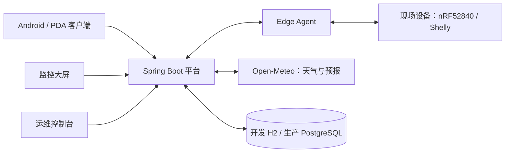

# IoT Manager 项目进度介绍 / Project Progress Overview

**更新日期：** 2026-08-22 
**当前定位：** 面向现场局域网与云端设备的物联网运维平台，当前处于“可运行 MVP + R1 受控试点代码基础”阶段。 
**发布结论：** 可用于本地开发、内部演示和受控联调；尚不是已审批的生产发布版本。

> 本文用于项目介绍和进度汇报。发布授权、验收 Gate 和范围优先级以
> [项目审批意见](PROJECT-APPROVAL-REVIEW.md) 为准；已实现代码与验证证据以
> [实施状态](IMPLEMENTATION-STATUS.md) 为准。

## 1. 项目简介

IoT Manager 将设备接入、设备能力建模、命令下发与确认、遥测/告警、实时动态、站点天气和运维权限统一到一个平台中。它面向现场运维人员、监控人员和管理员，提供三类操作界面：

- **Android/PDA 客户端：** 适合现场巡检、BLE 设备操作、站点切换、天气查看和下拉刷新；
- **监控大屏：** 展示设备状态、实时动态、告警、遥测和站点环境；
- **运维控制台：** 用于设备、Profile、分组、命令、Agent 和站点范围的运营管理。

## 2. 当前已完成内容

| 范围 | 当前进度 | 已交付能力 |
| --- | --- | --- |
| 设备运维基础 | 已完成并本地验证 | 设备发现、认领、分组、归档、活动记录、遥测、告警与实时更新 |
| 设备命令 | 已完成并本地验证 | Profile 能力模型、幂等命令、过期控制、读回确认、`UNCONFIRMED` 状态、批量命令与审计 |
| 三端界面 | 已完成并本地验证 | Android/PDA、监控大屏、运维控制台；三端均支持授权站点上下文 |
| 天气系统 | 已完成并真实接口验证 | Open-Meteo 实时天气、海拔、温湿度、气压、24 小时/7 天预报、环境红黄绿判定、缓存降级与下拉刷新 |
| 刷新体验 | 已完成并本地验证 | 页面刷新节流、60 秒天气手动刷新冷却、`429 + Retry-After`、保留最后可用天气结果 |
| 身份与权限 | 代码/资产已完成 | JWT Resource Server、RBAC、组织/站点/空间隔离、三端 Authorization Code + PKCE、Android Keystore 令牌保存 |
| 多站点 | 已完成并本地验证 | 授权站点列表、站点切换、按站点隔离的 API、缓存和 WebSocket 上下文 |
| Edge Agent | 已完成并自动化验证 | Agent 独立凭据、凭据签发/轮换/撤销、WSS 绑定校验、Shelly Plus Plug S Gen2 与 nRF52840 接入边界 |
| 可观测性 | 代码/资产已完成 | Actuator 健康探针、Prometheus 指标、结构化日志、请求关联 ID、天气/命令/WebSocket 指标与 API 限流 |
| 数据与部署 | 资产已完成 | Flyway V1–V18、PostgreSQL 16、Keycloak、Caddy、非 root 后端镜像、每日逻辑备份脚本和 Compose 编排 |
| CI 验证 | 工作流已配置 | Java 服务、Web/客户端、Android APK、部署镜像四类 GitHub Actions 作业 |

## 3. 关键技术亮点

- **真实天气而非模拟数据：** 后端请求 Open-Meteo，并将天气作为站点环境数据处理；温度、湿度、气压、ESD 与结露风险由服务端统一判定为绿色适宜、黄色观察或红色风险。
- **适合现场网络的连接设计：** PDA 可在“现场 LAN”和“互联网远程”配置之间切换；在保存前会先探测 API 与 WebSocket，避免保存不可用地址。
- **安全实时通信：** 生产模式下 REST 使用 JWT，WebSocket 使用受限的 `Sec-WebSocket-Protocol` bearer 子协议，不在 URL 中暴露令牌。
- **多站点隔离：** 页面切换站点后会重建实时连接并刷新站点数据；后端同时执行组织、站点和空间范围校验。
- **可追溯命令：** 命令具备幂等键、执行状态、结果记录与审计信息，避免网络重试导致重复控制。
- **隐私保护：** 手机定位仅在用户主动操作后获取；天气原始响应会脱敏坐标，持久化指纹采用 HMAC，并按策略进行历史数据粗化。

## 4. 已验证质量快照

验证快照日期为 **2026-08-21**。本地结果如下：

| 模块 | 验证结果 |
| --- | --- |
| Backend（JDK 17） | 111 项测试，0 失败、0 错误、1 项因 Docker 未运行而跳过 |
| Edge Agent（JDK 17） | 7 项测试全部通过 |
| Android/PDA Web 客户端 | 84 项单元测试全部通过；1 项 Playwright 场景通过 |
| Android | 清洁构建、1 项单元测试、Lint、Debug APK 打包和 APK v2 签名校验均通过；Lint 为 0 错误、15 警告 |
| 监控大屏与控制台 | 生产构建通过 |
| 真实后端冒烟 | 健康检查、站点 API、天气刷新、预报、旧 API 弃用头、刷新限流与 WebSocket 联调通过 |
| LAN 可达性 | 后端已验证监听全部网卡；已通过主机 WLAN 地址完成 API 可达性冒烟 |
| 部署静态检查 | Compose 变量展开、YAML、Shell 语法和 Git 差异空白检查通过 |

最新 Debug APK 由 Android 构建生成在本地 `client/android/app/build/outputs/apk/debug/app-debug.apk`；该构建产物不纳入 Git，且仅用于内部测试，尚未使用生产签名。

## 5. 当前阶段与边界

### 可以对外说明的状态

- 项目核心业务、三端界面、天气系统、多站点、身份授权和部署资产均已落地；
- 本地自动化、Android 打包及真实天气/后端联调已有验证证据；
- 当前可支持受控网络中的开发、演示和内部安装测试。

### 暂不能对外声明为“生产已上线”的原因

- Docker Engine 未运行，尚未完成真实 Compose、PostgreSQL Testcontainers、Keycloak 和 Caddy 的运行态验证；
- PostgreSQL 独立恢复演练、不可变备份副本、WAL/RPO/RTO 证据尚未形成；
- nRF52840、Shelly 和真实 Android 手机的定位、BLE、网络切换、覆盖安装测试尚未完成；
- 生产域名、Keycloak OWNER 身份、密钥与天气备用源/逆地理供应商审查尚未完成；
- R1.1 的事件闭环、健康分、命令模板、二维码，以及 R2 的 Redis、mTLS、工单和报表，均未获得提前实施/发布授权。

## 6. 已识别风险与改进项

| 优先级 | 项目 | 说明 |
| --- | --- | --- |
| P1 | 前端开发依赖升级 | 三个前端锁文件均包含 Vite 5 相关的 3 个高危、1 个中危开发依赖漏洞；生产依赖审计为 0 漏洞。升级后需完整回归。 |
| P1 | 正式发布包 | 当前 APK 为 Debug 签名；发布前需要配置 Release 签名、覆盖安装和回滚验证。 |
| P1 | 本机 Java 环境 | 后端必须使用 JDK 17，Android 必须使用 JDK 21+；应清理系统中畸形的 Java 8 `PATH` 项。 |
| P2 | Android Lint 警告 | 包含依赖版本、启动图密度、未使用资源等 15 项警告；不阻断 Debug 构建。 |
| P2 | 前端自动化覆盖 | 监控大屏和运维控制台目前以生产构建验证为主，建议补充关键业务 E2E 场景。 |

## 7. 下一阶段计划

按照当前审批基线，下一步不应先扩展新功能，而应依次完成：

1. 启动 Docker Engine，完成 PostgreSQL、Keycloak、Caddy、后端容器和浏览器/Android PKCE 的完整联调；
2. 完成独立 PostgreSQL 备份恢复演练，形成恢复时长、迁移版本和读写验证证据；
3. 以低压负载完成 nRF52840、Shelly 与 Android 真机最小验收矩阵；
4. 修复开发依赖和正式签名问题后，提交 Gate 2 / Gate 3 所需证据；
5. 只有通过 R1 Gate 后，才按变更审批进入 R1.1 或 R2 的增强功能。

## 8. 相关文档

- [项目 README](../README.md)：项目功能、启动方式和客户端配置；
- [实施状态](IMPLEMENTATION-STATUS.md)：代码实现与可重复验证证据；
- [验证说明](VERIFICATION.md)：本地、CI、Android 与部署校验命令；
- [项目审批意见](PROJECT-APPROVAL-REVIEW.md)：发布 Gate 与授权边界；
- [项目整改基线](PROJECT-IMPROVEMENT-PLAN.md)：R0/R1/R2 技术整改计划；
- [天气功能开发说明](weather-feature-development.md)：天气 API、隐私、状态规则与验收要求。
