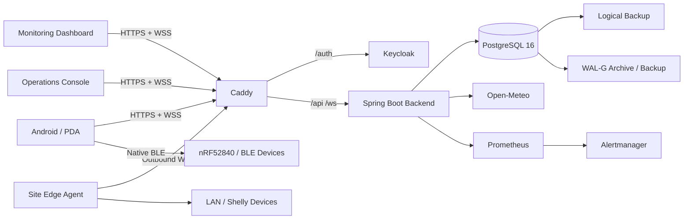
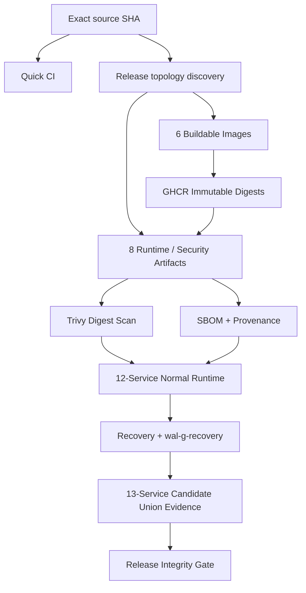
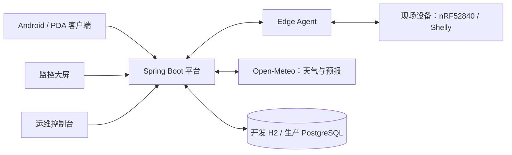
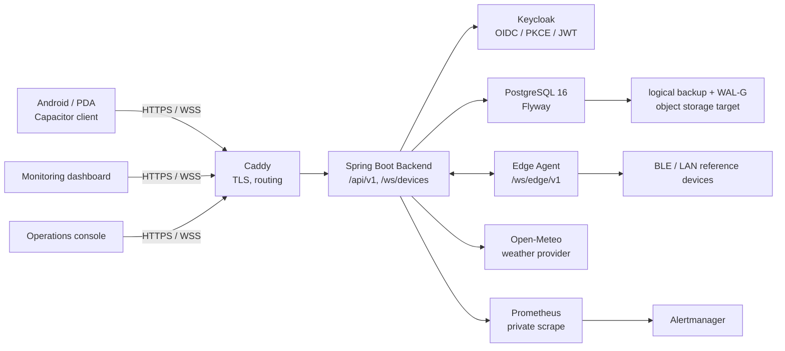
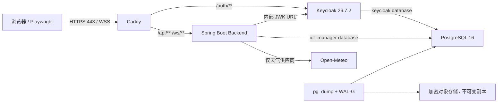
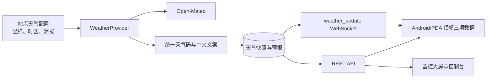
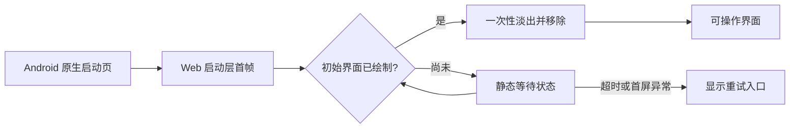

# IoT Manager 项目审核与全部报告原文汇编

> 汇编日期：2026-09-27（Asia/Shanghai）  
> 代码候选：`7675df84906732fa675e35c7520dfb7b75a5d1f7`  
> 内容：本轮综合审核 + 分类索引 + 49 份原有 Markdown 全文。原有文档为 46 份已跟踪、3 份未跟踪。

本文件是文档审计交付，不是新执行的全量测试报告，也不授权部署、删除数据或发布。历史源文的日期、候选、状态和结论保持原样。源文中的命令和工作步骤只是归档内容，不是本轮要求执行的操作。

## 阅读入口

- [本轮综合审核](#current-audit)（单独文件：[审核报告](PROJECT-COMPREHENSIVE-AUDIT-2026-09-27.md)）
- [分类索引](#document-index)（单独文件：[报告索引](PROJECT-REPORT-INDEX-2026-09-27.md)）
- [49 份文档摘要清单](#source-manifest)
- [原文逐份汇编](#original-documents)

原文均在 Markdown 代码围栏中逐字保存，便于追溯而不混淆版本。需要原排版时点击每份标题旁的源文件链接。其摘要按原始文件字节计算；围栏前后的分隔换行不计入原文件。

<a id="current-audit"></a>

---

# IoT Manager 项目综合审核报告与当前状态总表

> 审核日期：2026-09-27（Asia/Shanghai）  
> 审核版本：v1.0  
> 本地代码与 GitHub `main`：`7675df84906732fa675e35c7520dfb7b75a5d1f7`  
> 仓库：<https://github.com/xxbb11122/IotManager>  
> 文档范围：审核开始时 Git 已跟踪或未被忽略的项目 Markdown 共 **49 份**，其中 46 份已跟踪、3 份未跟踪；不含依赖、构建产物、临时日志、聊天附件及本轮新报告。完整清单见[报告索引](PROJECT-REPORT-INDEX-2026-09-27.md)，全文见[全部报告原文汇编](PROJECT-REPORTS-FULL-COLLECTION-2026-09-27.md)。

## 1. 审核结论

项目已经具备可运行的 IoT 设备运维主链，并在当前提交上通过 Quick CI 和普通 P0 Docker Runtime 集成验证。最新客户端还交付了导航、任务归属、稳定节点更新、下拉刷新和减少动态效果等改进。当前定位仍应为 **R1 受控试点候选版本**。

**本次不签发完整 R1 验收、Gate 2/Gate 3 或正式生产发布通过结论。** 当前缺少受保护发布、同库 N→N−1 签名版本回滚、真实远端 WAL-G PITR、完整三工作包验收矩阵、真机与规模测试证据。旧报告中的部分 CI 失败已经修复，但这些剩余验收项不会因为 Quick CI 变绿而自动通过。

本次发现的明确工程缺口是：新增客户端浏览器回归没有完整纳入 Quick CI；生产产物预览隔离检查未加入构建门禁；前端与控制台的 Node 单元测试没有由当前严格验证脚本执行；部分测试依据和复测报告尚未版本化；项目说明与若干历史报告仍停留在旧代码、旧迁移和旧门禁状态。

本报告不沿用旧文档的“完成度 80%”作为当前指标。项目没有一份覆盖全部需求、权重和验收证据的统一分母，继续给出精确百分比会掩盖正式发布门禁的缺失。

## 2. 审核方法与证据边界

本轮执行了代码与配置静态检查、文档目录和版本核对、Git 状态核对、GitHub Actions 结果读取、CI 汇总工件读取以及本机工具链只读检查。**没有重新启动业务服务，没有执行保留清理，没有新增测试或重跑完整测试套件，也没有向 GitHub 提交本轮报告。**

状态定义如下：

| 状态 | 含义 |
| --- | --- |
| 当前证据通过 | 当前 SHA 的相应 CI 作业或工件明确成功；仅证明实际执行范围 |
| 实现存在 | 源码或配置可定位，但缺完整场景验收 |
| 历史通过/失败 | 只适用于原报告标注的候选，不直接继承到当前 SHA |
| 待验收 | 缺执行记录、设备、环境或完整矩阵；不等同于功能已证实失败 |
| 规划项 | 基线/路线图中的后续范围，不当作当前版本已实现能力 |

本轮是有范围的工程审核，未对全部业务代码逐行证明正确，也未进行新的漏洞扫描、渗透测试或真机操作。后文“没有执行记录”均以本轮可访问的仓库级 Actions 和 Runner 数据为边界；例如仓库 Runner 列表为 0，不代表其他组织或电脑绝对不存在可用机器。

### 2.1 当前候选的直接证据

| 证据 | 结果 | 可证明范围 |
| --- | --- | --- |
| [Quick CI 36301579923](https://github.com/xxbb11122/IotManager/actions/runs/36301579923) | success，7 个作业全部成功 | 双时区 Java、Web、Debug APK、Compose/Caddy 静态契约、源码安全与仓库 SBOM、quick-gate |
| UTC Java 汇总工件 | Backend 141 / Edge Agent 7；失败、错误、跳过均为 0 | 包含当前 Java 套件和 PostgreSQL Testcontainers；不是全部 59 个专项用例 |
| Asia/Shanghai Java 汇总工件 | Backend 141 / Edge Agent 7；失败、错误、跳过均为 0 | 与 UTC 同候选运行；不自动证明每个业务时间边界已覆盖 |
| Web 汇总工件 | Client Node 159；Client Playwright 1；Frontend Playwright 1；Console Playwright 1；均无失败/错误/跳过 | 严格脚本实际选择的测试集 |
| Android Debug 作业 | success | JDK 21 / API 36 编译、APK 存在及校验和、工件上传 |
| 源码安全与仓库 SBOM 作业 | success | Gitleaks、Trivy 源码/依赖等配置扫描及仓库 CycloneDX 输出；不代表全部运行镜像通过 |
| [P0 Docker Runtime 36301579906](https://github.com/xxbb11122/IotManager/actions/runs/36301579906) | 普通集成作业 success | 真实 Docker 栈、认证/权限/WSS、数据库重启、逻辑恢复等 |
| 同次 `Immutable 12-service runtime evidence` | skipped | 普通 push 事件按工作流条件跳过；没有提供受保护不可变发布运行证据 |

P0 普通集成实际通过的步骤包括：Compose 启动、PostgreSQL/Caddy 非 root 检查、边界冒烟、应用数据库角色禁止 DDL、备份导出关系检查、PKCE/JWT/四角色/会话生命周期/浏览器与 Agent WSS、数据库重启和 readiness、独立 Compose 项目逻辑恢复、篡改备份拒绝、输出脱敏及限定项目清理。

**连续性限制：** 当前 `7675df8` 仅查到 **1 次** P0 Runtime 成功记录。`70d6e99` 的两次成功和 `b191902` 的成功属于其他候选；若执行标准要求“同 SHA 连续两次”，当前还差一次。最新提交包含客户端业务交互、OIDC 缓存和 BLE 行为变化，不能把旧 SHA 的次数累加为当前验收次数。

### 2.2 正式发布与恢复记录

| 工作流/设施 | 本轮读到的状态 | 审核解释 |
| --- | --- | --- |
| Release Integrity Gate | 0 次运行记录 | 无正式发布完整性通过证据 |
| Immutable Image Security | 0 次运行记录 | 当前不可变镜像的完整安全闭环未执行 |
| Protected WAL-G Recovery Drill | 0 次运行记录 | 无该工作流出具的物理 PITR/RPO/RTO 证据 |
| Isolated N-to-N-1 Rollback Drill | 2 次历史运行，最新为旧 SHA `5f5319f` 的 failure | 无成功的真实回滚记录；历史解析问题已修复不等于演练通过 |
| 仓库自托管 Runner 列表 | `total_count=0` | 所需 `self-hosted, linux, iot-manager-recovery` 执行条件未在仓库列表中就绪 |

## 3. 产品定位与范围审核

建议继续保持“**单组织、多站点、可审计的 IoT 设备运维平台**”定位，主要用户是现场操作人员、监控人员和管理员。三端分别承担 PDA/Android 操作、监控大屏和运维控制台，后端统一设备身份、权限、命令、遥测和环境上下文。

当前价值集中在设备接入与认领、能力模型、命令确认、站点隔离、实时信息、天气上下文、备份恢复和交付证据。它尚不具备把自己定位为已验证的大规模多租户平台或通用工业控制平台的证据。

范围优先级沿用现有文件关系：`PROJECT-APPROVAL-REVIEW.md` v1.3 > `PROJECT-IMPROVEMENT-PLAN.md` v1.6 > `FEATURE-EXPANSION-EVALUATION-AND-ROADMAP.md` v1.3。专项开发/测试文档补充执行细节，不自动授予发布批准。

| 版本范围 | 当前判断 |
| --- | --- |
| R1 核心 | 安全、生产数据库、备份、真实设备接入边界、天气可靠性、最小多站点切换；主体代码已存在，剩余硬门禁待验收 |
| R1.1 候选 | 事件闭环、健康分、命令模板、二维码等按审批条件进入；不能算入当前 R1 已交付功能 |
| R2 平台 | Redis 实时总线、mTLS、规模/安全/故障演练等仍需独立交付与验收 |
| R3/范围变更 | 工单、报表、OTA、更多协议、多租户等按原基线管理，不自动提前 |

天气的红黄绿与 ESD/结露提示是平台规则计算结果。本次未取得真实场站传感器校准或行业验收记录，不能把室外天气数据直接等同于现场设备内部或室内实测环境。

## 4. 架构、模块与接口现状

当前主要技术为 Java 17 / Spring Boot 3.5.16、PostgreSQL 16、H2 开发库、Keycloak、Caddy、Node 22 / Vite、Capacitor Android，以及 Prometheus、Alertmanager、逻辑备份与 WAL-G 资产。

静态规模仅用于说明维护范围：Backend 主源码目录 192 个文件、测试目录 41 个；Edge Agent 主源码 36 个、测试目录 5 个；Client `test` 36 个文件、`e2e` 10 个文件；Frontend、Console 各有 1 个 Node 测试文件。文件数量不能代替测试覆盖率。

| 模块 | 已有实现与证据 | 当前限制/未达目标 |
| --- | --- | --- |
| 设备与 Profile | 发现、认领、分组、归档、能力验证、活动与遥测；当前 Java/Web 检查通过 | 各真实型号、异常硬件反馈和完整现场流程未验收 |
| 单条/批量命令 | 幂等、状态、ACK、结果审计、批量服务 | ACK 只代表协议层实际回执；负载、重试/乱序和所有设备驱动组合仍缺实证 |
| 告警 | 告警状态、确认和事件记录 | 不能当作已实现完整工单或 incident 聚合闭环 |
| 多站点与角色 | 三端上下文、后端站点授权、OWNER/ADMIN/OPERATOR/VIEWER、OIDC/PKCE | R1 单组织多站点边界；不等于多租户商业平台验收 |
| 实时通信 | WebSocket 及 Agent WSS；当前 P0 通过相关认证与边界检查 | `WebSocketService` 会话仍保存在进程内 Map；多实例广播/总线不完整 |
| 移动端/PDA | Android Debug 构建、连接设置、缓存、定位、BLE 适配、导航与刷新 | 签名 Release、真机安装/升级/回退、权限与系统生命周期验收未完成 |
| 天气 | Open-Meteo、即时天气/预报、海拔、温湿压、风险规则、缓存和失败保留 | 本轮未做外部天气服务实测；供应商配额、长期可用性与批准后的备用源仍待落实 |
| Edge Agent | 独立凭据、WSS、轮换/撤销、Shelly 驱动；7 个 Java 测试通过 | 真实网络/设备矩阵、mTLS、更多协议未完成 |
| nRF52840 | 参考固件、NUS 帧与 token ACK、Zephyr 构建说明 | 当前 Quick CI 未包含固件构建；本轮无编译/烧录证据 |
| 时间权威 | `TimeProvider`、注入 Clock、UTC 决策、旧时间兼容和偏差识别 | 历史数据来源、DST、同库 N/N−1、全部精确边界未完整验收 |
| 数据保留 | 归档、摘要、hold、锁、续租、水位、dry-run、容量接口/指标 | 默认关闭且 dry-run；缺完整双实例竞态、全部类别和恢复后对账 |
| 备份恢复 | 普通 P0 逻辑备份、独立恢复、篡改拒绝已通过 | 逻辑恢复不能替代物理 PITR；远端 S3/WAL/RPO/RTO 待实演 |
| 可观测性 | Actuator、readiness、Prometheus、结构化日志、Alertmanager 资产 | 真正告警通知送达、值班流程、SLO、长期容量与日志留存未完成验收 |
| 交付与供应链 | 固定 Actions、源码安全、SBOM、不可变交付脚本与门禁 | 当前全镜像扫描、签名制品、受保护 Gate 和长期读回证据未闭合 |

### 4.1 API 与版本化

当前存在 `/api/v1`，部分旧 `/api` 路径为兼容入口。接口组覆盖设备、命令、批量命令、分组、Profile、发现、站点、天气、当前用户、告警、遥测、时间、Agent 凭据与保留 hold；设备 WebSocket 为 `/ws/devices`，Agent 为 `/ws/edge/v1`。

因此 `PROJECT-EVALUATION.md` 中“当前只有 `/api`、尚未版本化”的描述已过时。另一方面，本次未找到可作为完整消费端契约的 OpenAPI 交付记录；版本号存在不等于所有字段、错误码、分页、弃用策略和兼容窗口已有机器可执行合同。

### 4.2 数据库迁移

当前公共目录有 19 个 SQL，H2 专用目录 6 个、PostgreSQL 专用目录 5 个。因此 H2 实际 SQL 合计 **25**，PostgreSQL 实际 SQL 合计 **24**，最高版本均为 **V25**；V19 仅属于 H2，V24 在两个数据库目录内分别实现。

“SQL 文件数量”“最高迁移版本”“Flyway history 行数”必须分开。含 baseline 行的历史记录数不应直接当成 SQL 数量。恢复校验应使用与备份/候选绑定的迁移元数据，不能继续写死 V18。

## 5. 当前问题清单与优先级

这里将实际实现/流程缺口、发布阻断和待验证风险分别说明，避免把缺证据一律写成业务 BUG。

| 编号 | 等级/类型 | 发现与证据 | 影响 | 关闭条件 |
| --- | --- | --- | --- | --- |
| AUD-01 | P1 / CI 覆盖缺口 | `scripts/verify.sh:223` 与 `verify.ps1:293` 在 strict 模式只选 `mobile-client.spec.js`；当前汇总 Client Playwright=1 | 27 条本地客户端浏览器回归不能持续阻止后续回归 | 将不依赖真实平台的 motion/offline 测试集显式纳入 Quick CI，分离 runtime-auth/load；上传明细 |
| AUD-02 | P1 / 构建门禁缺口 | `check-production.mjs` 存在，但 `client/package.json` build 仅 `vite build`；严格验证脚本没有调用隔离检查 | 预览隔离目前依赖本地手工执行和 serve-only 插件，缺持续产物证据 | Web 与 Android 构建后执行产物检查；泄漏负例应使门禁失败 |
| AUD-03 | P1 / CI 覆盖缺口 | Frontend/Console 都有 Node 测试文件，但严格脚本对两者只调用 Playwright+build | WebSocket 重连等单元检查不在当前 Quick CI 的必经路径 | 补两端 `npm test` 和可解析汇总，确保无失败/跳过 |
| AUD-04 | P0 / 正式发布阻断 | Release Gate 与 Immutable Image Security 均 0 次记录；普通 P0 的不可变 12 服务作业 skipped | 无同一候选完整 digest/镜像安全/证明/运行证据 | 当前候选经受保护完整流程成功，缺证据时拒绝发布 |
| AUD-05 | P0 / 回滚恢复验收阻断 | 仓库 Runner=0；回滚仅旧失败记录；物理恢复 0 次 | 无法证明 N→N−1 与 RPO≤15min/RTO≤60min | 准备隔离受保护 Runner、签名版本和独立 S3/PG 目标，完成真实演练及数据对账 |
| AUD-06 | P1 / 专项验收缺口 | 59 项完整矩阵没有当前 SHA 的逐项复测报告；当前 P0 同 SHA 仅 1 次 | 三项可靠性功能不能整体宣布通过 | 按当前冻结候选补 59 项证据和第二次 P0；未完成项继续记待验收 |
| AUD-07 | P1 / Android 与真机缺口 | 当前 CI 只交付 Debug；无 Release 签名/真机/PDA验收记录 | 安装升级、硬件权限、后台恢复与发布回退无法正式放行 | 完成签名 Release、目标设备矩阵和留证 |
| AUD-08 | P1 / 证据版本化缺口 | 测试计划、整改计划、9月25日复测报告仍是 untracked | GitHub 使用者无法取得完整一致的验收依据 | 审阅后将三份文档纳入版本管理，并固定候选关联；本轮不擅自推送 |
| AUD-09 | P2 / 文档漂移 | README 仍指向70d6；旧进度报告写 V18、旧测试数或 Runtime 未通过；动效报告保留 CI 构建前的 K3 本地阻断 | 用户会得到互相矛盾的状态 | 增加当前状态入口与历史快照标识，保留原始结果但补后续证据链接 |
| AUD-10 | P1（扩容前）/ 架构限制 | WebSocket 会话为进程内 Map；未见 Redis 实时总线交付 | 当前不能据此承诺多副本实时一致性/高可用 | 按 R2 基线交付总线、补偿、锁与跨实例故障验收 |
| AUD-11 | P1（规模承诺前）/ 容量证据缺口 | 仓库有运行态负载场景，但当前 Quick CI 未执行；无本轮可核验1000设备/长稳结果 | 无可对外承诺的容量、延迟和资源基线 | 冻结负载模型、环境和阈值，提供负载/故障/保留并发对照 |
| AUD-12 | P2 / 本地可复现性 | 默认 shell 为 Java8/Node24，仓库要求 Java17、Android21、Node22；Docker Linux Engine 当前不可用 | 按默认终端命令启动/构建可能失败或产生环境差异 | 命令级固定工具链与启动说明；不要把本机配置不足当成功能缺陷 |
| AUD-13 | P2 / 固件持续验证 | 固件有 Zephyr3.7.2声明，但当前Actions未覆盖 | 不能保证以后修改始终可编译或与App协议一致 | 增加固定 SDK 固件构建与帧协议回归；烧录另列真机证据 |

P0 在本表表示“阻断正式发布/相应验收”，不是说当前受控开发演示无法运行。当前没有新的运行态复现支撑“业务已损坏”结论，也没有依据声明项目不存在其他 BUG。

## 6. 已修复问题与旧报告复核

| 历史问题 | 当前证据/处理 | 当前结论 |
| --- | --- | --- |
| SBOM 输出目录不存在、证据丢失只告警 | 当前源码安全/SBOM作业成功，目录和 fail-closed 上传逻辑已存在 | 不能继续列为当前相同失败 |
| Gitleaks 将 Secret 文件名清单识别为值 | 后续修复提交及当前 Gitleaks 作业成功 | 原候选失败记录保留；当前门禁已通过 |
| Android setup/多一层 client 产物路径 | 当前 Android 作业成功并上传 APK/checksum | 编译和产物校验问题已关闭；真机与 Release 另验 |
| P0 Secret 路径不一致 | 后续修复并由当前完整普通 Runtime 成功支撑 | 原启动阻断已消除 |
| Alertmanager 构建/依赖元数据、Runner 中止 | 后续修复，当前普通 P0 完整成功 | 旧运行中断不能当作当前 Runtime 仍红 |
| 固定 Flyway18 导致迁移/恢复错误 | 恢复基线改为从备份/当前迁移导出；当前 Java和逻辑恢复通过 | V18 固定基线不再适用；物理恢复尚未实演 |
| 保留测试相互污染、时间规则误扫注释 | 隔离/AST等修复后当前双时区Java零失败/零跳过 | 修复了相应自动化门禁问题 |
| dry-run 漏计同轮新归档后清理 | `70d6e99` 增加 projected archive 模拟及回归，当前候选包含该修复 | 局部预测一致性有回归；不是全类别/调度/竞态完整验收 |
| Open-Meteo 拒绝 `Z/+00:00` | Provider 将零偏移标准化为 UTC，非零固定偏移使用 auto | 代码修复存在；本轮未重新请求外部天气接口 |
| 主动定位可使用5分钟旧位置 | 浏览器/原生位置选项 `maximumAge: 0` | 主动取新位置约束已落地；真实GPS效果待设备证据 |
| nRF参考固件与声明工具链不符 | 当前保留 Zephyr3.7.2 参考实现/构建说明 | 本轮未重编译，不将历史声明当当前固件CI通过 |

`2026-09-24` 报告的 **0 PASS / 5 FAIL / 54 BLOCKED** 属于 `609c9f0`；`2026-09-25` 报告的 **1 PASS / 3 FAIL / 55 BLOCKED** 属于 `ee036dd`。它们都是历史候选快照。不能继续用这些数值断言当前代码仍同样失败，也不能未经完整逐项复测就把 FAIL/BLOCKED 批量改成 PASS。

## 7. 三项可靠性功能专项评价

### 7.1 时间权威

实现已包括统一 Clock/TimeProvider、UTC Instant 决策、兼容旧 LocalDateTime 的 legacy-zone、权威接收时间和 Edge 偏差记录。当前双时区 Java及时间静态约束通过，说明基础实现与已有回归可用。

仍需补：命令TTL/天气/限流/保留的精确边界，偏差30秒±1ms、恢复与再次超限，乱序/跨分钟的ID级对账，HTTP新旧时间合同，DST与无效legacy-zone，历史行来源审计，以及 N/N−1 同库兼容。结论为“实现存在、局部回归通过、专项完整验收未关闭”。

### 7.2 N→N−1 回滚

工作流、不可变镜像选择、前置拒绝、隔离目标、证据签发和清理约束已有代码。当前部署静态合同成功，但 GitHub 无成功的真实回滚演练，受保护 Runner 也未在仓库中登记。

需要真实签名 N/N−1（以及留存规则要求的N−2）制品，在同一隔离 PostgreSQL 库完成 N 写入、N−1 读写、API/OIDC/RBAC/WSS/Edge 回归，并记录拒绝样本、清理、应用恢复耗时与证据读回。结论为“工程资产已实现、实际回滚能力尚未验收”。

### 7.3 数据保留

代码具备默认关闭/dry-run、90天热遥测/365天总遥测等策略、摘要校验归档、hold、租约与批次锁、水位恢复、审计和容量采样。当前H2/PG局部回归通过，已修复同轮预测少计问题。

仍需补：两个真实调度周期的无写入证明、全部类别和ID集合的阈值对账、hold与清理双顺序竞态、租约丢失/进程崩溃/重放、复制后删除前故障、历史归档接口权限与限流、真实容量输入，以及实际清理之后的独立物理恢复。**保持默认关闭和 dry-run，直至对应启用标准满足。**

三项功能不能合并写成“均已通过全部测试”。时间/保留已有实质实现与自动化证据；回滚的主要缺口是受保护执行条件与真实演练；三者均缺完整专项收口报告。

## 8. 最新客户端与动效审核

`7675df8` 涉及56个文件，内容超出动画样式：还修改了请求归属、导航历史、OIDC会话分区、缓存隔离、BLE扫描/连接和主运行时。这些变化需要按业务状态变化验收。

已有交付为9页、39点击分支、13类字段、2条手势、42场景/144变体；本地实施报告记录159个单元测试、27条指定浏览器用例以及生产预览隔离检查。当前CI再次证明159单元测试与APK构建成功，但只执行1条客户端浏览器用例。

需要保留的升级说明：旧会话缺可信Issuer/Client/授权分区时需要重新登录；旧无身份/站点归属的缓存不自动导入；本地BLE绑定保留但不代表GATT在线；源码回退可能重新读到旧缓存，不能只凭IndexedDB版本未变判定安全。

原动效报告K3“本地缺工具链、未构建APK”是开发阶段范围说明。现在当前SHA的GitHub Debug APK构建已成功，应补充该后续证据；这仍不能关闭真实APK安装、覆盖升级、TalkBack、系统字体、返回/键盘/权限和目标PDA性能门禁。当前P0也补充了真实OIDC/WSS基础联调，但没有覆盖全部新增跨上下文、命令和动效交互矩阵。

开发预览使用 serve-only Vite 插件、合成模型、CSP `connect-src 'none'` 与权限限制。设计有清楚边界；后续应把产物检查自动接到所有交付路径，并补完整状态转换验证，不能将“144变体可展示”当作144种真实流程均通过。

## 9. 安全、隐私和供应链审核

生产配置已启用JWT、站点授权、WSS/HTTPS、显式Origin、限流和数据库readiness，关闭H2 Console；Docker配置使用Secret与最小权限数据库角色。当前普通P0覆盖了认证、角色、WSS及数据库权限等重要边界。

开发配置默认关闭认证/限流、允许开发Origin并绑定网络接口。这适合受控开发环境；部署时必须明确使用生产配置。不能把开发模式下的可访问性当作生产权限模型通过，也不能通过放宽生产配置解决手机联调问题。

天气相关代码存在位置请求、坐标校验、缓存、持久化指纹与隐私处理。当前仅看到Open-Meteo实现；QWeather备用源须按审批前提处理合同/配额/隐私审查，不能为了让报告“完整”而假称已接入。

历史 `IMAGE-SECURITY-STATUS.md` 记录了未关闭镜像发现，其版本/计数只对当时digest和扫描数据库有效。当前源码扫描成功**不能证明这些运行镜像风险已清零**，也不能简单照抄历史计数作为今天结果。应执行当前候选的Immutable Image Security并按精确digest/CVE给出修复或有期限的审批例外。

Actions临时工件通常只有14/30/90天。仓库已有长期OCI证据和版本保留设计，但在正式工作流未完成前，不能声称N/N−1/N−2证据已长期可取回。生产验收应包含实际读回及过期/缺失的拒绝验证。

## 10. 部署、恢复、容量与运维

普通Docker集成栈已经通过当前候选的真实启动、权限、认证、数据库重启和逻辑恢复。这是项目相较早期报告的重要进展。

剩余运行态工作包括：同候选受保护不可变12服务证据；13服务候选并集与恢复附加服务证据；真实远端对象存储的WAL完整链；RPO/RTO计时；监控通知送达与故障处理；资源上限、备份保留和长期容量；单实例宕机与多副本行为。

当前没有可支撑“1000设备已达标”的本轮证据。负载脚本存在只代表可执行入口，必须固定设备类型、消息频率、并发连接、命令比例、保留任务负载、持续时长和延迟/错误/资源阈值后才能报告容量。

本机当前默认Java8、Node24；JDK21的两个用户目录存在，但Android SDK配置未由本轮确认，`client/android/local.properties`不存在；Docker Linux Engine无法连接。上次本地已用指定JDK17和IDEA自带Maven运行开发栈并按用户要求停止。本轮没有尝试改变本机环境或恢复运行。

## 11. Android 安装包与发布状态

当前 `7675df8` 的Debug APK已由[最新Quick CI](https://github.com/xxbb11122/IotManager/actions/runs/36301579923)生成并上传。应从该运行的Artifacts识别候选SHA、APK和checksum。

本对话上一次实际交付的本地安装包来自 `b191902`，因此不包含后续 `7675df8` 的动效及关联交互修改。本轮是报告交付，没有重新安装或签发Release APK。签名配置和构建脚本存在，与“正式签名包已出具并完成覆盖安装/回退”是不同状态。

## 12. 文档一致性与全部报告说明

审核开始时49份Markdown全部纳入索引和原文汇编，包含报告、计划、审批、运行手册、模块说明与4份早期设计文档。将设计/计划也纳入，是为了避免只给结果报告而遗漏验收依据。

| 文档/问题 | 当前解释与处理建议 |
| --- | --- |
| README | 引用70d6与旧工件，遗漏最新动效；保留精确SHA是正确做法，但应增加最新状态入口与变更说明 |
| PROJECT-EVALUATION.md | 8月20日历史评价；“尚无API版本化”等已被代码超越 |
| PROJECT-PROGRESS-OVERVIEW / R1实施状态 | 8月快照，不宜继续被当作当前功能清单 |
| PROJECT-PROGRESS-EVALUATION-2026-09-02 | 测试数、V18和“未提交工作区”等为历史事实；80%不能复用为当前进度 |
| R1 9月24日/25日测试报告 | 仅对原候选有效；保留原失败与阻断，新增后续复验映射而不篡改旧记录 |
| CLIENT-MOTION-IMPLEMENTATION-REPORT | 本地工作区证据边界清楚；需补当前SHA CI/APK后续证据，不扩大为全平台验收 |
| PROJECT-IMPROVEMENT-PLAN 迁移规划 | “R1.1从V20分配”已与V20～V25被可靠性工作占用的现实不符；后续迁移须从实际历史继续分配，不得复用 |
| IMAGE-SECURITY-STATUS | 仍是历史安全快照，既不能当当前漏洞计数，也不能因源码扫描绿而删除其未关闭风险 |
| 3份untracked可靠性文档 | 当前只在本地，尚非GitHub交付内容；索引明确标识 |
| 多个计划/框架版本 | 应按审批关系与专项版本区分；本报告不以修改日期自动覆盖审批权威 |

三份尚未跟踪的文件为：

1. `docs/R1-RELIABILITY-TEST-PLAN-AND-ACCEPTANCE-v1.0.md`
2. `docs/R1-RELIABILITY-TEST-REMEDIATION-PLAN-v1.0.md`
3. `docs/R1-RELIABILITY-TEST-REPORT-2026-09-25.md`

原文汇编保留每份源文档的全文、路径、Git状态和SHA-256，供追溯。历史文件中的“当前”“已通过”“未完成”仍指它自己的日期和候选，阅读时以本报告对当前SHA的核对为入口。

## 13. 建议执行顺序与验收标准

| 顺序 | 工作项 | 负责人角色 | 可交付的关闭证据 |
| --- | --- | --- | --- |
| 1 | 把动效/离线浏览器集、预览产物隔离和两端Node测试接入CI | 前端+测试+CI | 当前SHA明细工件，全部选定用例实际执行，生产泄漏检查必经 |
| 2 | 统一当前状态文档，版本化3份可靠性依据，更新迁移编号规则 | 技术负责人+测试 | 同一SHA的需求/代码/用例/结果关联表及历史标识 |
| 3 | 冻结候选，补同SHA第二次P0并执行完整59项可运行部分 | 后端+测试+DevOps | 每项PASS/FAIL/BLOCKED及实际证据；不重用旧候选通过次数 |
| 4 | 配置受保护Runner和签名制品，运行全镜像安全与Release Gate | DevOps+安全 | digest清单、扫描、SBOM、provenance、必需服务证据完整且通过 |
| 5 | 时间历史数据/保留多实例/真实回滚与清理后PITR | 后端+DBA+测试 | 独立库和ID对账、故障矩阵、N→N−1记录及实测RPO/RTO |
| 6 | Android Release和目标真机验收 | 移动端+硬件+测试 | GPS/BLE/弱网/权限/冷热启动/覆盖升级/回退/可访问性/性能证据 |
| 7 | 1000设备与长稳、通知值班、运行手册演练 | 性能测试+运维 | 固定环境负载、延迟/错误/资源基线、告警送达和恢复记录 |
| 8 | 按Gate批准再扩展R1.1/R2功能 | 产品+架构 | 审批后的范围、数据模型、依赖、迁移与验收 |

不建议在上述证据未收口前，把工单、健康分、报表、OTA等全部并进一次开发。优先补持续验证和发布恢复，使现有功能能够稳定交付。

## 14. 审核覆盖清单

| 方面 | 本轮覆盖 | 仍需的专门工作 |
| --- | --- | --- |
| 定位/范围/审批 | 对照审批、整改、路线图 | 实际责任人签署和范围变更授权 |
| Git/交付状态 | 本地HEAD、远端main、未跟踪文件、最新提交 | 本轮未提交报告 |
| 业务/API | 控制器、服务、接口版本和模块交叉核对 | 全业务路径与数据精确边界测试 |
| 客户端/动效/离线 | 最新提交、报告、CI选择范围、预览隔离入口 | 全浏览器矩阵、真实后台状态转换 |
| 时间/迁移/保留/回滚 | 源码关键路径、默认策略、历史报告、当前CI | 59项完整复测与真实故障注入 |
| 权限/隐私/安全 | 开发/生产配置、当前认证运行证据、扫描范围 | 当前全镜像扫描、专门安全测试 |
| Android/BLE/固件/Edge | 构建入口、当前Java/APK证据、协议与工具链说明 | 真机、编译/烧录、实设备联调 |
| 部署/备份/恢复 | 当前普通P0各步骤、受保护工作流记录 | 不可变全栈、S3 PITR、RPO/RTO |
| 容量/稳定性/运维 | 架构限制、负载入口、监控与手册 | 1000设备、长期弱网、值班与告警演练 |
| 文档/追溯 | 全49份目录、版本/关键状态、全文汇编 | 持续更新状态入口与长期证据存储 |

## 15. 主要证据入口

- [当前代码提交](https://github.com/xxbb11122/IotManager/commit/7675df84906732fa675e35c7520dfb7b75a5d1f7)
- [当前Quick CI](https://github.com/xxbb11122/IotManager/actions/runs/36301579923)
- [当前普通P0 Runtime](https://github.com/xxbb11122/IotManager/actions/runs/36301579906)
- [严格验证脚本](../scripts/verify.sh)、[PowerShell严格验证](../scripts/verify.ps1)
- [客户端动效实施报告](CLIENT-MOTION-IMPLEMENTATION-REPORT.md)
- [保留服务](../backend/src/main/java/com/iot/manager/service/RetentionService.java)、[时间服务](../backend/src/main/java/com/iot/manager/service/TimeProvider.java)
- [开发态隔离检查](../client/src/dev/motion-preview/check-production.mjs)
- [生产配置](../backend/src/main/resources/application-prod.yml)、[默认配置](../backend/src/main/resources/application.yml)
- [完整报告索引](PROJECT-REPORT-INDEX-2026-09-27.md)
- [全部报告原文汇编](PROJECT-REPORTS-FULL-COLLECTION-2026-09-27.md)

本报告是2026-09-27的审核快照。后续代码、部署环境或工作流变化后，应重新建立候选与证据关联，不能将此报告永久作为发布批准。


<a id="document-index"></a>

---

# IoT Manager 全部报告与项目文档索引

> 盘点日期：2026-09-27（Asia/Shanghai）  
> 代码候选：`7675df84906732fa675e35c7520dfb7b75a5d1f7`  
> 范围：审核开始时，Git 已跟踪或未被忽略的项目 Markdown 共 **49 份**，其中 **46 份已跟踪、3 份未跟踪**。不包括依赖、构建产物、临时日志、聊天附件及本轮新报告。  
> 本轮结论入口：[项目综合审核报告](PROJECT-COMPREHENSIVE-AUDIT-2026-09-27.md)。

## 1. 怎么阅读

先读本轮综合审核报告，了解当前代码、CI、缺陷与验收缺口；再按下面的索引查看依据。**历史报告里的“当前”“已通过”只对它标注的日期、工作区或 SHA 有效。** 计划、审批、实施、测试、运行手册是不同类别，不互相替代。

本轮同时交付[全部报告原文汇编](PROJECT-REPORTS-FULL-COLLECTION-2026-09-27.md)：前部是本轮综合审核，后部包含下面 49 份文档的完整 Markdown 源文、相对路径、Git 状态、字节数和 SHA-256。源文使用代码围栏保存，以避免合并后同名标题、相对链接或 HTML 改变原文含义；需要原排版时打开本索引链接的源文件。汇编不是一份新的统一开发指令，也不会自动覆盖原审批关系。

三个未跟踪文件已纳入此次本地交付，但**纳入汇编不等于已提交 GitHub**。本轮不修改原始报告，也不改写其历史测试结果。

## 2. 分类总览

| 分类 | 数量 | 用途 |
| --- | ---: | --- |
| A 项目介绍、审批、路线图与综合进度 | 10 | 定位、范围、历史状态 |
| B P0/R1、三项可靠性与天气 | 11 | 专项开发依据、测试和整改 |
| C 客户端动效与预览 | 9 | 最新客户端设计、实施与验收边界 |
| D 部署、验证、安全与证据运维 | 12 | 实际执行入口和发布政策 |
| E Edge、固件与设备 Profile | 3 | 接入协议和模块使用 |
| F 早期移动端设计与实施计划 | 4 | 历史设计追溯 |
| **合计** | **49** | **46 已跟踪 + 3 未跟踪** |

日期和版本以文内声明为准；“未单列”不代表文件没有 Git 历史。下表“已跟踪”指盘点时已受 Git 管理，不是说文件中全部验收项已经通过。

## 3. A：项目介绍、审批、路线图与综合进度（10）

| 编号 | 源文档 | 文内日期/版本 | 当前阅读定位 | Git 状态 |
| --- | --- | --- | --- | --- |
| A01 | [项目介绍 / README](../README.md) | 滚动维护 | 入口介绍仍引用较早候选；最新事实先看本轮审核 | 已跟踪 |
| A02 | [早期项目评估](../PROJECT-EVALUATION.md) | 2026-08-20 | 历史评价，部分 API/完成状态已过时 | 已跟踪 |
| A03 | [严格审批意见](PROJECT-APPROVAL-REVIEW.md) | 2026-08-20 / v1.3 | 范围与 Gate 的最高优先级依据；不是当前 Gate 签发记录 | 已跟踪 |
| A04 | [整改与升级实施基线](PROJECT-IMPROVEMENT-PLAN.md) | 2026-08-21 / v1.6 | 审批对象；旧迁移编号规划须与当前 V25 对账 | 已跟踪 |
| A05 | [功能扩展评估与路线图](FEATURE-EXPANSION-EVALUATION-AND-ROADMAP.md) | 2026-08-20 / v1.3 | 范围补充提案，不能自动扩大 R1 | 已跟踪 |
| A06 | [早期实施状态](IMPLEMENTATION-STATUS.md) | 2026-08-21 快照 | 已明确归档，不能当最新测试结果 | 已跟踪 |
| A07 | [项目进度介绍](PROJECT-PROGRESS-OVERVIEW.md) | 2026-08-30 | 历史进度说明 | 已跟踪 |
| A08 | [8月30日严格审计](PROJECT-AUDIT-2026-08-30.md) | 2026-08-30 | 历史审核与当时阻断项 | 已跟踪 |
| A09 | [9月1日全维度审计](CURRENT-PROJECT-REPORT-2026-09-01.md) | 2026-09-01 / v1.1 | 历史 SHA 的综合审计，不自动继承到最新候选 | 已跟踪 |
| A10 | [9月2日进度评价](PROJECT-PROGRESS-EVALUATION-2026-09-02.md) | 2026-09-02 / v1.0 | 旧测试数、旧迁移和百分比不用于当前放行 | 已跟踪 |

## 4. B：P0/R1、三项可靠性与天气（11）

| 编号 | 源文档 | 文内日期/版本 | 当前阅读定位 | Git 状态 |
| --- | --- | --- | --- | --- |
| B01 | [P0 Docker 全链路开发方案](P0-DOCKER-FULL-CHAIN-DEVELOPMENT-PLAN.md) | 2026-08-30 / v1.3 | 全链路工程方案；当前普通 Runtime 成功不等于正式发布批准 | 已跟踪 |
| B02 | [R1 收敛开发文档](R1-COMPLETION-DEVELOPMENT-PLAN.md) | 2026-08-25 / v1.0 | R1 实施补充，验收须绑定当前候选 | 已跟踪 |
| B03 | [R1 收尾实施状态](R1-COMPLETION-IMPLEMENTATION-STATUS.md) | 2026-08-30 / v1.2 | 8月实施快照，部分阻断状态已被后续代码推进 | 已跟踪 |
| B04 | [可靠性与发布闭环方案](R1-RELIABILITY-AND-RELEASE-CLOSURE-PLAN.md) | 2026-09-21 / v1.0 | 三工作包的上层收敛方向 | 已跟踪 |
| B05 | [时间/回滚/保留增补 v1.0](R1-RELIABILITY-ADDENDUM-TIME-ROLLBACK-RETENTION.md) | 2026-09-22 / v1.0 | 原始提案；与修订稿区分阅读 | 已跟踪 |
| B06 | [时间/回滚/保留增补 v1.1](R1-RELIABILITY-ADDENDUM-TIME-ROLLBACK-RETENTION-v1.1.md) | 2026-09-22 / v1.1 | 修订开发依据；文首“待实施”不是当前实现状态 | 已跟踪 |
| B07 | [可靠性测试方案与执行标准](R1-RELIABILITY-TEST-PLAN-AND-ACCEPTANCE-v1.0.md) | 2026-09-24 / v1.0 | 59 编号用例、S0～S7 门禁；尚缺当前候选逐项闭环 | **未跟踪** |
| B08 | [可靠性测试整改方案](R1-RELIABILITY-TEST-REMEDIATION-PLAN-v1.0.md) | 2026-09-24 / v1.0 | 依据旧失败报告制定；修复与剩余项看本轮映射 | **未跟踪** |
| B09 | [9月24日专项测试报告](R1-RELIABILITY-TEST-REPORT-2026-09-24.md) | 2026-09-24 | `609c9f0`：0 PASS / 5 FAIL / 54 BLOCKED，保留历史原值 | 已跟踪 |
| B10 | [9月25日阶段性复测报告](R1-RELIABILITY-TEST-REPORT-2026-09-25.md) | 2026-09-25 | `ee036dd`：1 PASS / 3 FAIL / 55 BLOCKED，非当前 SHA 完整复测 | **未跟踪** |
| B11 | [天气与环境状态开发文档](weather-feature-development.md) | 历史设计稿 | 原始规则与界面需求；不替代供应商审查、真机或现场环境验收 | 已跟踪 |

## 5. C：客户端动效与预览（9）

| 编号 | 源文档 | 文内日期/版本 | 当前阅读定位 | Git 状态 |
| --- | --- | --- | --- | --- |
| C01 | [动效覆盖登记册](CLIENT-MOTION-COVERAGE-REGISTER.md) | 2026-09-27 | 42 设计场景的登记；登记不等于逐项验收 | 已跟踪 |
| C02 | [早期动效框架](CLIENT-MOTION-DESIGN-FRAMEWORK.md) | 草案 v1 | 历史草案，完整范围以全覆盖框架 v3 为准 | 已跟踪 |
| C03 | [Android/PDA 基础动效设计](CLIENT-MOTION-DESIGN-PLAN.md) | 2026-09-24 / v3 | 基础阶段记录，不代替全 App 全平台验收 | 已跟踪 |
| C04 | [全 App 动效开发方案](CLIENT-MOTION-DEVELOPMENT-PLAN.md) | 2026-09-27 / v1.1 | 当前实施计划与流程 | 已跟踪 |
| C05 | [全 App 动效覆盖框架](CLIENT-MOTION-FULL-COVERAGE-FRAMEWORK.md) | 2026-09-27 / v3 | 当前设计基线，实施前差距列不能当最新进度 | 已跟踪 |
| C06 | [动效实施与自检报告](CLIENT-MOTION-IMPLEMENTATION-REPORT.md) | 2026-09-27 | 159 单元/27 指定浏览器用例为本地报告；当前 CI 选择范围另见本轮审核 | 已跟踪 |
| C07 | [动效前置条件与验收工作表](CLIENT-MOTION-PREFLIGHT-AND-ACCEPTANCE.md) | 2026-09-27 | 保留真实平台、硬件、可访问性和性能门禁 | 已跟踪 |
| C08 | [启动动画历史设计](CLIENT-STARTUP-ANIMATION-DESIGN.md) | 未单列 | 历史视觉候选；当前采用 ready-first 静态提示，不是强制动画等待 | 已跟踪 |
| C09 | [开发态合成预览使用说明](../client/src/dev/motion-preview/README.md) | 未单列 | serve-only 合成预览；不接真实网络/GPS/BLE，不是生产页面 | 已跟踪 |

## 6. D：部署、验证、安全与证据运维（12）

| 编号 | 源文档 | 文内日期/版本 | 当前阅读定位 | Git 状态 |
| --- | --- | --- | --- | --- |
| D01 | [P0/R1 Docker 运行手册](../deploy/DEPLOYMENT.md) | 未单列 | 部署主手册；执行前确认环境与授权，不能由阅读触发启动/清理 | 已跟踪 |
| D02 | [部署入口](../deploy/README.md) | 未单列 | 指向唯一运行手册 | 已跟踪 |
| D03 | [CI 与 Release 运行手册](CI-RELEASE-RUNBOOK.md) | 未单列 | 区分 Quick CI 与受保护发布路径 | 已跟踪 |
| D04 | [数据保留运行手册](DATA-RETENTION-RUNBOOK.md) | 未单列 | 开关、dry-run、hold、归档与启用条件 | 已跟踪 |
| D05 | [证据交接与可信生产者](EVIDENCE-HANDOFF.md) | 未单列 | 同候选、摘要与生产者身份的证据合同 | 已跟踪 |
| D06 | [运行镜像安全状态](IMAGE-SECURITY-STATUS.md) | 2026-09-01 / v1.1 | 历史镜像安全快照，不能当今日扫描计数 | 已跟踪 |
| D07 | [不可变镜像供应链](IMAGE-SUPPLY-CHAIN.md) | 未单列 | 8 制品/12 服务/恢复并集等交付边界 | 已跟踪 |
| D08 | [镜像与发布证据保留](REGISTRY-RETENTION.md) | 未单列 | N/N−1/N−2 与长期证据保留政策，需实际读回验收 | 已跟踪 |
| D09 | [Runner 可靠性与恢复](RUNNER-RECOVERY.md) | 未单列 | 基础设施失败分类、升级和恢复规则 | 已跟踪 |
| D10 | [9月1日安全基线证据](SECURITY-BASELINE-EVIDENCE-2026-09-01.md) | 2026-09-01 | 当时工具链/扫描/运行证据；不是当前发布批准 | 已跟踪 |
| D11 | [验证入口与工具链](VERIFICATION.md) | 未单列 | 指定工具链和执行命令；实际覆盖以脚本/工件为准 | 已跟踪 |
| D12 | [VEX 例外政策](VEX-POLICY.md) | 未单列 | 例外必须精确、有期限、有批准；不允许用文档代替扫描 | 已跟踪 |

## 7. E：Edge、固件与设备 Profile（3）

| 编号 | 源文档 | 文内日期/版本 | 当前阅读定位 | Git 状态 |
| --- | --- | --- | --- | --- |
| E01 | [Edge Agent 说明](../edge-agent/README.md) | 未单列 | Java 17 接入进程、身份与协议；真实设备仍需验证 | 已跟踪 |
| E02 | [nRF52840 参考固件](../firmware/nrf52840-reference-switch/README.md) | 工具链见文内 | NUS、token ACK、参考负载与编译说明；本轮未编译/烧录 | 已跟踪 |
| E03 | [设备 Profile 说明](../profiles/README.md) | 未单列 | 设备能力定义与前后端一致性来源 | 已跟踪 |

## 8. F：早期移动端设计与实施计划（4）

| 编号 | 源文档 | 文内日期/版本 | 当前阅读定位 | Git 状态 |
| --- | --- | --- | --- | --- |
| F01 | [企业移动端基础实施计划](superpowers/plans/2026-07-25-enterprise-mobile-client-foundation.md) | 2026-07-25 | 历史实施计划；步骤不是本轮执行授权 | 已跟踪 |
| F02 | [Capacitor Android 实施计划](superpowers/plans/2026-07-26-capacitor-android-client.md) | 2026-07-26 | 历史打包/平台方案，不代表当前 Release 验收 | 已跟踪 |
| F03 | [企业移动端 B 设计](superpowers/specs/2026-07-25-enterprise-mobile-client-b-design.md) | 2026-07-25 | 早期设计来源 | 已跟踪 |
| F04 | [Capacitor Android 设计](superpowers/specs/2026-07-26-capacitor-android-client-design.md) | 2026-07-26 | 早期原生壳与离线设计来源 | 已跟踪 |

## 9. 缺失的不是文件，而是尚未形成的验收结果

当前未找到能够对最新候选完整放行的以下报告，不能用上面的计划或历史记录充数：

- 当前 SHA 的 59 项可靠性用例逐项结案报告及同 SHA 连续两次普通 P0 成功记录。
- 当前不可变镜像全扫描、受保护 Release Gate、可信签名与长期证据读回通过报告。
- 真实同库 N→N−1 回滚、远端 WAL-G PITR、清理后恢复对账及 RPO/RTO 达标报告。
- Android 签名 Release 与真机 GPS/BLE/权限/升级回退/弱网长稳/可访问性验收报告。
- 1000 设备压力及容量、长期稳定性、多副本实时行为验收报告。

这些是“待补证据/待验收”，并不等于本轮已经复现了对应功能失败。具体优先级、负责人角色与关闭标准见[本轮综合审核第 5、13 节](PROJECT-COMPREHENSIVE-AUDIT-2026-09-27.md)。

## 10. 汇编核验规则

生成汇编时必须核对：清单无重复；49 份源文件全部存在；Git 状态为 46 已跟踪加 3 未跟踪；每份源文与读取时的 SHA-256 一致；输出不反过来进入源清单；本轮报告和索引的本地链接可解析。汇编附有完整摘要清单，便于发现后续内容变化。

本索引只新增分类与当前阅读提示，不重写任何源文档中的范围、审批或测试结果。


<a id="source-manifest"></a>

# 原始文档摘要清单

| 编号 | 原文件路径 | Git 状态 | 字节数 | SHA-256 |
| --- | --- | --- | ---: | --- |
| [A01](#source-a01) | `README.md` | 已跟踪 | 14833 | `5039ea398b1126d5f0efc110202c6784fceebc0248e68ed89b9051cd5565c6d8` |
| [A02](#source-a02) | `PROJECT-EVALUATION.md` | 已跟踪 | 12111 | `7a2f9d65bc2b9aa4cbf90e91121810728bce293bd237d5544ae87e2d93891968` |
| [A03](#source-a03) | `docs/PROJECT-APPROVAL-REVIEW.md` | 已跟踪 | 16106 | `fd9557a85de792395dd649656994a8b99eeeb27aa200f0155151e8ef99d0750d` |
| [A04](#source-a04) | `docs/PROJECT-IMPROVEMENT-PLAN.md` | 已跟踪 | 29157 | `4bf97f14f7aadc354078d8994a71bda815d84336fe944a39e97d8f4ed3aac252` |
| [A05](#source-a05) | `docs/FEATURE-EXPANSION-EVALUATION-AND-ROADMAP.md` | 已跟踪 | 26330 | `5592c0e379069dd23670de29b57936f6aa0bfa18e6fbc0be976183adf70eeacc` |
| [A06](#source-a06) | `docs/IMPLEMENTATION-STATUS.md` | 已跟踪 | 6675 | `2ee10db1afa08b707c6e893208a3dd1caefacd7361319065770245026a02d1dc` |
| [A07](#source-a07) | `docs/PROJECT-PROGRESS-OVERVIEW.md` | 已跟踪 | 9600 | `f1d20685dce2a87f0aa7bd41630b4fc7191dc187c6b9042a5ac97baf032200df` |
| [A08](#source-a08) | `docs/PROJECT-AUDIT-2026-08-30.md` | 已跟踪 | 9068 | `ec11a04e2c00d6c441e48077dd509430eab153dd844604cde943b069b3a7cb1d` |
| [A09](#source-a09) | `docs/CURRENT-PROJECT-REPORT-2026-09-01.md` | 已跟踪 | 29297 | `3d82bff0dd2eb17ab6f12f8a79d67bf20950bf9153f30e09b2dbed67cbb0b30e` |
| [A10](#source-a10) | `docs/PROJECT-PROGRESS-EVALUATION-2026-09-02.md` | 已跟踪 | 8521 | `ebaef1b49b05e5de65c222a0f2d23f419b72f53caf3ad5333ea1002c85e4ab18` |
| [B01](#source-b01) | `docs/P0-DOCKER-FULL-CHAIN-DEVELOPMENT-PLAN.md` | 已跟踪 | 36442 | `6086fdb7a16ec15274a67f0d69509cfb58d51c1c5dffe0771e5a20d6f05829f1` |
| [B02](#source-b02) | `docs/R1-COMPLETION-DEVELOPMENT-PLAN.md` | 已跟踪 | 39829 | `97c56dae8d37a41a41441d4839d37ef4e097bd36b280c6d58fee7cf54b07ef3b` |
| [B03](#source-b03) | `docs/R1-COMPLETION-IMPLEMENTATION-STATUS.md` | 已跟踪 | 9141 | `9d2e06058c79bbef36c88183a0ebae4935029eb030c5b85487de301846315a37` |
| [B04](#source-b04) | `docs/R1-RELIABILITY-AND-RELEASE-CLOSURE-PLAN.md` | 已跟踪 | 18984 | `7c33877ca7aee3185c0d4bd58a81ecc789a85513c94bf26edb6ebe430eb60a2a` |
| [B05](#source-b05) | `docs/R1-RELIABILITY-ADDENDUM-TIME-ROLLBACK-RETENTION.md` | 已跟踪 | 32146 | `ffdbf1bd74ef1c1c073789d8945f10742ee410774efe3e84d23f31db11bf9d43` |
| [B06](#source-b06) | `docs/R1-RELIABILITY-ADDENDUM-TIME-ROLLBACK-RETENTION-v1.1.md` | 已跟踪 | 28006 | `f7e748c6e74e9a2e5bf535a2fb4842e55ced641c8f98b3b4c30edc32dd477aef` |
| [B07](#source-b07) | `docs/R1-RELIABILITY-TEST-PLAN-AND-ACCEPTANCE-v1.0.md` | **未跟踪** | 33900 | `aa9090ca73aec55030129ea1b42c526792b4f2b2d9720c9e2d8a53233cef479a` |
| [B08](#source-b08) | `docs/R1-RELIABILITY-TEST-REMEDIATION-PLAN-v1.0.md` | **未跟踪** | 24354 | `22aa8a2d0bce1a8d44a0b2be5ad571f3df89dec3098d405625b744ee429ae574` |
| [B09](#source-b09) | `docs/R1-RELIABILITY-TEST-REPORT-2026-09-24.md` | 已跟踪 | 17533 | `ec99a6122e33ffef937c984928a96a10a8113f3e5c0969c828f110d93ca450f6` |
| [B10](#source-b10) | `docs/R1-RELIABILITY-TEST-REPORT-2026-09-25.md` | **未跟踪** | 12702 | `623a109ed9751ed7c84a70cb15e562f2bc571302d58117c9b0bb589d48c12913` |
| [B11](#source-b11) | `docs/weather-feature-development.md` | 已跟踪 | 19104 | `fb1f8c9b710c38dd4b7fe6ed803002d06702084a90d4ca0fc20b735f540d9b9d` |
| [C01](#source-c01) | `docs/CLIENT-MOTION-COVERAGE-REGISTER.md` | 已跟踪 | 25581 | `7315024de2cd4c4fc35d78b98899bd1a941ecedb789be84e52fe7583b86612f5` |
| [C02](#source-c02) | `docs/CLIENT-MOTION-DESIGN-FRAMEWORK.md` | 已跟踪 | 7845 | `b4ffe999ec1d428941309969bbc1deb1db622d60686c5255d97cb30be880e806` |
| [C03](#source-c03) | `docs/CLIENT-MOTION-DESIGN-PLAN.md` | 已跟踪 | 14025 | `fe6dbf2389c38bcdea1d68ffb94e1b87d8965549b3aaac18fd51e209675ed317` |
| [C04](#source-c04) | `docs/CLIENT-MOTION-DEVELOPMENT-PLAN.md` | 已跟踪 | 24054 | `cdea12b1d0af83772388f322709a60aede815bb835fc55fc5ef0d65ab928c02f` |
| [C05](#source-c05) | `docs/CLIENT-MOTION-FULL-COVERAGE-FRAMEWORK.md` | 已跟踪 | 33558 | `57a2635ed8be5792f864c97469d7cc63036a24895782dd86c32f9b55e5b84e81` |
| [C06](#source-c06) | `docs/CLIENT-MOTION-IMPLEMENTATION-REPORT.md` | 已跟踪 | 15097 | `34e624d48e47325142c82a769871219c2f2d69332faefe83e6ff585bc75c3cfb` |
| [C07](#source-c07) | `docs/CLIENT-MOTION-PREFLIGHT-AND-ACCEPTANCE.md` | 已跟踪 | 14444 | `072f29fabe307a954ab783542772a6b27d27637a7ee1c3984c53f93960ea75c6` |
| [C08](#source-c08) | `docs/CLIENT-STARTUP-ANIMATION-DESIGN.md` | 已跟踪 | 10071 | `681805d5d62c75bcf4a0dc7762b0120dce81ce25dbe4093f924b42db2adcc19c` |
| [C09](#source-c09) | `client/src/dev/motion-preview/README.md` | 已跟踪 | 2731 | `57090b618cf624299e848fa4d8d5f1876d2eaa80328d207e5f646c1436c1654d` |
| [D01](#source-d01) | `deploy/DEPLOYMENT.md` | 已跟踪 | 17749 | `c4983401e224c72a6804693a0503ea60c9c835ac38aaf3097b48b45615f49164` |
| [D02](#source-d02) | `deploy/README.md` | 已跟踪 | 559 | `dfaab38faa151352f0482ced5aa405e626fc15a25880e3f35d57eed751e4327c` |
| [D03](#source-d03) | `docs/CI-RELEASE-RUNBOOK.md` | 已跟踪 | 6762 | `920fa60f5209fd2a91d0fdc7a7a9adf8fe40fea0668618ec72abbd83ba449adc` |
| [D04](#source-d04) | `docs/DATA-RETENTION-RUNBOOK.md` | 已跟踪 | 9807 | `f98dbd2f12a7ccc605ee527fb448fe418200a3a4fbb06ce6b445549d2d9f51bc` |
| [D05](#source-d05) | `docs/EVIDENCE-HANDOFF.md` | 已跟踪 | 1008 | `5e6e7adae689531b92f2d4d077042394a502c0bc4c25bbe7ee350b082772e34b` |
| [D06](#source-d06) | `docs/IMAGE-SECURITY-STATUS.md` | 已跟踪 | 5825 | `139321f474d884b06e60596589358911cc74f633a65b01e90202e7d66091707c` |
| [D07](#source-d07) | `docs/IMAGE-SUPPLY-CHAIN.md` | 已跟踪 | 1188 | `019e933647c6b7f0fde5c1d163e0c7915f7e3ee12f9816cb4c80d82b443c40da` |
| [D08](#source-d08) | `docs/REGISTRY-RETENTION.md` | 已跟踪 | 3544 | `5a3b7b276d170c42b95c790ffb11cd54e2eebd4d762ef54b36d0e53da8ddef1c` |
| [D09](#source-d09) | `docs/RUNNER-RECOVERY.md` | 已跟踪 | 2400 | `f5c6e8461f3b8b01b61ce9963ae46248d2a9b11e2b2f4a2e914494c0183b3076` |
| [D10](#source-d10) | `docs/SECURITY-BASELINE-EVIDENCE-2026-09-01.md` | 已跟踪 | 5163 | `8c158389b424bc44103dd6212df4ac228b4d258c2225b03d1cb4c69b183b6f99` |
| [D11](#source-d11) | `docs/VERIFICATION.md` | 已跟踪 | 6862 | `d4265e85a5c72749c4f8605351364bfdd8f9deb3c1293dbdbf29525e63c1b580` |
| [D12](#source-d12) | `docs/VEX-POLICY.md` | 已跟踪 | 766 | `fb346d480fc1d3ddb1a4153adf56301b6a7228c139d3492a2e828caa77a45b0f` |
| [E01](#source-e01) | `edge-agent/README.md` | 已跟踪 | 4607 | `8c5b9ff4957e2b188b1852c4f8e356f29bc50f121b48c2da5b7803674e3214bb` |
| [E02](#source-e02) | `firmware/nrf52840-reference-switch/README.md` | 已跟踪 | 1247 | `a5f8b0bb96ac867c32fc79c37c7ce63eae31f83013bc433adbae7ef9016b6805` |
| [E03](#source-e03) | `profiles/README.md` | 已跟踪 | 1051 | `95a015330d18aa7c9e3bd43dd17f029176af885811c3b603260a47bc4dd6e401` |
| [F01](#source-f01) | `docs/superpowers/plans/2026-07-25-enterprise-mobile-client-foundation.md` | 已跟踪 | 27993 | `486714eacd94213b813efb580767a805b0f2ceac73cdd8dc59796efc042c6c76` |
| [F02](#source-f02) | `docs/superpowers/plans/2026-07-26-capacitor-android-client.md` | 已跟踪 | 78553 | `e58e75ed158fab7ae38fe1d98bca349545781fb40400ef32d7f77a07542faa1d` |
| [F03](#source-f03) | `docs/superpowers/specs/2026-07-25-enterprise-mobile-client-b-design.md` | 已跟踪 | 19253 | `34c7f4e36aa37874d991d2d5b0e7b7c6c136fd2b09947fceed7995b32d2a0a38` |
| [F04](#source-f04) | `docs/superpowers/specs/2026-07-26-capacitor-android-client-design.md` | 已跟踪 | 21905 | `da0e1743b0a3b1003400ee57b67aacbd4d7de4913dbc32109349565fbe49d1e1` |

<a id="original-documents"></a>

# 49 份项目文档原文

---

<a id="source-a01"></a>

## A01 · 项目介绍 / README

- 原文件：[README.md](../README.md)
- Git 状态：已跟踪
- 原始字节数：14833
- SHA-256：`5039ea398b1126d5f0efc110202c6784fceebc0248e68ed89b9051cd5565c6d8`

````markdown
# IoT Manager

<p align="center">
  
</p>

<p align="center">
  <strong>面向现场设备、边缘网络与云端平台的可审计 IoT 运维系统</strong><br />
  <em>Auditable IoT operations across field devices, edge networks, and cloud-connected services.</em>
</p>

<p align="center">
  
  
  
  
  
  
  
</p>

> [!IMPORTANT]
> **Current release status / 当前发布状态**
>
> IoT Manager 当前是 **R1 受控试点候选版本（Controlled-Pilot Candidate）**，不是已批准的正式生产版本。
>
> 当前已验证候选提交：`70d6e99ed4a1c3b95f38734aeb5e08498e54bf60`。Quick CI 全绿，同一 SHA 的两次 P0 Docker Runtime 集成运行全绿；验证覆盖 OIDC/RBAC/WSS、数据库重启与就绪、隔离逻辑恢复、篡改备份拒绝、脱敏检查及限定范围的清理。
>
> 这不等于正式生产发布通过：普通 P0 运行未执行受保护的 12 服务不可变发布证据门禁，也未证明签名版本 N→N−1 回滚、远端 S3/WAL-G PITR、RPO/RTO、容量稳定性或真实设备验收。详见下方验证基线与发布阻断项。

## What is IoT Manager?

**IoT Manager** 是一个面向现场局域网设备、边缘代理和云端设备的模块化 IoT 运维平台。

它不是单纯的设备开关面板，而是围绕 **设备身份、能力模型、命令确认、遥测、告警、实时状态、权限边界、恢复能力和可审计发布** 构建的完整运维链路。

The platform provides a unified operational boundary for:

- device onboarding, discovery, claim, grouping, and archive;
- versioned device capability profiles;
- acknowledged and idempotent device commands;
- telemetry, activity history, alerts, and real-time updates;
- Android/PDA, monitoring-dashboard, and operations-console experiences;
- Keycloak OIDC / PKCE authentication and site-scoped RBAC;
- Edge Agent connectivity for LAN devices;
- PostgreSQL backup, WAL-G recovery design, and observability;
- immutable release artifacts, SBOM, provenance, image scanning, and evidence gates.

## Why this project?

| 现实问题                   | IoT Manager 的处理方式                                             |
| -------------------------- | ------------------------------------------------------------------ |
| 多站点与多角色隔离         | Organization / Site Membership + OWNER / ADMIN / OPERATOR / VIEWER |
| 设备型号差异               | Versioned Device Profiles，而不是硬编码 UI                         |
| 指令是否真正执行           | Command lifecycle + acknowledgement + audit events                 |
| 局域网设备无法直接暴露公网 | Outbound Edge Agent WSS                                            |
| BLE 与云端控制共存         | Android native BLE + Backend / Edge abstraction                    |
| 网络不稳定                 | Cached snapshot、reconnect、idempotency、state reconciliation      |
| 运维可观测性               | Actuator + Prometheus + Alertmanager                               |
| 数据损坏与误操作           | Logical backup + WAL-G recovery design                             |
| 构建产物一致性             | Immutable digest + SBOM + provenance + runtime / recovery evidence |
| CI 平台偶发失败            | Stage isolation + retry / fallback policy + fail-closed Gate       |

## Core capabilities

### Device operations

- 设备发现、认领、分组、归档与活动追踪；
- 设备 Profile 与能力校验；
- 遥测、状态、告警和实时 WebSocket 更新；
- 单设备与批量命令；
- 命令幂等、ACK、失败状态与审计历史；
- 多站点数据边界与跨站访问隔离。

### Edge & field connectivity

- Android 原生 BLE 与 Web Bluetooth fallback；
- Site Edge Agent 通过 outbound WSS 连接平台；
- Shelly Plus Plug S Gen2 RPC 控制与状态回读；
- nRF52840 reference-switch BLE profile。

### Identity & security

- Keycloak OIDC 与 Authorization Code + PKCE；
- Spring Security OAuth2 Resource Server / JWT；
- OWNER / ADMIN / OPERATOR / VIEWER 四角色模型；
- Organization / Site membership authorization；
- Android Keystore token storage；
- Caddy HTTPS / WSS；
- per-Agent credential rotation / revocation；
- Docker Secret、私有运行时 Secret 卷与最小权限 PostgreSQL 应用角色。

### Weather & environmental context

- Open-Meteo 实时天气；
- 温度、湿度、气压、风、海拔和预报；
- ESD、condensation 与环境风险分级；
- 明确用户触发的一次性定位；
- 缓存、刷新限流和失败保留策略。

### Operations & recovery

- PostgreSQL 16 + Flyway；
- Logical Backup；
- WAL-G physical recovery design；
- Prometheus + Alertmanager；
- isolated logical recovery drill；
- protected PITR workflow boundary。

## Architecture



## Release Integrity

The following diagram is the **target release contract**, not a claim that the protected release gate has already passed.



| Evidence domain                 | Required result |
| ------------------------------- | --------------: |
| Buildable images                |       **6 / 6** |
| Runtime / security artifacts    |       **8 / 8** |
| Normal runtime services         |     **12 / 12** |
| Recovery-added services         |       **1 / 1** |
| Release-candidate service union |     **13 / 13** |
| Unexpected digest mismatch      |           **0** |
| Missing required evidence       |           **0** |

Release and recovery gates are **fail-closed**: a skipped scan, missing evidence, digest mismatch, terminated runner, failed recovery verification, or unapproved HIGH/CRITICAL finding cannot be treated as PASS.

## Current verified baseline

> Evidence below is for candidate `70d6e99ed4a1c3b95f38734aeb5e08498e54bf60` (2026-09-25). These successful checks establish a tested pilot candidate, not formal production approval.

| Area               | Verified result                                                        | Evidence |
| ------------------ | ---------------------------------------------------------------------- | -------- |
| Backend / Edge     | 141 backend tests passed in UTC and Asia/Shanghai; Edge Agent checks passed | [Quick CI #34](https://github.com/xxbb11122/IotManager/actions/runs/36098833690) |
| Web / Console / PDA | Frontend, Console, and Client checks passed                            | [Quick CI #34](https://github.com/xxbb11122/IotManager/actions/runs/36098833690) |
| Android            | Debug APK built successfully with JDK 21 / Android API 36              | [APK artifact](https://github.com/xxbb11122/IotManager/actions/runs/36098833690) |
| Supply chain       | Gitleaks, Trivy source scan, and repository CycloneDX SBOM passed      | [Quick CI #34](https://github.com/xxbb11122/IotManager/actions/runs/36098833690) |
| Docker runtime     | Two successful P0 integration runs on the same candidate SHA           | [Push run](https://github.com/xxbb11122/IotManager/actions/runs/36098833625) · [repeat run](https://github.com/xxbb11122/IotManager/actions/runs/36102570022) |
| Protected release  | Immutable 12-service Release Integrity Gate and signed rollback not yet accepted | Release blocker |

### Android debug package

The debug APK built from the verified candidate is available in the [Quick CI #34 run artifacts](https://github.com/xxbb11122/IotManager/actions/runs/36098833690) as `iot-manager-debug-apk-70d6e99ed4a1c3b95f38734aeb5e08498e54bf60` (14-day Actions artifact retention). It is for installation/testing only; it is **not a release-signed production APK**.

### Production-release blockers

1. a clean protected GitHub Release Integrity Gate for the exact candidate SHA, including immutable runtime evidence for all required services;
2. protected GHCR digest, scan, SBOM, provenance, and runtime-evidence closure;
3. signed candidate N and N−1 plus an approved protected runner to verify rollback from N to N−1;
4. real remote S3-compatible WAL-G PITR with measured RPO ≤ 15 minutes and RTO ≤ 60 minutes;
5. capacity, load, and long-running stability baselines;
6. real Android, GPS/weather, BLE, Edge, and network-condition acceptance;
7. external weather-provider quota, failover, privacy, and operational review.

## Technology stack

| Layer             | Technology                                               |
| ----------------- | -------------------------------------------------------- |
| Backend           | Java 17, Spring Boot 3.5.x, Spring MVC, Spring WebSocket |
| Security          | Spring Security, OAuth2 Resource Server, JWT, Keycloak   |
| Persistence       | PostgreSQL 16, Spring Data JPA / Hibernate, Flyway       |
| Edge Agent        | Java 17, outbound WebSocket, profile-based drivers       |
| Web               | Node.js 22, Vite, ES Modules                             |
| Testing           | JUnit 5, Testcontainers, Playwright                      |
| Mobile            | Capacitor 8, Android API 24–36                           |
| Reverse proxy     | Caddy                                                    |
| Observability     | Spring Actuator, Micrometer, Prometheus, Alertmanager    |
| Backup / Recovery | PostgreSQL logical backup, WAL-G                         |
| Container         | Docker, Docker Compose, Buildx / BuildKit                |
| Registry          | GitHub Container Registry                                |
| Supply chain      | Trivy, Gitleaks, CycloneDX SBOM, Build provenance        |
| CI/CD             | GitHub Actions                                           |

## Repository layout

```text
IotManager/
├── backend/                 Spring Boot platform API
├── edge-agent/              Site Edge Agent
├── frontend/                Monitoring dashboard
├── console/                 Operations console
├── client/                  Web / Android PDA client
├── profiles/                Versioned device profiles
├── deploy/                  Docker / Caddy / Keycloak / PostgreSQL assets
├── scripts/
│   ├── ci/                  Release-integrity and evidence tooling
│   └── runtime/             Runtime / recovery orchestration
├── .github/workflows/       Quick CI, Runtime, Security, Recovery, Release Gate
└── docs/                    Audit, verification, runbooks, development records
```

## Quick start

### Requirements

- JDK 17 — Backend / Edge Agent
- JDK 21 — Android build
- Node.js 22
- Android SDK 36
- Docker + Docker Compose for the full deployment path

### Backend API

```bash
cd backend
mvn spring-boot:run
```

The default development profile uses a local H2 database and exposes the API at `http://localhost:8080`.

### Client

```bash
cd client
npm ci
npm run dev
```

### Monitoring frontend

```bash
cd frontend
npm ci
npm run dev
```

### Operations console

```bash
cd console
npm ci
npm run dev
```

### Strict verification

```bash
bash scripts/verify.sh --strict
```

```powershell
./scripts/verify.ps1 -Strict
```

For Docker Runtime, Android, release-integrity, and recovery verification, see:

- [Verification](docs/VERIFICATION.md)
- [CI / Release runbook](docs/CI-RELEASE-RUNBOOK.md)
- [Deployment](deploy/DEPLOYMENT.md)

## Device profiles

Current reference profiles include:

- `legacy-generic-v1`
- `nordic-nrf52840-switch-v1`
- `shelly-plus-plug-s-v1`

See [Device Profiles](profiles/README.md).

## Security boundary

The `dev` profile is for local development and must not be exposed as a production service.

Production-shaped operation requires JWT, HTTPS/WSS, explicit origins, site-scoped authorization, least-privilege DB roles, protected secrets, immutable release evidence, security scans, and recovery gates.

HIGH/CRITICAL findings remain release blockers unless fixed or covered by an explicitly approved, scoped, expiring VEX.

## Documentation

- [Historical project assessment (2026-09-02)](docs/PROJECT-PROGRESS-EVALUATION-2026-09-02.md)
- [Verification](docs/VERIFICATION.md)
- [CI / Release](docs/CI-RELEASE-RUNBOOK.md)
- [Deployment](deploy/DEPLOYMENT.md)
- [Device Profiles](profiles/README.md)
- [Edge Agent](edge-agent/README.md)
- [Image security](docs/IMAGE-SECURITY-STATUS.md)
- [R1 implementation status](docs/R1-COMPLETION-IMPLEMENTATION-STATUS.md)

## Project status summary

```text
Core product functionality       ████████▌░  R1 pilot candidate
Automated verification           ████████░░  Quick CI green; P0 integration 2/2, protected gate pending
Runtime & security foundation    ████████░░  controlled-pilot foundation
Release integrity                ██████▌░░░  protected Gate / signed rollback pending
Production operations            ██████░░░░  external / physical evidence pending
```

**Decision:** suitable for an **R1 controlled pilot**.

**Not yet approved:** formal production release.

<p align="center">
  <strong>IoT Manager</strong><br />
  Device operations · Edge connectivity · Real-time state · Recovery · Auditable delivery
</p>
````

---

<a id="source-a02"></a>

## A02 · 早期项目评估

- 原文件：[PROJECT-EVALUATION.md](../PROJECT-EVALUATION.md)
- Git 状态：已跟踪
- 原始字节数：12111
- SHA-256：`7a2f9d65bc2b9aa4cbf90e91121810728bce293bd237d5544ae87e2d93891968`

````markdown
# IoT Manager 项目评估报告

> **文档级别：历史评估资料（非审批基线）。** 发布范围、Gate、迁移编号和功能优先级以
> [`docs/PROJECT-APPROVAL-REVIEW.md`](/E:/CC_testP/iot-manager/docs/PROJECT-APPROVAL-REVIEW.md)、
> [`docs/PROJECT-IMPROVEMENT-PLAN.md`](/E:/CC_testP/iot-manager/docs/PROJECT-IMPROVEMENT-PLAN.md)
> 和 [`docs/FEATURE-EXPANSION-EVALUATION-AND-ROADMAP.md`](/E:/CC_testP/iot-manager/docs/FEATURE-EXPANSION-EVALUATION-AND-ROADMAP.md)
> 为准；本文件不授予任何发布权限。

> 评估日期：2026-08-20
> 评估范围：`backend` / `edge-agent` / `client` / `frontend` / `console` / `profiles` / `firmware` / `deploy` / `docs`

---

## 一、项目概览

IoT Manager 是一个面向现场局域网与云端设备的物联网运维平台，统一了设备发现、接入、能力建模、命令确认、遥测告警、实时活动与天气环境数据，提供三套操作界面（Android/PDA 移动端、监控大屏、运维控制台）。

项目已从最初的「企业移动客户端 B」设计文档（2026-07-25）演进为一个明显超出原规格的完整平台：在原设计基础上新增了 **Edge Agent（边缘代理）**、**设备组与批量命令**、**设备 Profile 能力建模**、**真实天气系统（Open-Meteo）**、**命令审计事件**、**Android 原生 BLE 适配器**、**nRF52840 参考固件** 以及 **Docker/Caddy 云部署配置**。

**定位判断**：这是一个「受控试点级别的 MVP + 模块化单体」，工程质量明显高于普通原型，但尚未达到生产级企业部署（认证、RBAC、租户隔离、密钥管理、PostgreSQL、高可用均被有意推迟，且项目文档对此有明确说明）。

---

## 二、架构与技术栈

```
┌─ client (Capacitor 8 + Vite 5, 原生 ES Module)
│    ├─ BLE 适配器（原生 Android / Web Bluetooth 回退）
│    ├─ 平台适配器（站点 API / 云端 API 可切换）
│    ├─ 离线缓存、端点探测、应用生命周期
│    └─ RealtimeClient（版本化事件 + 指数退避重连）
│
├─ frontend (Vite 5, 监控大屏, 端口 5173, chart.js)
├─ console   (Vite 5, 运维控制台, 端口 5174, chart.js)
│
├─ backend (Spring Boot 3.2.0, Java 17, 模块化单体)
│    ├─ JPA + Hibernate(validate) + Flyway(V1–V11) + H2
│    ├─ REST (/api/**) + WebSocket (/ws/devices, /ws/edge/v1)
│    ├─ DTO 分层、统一 ApiProblem 错误、版本化事件信封
│    └─ 14 个 weather 类（Open-Meteo + 环境规则）
│
├─ edge-agent (独立 Java 17 Maven 模块)
│    ├─ 出站 WebSocket、自研协议编解码
│    ├─ Shelly Plus Plug S Gen2 驱动（Switch.Set + 回读）
│    └─ 身份存储、发现快照、遥测上报
│
├─ profiles (JSON Schema + 3 份设备 Profile 定义)
├─ firmware (nRF52840 参考开关, Zephyr C)
└─ deploy (Dockerfile + Caddy + docker-compose)
```

技术栈选择合理：模块化单体而非过早微服务（符合原设计文档的明确判断），H2 作为开发库、Flyway 为后续 PostgreSQL 迁移铺路，均为务实之选。

---

## 三、各模块评估

### 3.1 backend（核心，约 155 个 Java 文件）

**数据模型（当前仓库为 11 个 Flyway 迁移）设计成熟**：

- 层级清晰：`Organization → Site → Space(树) → Device → DeviceConnection / DeviceCommand / Alert / ActivityEvent`
- 命令幂等（`uk_device_commands_device_idempotency`）、命令审计事件（`command_events`）、批量命令（`command_batches`，站点级幂等）、遥测分桶（`device_telemetry_samples`）、设备归档（软删除保留历史）、设备组（乐观锁 `version`）、边缘代理与发现设备
- 迁移脚本全部幂等（`CREATE TABLE IF NOT EXISTS` / `ADD COLUMN IF NOT EXISTS`），并有 `DevicePlatformMigrationCompatibilityTest` 验证旧库兼容

**代码质量亮点**：

- 分层严格，Controller 只返回 DTO，未泄露 JPA 实体（符合原设计验收标准）
- 异常处理完善：`ApiExceptionHandler` 将 404/400/409/429/502 等统一映射为一致的 `ApiProblem` 结构，字段级校验错误可读
- 并发安全到位：`BootstrapService` 用 `REQUIRES_NEW` 事务 + 唯一约束冲突回读实现幂等种子；`CommandService` 用 `findByIdForUpdate` 行锁避免并发命令竞争
- JSON 字段长度均有边界校验（4000 字符上限），避免超大载荷写爆列

**问题**：

- `CommandService` 约 594 行，是典型的「上帝类」，同时承担命令提交、批量目标、边缘回执、状态机转换、JSON 序列化等多个职责，建议按「命令提交 / 状态机 / 序列化」拆分
- `sourceFor()` 方法对连接做两次几乎相同的流扫描（第一次判断 agentId 非空，第二次判断已连接），存在冗余查询
- H2 为开发库，PostgreSQL 尚未验证（被推迟，但生产数据库路径存在未验证风险）

### 3.2 edge-agent（独立模块）

结构专业：`protocol`（消息类型/编解码/信封）、`transport`（WebSocket 工厂）、`driver`（驱动抽象 + Shelly 实现）、`identity`（身份存储）、`runtime` 各司其职。自带 4 个测试文件（编解码、身份存储、运行时、Shelly 驱动）。协议以 `AgentEnvelope` 统一封装，为未来 MQTT/HTTP 等传输保留扩展点，设计正确。

### 3.3 client（移动端 / PDA）

远超原规格的成熟度：

- `RealtimeClient` 实现了版本化事件校验（`version === 1`）、指数退避 + 抖动重连、手动/自动断开区分、健康状态订阅
- 端点可切换（站点 / 云端），切换前通过 `probeEndpoint` 探测连通性；离线时缓存只读、命令不排队不重放（安全语义正确）
- BLE 走原生 Capacitor 插件，浏览器保留 Web Bluetooth 回退，连接/断开/忘记/扫描生命周期完整
- 天气定位一次性、手动下拉刷新带 60 秒冷却、渲染节流（2 秒最小间隔）等细节到位

### 3.4 frontend / console（监控与运维界面）

- 均为原生 ES Module + chart.js，无框架依赖，符合「轻量演示面」的定位
- 设备名称等外部字段通过 `esc()` 转义后才 `innerHTML`，未发现明显 XSS 面（天气 `conditionText` 来自可信后端，风险低）
- 存在少量遗留：`frontend/src/js/reactive.js` 是一个未被任何模块引用的「超轻量响应式」脚手架，属死代码
- frontend 与 console 是两个独立 Vite 应用，`api.js`/`websocket.js` 等基础逻辑各自复制了一份，长期会形成维护负担

### 3.5 profiles / firmware / deploy

- Profile 通过 JSON Schema 定义（传输、控件、命令、状态字段、参数约束、遥测字段），后端命令校验器与客户端控件渲染共用同一份定义，杜绝了「硬编码按钮」
- nRF52840 参考固件提供真实 BLE 验证路径；deploy 提供 Docker + Caddy 完整部署链路，并有 CI 校验 compose 与 Caddyfile 合法性

---

## 四、工程质量评估

### 测试

- **后端 21 个测试文件**：含设备全生命周期集成测试、企业运营集成测试、边缘代理 WebSocket 集成测试、迁移兼容性测试、命令幂等/并发测试、天气评估与 Provider 测试
- **edge-agent 4 个测试文件**；**client 使用 Node 内置 test runner**（命令状态、BLE 兼容、实时事件 reducer）
- 测试分层合理，覆盖了最容易出错的幂等、并发、迁移、协议编解码路径

### 文档

- 根 `README.md` 中英双语，覆盖运行、构建、验证、BLE/HTTPS 约束、部署、Android 构建全流程
- 另有 `docs/VERIFICATION.md`、`docs/weather-feature-development.md`、`profiles/README.md`、`edge-agent/README.md`、`deploy/DEPLOYMENT.md` 以及 `docs/superpowers/` 下的设计与实施计划
- **安全边界被明确书面化**（「开放 CORS/WebSocket/H2 控制台为演示专用」「安全里程碑在部署前强制执行」），这是负责任的工程实践

### CI / 工程化

- `.github/workflows/ci.yml` 覆盖：backend + edge-agent（JDK 17 `mvn verify`）、frontend/console/client（Node 22 构建 + client 测试）、Android debug APK（JDK 21 + API 36）、Docker Compose + Caddy 配置校验
- 仓库已是 Git 仓库，`.gitignore` 完整（排除 `node_modules`、`dist`、`target`、`data`、`.idea`、`.superpowers`、`.worktrees`、`build` 等）

---

## 五、优势总结

1. **领域建模成熟**：组织/站点/空间/设备/连接/命令/遥测/告警/活动完整，命令幂等 + 审计 + 软删除，具备企业级雏形
2. **分层与契约清晰**：DTO 与实体严格分离、统一错误结构、版本化 WebSocket 事件信封（向前兼容）
3. **并发与幂等处理专业**：行锁、`REQUIRES_NEW` 事务、唯一约束回读、乐观锁均有实现并有对应测试
4. **Profile 驱动能力**：以数据驱动设备能力而非硬编码，扩展新设备成本低
5. **真实边界打通**：BLE 原生 + 边缘代理 + Shelly 驱动 + nRF 固件，形成可验证的完整链路
6. **工程化程度高**：双语文档、完整 CI、多模块测试、Docker 部署，远超「演示原型」水平
7. **诚实的安全定位**：明确区分演示态与生产态，不夸大能力，为后续安全里程碑预留了边界

---

## 六、风险与不足

| 级别 | 问题 | 说明 |
| --- | --- | --- |
| 高 | 认证/授权完全缺失 | 无登录、无 RBAC、无租户隔离，组织/站点/空间仅作为数据字段存在，任何人可访问全部数据 |
| 高 | 开放网络边界 | `WebConfig` 开放 CORS（`*`），`WebSocketConfig` `setAllowedOrigins("*")`，H2 控制台开启——演示态可接受，但一旦误部署即高危 |
| 中 | 生产数据库未验证 | H2 仅开发用，PostgreSQL 路径被推迟，Flyway 在真实库上的行为未验证 |
| 中 | `CommandService` 上帝类 | 594 行、职责过多，后续维护成本上升 |
| 中 | 前端代码重复 | frontend/console 的 api/websocket 基础层各自复制，无共享包 |
| 低 | 死代码 | `frontend/src/js/reactive.js` 未被引用 |
| 低 | 冗余查询 | `CommandService.sourceFor()` 重复扫描连接表 |
| 低 | 遗留目录 | `.worktrees/`、`.superpowers/`、`client/dist/`、`edge-agent/target/` 等构建/代理产物仍在工作区（已 gitignore，但建议清理） |

---

## 七、改进建议（按优先级）

**P0 — 部署前必须**
1. 落地安全里程碑：服务端认证 + RBAC + 组织/站点数据过滤 + TLS/WSS + 密钥管理，并将 CORS/WebSocket 白名单收紧
2. 引入 PostgreSQL（或至少以 `ddl-auto:validate` + Flyway 在真实库上跑通迁移），补充生产数据库集成测试

**P1 — 可持续性**
3. 拆分 `CommandService`：提取命令状态机与序列化工具为独立组件
4. 将 frontend/console 共享的 `api`/`websocket` 基础层抽为共享包（或至少统一维护）
5. 清理死代码（`reactive.js`）与遗留构建产物

**P2 — 增强**
6. 引入代码质量门禁（Checkstyle/SpotBugs、ESLint、前端测试覆盖上报）
7. 为批量命令、边缘代理断连重放等路径补充故障注入测试
8. 增加 API 版本化前缀（当前 `/api` 无版本号，未来破坏性变更风险）

---

## 八、总体结论

**综合评级：优秀（演示/试点定位下）**。这是一个架构清晰、领域建模成熟、测试与文档到位、工程化程度高的模块化单体 IoT 平台。它对「当前能做什么、不能做什么」有诚实而明确的界定，把安全、生产数据库、多租户等重活作为独立的、被书面承诺的后续里程碑，而不是草率地假装已经解决。

主要风险集中在**安全与生产化**两个被有意推迟的领域，一旦项目从「受控试点」走向「真实部署」，必须先行完成 P0 项，否则开放的网络边界与缺失的租户隔离会成为实质性隐患。核心业务代码本身（命令幂等、状态机、迁移、协议编解码、并发控制）质量扎实，是后续演进的良好基础。
````

---

<a id="source-a03"></a>

## A03 · 严格审批意见

- 原文件：[docs/PROJECT-APPROVAL-REVIEW.md](PROJECT-APPROVAL-REVIEW.md)
- Git 状态：已跟踪
- 原始字节数：16106
- SHA-256：`fd9557a85de792395dd649656994a8b99eeeb27aa200f0155151e8ef99d0750d`

````markdown
# IoT Manager 开发定位与整改方案严格审批意见

**审批版本：** 1.3<br>
**审批日期：** 2026-08-20<br>
**审批对象：** `docs/PROJECT-IMPROVEMENT-PLAN.md` v1.6（v1.6 仅登记 V18 迁移编号与实施事实，不扩大范围或改变 Gate）<br>
**审批类型：** 架构与阶段性发布审批<br>
**审批结果：** 有条件批准（Conditional Approval）

## 0. 文档优先级与路线图关系

本文档是发布授权和 Gate 的最高优先级。`PROJECT-IMPROVEMENT-PLAN.md` 是整改任务基线，`FEATURE-EXPANSION-EVALUATION-AND-ROADMAP.md` 是功能补充路线图；后两者不得静默替换本审批意见。功能路线图 v1.3 已明确：不扩大 R1 硬门禁，FX-01/02/04/05 作为 R1.1 候选；任何将其提前纳入 R1 的决定都必须重新触发 Gate 1 变更审批。

## 1. 最终审批结论

### 1.1 已批准范围

批准继续进行以下工作：

- 维持当前 R0 MVP，用于本地开发、内部演示和受控网络验证；
- 开始实施 IMP-P0-01 至 IMP-P0-04 的设计、原型和测试环境改造；
- 在独立分支和测试环境中验证认证、生产数据库、备份恢复和真实设备安全命令；
- 继续完善天气数据、环境状态、定位、缓存和下拉刷新功能，但不得把天气结果宣传为安全认证或官方预警。

### 1.2 未批准范围

以下事项当前不批准：

- 不批准当前版本作为公网生产系统；
- 不批准直接控制未经验收的真实高风险设备；
- 不批准把整改基线的全部内容作为一次性版本开发；
- 不批准在没有 Keycloak/PostgreSQL/Redis 运维资源和凭据管理方案时直接承诺 R2；
- 不批准将当前 H2、开放 CORS、开放 WebSocket 和无认证 Edge Agent 配置用于公网；
- 不批准把“有天气数据”描述成“气象安全保障”或“ESD/结露检测仪器结果”。

### 1.3 审批等级

| 审批项 | 结论 | 说明 |
|---|---|---|
| 当前 MVP 继续开发 | 批准 | 仅限本地和受控试点环境 |
| 整改基线作为分阶段路线图 | 批准 | 需要按阶段和任务矩阵执行 |
| 整改基线作为单次发布范围 | 不批准 | 基础设施和跨模块变更过多 |
| R1 单组织多站点受控生产试点 | 暂不批准 | 必须先完成全部 P0、天气/可观测性收尾、最小站点切换和真实设备验收 |
| R2 公网生产基础版 | 未提交审批 | 等 R1 验收和 P1-Core 完成后重新审批 |
| R3 多租户大规模平台 | 不在本次审批范围 | 需单独立项和容量预算 |

## 2. 项目开发定位（必须冻结）

### 2.1 当前正式定位

**IoT Manager 是“现场设备运维与环境感知试点平台”。**

它面向现场运维人员和设备管理员，连接局域网设备、Edge Agent、Android/PDA、监控大屏和运维控制台，提供：

- 设备发现、认领、分组、归档和状态管理；
- 基于 Profile 的设备能力建模和命令控制；
- 命令确认、幂等、遥测、活动和告警审计；
- BLE 参考设备和局域网 Edge Agent 接入；
- 天气、海拔、温湿度、气压和环境风险的辅助判断；
- 受控环境下的实时同步、缓存和手动刷新。

### 2.2 当前版本边界

当前版本必须标记为：

> **R0：单组织、单站点、受控网络、MVP 试点版本。**

当前项目不是：

- 消费级天气 App；
- 普适所有厂商和所有协议的 IoT 云平台；
- 智能家居控制中心；
- 安全生产认证系统；
- ESD、结露或气象预警的专业测量仪器；
- 已具备多租户、公网高可用和企业级安全的 SaaS 平台。

### 2.3 目标定位

| 阶段 | 定位 | 目标能力 |
|---|---|---|
| R0 | 单组织单站点试点 | 验证设备运维、天气环境辅助和三端协同 |
| R1 | 单组织多站点生产试点 | 认证、RBAC、PostgreSQL、备份、天气可靠性、基础可观测性、最小站点切换和真实设备安全控制 |
| R2 | 生产基础版 | Redis 实时总线、mTLS、完整监控、压测、安全扫描、故障恢复和生产部署 |
| R3 | 扩展平台 | 再考虑多租户、协议扩展、OTA、工单和大规模集群 |

### 2.4 核心产品成功标准

本项目的第一成功标准不是“支持最多设备类型”，而是：

1. 运维人员能确认设备当前状态；
2. 每条控制命令都能说明是否真正执行；
3. 设备和天气数据过期时不会伪装成实时数据；
4. 网络、服务或设备异常时不会重复执行危险命令；
5. 所有操作和风险判断都可以追溯。

## 3. 方案与当前项目的可行度评估

### 3.1 总体结论

| 范围 | 可行度 | 评估 |
|---|---|---|
| 设备运维核心功能 | 高 | 现有实体、服务、Profile 和 WebSocket 边界可以继续扩展 |
| 当前天气功能增强 | 高 | 已有 Provider、快照、预报、定位和规则计算基础 |
| P0 安全与生产数据库 | 中高 | 技术上可行，但会改变 API、数据模型和三端登录流程 |
| Keycloak/OIDC | 中 | 可行，但需要新增身份服务、客户端登录流程和运维资源 |
| Redis 实时总线和集群 | 中 | 单机当前不需要，必须推迟到 R2 并配合部署和压测 |
| QWeather 备用源和 Geo API | 中 | 需要 API Key、供应商合同/配额、隐私审查和 Provider 合同测试 |
| mTLS Edge Agent | 中 | 安全性高，但证书签发、轮换、吊销和现场运维成本较高 |
| MQTT/Modbus/OTA/iOS | 中低 | 与当前核心定位无直接依赖，不能与 R1/R2 核心整改并行硬塞 |
| 整改基线一次性全部落地 | 中低 | 跨后端、移动端、基础设施、硬件和安全，交付风险过高 |
| 按 R0→R1→R2 分阶段落地 | 高 | 与当前代码基础和发布边界匹配 |

### 3.2 可行度判定

整改方向本身可行度高，但必须把它作为**分阶段平台演进**，不能作为一次性大版本。当前建议的实施比例为：

- R0 到 R1：只完成安全、生产数据库、备份、真实设备、天气可靠性、基础可观测性，以及满足“多站点”定义所需的最小站点切换；
- R1 到 R2：再完成 Redis、多实例监控增强、mTLS、压测、故障恢复和生产部署；
- R2 到 R3：再完成协议扩展、OTA、多租户和客户端扩展。

## 4. 审批时的硬差距（历史基线）

> 本章保留 2026-08-20 审批时观察到的基线，用于解释 P0/R1 Gate 的来源；其中的
> “当前项目”不应被解读为后续实施完成后的实时状态。已落地的代码、可重复验证结果和
> 尚未闭合的外部 Gate 证据，以 `IMPLEMENTATION-STATUS.md` 为准。本说明不改变本审批
> 文件的范围、条件或发布授权。

### 4.1 认证和授权差距

当前项目没有 Spring Security、用户、角色、成员关系、JWT、Agent 凭据和 WebSocket 身份绑定。README 也明确说明认证、RBAC、租户授权和 Agent 认证尚未实现。[README.md](/E:/CC_testP/iot-manager/README.md:64)

**审批判断：** P0 必须保留，但需要单独立项，不能与天气或界面优化混在同一开发任务中。

### 4.2 生产部署差距

当前默认 profile 是 `dev`，开发 profile 使用文件型 H2 并开启 H2 Console。[application.yml](/E:/CC_testP/iot-manager/backend/src/main/resources/application.yml:8) [application-dev.yml](/E:/CC_testP/iot-manager/backend/src/main/resources/application-dev.yml:5)

当前 Compose 只提供 backend 和 Caddy，没有 PostgreSQL、Redis、健康检查和生产 profile 注入。[docker-compose.yml](/E:/CC_testP/iot-manager/deploy/docker-compose.yml:1)

**审批判断：** 在 `application-prod.yml`、PostgreSQL 和真实健康检查完成前，禁止公网部署。

### 4.3 设备接入差距

目前只有 nRF52840 参考 BLE 设备和 Shelly Plus Plug S Gen2 真实驱动。其他 MQTT、CoAP、Modbus 等仅属于 Profile/模拟或后续适配边界，不应在产品介绍中写成“已全面支持”。[README.md](/E:/CC_testP/iot-manager/README.md:69)

**审批判断：** R1 只批准 nRF52840 和 Shelly 两类设备；其他协议列为 P1-Optional。

### 4.4 天气差距

当前天气主流程已具备真实 Open-Meteo 数据、前台定位、缓存、刷新限制和环境状态判断，但仍缺少备用供应商、逆地理编码、位置隐私策略、规则后台配置和告警通知。

**审批判断：** 当前天气可作为环境辅助信息；在备用源、质量状态和隐私策略完成前，不批准对外宣称“实时可靠天气服务”。

### 4.5 测试差距

已有自动化测试可以证明核心代码在模拟环境下可运行，但不能证明：

- 真实手机定位和 BLE 权限正常；
- 真实 Shelly 设备可稳定控制；
- PostgreSQL 与 H2 行为一致；
- 多实例 WebSocket 不丢事件；
- 天气供应商故障时能够正确降级；
- 公网部署具备安全性和恢复能力。

**审批判断：** 自动化测试通过不等于 R1/R2 通过，必须增加真实环境验收矩阵。

## 5. 分阶段批准条件

### Gate 0：定位和范围冻结

在写生产代码前必须确认：

- [ ] 产品名称和对外描述使用“现场设备运维与环境感知试点平台”；
- [ ] R0 只承诺单组织、单站点、受控网络；
- [ ] nRF52840 和 Shelly 是 R1 唯一真实设备；
- [ ] 天气是辅助信息，ESD/结露是推导风险；
- [ ] MQTT、Modbus、OTA、iOS、多租户不进入 R1 需求；
- [ ] 产品负责人、后端、移动端、Edge、DevOps、测试和安全角色均已指定。

### Gate 1：P0 设计审批

- [ ] Keycloak Realm、客户端、角色和 Token 生命周期设计完成；
- [ ] 组织/站点授权矩阵和越权测试用例完成；
- [ ] `application-prod.yml` 和 Compose 生产拓扑完成；
- [ ] PostgreSQL schema、Flyway V12–V15 和备份恢复方案完成；
- [ ] Agent Token、轮换、吊销和命令过期策略完成；
- [ ] 最小多站点上下文（站点列表、切换、缓存/WebSocket 隔离）和 `/api/v1` 契约完成；
- [ ] 天气可靠性 `IMP-P1-01` 与可观测性 `IMP-P1-04` 明确列入 R1 Gate 3 收尾；
- [ ] API `/api/v1`、旧 `/api` 兼容别名、WebSocket `protocolVersion` 和错误码策略完成；
- [ ] RPO 15 分钟、RTO 60 分钟得到项目负责人确认；
- [ ] 安全负责人评审通过。

### Gate 2：P0 实现审批

- [ ] 未登录业务 API 返回 401，越权返回 403；
- [ ] 生产 profile 关闭 H2 Console、模拟器和明文公网地址；
- [ ] PostgreSQL Testcontainers 和迁移测试通过；
- [ ] 备份恢复演练达到 RPO/RTO；
- [ ] 真实 Agent Token 和命令幂等测试通过；
- [ ] 所有 P0 自动化测试通过，且无 P0 缺陷。

### Gate 3：R1 试点审批

- [ ] nRF52840 和 Shelly 真实硬件验收通过；
- [ ] 手机定位、BLE、网络切换和**覆盖安装/启动**测试通过；完整升级、数据迁移和回滚按 R2 验收；
- [ ] 天气主源异常、缓存过期、规则边界和隐私用例通过；
- [ ] 单组织多站点授权测试通过；
- [ ] 两个站点的列表、切换、缓存/WebSocket/命令隔离和越权拒绝通过；
- [ ] 生产部署、健康检查、结构化日志、基础指标和告警可用；
- [ ] 测试负责人出具 R1 验收报告；
- [ ] 产品负责人和安全负责人共同签字。

Gate 3 中的手机定位、BLE、网络切换和覆盖安装是 `IMP-P1-03` 的 R1 最小真机集；离线只读
快照、永久拒绝引导、完整升级/数据迁移和发布包回滚属于 R2 完整能力，不能用后者尚未完成
作为跳过前者的理由。

### Gate 4：R2 生产审批

- [ ] Redis Streams/Pub/Sub、分布式锁和事件补偿测试通过；
- [ ] 1000 台设备、每台 30 秒一条遥测的压测通过；
- [ ] 24 小时稳定性测试错误率低于 0.1%；
- [ ] OWASP ZAP、Trivy、Gitleaks 和依赖扫描通过；
- [ ] 多实例滚动升级和回滚通过；
- [ ] RPO/RTO、运维手册和责任人齐全；
- [ ] 重新提交 R2 审批。

## 6. 必须修改的原方案内容

### 6.1 将固定技术选型改为分阶段引入

原整改方案直接把 Keycloak、Redis、QWeather、mTLS、PostgreSQL 全部列为固定方案。审批意见是：

- PostgreSQL、生产 profile、Spring Security 设计属于 R1 必须项；
- Redis 和多实例实时总线属于 R2，不应进入 R1 实施阻塞；
- QWeather 和 Geo API 需要先完成供应商、配额和隐私审查；
- mTLS 属于 R2 安全增强，R1 先使用独立 Agent Token over WSS；
- MQTT、Modbus、OTA 和 iOS 不得影响当前核心版本。

### 6.2 将“完成功能”改为“完成并有证据”

每个任务必须交付：

- PR 和代码变更；
- Flyway 或配置迁移；
- 测试用例与测试报告；
- 运行日志、监控截图或压测报告；
- 部署和回滚记录；
- 已知限制和下一步风险。

### 6.3 功能路线图的审批边界

功能路线图中的 FX-01、FX-02、FX-04、FX-05 不属于当前 R1 放行条件，必须在 Gate 3 之后通过 `CR-01` 进入 `R1.1-DESIGN` 评审，再以 R1.1 变更包逐项审批。FX-03 的天气可靠性核心属于 R1；天气风险转事件只有在 FX-01 启用后才生效。路线图提出的 R2 趋势、地图、工单和外部通知属于范围变更提案：除等待 Redis、mTLS、可观测性、压测、扫描和 RPO/RTO 等 Gate 4 硬门禁外，还必须先通过 `CR-01`/Gate 1 变更审批；未批准时继续按整改基线的 P1-Optional/P2（R3）执行。

### 6.4 增加范围外声明

以下内容当前不进入核心开发验收：

- 后台持续定位；
- 未经硬件验收的高压/高风险设备；
- 气象官方预警和安全认证；
- 全协议 IoT 兼容；
- 多租户计费和 SaaS 商业化；
- iOS、微信小程序和 OTA。

## 7. 立即执行顺序

1. 冻结 R0 定位和范围，不再新增 R1 之外的功能；
2. 建立 `feature/production-hardening` 分支和测试环境；
3. 完成 P0-01 的授权模型和数据库设计评审；
4. 完成 P0-02 的生产 profile、严格 CORS/WSS 和 Docker 拓扑；
5. 完成 P0-03 的 PostgreSQL、迁移、备份和恢复演练；
6. 完成 P0-04 的 Agent 认证、命令安全和真实设备测试；
7. 通过 Gate 2 后完成天气可靠性、基础可观测性和最小多站点切换，再提交 Gate 3；
8. 通过 Gate 3 后实施 Redis/mTLS/压测/扫描/恢复演练，再提交 R2 生产审批。

## 8. 审批意见

**审批意见：**

> 整改基线与当前项目核心架构匹配度较高，核心 P0/P1-Core 技术上可行；但其全部内容一次性实施会显著扩大范围，当前项目尚不具备直接进入公网生产的条件。现批准其作为分阶段整改路线图，批准在测试环境开始 P0 设计和实现；不批准当前版本公网发布，不批准未经 Gate 3 验收的真实设备生产控制，不批准直接进入 R2。

**重新审批触发条件：**

- P0 实现完成并通过 Gate 2；
- R1 真实设备、天气、定位和部署验收完成；
- 测试负责人、安全负责人和产品负责人共同提交验收报告。

**当前发布结论：** `R0 批准继续；R1 暂不批准；R2 未提交审批。`

**本次变更记录：** 在 v1.2 审批边界基础上，批准 v1.5/v1.3 的审计勘误：明确 R1 最小真机集与 R2 完整离线能力的分层，固定天气刷新/下拉刷新预算和阈值边界，补充备份隔离副本，并再次确认 P1-Optional/R1.1 候选不得绕过 Gate 1、Gate 3 和 Gate 4。整改基线 v1.6 随后登记了已实施的 V18 天气隐私/供应商调用审计迁移；该编号勘误不构成范围变更，不扩大 R1/R2 的发布授权。

## 9. 审批签字栏

| 角色 | 姓名 | 结论 | 日期 |
|---|---|---|---|
| 产品负责人 | 待填写 | 待签字 | 待填写 |
| 后端负责人 | 待填写 | 待签字 | 待填写 |
| 测试负责人 | 待填写 | 待签字 | 待填写 |
| 安全负责人 | 待填写 | 待签字 | 待填写 |
| DevOps 负责人 | 待填写 | 待签字 | 待填写 |
````

---

<a id="source-a04"></a>

## A04 · 整改与升级实施基线

- 原文件：[docs/PROJECT-IMPROVEMENT-PLAN.md](PROJECT-IMPROVEMENT-PLAN.md)
- Git 状态：已跟踪
- 原始字节数：29157
- SHA-256：`4bf97f14f7aadc354078d8994a71bda815d84336fe944a39e97d8f4ed3aac252`

````markdown
# IoT Manager 项目整改与升级实施文档

**版本：** 1.6<br>
**日期：** 2026-08-21<br>
**文档状态：** 可执行基线（Implementation Baseline）<br>
**适用范围：** `backend`、`edge-agent`、`client`、`frontend`、`console`、`deploy`<br>
**责任角色：** 产品负责人、后端负责人、移动端负责人、边缘端负责人、DevOps、测试负责人、安全负责人

## 1. 目的和使用方式

本文档把项目评估结果转换为可开发、可测试、可发布的整改基线。每项工作必须具备任务编号、负责人角色、依赖、验收标准和测试证据，不能只以“代码已提交”作为完成条件。

实施顺序固定为 **P0 → P1-Core → P1-Optional → P2**。P0 未完成时只能进行本地开发或内部演示；不得将开发配置暴露到公网。

### 1.1 现状依据

- 项目定位为现场 LAN/云设备运维中台 MVP，不是消费级天气应用或完整多租户 SaaS；
- 已覆盖设备生命周期、Profile、命令确认、遥测、告警、WebSocket、Edge Agent、天气和移动端基础能力；
- 当前自动化基线：Backend 81 个测试、Edge Agent 5 个测试、Client 69 个单元测试、1 个 Playwright 移动端场景；
- 当前开发配置使用 H2、开放 CORS/WebSocket，认证、RBAC、生产数据库和高可用尚未完成。

### 1.2 目标版本

目标版本为“单组织、多站点、可审计、可恢复、可观测”的生产基础版：

1. 所有业务 API 和 WebSocket 都有身份认证与权限校验；
2. 组织、站点、空间和设备始终执行服务端授权隔离；
3. 生产使用 PostgreSQL，支持备份恢复和向前兼容迁移；
4. 真实设备命令具备幂等、超时、过期、确认和安全失败；
5. 天气具备来源、位置、质量、缓存、降级和告警闭环；
6. 单机重启、网络抖动和上游故障不会导致不可恢复的数据丢失；
7. 每次发布都有自动化验证、部署冒烟、监控检查和回滚记录。

### 1.3 与审批意见及功能路线图的关系

`PROJECT-APPROVAL-REVIEW.md` v1.3 是发布授权的最高优先级；本文件 v1.6 是平台整改基线；`FEATURE-EXPANSION-EVALUATION-AND-ROADMAP.md` v1.3 只补充功能设计，不能替换本文件的 P0/P1/R2 硬门禁。三份文档出现冲突时以审批意见为准，任何扩大 R1 范围的决定都必须留下 Gate 1 变更审批记录。

## 2. 发布分级和硬门禁

| 版本 | 允许场景 | 硬门禁 |
|---|---|---|
| R0 | 本地开发、内部演示 | 可使用 H2、模拟设备和开发配置 |
| R1 | 单组织、**多站点**、受控网络试点 | 全部 P0、天气可靠性、基础可观测性、最小站点切换、真实设备验收和备份恢复 |
| R2 | 公网、真实设备、多个站点 | P0 + P1-Core、性能/安全/故障演练、生产运维手册 |
| R3 | 多租户和大规模设备 | R2 + P1-Optional/P2、集群和规模化压测 |

**P0 定义：** 可能造成越权、数据泄露、设备失控、数据不可恢复或公网暴露的缺陷。<br>
**P1 定义：** 核心业务可用性、可靠性、监控或恢复能力不足，但不会直接造成越权或设备失控。<br>
**P2 定义：** 不影响 R1/R2 核心运行的扩展功能或体验问题。

R2 的 P1 门禁只包含 **P1-Core**；MQTT、Modbus、OTA、报表等未被当前部署范围使用的能力归入 P1-Optional，不得无条件阻断核心版本。

## 3. 固定技术决策

以下选型在本版本实施期间不再二次选择，变更必须经过架构评审：

| 领域 | 固定方案 | 说明 |
|---|---|---|
| 用户认证 | Keycloak OIDC + Spring Security Resource Server + JWT | Web 和 Android 使用 Authorization Code + PKCE；API 只校验 Bearer Token |
| 用户 Token | Access Token 15 分钟，Refresh Token 7 天，刷新 Token 轮换 | 注销和风险事件支持吊销；不在本地明文保存 Token |
| Agent 认证 | R1 使用每 Agent 独立 Token over WSS；R2 增加 mTLS | Agent 凭据只保存哈希和轮换记录 |
| 生产数据库 | PostgreSQL 16 | H2 只用于开发和测试 |
| 实时总线 | Redis 7 Streams + Pub/Sub | Streams 持久化事件，Pub/Sub 分发实时更新，Redis Lock 防止重复调度 |
| 指标和健康 | Spring Boot Actuator + Micrometer Prometheus | 日志采用 JSON，统一 requestId/traceId |
| 主天气源 | Open-Meteo | 保留当前实现和缓存策略 |
| 备用天气源 | 和风天气（QWeather） | 仅在供应商合同、配额、隐私和密钥审查通过后通过 `QWEATHER_API_KEY` 启用；否则明确降级为缓存 |
| 逆地理编码 | 和风天气 Geo API | 仅在同一供应商审查通过且用户主动更新位置后调用；未通过时保留站点名称/坐标，不发起外部请求 |
| 压测 | k6 | API、WebSocket、天气调度分别建场景 |
| 安全扫描 | OWASP ZAP、Trivy、Gitleaks、依赖漏洞扫描 | 任一 P0 安全问题阻断发布 |
| PostgreSQL/Redis 集成测试 | Testcontainers | 不以 H2 测试结果替代生产数据库验证 |

## 4. 任务追踪矩阵

| ID | 优先级 | 工作项 | 负责人角色 | 依赖 | 目标版本 |
|---|---|---|---|---|---|
| IMP-P0-01 | P0 | OIDC、JWT、RBAC、站点授权 | 后端+安全 | 无 | R1 |
| IMP-P0-02 | P0 | 生产 Profile、严格 CORS/WSS、关闭 H2 | 后端+DevOps | P0-01 | R1 |
| IMP-P0-03 | P0 | PostgreSQL、Flyway、备份恢复 | 后端+DevOps | P0-02 | R1 |
| IMP-P0-04 | P0 | Agent 凭据与真实设备安全命令 | Edge+后端+测试 | P0-01 | R1 |
| IMP-P1-01 | P1-Core | 天气降级、逆地理编码、规则和告警 | 后端+移动端+隐私 | P0-01..03；供应商 Gate（备用源/Geo） | R1 收尾 |
| IMP-P1-02 | P1-Core | Redis 实时总线和分布式调度 | 后端+DevOps | P0-03 | R2 |
| IMP-P1-03 | P1-Core | Android 真机验收（R1 最小集）与离线/权限/升级完整能力（R2） | 移动端+测试 | P0-01、P0-04；Gate 3 最小集 | R1 最小验收 / R2 完整能力 |
| IMP-P1-04 | P1-Core | Actuator、指标、日志、审计和告警 | 后端+DevOps | P0-02 | R1 收尾 |
| IMP-P1-05 | P1-Optional | MQTT/Modbus/HTTP 适配 | Edge+后端 | P1-04 | R3 |
| IMP-R1-01 | R1 基线 | 最小多站点上下文切换、缓存和 WebSocket 站点隔离 | 后端+三端+测试 | P0-01..04、Gate 2 | R1 |
| IMP-P2-01 | P2 | OTA、工单、报表、多语言、iOS | 产品+各端 | R2 | R3 |

每个任务完成时必须在 PR 中填写：实现摘要、迁移版本、测试命令、测试报告、部署影响、回滚方式和已知限制。

**`IMP-P1-03` 分阶段解释：** Gate 3 只验收手机定位、BLE 权限、网络切换和覆盖安装等
R1 最小真机矩阵；离线只读快照、永久拒绝引导、完整升级/数据迁移和发布包回滚属于 R2
完整能力。不得因为 R2 的完整项尚未完成而跳过 Gate 3 的最小真机验收，也不得把最小验收
误报为 R2 已完成。

功能路线图提出的 FX-06～FX-09（趋势、地图、工单、外部通知）是范围变更提案，不改变本表中 `IMP-P2-01` 的 P2/R3 基线。只有通过 Gate 1 变更审批并满足 R2 平台硬门禁后，才可提前作为 R2 功能包实施；否则继续按 R3 管理。

## 5. P0-01：身份认证、RBAC 与租户隔离

### 5.1 实施方向

- 引入 Keycloak OIDC；Web 和 Android 使用 Authorization Code + PKCE；
- 后端引入 Spring Security Resource Server，所有业务 API 默认需要 Bearer Token；
- 角色固定为 `OWNER`、`ADMIN`、`OPERATOR`、`VIEWER`；
- 组织、站点和空间授权从 Token 中的用户身份映射到数据库成员关系；
- 所有 Service 层通过统一 `AuthorizationService` 校验 `organizationId/siteId/spaceId`；
- 设备认领、批量命令、命令取消、告警处理和天气规则修改必须记录操作者；
- WebSocket 握手校验 Token，并按站点过滤事件；
- 健康检查只开放 `GET /actuator/health/liveness` 和 `GET /actuator/health/readiness`，其他 Actuator 端点必须认证。

### 5.2 数据迁移

- V12：`users`、`roles`、`user_roles`；
- V13：`organization_memberships`、`site_memberships`；
- V14：`agent_credentials`、`credential_rotations`；
- V15：为现有 `activity_events`、`command_events` 增加 `actor_id`、`organization_id`、`site_id`；
- V1–V11 为仓库中已经存在的历史迁移，禁止重编号或复用版本号；
- V16：R1 多站点上下文、授权查询和必要索引；
- V17：R1 天气可靠性/可观测性收尾所需的兼容字段或索引；
- V18：天气服务调用审计、历史原始坐标/载荷清理与坐标脱敏兼容处理；
- R1.1 功能迁移从 V20 起顺序分配；V19 已永久保留给 H2 长文本兼容迁移，R2 平台迁移另行建立版本段；每个迁移必须在 PR 中声明编号、依赖和回滚/Expand-Contract 方案；
- 所有历史演示数据归属 `demo-org/demo-site`；默认管理员只能通过一次性初始化变量创建。

### 5.3 验收标准

- 未登录访问任一业务 `/api/**` 返回 401；
- VIEWER 读取成功但发送命令、认领设备和修改天气设置返回 403；
- 用户 A 无法读取或控制用户 B 的站点；
- WebSocket 越权订阅、伪造 Agent 身份和跨站点事件全部被拒绝；
- Access Token 过期后客户端进入刷新或重新登录流程；
- 审计记录包含 `actorId`、角色、组织、站点、来源和结果。

## 6. P0-02：生产配置和公网边界

### 6.1 实施方向

- 新增 `backend/src/main/resources/application-prod.yml`；
- Compose 显式设置 `SPRING_PROFILES_ACTIVE=prod`；
- 生产关闭 H2 Console、开发模拟器和明文 HTTP/WS；
- CORS 只允许配置的 HTTPS 前端域名；
- 后端 8080 只加入内部 Docker 网络，公网只暴露 Caddy 443；
- Caddy 强制 HTTPS，设置 HSTS、Content-Security-Policy、X-Content-Type-Options 和请求体限制；
- 生产配置只从环境变量或 Secret 注入，不允许写入仓库和 APK；
- API 限流：普通读取每用户每分钟 120 次，命令写入每用户每分钟 30 次，天气手动刷新每站点 60 秒一次。

### 6.2 验收标准

- 生产启动日志显示 profile 为 `prod`；
- `/h2-console` 返回 404；
- 非白名单 Origin 被拒绝；
- 生产客户端不能保存 `http://` 或 `ws://` 公网端点；
- 容器运行用户不是 root；
- Gitleaks、Trivy、依赖漏洞扫描无阻断级问题。

## 7. P0-03：PostgreSQL、备份和恢复

### 7.1 实施方向

- 增加 PostgreSQL 驱动、连接池、SSL 和连接超时配置；
- H2 仅用于开发和测试；
- V12 之后所有迁移采用 Expand/Contract，不执行直接降级；
- 生产备份采用每日全量 + WAL 增量；备份保留 30 天；
- 备份必须写入与运行数据库隔离的加密存储，至少保留一份不可变/异地副本；备份密钥、访问
  审计和容量告警由 DevOps 管理，不能把运行容器本地目录当作唯一副本；
- 审计和命令事件保留 2 年；原始遥测热数据保留 90 天，归档数据保留 365 天；
- 每月执行一次独立实例恢复演练；
- 数据库恢复是回滚手段，禁止依赖 Flyway 自动 downgrade。

### 7.2 质量目标

- RPO ≤ 15 分钟；
- RTO ≤ 60 分钟；
- 数据库迁移失败时服务拒绝启动；
- 恢复后设备、命令审计、告警和天气历史均可查询；
- PostgreSQL Testcontainers 集成测试全部通过。

## 8. P0-04：Agent 和真实设备安全控制

### 8.1 实施方向

- R1 使用每 Agent 独立 Token over WSS，Token 只保存哈希；
- Agent Token 支持创建、禁用、轮换和最后使用时间；
- R2 增加 mTLS，证书按 Agent 单独吊销；
- 所有命令带幂等键、过期时间、最大重试次数和来源；
- 状态统一为 `PENDING/SENT/ACKNOWLEDGED/FAILED/UNCONFIRMED/EXPIRED`；
- 高风险执行器命令要求二次确认和操作原因；
- Edge Agent 断线时拒绝发送过期命令；
- Shelly 写入后必须读回；BLE 写入后只有通知或读回才能进入 ACKNOWLEDGED；
- 同一设备命令串行化，禁止并发覆盖。

### 8.2 验收标准

- 重复请求不会造成重复物理执行；
- 设备重启、网络断开、Agent 重连后不会自动重放过期命令；
- 未确认状态不能显示为成功；
- 真实设备测试使用低压负载或板载 LED；
- 至少完成一台 nRF52840 和一台 Shelly Plus Plug S Gen2 的真实验收。

## 9. P1-Core：天气系统

### 9.1 数据流

1. 用户主动点击“获取当前位置”或输入坐标；
2. 客户端取得一次前台位置，不启用后台定位；
3. 后端保存坐标、精度、时区、来源和时间；
4. 供应商与隐私 Gate 通过时调用和风 Geo API 获取位置名称；未通过时使用已配置站点名称或显示“位置名称待配置”，不发起外部请求；
5. Open-Meteo 获取当前、小时、7 日、海拔和环境数据；
6. 只有在供应商合同、配额、隐私和密钥审查通过后，Open-Meteo 超时或返回错误才调用和风天气；未通过时直接进入缓存降级；
7. 两个源都失败时返回最后有效快照，并标记 `STALE` 或 `UNAVAILABLE`；
8. 天气状态通过服务端规则计算并广播给移动端、监控端和控制台。

### 9.2 环境状态规则

状态优先级固定为：**危险（红） > 观察（黄） > 适宜（绿） > 不可用（灰）**。

| 指标 | 理想 | 正常/绿色 | 观察/黄色 | 危险/红色 |
|---|---|---|---|---|
| 温度 | 20–25℃ | 18–28℃ | <18℃ 或 >28℃ | ≥35℃ |
| 湿度 | 40–60% | 30–70% | 20–30% 或 70–80% | <20% 或 >80% |
| 气压 | 95–105 kPa | 90–110 kPa | 80–90 kPa 或 >110 kPa | <80 kPa |
| ESD | — | RH ≥30% | RH <30% | RH <20% |
| 结露 | — | 露点温差 >5℃ | ≤5℃ | ≤2℃ |

规则要求：

- 缺少必要数据时返回灰色 `UNAVAILABLE`，不能默认判定为绿色；
- 温度、湿度、气压的边界值必须有单元测试；
- 气压内部统一使用 hPa，规则比较前换算为 kPa；
- ESD 和结露必须标注为“推导风险”，不能显示为传感器实测；
- 站点规则可配置、版本化、审计，并保留生效时间。

**边界解释（服务端规范，避免三端各自解释）：** 温度 `≥35°C` 为红色，`<18°C` 或
`28°C < x < 35°C` 为黄色，`18°C ≤ x ≤ 28°C` 为绿色（其中 `20–25°C` 标记理想）；
湿度 `<20%` 或 `>80%` 为红色，`20% ≤ x < 30%` 或 `70% < x ≤ 80%` 为黄色，
`30% ≤ x ≤ 70%` 为绿色（`40–60%` 理想）；气压 `<80 kPa` 为红色，`80 ≤ x < 90`
或 `110 < x` 为黄色，`90 ≤ x ≤ 110 kPa` 为绿色（`95–105 kPa` 理想）。ESD 按
`<20%` 红色、`20% ≤ x < 30%` 黄色、`≥30%` 绿色；结露按露点温差 `≤2°C` 红色、
`2°C < x ≤5°C` 黄色、`>5°C` 绿色，并在未配置表面温度时返回灰色。

### 9.3 天气数据质量和隐私

- `FRESH`：抓取时间距当前 ≤45 分钟；
- `STALE`：超过 45 分钟但不超过 6 小时；
- `UNAVAILABLE`：没有可用快照或快照超过 6 小时；
- 精确位置保留 30 天，之后只保留站点级粗略坐标；
- 用户必须主动授权位置，拒绝授权时提供手动坐标入口；
- 日志不得输出完整经纬度；
- 发送到地理编码和天气服务的坐标必须记录用途和时间。

### 9.4 天气验收用例

- 正常返回当前天气、海拔、小时预报和 7 日预报；
- 主数据源超时、HTTP 500、错误 JSON、字段缺失；
- 备用源成功、备用源失败、两源同时失败（仅在供应商合同、配额、隐私和密钥审查通过后纳入；未通过时验证明确降级为缓存）；
- 手动刷新 60 秒内再次请求返回限流信息；
- 坐标改变 500 米以上时清理旧预报；
- 定位权限拒绝、系统定位关闭、网络不可用和后端不可达；
- 规则边界值逐项验证红黄绿灰状态；
- 上游恢复后只执行一次短重试，不能形成刷新风暴。

### 9.5 刷新与请求预算（固定契约）

- 后端站点定时刷新默认 **30 分钟固定延迟**，启动后首次刷新延迟 30 秒；失败只允许
  一次 30 秒短重试，之后等待下一周期，不得按失败次数倍增请求；
- 移动端不做秒级天气轮询：当前天气读取缓存 10 分钟、预报缓存 30 分钟；仅在进入前台
  超过 5 分钟、收到 `weather_update` 或用户主动操作时读取；WebSocket 已连接时不得用
  REST 定时器重复拉取天气；
- 设备页/天气页支持下拉刷新。天气服务按**站点**执行 **60 秒**冷却，API 网关另按用户/IP
  限流；冷却期间返回 `429`、`Retry-After`（秒）和剩余秒数（客户端显示倒计时）；并发刷新必须合并为一个上游请求；
- 下拉刷新失败保留最后有效快照并标记 `STALE/UNAVAILABLE`，不能清空设备列表或把旧值显示
  成实时值；刷新参数和缓存命中率、429 次数纳入观测指标。

## 10. P1-Core：实时通信、离线和运维

### 10.1 Redis 实时总线和调度

- Redis Streams 持久化设备、命令、天气和告警事件；
- Redis Pub/Sub 向在线客户端分发实时更新；
- Redis Lock 保证天气定时任务在多实例下只执行一次；
- WebSocket 连接记录实例、用户、站点、最后心跳和断开原因；
- 事件必须先持久化，再广播；
- 客户端使用事件版本或游标补偿遗漏事件。

**验收：** 两个后端实例同时运行时，事件只处理一次，正确推送给授权订阅者；实例重启后客户端能够补偿关键事件。

### 10.2 离线和移动端

- 离线快照按端点、组织和站点隔离；
- 离线状态只读，当前版本不自动排队或重放命令；
- 显示快照时间、过期状态和只读原因；
- 增加定位永久拒绝、系统定位关闭和后端不可达的操作引导；
- R1 Android 真机测试覆盖定位、BLE、网络切换和覆盖安装；R2 再覆盖完整升级安装和数据迁移；
- Release APK 必须签名；R1 完成覆盖安装，R2 补充发布包回滚验证。

### 10.3 观测和告警

使用 Actuator + Micrometer + Prometheus，至少采集：

- API P50/P95/P99 延迟和错误率；
- 命令确认率、失败率、超时率和未确认率；
- 天气新鲜度、供应商成功率和降级次数；
- WebSocket 连接数、重连次数和事件延迟；
- 设备在线率、Agent 心跳和驱动错误；
- 数据库连接池、Redis 延迟和队列积压。

结构化日志统一包含 `requestId`、`traceId`、`actorId`、`siteCode`、`deviceId` 和结果，不记录 Token、密码和完整坐标。

## 11. P1-Optional 和 P2

### P1-Optional

- MQTT、Modbus TCP、HTTP/REST 设备适配；
- 二维码认领、批量导入和 Agent 注册；
- 设备固件版本、维护状态和最后通信原因；
- 真实驱动的协议合同测试和兼容性矩阵。

### P2

- OTA 固件升级、灰度发布和回滚；
- 工单、巡检计划和备件管理；
- 历史趋势、报表、CSV/Excel 导出；
- 多语言、无障碍和大屏可读性优化；
- iOS 客户端；
- 空气质量、紫外线、雷达和官方预警；
- 多租户计费、配额和规则自动化。

**范围解释：** 二维码认领、批量导入和 Agent 注册界面仍属于本基线的 P1-Optional；历史/功能
路线图中的 FX-05 只能在 R1 Gate 3 通过后，经 `CR-01` 和 `R1.1-DESIGN` 明确批准后移入
R1.1。趋势、报表、工单和外部通知同理，未经 Gate 1 范围变更与 R2 平台 Gate 4 不得提前
发布；本节的 P1-Optional/P2 定义优先于路线图中的“候选”字样。

## 12. 代码、配置和数据库修改清单

### Backend

- `pom.xml`：Spring Security、PostgreSQL、Actuator、Micrometer、Redis、限流和 Testcontainers；
- `config/security/`：JWT、OIDC、权限映射和 WebSocket 握手认证；
- `entity/repository/`：用户、成员关系、Agent 凭据、天气规则、通知和审计；
- `service/`：授权、命令安全、天气降级、通知和事件分发；
- `weather/`：QWeather Provider、Geo Provider、质量状态和规则版本；
- `application-prod.yml`：生产数据库、CORS、WSS、Redis、监控和限流；
- `db/migration/`：V12–V18 迁移脚本；
- `controller/`：`/api/me`、授权、Agent 凭据、天气规则、通知和健康接口。

### Client / Frontend / Console

- OIDC 登录、PKCE、Token 刷新和会话过期处理；
- 401/403 统一提示，不把权限错误显示成网络错误；
- 天气页展示位置名称、来源、更新时间、质量和过期原因；
- 环境风险展示规则详情和“推导值”说明；
- 命令页面展示权限、二次确认、过期、失败和未确认状态；
- 增加真实 API、权限、断网、定位和下拉刷新 E2E。

### Edge Agent

- Agent 注册、Token 轮换、mTLS、证书吊销；
- TLS 校验、断线退避、命令过期和重复消息处理；
- 驱动健康、设备数、队列长度和最后心跳指标。

### Deploy

- `docker-compose.yml` 增加 PostgreSQL、Redis、健康检查和备份服务；
- Caddy 增加安全响应头、限流和 WebSocket 代理检查；
- 后端和辅助容器使用非 root 用户；
- CI 增加 Compose 启动、健康检查、API 冒烟和镜像扫描；
- 生成 SBOM、版本清单和可回滚镜像标签。

## 13. 测试策略和量化门槛

### 13.1 自动化测试

- Backend/Edge：JUnit 全部通过，失败、错误和跳过均为 0；
- 使用 JaCoCo：核心服务行覆盖率 ≥80%，整体行覆盖率 ≥70%，核心分支覆盖率 ≥65%；
- Client：认证、缓存、断网、权限、天气质量和刷新限流场景必须有单元测试；
- Playwright：至少覆盖设备、命令、告警、天气、连接设置、定位拒绝和下拉刷新；
- Android Instrumentation：覆盖定位权限、BLE 权限、WebSocket 重连和覆盖安装；
- API 合同测试：OpenAPI 响应结构、错误码和权限矩阵全部验证；
- PostgreSQL/Redis：Testcontainers 集成测试必须通过。

### 13.2 性能和稳定性

基准场景固定为：1000 台设备，每台 30 秒一条遥测，约 34 条消息/秒，100 个并发 WebSocket 客户端。

- 普通 API P95 ≤500ms；
- WebSocket 事件端到端 P95 ≤1s；
- 命令确认 P95 ≤3s（设备离线单独计为失败）；
- 24 小时稳定性测试错误率 <0.1%；
- 天气调度成功率 ≥99%，上游不可用时不产生无限重试；
- 断线重连、数据库重启、Redis 重启和后端滚动升级必须完成。

### 13.3 安全和供应链

- OWASP ZAP：认证、越权、CORS、CSRF、输入校验；
- Trivy：容器和基础镜像漏洞；
- Gitleaks：密钥、Token、密码和个人 IP；
- Maven/npm 依赖漏洞和许可证扫描；
- 任一 P0 安全问题、密钥泄露或高危未豁免漏洞阻断发布。

## 14. Definition of Done

一个整改任务只有同时满足以下条件才算完成：

- 代码实现和配置已提交；
- Flyway/配置迁移已完成；
- 单元、集成和必要的 E2E 测试已增加；
- 测试报告和失败分析已归档；
- API、用户手册和运维文档已更新；
- 监控、日志和告警已接入；
- 备份、回滚或降级方案已验证；
- PR 已由开发、测试和安全角色审核；
- 没有未解释的 P0/P1 缺陷。

## 15. 发布验收清单

### R1 必须全部满足

- [ ] OIDC 登录、JWT、RBAC 和组织/站点隔离通过；
- [ ] 生产 profile 明确启用，H2 Console 和开发模拟器关闭；
- [ ] CORS 白名单和 HTTPS/WSS 验证通过；
- [ ] PostgreSQL 迁移、备份和恢复演练通过；
- [ ] Agent Token 轮换和真实设备安全命令验收通过；
- [ ] 至少一台 nRF52840 和一台 Shelly 真实设备验收通过；
- [ ] 天气主源、缓存、位置名称和规则边界测试通过；备用源仅在供应商合同、配额、隐私和密钥审查通过后纳入测试，未通过时验证明确降级为缓存；
- [ ] 定位隐私、日志脱敏和数据删除测试通过；
- [ ] 基础可观测性（liveness/readiness、结构化日志、指标、审计和告警）通过；
- [ ] 两个站点的站点列表、切换、缓存/WebSocket/命令隔离和越权拒绝通过；
- [ ] API、WebSocket、移动端和部署冒烟测试通过；
- [ ] 所有 P0 缺陷关闭。

### R2 还必须满足

- [ ] Redis 实时总线和分布式调度通过；
- [ ] 1000 设备性能和 24 小时稳定性测试通过；
- [ ] Actuator、Prometheus 指标、日志和告警可用；
- [ ] OWASP ZAP、Trivy、Gitleaks 和依赖扫描通过；
- [ ] RPO ≤15 分钟、RTO ≤60 分钟恢复演练通过；
- [ ] Android Release 包签名、升级和回滚通过；
- [ ] 运维手册、回滚步骤、责任人和版本说明齐全。

## 16. 回滚、兼容和风险原则

- Flyway 不执行直接 downgrade；数据库回滚使用备份恢复，应用迁移采用 Expand/Contract；
- 新客户端必须兼容至少一个受支持的旧后端版本；
- Edge Agent 协议必须有 `protocolVersion`，服务端至少保留一个兼容版本；
- 认证、天气备用源、Redis 总线采用功能开关，先对测试组织启用；
- 天气全部失败时只返回最近有效快照和过期状态，禁止返回伪造实时值；
- Agent 或设备异常时默认拒绝重放过期命令；
- Redis 不可用时允许 R1 单机降级，但界面和监控必须标记为“非高可用”；
- 发生 P0 缺陷、数据异常或设备失控风险时，立即回滚到最近通过验收的版本。

### 16.1 API 与 WebSocket 版本化

- R1 新增或修改接口使用 `/api/v1/**`；现有 `/api/**` 保留兼容别名并返回 `Deprecation: true`、`Sunset-Version: R2.0`；R1.1 完成迁移验证后，R2.0 才允许移除别名；
- 破坏性变更只能进入 `/api/v2/**`，不得要求三端在同一个发布窗口强制升级；
- WebSocket 消息携带 `protocolVersion`、`eventId`、`organizationId`、`siteCode` 和 `occurredAt`，重复事件必须幂等；
- OpenAPI、错误码、权限矩阵、客户端契约测试和 Sunset 版本随 API 变更一并提交；
- Edge Agent 至少保留一个兼容协议版本，协议升级必须有回滚方案。

## 17. 实施顺序

1. IMP-P0-01：OIDC、JWT、RBAC、租户边界；
2. IMP-P0-02：生产 Profile、严格 CORS/WSS、关闭 H2；
3. IMP-P0-03：PostgreSQL、Flyway、备份恢复；
4. IMP-P0-04：Agent 凭据、命令安全和真实硬件验收；
5. Gate 2：P0 实现审批；
6. IMP-P1-04：Actuator、指标、日志、审计和告警；
7. IMP-P1-01：天气质量、缓存降级、规则配置和告警；备用源/逆地理编码按供应商 Gate 条件启用；
8. IMP-R1-01：最小多站点上下文切换、缓存和 WebSocket 站点隔离；
9. IMP-P1-03（R1 最小集）：定位、BLE、网络切换和覆盖安装真机回归；
10. Gate 3：R1 多站点、天气、可观测性和真实设备试点审批；
11. IMP-P1-02：Redis 实时总线和分布式调度；
12. IMP-P1-03（R2 完整集）：离线状态、权限引导、升级/数据迁移和发布包回滚；
13. IMP-P1-Optional：协议扩展和批量接入；
14. IMP-P2-01：OTA、工单、报表、多语言和 iOS。

**最终结论：** 当前版本继续作为 R0 MVP 使用；完成全部 P0、天气可靠性、基础可观测性和 `IMP-R1-01` 后，才允许单组织多站点受控生产试点；完成 P0、P1-Core 和 R2 验收清单后，才可以对外宣称生产基础版。

## 18. 变更记录

| 版本 | 日期 | 变更 |
|---|---|---|
| 1.0 | 2026-08-14 | 建立初始整改路线图 |
| 1.1 | 2026-08-14 | 固定技术选型，补充量化指标、任务矩阵、天气边界、隐私、测试门槛和回滚规则 |
| 1.2 | 2026-08-20 | 与审批基线和功能路线图统一：R1 改为单组织多站点，增加 `IMP-R1-01`，天气与基础可观测性列为 R1 收尾，补充文档优先级说明 |
| 1.3 | 2026-08-20 | 增加 API `/api/v1`、兼容别名、WebSocket 协议版本和契约测试要求 |
| 1.4 | 2026-08-20 | 修正页眉版本和日期；确定 `IMP-P1-04` 为 R1 收尾门禁；明确 V1–V11 历史迁移、V12–V17 分配规则；将备用天气源和 Geo API 改为供应商审查后的条件项；明确 API Sunset、CR-01/R1.1-DESIGN、FX-06～FX-09 提前到 R2 的 Gate 1 范围变更与 Gate 4 平台硬门禁 |
| 1.5 | 2026-08-20 | 审计勘误：拆分 `IMP-P1-03` 的 R1 最小真机集与 R2 完整离线能力；固定天气刷新/下拉刷新预算和 HTTP `Retry-After`；明确阈值边界、备份隔离副本及 P1-Optional/R1.1 范围解释 |
| 1.6 | 2026-08-21 | 实施编号勘误：登记已落地的 V18 天气隐私/供应商调用审计迁移，将 R1.1 后续迁移起始号顺延至 V19；不改变审批范围、Gate 或发布授权 |
| 1.7 | 2026-08-25 | 实施勘误：V19 已由 H2 长文本兼容迁移占用，后续共享或 PostgreSQL 迁移从 V20 起顺序分配；不改变审批范围、Gate 或发布授权。 |
````

---

<a id="source-a05"></a>

## A05 · 功能扩展评估与路线图

- 原文件：[docs/FEATURE-EXPANSION-EVALUATION-AND-ROADMAP.md](FEATURE-EXPANSION-EVALUATION-AND-ROADMAP.md)
- Git 状态：已跟踪
- 原始字节数：26330
- SHA-256：`5592c0e379069dd23670de29b57936f6aa0bfa18e6fbc0be976183adf70eeacc`

````markdown
# IoT Manager 功能扩展方案评估与开发文档

**版本：** 1.3<br>
**日期：** 2026-08-20<br>
**文档状态：** 路线图补充与范围变更提案（未自动批准）<br>
**适用版本：** R0 MVP → R1 单组织多站点受控试点 → R1.1 受控功能包 → R2 生产基础版 → R3 扩展平台<br>
**关联基线：** `docs/PROJECT-APPROVAL-REVIEW.md` v1.3、`docs/PROJECT-IMPROVEMENT-PLAN.md` v1.6

## 0. 文档生效关系与冲突处理

本文件是功能路线图，不是新的审批意见。三份文档按以下优先级生效，实施时只允许有一套发布定义：

1. `PROJECT-APPROVAL-REVIEW.md`：审批结论、Gate 和发布授权，优先级最高；
2. `PROJECT-IMPROVEMENT-PLAN.md`：`IMP-P0-*`、`IMP-P1-*` 平台整改基线；
3. 本文件：在前两份基线上补充功能设计、依赖、负责人和验收标准。

本版本明确处理审查中指出的三项冲突：

| 冲突 | 本版本决定 | 是否需要重新审批 |
|---|---|---|
| R1 被扩展为一次性包含事件、健康分、命令模板、二维码 | **不扩大 R1 发布门禁**。这些功能组成 R1.1 候选包，只有天气可靠性核心进入 R1 | 把任一 R1.1 功能提前纳入 R1，必须触发 Gate 1 变更审批 |
| R2 遗漏 Redis、可观测性、mTLS、压测和恢复演练 | 恢复为 R2 硬门禁；R2 功能（趋势、工单、通知等）只能作为变更提案，且不得先于平台硬化发布 | 现有 Gate 4 仍需执行；若 Gate 1 未批准功能范围变更，则继续按整改基线的 P1-Optional/P2（R3）执行 |
| R1 定义为多站点但站点切换延后到 R2 | **保留“单组织、多站点”定义**，R1 增加最小站点上下文切换器；地图、可视化总览和地理增强留到 R2 | 无范围降级；若取消多站点 UI，必须重新审批并把 R1 改回单站点 |

本文件不替换 `IMP-P0-01` 至 `IMP-P0-04`，也不创建第二套 P0 清单。本版本确定将天气可靠性 `IMP-P1-01` 和可观测性 `IMP-P1-04` 作为 **R1 收尾门禁**执行；该排程须在 Gate 1 变更记录中确认，但不得降级为仅 R2 事项。

**明确选择：** 保留 R1 的多站点审批基线，并在 R1 实现最小站点切换器；不把 FX-01、FX-02、FX-04、FX-05 偷换成 R1 的硬门禁。

所有范围扩展统一使用变更单 **CR-01**；R1 通过 Gate 3 后先进行 `R1.1-DESIGN` 评审，再决定是否实现 R1.1 功能，不能把“Gate 1 变更审批”理解为跳过设计评审。

同理，FX-06、FX-07 的地图/总览、FX-08 和 FX-09 是 R2 功能范围变更提案，不改变整改基线中报表、工单等 P1-Optional/P2 的原目标版本。只有在 Gate 1 变更审批明确同意、且 Gate 4 平台硬门禁通过后，才可以作为 R2 功能包实施；否则它们继续留在 R3/后续版本。

## 1. 产品定位与冻结边界

> **IoT Manager 是现场设备运维与环境感知试点平台，不是通用 IoT 云、消费级天气 App 或自动化控制中枢。**

目标用户是现场运维人员、站点管理员和设备维护人员。核心价值是：

- 看清设备是否在线、健康、异常和需要处理；
- 安全发送可追溯的设备命令；
- 用天气和环境数据辅助现场判断；
- 在 Android/PDA、监控大屏和运维控制台保持一致的站点上下文；
- 让 Edge Agent 安全连接已验收的现场设备。

当前不纳入核心承诺：后台持续定位、自动执行高风险命令、未经验证的“全协议兼容”、AI 自动控制、多租户计费和公网高可用 SaaS。

## 2. 单一发布定义

| 版本 | 正式定位 | 发布硬门禁 | 本文件功能状态 |
|---|---|---|---|
| R0 | 单组织、单站点、受控网络 MVP | 当前开发配置可用；禁止公网和高风险真机 | 现状基线 |
| R1 | 单组织、多站点、受控生产试点 | `IMP-P0-01..04`、天气可靠性 `IMP-P1-01`、可观测性收尾 `IMP-P1-04`、备份恢复、最小站点切换、nRF52840/Shelly 真机验收 | 只纳入 FX-03 的天气可靠性核心和最小站点上下文 |
| R1.1 | R1 试点上的受控功能增强 | 通过 Gate 1 变更审批、独立回归和功能开关 | FX-01、FX-02、FX-04、FX-05 候选；不是 R1 入场条件 |
| R2 | 公网/真实设备生产基础版 | R1 通过后，完成 Redis、mTLS、**完整/增强**指标与结构化日志、压测、安全扫描、生产规模 RPO/RTO 和恢复演练 | FX-06、FX-07（地图/总览）、FX-08、FX-09 为需 Gate 1 变更批准的功能提案；未批准仍按 P1-Optional/P2（R3） |
| R3 | 扩展平台 | 单独立项、容量预算和安全评审 | FX-10～FX-13 |

### 2.1 R1 的量级估算（计划级，不是工期承诺）

P0 不是一个工作项，而是四个必须分别验收的 XL 包：

| 工作包 | 负责人角色 | 依赖 | 估算级别 | 证据 |
|---|---|---|---|---|
| `IMP-P0-01` OIDC/JWT/RBAC/站点授权 | 后端负责人 + 安全负责人 | 无 | XL | 权限矩阵、越权测试、登录回归 |
| `IMP-P0-02` 生产 Profile、严格 CORS/WSS、关闭 H2 | 后端负责人 + DevOps | P0-01 | L | prod 启动日志、部署冒烟、扫描 |
| `IMP-P0-03` PostgreSQL/Flyway/备份恢复 | 后端负责人 + DevOps | P0-02 | XL | Testcontainers、恢复演练、RPO/RTO |
| `IMP-P0-04` Agent 凭据与真实设备安全命令 | Edge 负责人 + 后端 + 测试 | P0-01 | XL | nRF52840/Shelly 真机矩阵 |

R1 收尾还包括 `IMP-P1-01`（天气可靠性，L）、`IMP-P1-04`（可观测性，M）、`IMP-R1-01`（最小站点切换，M）和真机回归（M）。因此 R1 是跨后端、客户端、Edge、DevOps 和测试的 **XL 级发布**，不能以“P0 已完成”单项替代。

## 3. 功能评估与决策总表

| ID | 功能 | 匹配度 | 复杂度 | 风险 | 负责人角色 | 依赖 | 决策 |
|---|---|---:|---|---|---|---|---|
| FX-01 | 站内通知、告警确认与事件闭环 | 5/5 | M | 中 | 后端 + 客户端 + 测试 | P0、P1-04、现有 `alerts` | R1.1 候选 |
| FX-02 | 设备健康度、离线检测和连接自检 | 5/5 | M | 中 | 后端 + 客户端 + 测试 | Profile、Telemetry、Agent | R1.1 候选 |
| FX-03 | 天气质量、位置名称和环境风险 | 5/5 | M | 中 | 后端 + 移动端 + 隐私/DevOps | P0-01..03、供应商审查 | R1 核心；事件桥接依赖 FX-01 |
| FX-04 | 命令模板和安全批量操作 | 5/5 | M | 高 | 后端 + 客户端 + 安全/测试 | P0-01、P0-04、`command_batches` | R1.1 候选 |
| FX-05 | QR 设备认领 | 4/5 | M | 中 | 客户端 + 后端 + 安全/测试 | RBAC、相机插件、限流 | R1.1 受控候选 |
| FX-06 | 历史趋势、导出和运营报表 | 4/5 | M | 中 | 后端 + 前端 + 数据/测试 | R2 平台硬化、PostgreSQL | R2 功能候选 |
| FX-07 | 多站点总览、地图和站点切换 | 4/5 | M | 中 | 后端 + 三端 + 测试/隐私 | 站点授权、地理隐私 | 最小切换 R1；地图/总览 R2 |
| FX-08 | 维护工单、巡检和维修记录 | 4/5 | M/L | 中 | 后端 + 前端 + 产品/安全 | FX-01、对象存储 | R2 功能候选 |
| FX-09 | FCM、邮件、企业微信等外部通知 | 4/5 | M | 中 | 后端 + DevOps + 合规 | FX-01、账号/配额 | R2 受控候选 |
| FX-10 | MQTT/Modbus/HTTP 驱动 | 3/5 | L | 高 | Edge + 后端 + 测试 | 真实设备矩阵 | R3 |
| FX-11 | 定时任务、规则和自动化 | 3/5 | L | 高 | 后端 + 安全 + 产品 | 审批、杀停开关 | R3 受控试验 |
| FX-12 | OTA 固件升级与回滚 | 2/5 | L | 高 | Edge + 安全 + 测试 | 签名、分批、恢复 | R3 后置 |
| FX-13 | AI 异常分析和自然语言助手 | 2/5 | L | 高 | 产品 + 数据 + 安全 | 历史数据、评估集 | R3 研究项 |

## 4. R1 实施包（审批基线，不增加隐含功能）

### 4.1 平台整改任务

直接执行 `PROJECT-IMPROVEMENT-PLAN.md` 的 `IMP-P0-01..04`，每项单独建卡、单独 PR、单独测试证据。不得用 FX 功能完成情况替代 P0 证据。

### 4.2 天气可靠性（`IMP-P1-01`，R1 收尾）

R1 必须完成：主源 Open-Meteo 的来源/观测时间/抓取时间/新鲜度、失败缓存、明确的 `FRESH/STALE/UNAVAILABLE`、温度/湿度/气压/ESD/结露红黄绿规则、主动定位/手动坐标/站点固定位置三种来源、坐标脱敏和删除。

QWeather 备用源和 Geo API 只有在以下前置条件全部满足后才能启用：供应商合同与服务条款、API 配额/限流预算、数据出境与隐私审查、密钥托管、Provider 契约测试。未满足时只能保留最后有效快照并显示降级状态，不得伪造实时值。

刷新策略与基线一致：后端默认 30 分钟定时刷新、失败仅一次 30 秒短重试；移动端当前天气
读取缓存 10 分钟、预报缓存 30 分钟，不做秒级轮询；下拉刷新受站点级 60 秒冷却并返回
`429/Retry-After`，WebSocket 已连接时不再用 REST 定时器重复拉取天气。

### 4.3 可观测性收尾（`IMP-P1-04`，R1 Gate 3 前置）

R1 至少具备 Actuator liveness/readiness、结构化 JSON 日志、`requestId/traceId`、审计事件、错误率/延迟/天气刷新失败/设备离线指标和基础告警。它是 R1 Gate 3 的确定前置，不得降级为仅 R2 事项。

### 4.4 R1 最小多站点上下文切换（`IMP-R1-01`）

R1 不实现地图和地理总览，但必须让多站点授权在 UI 上可用：

- 后端提供 `GET /api/v1/sites`，只返回当前用户有成员关系的站点；
- 客户端、Frontend、Console 以 `activeSiteCode` 作为 API、缓存和 WebSocket 订阅的统一上下文；
- 切换站点前取消旧订阅，清理旧站点缓存，再建立新订阅；
- 服务端再次执行站点授权，不能信任客户端传入的站点代码；
- 移除 `frontend/src/main.js` 的 `SITE_CODE = 'demo-site'`、`console/src/main.js` 的硬编码和 `client/src/main.js` 的固定 `DEMO_CONTEXT`，改为启动上下文 + 选择器；
- 无权限站点不出现在列表、搜索、通知、命令和导出中；
- 地图、反向地理编码和精确坐标展示留到 R2。

**R1 多站点验收：** 两个站点、两个用户角色、至少一个 WebSocket 客户端完成切换、缓存隔离、命令隔离和越权拒绝测试。

## 5. R1.1 受控功能包设计

R1.1 只有在 R1 Gate 3 通过后才可启用。每个功能必须可独立开关和回滚，不作为 R1 生产试点的隐含前提。

### 5.1 FX-01：告警与事件闭环

**数据职责分离：** 现有 `alerts` 是原始告警事实表（含 `status`、`alert_code`、`acknowledged_at`、`resolved_at`）；新增 `incident_cases` 只做聚合事件，不复制原始遥测，也不覆盖原始告警。`incident_events` 记录事件流转，`notification_receipts` 记录用户已读/确认。

**状态规范：** `alerts.status` 是事件映射的规范状态（`OPEN/ACKNOWLEDGED/RESOLVED`）；现有 `resolved`/`resolved_at` 作为兼容字段，由同一事务同步写入。读取到两者冲突时以 `status` 为准并写入数据质量审计，迁移完成后禁止产生新的不一致记录。

**聚合键和去重窗口（固定值）：**

- 设备离线、命令失败、Agent 异常：`organization + site + device + alert_code + rule_version`，活动去重窗口 **15 分钟**；
- 站点天气风险：`organization + site + risk_code + rule_version`，活动去重窗口 **30 分钟**；
- 窗口内新增告警只增加 `occurrence_count` 和 `last_occurred_at`，不创建新事件；窗口外且原事件已关闭才创建新事件；
- 去重键和窗口写入数据库，不能依赖单机内存。

**告警与事件状态映射：**

| 来源 | 事件动作 | 关闭责任 |
|---|---|---|
| `alerts.status=OPEN` | 创建/更新 `incident_cases.status=OPEN` | 系统可更新发生次数，不能自行关闭 |
| `alerts.status=ACKNOWLEDGED`（`acknowledged_at/by` 作为审计元数据） | 只更新告警确认信息；事件进入 `ACKNOWLEDGED`，不代表故障已解决 | OPERATOR/ADMIN 确认 |
| `alerts.status=RESOLVED` 且所有关联告警已恢复 | 事件进入 `RECOVERED_PENDING_CONFIRM` | 系统标记恢复，OPERATOR/ADMIN 处理，指定关闭人（默认 ADMIN）关闭 |
| 已关闭事件再次出现同一聚合键 | 创建新事件并关联旧事件 | 系统重开新事件 |

事件关闭不会反向关闭无关联的 `alerts`；告警解决也不会自动抹掉事件审计。API 使用 `GET/POST /api/v1/incidents*`，旧 `/api` 仅作兼容别名。

**验收：** 连续离线不上风暴、状态映射可追溯、VIEWER 只读、OPERATOR 确认/指派、ADMIN 关闭、三端未处理数一致、WebSocket 重连不重复计数。

### 5.2 FX-02：能力感知的设备健康分

健康分不对所有设备套用“命令确认成功率”。Profile 已有 capability 概念，至少支持以下两套权重并记录 `algorithm_version`：

| Profile 能力 | 在线/心跳 | 命令确认 | 活动告警 | 遥测新鲜度 | Agent/网络 | 合计 |
|---|---:|---:|---:|---:|---:|---:|
| `read_only_telemetry` | 50 | **排除** | 25 | 15 | 10 | 100 |
| 可控设备 | 40 | 20 | 20 | 10 | 10 | 100 |

命令因子被排除时重新归一化，不给只读设备永久扣分。缺少关键数据时输出 `UNKNOWN` 或带原因的降级分，不默认为健康。

**重算机制：** 设备状态、遥测样本、Agent 心跳、告警状态或命令终态发生变化时事件驱动重算；每 **5 分钟**执行一次定时补偿；查询只读持久化的最新结果，不在请求线程做昂贵全量计算。结果保存 `score`、`factors`、`computed_at`、`algorithm_version`。

**验收：** 每个因子显示原因和时间；只读 Profile 不扣命令分；事件驱动和 5 分钟补偿均可重放；临界值单元测试覆盖；自检绝不发送控制命令。

### 5.3 FX-03：天气质量与风险（R1 核心 + R1.1 事件桥）

天气核心按 4.2 执行。将红色风险转成事件属于 FX-01 依赖项：FX-01 未启用时只显示站点风险和去重后的本地提醒，不写入事件表；FX-01 启用后按站点天气聚合键生成事件。ESD/结露必须标为“推导风险”，不能冒充实测仪器结果。

### 5.4 FX-04：命令模板与安全批量操作

复用现有 `command_batches` 的 `site_id`、`group_id`、`idempotency_key`、`expires_at` 和批次结果，不另造一套批量执行器：

- 模板表必须有 `template_id`、不可变 `version`、目标 Profile、参数 schema、站点范围、风险级别和创建/停用审计；已执行批次永远引用当时的模板版本；
- `group_id` 只能指向当前站点的设备组，禁止跨站点混合目标；
- 幂等键、请求指纹和过期时间沿用现有批次约束；离线命令过期后拒绝发送；
- 风险映射固定为：`LOW` 一次确认；`MEDIUM` 二次确认 + 操作原因；`HIGH` 二次确认 + 重新认证 + 指定审批人，默认禁止批量执行；
- 失败/未确认设备只能人工创建新批次，不能自动重放旧批次。

负责人：后端 + 安全 + 客户端 + 测试。验收覆盖模板版本审计、站点边界、幂等、过期、低风险真机读回和高风险拒绝。

### 5.5 FX-05：二维码认领

当前 Client 没有扫码能力，必须把相机/解码列为显式工作量：采用经过 Android API 36 真机验证的 Capacitor 条码插件（候选 `@capacitor-mlkit/barcode-scanning`，在 Gate 1 锁定版本），不自行实现摄像头解码；无权限时保留手动令牌输入。

- 令牌一次性、站点绑定、10 分钟过期，只存哈希；二维码不包含 API 地址、密码、Agent 凭据或长期密钥；
- 认领接口按 `user + IP` 限流 **5 次/分钟**，并对令牌失败计数和短暂封禁，防止爆破；R1.1 在 Redis 尚未启用时使用 PostgreSQL 原子计数/网关限流，R2 再迁移到 Redis，不得使用单机内存限流；
- 未登录、VIEWER、无站点成员关系和跨站点令牌一律拒绝；
- 扫描后只显示设备 Profile、目标站点和所需权限，确认后写审计；
- 真机相机权限、撤销权限、旋转屏幕、离线和手动回退均需测试。

## 6. R2 平台硬化与功能变更提案

R2 先硬化、后功能。以下项目从审批整改基线恢复为 **R2 必须项**，不能被 FX-06～FX-09 静默替代。FX-06～FX-09 只有在 Gate 1 通过范围变更、Gate 4 通过平台硬门禁后才进入开发；没有两项批准时仍按 P1-Optional/P2（R3）管理：

| 硬门禁 | 负责人 | 验收证据 |
|---|---|---|
| Redis 7 Streams 持久化事件、Pub/Sub 实时分发、分布式锁和补偿 | 后端 + DevOps | 多实例重复调度、断线补偿、Redis 重启测试 |
| Actuator/Micrometer/Prometheus、结构化日志、审计和告警 | 后端 + DevOps | 指标面板、日志字段、告警演练 |
| R2 mTLS Edge Agent、证书签发/轮换/吊销 | Edge + 安全 | 证书生命周期和吊销测试 |
| k6 API/WebSocket/天气调度压测 | 测试 + DevOps | 1000 设备、100 WebSocket、24 小时稳定性报告 |
| OWASP ZAP、Trivy、Gitleaks、依赖漏洞扫描 | 安全 + DevOps | 无阻断级问题，报告归档 |
| RPO≤15 分钟、RTO≤60 分钟恢复演练 | DevOps + 后端 | 独立实例恢复记录和数据核对 |
| 多实例滚动升级、回滚和运维手册 | DevOps + 测试 | 演练记录、责任人和值班表 |

### 6.1 FX-06：趋势、导出和报表

平台硬化后再实施。查询按站点授权、时间分区和聚合表执行；导出需权限、审计、时区和数据范围；大范围导出进入异步任务，不能拖垮主库。

### 6.2 FX-07：多站点总览和地图

R1 的最小切换器升级为 R2 的组织总览、在线率、未处理事件、天气状态和 Agent 状态。地图只展示授权站点，精确坐标受隐私开关控制；缓存和 WebSocket 必须按 `organizationId/siteId` 分区。

### 6.3 FX-08：工单、巡检和附件

工单与告警/事件/设备/命令建立显式关联；关闭工单不自动关闭原始告警。附件落地前必须先选定对象存储：R2 采用自托管 **MinIO（S3 兼容）**，开发环境可用本地临时目录但不可作为生产方案。MinIO 必须纳入备份、加密、容量和 RPO/RTO 演练，否则 FX-08 不得上线。附件通过短期签名 URL 访问，单文件默认 ≤10 MB、限制 MIME 白名单、记录下载审计和站点权限。

### 6.4 FX-09：外部通知

顺序为站内通知 → FCM → 邮件 → 企业微信/短信。每个渠道必须有账号、配额、模板、退避重试、去重、节流、投递审计和用户同意；正文不得暴露完整坐标、Token 或敏感设备参数。

## 7. API 与协议版本化策略

当前代码大量使用未版本化的 `/api/...`。从 R1 开始执行以下兼容规则：

- 新增或修改的业务接口使用 `/api/v1/...`；
- 现有 `/api/...` 保留为兼容别名，响应增加 `Deprecation: true` 和 `Sunset-Version: R2.0`；R1.1 完成迁移验证后，R2.0 才允许移除别名；不在同一 PR 中强制迁移全部客户端；
- 任何破坏性字段/语义变更只能进入 `/api/v2`；
- WebSocket 消息统一带 `protocolVersion: 1`、`organizationId`、`siteCode`、`eventId` 和 `occurredAt`；重复 `eventId` 必须幂等；
- Edge Agent 继续使用 `protocolVersion` 协商，至少保留一个兼容版本；
- OpenAPI、错误码、权限矩阵和客户端契约测试必须随版本提交。

## 8. 代码映射、负责人和实施顺序

| 阶段 | 工作项 | 主要复用模块 | 新增/修改模块 | 负责人 |
|---|---|---|---|---|
| R1-0 | `IMP-P0-01..04` | Backend 配置、Flyway、Client 连接、Edge Agent | Security、PostgreSQL、凭据、生产部署 | 后端 + 安全 + DevOps + Edge + 测试 |
| R1-1 | `IMP-P1-01` 天气可靠性 | `SiteWeatherService`、Provider、天气 UI | 质量状态、缓存降级、Geo/供应商适配 | 后端 + 移动端 + 隐私 |
| R1-2 | `IMP-P1-04` 可观测性 | Spring 日志、审计、健康端点 | Actuator 指标、JSON 日志、告警 | 后端 + DevOps |
| R1-3 | `IMP-R1-01` 最小站点切换 | Organization/Site、三端 API/WS | SiteContext、授权列表、缓存分区 | 后端 + 三端 + 测试 |
| R1.1-1 | FX-01 事件 | `AlertService`、`AlertController`、WebSocket | Incident、Notification、聚合规则 | 后端 + 客户端 + 测试 |
| R1.1-2 | FX-02 健康分 | `DeviceService`、`TelemetryService`、Edge Agent | HealthScore、Diagnostics、Profile 权重 | 后端 + 客户端 + 测试 |
| R1.1-3 | FX-04/05 命令与认领 | `CommandBatchService`、Profile、Discovery | Template、Enrollment Token、QR UI | 后端 + 客户端 + 安全 |
| R2-0 | 平台硬化 | WebSocket、天气调度、部署 | Redis、mTLS、Prometheus、压测/扫描 | 后端 + DevOps + 安全 + 测试 |
| R2-1 | FX-06/07 趋势与总览 | Telemetry、Weather Snapshot、Organization/Site | Aggregation、Reporting、Map | 后端 + 前端 + 数据 |
| R2-2 | FX-08/09 工单与通知 | Alert、Activity、权限 | Work Order、MinIO、Delivery Channel | 后端 + 前端 + 产品 + 合规 |
| R3 | FX-10～13 | Edge Agent、Profile、命令审计 | Protocol Driver、Automation、OTA、AI | 专项负责人 |

**固定顺序：** Gate 1（P0 设计）→ P0 四包 → Gate 2（P0 实现审批）→ 天气可靠性/可观测性 → `IMP-R1-01` 最小多站点 UI → Gate 3（R1 试点审批）→ R1.1 变更审批 → R1.1 功能 → R2 平台硬化 → Gate 4（R2 生产审批）→ R2 功能 → R3。

## 9. 测试与发布门禁

### 9.1 R1 门禁

- [ ] `IMP-P0-01..04` 各自通过 401/403、生产配置、PostgreSQL/备份、Agent/真机验收；
- [ ] 天气主源、缓存、质量状态、规则边界、定位隐私和删除通过；
- [ ] `IMP-P1-04` 的 liveness/readiness、指标、结构化日志、审计和基础告警可用；
- [ ] 两个站点的授权、最小切换、缓存/WebSocket/命令隔离通过；
- [ ] nRF52840、Shelly 和 Android 真机验收通过；
- [ ] 无 P0 缺陷，测试负责人、产品负责人和安全负责人签字。

### 9.2 R1.1 门禁

- [ ] FX-01 告警/事件映射、15/30 分钟去重、角色关闭和恢复状态通过；
- [ ] FX-02 Profile 动态权重、事件重算、5 分钟补偿和 UNKNOWN 语义通过；
- [ ] FX-04 模板版本、站点/组边界、风险二次确认、幂等和过期通过；
- [ ] FX-05 相机插件、手动回退、令牌一次性/限流/跨站点拒绝通过；
- [ ] 三端 API v1 契约和兼容别名测试通过；
- [ ] 功能开关可关闭并回滚，不影响 R1 核心。

### 9.3 R2 门禁

- [ ] Redis Streams/Pub/Sub/Lock 和事件补偿通过；
- [ ] 在 R1 基础观测之上完成完整 Actuator/Prometheus、多实例监控增强、结构化日志增强、mTLS 和证书吊销；
- [ ] k6：1000 设备、100 WebSocket、24 小时稳定性通过；
- [ ] ZAP、Trivy、Gitleaks 和依赖扫描无阻断级问题；
- [ ] 在 R1 基线演练之上完成生产规模的 RPO≤15 分钟、RTO≤60 分钟恢复演练（含数据库、Redis 和 MinIO）；
- [ ] 趋势、地图、工单、MinIO 附件和外部通知的授权/审计/时区测试通过；
- [ ] 多实例滚动升级、回滚和运维手册通过。

### 9.4 通用 Definition of Done

每个工作项都必须交付负责人、依赖、API/错误码、迁移、单元/集成/E2E、真实手机或设备证据（适用时）、审计、监控、回滚和已知限制。不能以“代码已提交”作为完成条件。

## 10. 风险与禁止事项

| 风险 | 控制措施 |
|---|---|
| 告警风暴或双轨状态 | `alerts` 保持事实源，事件聚合键和固定去重窗口，明确关闭责任 |
| 健康分误导只读设备 | Profile 动态权重、UNKNOWN、因子明细和算法版本 |
| 天气供应商不可用或合规不足 | 合同/配额/隐私 Gate，缓存降级，不伪造实时值 |
| 二维码泄露控制能力 | 一次性短期哈希令牌、限流、站点绑定、审计 |
| 批量命令误操作 | 复用 `command_batches` 幂等/过期、风险确认、真机低风险验收 |
| 多站点数据串流 | 服务端授权、上下文切换清理、缓存/WS 分区和契约测试 |
| 附件越权 | MinIO 私有桶、短期签名 URL、MIME/大小限制、下载审计 |
| 平台硬化被功能挤掉 | R2 功能必须依赖硬门禁清单，Gate 4 前不得发布 |

## 11. 最终开发建议与审批结论

本路线图通过审查后的执行方式是：

1. 先按 `IMP-P0-01..04` 四个独立 XL 包完成安全、生产数据库、备份和真实设备安全；
2. 在 R1 收尾完成天气可靠性、`IMP-P1-04` 可观测性和最小多站点切换，满足既有审批基线；
3. 通过 Gate 3 后，另行提交 R1.1 变更审批，再选择性启用事件、健康分、命令模板和二维码；
4. R2 先完成 Redis、mTLS、指标、压测、扫描和 RPO/RTO；趋势、地图、工单和外部通知还需单独 Gate 1 范围变更，未批准时仍留在 R3；
5. MQTT/Modbus、自动化、OTA、AI 继续留在 R3，不得阻塞 R1/R2 核心。

**严格结论：** 本版本解决了路线图与审批基线的冲突，但它本身不授予 R1/R2 发布权限。当前仍是 `R0 批准继续；R1 待 Gate 3；R2 未提交审批`。任何把 R1.1 功能提前纳入 R1，或把报表/工单/外部通知从 P2/R3 提前到 R2 的决定，都必须留下 Gate 1 变更审批记录，并在 Gate 4 之前完成平台硬门禁。

## 12. 变更记录

| 版本 | 日期 | 变更 |
|---|---|---|
| 1.0 | 2026-08-20 | 建立功能评估、优先级、阶段路线和验收门禁 |
| 1.1 | 2026-08-20 | 明确文档优先级；保留 R1 多站点基线并增加最小切换；恢复 R2 平台硬门禁；将 FX-01/02/04/05 调整为 R1.1 候选；补充告警映射、健康分动态权重、供应商审查、QR 限流、MinIO、负责人、量级估算和 API v1 策略 |
| 1.2 | 2026-08-20 | 补充告警状态冲突优先级、R1.1 `CR-01/R1.1-DESIGN` 流程、API Sunset-Version、无 Redis 时的 QR 限流实现和 MinIO 备份/RPO 约束 |
| 1.3 | 2026-08-20 | 审计勘误：补充天气刷新预算与边界契约，明确 R2 观测/恢复是 R1 基线之上的增强，并校正 FX-03 依赖与 R1/R2 真机验收分层 |
````

---

<a id="source-a06"></a>

## A06 · 早期实施状态

- 原文件：[docs/IMPLEMENTATION-STATUS.md](IMPLEMENTATION-STATUS.md)
- Git 状态：已跟踪
- 原始字节数：6675
- SHA-256：`2ee10db1afa08b707c6e893208a3dd1caefacd7361319065770245026a02d1dc`

````markdown
# IoT Manager 实施状态（非审批文件）

> **归档说明（2026-08-21 快照）：** 本文件保留早期实施记录，不再作为当前
> R1 收尾状态或 Gate 证据的依据。请使用
> [R1-COMPLETION-IMPLEMENTATION-STATUS.md](R1-COMPLETION-IMPLEMENTATION-STATUS.md)
> 获取当前实现、最新测试计数和明确的外部阻塞项。
>
> **2026-08-30 对账：** 下文保留的是历史快照，不能引用其中的 Docker、Testcontainers、
> 测试计数或 Gate 结论。当前审计请使用
> [R1 收尾实施状态](R1-COMPLETION-IMPLEMENTATION-STATUS.md)、
> [运行镜像安全状态](IMAGE-SECURITY-STATUS.md) 和
> [严格项目审计](PROJECT-AUDIT-2026-08-30.md)。

**状态：** R0→R1 代码与部署资产已完成本地验证；尚未申请 Gate 2，不能视为生产发布授权。<br>
**日期：** 2026-08-21<br>
**权威基线：** [PROJECT-APPROVAL-REVIEW.md](PROJECT-APPROVAL-REVIEW.md) v1.3 > [PROJECT-IMPROVEMENT-PLAN.md](PROJECT-IMPROVEMENT-PLAN.md) v1.6 > [FEATURE-EXPANSION-EVALUATION-AND-ROADMAP.md](FEATURE-EXPANSION-EVALUATION-AND-ROADMAP.md) v1.3

> 本文只记录已落地代码、可重复验证和外部阻塞项；不改变 R1/R2 范围、Gate 或发布授权。R1.1 的事件闭环、健康分、命令模板、二维码，以及 R2 的 Redis、mTLS、工单和报表仍未获得提前实施授权。

## 已落地的代码与资产

- **身份与授权：** Spring Security JWT Resource Server、组织/站点/空间服务端隔离、角色映射、`/api/v1/**` 契约和旧 `/api/**` 弃用标记；浏览器监控端、企业控制台和 Android 客户端均使用 Authorization Code + PKCE。
- **Token 与实时连接：** Web 仅使用 `sessionStorage` 会话级令牌；Android 使用 Keystore 加密存储；REST 自动尝试一次刷新；WebSocket 通过 `Sec-WebSocket-Protocol: iot-bearer.<token>` 传递令牌，不再把 bearer token 放进 URL。
- **最小多站点：** 三端均加载授权站点；监控端与控制台切换后重建站点范围的 WebSocket、清理/刷新旧视图，控制台设备、统计、命令、告警、审计、分组与天气请求均带所选 `siteCode`。
- **生产边界：** `prod` Profile 强制 HTTPS/WSS、受限 CORS、关闭 H2 与模拟器；Caddy/Keycloak/PostgreSQL 16/非 root 后端镜像/每日逻辑备份 Compose 资产已提供。Keycloak 数据库密码以 `KCRAW_DB_PASSWORD` 注入，避免高熵密码中的 `$` 被表达式解析。
- **Agent 与命令：** 独立 Agent 凭据仅保存 BCrypt 摘要，支持签发、轮换、撤销与审计；Edge WSS 按 Agent/站点绑定校验；命令继续保留幂等、过期、串行、读回确认与 `UNCONFIRMED`。
- **可观测性：** 受限 Actuator 健康探针与 Prometheus 指标、结构化日志、`X-Request-Id`/`X-Trace-Id`、单实例 API 限流、命令/天气/WebSocket 指标已实现。部署后的 Prometheus 抓取与告警规则仍需现场验证。
- **天气可靠性与隐私：** 60 秒手动刷新冷却与 `429 + Retry-After`、缓存降级、刷新结果/耗时、供应商调用目的/结果/耗时审计、HMAC 坐标指纹、原始响应坐标脱敏和 30 天后坐标粗化均已实现；V18 会清理旧的原始载荷和明文坐标指纹。
- **迁移：** Flyway V1–V18 连续且不复用；V16 为多站点授权查询索引，V17 为天气刷新可观测字段，V18 为天气隐私与供应商调用审计。
- **持续验证（已替换）：** `.github/workflows/ci.yml` 是唯一基础 CI，包含 Java、
  Web/客户端、Android、部署与供应链检查；`.github/workflows/runtime-e2e.yml`
  负责完整 Compose 验证，物理 WAL/PITR 则由受保护的 `recovery-drill.yml` 执行。

## 当前验证证据

以下命令在 2026-08-21 本地执行成功：

| 模块 | 命令 | 结果 |
| --- | --- | --- |
| Backend | `mvn --batch-mode --no-transfer-progress clean verify`（JDK 17） | 111 tests，0 failures，0 errors，1 skipped；未生成 Surefire 强制终止转储 |
| Backend 重点 | 授权、PKCE 配套、API 限流/`Retry-After`、V1–V18、天气隐私、Agent WSS | 通过 |
| PostgreSQL smoke | Testcontainers 用例 | 已编写；Docker Engine 未运行时按前置条件跳过 |
| Edge Agent | `mvn --batch-mode --no-transfer-progress clean verify`（JDK 17） | 7 tests，0 failures，0 errors |
| Client | `npm test` | 84 tests，0 failures |
| Client E2E | `npm run test:e2e` | 1 Playwright 场景通过 |
| Client | `npm run build` | 通过 |
| Android debug APK | `scripts/verify.ps1 -Android -SkipBackend -SkipWeb -SkipDeploy`（JDK 23 / API 36） | 通过；`app-debug.apk` SHA-256 `1CA5D9718E0CB972C4868C9D8D1AE37083719D555C73F7BB5D4AD7AB26E85A51` |
| Monitoring frontend | `npm run build` | 通过 |
| Operations console | `npm run build` | 通过 |
| Deployment | `docker compose --env-file .env.example config --quiet` | 通过 |

监控端和控制台目前没有独立的单元/E2E 测试脚本，已通过生产构建；真实浏览器 PKCE、多站点切换和 WebSocket 握手仍须在已启动的 Keycloak/Compose 环境中执行验收。

## 仍需外部条件或 Gate 证据

- Docker Desktop/Engine 未运行，尚未实际启动 PostgreSQL、Keycloak、Caddy 和 backend 容器，也未运行 Testcontainers PostgreSQL 用例。
- 需要受保护的真实域名、Keycloak 初始 OWNER subject 和生产 Secret，才能完成浏览器/Android PKCE、令牌刷新/注销、CORS/WSS 与多站点授权的端到端验证。
- 备份脚本和恢复流程已提供，但尚未在独立 PostgreSQL 实例演练；外部加密不可变副本、WAL 归档及 RPO ≤15 分钟/RTO ≤60 分钟证据仍缺失。
- nRF52840 与 Shelly Plus Plug S Gen2 的低压负载真实设备验收、手机定位/BLE/网络切换/覆盖安装的 R1 最小矩阵尚未执行。
- QWeather 备用源和 Geo API 仍受合同、配额、隐私与密钥审查约束；未获准前系统只能使用 Open-Meteo + 缓存降级。
- Redis、mTLS、k6、ZAP、Trivy、Gitleaks、R2 规模和 R1.1/R2 功能包均保持未完成，且不应绕过 Gate 提前宣称上线。

## 建议的下一步（按审批顺序）

1. 启动 Docker Engine，在隔离环境执行 Compose、Keycloak Realm 导入、PKCE 登录、`/api/v1/sites`、安全 WebSocket 和 PostgreSQL Testcontainers 冒烟。
2. 对独立 PostgreSQL 实例完成备份恢复演练，记录校验和、迁移版本、恢复时长、应用就绪与读写冒烟证据。
3. 完成真实 nRF52840/Shelly 和 Android R1 最小真机矩阵，再准备 Gate 2/Gate 3 证据包。
4. Gate 批准后，才排期 Redis、mTLS、性能/安全扫描和 R1.1/R2 功能。
````

---

<a id="source-a07"></a>

## A07 · 项目进度介绍

- 原文件：[docs/PROJECT-PROGRESS-OVERVIEW.md](PROJECT-PROGRESS-OVERVIEW.md)
- Git 状态：已跟踪
- 原始字节数：9600
- SHA-256：`f1d20685dce2a87f0aa7bd41630b4fc7191dc187c6b9042a5ac97baf032200df`

````markdown
# IoT Manager 项目进度介绍 / Project Progress Overview

> **当前状态入口：** 本文已在 2026-08-30 与当前实现对齐；详细的 R1 实施、Gate
> 阻塞项和证据入口以
> [R1-COMPLETION-IMPLEMENTATION-STATUS.md](R1-COMPLETION-IMPLEMENTATION-STATUS.md)
> 与 [IMAGE-SECURITY-STATUS.md](IMAGE-SECURITY-STATUS.md) 为准。

**更新日期：** 2026-08-30<br>
**当前定位：** 面向现场局域网与云端设备的物联网运维平台，当前处于“可运行 MVP + R1 受控试点代码基础”阶段。<br>
**发布结论：** 可用于本地开发、内部演示和受控联调；尚不是已审批的生产发布版本。

> 本文用于项目介绍和进度汇报。发布授权、验收 Gate 和范围优先级以
> [项目审批意见](PROJECT-APPROVAL-REVIEW.md) 为准；已实现代码与验证证据以
> [R1 收尾实施状态](R1-COMPLETION-IMPLEMENTATION-STATUS.md) 为准。

## 1. 项目简介

IoT Manager 将设备接入、设备能力建模、命令下发与确认、遥测/告警、实时动态、站点天气和运维权限统一到一个平台中。它面向现场运维人员、监控人员和管理员，提供三类操作界面：

- **Android/PDA 客户端：** 适合现场巡检、BLE 设备操作、站点切换、天气查看和下拉刷新；
- **监控大屏：** 展示设备状态、实时动态、告警、遥测和站点环境；
- **运维控制台：** 用于设备、Profile、分组、命令、Agent 和站点范围的运营管理。



## 2. 当前已完成内容

| 范围 | 当前进度 | 已交付能力 |
| --- | --- | --- |
| 设备运维基础 | 已完成并本地验证 | 设备发现、认领、分组、归档、活动记录、遥测、告警与实时更新 |
| 设备命令 | 已完成并本地验证 | Profile 能力模型、幂等命令、过期控制、读回确认、`UNCONFIRMED` 状态、批量命令与审计 |
| 三端界面 | 已完成并本地验证 | Android/PDA、监控大屏、运维控制台；三端均支持授权站点上下文 |
| 天气系统 | 已完成并真实接口验证 | Open-Meteo 实时天气、海拔、温湿度、气压、24 小时/7 天预报、环境红黄绿判定、缓存降级与下拉刷新 |
| 刷新体验 | 已完成并本地验证 | 页面刷新节流、60 秒天气手动刷新冷却、`429 + Retry-After`、保留最后可用天气结果 |
| 身份与权限 | 代码/资产已完成 | JWT Resource Server、RBAC、组织/站点/空间隔离、三端 Authorization Code + PKCE、Android Keystore 令牌保存 |
| 多站点 | 已完成并本地验证 | 授权站点列表、站点切换、按站点隔离的 API、缓存和 WebSocket 上下文 |
| Edge Agent | 已完成并自动化验证 | Agent 独立凭据、凭据签发/轮换/撤销、WSS 绑定校验、Shelly Plus Plug S Gen2 与 nRF52840 接入边界 |
| 可观测性 | 代码/资产已完成 | Actuator 健康探针、Prometheus 指标、结构化日志、请求关联 ID、天气/命令/WebSocket 指标与 API 限流 |
| 数据与部署 | 资产已完成 | Flyway V1–V18、PostgreSQL 16、Keycloak、Caddy、非 root 后端镜像、每日逻辑备份脚本和 Compose 编排 |
| CI 验证 | 工作流已配置 | Java 服务、Web/客户端、Android APK、部署镜像四类 GitHub Actions 作业 |

## 3. 关键技术亮点

- **真实天气而非模拟数据：** 后端请求 Open-Meteo，并将天气作为站点环境数据处理；温度、湿度、气压、ESD 与结露风险由服务端统一判定为绿色适宜、黄色观察或红色风险。
- **适合现场网络的连接设计：** PDA 可在“现场 LAN”和“互联网远程”配置之间切换；在保存前会先探测 API 与 WebSocket，避免保存不可用地址。
- **安全实时通信：** 生产模式下 REST 使用 JWT，WebSocket 使用受限的 `Sec-WebSocket-Protocol` bearer 子协议，不在 URL 中暴露令牌。
- **多站点隔离：** 页面切换站点后会重建实时连接并刷新站点数据；后端同时执行组织、站点和空间范围校验。
- **可追溯命令：** 命令具备幂等键、执行状态、结果记录与审计信息，避免网络重试导致重复控制。
- **隐私保护：** 手机定位仅在用户主动操作后获取；天气原始响应会脱敏坐标，持久化指纹采用 HMAC，并按策略进行历史数据粗化。

## 4. 已验证质量快照

验证快照日期为 **2026-08-30**。本地结果如下：

| 模块 | 验证结果 |
| --- | --- |
| Backend（JDK 17） | 121 项测试，0 失败、0 错误、0 跳过；PostgreSQL 16 Testcontainers 冒烟真实运行 |
| Edge Agent（JDK 17） | 7 项测试全部通过 |
| Android/PDA Web 客户端 | 86 项单元测试全部通过；1 项 Playwright 场景通过 |
| Android | JDK 21、Node 22、API 36 / Build Tools 36.0.0 下完成 Capacitor 同步、公开资源凭据扫描与 Debug APK 构建 |
| 监控大屏与控制台 | 各 1 项 Playwright 场景和生产构建通过 |
| 真实后端冒烟 | 健康检查、站点 API、天气刷新、预报、旧 API 弃用头、刷新限流与 WebSocket 联调通过 |
| Docker 全链路 | TLS/OIDC/401/403/CORS/WSS、四角色两站点、逻辑备份独立恢复、篡改备份拒绝和断库 fail-closed 验证通过 |
| 部署静态检查 | 严格验证脚本、Compose 变量展开和 Caddy 配置通过 |
| 运行镜像安全 | Backend 镜像无 HIGH/CRITICAL；其余运行镜像仍有上游无 fixed version 或版本元数据风险，尚未通过 Gate 2 |

最新 Debug APK 由 Android 构建生成在本地 `client/android/app/build/outputs/apk/debug/app-debug.apk`；该构建产物不纳入 Git，且仅用于内部测试，尚未使用生产签名。

## 5. 当前阶段与边界

### 可以对外说明的状态

- 项目核心业务、三端界面、天气系统、多站点、身份授权和部署资产均已落地；
- 本地自动化、Android 打包及真实天气/后端联调已有验证证据；
- 当前可支持受控网络中的开发、演示和内部安装测试。

### 暂不能对外声明为“生产已上线”的原因

- 本地 Compose、PostgreSQL Testcontainers、Keycloak/Caddy、PKCE/WSS 和逻辑独立恢复已验证；仍缺同一 Git SHA 的干净 CI Runtime Artifact；
- 受保护 S3/Object Lock 上的物理 WAL/PITR、RPO≤15 分钟 / RTO≤60 分钟证据尚未形成；
- 运行镜像仍有未关闭的 HIGH/CRITICAL 上游或元数据发现，未获得批准的 VEX / 风险接受前不能通过 Gate 2；
- nRF52840、Shelly 和真实 Android 手机的定位、BLE、网络切换、覆盖安装测试尚未完成；
- 生产域名、Keycloak OWNER 身份、密钥与天气备用源/逆地理供应商审查尚未完成；
- R1.1 的事件闭环、健康分、命令模板、二维码，以及 R2 的 Redis、mTLS、工单和报表，均未获得提前实施/发布授权。

## 6. 已识别风险与改进项

| 优先级 | 项目 | 说明 |
| --- | --- | --- |
| P0 | 运行镜像漏洞闭环 | Backend 已清零，但 Keycloak、PostgreSQL/WAL-G、Prometheus、Alertmanager 与部分元数据发现仍需上游修复、支持的基础镜像替换或带审批的精确 VEX；详见 `IMAGE-SECURITY-STATUS.md`。 |
| P1 | 正式发布包 | 当前 APK 为 Debug 签名；发布前需要配置 Release 签名、覆盖安装和回滚验证。 |
| P1 | 本机 Java 环境 | 后端必须使用 JDK 17，Android 必须使用 JDK 21+；应清理系统中畸形的 Java 8 `PATH` 项。 |
| P2 | Android 编译警告 | Capacitor BLE 依赖仍会产生 Kotlin/Android API 废弃警告和 Gradle 9 兼容性提示；不阻断当前 Debug 构建，但应在依赖升级时复查。 |
| P2 | 前端业务自动化覆盖 | 三端已有启动级 Playwright 覆盖；设备批控、天气异常与告警确认等关键业务路径仍应扩展场景。 |

## 7. 下一阶段计划

按照当前审批基线，下一步不应先扩展新功能，而应依次完成：

1. 关闭或获得批准的运行镜像 HIGH/CRITICAL 风险例外，并取得同一 Git SHA 的绿色供应链/Runtime CI 证据；
2. 在受保护 S3/Object Lock 环境完成物理 WAL/PITR 演练，形成 RPO/RTO 报告；
3. 以低压负载完成 nRF52840、Shelly 与 Android 真机最小验收矩阵；
4. 完成 Release 签名、覆盖安装、正式域名/ACME 与天气供应商审查后，提交 Gate 2 / Gate 3 所需证据；
5. 只有通过 R1 Gate 后，才按变更审批进入 R1.1 或 R2 的增强功能。

## 8. 相关文档

- [项目 README](../README.md)：项目功能、启动方式和客户端配置；
- [R1 收尾实施状态](R1-COMPLETION-IMPLEMENTATION-STATUS.md)：代码实现与可重复验证证据；
- [运行镜像安全状态](IMAGE-SECURITY-STATUS.md)：镜像审计、未关闭风险与审批动作；
- [严格项目审计](PROJECT-AUDIT-2026-08-30.md)：已证实能力与 Gate 阻断项；
- [验证说明](VERIFICATION.md)：本地、CI、Android 与部署校验命令；
- [项目审批意见](PROJECT-APPROVAL-REVIEW.md)：发布 Gate 与授权边界；
- [项目整改基线](PROJECT-IMPROVEMENT-PLAN.md)：R0/R1/R2 技术整改计划；
- [天气功能开发说明](weather-feature-development.md)：天气 API、隐私、状态规则与验收要求。
````

---

<a id="source-a08"></a>

## A08 · 8月30日严格审计

- 原文件：[docs/PROJECT-AUDIT-2026-08-30.md](PROJECT-AUDIT-2026-08-30.md)
- Git 状态：已跟踪
- 原始字节数：9068
- SHA-256：`ec11a04e2c00d6c441e48077dd509430eab153dd844604cde943b069b3a7cb1d`

````markdown
# 项目严格审计报告 / Strict Project Audit

**审计日期：** 2026-08-30
**审计结论：** **有条件通过本地受控试点代码基线；不通过生产发布 / Gate 2。**
**权威范围：** [项目审批意见](PROJECT-APPROVAL-REVIEW.md) >
[项目整改基线](PROJECT-IMPROVEMENT-PLAN.md) >
[P0 Docker 全链路方案](P0-DOCKER-FULL-CHAIN-DEVELOPMENT-PLAN.md)。

本报告不以“代码存在”或“容器 running”判定完成。每一项仅在当前工作树、真实运行结果或
可复现脚本能直接证明时标记为通过。

## 审计矩阵

| 审计项 | 要求 | 当前证据 | 结论 |
| --- | --- | --- | --- |
| 工具链与严格回归 | JDK 17、Node 22、无失败/错误/跳过 | `scripts/verify.ps1 -Strict` 与 `scripts/verify.sh --strict`：Backend 123、Edge Agent 7、Client 86，三端 Playwright 与三套 Vite 构建均通过；PostgreSQL Testcontainers 已真实运行 | **通过** |
| Android 可构建性 | JDK 21、API 36、公开资源无凭据 | `scripts/verify.ps1 -Strict -Android -SkipBackend -SkipWeb -SkipDeploy` 通过，已构建 Debug APK | **通过（Debug）** |
| HTTPS/OIDC/RBAC/WSS | Caddy → Keycloak → Backend，PKCE、四角色、两站点和边缘凭据边界 | `verify-stack.ps1 -Observability` 通过；`client/e2e/runtime-auth.spec.js` 5/5 通过 | **通过（本地集成）** |
| 数据库权限与韧性 | App 无 DDL；数据库中断时 fail-closed；重启不丢数据 | `verify-resilience.ps1 -Confirm RESILIENCE` 通过，readiness 在 PostgreSQL 暂停时为 HTTP 503 | **通过（本地集成）** |
| 逻辑备份恢复 | SHA-256 校验、独立实例恢复、读写烟测、篡改拒绝 | `recovery-drill.ps1` 成功；篡改备份在 `pg_restore` 前被拒绝 | **通过（逻辑恢复）** |
| 物理 WAL/PITR | 受保护 Object Lock 仓、后续 WAL 重放、RPO≤15 分钟 / RTO≤60 分钟 | 脚本已实现，但本地 filesystem integration store 不能代替受保护 S3 演练 | **未通过 / 外部 Gate** |
| 可观测性 | 私有抓取、目标健康、无公网指标暴露 | `verify-stack.ps1 -Observability` 验证了私有 scrape、Prometheus target `up` 与公网 404 | **通过（本地集成）** |
| 告警交付 | 接收器、路由和通知的真实验收 | Alertmanager 已健康，但没有受批准通知接收器的端到端演练 | **未通过 / Gate 3** |
| 运行镜像安全 | 所有运行镜像 HIGH/CRITICAL 关闭，或有批准的精确例外 | Backend 为 0；其余镜像存在未关闭上游或版本元数据风险，CI 已阻断性覆盖 | **未通过 / Gate 2** |
| 供应链证据 | 同一 Git SHA 的绿色 GitHub Actions、SBOM、Secret/依赖/镜像扫描产物 | 工作流已配置，本地未生成对应推送 SHA 的 GitHub Artifact | **未通过 / 外部 Gate** |
| 真实天气与位置 | 真机定位授权、真实网络条件和天气可靠性矩阵 | 服务端 Open-Meteo、缓存、隐私和客户端逻辑已测；真机/供应商审查未完成 | **未通过 / Gate 3** |
| 真实设备 | Android、nRF52840、Shelly 低压负载矩阵 | 模拟/协议与 Edge WSS 已测，物理设备尚未验收 | **未通过 / Gate 3** |
| 生产发布 | 正式域名、ACME、Release 签名、覆盖安装/回滚 | 仅本地 Caddy CA 与 Debug APK | **未通过 / Gate 3** |

## 本轮发现并已修复的问题

1. Maven Wrapper 在某些 Windows IDE / 自动化终端中假设 `powershell` 位于 `PATH`；现已改为
   调用系统 PowerShell 路径。
2. PowerShell 验证器读取 Surefire XML 时，将 `<testsuite name="…">` 的属性误当作节点名；现已
   使用 DOM `LocalName`，使真实失败/跳过统计可靠。
3. 验证器现在为 Maven Wrapper 使用稳定的用户级缓存，避免中断的全局 `.m2` Wrapper 缓存让测试
   在执行前失败。
4. Docker 重启后已重新验证完整运行栈，而不是复用重启前结果。
5. CI 的镜像扫描现在覆盖所有 Compose 运行镜像，而不仅是自构建的四个镜像。
6. Keycloak 的 SQL Server JDBC JAR 曾被尝试裁剪；运行验证证明这会破坏 Quarkus 增量构建元数据，
   已撤销该不兼容改动并保留为安全审计风险，不以删文件伪造“零漏洞”。
7. 受保护 WAL 恢复工作流原本会在 Secret 扫描失败后仍因 `always()` 尝试上传 Artifact；现已为扫描步骤
   设定稳定 ID，并仅在该步骤成功时上传恢复证据，阻断失败路径的证据泄露。
8. 所有 GitHub Actions checkout 步骤现统一设置 `persist-credentials: false`；这些工作流不需要写回仓库，
   因此不会在后续步骤保留 `GITHUB_TOKEN` 凭据。
9. `Trivy` Action 原引用遗漏官方 `v` 前缀，会导致 GitHub Actions 无法解析该 Action；现所有 Action
   均固定到已核验的 40 位 commit SHA，并保留原版本注释，消除可变标签与失效标签风险。
10. 供应链工作流现采用“全量采集、末尾统一阻断”：Gitleaks、依赖、构建、所有运行镜像和 SBOM 即使某项
    先失败仍会执行并保留证据，最终聚合步骤会对任一非成功结果 fail-closed。
11. Bash 验证器曾在 Windows Git Bash 中把 Caddy 容器路径错误转换为宿主路径；现仅转换挂载源路径并关闭
    MSYS 对容器路径的重写，完整 Git Bash `--strict` 基线已实际通过。
12. 物理 PITR 演练现先捕获写入恢复标记后的当前 WAL 段，再强制切换并验证该段可取回；证明不再依赖
    `pg_switch_wal()` 边界 LSN 到文件名的隐式映射。

## 2026-08-31 补充审计（本地受控运行态）

以下补充证据不改变本报告的 Gate 2 结论；它们仅关闭已验证的本地 P0 缺陷，不能替代同一
Git SHA 的 GitHub Actions、受保护对象存储或审批签字。

1. 逻辑备份曾因恢复演练 schema 由 owner 账户拥有、而 backup 使用应用 DML 账户运行，导致
   `pg_dump` 在锁表时失败。现 backup 仅挂载 owner Secret 并以 `iot_manager_owner` 运行；应用
   Secret 不进入 backup 容器。最新 owner-only dump 已在独立 Compose 项目恢复，并验证 SHA-256、
   Flyway 最新版本、关键角色、业务表 DML 权限和篡改拒绝。
2. 备份/WAL-G 健康状态不再只看历史文件或启动时 ready 文件。逻辑备份、WAL-G 远端探测、WAL spool
   积压和 base backup 都由成功时间 marker 与最大年龄约束；本地已验证新鲜 marker 通过、过期 marker
   失败。
3. Docker/数据库依赖恢复曾可能超出 `on-failure:5` 的启动预算。Backend、backup 与 WAL-G sidecar
   已改为 `unless-stopped`，Backend 采用有界 Flyway 连接重试，readiness 始终 fail-closed。PowerShell
   和 Git Bash 的受控演练均已验证 PostgreSQL 503、冷依赖启动后自动恢复和无未处理 scheduler error。
4. 物理 PITR 已从上传后采样 wall-clock `recovery_target_time` 改为同一已归档 WAL 内的命名 restore
   point，避免源库静默时目标时间无法到达。该脚本仍明确拒绝 filesystem integration repository；受保护
   S3/Object Lock 演练仍是 Gate 2 外部阻断项。
5. Windows Git Bash 曾将 `/bin/sh`、`/scripts`、`/restore` 和 Keycloak 容器内可执行路径改写为宿主机
   路径，造成恢复或初始化以退出码 127 失败；现已明确区分 Docker host 路径与容器路径，并仅在
   MINGW/MSYS 下禁用后者的参数改写。Caddy 本地 CA 的 Schannel 吊销查询也只在 Windows 下关闭，
   不跳过 CA 链或主机名校验。Git Bash `start-integration.sh --verify`、`verify-stack.sh`、Keycloak
   幂等引导和独立逻辑恢复均已实际通过。

## Gate 2 阻断项（必须关闭）

1. 对 [运行镜像安全状态](IMAGE-SECURITY-STATUS.md) 中每项 HIGH/CRITICAL：升级/替换受支持基础
   镜像，或取得带 digest、CVE、理由、到期日和批准人的精确 VEX / 风险接受。
2. 将当前提交推送到 GitHub，并取得同一 SHA 的 `ci.yml`、`runtime-e2e.yml` 和供应链 Artifact 全绿。
3. 在受保护 S3 / Object Lock 环境运行 `wal-recovery-drill.sh`，保留 RPO/RTO、WAL 重放和读写验证报告。
4. 由审批责任人签发 Gate 2；在此之前不得将本地 Docker 结果描述为生产可用。

## Gate 3 阻断项（必须关闭）

1. 正式域名与 ACME TLS；
2. 受批准的天气备用源 / Geo 供应商、配额、密钥和隐私审查；
3. Android Release 签名、覆盖安装与回滚；
4. nRF52840、Shelly Plus Plug S Gen2 和 Android 真机的最小受控矩阵；
5. Prometheus 告警至真实批准接收器的演练与现场两站点验收。

## 审计后的发布定位

该项目现在适合本地开发、内部演示和受控试点联调。它拥有可验证的 Docker 全链路、身份边界、
数据库 fail-closed、逻辑恢复和 Android Debug 构建能力；但由于运行镜像风险、受保护 PITR、
干净 CI Artifact、真实设备与生产发布证据尚未关闭，**不能标记为生产发布完成**。
````

---

<a id="source-a09"></a>

## A09 · 9月1日全维度审计

- 原文件：[docs/CURRENT-PROJECT-REPORT-2026-09-01.md](CURRENT-PROJECT-REPORT-2026-09-01.md)
- Git 状态：已跟踪
- 原始字节数：29297
- SHA-256：`3d82bff0dd2eb17ab6f12f8a79d67bf20950bf9153f30e09b2dbed67cbb0b30e`

````markdown
# IoT Manager 全维度项目审计报告 / Full Project Audit Report

**版本 / Version:** 1.1<br>
**审计日期 / Audit date:** 2026-09-01<br>
**审计代码基线 / Audited code baseline:** `7f2a0feb4b3f91fb9a0445a46cf4b7a1776f39a9`<br>
**比较基线 / Comparison baseline:** previous `main` @ `a3239cf2b7b90584abc7db75b9c510d2f66b6035`<br>
**审计结论 / Audit conclusion:** **可用于受控试点；不批准生产发布。** / **Suitable for a controlled pilot; not approved for production release.**

> 本报告以代码、部署清单、自动化工作流和可定位的历史运行证据为依据。它不把“已写代码”误记为“生产验证通过”，也不取代既有审批门禁。
>
> This report distinguishes implemented code, same-SHA verification, historical evidence, and unverified production claims. It does not override the approved release gates.

审批优先级保持为：[项目审批意见](PROJECT-APPROVAL-REVIEW.md) > [项目整改方案](PROJECT-IMPROVEMENT-PLAN.md) > 本状态报告 > 功能路线图。范围、Gate 及风险接受必须以审批意见为准。

## 1. 审计范围、基线与证据规则 / Scope, baseline, and evidence rules

本次审计覆盖产品定位、仓库资产、三端功能、后端/API/实时协议、数据与隐私、身份与授权、设备与边缘接入、天气、部署与备份、可观测性、测试/CI、Android 包、性能与运维、供应链与治理。审计对象是仓库当前可见资产，而不是对外部基础设施、真实设备或供应商合同的推定。

| 证据级别 / Evidence level | 含义 / Meaning |
| --- | --- |
| **E1 已实现 / Implemented** | 源码、配置或脚本存在，并已做静态审阅；不代表已运行。 |
| **E2 同基线验证 / Verified on baseline** | 自动化或本地验证作用于该发布基线或功能等价的未改动代码。 |
| **E3 历史运行证据 / Historical runtime evidence** | 早期 SHA 的端到端证据，可证明设计曾运行；代码、镜像或配置变动后必须重新取得。 |
| **E0 待验证/待决 / Pending** | 缺少可复现证据、需要真实环境/设备，或依赖管理审批。 |

`7f2a0fe` 相对比较基线只调整 Prometheus/Alertmanager 源码构建的依赖处理和并发度，以避免 CI 超时；在本报告截点，其镜像构建和 Docker Runtime E2E 尚未形成新的绿色证据。因此它是**待验证的工程优化**，不是新发布版本。

## 2. 执行摘要与总体评价 / Executive summary and assessment

IoT Manager 的定位明确：面向一个组织、多个站点的现场设备运维受控试点，提供 Android/PDA 现场操作、浏览器监控大屏和运维控制台。它不是面向公网的通用 SaaS，也不是已经达到无人值守生产运维标准的平台。

| 审计维度 / Dimension | 当前判断 / Assessment | 证据级别 | 发布影响 / Release impact |
| --- | --- | --- | --- |
| 核心设备运维与三端流程 | 覆盖设备、遥测、告警、命令、站点和实时更新的主流程。 | E1–E2 | 可进入受控试点。 |
| 身份、权限与站点隔离 | Keycloak PKCE/JWT、四角色和组织/站点作用域已落地；历史 Runtime E2E 覆盖四角色。 | E1–E3 | 需用最终 SHA 复验后才可作为准入证据。 |
| 真实设备与移动端 | 有 nRF52840 与 Shelly 参考接入，Android 有 BLE/GPS 边界；真机和真实设备矩阵未签收。 | E1 | P1 试点缺口。 |
| 天气与环境判定 | Open-Meteo、位置、海拔、温湿压、预报、颜色规则、隐私降精度和限流已实现。 | E1–E2 | 备用源与供应商治理仍待决。 |
| 部署、备份、恢复 | Compose、PostgreSQL、Keycloak、Caddy、逻辑备份、WAL-G、监控组件齐备；对象存储 PITR 演练未完成。 | E1–E3 | P0 生产阻断。 |
| 安全与镜像供应链 | 密钥扫描、依赖扫描、SBOM 与 fail-closed 流水线已配置；多个运行镜像仍有 HIGH/CRITICAL。 | E1–E2 | P0 生产阻断。 |
| 性能、可用性、运维成熟度 | 有限流、缓存、健康检查、指标和相关 ID；尚无容量基线、SLO/告警闭环或压测结果。 | E1 | P1/P2 缺口。 |
| 治理、合规与开源材料 | 审批与计划文档较完整，但根目录未见 LICENSE、SECURITY、CONTRIBUTING、CODEOWNERS 或 Dependabot 配置。 | E1 | 不阻断内部试点，但阻断对外正式发布准备。 |

**总体评分（审计判断，非认证）：** 产品功能 7/10；工程可验证性 6/10；安全发布准备度 3/10；生产运维准备度 3/10。优势是端到端主链路与安全边界设计已经成形；短板是最终 SHA 的运行证据、镜像漏洞闭环、物理恢复、真实设备/正式移动发布和运营治理。

## 3. 产品、用户与范围边界 / Product, users, and scope boundary

### 3.1 服务对象与业务目标

- **现场操作人员 / Field operator：** 通过 Android/PDA 发现、认领、查看、控制和处理设备。
- **监控人员 / Monitoring user：** 通过 Dashboard 观察设备状态、遥测、告警、天气和实时变化。
- **运维管理员 / Operations administrator：** 通过 Console 管理站点、设备 Profile、边缘 Agent、凭据和受控命令。
- **平台所有者 / Owner：** 负责组织、部署、审计、备份恢复和发布决策。

### 3.2 当前已批准范围

单组织、多站点、受控试点；现场 LAN 与远程 API/WSS 均可用；设备管理、命令审计、天气环境、最小生产基础设施、备份恢复和权限隔离均在范围内。

### 3.3 明确不应宣称已交付的范围

- 面向公众的多租户 SaaS、商业 SLA 或 24×7 托管；
- 事件闭环、设备健康分、命令模板、二维码认领（R1.1 候选）；
- Redis 实时总线/分布式锁、mTLS、k6 扩容压测、工单、报表、地图总览（R2 或以后）；
- 已签约天气备用供应商、已完成合规认证，或已完成所有真实设备兼容性认证。

## 4. 架构、仓库与运行拓扑 / Architecture, repository, and runtime topology



| 模块 / Module | 主要职责 / Responsibility | 审计状态 |
| --- | --- | --- |
| `backend/` | Spring Boot API、WebSocket、JPA/Flyway、权限、命令、天气、审计和指标。 | E1；JDK 17 严格 CI 已通过。 |
| `edge-agent/` | 面向局域网/设备的发现、遥测、控制、回读和凭据 WebSocket 接入。 | E1；JDK 17 严格 CI 已通过。 |
| `client/` | Vite + Capacitor Android/PDA，OIDC、BLE、GPS、连接设置、下拉刷新和本地偏好。 | E1–E2；Debug APK 已构建。 |
| `frontend/` | 浏览器监控大屏。 | E1–E2；生产构建与 Web 回归已通过。 |
| `console/` | 浏览器运维控制台。 | E1–E2；生产构建与 Web 回归已通过。 |
| `profiles/` | 可版本化的设备 Profile schema 与 nRF/Shelly/legacy 定义。 | E1。 |
| `firmware/` | nRF52840 reference switch 示例固件。 | E1；未完成实物验收。 |
| `deploy/` | Compose、Caddy、Keycloak、PostgreSQL/WAL-G、备份、监控配置和镜像 Dockerfile。 | E1；最终运行态待复验。 |
| `scripts/`、`.github/workflows/` | 本地验证、发布构建、Runtime E2E、恢复演练和 CI 安全门禁。 | E1–E2。 |
| `docs/` | 审批、计划、验证、安全、恢复和本报告。 | E1；存在需统一的历史状态表述，见第 15 节。 |

Compose 定义 13 个服务：初始化/密钥初始化、PostgreSQL、Keycloak、Backend、逻辑备份、WAL-G archive/backup、观测初始化、Prometheus、Alertmanager 和 Caddy。`internal` 与 `egress` 网络、持久卷及 runtime secrets 均有清单定义；运行时生成的 `deploy/.runtime/`、`.env`、密钥和恢复制品已被 Git 忽略，未被 Git 跟踪。

## 5. 功能交付与用户流程 / Functional delivery and user flows

| 功能域 / Domain | 已实现的行为 / Implemented behavior | 当前边界 / Boundary |
| --- | --- | --- |
| 设备资产 | 创建、更新、归档、按站点查看、空间/分组、统计、活动历史。 | 批量资产导入、生命周期 SLA、二维码认领未交付。 |
| 发现与认领 | LAN/Edge 发现候选设备、按 Profile 校验并认领。 | 真正现场网络/不同厂商兼容性未签收。 |
| 遥测与告警 | 采样、状态、告警查看/确认/解决、活动审计、站点作用域实时推送。 | 事件聚合、升级、值班/工单闭环未交付。 |
| 命令控制 | 单设备和最多 200 目标的站点批次；幂等键、过期、回执、read-back、审计。 | 命令模板、风险分级二次确认、跨站点批处理未交付。 |
| 设备 Profile | JSON schema、版本化定义，含只读/可控能力边界。 | Profile 发布审批、兼容性认证与健康分规则未交付。 |
| 多站点 | 组织/站点/空间模型、站点作用域授权及最小站点切换。 | 地图总览、跨站点趋势分析未交付。 |
| Android 体验 | OIDC 登录、连接设置、BLE/GPS、网络切换处理、天气设置、下拉刷新与缓存。 | 发布签名、可访问性审计、机型兼容性与升级回滚验收未完成。 |
| Web 体验 | Dashboard 与 Console 分离，走 API v1、JWT 和浏览器 WSS。 | 无独立的前端/控制台单元测试目录；需补覆盖率与可访问性指标。 |

## 6. API、实时协议与兼容性 / API, realtime protocol, and compatibility

### 6.1 HTTP API

后端有 13 个业务 Controller，涵盖设备、遥测、告警、命令/批次、Profile、分组、发现、站点、天气、边缘凭据和当前用户。新接口以 `/api/v1/**` 为规范路径；多数历史 `/api/**` 路径仍保留，版本拦截器提示客户端迁移。该兼容层是**过渡机制**，尚未看到正式弃用日期、OpenAPI 发布物或消费者兼容性政策。

### 6.2 实时协议

- `/ws/devices`：浏览器/客户端设备状态更新；JWT 在受限的 WebSocket subprotocol 或原生 Authorization 中解析，握手时复制站点作用域，服务端按站点广播。
- `/ws/edge/v1`：Edge Agent 使用独立的 `X-Iot-Agent-Credential` / token 凭据；生产配置要求安全传输。
- 响应与日志携带 `X-Request-Id`、`X-Trace-Id`；CORS/WS origin 使用统一白名单；生产 API 启用读/命令频率限制，天气刷新另有 `429 + Retry-After`。

**待补：** OpenAPI/AsyncAPI 契约、错误码目录、WebSocket 消息 schema 版本策略、弃用窗口、SDK/集成示例和外部兼容性测试。未经这些资产验证，不应承诺第三方长期集成兼容性。

## 7. 数据模型、迁移、留存与隐私 / Data, migration, retention, and privacy

### 7.1 主要数据域

核心实体覆盖组织、组织/站点成员关系、站点与空间、用户、设备、Profile、分组、遥测、告警、设备命令/批次/事件、Edge Agent 与凭据、活动审计、天气设置/快照/预报/供应商访问事件。命令、归档、认领、遥测和天气操作都有审计路径；审计上下文保存 actor、组织和站点，避免历史记录随设备移动而失去作用域。

### 7.2 Flyway 与数据库权限

- 通用迁移目录目前包含 `V1, V3, V4, V7, V9–V18`；这不是遗漏：生产 profile 额外加载 `db/migration-postgresql` 中的 `V2, V5, V6, V8`，用于 PostgreSQL 语法/文本处理差异。
- 该双目录设计在 `application-prod.yml` 中有注释，但**迁移编号说明没有独立文档和自动一致性检查**。这会提高新维护人员误判“缺号/重复号”的风险。
- 生产路径将 schema 变更交给 Flyway，应用账号为 DML 最小权限；Runtime E2E 曾验证 Backend 账号不能执行 DDL（E3）。

### 7.3 留存、恢复与数据治理结论

- 天气精确位置按代码实行 30 天降精度策略；供应商访问日志不保存原始坐标、完整 URL、token 或原始响应，并以 HMAC 配置指纹关联数据。
- 天气快照和预报按配置指纹隔离；位置或供应商变更会丢弃旧预报，保留历史快照但避免误作为新位置数据展示。
- 遥测、命令、告警、审计和备份的**统一留存期限、删除/导出流程、法律保全、个人数据主体请求流程**尚未定义或验收；这是试点数据治理缺口。
- 逻辑备份、篡改拒绝和独立恢复已有历史 E2E；受保护 S3/Object Lock 的物理 WAL/PITR、RPO ≤15 分钟、RTO ≤60 分钟仍为 E0。

## 8. 身份、授权与安全边界 / Identity, authorization, and security boundary

### 8.1 已实现控制

Keycloak Realm 定义 `OWNER`、`ADMIN`、`OPERATOR`、`VIEWER`；前端使用 Authorization Code + PKCE，后端作为 JWT resource server。HTTP 的粗粒度策略为：四角色可 GET，OWNER/ADMIN/OPERATOR 可写，只有 OWNER/ADMIN 可 DELETE；`/actuator/**` 限 OWNER/ADMIN，Prometheus scrape 使用 Docker Secret 建立的独立 `METRICS` 身份。边缘凭据管理 API 另限 OWNER/ADMIN。

组织/站点成员关系与 `SiteAccessService` 负责业务作用域判断，WebSocket 在握手后保持站点 scope。生产配置要求 TLS/WSS、显式 Web origin 白名单、非明文 Android release 流量和 Docker Secrets；请求/追踪 ID 与审计 actor 写入结构化上下文。

### 8.2 已知安全边界与缺口

| 项目 / Item | 状态 | 风险与要求 |
| --- | --- | --- |
| Git 历史秘密扫描、Maven/npm manifest 扫描、SBOM | 已在 CI 配置并有历史通过证据。 | 新基线每次仍须执行；SBOM 需保留和审阅许可证结果。 |
| 容器镜像扫描 | fail-closed 配置已实现。 | Keycloak、PostgreSQL/WAL-G、逻辑备份、Prometheus、Alertmanager 仍有 HIGH/CRITICAL，生产阻断。 |
| TLS/Caddy/WSS | 配置和历史 Runtime E2E 存在。 | 证书轮换、HSTS/CSP 策略、外网渗透测试和最终 SHA 复验未完成。 |
| API 限流 | 生产读 120/min、命令 30/min（可配置）；天气单独冷却。 | 单实例内存限流未等价于集群级防护；Redis/分布式限制按 R2 延后。 |
| Android 凭据 | Android Keystore 边界已实现。 | Root/Jailbreak、截屏、设备完整性、移动端日志泄露与离线数据加密未完成专项验证。 |
| 供应链治理 | digest/固定源码构建、Trivy、Gitleaks、CycloneDX 已配置。 | 无 Dependabot、SECURITY 联系方式、VEX 台账或第三方许可证审批流程。 |

没有发现被 Git 跟踪的 `deploy/.runtime/` 或明文 runtime secret；这是正面结论，但不能替代对 GitHub Secrets、部署主机权限、对象存储 IAM 和证书私钥保管的外部审计。

## 9. 天气、位置与环境风险系统 / Weather, location, and environmental risk

当前主供应商是 Open-Meteo。服务端获取天气状况、海拔、温度、相对湿度、气压、小时/日预报，并由 `EnvironmentStatusEvaluator` 根据已定义阈值输出绿色（适宜）、黄色（观察）、红色（风险）状态。客户端支持手机 GPS、手动坐标和失败后待提交位置；定位未成功时用户可手动填写，网络暂时不可达时保存待提交请求。

| 控制点 / Control | 当前实现 | 状态 |
| --- | --- | --- |
| 自动刷新体验 | 渲染节流、一次短重试、实时重同步冷却、下拉刷新冷却。 | E1–E2 |
| 天气刷新保护 | 本地 60 秒冷却；服务端返回 `429` 和 `Retry-After`；使用缓存回退。 | E1–E2 |
| 数据有效性 | 供应商响应需有完整当前值、24 小时和 7 天预报，否则显式失败。 | E1 |
| 位置隐私 | HMAC 指纹、30 天精确位置降精度、最小化供应商审计事件。 | E1 |
| 供应商故障 | 现有缓存回退和失败状态。 | E1 |
| 备用供应商 | QWeather/geocoding 曾列为候选。 | E0：合同、配额、隐私、密钥、跨境及可用性审批后才可启用。 |

仍需真机验证定位权限拒绝/仅粗略位置/系统定位关闭、室内/弱网、时区变更、供应商慢响应和网络切换；这些是用户此前实际遇到问题的关键验收项。

## 10. 设备、边缘与固件接入 / Device, edge, and firmware integration

仓库提供三个 Profile：`legacy-generic-v1`、`nordic-nrf52840-switch-v1`、`shelly-plus-plug-s-v1`，以及 nRF52840 reference switch 固件。Android BLE Adapter 为 nRF 参考路径建立了边界；Edge Agent 实现了 Shelly Plus Plug S Gen2 RPC 控制/回读的出站连接路径。Profile 能力可区分只读遥测与可控制设备，这为后续健康分、命令权限和 UI 行为提供基础。

**不能从源码推断的项目：** BLE 权限和扫描在目标 Android 版本/厂商 ROM 上的行为、真实 Shelly 固件版本兼容性、断网重连、设备离线命令过期、固件升级、LAN VLAN/防火墙策略、现场并发设备数量。必须形成“设备型号 × 固件 × 网络 × Android 机型 × 操作结果”的可签收矩阵。

## 11. 部署、备份、恢复与可观测性 / Deployment, backup, recovery, and observability

### 11.1 部署与恢复资产

生产 Compose 路径包括 PostgreSQL 16、Keycloak、Spring Boot、Caddy、逻辑备份、WAL-G archive/backup、Prometheus 和 Alertmanager。Backend readiness 显式包含数据库，不会在数据库不可用时把仅存活的进程误报为 ready；Caddy/数据库强调非 root 运行和 secrets 文件挂载。脚本覆盖逻辑备份、恢复、WAL 推送/拉取和独立恢复演练。

历史 Runtime E2E 曾覆盖两阶段栈启动、PKCE/JWT/RBAC、浏览器 WSS、边缘凭据 WSS、数据库重启 fail-closed、逻辑备份独立恢复与篡改备份拒绝（E3）。当前 `main` 之后的监控镜像构建改变尚无同 SHA 的完整 runtime 证据；近期 GitHub Hosted Runner 在镜像构建时收到外部 shutdown，不能解释为产品失败，也不能计为通过。

### 11.2 可观测性与运维

已实现 Prometheus 私有 scrape token、平台指标（包括活动 WSS session 与天气刷新）、Prometheus/Alertmanager 配置、请求/追踪 ID、MDC 日志上下文、健康/就绪端点和红线告警配置。缺少或未验收：

1. 生产仪表板、指标留存、告警接收人/升级规则、静默/抑制策略和告警演练；
2. SLI/SLO（可用性、命令成功率、刷新延迟、恢复目标）及错误预算；
3. 集中式日志、可查询审计、追踪采样、值班 Runbook、事故复盘流程；
4. 物理 PITR 在真正对象存储、Object Lock、最小 IAM 和隔离恢复项目上的证据。

## 12. 测试、CI、构建与安装包 / Test, CI, build, and APK

### 12.1 可复现验证现状

| 验证面 / Verification surface | 当前证据 | 结论 |
| --- | --- | --- |
| Backend + Edge Agent | GitHub Actions `33513293563` 的 JDK 17 作业成功，含 PostgreSQL Testcontainers。 | E2 |
| Dashboard、Console、Client Web | 同一运行的 Node 22 / Playwright / 生产构建作业成功。 | E2 |
| Android Debug | 同一运行的 JDK 21、API 36 作业成功；本地 2026-09-01 clean rebuild 成功。 | E2 |
| Compose 静态配置 | `docker compose ... config --quiet` 已通过。 | E2 |
| Docker 镜像安全 | 该运行的镜像构建被 Runner 取消，后续扫描被跳过。 | E0，不可标绿 |
| Docker Runtime E2E | 本次截点仍在执行/需重跑；早期 SHA 有完整通过记录。 | E3 / E0 |
| 物理 WAL-G 恢复 | 自托管保护恢复工作流已定义。 | E1，未见受保护环境执行证据 |

源树中有 37 个 Backend 测试文件、5 个 Edge Agent 测试文件、24 个 Client 测试文件；这是文件清点，不是测试用例数量、覆盖率或缺陷密度。`frontend/` 与 `console/` 未见各自独立的测试目录，因此 Web 回归应继续明确其由共享 Playwright 配置覆盖的范围，而不能以“构建成功”代替 UI 功能和可访问性测试。

### 12.2 当前 Android 安装包

| 属性 / Property | 值 / Value |
| --- | --- |
| 文件 / Artifact | `client/android/app/build/outputs/apk/debug/app-debug.apk` |
| 类型 / Type | Debug；不用于生产分发 |
| 构建时间 / Built | 2026-09-01 21:08:55 (Asia/Shanghai) |
| 大小 / Size | 5,785,066 bytes |
| SHA-256 | `1CBB6F4A8DB8C44E131019778F83415B9F4F31488F161BE104637CCA60CBA690` |
| 权限 / Permissions | 网络、网络状态、粗略/精确定位、按 Android 版本区分的 BLE scan/connect。 |

Release 构建已强制从仓库外提供 keystore 与四项 `IOT_RELEASE_*` 输入；release 禁止明文流量。但目前没有生产签名 APK/AAB、签名证书托管/轮换记录、版本号发布策略、覆盖安装/回滚测试、隐私说明或商店分发材料，故不得以此 Debug APK 对外发布。

## 13. 非功能需求与成熟度差距 / Non-functional requirements and maturity gaps

| 范畴 / Area | 已有能力 | 未达目标 / Required next evidence |
| --- | --- | --- |
| 可用性 | DB readiness、有限重试、缓存回退、命令状态机。 | HA/多副本、故障演练、SLO、外部依赖降级目标。 |
| 性能与容量 | API 限流、刷新冷却、批次上限 200。 | 设备数/遥测吞吐/同时在线 WSS/命令延迟基线；k6 和容量结论。 |
| 扩展性 | 站点 scope 与 Edge 连接设计。 | Redis Pub/Sub/Streams、分布式锁、水平扩展一致性（R2）。 |
| 可靠性 | 幂等、过期、回执、read-back、逻辑恢复历史证据。 | 物理 PITR、对象锁、定期恢复演练、RPO/RTO 实测。 |
| 可用性/无障碍 | 移动/网页主要流程可操作。 | WCAG/屏幕阅读器、键盘导航、色盲状态表达、字体缩放、低端机性能。 |
| 国际化 | 中文界面为主。 | 英文/多语言资源、时区/单位本地化测试。 |
| 可维护性 | 分层模块、Profile schema、CI、文档。 | 公共 API 契约、架构决策记录、贡献规范、变更日志、依赖自动更新。 |
| 合规与法务 | 最小化天气位置审计、降精度策略。 | 数据分类、保留/删除、隐私告知/同意、供应商 DPA、开源许可证清单与用户支持渠道。 |

## 14. 已修复缺陷集合 / Resolved defect set

| ID | 修复内容 / Resolution | 当前证据 |
| --- | --- | --- |
| FIX-01 | 高频自动刷新改为渲染节流、下拉刷新、短重试、60 秒天气冷却和服务端 `429/Retry-After`。 | E1–E2 |
| FIX-02 | 增加 API/WSS 连接设置、测试反馈和 Caddy API/WSS 边界说明，降低 LAN 地址失配。 | E1；现场网络待验收。 |
| FIX-03 | Backend 验证固定 JDK 17，Android 固定 JDK 21，规避 Java 24 与旧 Hibernate/Byte Buddy 组合启动失败。 | E2 |
| FIX-04 | 数据库中断时 JDBC rollback 的二次异常被受限处理，同时保持 readiness fail-closed。 | E1–E3 |
| FIX-05 | 加固 Linux Compose Secret、Caddy 非 root、开发 CA 信任和证据脱敏。 | E1–E3 |
| FIX-06 | Trivy 安装切换为固定、单次安装，并保持聚合 fail-closed。 | E1–E2 |
| FIX-07 | 修复 Caddy 构建元数据导致的 Go 依赖误归因；最新已知 Caddy 扫描 HIGH/CRITICAL 为 0。 | E2（旧基线） |
| FIX-08 | Alertmanager release tag 不含预构建 UI，改为由签名 tag 锁定前端依赖后构建再编译。 | E1；最终镜像验证待完成。 |

## 15. 审计发现、文档一致性与风险登记 / Findings, documentation consistency, and risk register

| ID | 严重度 | 发现 / Finding | 影响 | 整改要求 |
| --- | --- | --- | --- | --- |
| AUD-01 | P0 | Keycloak、PostgreSQL/WAL-G、逻辑备份、Prometheus、Alertmanager 仍存在未关闭 HIGH/CRITICAL 镜像发现。 | 不能生产发布。 | 支持的上游升级或逐项批准、到期的 VEX/风险接受；同 SHA 重扫。 |
| AUD-02 | P0 | 最终监控镜像构建尚无同 SHA 的完整 Docker Runtime E2E；Hosted Runner 外部 shutdown 造成构建取消。 | 运行态/扫描无法标绿。 | 使用可用 Runner 重跑或拆分构建；保留完整制品和作业链接。 |
| AUD-03 | P0 | 受保护 S3/Object Lock 物理 PITR 没有 RPO/RTO 实测。 | 灾备目标只是设计目标。 | 在隔离恢复项目演练，记录源/目标、时间、恢复点、证据脱敏。 |
| AUD-04 | P1 | 真实设备、Android 权限/定位、BLE、LAN/蜂窝切换和升级回滚没有签收矩阵。 | 现场可用性未知。 | 执行型号/固件/网络/机型矩阵并由业务验收。 |
| AUD-05 | P1 | API v1 已存在但缺 OpenAPI/AsyncAPI、弃用策略及消费者契约测试。 | 外部集成变更风险高。 | 发布契约、错误码、版本兼容政策和 regression suite。 |
| AUD-06 | P1 | 没有容量基线、SLO、告警路由演练或值班 Runbook。 | 无法量化可用性与扩容阈值。 | R1 收尾先定 SLI/SLO/Runbook；R2 前完成 k6 与演练。 |
| AUD-07 | P1 | 数据留存/删除/导出与个人信息处理制度不完整。 | 隐私和审计治理不足。 | 定义数据分类、期限、审批、清理和导出流程。 |
| AUD-08 | P1 | 备用天气供应商尚无合同、配额、隐私、密钥和故障切换批准。 | 不应启用或宣传高可用多源。 | 完成供应商评审后再接入/测试。 |
| AUD-09 | P2 | 根目录未见 LICENSE、SECURITY、CONTRIBUTING、CODEOWNERS、Dependabot。 | 外部协作、披露和供应链治理不完整。 | 补治理文件及责任人；将许可证审核接入 SBOM 流程。 |
| AUD-10 | P2 | 安全文档时间线有不一致：`IMAGE-SECURITY-STATUS.md` 仍以 Docker Scout 历史表达为主，而 CI 基线以 Trivy 为准；部分“最新复验”指向旧 SHA。 | 阅读者可能把历史结果误当作当前发布通过。 | 以本报告的证据等级为准，并统一每份文档的 SHA、工具、日期和结论。 |
| AUD-11 | P2 | Flyway 跨两个目录的迁移编号规则只有配置注释。 | 维护人员可能误判缺号/重复号。 | 增加迁移清单与 CI 一致性检查。 |

## 16. 发布门禁、优先级与下一步 / Release gates, priorities, and next steps

### P0：生产发布前必须关闭

1. 对全部运行镜像完成无 HIGH/CRITICAL 的重扫，或取得**逐条、有到期日、经批准**的风险接受/VEX；不得使用宽泛 ignore 或 `ignore-unfixed` 掩盖问题。
2. 在同一 SHA 上完成 Compose 启动、Keycloak、PostgreSQL、Caddy、Backend、PKCE/JWT/RBAC、WSS、恢复及证据脱敏的 Runtime E2E。
3. 在受保护对象存储和隔离目标上完成 WAL-G PITR 演练，实测并记录 RPO ≤15 分钟、RTO ≤60 分钟。
4. 决定并执行监控镜像构建策略，确保 CI 的 runner 资源限制不再阻断安全扫描证据。

### P1：受控试点扩大前完成

1. 签收真实 nRF/Shelly、Android 定位/BLE、局域网/蜂窝网络、升级/回滚和离线恢复矩阵。
2. 产出正式签名 Android APK/AAB，完成密钥托管、版本策略、安装/回滚、隐私材料和分发验收。
3. 为 API/WS 建立契约、错误码、弃用和消费者兼容性测试；补数据治理、隐私和供应商评审材料。
4. 建立告警路由、仪表板、SLI/SLO、运行手册和定期逻辑/物理恢复演练。

### P2：经 Gate 批准后安排

Redis 实时总线/分布式锁、mTLS、性能压测、事件闭环、健康分、命令模板、二维码认领、工单、报表、地图总览、无障碍/i18n 深化和仓库治理自动化。

## 17. 报告覆盖自检 / Report coverage checklist

本报告已覆盖以下项目，并对每项标注实现、验证或待验证状态：

- 产品定位、用户、范围与延期功能；
- 架构、仓库模块、Compose 服务及运行依赖；
- 三端 UI、设备、遥测、告警、命令、Profile、多站点、API 和 WebSocket；
- 数据模型、迁移、数据库权限、留存、备份、恢复、天气位置和隐私；
- OIDC/JWT/RBAC、站点隔离、密钥、TLS/WSS、限流、供应链与漏洞状态；
- 真实设备、固件、Edge Agent、Android 权限、Debug APK 和正式发布缺口；
- 可观测性、日志/追踪、告警、性能、扩展性、SLO、运维与灾备；
- 测试、CI、SBOM、文档治理、合规、风险登记、P0/P1/P2 和发布决策。

## 18. 关联证据 / Related evidence

- [Release verification](VERIFICATION.md)
- [Runtime image security status](IMAGE-SECURITY-STATUS.md)
- [Security baseline evidence](SECURITY-BASELINE-EVIDENCE-2026-09-01.md)
- [R1 completion implementation status](R1-COMPLETION-IMPLEMENTATION-STATUS.md)
- [P0 Docker full-chain plan](P0-DOCKER-FULL-CHAIN-DEVELOPMENT-PLAN.md)
- [Project improvement plan](PROJECT-IMPROVEMENT-PLAN.md)
- [Project approval review](PROJECT-APPROVAL-REVIEW.md)
- [Weather feature development](weather-feature-development.md)
````

---

<a id="source-a10"></a>

## A10 · 9月2日进度评价

- 原文件：[docs/PROJECT-PROGRESS-EVALUATION-2026-09-02.md](PROJECT-PROGRESS-EVALUATION-2026-09-02.md)
- Git 状态：已跟踪
- 原始字节数：8521
- SHA-256：`ebaef1b49b05e5de65c222a0f2d23f419b72f53caf3ad5333ea1002c85e4ab18`

````markdown
# IotManager 项目当前进度评价报告

- **版本**：v1.0
- **评估日期**：2026-09-02
- **评估类型**：代码、构建、真实运行栈与恢复演练综合评估
- **结论状态**：有条件通过 R1 试点；未达到正式生产发布批准条件

## 1. 执行摘要

IotManager 已从功能原型进入“具备安全基础的 IoT 运维平台 R1 试点候选版本”阶段。

项目核心业务、客户端、身份认证、运行态安全边界、逻辑备份恢复和本地发布完整性实现均已具备并通过当前轮测试。按开发完成度评估约为 **80%**；但 GitHub 受保护发布环境、真实不可变镜像发布、远端 S3/WAL-G 物理恢复、性能与真实设备验收尚未完成，因此不能宣称为正式生产版本。

## 2. 成熟度评分

| 维度                 |   评分 | 评价                                                                                         |
| -------------------- | -----: | -------------------------------------------------------------------------------------------- |
| 核心业务功能         | 85/100 | 设备、站点、天气、权限、实时状态、移动端与运维界面已形成闭环。                               |
| 代码质量与自动化测试 | 85/100 | Java、Node、Playwright、脚本、工作流和配置校验均已覆盖。                                     |
| 运行态与安全基线     | 80/100 | Keycloak、Caddy、HTTPS、RBAC、WSS、监控、逻辑恢复已在真实 Docker 栈验证。                    |
| CI/CD 发布完整性     | 65/100 | 候选 SHA、镜像摘要、SBOM、扫描、证据交接和恢复门禁已实现，尚未在 GitHub 受保护环境完整闭环。 |
| 生产运维准备度       | 60/100 | 尚缺真实远端 PITR、压测、安全扫描报告、真实设备及外部天气供应商验收。                        |

**综合开发完成度：约 80/100。**

该分数代表研发与试点成熟度，不代表生产发布批准。生产发布必须以一次完整的 GitHub Release Integrity Gate 通过记录为准。

## 3. 本轮已验证内容

### 3.1 静态、发布链与配置

- 38 个 Bash 脚本语法通过。
- 12 个 PowerShell 脚本语法通过。
- 5 个 GitHub Actions 工作流通过 actionlint 与格式检查。
- 发布工具契约测试通过。
- 不可变 Compose 运行态、恢复态配置解析通过。
- Buildx 六个可构建镜像均声明 Provenance 与 SBOM attestation。
- 发布拓扑已校验为 8 个镜像工件、6 个构建镜像和 13 个服务证据对象。

### 3.2 应用与客户端

- Backend：123 个测试，0 失败、0 错误、1 个预期跳过。
- Edge Agent：7 个测试，0 失败、0 错误。
- Frontend 与 Console：各 1 个 Playwright 端到端测试及生产构建通过。
- Client：86 个 Node 单元测试通过；移动端页面 Playwright 测试与生产构建通过。
- Android：Capacitor 同步、Debug APK 构建和公开构建资产安全检查通过。

### 3.3 真实 Docker 运行态

已对运行中的 `iot-manager-p0` 集成栈执行真实验证，以下长驻服务均处于 `healthy`：

- PostgreSQL、Keycloak、Caddy、Backend；
- Backup、WAL-G Archive、WAL-G Backup；
- Prometheus、Alertmanager。

P0 运行态冒烟测试通过，覆盖 HTTPS、HTTP 强制跳转、Keycloak 发现、未认证 API 拒绝、H2 Console 隐藏、Prometheus 公网隔离、CORS、请求体大小限制和安全响应头。

真实 Keycloak/API/WSS 测试 5/5 通过，覆盖：

1. OWNER 的 PKCE 登录、受保护 API 与 WebSocket；
2. VIEWER 的只读边界；
3. OWNER、ADMIN、OPERATOR、VIEWER 的写入、删除、边缘凭据和跨站点隔离；
4. 授权码、刷新令牌与退出登录后的重放拒绝；
5. 边缘凭据经 Caddy WSS 的签发、轮换与吊销。

### 3.4 恢复能力

- 最新逻辑备份已恢复到唯一命名的隔离 Compose 项目。
- 恢复后的 Flyway 版本、核心表、角色和应用数据库权限均已验证。
- 隔离恢复项目、卷及临时备份副本均已清理，未影响源项目。
- 未设置 `IOT_PITR_CONFIRM=PITR` 时，物理 WAL-G 恢复会正确拒绝执行。

生产 PostgreSQL 使用的迁移基线为 **V18**。源码中的 V19 仅位于 H2 专用兼容迁移目录，不能作为生产恢复期望版本；恢复脚本和工作流的 V18 预期与当前 PostgreSQL 基线一致。

## 4. 当前功能完成状态

### 已达到试点目标

- 多站点、组织与角色权限边界；
- 设备、遥测、指令、活动、告警与实时 WebSocket；
- 天气信息及状态展示基础能力；
- 浏览器与移动端连接配置、LAN/平台访问路径；
- Keycloak PKCE、Caddy TLS/WSS 与 API 边界；
- PostgreSQL、备份、WAL-G、监控、告警组件；
- 不可变镜像、发布候选、扫描和证据链代码结构；
- 逻辑恢复演练和物理恢复安全确认门禁。

### 尚未达到正式生产目标

1. GitHub 上尚无一次完整通过的 Release Integrity Gate 证据。
2. GHCR 镜像推送、摘要解析、SBOM/Provenance、镜像扫描和最终证据聚合尚未在受保护环境实际执行。
3. 真实 S3 兼容对象存储上的 WAL-G PITR 恢复、RPO/RTO 计时和恢复报告尚未执行。
4. 尚无 1000 设备级压测、长期稳定性测试及容量基线报告。
5. 真实硬件设备、真实网络异常、真实蓝牙和边缘代理现场验收尚未完成。
6. 外部天气供应商的正式配额、故障切换、隐私审查与长期可用性验收尚未完成。
7. 当前 CI/发布完整性改动仍位于未提交工作区，尚未成为可追溯的 GitHub 发布候选。

## 5. 风险与缺陷评价

| 等级              | 项目                                   | 影响                                    | 建议                                         |
| ----------------- | -------------------------------------- | --------------------------------------- | -------------------------------------------- |
| P0 发布门禁       | 未执行 GitHub 受保护 Release Gate      | 无法证明实际 GHCR 与可信工件链可发布    | 提交并推送后，以 RC 候选 SHA 跑完整 Gate。   |
| P0 灾备证据       | 未执行远端 S3 PITR                     | 无法证明 RPO/RTO 与真实物理恢复能力     | 配置受保护恢复环境后执行一次完整演练。       |
| P1 环境一致性     | 默认 Node 为 24，项目要求 Node 22      | 本地 `scripts/verify.sh` 会主动拒绝执行 | 固定 Node 22（Volta/nvm/CI 工具链）。        |
| P2 Android 工具链 | 出现 SDK XML 版本提示                  | 当前构建成功，但工具版本存在漂移        | 更新 Android command-line tools。            |
| P2 Docker 主机    | `DOCKER_INSECURE_NO_IPTABLES_RAW` 警告 | 属于 Docker 宿主机安全配置风险          | 在正式运行器中移除该宽松配置并复测网络策略。 |

## 6. 发布决策

### 当前决策

**批准进入 R1 试点环境；不批准正式生产发布。**

### 正式生产发布前的强制门禁

- [ ] 提交当前改动并推送至 GitHub；
- [ ] GitHub Quick CI 通过；
- [ ] Release Integrity Gate 对同一候选 SHA 完整通过；
- [ ] 8 个镜像摘要、扫描、SBOM、Provenance 与 13 服务证据完整；
- [ ] 受保护恢复运行器完成真实 S3/WAL-G PITR，记录 RPO/RTO；
- [ ] 完成基准压测、漏洞扫描、Secret 扫描和依赖扫描；
- [ ] 完成至少一套真实设备、Android 真机与天气供应商验收。

## 7. 建议开发优先级

1. **P0：交付闭环** —— 提交、推送并跑通 GitHub Release Integrity Gate。
2. **P0：灾备闭环** —— 在受保护恢复运行器完成真实 S3 PITR 演练。
3. **P1：质量闭环** —— 增加压测、扫描报告和外部依赖故障演练。
4. **P1：现场闭环** —— 使用真实边缘设备、网络与 Android 真机进行验收。
5. **P2：体验与扩展** —— 基于试点反馈继续完善工单、报表、地图和高级运维能力。

## 8. 最终评价

项目已经不再是简单演示应用：它已具备身份隔离、HTTPS/WSS、安全运行栈、备份恢复、监控和可验证的客户端能力。当前最大的差距集中在“线上发布证据”和“真实生产环境验证”，而不是基础业务功能。

在完成 P0 交付与灾备门禁前，应将项目定位为 **R1 试点候选版本**；完成这些门禁后，才适合进入正式生产发布审批。
````

---

<a id="source-b01"></a>

## B01 · P0 Docker 全链路开发方案

- 原文件：[docs/P0-DOCKER-FULL-CHAIN-DEVELOPMENT-PLAN.md](P0-DOCKER-FULL-CHAIN-DEVELOPMENT-PLAN.md)
- Git 状态：已跟踪
- 原始字节数：36442
- SHA-256：`6086fdb7a16ec15274a67f0d69509cfb58d51c1c5dffe0771e5a20d6f05829f1`

````markdown
# IoT Manager P0 缺陷闭环与 Docker 全链路运行态开发方案

**版本：** 1.3
**日期：** 2026-08-30
**状态：** 已实现；本地 Docker 运行证据已通过，待 CI Gate 2 证据签发与镜像风险决策
**适用范围：** R0 → R1，单组织多站点受控试点
**目标链路：** PostgreSQL 16 + Keycloak + Backend + Caddy（含备份服务与安全验证）

## 1. 文档目的与审批边界

本文把已经批准的 `IMP-P0-01`～`IMP-P0-04` 转换为可直接开发、联调和验收的执行方案，
并关闭 PostgreSQL、Keycloak、Backend、Caddy 仅有配置/镜像而缺少完整运行态证据的问题。

### 0.1 本地运行证据（2026-08-30）

- `iot-manager-p0` 中 PostgreSQL、Keycloak、Backend、Caddy、逻辑备份、WAL-G 归档和
  base-backup sidecar 全部处于 healthy；宿主机仅发布 Caddy 的 80/443。
- `scripts/runtime/verify-stack.ps1` 已通过真实 TLS 入口的 OIDC、401、H2 404、308、
  CORS allow/deny、>1 MB `413` 和安全响应头检查。
- 已通过真实 Authorization Code + PKCE：OWNER 的 `/api/v1/me`、站点读取均为 `200`；
  集成 VIEWER 的站点读取为 `200`、写请求为 `403`。两类 subject 分别写入运行态文件，
  引导账户已补齐 Keycloak 必填资料，登录不会落入资料补全 required-action 页面。
- 浏览器 OIDC 已修复原生 `fetch` 绑定错误；真实 PKCE、四角色两站点边界、授权码/刷新令牌重放、浏览器 WSS 与边缘凭据轮换/吊销 Runtime E2E 为 5/5 通过。
- PostgreSQL/Backend 受控重启前后迁移、角色、设备和命令快照一致；暂停 PostgreSQL 时 Backend readiness 返回 HTTP 503，恢复后再次 healthy。PowerShell 与 Git Bash 两套脚本均已实际演练。
- 受控韧性演练还验证 Backend、backup、WAL-G archive/base-backup 的 `unless-stopped` 策略，数据库先停止后 Backend 保持同一容器进行有界 Flyway 连接重试，数据库恢复后无需人工 Backend 操作即可 healthy；演练窗口内不允许出现未处理 scheduler error。
- 最新逻辑备份已恢复到独立 Compose project，并确认 PostgreSQL Flyway V1～V18、关键表、角色种子和应用账号临时读写全部成功；篡改备份在 `pg_restore` 前被 SHA-256 校验拒绝。
- 逻辑 backup 现只挂载 `iot_manager_owner` Secret；它会导出 owner-owned recovery-drill schema，且恢复后的应用 DML 探针在 PostgreSQL 容器内执行，不向 backup sidecar 暴露应用密码。backup/WAL-G health 使用成功时间与新鲜度，而非历史文件或启动 ready 文件。
- 严格验证脚本在 JDK 17 / Node 22 下全绿：Backend 123、Edge Agent 7、Client 86 个单元测试均为 0 failures / 0 errors / 0 skipped；Frontend、Console、Client 各 1 个 Playwright 场景和三套 Vite 构建均通过。PostgreSQL 16 Testcontainers 冒烟已真实运行，不再以 Docker 不可用为由跳过。
- Android Debug APK 已在 JDK 21、Android API 36 / Build Tools 36.0.0 和 Node 22 下重新构建；Capacitor 同步后的公开 Web 资源凭据门禁通过。
- Backend 和 Edge Agent 的 Jackson 已统一升级至 `2.21.4`。源码、依赖、Compose 和 Secret 的阻断扫描继续由 CI 执行；运行镜像不再被笼统宣称为“0 风险”，当前精确的本地镜像审计和 Gate 2 决策见 [IMAGE-SECURITY-STATUS.md](IMAGE-SECURITY-STATUS.md)。
- PostgreSQL、Caddy 与逻辑备份服务已完成非 root 运行态验证：PostgreSQL/备份实际 UID 均为 `999`；Caddy 实际 UID 为 `65534`，仅保留 `NET_BIND_SERVICE` 并在 TLS 入口返回 HTTPS `200`。备份服务同时验证了只读根文件系统、零能力集和实际 `.dump/.sha256` 产物；Runtime CI 会重复断言这些约束。
- Backend、Caddy、Keycloak、PostgreSQL/WAL-G 及其构建基础镜像均固定为“版本 tag + 已验证 digest”；本地 Compose 已用这些固定引用重建可部署镜像。Prometheus `v3.14.0` 与 Alertmanager `v0.33.1` 同样已固定 digest 并通过运行态抓取验证。
- 已移除浏览器全局 Token 注入和 Android 发布链路的 `VITE_*ACCESS_TOKEN` 构建时令牌入口；`scripts/verify-public-build-env.js` 会阻断公开 Vite 变量中出现 Token、Secret、Password、Private Key 或 API Key，生产凭据由 OIDC 运行时会话提供。
- 已执行 `npm run android:sync` 并扫描 Android 将打包的 `app/src/main/assets/public`；该命令和 Android CI 都会在同步后、Gradle 打包前重复执行该扫描。JDK 21 本地 `assembleDebug` 已成功重建 APK；同一 Git SHA 的 CI 产物仍是正式发布证据。

上述是本地实现/联调证据，不替代 GitHub Actions 的干净 Runner 证据、生产域名 ACME
验证、真实设备 Gate 3 或正式发布审批。

文档优先级保持不变：

1. `PROJECT-APPROVAL-REVIEW.md`；
2. `PROJECT-IMPROVEMENT-PLAN.md`；
3. 本执行方案；
4. `FEATURE-EXPANSION-EVALUATION-AND-ROADMAP.md`。

本方案不引入 Redis、多实例、mTLS、工单、报表、二维码、OTA 或其他 R1.1/R2 功能，
也不构成公网生产发布授权。完成后形成的是 Gate 2 的 P0 证据包；真实 nRF52840、Shelly
和 Android 真机仍按 Gate 3 验收。

## 2. “全链路完成”的固定定义

仅看到四个容器处于 `running` 不算完成。全链路必须同时证明：

- 浏览器通过 Caddy 的 HTTPS 地址访问监控端和控制台；
- Caddy 将 `/auth/**` 转发到 Keycloak，将 `/api/**`、`/ws/**` 转发到 Backend；
- 浏览器使用 Authorization Code + PKCE 登录，Keycloak 签发的 JWT 被 Backend 正确验证；
- Backend 根据 PostgreSQL 中的用户、组织和站点成员关系执行 401、403 和站点隔离；
- Backend 在 PostgreSQL 16 上从空库执行 Flyway V1～V18，重启后数据仍存在；
- Keycloak 使用独立的 `keycloak` 数据库，Backend 使用独立的 `iot_manager` 数据库；
- PostgreSQL 初始化管理员只用于建库建角色，Flyway 使用迁移账号，Backend 使用无 DDL 权限的
  运行账号，任何应用账号都不是集群超级用户；
- WebSocket 无令牌、伪造令牌、越权站点订阅被拒绝，合法订阅只收到授权站点事件；
- HTTP 自动跳转 HTTPS，H2、8080、5432 和 Keycloak 内部端口不暴露到宿主公网；
- PostgreSQL 中断时 Backend 不回退 H2，并通过 readiness/日志明确失败；
- 备份可校验、可在独立实例恢复，并形成 RPO/RTO 证据；
- 所有测试从同一 Git 提交执行，日志中不出现密码、Token、完整坐标或私钥。

## 3. 当前基线与已确认缺口

### 3.1 已具备的资产

- Spring Security JWT Resource Server、RBAC、组织/站点成员关系和站点范围校验已实现；
- Web、Console、Android 已具备 Authorization Code + PKCE；
- Keycloak Realm、`iot-web`、`iot-mobile` 和四个 Realm Role 已定义；
- `prod` Profile 已关闭 H2 Console、模拟器并启用严格 CORS、JWT 和限流；
- PostgreSQL 方言迁移已拆分，GitHub Actions 的 PostgreSQL 16 Testcontainers 测试已通过；
- Caddy 已提供 HTTPS、静态站点、API/WebSocket/Keycloak 反向代理和安全响应头；
- Backend 镜像以 UID/GID 10001 的非 root 用户运行；
- 逻辑备份、SHA-256 校验和恢复脚本已经存在；
- GitHub Actions 已验证 Java、三套 Web、Playwright、Android APK 和容器镜像构建。

### 3.2 原始 Gate 2 运行态缺口及关闭矩阵

下表左侧保留首次审计发现，避免丢失问题来源；“当前状态”以 0.1 节的本地证据为准。
`本地关闭` 不等于 Gate 2 签发：凡需同一 Git SHA 的干净 Runner、受保护对象存储或人工签字的项目，
均明确保留为待办。

| 编号 | 原始缺口 | 当前状态 | Gate 2 剩余关闭条件 |
|---|---|---|---|
| P0-RUN-01 | Docker Client 可用但没有完整 Compose 运行证据 | **本地关闭**：`iot-manager-p0` 已实际健康运行并完成边界检查 | 在同一提交的干净 GitHub Actions Runner 重复运行完整栈 |
| P0-RUN-02 | Keycloak 与 Backend 无容器健康门禁 | **本地关闭**：健康探针与 `service_healthy` 依赖已验证 | CI Runtime 产物保留冷启动健康记录 |
| P0-RUN-03 | Caddy 与 Backend/首次 OWNER 启动耦合 | **本地关闭**：身份平面、Realm/OWNER 引导、业务平面两阶段流程已演练 | CI Runtime 产物保留第二次幂等执行记录 |
| P0-RUN-04 | 没有真实 Keycloak PKCE → JWT → API/WSS 证据 | **本地关闭**：PKCE、四角色两站点、401/403、重放/登出与浏览器 WSS 共 5/5 通过 | 同一 SHA 的 CI Runtime E2E 通过且上传脱敏结果 |
| P0-RUN-05 | PostgreSQL 持久化、故障与 fail-closed 未验证 | **本地关闭**：V1～V18、受控重启快照、断库 readiness 503、冷依赖启动的有界 Flyway 重试、恢复自动 healthy 和 scheduler 异常门禁均已演练 | CI Runtime 重复验证，保留迁移与快照摘要 |
| P0-RUN-06 | 备份仅在本机 Volume，缺少独立恢复与 WAL 证据 | **部分关闭**：owner-only 逻辑备份、SHA-256、独立恢复、业务表 DML 权限和篡改拒绝已通过；备份/WAL-G 新鲜度健康已实现 | 受保护 S3/Object Lock 上实际 WAL/PITR 演练，证明 RPO≤15 分钟、RTO≤60 分钟 |
| P0-RUN-07 | TLS、CORS、安全头、体积限制和私有端口未运行验证 | **本地关闭**：Caddy 安全矩阵与仅 80/443 发布已通过 | 干净 CI Runner 复现；生产环境另做 DNS/ACME 验收 |
| P0-RUN-08 | Agent Token/WSS 仅有代码级测试 | **模拟链路关闭**：签发、使用、轮换、吊销已穿过 Caddy WSS 验证 | 真正 nRF52840/Shelly 控制留给 Gate 3，不得以模拟替代 |
| P0-RUN-09 | CI 未启动完整栈 | **实现完成，证据待生成**：`runtime-e2e.yml` 与恢复工作流已加入 | 推送本次提交并取得成功 workflow URL/Artifact |
| P0-RUN-10 | 初始化、迁移、运行账号未分离 | **本地关闭**：三类账号分离，应用账号 DDL 拒绝已验证 | CI Runtime 执行应用账号越权用例并保留结果 |

## 4. 目标运行拓扑



公网入口只有 Caddy 的 80/443。PostgreSQL、Keycloak、Backend 和健康/指标端点只位于
Docker 内部网络。Backend 与 Caddy 加入受控 egress；PostgreSQL 不加入 egress。

## 5. 已冻结的技术决策

### 5.1 运行模式

- Gate 2 使用单主机 Docker Compose，不引入 Kubernetes；
- 开发验收域名固定为 `iot-manager.localhost`，使用独立的 Caddy integration 配置和内部 CA；
- 预生产/生产使用真实 DNS 与 ACME，禁止在生产配置中使用 `tls internal`；
- integration 与 production 共用业务拓扑，只允许 TLS 证书和测试用户配置不同；
- 使用独立 Compose project name `iot-manager-p0`，避免影响现有开发容器和 Volume。

### 5.2 数据库与迁移

- PostgreSQL 固定主版本 16；部署前记录镜像 digest，禁止只依赖浮动 tag；
- H2 只允许 `dev`/`test` Profile，`prod` 只加载 PostgreSQL 方言迁移；
- 通用迁移目录为 `db/migration`，差异迁移为 `db/migration-postgresql`；
- V1～V18 不再修改或重编号；V19 永久保留给 H2 专用长文本兼容迁移，后续 R1.1 共享或 PostgreSQL 迁移从 V20 起；
- Flyway 失败时 Backend 必须拒绝启动，不允许自动 repair 或 downgrade；
- PostgreSQL 的 `POSTGRES_USER` 改为一次性初始化管理员，不再等于 `IOT_DB_USERNAME`；
- 业务库固定使用 `iot_manager_owner`（Flyway/DDL）和 `iot_manager_app`（Backend/DML）两类角色；
- Backend 通过 `spring.flyway.user/password` 使用迁移账号，通过 `spring.datasource.*` 使用运行账号；
- `iot_manager_app` 为 `NOSUPERUSER NOCREATEDB NOCREATEROLE NOREPLICATION`，不拥有数据库或
  Schema；撤销 `PUBLIC` 默认权限后，仅授予所需表、序列和函数权限及相应 default privileges；
- `iot_manager_owner` 仅继承 `pg_read_all_settings`，并额外拥有
  `pg_backup_start/pg_backup_stop`，供 WAL-G 校验物理备份目录并执行物理备份；WAL 归档
  sidecar 仅访问私有 spool，不挂载 PostgreSQL 数据卷；不得将
  这些权限授予 `iot_manager_app`；
- Keycloak 使用独立数据库账号，允许管理自身数据库 Schema，但同样必须是
  `NOSUPERUSER/NOCREATEDB/NOCREATEROLE`；
- 初始化管理员、Keycloak、Flyway 和 Backend 四套凭据不得复用。

### 5.3 OIDC 与会话生命周期

- Web/Console/Android 都使用 public client + Authorization Code + PKCE S256；
- 禁止 Implicit Flow、Direct Access Grant 和内置客户端 Secret；
- Access Token 生命周期固定 5 分钟；SSO idle 30 分钟、max 8 小时；
- Refresh Token 开启轮换，最大复用次数为 0；Android offline session 最大 30 天；
- Realm Role 固定为 `OWNER/ADMIN/OPERATOR/VIEWER`；
- `iot-web` 的 Redirect URI 收紧为监控端和 `/console/` 两个明确地址，不使用全站 `/*`；
- Android Redirect URI 固定为 `com.iot.manager.client://oauth/callback`；
- Backend 验证外部 HTTPS issuer，JWK 通过内部 Keycloak 地址读取，避免公网 DNS 回环依赖。

### 5.4 首次 OWNER 与集成 VIEWER 引导

采用确定的两阶段流程：

1. 启动 PostgreSQL、Keycloak、Caddy；Caddy 不再硬依赖 Backend；
2. 运行 `reconcile-keycloak-realm`，使空 Realm 和既有 Realm 都收敛到已审批配置；
3. 运行一次性 `bootstrap-keycloak-owner` 脚本，通过 Keycloak Admin CLI 创建或查找 OWNER，
   仅在集成开关开启时创建 VIEWER；分配对应 Realm Role、补齐 Keycloak 必填用户资料，
   并输出各自不可变 subject；
4. 将 OWNER 与可选 VIEWER subject 分别写入受 ACL 保护、已被 Git 忽略的运行环境文件；
5. 启动 Backend，`ProductionBootstrapOwnerService` 幂等创建组织、站点、OWNER 成员关系，
   并只为显式配置的 VIEWER 创建站点级只读成员关系；
6. OWNER 首次 PKCE 登录成功后，轮换或移除 bootstrap admin。

脚本必须幂等；重复执行只能返回同一用户 subject，不能重复创建用户或角色。

### 5.5 健康和启动顺序

| 服务 | 健康依据 | 启动依赖 |
|---|---|---|
| PostgreSQL | `pg_isready` 对业务库成功 | 无 |
| Keycloak | 管理端口 `9000/health/ready` 返回 200 | PostgreSQL healthy |
| Backend | `8080/actuator/health/readiness` 返回 `UP` | PostgreSQL healthy、Keycloak healthy、OWNER 已配置 |
| Backup | 最近一次完整 `.dump/.sha256` success marker 未过期且 sidecar 匹配 | PostgreSQL healthy |
| WAL-G archive | 最近远端 probe 新鲜，且私有 spool 无超龄未上传 WAL | PostgreSQL healthy |
| WAL-G base backup | 最近一次远端 `backup-push` success marker 未过期 | PostgreSQL / WAL-G archive healthy |
| Caddy | 配置有效，443 可建立 TLS，`/auth` 可达 | Keycloak healthy；不硬依赖 Backend |

Backend 镜像安装固定版本的最小 HTTP 探针工具，保持非 root、`read_only` 根文件系统和 `/tmp`
tmpfs。健康探针不得调用需要管理员权限的 Actuator 端点。

### 5.6 Secret 与本地验收凭据

- `.env` 只保存域名、库名、限流等非敏感参数，不再保存任何密码或 HMAC Secret；
- integration 凭据由 `scripts/runtime/new-secrets.ps1/.sh` 随机生成到 Git 已忽略的
  `deploy/.runtime/iot-manager-p0/secrets/`；Windows 仅授予当前用户 ACL，Linux 权限固定为 `600`；
- 生产凭据固定从宿主机 `/etc/iot-manager/secrets/` 读取，由 `root:root` 持有且权限为 `0400`，
  通过受控的 `secret-volume-init` 一次性服务写入每个容器私有的 `/run/secrets` 命名卷；
  原始 `IOT_SECRET_DIR` 仅供该服务以只读方式读取，凭据必须通过带审计的带外流程写入。
  不能直接使用 Compose `file:` secrets：它们是保留宿主 UID 的 bind mount，Linux 上会使
  非 root 服务无法读取宿主用户拥有的 `0600` 文件。目标卷目录必须为服务 UID 所有的 `0700`，
  文件必须为 `0400`，并按最小权限分发。
- PostgreSQL 使用 `POSTGRES_PASSWORD_FILE`，Backend 使用 Spring Boot `configtree`，Keycloak
  通过最小入口脚本从 Secret 文件加载密码后 `exec kc.sh`；
- Compose 配置、`docker inspect`、进程参数、CI 日志和 Artifact 都不得出现 Secret 值；
- OWNER/VIEWER integration 密码仅在测试进程内存中使用，测试结束即删除 Secret 文件和账号。

## 6. 开发工作包

### P0-DKR-00：Docker 运行环境解锁

**修改范围：** 开发机和 CI 环境，不改业务代码。

- 启动 Docker Desktop Linux Engine；
- 验证 Compose v2、BuildKit、时间同步、DNS 和端口 80/443；
- 预留至少 4 CPU、8 GB 内存和 20 GB 可用磁盘；
- 检查现有容器和端口，禁止删除未知 Volume；
- 将 `docker version`、`docker info` 和 `docker compose version` 保存为证据。

**验收：** Docker Server 非空，`docker run --rm hello-world` 成功，80/443 无冲突。

### P0-DKR-01：Compose 健康门禁与首次启动顺序

**计划修改：**

- `deploy/docker-compose.yml`：增加 Keycloak/Backend/Caddy 健康检查；
- Backend 改为依赖 PostgreSQL、Keycloak `service_healthy`；
- Caddy 移除对 Backend 的硬启动依赖，只依赖 Keycloak healthy；
- Backend、backup、WAL-G archive/base-backup 采用 `unless-stopped`；Backend 使用 `24 × 5s` 有界 Flyway 连接重试，流量仍以 database readiness 为准；
- 增加 `stop_grace_period`、日志轮转、Backend `read_only/tmpfs/no-new-privileges`；
- 为 PostgreSQL、Keycloak、Flyway、Backend 和 bootstrap admin 增加独立 Secret mount；
- 锁定 PostgreSQL、Keycloak、Caddy、JDK、Maven、Node 基础镜像 digest；
- 新增 `deploy/docker-compose.integration.yml`，只覆盖本地 TLS 与测试域名；
- 修正部署手册中“先启动 Caddy 会自动拉起 Backend”的矛盾。

**验收：** 连续三次冷启动均无 Backend 重启风暴；Keycloak 未 healthy 时 Backend 不启动；
Backend 未启动时 `/auth/**` 仍可用。

### P0-DKR-02：Keycloak Realm 与 OWNER 自动引导

**计划修改：**

- `deploy/keycloak/iot-manager-realm.json`：固定 Token 生命周期、刷新轮换和精确 Redirect URI；
- 将单个通配 `IOT_WEB_REDIRECT_URI` 拆成 `IOT_DASHBOARD_REDIRECT_URI`（固定 `/`）与
  `IOT_CONSOLE_REDIRECT_URI`（固定 `/console/`），不接受 `/*`；
- 新增 `deploy/keycloak/bootstrap-owner.sh` 与 PowerShell 包装脚本；
- 新增 OWNER、VIEWER 两类 integration 用户的幂等创建流程；
- 输出 subject，不输出密码、Access Token 或 Admin Token；
- 登录成功后给出 bootstrap admin 轮换/删除步骤；
- Realm import 只负责空环境播种；新增 `reconcile-keycloak-realm.sh`，通过 `kcadm.sh` 对既有
  Realm 幂等更新 Token、Role、Client、Redirect URI 和 Web Origin，并导出脱敏配置摘要；
- reconcile 与 OWNER bootstrap 分开执行，任何一步失败都不得启动 Backend。

**验收：** PKCE S256 登录成功；重复 bootstrap 不产生重复用户；错误 Redirect URI、错误 state、
过期 code 和复用 refresh token 均被拒绝；reconcile 连续执行两次，第二次无配置漂移。

### P0-DKR-03：PostgreSQL、Flyway 与数据持久化

**计划修改：**

- 保留当前 PostgreSQL 专用 V2/V5/V6/V8；
- 将 `init-keycloak.sh` 收敛为幂等 `init-databases.sh`，创建初始化、迁移、运行和 Keycloak
  角色，并显式撤销默认 `PUBLIC` 权限；
- 配置 Flyway 专用数据源账号，Backend 正常请求只使用 `iot_manager_app`；
- 扩展 `PostgresFlywaySmokeTest`，覆盖空库、已有 V18 库和失败迁移拒绝启动；
- 在 full-stack 测试中查询 `flyway_schema_history`、数据库类型和 V18 关键表；
- 创建测试设备、告警、命令审计和天气快照，重启 PostgreSQL/Backend 后再次查询；
- 验证生产 Profile 无 H2 驱动回退路径，`/h2-console` 返回 404；
- 验证数据库连接超时、连接池耗尽告警和断库恢复；
- 以 Backend 账号尝试 `CREATE DATABASE/ROLE/TABLE/EXTENSION`，必须全部失败；以 Flyway 账号
  执行 V1～V18 成功，但不得创建角色或其他数据库。

**验收：** V1～V18 全部成功且 checksum 一致；重启不丢数据；破坏性迁移测试令 Backend
退出非零；断库期间 readiness 为 DOWN，恢复后无需清卷即可重新 UP。

### P0-DKR-04：Backend 认证、授权和健康闭环

**计划修改：**

- 为 Docker readiness 增加可重复探针；
- 增加 Keycloak 真实 JWT 的集成测试，不用伪造测试 Token 代替全链路用例；
- 固化 OWNER、VIEWER、无成员用户和跨站点用户矩阵；
- 验证 `/api/v1/sites`、设备、天气、命令和 Agent Credential API；
- 验证 `X-Request-Id/X-Trace-Id`、结构化日志和敏感字段脱敏；
- 保持私有 metrics，不经 Caddy 暴露 `/actuator/prometheus`。

**验收：** 未登录为 401；VIEWER 写入为 403；无成员或跨站点访问为 403；OWNER 只看到
自己的站点；私有 readiness 为 UP；公网 Actuator 不可访问。

### P0-DKR-05：Caddy TLS、公网边界和 WebSocket

**计划修改：**

- 新增 `deploy/Caddyfile.integration`，明确 `tls internal`；
- 生产 Caddyfile 保持 ACME，并为 `/auth/**` 补齐通用 HSTS/nosniff 头；
- Caddy 与 Backend 使用同一个精确 HTTPS Origin 白名单；P0 不接受 wildcard 或未审查的多 Origin；
- 保持 1 MB API 请求体上限，并在入口按 `Content-Length` 先返回 `413`，避免未鉴权大请求先返回 `401`；
- 增加 HTTP→HTTPS、TLS 主机名、HSTS、CSP、X-Content-Type-Options、X-Frame-Options 测试；
- 验证 `/console/` SPA fallback，不允许 API/WS/Auth 被静态 fallback 吞掉；
- 验证 WebSocket Upgrade、`iot-bearer.<token>` 子协议及跨站点订阅拒绝；
- 通过 `docker inspect` 确认只有 Caddy 发布 80/443。

**验收：** 不使用 `-k` 时 integration 主机在安装测试 CA 后 TLS 成功；非法 Origin 无
`Access-Control-Allow-Origin`；超过 1 MB 返回 413；5432/8080/Keycloak 内部端口不可从宿主访问。

### P0-DKR-06：备份、WAL 与独立恢复

**计划修改：**

- 保留每日 `pg_dump` 作为可移植逻辑备份；
- PostgreSQL 增加 WAL-G 连续归档，目标为受保护的 S3 兼容对象存储；
- integration 使用独立 recovery profile 模拟对象存储，生产使用加密、版本化和 Object Lock；
- 备份文件、WAL、校验和与恢复日志不得与运行数据库使用同一唯一 Volume；
- 新增 `scripts/runtime/recovery-drill.ps1/.sh`，只允许恢复到独立 Compose project；
- 恢复后自动验证 Flyway 版本、OWNER 成员关系、设备、命令审计、告警和天气历史；
- 记录备份结束时间、故障时间、恢复点、首次 readiness 和读写成功时间。

**验收：** RPO ≤15 分钟、RTO ≤60 分钟；校验和错误时拒绝恢复；恢复脚本默认拒绝指向
当前运行数据库；至少保留一份加密不可变/异地副本。

### P0-DKR-07：Agent Token 与安全命令

**计划修改：**

- 在完整栈中由 OWNER 签发一次性 Agent Credential；
- 使用模拟 Edge Agent 通过 Caddy WSS 建连，验证 Agent/Site 绑定；
- 覆盖创建、轮换、吊销、过期、错误 Token 和并发连接；
- 同一幂等键只产生一次物理执行记录；
- 过期命令不在 Agent 重连后重放；
- `UNCONFIRMED` 不显示为成功；
- nRF52840 和 Shelly 的低压/板载 LED 实测作为 Gate 3 证据，不在 Docker 中伪造为完成。

**验收：** 模拟 Agent 全链路自动化全部通过；真实设备项在 Gate 3 前保持显式未完成。

### P0-DKR-08：自动化和证据归档

**计划修改：**

- 新增 `scripts/runtime/verify-stack.ps1` 与 `verify-stack.sh`；
- 新增 `scripts/runtime/verify-resilience.ps1` 与 `verify-resilience.sh`，仅在显式确认后执行 PostgreSQL/Backend 重启持久化、数据库暂停 fail-closed、冷依赖 Flyway 重试、恢复自动 healthy、持续 restart-policy 和 scheduler error 验证；
- 新增 `scripts/verify-public-build-env.js`，阻止 Vite 公共构建变量承载任何 Token、Secret、Password、Private Key 或 API Key；
- 新增 `client/e2e/runtime-auth.spec.js`，通过浏览器真实执行 PKCE；
- 新增 `.github/workflows/runtime-e2e.yml`，在 deploy/security 相关变更和手动触发时启动完整栈；
- GitHub Runner 导入 integration Caddy CA 后执行 TLS 测试；
- 日志、Compose 配置、测试结果和恢复报告写入 `artifacts/p0-runtime/<timestamp>/`；
- Artifact 上传前执行 Token、密码、Cookie、经纬度和私钥扫描；
- 失败时自动收集脱敏后的 `compose ps`、health、关键日志和容器退出码。

**验收：** 同一提交在干净 Runner 可一键完成；测试不得跳过；任何 P0 用例失败则 workflow
失败，证据 Artifact 可追溯到 Git SHA。

## 7. 目标启动与联调流程

以下命令是已落地的固定入口。任何 Docker Server 不可用的环境都不得将静态校验误写为
Gate 2 运行态证据；本机的 `P0-RUN-01` 已由 0.1 节运行记录关闭，但仍须由同一 Git SHA
在干净 GitHub Actions Runner 中复现，才能进入 Gate 2 签发。

### 7.1 预检

```powershell
docker version
docker info
docker compose version
docker compose --project-name iot-manager-p0 `
  --env-file deploy/.env.integration `
  -f deploy/docker-compose.yml `
  -f deploy/docker-compose.integration.yml config --quiet
```

不得运行 `docker compose down -v`。测试 project 与现有 project 同名时立即停止。

### 7.2 启动身份平面

```powershell
docker compose --project-name iot-manager-p0 `
  --env-file deploy/.env.integration `
  -f deploy/docker-compose.yml `
  -f deploy/docker-compose.integration.yml `
  up -d --build volume-init postgres keycloak caddy

docker compose --project-name iot-manager-p0 ps
```

预期：PostgreSQL、Keycloak healthy，Caddy running；Backend 尚未启动；
`https://iot-manager.localhost/auth/realms/iot-manager/.well-known/openid-configuration` 可访问。

### 7.3 创建 OWNER 并启动业务平面

```powershell
./scripts/runtime/reconcile-keycloak-realm.ps1 `
  -ProjectName iot-manager-p0 `
  -EnvironmentFile deploy/.env.integration

./scripts/runtime/bootstrap-keycloak-owner.ps1 `
  -ProjectName iot-manager-p0 `
  -EnvironmentFile deploy/.env.integration

docker compose --project-name iot-manager-p0 `
  --profile application `
  --env-file deploy/.env.integration `
  --env-file deploy/.runtime/iot-manager-p0/runtime.env `
  -f deploy/docker-compose.yml `
  -f deploy/docker-compose.integration.yml `
  up -d --build backend backup wal-g-archive wal-g-backup
```

bootstrap 脚本只将 subject 写入受保护环境文件；OWNER 密码通过安全输入或 Secret 注入，
不作为命令行参数，不进入 Shell history。

### 7.4 执行全链路验收

```powershell
./scripts/runtime/verify-stack.ps1 `
  -ProjectName iot-manager-p0 `
  -EnvironmentFile deploy/.env.integration `
  -BaseUrl https://iot-manager.localhost
```

脚本成功的唯一退出码是 0。任何跳过、重试耗尽、日志泄密或预期状态不符都返回非零。

## 8. 必须执行的验收矩阵

| 用例 | 操作 | 预期结果 | P0 映射 |
|---|---|---|---|
| RT-001 | 冷启动身份平面 | PostgreSQL/Keycloak healthy，Auth Discovery 200 | P0-01/02/03 |
| RT-002 | 未登录请求 `/api/v1/devices` | 401，响应不泄露内部异常 | P0-01 |
| RT-003 | 请求 `/h2-console` | 404 | P0-02/03 |
| RT-004 | OWNER PKCE 登录 | S256、state/nonce 正确，站点列表仅含授权站点 | P0-01 |
| RT-005 | VIEWER 执行 GET/POST | GET 200，写操作 403 | P0-01 |
| RT-006 | 跨站点 API/WS | 403 或握手拒绝，无跨站点事件 | P0-01 |
| RT-007 | Token 过期/篡改/注销 | 刷新一次或重新登录；篡改与注销 Token 不可用 | P0-01 |
| RT-008 | HTTP、TLS、响应头 | HTTP 跳 HTTPS；TLS 可信；安全头齐全 | P0-02 |
| RT-009 | 非白名单 Origin/超大请求 | CORS 拒绝；>1 MB 返回 413 | P0-02 |
| RT-010 | 宿主端口扫描 | 仅 80/443 开放 | P0-02 |
| RT-011 | 空 PostgreSQL 启动 | V1～V18 成功，Backend readiness UP | P0-03 |
| RT-012 | Backend/PostgreSQL 重启 | 数据、成员关系和迁移历史保持 | P0-03 |
| RT-013 | PostgreSQL 中断 | readiness DOWN，无 H2 回退；恢复后重新 UP | P0-03 |
| RT-014 | 逻辑备份与 SHA-256 | dump 和校验文件生成，权限受限 | P0-03 |
| RT-015a | owner-only 逻辑备份与独立恢复 | dump/sidecar 新鲜、SHA-256、应用 DML、篡改拒绝 | P0-03 |
| RT-015b | 受保护物理 WAL/PITR | pinned base + 后续 WAL + 命名 restore point，RPO/RTO 达标 | P0-03 / 外部 Gate |
| RT-016 | Agent Credential 签发/轮换/吊销 | 旧凭据立即失效，新凭据只显示一次 | P0-04 |
| RT-017 | 重复/过期命令 | 不重复执行，不重放过期命令 | P0-04 |
| RT-018 | 容器日志和 Artifact 扫描 | 无 Token、密码、Cookie、私钥和完整坐标 | P0-01/02 |
| RT-019 | 数据库角色越权测试 | Backend 账号不可 DDL/建库/建角色；Flyway 账号仅管理业务 Schema | P0-02/03 |

## 9. 故障注入与恢复原则

必须在专用 integration project 中执行：

- 停止 PostgreSQL：验证 Backend readiness、连接超时和 Caddy 失败响应；
- 重启 Keycloak：已签发的短期 JWT 在密钥不变时仍可验证，新登录在恢复前失败；
- 重启 Backend：验证 Flyway 不重复执行、OWNER 引导幂等、WebSocket 正常重连；
- 提供错误 JWK URL：Backend 启动或鉴权必须 fail-closed；
- 提供错误 Flyway 脚本：Backend 必须拒绝启动；
- 损坏备份校验和：恢复脚本必须在写库前退出；
- 撤销 Agent Credential：现有连接关闭或下一次校验失败，不能继续发送命令。

停止栈使用 `docker compose stop` 或不带 `-v` 的 `down`。任何数据库回滚先备份，再使用独立
恢复流程；禁止删除 Volume、编辑 Flyway history 或运行自动 downgrade。

## 10. CI 与证据要求

### 10.1 自动工作流

`runtime-e2e.yml` 固定包含：

1. Compose config 与镜像 digest 检查；
2. 构建 Backend/Caddy；
3. 启动身份平面并等待健康；
4. 幂等 reconcile Realm，并验证第二次执行无漂移；
5. 幂等创建 integration 用户；
6. 启动 Backend/Backup；
7. PostgreSQL/Flyway、PKCE、API、CORS、TLS、WebSocket 和 Agent 用例；
8. 逻辑备份与独立恢复冒烟；
9. 脱敏日志和证据 Artifact；
10. 无条件清理本次专用 project，但不触碰其他 Volume。

WAL 的完整 RPO/RTO 演练可使用受保护的手动 workflow，不能因为耗时而从 Gate 2 证据中删除。

### 10.2 证据包

证据包至少包含：

- Git SHA、镜像 digest、Compose 版本和 Docker Server 版本；
- 脱敏后的 Compose 配置、容器健康状态和启动耗时；
- Keycloak Realm/Client/Role 配置摘要与 PKCE 测试结果；
- Flyway V1～V18 结果、数据库类型和持久化查询结果；
- 401/403/站点隔离/CORS/TLS/WSS 测试报告；
- backup SHA-256、恢复点、RPO、RTO 和恢复后读写结果；
- Agent Credential 与命令幂等测试报告；
- 测试负责人、安全负责人和 DevOps 负责人结论。

证据包不得包含 `.env`、Access/Refresh Token、Admin Cookie、数据库密码、天气 HMAC Secret、
完整坐标或 Caddy 私钥。

## 11. 文件改动清单

| 文件/目录 | 计划变更 |
|---|---|
| `deploy/docker-compose.yml` | 健康检查、依赖顺序、运行时加固、日志轮转、镜像 digest |
| `deploy/docker-compose.integration.yml` | integration 域名、内部 CA 和恢复实验服务 |
| `deploy/.env.integration.example` | 无 Secret 的 integration 参数模板 |
| `deploy/secrets/README.md`、`.gitignore` | Secret 生成、挂载、权限和禁止提交规则 |
| `deploy/Caddyfile` | 生产安全头与路由验收修正 |
| `deploy/Caddyfile.integration` | `iot-manager.localhost` + `tls internal` |
| `deploy/Dockerfile` | Backend 健康探针依赖、只读运行验证 |
| `deploy/keycloak/iot-manager-realm.json` | Token 生命周期、刷新轮换、精确 Redirect URI |
| `deploy/keycloak/entrypoint.sh` | 从 `/run/secrets` 加载 Keycloak 凭据并清理环境 |
| `deploy/keycloak/reconcile-keycloak-realm.sh` | 非空 Realm 的幂等配置收敛与漂移检查 |
| `deploy/keycloak/bootstrap-owner.sh` | OWNER/VIEWER 幂等创建、角色分配和 subject 输出 |
| `deploy/postgres/init-databases.sh` | 数据库、迁移角色、运行角色和最小权限初始化 |
| `deploy/postgres/` | WAL-G、归档和恢复配置 |
| `deploy/backup/` | 逻辑备份、对象存储、独立恢复保护 |
| `scripts/runtime/` | 预检、bootstrap、full-stack 验证、恢复演练脚本 |
| `scripts/verify-public-build-env.js` | Vite 公开构建变量凭据泄漏门禁 |
| `backend/src/test/` | 真实 PostgreSQL、JWT/RBAC、失败启动与持久化测试 |
| `client/e2e/` | Keycloak PKCE、刷新、注销、401/403 与 WSS E2E |
| `.github/workflows/runtime-e2e.yml` | 完整栈阻断工作流 |
| `deploy/DEPLOYMENT.md` | 两阶段首次部署、健康、恢复和证据说明 |

## 12. 开发顺序、负责人和工作量

| 顺序 | 工作包 | 主责角色 | 预计工作量 | 依赖 |
|---|---|---|---:|---|
| 1 | P0-DKR-00 Docker 解锁 | DevOps | 0.5 人日 | 无 |
| 2 | P0-DKR-01 Compose 健康/顺序/Secret | DevOps + Backend | 1.5 人日 | DKR-00 |
| 3 | P0-DKR-02 Keycloak/OWNER | 安全 + Backend | 2.0 人日 | DKR-01 |
| 4 | P0-DKR-03 PostgreSQL/Flyway/角色隔离 | Backend + DBA | 2.0 人日 | DKR-01 |
| 5 | P0-DKR-04 Backend 权限闭环 | Backend + 测试 | 1.0 人日 | DKR-02/03 |
| 6 | P0-DKR-05 Caddy/TLS/WSS | DevOps + 安全 | 1.0 人日 | DKR-01/02/04 |
| 7 | P0-DKR-06 WAL/恢复演练 | DBA + DevOps + 测试 | 2.0～3.0 人日 | DKR-03 |
| 8 | P0-DKR-07 Agent/命令 | Edge + Backend + 测试 | 1.5 人日 | DKR-02/04/05 |
| 9 | P0-DKR-08 CI/证据 | 测试 + DevOps | 1.5 人日 | 全部 |

总量约 13～14 人日，不含真实域名审批、对象存储开通和真实硬件排期。任务必须按表中顺序
推进；不得用“镜像已构建”代替运行态验收。

## 13. Gate 2 Definition of Done

只有同时满足以下条件，本文工作才可标记完成：

- [ ] P0-RUN-01～P0-RUN-10 全部关闭；
- [ ] PostgreSQL、Keycloak、Backend、Caddy 和 Backup 在同一 Compose project 健康运行；
- [ ] RT-001～RT-019 全部 PASS，无 skip；
- [ ] 未登录 401、越权 403、跨站点隔离和 WSS 鉴权有真实 Keycloak 证据；
- [ ] PostgreSQL V1～V18、重启持久化、角色最小权限和失败迁移 fail-closed 通过；
- [ ] 独立恢复证明 RPO ≤15 分钟、RTO ≤60 分钟；
- [ ] 仓库、镜像、日志和 Artifact 无敏感信息泄漏；
- [ ] Docker/部署/API/用户和恢复文档已更新；
- [ ] 测试、安全、Backend、DevOps 负责人完成审核；
- [ ] 无未解释的 P0 缺陷。

通过 Gate 2 后，项目仍只是进入 R1 收尾：天气可靠性、基础可观测性、最小多站点和 Android/
真实硬件 Gate 3 证据完成前，不得宣称生产上线。

## 14. 最终实施结论

方案可行度为高。健康门禁、最小权限数据库角色、Secret 挂载、首次 OWNER 引导、真实
PKCE/API/WSS 测试、连续 WAL/独立恢复入口和自动证据链均已落地到同一提交。当前剩余的
P0 阻塞不是继续重写系统，而是在 Docker Engine 已启用的干净环境中运行完整 Compose、收集
Gate 2 证据并完成签发；之后才能进入天气可靠性、基础可观测性、最小多站点和真实设备的
Gate 3 收尾。
````

---

<a id="source-b02"></a>

## B02 · R1 收敛开发文档

- 原文件：[docs/R1-COMPLETION-DEVELOPMENT-PLAN.md](R1-COMPLETION-DEVELOPMENT-PLAN.md)
- Git 状态：已跟踪
- 原始字节数：39829
- SHA-256：`97c56dae8d37a41a41441d4839d37ef4e097bd36b280c6d58fee7cf54b07ef3b`

````markdown
# IoT Manager R1 收敛与完整性改进开发文档

**版本：** 1.0
**日期：** 2026-08-25
**文档状态：** 可执行实施补充，待 Gate 2 / Gate 3 证据签发
**适用范围：** backend、edge-agent、client、frontend、console、deploy、scripts、.github
**目标版本：** 单组织、多站点、受控网络 R1 试点
**责任角色：** 产品负责人、Backend 负责人、移动端负责人、Web 负责人、Edge 负责人、DevOps、测试负责人、安全负责人

> 本文是 PROJECT-APPROVAL-REVIEW.md v1.3 和 PROJECT-IMPROVEMENT-PLAN.md
> v1.6 之下的执行补充，不替换审批意见、不扩大 R1 范围。发生冲突时固定按以下顺序处理：
> 审批意见 > 整改基线 > 本文 > 功能扩展路线图。

## 0. 固定结论

本文冻结以下决定，实施期间不得再次模糊选择：

1. 正式代码仓库使用 xxbb11122/IotManager。
2. 当前版本定位为 R1 受控试点，不是公网生产版，也不是完整多租户 SaaS。
3. 保留 .github/workflows/ci.yml 作为唯一快速基础 CI。
4. 保留 .github/workflows/runtime-e2e.yml 作为完整 Docker 运行态 CI。
5. 新增受保护的 .github/workflows/recovery-drill.yml，验证 WAL、RPO 和 RTO。
6. 将 verify.yml 的独有检查并入 ci.yml 后删除 verify.yml，禁止两套基础 CI 并行漂移。
7. CI 和 Gate 验收采用严格模式；任何失败、错误或非批准的跳过均阻断。
8. H2 专用 V19 永久用于长文本兼容；下一条通用或 PostgreSQL 生产迁移从 V20 开始。
9. Backend 和 Edge 固定 JDK 17；Android 固定 JDK 21；Web 固定 Node.js 22；Maven 固定 3.9 以上。
10. R1 继续采用单主机 Docker Compose，不引入 Kubernetes、Redis、多实例或 mTLS。
11. 天气主源固定为 Open-Meteo；QWeather 和 Geo API 只有供应商审查通过后才能启用。
12. R1 只要求 Android 最小真机矩阵和同签名覆盖安装；完整离线、发布包回滚属于 R2。
13. FX-01、FX-02、FX-04、FX-05 仍为 Gate 3 之后的 R1.1 候选，不得提前并入 R1。
14. 工单、报表、地图、外部通知、OTA、MQTT、Modbus、iOS 和多租户不属于当前开发范围。

## 1. 项目定位与目标

### 1.1 产品定位

IoT Manager 是面向现场局域网和云端设备的物联网运维平台。平台服务于现场运维人员、
监控人员和管理员，统一提供：

- 设备发现、认领、分组、归档和生命周期管理；
- Device Profile 能力建模；
- 幂等命令、过期控制、读回确认和审计；
- 遥测、告警、活动和实时 WebSocket 更新；
- Edge Agent 和局域网设备接入；
- Android 原生 BLE 接入；
- 站点天气、海拔、温湿度、气压和环境风险；
- 组织、站点、空间和设备授权隔离；
- 监控大屏、运维控制台和 Android/PDA 三类界面。

### 1.2 R1 成功标准

R1 只在以下结果同时成立时完成：

1. 单组织下至少两个站点可以被不同用户授权。
2. 三端均能切换授权站点，且 API、缓存、WebSocket、天气和命令不串站。
3. Keycloak、PostgreSQL、Backend 和 Caddy 可以从空环境重复部署。
4. OWNER、ADMIN、OPERATOR、VIEWER 四角色权限与服务端规则一致。
5. 真实设备命令具备幂等、过期、确认和安全失败语义。
6. Open-Meteo 失败时可以正确缓存降级，不发生刷新风暴。
7. 手机定位仅由用户主动触发，完整坐标不进入日志。
8. PostgreSQL 可以备份、独立恢复并达到 RPO 和 RTO 目标。
9. nRF52840、Shelly 和 Android 真机最小矩阵通过。
10. 每个结论都能追溯到同一 Git SHA、测试报告和审批签字。

### 1.3 明确不属于 R1 的目标

以下能力缺失不阻断 R1，但不得被宣称已经完成：

- Redis Streams、Pub/Sub 和分布式锁；
- 多 Backend 实例和滚动升级；
- Agent mTLS；
- 1000 设备规模压测和 24 小时稳定性；
- 事件工单、健康分、命令模板和二维码认领；
- 地图、报表、通知、OTA、MQTT、Modbus 和 iOS；
- 多组织自助开通、计费、配额和完整多租户 SaaS。

## 2. 已验证基线

### 2.1 2026-08-25 重新执行结果

本次使用 JDK 17 执行 scripts/verify.ps1 -SkipDeploy，结果如下：

| 模块 | 结果 | 说明 |
|---|---:|---|
| Backend | 113 项，0 失败，0 错误，1 跳过 | PostgreSQL Testcontainers 因 Docker Engine 停止而跳过 |
| Edge Agent | 7 项全部通过 | 无失败、错误或跳过 |
| Client 单元测试 | 84 项全部通过 | 无失败、错误或跳过 |
| Client 移动布局 E2E | 1 项通过 | 使用模拟 API |
| Runtime Auth E2E | 3 项跳过 | 完整 Keycloak/Compose 未启动 |
| Frontend | 生产构建通过 | 暂无独立自动化测试 |
| Console | 生产构建通过 | 暂无独立自动化测试 |
| Client | 生产构建通过 | Vite 构建通过 |

本轮非部署基线退出码为 0，但由于存在四项环境条件跳过，不构成 Gate 2 证据。

### 2.2 2026-08-24 历史运行证据

artifacts/p0-runtime/20260824T215822Z 记录以下服务曾处于 healthy：

- backend；
- backup；
- caddy；
- keycloak；
- postgres；
- wal-g-archive；
- wal-g-backup。

历史证据还记录了本地 PKCE/JWT/RBAC、Caddy 边界和独立逻辑恢复冒烟。该证据证明实现
可运行，但不能代替干净 GitHub Runner、完整 WAL 恢复、真实设备和签字审批。

### 2.3 当前阻断项

| 编号 | 级别 | 当前问题 | 直接影响 |
|---|---|---|---|
| GAP-01 | P0 | 最新 P0 变更尚未形成干净提交 | GitHub 无法复现本机成果 |
| GAP-02 | P0 | ci.yml 与 verify.yml 重复 | 检查规则可能漂移 |
| GAP-03 | P0 | Runtime CI 未覆盖 client 全目录变化 | 移动端改动可能不触发全栈 |
| GAP-04 | P0 | Gate 验证允许测试跳过后返回成功 | 证据可能产生假阳性 |
| GAP-05 | P0 | 真实 Keycloak 只覆盖 OWNER/VIEWER | ADMIN/OPERATOR 可能存在配置偏差 |
| GAP-06 | P0 | Token 刷新、注销和重放未进入真实运行态 E2E | 会话生命周期未闭环 |
| GAP-07 | P0 | V19 H2 迁移与文档中的 R1.1 V19 冲突 | 后续 Flyway 可能重复版本 |
| GAP-08 | P0 | Runtime CI 只做逻辑恢复 | WAL、RPO、RTO 尚未签发 |
| GAP-09 | P0 | 无 Gitleaks、Trivy、SBOM 自动门禁 | 供应链和 Secret 风险未自动阻断 |
| GAP-10 | P1 | Android Release 无签名配置 | 不能生成正式可升级包 |
| GAP-11 | P1 | Frontend/Console 无独立 E2E | 三端回归覆盖不完整 |
| GAP-12 | P1 | 指标已有代码但缺少采集和告警验收 | 运维无法确认异常闭环 |
| GAP-13 | P1 | 文档仍保留 Docker 未验证等旧结论 | 项目状态不可审计 |
| GAP-14 | P1 | 真实手机、nRF52840、Shelly 未完成 Gate 3 | 真实设备控制不能批准 |
| GAP-15 | 环境 | 默认 Java 为 8、Maven 为 3.8.8、Node 为 24 | 本地和 CI 不可重复 |

## 3. 目标架构

目标 R1 拓扑固定为：

    Android / PDA -----------+
                              |
    监控大屏 -----------------+--> Caddy HTTPS/WSS
                              |       |
    运维控制台 ---------------+       +--> Keycloak OIDC
                                      |
                                      +--> Spring Boot Backend
                                                |
                                                +--> PostgreSQL 16
                                                +--> Open-Meteo
                                                +--> Prometheus 指标
                                                |
    LAN / Shelly --> Edge Agent <--- WSS Token -+
    BLE / nRF52840 --> Android

    PostgreSQL --> 逻辑备份 --> 独立恢复实例
              --> WAL-G --> 加密、版本化、不可变对象存储

网络边界：

- 只有 Caddy 可以发布宿主机 80/443；
- PostgreSQL、Backend、Keycloak 和指标端口不得直接发布；
- Backend 与 Keycloak 位于内部网络；
- Backend 和 WAL-G 通过受控出口访问外部服务；
- Release Android 只允许 HTTPS/WSS；
- Debug Android 的 HTTP/WS 例外不得进入 Release。

## 4. 固定技术决策

| 领域 | 决策 | R1 约束 |
|---|---|---|
| Backend | Spring Boot 3.2 系列、Java 17 | 升级版本另建兼容分支 |
| 用户认证 | Keycloak OIDC + JWT Resource Server | 三端 Authorization Code + PKCE S256 |
| 用户角色 | OWNER、ADMIN、OPERATOR、VIEWER | 服务端强制授权 |
| Agent 认证 | 每 Agent 独立 Token over WSS | 只保存哈希，支持轮换和吊销 |
| 数据库 | PostgreSQL 16 | H2 仅开发和单元测试 |
| 迁移 | Flyway | V19 为 H2 专用，通用迁移从 V20 继续 |
| 入口 | Caddy | HTTPS、WSS、严格 CORS、安全头、请求体限制 |
| 天气主源 | Open-Meteo | 超时后缓存降级 |
| 天气备用源 | QWeather | 供应商审查通过后条件启用 |
| 移动端 | Capacitor Android，API 24～36 | Release 签名，Keystore 存储 Token |
| 备份 | 逻辑备份 + WAL-G | 独立恢复、RPO 不超过 15 分钟 |
| 可观测性 | Actuator + Micrometer + Prometheus | 指标私有，不经公网裸露 |
| 基础 CI | ci.yml | 快速、严格、每次 PR 执行 |
| 运行态 CI | runtime-e2e.yml | 完整 Compose 和真实 Keycloak |
| 恢复 CI | recovery-drill.yml | 受保护环境执行 |

## 5. 实施阶段与任务矩阵

### 5.1 固定实施顺序

实施顺序不得调整为先做新功能：

1. S0：仓库、工具链和迁移编号收敛；
2. S1：基础 CI 与严格证据；
3. S2：Gate 2 身份、安全、数据库和恢复闭环；
4. Gate 2：P0 实现审批；
5. S3：天气、多站点、可观测性和 Web E2E；
6. S4：Android Release 与真实硬件；
7. Gate 3：R1 试点审批；
8. R1.1：通过 CR-01 后逐个开发候选功能包；
9. R2：Redis、mTLS、压测、安全扫描和故障演练；
10. Gate 4：R2 生产基础版审批。

### 5.2 任务追踪矩阵

| ID | 优先级 | 工作项 | 负责人 | 依赖 | 目标 Gate |
|---|---|---|---|---|---|
| S0-REP-01 | P0 | 收敛 Git 变更并推送正式仓库 | DevOps + 全体 | 无 | Gate 2 |
| S0-REP-02 | P0 | 增加 .gitattributes 和 Secret 清理 | DevOps + 安全 | S0-REP-01 | Gate 2 |
| S0-TOOL-01 | P0 | 固定 JDK、Maven、Node 和 Wrapper | DevOps | 无 | Gate 2 |
| S0-DB-01 | P0 | 固定 V19/V20 迁移编号规则 | Backend + DBA | 无 | Gate 2 |
| S1-CI-01 | P0 | 合并 ci.yml 与 verify.yml | DevOps + 测试 | S0-REP-01、S0-TOOL-01、S0-DB-01 | Gate 2 |
| S1-CI-02 | P0 | Runtime CI 补全触发路径 | DevOps | S1-CI-01 | Gate 2 |
| S1-CI-03 | P0 | strict 模式和零跳过门禁 | 测试 + DevOps | S1-CI-01 | Gate 2 |
| S1-SEC-01 | P0 | Gitleaks、Trivy、依赖扫描、SBOM | 安全 + DevOps | S1-CI-01 | Gate 2 |
| S2-AUTH-01 | P0 | 四角色真实 Keycloak 权限矩阵 | Backend + 安全 | S1-CI-01 | Gate 2 |
| S2-AUTH-02 | P0 | Token 生命周期与 bootstrap 幂等 | Backend + Web + 测试 | S2-AUTH-01 | Gate 2 |
| S2-DB-01 | P0 | PostgreSQL 迁移、故障和 fail-closed | Backend + DBA | S0-DB-01 | Gate 2 |
| S2-DR-01 | P0 | 逻辑备份独立恢复 | DBA + DevOps | S2-DB-01 | Gate 2 |
| S2-DR-02 | P0 | WAL/PITR/RPO/RTO 受保护演练 | DBA + 安全 | S2-DR-01 | Gate 2 |
| S2-NET-01 | P0 | Caddy TLS/CORS/WSS/端口边界 | DevOps + 安全 | S1-CI-01 | Gate 2 |
| S2-EDGE-01 | P0 | Agent 凭据与模拟命令运行态 | Edge + Backend | S2-AUTH-01 | Gate 2 |
| S3-WEA-01 | P1-Core | 天气可靠性、隐私和边界测试 | Backend + 移动端 | Gate 2 | Gate 3 |
| S3-SITE-01 | R1 | 两站点三端隔离 E2E | 三端 + Backend | Gate 2 | Gate 3 |
| S3-OBS-01 | P1-Core | Prometheus 采集、日志和告警 | Backend + DevOps | Gate 2 | Gate 3 |
| S3-UI-01 | P1-Core | Frontend/Console Playwright | Web + 测试 | Gate 2 | Gate 3 |
| S4-MOB-01 | P1-Core | Android Release 签名与版本 | 移动端 + DevOps | S3-WEA-01、S3-SITE-01 | Gate 3 |
| S4-MOB-02 | P1-Core | Android 真机最小矩阵 | 移动端 + 测试 | S4-MOB-01 | Gate 3 |
| S4-DEV-01 | P0/R1 | nRF52840 和 Shelly 真实验收 | Edge + 测试 | S2-EDGE-01 | Gate 3 |
| S4-DOC-01 | R1 | 文档、运维手册和审批包 | 全体 | 全部 | Gate 3 |

## 6. 详细开发工作包

### 6.1 S0：仓库与工具链

#### 修改内容

- 正式远端固定为 xxbb11122/IotManager；
- 创建 codex/p0-gate2-release；
- 将当前已跟踪和未跟踪的 P0 改造纳入同一可审计提交序列；
- 增加 .gitattributes，源码、脚本和 YAML 固定 LF；
- 增加 Maven Wrapper；
- 增加 .java-version，值为 17；
- 增加 .nvmrc，值为 22；
- Android CI 显式使用 JDK 21；
- scripts/verify.ps1 和 scripts/verify.sh 校验真实 Maven 版本；
- 文档不再要求开发者依赖系统默认 Java。

#### 验收

1. 从空目录克隆仓库；
2. 不读取开发者原有 .env 或本机 Secret；
3. 使用固定工具链完成快速验证；
4. git status 保持干净；
5. git diff --check 无空白错误；
6. Windows 和 Linux 生成一致的配置结果。

### 6.2 S1：CI 与严格证据

#### ci.yml

ci.yml 固定包含以下作业：

1. java：
   - Backend mvn verify；
   - Edge Agent mvn verify；
   - PostgreSQL Testcontainers 必须实际执行；
   - Surefire failures、errors、skipped 均为 0。
2. web：
   - frontend npm ci 和 build；
   - console npm ci 和 build；
   - client npm ci、84 项单元测试、移动布局 E2E 和 build。
3. android-debug：
   - JDK 21；
   - API 36；
   - assembleDebug；
   - 上传带 Git SHA 的 Debug APK。
4. deploy-static：
   - Compose 插值和 Schema；
   - Caddy validate；
   - Backend、Caddy、Keycloak、PostgreSQL 镜像构建。
5. security-baseline：
   - Gitleaks；
   - Trivy 文件系统和容器扫描；
   - Maven/npm 依赖漏洞；
   - 许可证报告；
   - CycloneDX 或等价 SBOM。

verify.yml 的独有步骤合入后删除该文件。

#### runtime-e2e.yml

触发路径至少覆盖：

- backend/**；
- edge-agent/**；
- client/**；
- frontend/**；
- console/**；
- deploy/**；
- profiles/**；
- shared/**；
- scripts/runtime/**；
- .github/workflows/**。

运行内容：

1. 生成仅用于本次任务的随机 Secret；
2. 启动身份平面；
3. 重复 reconcile 两次；
4. 引导 OWNER、ADMIN、OPERATOR、VIEWER；
5. 启动业务平面；
6. 等待七个长期服务 healthy；
7. 执行 PKCE、JWT、RBAC、站点隔离、CORS、TLS、WSS 和 Agent 测试；
8. 验证 PostgreSQL 应用账号 DDL 被拒绝；
9. 执行逻辑备份独立恢复；
10. 扫描 Artifact 中的 Secret；
11. 无条件清理本次专用项目，不删除其他项目 Volume。

#### strict 模式

scripts/verify.ps1 和 scripts/verify.sh 增加 strict 参数：

- 本地快速模式允许已声明的外部条件跳过，但必须在结尾列明；
- GitHub CI strict 模式中任何跳过直接返回非零；
- runtime-auth.spec.js 在 runtime workflow 中必须全部执行；
- PostgresFlywaySmokeTest 在 CI 中不得 disabledWithoutDocker；
- 证据清单必须记录实际执行数，而不是只记录脚本退出码。

### 6.3 S2：身份、角色和会话

#### 四角色权限矩阵

| 操作 | OWNER | ADMIN | OPERATOR | VIEWER |
|---|---:|---:|---:|---:|
| GET 设备、天气、告警 | 200 | 200 | 200 | 200 |
| POST 新增和命令 | 允许 | 允许 | 允许 | 403 |
| PUT/PATCH 修改 | 允许 | 允许 | 允许 | 403 |
| DELETE 删除 | 允许 | 允许 | 403 | 403 |
| Agent Credential 管理 | 允许 | 允许 | 403 | 403 |
| 公网 Actuator | 拒绝 | 拒绝 | 拒绝 | 拒绝 |
| 跨站点访问 | 403 | 403 | 403 | 403 |
| 无成员用户访问站点 | 403 或空授权列表 | 403 或空授权列表 | 403 或空授权列表 | 403 或空授权列表 |

#### 会话生命周期

真实浏览器 E2E 必须覆盖：

- 三端 PKCE S256；
- State 校验；
- 错误 Redirect URI；
- 过期 Authorization Code；
- Authorization Code 重复兑换；
- Access Token 到期；
- Refresh Token 轮换；
- 旧 Refresh Token 重放拒绝；
- 注销；
- 注销后的 Refresh Token 失败；
- WSS Bearer 子协议；
- Token 不得进入 URL、日志和持久化端点配置。

#### bootstrap 与 reconcile

- OWNER、ADMIN、OPERATOR、VIEWER 仅在 integration 环境自动创建；
- 生产仅允许一次性 OWNER 引导；
- 重复 bootstrap 不产生重复用户或成员关系；
- reconcile 连续执行两次，第二次无配置漂移；
- 任一步失败时 Backend 不得启动；
- 测试密码只存在本次任务 Secret 文件中。

### 6.4 S2：数据库与迁移

#### 迁移编号

- 通用历史迁移：V1～V18；
- H2 专用兼容迁移：V19；
- 下一条通用/PostgreSQL迁移：V20；
- 禁止再创建任何其他 V19；
- CI 扫描所有 migration location，发现重复版本立即失败。

#### PostgreSQL验收

- PostgreSQL 16 新库从空 Schema 应用 V1～V18；
- 所有 checksum 与仓库一致；
- Hibernate validate 通过；
- 重启 PostgreSQL 不丢数据；
- Backend 运行账号为 NOSUPERUSER、NOCREATEDB、NOCREATEROLE；
- Backend 账号不能 CREATE TABLE；
- Flyway Owner 只能管理业务 Schema，不得创建角色或数据库；
- 注入错误迁移时 Backend 非零退出；
- PostgreSQL 停止时 readiness 为 DOWN；
- 不得回退 H2；
- 数据库恢复后 Backend 无需删除 Volume 即可重新 UP。

#### 回滚原则

- 历史迁移禁止修改和重编号；
- 结构变更使用 Expand-Contract；
- 不执行 Flyway 自动 downgrade；
- 数据恢复只能指向已确认的独立目标；
- 迁移 PR 必须写明兼容期、回滚镜像和恢复方式。

### 6.5 S2：备份、WAL与恢复

#### 每次 Runtime CI

- 生成逻辑 dump；
- 生成 SHA-256；
- 恢复到新的 Compose project 和新的 Volume；
- 校验 Flyway 版本；
- 验证关键表记录；
- 验证恢复后读写；
- 恢复脚本拒绝当前源项目和已有目标 Volume。

#### 受保护 recovery-drill.yml

- 通过 GitHub Environment 审批后执行；
- 连接专用 S3 兼容测试 Bucket；
- Bucket 开启服务端加密、版本控制和 Object Lock；
- 触发 WAL 归档和 base backup；
- 写入带时间戳的恢复标记；
- 模拟源数据库故障；
- 使用 WAL-G 在独立实例恢复到目标时间点；
- 记录故障、恢复点、readiness 和读写成功时间；
- 计算 RPO 与 RTO；
- RPO 大于 15 分钟或 RTO 大于 60 分钟时失败。

### 6.6 S2：Caddy和网络边界

必须自动验证：

- HTTP 308 跳转 HTTPS；
- HSTS；
- X-Content-Type-Options；
- Referrer-Policy；
- Content-Security-Policy；
- 允许 Origin 返回正确 CORS；
- 非法 Origin 不返回 Allow-Origin；
- 超过 1 MB 请求返回 413；
- H2 Console 在生产入口为 404；
- 未登录业务 API 为 401；
- 只有 Caddy 发布 80/443；
- 5432、8080 和 Keycloak 内部端口不可从宿主直接访问；
- WSS 通过 Caddy；
- Release 客户端拒绝 HTTP/WS；
- integration 安装内部 CA 后不使用跳过证书校验参数也能成功；
- 生产使用真实 DNS 和 ACME，不得使用内部 CA。

### 6.7 S2：Edge Agent和安全命令

运行态验收必须覆盖：

- 凭据签发时 Token 只显示一次；
- 数据库只存 BCrypt 或等价安全哈希；
- 列表接口不返回 Token；
- 凭据 lastUsedAt 更新；
- 轮换后旧凭据立即失败；
- 吊销后现有或新建 WSS 被拒绝；
- 错误站点、错误 Agent 或错误 Token 被拒绝；
- 相同幂等键不造成重复物理执行；
- 同一设备命令串行；
- 过期命令重连后不重放；
- PENDING、SENT、ACKNOWLEDGED、FAILED、UNCONFIRMED、EXPIRED 状态正确；
- UNCONFIRMED 不更新 reportedState；
- 未知 Profile 只读；
- Agent 断线后客户端显示陈旧状态，禁止控制。

真实 nRF52840 与 Shelly 测试保留到 Gate 3。

### 6.8 S3：天气可靠性与隐私

#### 固定刷新预算

- 后端每站点固定延迟 30 分钟；
- 首次计划刷新延迟 30 秒；
- 失败只进行一次 30 秒短重试；
- 当前天气读取缓存 10 分钟；
- 预报缓存 30 分钟；
- 回到前台超过 5 分钟才同步；
- 下拉或手动刷新冷却 60 秒；
- 429 返回 Retry-After；
- WebSocket 正常时不使用 REST 定时器重复轮询；
- 实时事件触发的设备重同步冷却 2 分钟；
- 页面实时渲染最短间隔 2 秒。

#### 数据质量

- FRESH：抓取时间不超过 45 分钟；
- STALE：超过 45 分钟且不超过 6 小时；
- UNAVAILABLE：没有快照或快照超过 6 小时；
- 主源失败时返回最后有效快照；
- 未配置坐标时显示天气未配置，不使用默认城市；
- 切换站点后必须重新按站点读取；
- 上游恢复后只进行一次短重试。

#### 环境状态

状态优先级固定为：

危险红色 > 观察黄色 > 适宜绿色 > 不可用灰色。

温度、湿度、气压、ESD 和结露风险使用整改基线中已批准的阈值。每个边界必须至少验证：

- 边界前一个可表示值；
- 边界值；
- 边界后一个可表示值；
- null、NaN、单位异常和超范围；
- 多项风险并存时使用最高严重度；
- 未配置表面温度时结露风险返回灰色，不伪造安全结论。

#### 隐私

- 手机定位只在用户主动点击后获取一次；
- 不启用后台定位和位置 watch；
- 精确和大致定位均能正常处理；
- 永久拒绝和系统定位关闭显示操作引导；
- 日志、指标和天气原始响应不保留完整坐标；
- 持久化指纹使用 HMAC；
- V18 天气调用审计生效；
- 位置删除后按策略删除或粗化历史精确坐标；
- QWeather 未审批时不发送任何坐标。

### 6.9 S3：最小多站点

测试固定创建 site-a 和 site-b，并为用户配置不同成员关系。

三端必须验证：

- 授权站点列表；
- 当前站点切换；
- 设备、天气、活动和告警随站点变化；
- API 查询带明确 siteCode；
- 本地缓存按端点、组织和站点分区；
- WebSocket 仅收到当前授权站点事件；
- 切换过程中在途命令仍绑定原端点和原站点；
- 旧站点命令不会发到新站点设备；
- 离线快照不串站；
- 删除或失去成员权限后缓存进入只读并被清理；
- 无成员和跨站点访问被服务端拒绝。

### 6.10 S3：可观测性

增加 deploy/observability profile，至少包含 Prometheus 和 Alertmanager；Grafana可作为同一
profile 的内部运维界面。指标端口不得公网裸露。

必须采集：

- API P50、P95、P99 延迟和错误率；
- 命令成功、失败、超时、过期和未确认率；
- 天气刷新成功率、供应商失败、缓存降级和 429 次数；
- WebSocket 在线连接、拒绝和重连；
- Edge Agent 在线数、最后心跳和队列；
- PostgreSQL 连接池；
- 最后成功逻辑备份和 WAL 归档时间；
- Runtime CI 和恢复演练结果。

结构化日志必须包含：

- timestamp；
- level；
- service；
- requestId；
- traceId；
- actorId；
- organizationCode；
- siteCode；
- deviceId；
- result。

日志禁止包含：

- 密码；
- Access/Refresh Token；
- Agent 一次性 Token；
- 私钥；
- 完整坐标；
- Android 签名 Secret。

必须验证告警能够触发和恢复：

- Backend readiness DOWN；
- PostgreSQL 不可用；
- Edge Agent 长时间离线；
- 命令失败率超限；
- 天气连续失败；
- 备份或 WAL 长时间无成功记录。

### 6.11 S3：Frontend和Console测试

在修改公共逻辑前先增加 Playwright：

Frontend：

- PKCE 登录与注销；
- 授权站点切换；
- 设备统计和筛选；
- 天气当前值与预报；
- WebSocket 实时更新；
- 无权限和后端不可达状态；
- 两种桌面宽度和一个窄屏宽度。

Console：

- PKCE 登录与注销；
- 设备新增、修改、删除权限；
- Profile 控件；
- 发现与认领；
- 设备组和批量命令；
- Agent 凭据管理；
- VIEWER、OPERATOR、ADMIN 权限差异；
- 两站点隔离。

完成测试后再抽取三端重复的 API、OIDC、WebSocket 和站点上下文逻辑，避免无保护重构。

### 6.12 S4：Android Release

#### 构建

- 增加 release signingConfig；
- Keystore 和密码只存 GitHub 受保护 Secret；
- versionName 来自发布标签；
- versionCode 由发布流水线单调递增；
- 生成签名 APK 和 AAB；
- 生成 SHA-256；
- 发布清单记录 Git SHA、版本和构建时间；
- Release 保持 usesCleartextTraffic=false；
- Mixed Content 只允许 Debug；
- OAuth Token 继续使用 Android Keystore 加密存储。

#### 安装与升级

Debug 与 Release 签名不同，禁止把 Debug 直接覆盖 Release 作为验收。

正确验收流程：

1. 使用正式测试 Release Key 构建较低 versionCode；
2. 安装旧 Release；
3. 写入站点、缓存和 OIDC 会话；
4. 使用同一 Key 构建较高 versionCode；
5. 覆盖安装；
6. 验证配置迁移、Keystore 会话、站点缓存和 BLE 本地绑定；
7. 会话不可用时安全退出登录，不得暴露 Token。

#### 兼容矩阵

- Emulator API 24；
- Emulator API 36；
- 一台 Android 12～13 真机；
- 一台 Android 15～16 真机；
- 精确定位；
- 大致定位；
- 拒绝和永久拒绝；
- 系统定位关闭；
- 蓝牙关闭；
- Wi-Fi 与移动网络切换；
- 前后台切换；
- 后端断开和恢复；
- 下拉刷新；
- BLE 扫描、连接、确认、断线和重连。

### 6.13 S4：真实设备

nRF52840：

- 使用仓库参考固件；
- 只连接板载 LED 或低压负载；
- 验证 Profile UUID；
- 验证通知确认；
- 验证 read-back；
- 超时必须进入 UNCONFIRMED；
- 断线重连后不得重放过期命令。

Shelly Plus Plug S Gen2：

- 在隔离网络和低风险负载中测试；
- 验证发现、认领、状态读取和命令；
- 重复幂等键只执行一次；
- 设备断网后状态变陈旧；
- Agent 重连后恢复读取；
- 命令失败必须保留失败审计。

## 7. API与WebSocket契约

### 7.1 版本化原则

- 新功能只允许新增到 /api/v1；
- 旧 /api 别名只用于兼容；
- 旧接口返回 Deprecation 和 Sunset 信息；
- 删除旧接口必须经过独立版本审批；
- 客户端不得新增长期依赖旧接口；
- 破坏性响应字段变化必须发布新版本。

### 7.2 主要API

| 能力 | 接口 |
|---|---|
| 当前用户 | GET /api/v1/me |
| 授权站点 | GET /api/v1/sites |
| 设备列表 | GET /api/v1/devices |
| 设备详情 | GET /api/v1/devices/{id} |
| 新增设备 | POST /api/v1/devices |
| 修改设备 | PUT /api/v1/devices/{id} |
| 删除设备 | DELETE /api/v1/devices/{id} |
| 设备命令 | POST /api/v1/devices/{id}/commands |
| 命令状态 | GET /api/v1/commands/{commandId} |
| 命令事件 | GET /api/v1/commands/{commandId}/events |
| 遥测 | GET /api/v1/devices/{id}/telemetry |
| 告警 | GET /api/v1/alerts |
| 解决告警 | PUT /api/v1/alerts/{id}/resolve |
| 设备组 | /api/v1/device-groups |
| 批量命令 | /api/v1/command-batches |
| LAN发现 | GET /api/v1/discovery/lan |
| LAN认领 | POST /api/v1/discovery/lan/{candidateId}/claim |
| 当前天气 | GET /api/v1/sites/{siteCode}/weather |
| 天气预报 | GET /api/v1/sites/{siteCode}/weather/forecast |
| 天气设置 | GET/PUT /api/v1/sites/{siteCode}/weather-settings |
| 天气刷新 | POST /api/v1/sites/{siteCode}/weather/refresh |
| 手机位置 | POST /api/v1/sites/{siteCode}/weather/location |
| Agent凭据签发 | POST /api/v1/edge-agents/credentials |
| Agent凭据列表 | GET /api/v1/edge-agents/{agentId}/credentials |
| Agent凭据轮换 | POST /api/v1/edge-agents/{agentId}/credentials/rotate |
| Agent凭据吊销 | POST /api/v1/edge-agents/{agentId}/credentials/{credentialId}/revoke |

所有站点相关接口必须使用服务端成员关系校验，不能信任客户端传入的组织、站点或角色。

### 7.3 WebSocket

- /ws/devices：用户实时通道，JWT + 授权站点；
- /ws/edge/v1：Agent 通道，每 Agent 独立 Credential；
- 用户 Token 优先通过受限子协议传递，不进入 URL；
- Edge Token 使用专用 Header；
- 协议消息保留 protocolVersion；
- 未知版本被拒绝或忽略；
- 事件必须包含足够的 siteCode 以进行客户端隔离；
- 跨站点订阅和事件注入必须被拒绝。

## 8. 文件修改清单

| 区域 | 计划修改 |
|---|---|
| 根目录 | .gitattributes、.java-version、.nvmrc、Maven Wrapper |
| .github/workflows/ci.yml | 唯一快速 CI、strict、扫描、SBOM |
| .github/workflows/verify.yml | 合并后删除 |
| .github/workflows/runtime-e2e.yml | 全触发路径、四角色、Token 生命周期、证据 Manifest |
| .github/workflows/recovery-drill.yml | WAL/PITR/RPO/RTO 受保护演练 |
| scripts/verify.ps1 | 工具版本、strict、Surefire/E2E跳过检查 |
| scripts/verify.sh | 与 PowerShell 保持同等规则 |
| scripts/runtime/verify-stack.* | RT 用例编号、故障注入、证据摘要 |
| scripts/runtime/recovery-drill.* | 逻辑恢复证据与清理策略 |
| scripts/runtime/wal-recovery-drill.* | 新增 WAL 时间点恢复 |
| backend/pom.xml | Maven Wrapper兼容、扫描、必要测试插件 |
| backend/src/test | 四角色、PostgreSQL、指标、隐私、边界测试 |
| backend/resources/db | 保留H2 V19，后续从V20继续 |
| deploy/keycloak | 四角色测试用户、幂等reconcile |
| deploy/docker-compose.yml | 可观测性profile、健康和网络边界 |
| deploy/Caddyfile | 生产安全边界最终验收 |
| client/e2e/runtime-auth.spec.js | 四角色、刷新、注销、跨站点 |
| client/e2e/mobile-client.spec.js | 天气、下拉刷新、站点、离线 |
| client/android/app/build.gradle | Release签名、版本、构建产物 |
| frontend | Playwright配置与关键E2E |
| console | Playwright配置与关键E2E |
| docs | 状态、部署、恢复、用户、API和发布文档 |

## 9. 测试策略

### 9.1 分层

| 层级 | 运行频率 | 内容 | 是否允许跳过 |
|---|---|---|---|
| 单元测试 | 每次提交 | 状态机、规则、缓存、Profile、协议 | 否 |
| H2集成 | 每次提交 | Repository、Controller、基础迁移 | 否 |
| PostgreSQL集成 | 每个PR | Flyway、方言、权限、持久化 | Gate模式否 |
| Web E2E | 每个PR | 三端核心流程和布局 | 否 |
| Runtime E2E | 相关PR和主分支 | Keycloak、Caddy、PostgreSQL、WSS | 否 |
| 恢复演练 | 发布前和周期任务 | 逻辑恢复、WAL、RPO/RTO | 否 |
| Android真机 | 每个Release候选 | 定位、BLE、网络、覆盖安装 | 否 |
| 真实设备 | Gate 3候选 | nRF52840、Shelly | 否 |
| R2压测/安全 | Gate 4候选 | k6、ZAP、故障注入 | 否 |

### 9.2 Gate 2最小自动化结果

- Backend：失败 0，错误 0，跳过 0；
- Edge Agent：失败 0，错误 0，跳过 0；
- Client：失败 0，错误 0，跳过 0；
- Frontend、Console、Client构建成功；
- Layout E2E全部成功；
- Runtime Auth E2E全部成功；
- Compose七个长期服务 healthy；
- PostgreSQL真实迁移通过；
- 逻辑恢复和WAL恢复通过；
- P0安全扫描无阻断项。

### 9.3 R2性能基准

R2固定场景：

- 1000台设备；
- 每台30秒一条遥测；
- 约34条消息每秒；
- 100个并发WebSocket用户；
- 24小时稳定性；
- 错误率小于0.1%；
- 数据库、Redis和Backend重启；
- 后端滚动升级；
- 无重复事件、无跨站点事件、无过期命令重放。

## 10. 证据包

每次 Gate 候选必须生成 evidence-manifest.json 或等价机器可读清单，至少包含：

- Git SHA；
- 分支和Tag；
- GitHub Run ID；
- 操作系统；
- Java、Maven、Node、Docker和Compose版本；
- 镜像名称和digest；
- Flyway版本和checksum摘要；
- 各测试套件执行、失败、错误和跳过数量；
- PKCE和角色矩阵结果；
- CORS、TLS、WSS和端口结果；
- 备份SHA-256；
- 恢复点、RPO和RTO；
- Android版本、签名证书指纹和APK SHA-256；
- nRF52840和Shelly设备型号、固件和结果；
- 已知限制；
- 测试、安全、DevOps和产品审批结论。

证据包严禁包含：

- .env；
- 密码；
- Access/Refresh Token；
- Agent一次性Token；
- Cookie；
- 私钥；
- Keystore；
- 完整坐标；
- 数据库完整备份内容。

## 11. Gate定义

### 11.1 Gate 2：P0实现审批

只有以下全部满足才可签发：

- [ ] 当前P0变更已经提交并推送正式仓库；
- [ ] 基础CI、Runtime CI、恢复演练来自同一Git SHA；
- [ ] 测试失败、错误和跳过均为0；
- [ ] 四角色真实Keycloak权限矩阵通过；
- [ ] 刷新、注销和Token重放拒绝通过；
- [ ] 两次reconcile和bootstrap幂等通过；
- [ ] PostgreSQL V1～V18、持久化和失败迁移通过；
- [ ] 应用数据库账号DDL被拒绝；
- [ ] Caddy安全边界全部通过；
- [ ] Agent凭据签发、轮换、吊销和模拟命令通过；
- [ ] 逻辑恢复和WAL恢复达到RPO/RTO；
- [ ] Gitleaks、Trivy、依赖扫描和SBOM无阻断项；
- [ ] 证据包无Secret；
- [ ] 测试、安全、Backend和DevOps负责人签字；
- [ ] 无未解释P0缺陷。

Gate 2通过后仍不得宣称R1或公网生产。

### 11.2 Gate 3：R1试点审批

- [ ] 两站点三端隔离通过；
- [ ] 天气主源、缓存、质量、阈值和隐私通过；
- [ ] QWeather未审批时明确使用缓存降级；
- [ ] 基础Prometheus、日志、审计和告警通过；
- [ ] Android签名Release生成；
- [ ] 同签名Release覆盖安装通过；
- [ ] Android定位、BLE、网络和前后台真机矩阵通过；
- [ ] nRF52840真实验收通过；
- [ ] Shelly Plus Plug S Gen2真实验收通过；
- [ ] 生产域名和ACME验证通过；
- [ ] 部署、恢复、密钥轮换和用户文档完成；
- [ ] 产品、测试和安全负责人签字；
- [ ] 无未解释P0缺陷。

Gate 3通过后只批准单组织、多站点、受控网络R1试点。

### 11.3 Gate 4：R2生产审批

R2至少追加：

- Redis Streams、Pub/Sub和分布式锁；
- 两个以上Backend实例；
- Agent mTLS和证书吊销；
- 1000设备和24小时稳定性；
- OWASP ZAP认证态扫描；
- 完整Trivy/Gitleaks/依赖和许可证策略；
- PostgreSQL、Redis、网络和Backend故障注入；
- 滚动升级与回滚；
- 完整离线、权限引导和客户端数据迁移；
- 生产运行手册和轮值告警；
- Gate 1范围变更批准的功能包。

## 12. 部署、升级与回滚

### 12.1 部署

- 镜像使用不可变版本或digest，不使用latest；
- 部署前校验Secret文件权限；
- 先启动PostgreSQL和Keycloak；
- reconcile和OWNER引导成功后启动Backend；
- Backend健康后启动Caddy；
- 发布前执行数据库兼容检查；
- 发布后执行API、WSS、天气和命令冒烟。

### 12.2 Backend回滚

- 保留前一个健康镜像digest；
- 数据库变更必须满足N-1 Backend兼容窗口；
- 回滚只切换镜像，不自动回滚Flyway；
- 如果新Schema不兼容旧镜像，禁止应用回滚，必须执行经批准的数据恢复。

### 12.3 Keycloak回滚

- 变更前导出Realm配置；
- Realm变更保持向后兼容；
- Client Redirect URI缩减前先确认旧版本不再使用；
- 密钥轮换保留可控重叠窗口；
- bootstrap管理员密码在引导后轮换或禁用。

### 12.4 Android回滚

- Android正常分发不能直接安装较低versionCode；
- 如需回滚，使用旧代码重新构建更高versionCode且保持同一签名；
- 服务端API至少保持一个客户端版本兼容期；
- 回滚包同样必须通过签名、HTTPS和冒烟检查。

### 12.5 数据恢复

- 生产恢复必须双人确认；
- 恢复目标必须与源隔离；
- 不允许直接覆盖当前运行Volume；
- 恢复前保存当前证据和时间点；
- 恢复后先只读验证，再开放写入；
- 恢复结果纳入审计。

## 13. 风险与控制

| 风险 | 级别 | 控制 |
|---|---|---|
| 未提交变更丢失或远端不一致 | 高 | 先完成S0并从空目录复验 |
| V19迁移冲突 | 高 | 保留H2 V19，通用从V20开始 |
| CI跳过产生假阳性 | 高 | strict模式和机器可读计数 |
| 四角色配置偏差 | 高 | 真实Keycloak矩阵 |
| WAL存在但不可恢复 | 高 | 受保护PITR演练 |
| Android签名不可持续 | 高 | 受保护Keystore和同签名升级 |
| 天气上游刷新风暴 | 中 | 固定预算、缓存和一次重试 |
| 坐标泄漏 | 高 | HMAC、日志脱敏、删除测试 |
| 前端复制逻辑漂移 | 中 | 先补E2E，再抽公共模块 |
| 指标存在但无人告警 | 中 | Prometheus采集和触发恢复测试 |
| 真实设备造成电气风险 | 高 | 板载LED或低压负载、隔离网络 |
| 功能范围再次膨胀 | 高 | Gate 3前禁止R1.1/R2功能 |

## 14. 工作量与排期

当前代码基础上的R1收敛估算：

| 阶段 | 工作量 | 主要角色 |
|---|---:|---|
| S0 仓库、迁移、工具链 | 2～3人日 | DevOps、Backend |
| S1 CI、strict、安全扫描 | 3～4人日 | DevOps、测试、安全 |
| S2 认证、数据库、恢复、网络 | 5～7人日 | Backend、DBA、DevOps、测试 |
| S3 天气、多站点、可观测性、Web E2E | 4～5人日 | Backend、Web、测试、DevOps |
| S4 Android和真实设备 | 3～4人日 | 移动端、Edge、测试 |
| 文档、证据和审批 | 1～2人日 | 全体 |
| 合计 | 18～25人日 | 见上 |

Backend、移动/Web、测试/DevOps三条线并行时，预计8～12个工作日。不包含：

- 真实硬件采购等待；
- 正式域名和证书审批；
- 对象存储开通；
- QWeather供应商审批；
- 人员签字等待。

R2平台硬化另估25～40人日，必须在Gate 3之后单独审批。

## 15. Definition of Ready

每个任务进入开发前必须具备：

- 已确认任务ID和目标Gate；
- 负责人和评审人；
- 明确输入、输出和依赖；
- API或迁移影响；
- 测试用例；
- Secret需求；
- 部署影响；
- 回滚方案；
- 不扩大范围的确认。

缺少上述任一项时，任务不得进入开发中。

## 16. Definition of Done

单个任务只有同时满足以下条件才可完成：

- 代码和配置已提交；
- 无未解释的失败、错误或Gate模式跳过；
- 单元、集成和必要E2E通过；
- 数据迁移编号和checksum正确；
- 安全与隐私检查通过；
- 文档更新；
- 部署和回滚影响记录；
- 证据可追溯到Git SHA；
- 负责人和评审人签字；
- 没有把后续范围伪报为完成。

## 17. 交付物

R1最终交付物固定包括：

1. 干净且已推送的正式仓库；
2. 唯一基础CI、Runtime CI和恢复演练工作流；
3. 四角色Keycloak配置和测试；
4. PostgreSQL生产迁移与恢复报告；
5. Caddy安全边界报告；
6. 天气可靠性、隐私和边界报告；
7. 两站点三端隔离报告；
8. Prometheus指标和告警规则；
9. 签名Release APK、AAB和校验和；
10. nRF52840与Shelly真实设备报告；
11. 部署、升级、回滚、恢复和密钥轮换手册；
12. Gate 2和Gate 3证据包；
13. 产品、测试、安全、Backend和DevOps审批记录。

## 18. 最终实施结论

本文覆盖当前项目从本地可运行MVP收敛到R1受控试点所需的仓库、工具链、身份、权限、
数据库、恢复、网络、天气、多站点、移动端、真实设备、可观测性、测试、证据和回滚工作。

完成本文全部Gate 2和Gate 3条目后，项目可以申请：

> 单组织、多站点、受控网络、可审计、可恢复的R1物联网运维试点。

本文不批准公网生产、多租户、大规模设备或R1.1/R2/R3功能。Redis、mTLS、压测、ZAP、
工单、报表、二维码、OTA和协议扩展必须按审批意见在后续Gate中单独实施。
````

---

<a id="source-b03"></a>

## B03 · R1 收尾实施状态

- 原文件：[docs/R1-COMPLETION-IMPLEMENTATION-STATUS.md](R1-COMPLETION-IMPLEMENTATION-STATUS.md)
- Git 状态：已跟踪
- 原始字节数：9141
- SHA-256：`9d2e06058c79bbef36c88183a0ebae4935029eb030c5b85487de301846315a37`

````markdown
# R1 收尾开发实施状态 / Implementation Status

**版本：** 1.2
**日期：** 2026-08-30
**对应计划：** [R1-COMPLETION-DEVELOPMENT-PLAN.md](R1-COMPLETION-DEVELOPMENT-PLAN.md)
**结论：** 已完成 P0 运行态缺陷修复并取得本地 Docker 证据；仍不等同于 Gate 2 或 Gate 3 已签发。

## 1. 范围与边界

本次实施严格保持单组织、多站点、单主机 Docker Compose 的 R1 试点范围。未引入
Redis、多 Backend 实例、mTLS、MQTT/Modbus、工单、报表、二维码认领或多租户功能。

下列事项需要真实环境、受保护资源或人工设备，已保留为验收项而不是伪报“完成”：

- 已推送正式 SHA 上的 GitHub Actions Runtime E2E；
- 受保护 S3/Object Lock 存储上的物理 WAL/PITR 演练；
- 正式域名与 ACME；
- Android 真机、nRF52840、Shelly Plus Plug S Gen2 的最小矩阵；
- QWeather 的供应商、配额和隐私审查。

## 2. 已实施工作

| 工作包 | 已完成实现 | 自动化证据入口 |
| --- | --- | --- |
| S0 工具链与迁移 | Maven Wrapper、JDK 17/21/Node 22 固定文件；Windows Wrapper 不再依赖 PATH 中的 `powershell`，严格验证使用稳定的用户级 Wrapper 缓存；Surefire XML 汇总改用 DOM `LocalName`，避免把 `testsuite` 的 `name` 属性误判为节点名；新增 H2 专用 V19 编号守卫，下一条共享/生产迁移保留为 V20 | `MigrationVersionAllocationTest`、`mvnw.cmd`、`scripts/verify.*` |
| S1 CI 与供应链 | 单一 `ci.yml`、删除旧 `verify.yml`、严格失败/错误/跳过统计、Gitleaks、Trivy、CycloneDX SBOM；后端与 Edge Agent Jackson 统一升级至 `2.21.4`；所有外部构建/运行基础镜像采用固定 tag + digest；所有 Compose 运行镜像均已纳入阻断性扫描；前端、控制台和移动端 E2E 均纳入；新增公开 Vite 构建变量凭据门禁；`main`、`master` 和 `codex/**` 均触发验证 | `.github/workflows/ci.yml`、`scripts/verify-public-build-env.js`、`deploy/Dockerfile`、[IMAGE-SECURITY-STATUS.md](IMAGE-SECURITY-STATUS.md) |
| S2 身份与会话 | Keycloak OWNER/ADMIN/OPERATOR/VIEWER 幂等引导；两站点成员隔离；修复 Chromium 原生 `fetch` 绑定导致的 OIDC 发现失败；移除浏览器全局/构建期 Token 注入；真实 PKCE、授权码重放、刷新 Token 重放、注销后 Refresh 拒绝及浏览器 WSS 子协议协商测试 | `shared/browser-oidc.js`、`client/e2e/runtime-auth.spec.js`、`runtime-e2e.yml` |
| S2 数据与恢复 | PostgreSQL 应用 DDL 拒绝、逻辑独立恢复；备份校验侧车文件成为必需项，恢复前强制 SHA-256 验证，CI 覆盖篡改备份拒绝；受控重启和断库 readiness 验证已纳入 Runtime CI；受保护物理恢复从固定基线备份恢复，显式验证后续 WAL 段、RPO≤15min、RTO≤60min | `recovery-drill.*`、`verify-resilience.*`、`wal-recovery-drill.sh`、`recovery-drill.yml` |
| S2 网络 | Caddy 仅暴露 80/443，HTTPS/WSS、严格 CORS、安全头、1MB API 体限制，H2 和 Actuator 公网 404；Caddy、PostgreSQL 与逻辑备份均以非 root 身份运行，Runtime CI 验证 Caddy 仅保留绑定 80/443 所需能力，备份服务为只读根文件系统和零能力集 | `verify-stack.*`、`Caddyfile*`、`runtime-e2e.yml` |
| S3 多站点与天气 | 可选第二站点引导；OWNER 可见两站点，集成 ADMIN/OPERATOR/VIEWER 仅主站点；现有 Open-Meteo 缓存、位置隐私、风险等级、下拉刷新保持站点隔离 | 后端安全测试、三端 Playwright、移动端单元测试 |
| S3 可观测性 | 私有 Prometheus/Alertmanager profile；Docker Secret 抓取令牌；无 Keycloak 指标角色；运行态验证公网 404、私有 scrape 和目标 `up` | `deploy/observability/`、`verify-stack.*` |
| S4 Android | Release 签名只能来自受保护运行时输入，版本号可覆盖，Debug 和 Release 网络边界分离；`android:sync` 与 CI 都会在 Capacitor 同步后、Gradle 打包前强制扫描实际 APK Web 资源中的公开构建凭据 | `client/test/android-release-config.test.js`、`client/package.json`、`scripts/verify-public-build-env.js`、Android CI job |

## 3. 运行与验收命令

本机 Docker Engine 可用时：

```powershell
.\scripts\runtime\start-integration.ps1 -Observability -Verify
```

```bash
IOT_ENABLE_OBSERVABILITY=true bash scripts/runtime/start-integration.sh --verify
```

受控 PostgreSQL 韧性演练会短暂重启并暂停指定的集成项目，必须显式确认：

```powershell
.\scripts\runtime\verify-resilience.ps1 -ProjectName iot-manager-p0 -Confirm RESILIENCE
```

```bash
IOT_RESILIENCE_CONFIRM=RESILIENCE \
IOT_COMPOSE_PROJECT=iot-manager-p0 \
bash scripts/runtime/verify-resilience.sh
```

受保护的物理恢复演练仅允许审批后的 S3 环境执行：

```bash
IOT_PITR_CONFIRM=PITR \
IOT_ENVIRONMENT_FILE=/secure/iot-manager/.env \
IOT_COMPOSE_PROJECT=iot-manager \
bash scripts/runtime/wal-recovery-drill.sh
```

不要对生产或未知 Compose 项目执行 `down -v`。物理演练只能销毁其工作流自己创建的
`iot-manager-gate2-pitr-*` 恢复项目。

## 4. 2026-08-30 本机验证记录

| 范围 | 结果 | 说明 |
| --- | --- | --- |
| Backend `mvn test` (JDK 17) | 121 tests，0 failures，0 errors，0 skipped | 包含浏览器 WSS 静态子协议、PostgreSQL/Flyway 兼容性及 production readiness 数据库依赖守卫。 |
| Client unit tests | 86 tests，0 failures/errors/skipped | 已通过。 |
| Client mobile Playwright | 1/1 | 已通过。 |
| Frontend Playwright | 1/1 | 已通过。 |
| Console Playwright | 1/1 | 已通过。 |
| 三个 Vite 构建 | 全部成功 | 已通过。 |
| 三端生产依赖审计 | 0 vulnerabilities | `frontend`、`console`、`client` 均以 npmjs 官方审计端点运行 `npm audit --omit=dev --audit-level=high`。 |
| Gitleaks 仓库扫描 | 通过 | 扫描 27 个提交，未发现 Secret 泄漏；同一推送 SHA 的 CI 仍须留存正式证据。 |
| 运行镜像安全审计 | **Gate 未关闭** | Docker Scout 已对当前本地镜像执行 HIGH/CRITICAL 审计：Backend 为 0，其他镜像存在上游无 fixed version 或源码版本元数据风险。CI 已改为扫描全部 Compose 运行镜像，且不使用 `ignore-unfixed`；精确计数、误报候选和审批动作见 [IMAGE-SECURITY-STATUS.md](IMAGE-SECURITY-STATUS.md)。 |
| 公开 Vite 构建变量门禁 | 通过 | 已禁止 `VITE_*` Token、Secret、Password、Private Key 或 API Key；发布链路只能由 OIDC 运行时会话提供凭据，开发期的内存端点覆盖不会持久化。 |
| Android 同步资源扫描与 Debug APK | 通过 | 已在 JDK 21、Node 22、Android API 36 / Build Tools 36.0.0 下执行 `npx cap sync android`、公开资源凭据扫描和 `assembleDebug`；CI 仍负责同一 SHA 的正式构建产物。 |
| Compose 静态配置 | application + observability + recovery override 均通过 | 确认恢复服务仅拥有一次性 `CAP_CHOWN`，其余能力均被删除。 |
| Docker Runtime 边界检查 | 通过 | `verify-stack.ps1 -Observability` 生成了本地红脱敏证据；Caddy、Keycloak、PostgreSQL、Backend、Prometheus/Alertmanager 均健康。 |
| Docker 非 root 运行态 | 通过 | 隔离 Compose 验证 PostgreSQL/备份 UID 为 999，Caddy UID 为 65534；Caddy 仅有 `NET_BIND_SERVICE` 并通过 HTTPS 200，备份服务为只读根文件系统、零能力集且生成 `.dump/.sha256`；Runtime CI 已加入同等断言。 |
| Docker PKCE / RBAC / WSS | 5/5 | OWNER 登录/API/浏览器 WSS，VIEWER 只读，四角色两站点边界，令牌重放/登出失效，边缘凭据轮换与吊销均通过。CI 环境仍使用已安装的本地 CA；Windows 本地绕过仅由显式测试变量开启。 |
| Docker PostgreSQL 韧性 | PowerShell + Git Bash 均通过 | PostgreSQL/Backend 重启前后迁移、角色、设备、命令快照一致；暂停 PostgreSQL 时 Backend readiness 返回 HTTP 503，恢复后两端均恢复 healthy。 |
| 独立逻辑恢复 | 通过 | 在 `iot-manager-p0-recovery-audit-ccebf16c` 完成最近备份恢复，验证 18 条 PostgreSQL 迁移、关键表、四角色数据与应用账号临时读写事务。 |
| 篡改备份负向验证 | 通过（退出码 65） | SHA-256 不匹配时在调用 `pg_restore` 前被拒绝。 |
| 物理 PITR / 受保护 S3 | 未执行 | 当前本机不具备受保护 Object Lock 桶、凭据、网络隔离 runner 与人工审批；不得以逻辑恢复替代该证据。 |

## 5. Gate 状态

- **Gate 2：未签发。** 本地运行态、逻辑恢复和后端测试已补齐；仍缺正式推送 SHA 的 CI Runtime 结果、受保护物理 WAL/PITR 报告、全部运行镜像 HIGH/CRITICAL 风险关闭或经批准的精确 VEX、供应链工作流结果和审批签字。
- **Gate 3：未签发。** 还需要两站点三端真实环境、天气可靠性报告、Prometheus 告警验收、签名 Release 覆盖安装、真机与真实设备矩阵、域名/ACME 和签字。

后续执行应以该计划的 Gate 清单为准，不能因仓库代码完成而提前宣称生产可用。
````

---

<a id="source-b04"></a>

## B04 · 可靠性与发布闭环方案

- 原文件：[docs/R1-RELIABILITY-AND-RELEASE-CLOSURE-PLAN.md](R1-RELIABILITY-AND-RELEASE-CLOSURE-PLAN.md)
- Git 状态：已跟踪
- 原始字节数：18984
- SHA-256：`7c33877ca7aee3185c0d4bd58a81ecc789a85513c94bf26edb6ebe430eb60a2a`

````markdown
# IotManager R1 可靠性与发布闭环开发方案

**版本：** 1.0  
**日期：** 2026-09-21  
**状态：** 待实施开发方案（不构成审批或发布授权）  
**候选基线：** `e0977e77220773182df4e3a73741686cbb87c6d9`  
**适用阶段：** R1 生产试点前的可靠性收敛与发布闭环

> 本文只把已发现的可靠性、发布完整性和真实环境验证缺口汇总为可执行工作包；不扩大 R1 范围、不替代既有审批结论，也不代表 R1 已获准上线。

## 1. 文档定位与优先级

本方案的用途是指导开发、测试和证据收集。发生冲突时，按以下优先级执行：

1. [`PROJECT-APPROVAL-REVIEW.md`](PROJECT-APPROVAL-REVIEW.md)——审批边界与 Gate 结论；
2. [`PROJECT-IMPROVEMENT-PLAN.md`](PROJECT-IMPROVEMENT-PLAN.md)——整改基线；
3. [`R1-COMPLETION-DEVELOPMENT-PLAN.md`](R1-COMPLETION-DEVELOPMENT-PLAN.md)——R1 收尾路线；
4. 本文——针对当前代码和 CI 证据的实施细化。

R1 仍定义为“单组织、多站点、单主机 Docker Compose 的生产试点候选”。Redis 多节点实时总线、跨区域高可用、大规模工单/报表等 R2 或 R1.1 范围内容不纳入本次开发。

## 2. 当前基线与结论

| 项目 | 当前证据 | 结论 |
| --- | --- | --- |
| 代码候选版本 | `e0977e7`（天气时区、定位新鲜度、nRF52840 构建修复） | 可作为本轮整改起点 |
| Quick CI | 2026-09-04 的 Quick CI 全绿；后端 127 项、Edge Agent 7 项、Client Node 102 项测试通过 | 基础构建与快速回归已验证，但不是发布验收 |
| P0 Docker Runtime | 同一候选的 P0 Docker Runtime 在构建 Prometheus 镜像时收到 Runner shutdown，退出码 `143` | 运行态全链路、RBAC、备份/恢复后续检查均未完成，Gate 未关闭 |
| Release Gate / 恢复演练 | 当前无该候选的正式成功证据 | 不得宣称已完成可审计发布或灾难恢复 |
| 镜像安全 | 历史报告中 PostgreSQL/WAL-G、Keycloak、Prometheus、Alertmanager 仍存在待处置的 HIGH/CRITICAL 项 | 必须对候选镜像重新扫描，并修复或按时限批准精确 VEX |
| R1 审批 | 最高优先级审批文档仍为“暂不批准” | 只能称为 R1 试点候选，不能称生产已就绪 |

本轮工作的核心判断是：业务代码基础可用，但**发布链、运行态证据和若干跨站点状态一致性缺口尚未闭环**。先完成 P0 发布闭环，再完成 P1 状态可靠性和真实环境验证，才具备重新提交 Gate 的条件。

## 3. 目标与非目标

### 3.1 目标

1. 让 Release Gate 能稳定、可追溯地调用镜像安全、运行态和恢复演练工作流；
2. 让发布候选具备与镜像摘要绑定的 SBOM、来源证明、运行态测试与恢复证据；
3. 消除站点切换、前后台切换、边缘节点离线和 WebSocket 授权生命周期中的错误状态展示或越权风险；
4. 把关键回归测试纳入 CI，并收集 R1 Gate 2 / Gate 3 所需的真实环境证据。

### 3.2 非目标

- 不将 R1.1 候选功能（事件中心、健康分、命令模板、二维码等）提前并入本次；
- 不将 R2 的 Redis、横向扩展、千级设备生产容量结论作为本次完成条件；
- 不用跳过、`continue-on-error`、放宽安全阈值或“仅重试成功一次”掩盖发布链问题；
- 不把模拟结果写成真实硬件、真实 GPS、真实 BLE、弱网或生产恢复演练结果。

## 4. 工作包与实施要求

### P0-REL-01：修复可复用工作流的 Release 路由

**问题。** `release-gate.yml` 通过 `workflow_call` 调用镜像安全、运行态和恢复工作流；但可复用工作流内部以 `github.event_name == 'workflow_call'` 识别发布模式。GitHub 在可复用工作流中保留调用方的 `github` 上下文，因此从 tag push 或 `workflow_dispatch` 发起的正式发布，内部看到的事件仍可能是 `push` 或 `workflow_dispatch`。这会使最终 Gate 的事件校验与证据事件字段发生逻辑冲突。

**改造。**

1. 在 `release-gate.yml` 定义显式输入 `release_mode: true`、`invocation_mode: orchestrated-reusable`、候选 `commit_sha` 与 `release_id`；
2. 将上述输入传入 `image-security.yml`、`runtime-e2e.yml`、`recovery-drill.yml`；
3. 所有“是否执行不可变发布任务”的条件改为 `inputs.release_mode == true`，不得再从 `github.event_name` 推导；
4. 证据中分别记录：真实触发事件、调用链模式、候选 SHA、Release Gate 运行 ID、工作流文件 SHA；
5. 最终 Gate 校验可信调用链和候选 SHA 一致性，而不是硬编码只允许 `workflow_call` 事件；
6. 保持 fail-closed：缺任一证据、摘要不匹配、调用链不可信或校验脚本失败，均阻断发布。

**验收。**

- 由 tag push 触发一次、由手工 `workflow_dispatch` 触发一次，均能进入正确的不可变发布路径；
- 非 Release Gate 的普通 Quick CI 不得获得发布模式；
- 三类证据均包含相同 `commit_sha`、`release_id` 和调用方运行 ID；
- 篡改事件字段、摘要或调用链任一项时，最终 Gate 必须失败。

### P0-REL-02：稳定 P0 Docker 运行态与资源治理

**问题。** 现有 P0 Docker Runtime 在构建 Prometheus 镜像时因 GitHub Runner 收到 shutdown 信号退出 `143`。这不能直接归因于应用代码，但导致后续 Compose 启动、RBAC、运行态探针以及备份/恢复步骤被跳过。

**改造。**

1. 将高资源镜像构建与运行态验证拆分：构建阶段先产出按摘要锁定的候选镜像，运行态阶段只拉取或复用已验证摘要；
2. 为构建、Compose 就绪、恢复各阶段设置独立且可审计的超时与日志归档；
3. 使用固定镜像版本或 digest，禁止运行态临时拉取浮动标签；
4. Runner 被外部终止时保留完整诊断信息，并以失败结束；不得将 `143` 视为可忽略错误；
5. 若共享 Runner 无法稳定承载该负载，采用有资源配额的受保护 Runner 或将重构建迁移到独立、可重试的构建工作流；
6. 运行态通过后才允许生成“运行态已验证”证据。

**验收。**

- P0 Runtime 在同一候选 SHA 上连续两次完整通过；
- PostgreSQL、Keycloak、Caddy、Backend、Prometheus、Alertmanager 与备份服务均健康；
- Caddy HTTPS/WSS 反代、OIDC 登录、站点 RBAC、Backend 健康检查和受保护 API 均有自动化断言；
- 非 0、超时、容器未就绪、Runner 终止任一情况均让工作流失败且保留诊断工件。

### P0-REL-03：补齐镜像供应链证据校验

**问题。** 当前生产 Docker Bake 已请求部分镜像的 SBOM/来源证明，但最终 Release Gate 尚未明确验证“每一份证据是否对应本次候选的镜像 digest”。历史镜像安全报告还留有未重新确认的 HIGH/CRITICAL 项。

**改造。**

1. 对每一个自构建生产镜像生成并归档 CycloneDX SBOM、构建 provenance、扫描报告与 digest 清单；
2. 最终 Gate 对“镜像名称 → digest → SBOM/provenance/scanner subject”逐项关联校验；
3. 扫描范围覆盖基础镜像与自构建镜像，不能只扫描仓库文件；
4. 对无法立即修复的 HIGH/CRITICAL 项，只允许通过包含 CVE、受影响组件、影响说明、缓解措施、负责人、到期日和审批人的精确 VEX 暂时处理；
5. VEX 到期、缺字段、候选 digest 改变或扫描结果升级，自动重新阻断。

**验收。**

- 发布清单中的每个镜像都有唯一 digest 和四类证据（SBOM、provenance、漏洞扫描、配置/密钥扫描）；
- 缺失、错配、过期 VEX 或新增 HIGH/CRITICAL 均阻断 Release Gate；
- 证据可从 GitHub Actions 工件或受保护制品库追溯到本次候选 SHA。

### P1-CLIENT-01：修复多站点切换后的过期响应覆盖

**问题。** 客户端切换站点时会立即发起设备、天气、预报等请求；旧站点请求若晚于新站点返回，可能覆盖当前站点的全局展示。已可复现“A 请求 → 切换到 B → B 返回 → A 最后返回，界面却显示 A 数据”的竞态。

**改造。**

1. 在客户端连接上下文维护单调递增的 `contextRevision`；端点或站点变更即递增；
2. 请求创建时冻结 `{ endpointId, siteCode, contextRevision }`；响应写入 UI 前必须与当前上下文完全一致；
3. 过期响应可以写入其所属的分站点缓存，但不得修改当前全局设备、天气、预报、活动或连接状态；
4. 对同一资源/同一上下文合并并发请求；可用 `AbortController` 取消旧请求，但 revision 校验必须保留；
5. 统一应用到 `refreshDevices`、`refreshWeather`、天气设置、预报、活动流及后续同类请求。

**验收。**

- 自动化测试构造 A/B 乱序返回；最终 UI 只能显示当前 B 站点数据；
- 快速连续切换站点不会出现跨站点设备、天气、告警或活动数据；
- 缓存命中与请求取消不改变权限和错误提示语义。

### P1-CLIENT-02：前后台恢复的单次一致性同步

**问题。** 当前应用从后台返回且停留时间小于五分钟时，可能直接解除 `stale` 标记而没有 REST 真值同步；平台命令据此可能被重新开放。与此同时，频繁自动刷新已影响使用体验。

**改造。**

1. 进入后台时将当前上下文标为“需要重新确认”，而非无条件标为离线；
2. 返回前台后优先恢复实时连接；只有当实时连接已恢复且最近设备真值同步不超过 **60 秒** 时，才允许直接恢复可操作状态；
3. 否则对当前站点发起**一次**去重的 `refreshDevices`，仅在成功后清除 `stale`；
4. 恢复期间命令保持只读或禁用；实时连接超时、同步失败或权限变化时继续保持只读并给出明确状态；
5. 天气沿用其缓存与刷新预算，短暂前后台切换不得强制重复拉取天气；
6. 多次前后台事件共享同一个 pending promise，禁止形成请求风暴。

**验收。**

- 快速前后台连续切换只产生一次设备同步；
- 同步失败后命令不可用，成功后才恢复；
- 短暂停留且实时连接正常时，不额外刷新天气；
- 手动下拉刷新仍可显式拉取最新数据，不受自动同步节流影响。

### P1-EDGE-01：边缘节点和设备连接状态的可逆收敛

**问题。** `EdgeAgentService.markOffline` 目前只标记 Agent，本地 LAN 连接和依赖该连接的设备可能继续显示在线；发现列表缺失某设备时也缺少基于最后心跳的失效收敛。

**改造。**

1. Agent 断开时以事务处理：Agent 离线、其 `LAN_AGENT` 连接离线、仅在设备不存在其他已连接传输（BLE/Cloud/LAN）时才将设备离线；
2. 广播 Agent、连接和设备的变化事件，使 Web、客户端和控制台同步更新；
3. 增加基于最后心跳的守护任务：默认以“3 × 心跳周期”判定 Agent 失效（默认 90 秒），连接失效默认 120 秒；配置化且记录触发原因；
4. 发现帧暂时缺失不立即删除设备，而是以 TTL 收敛，恢复时自动恢复在线；
5. 对正在执行的命令保留结果语义；超过命令截止时间后才转为 `UNCONFIRMED` 或失败，不能在瞬时网络抖动时误判。

**验收。**

- Agent 断连、多传输设备、TTL 到期、重新上线四种场景均有后端单元/集成测试；
- 仅有 LAN 连接的设备会在阈值后离线；仍有 BLE 或 Cloud 连接的设备保持在线；
- 三个客户端收到一致状态，且不会因短时发现缺帧错误离线。

### P1-SEC-01：WebSocket 授权生命周期收口

**问题。** WebSocket 握手时缓存站点权限；令牌过期、角色变更或站点成员关系被撤销后，既有连接可能继续收到数据。

**改造。**

1. 会话中保存用户 subject、令牌过期时间和授权版本；令牌到期时以策略关闭码关闭连接；
2. 用户角色、站点成员关系或禁用状态变化时主动关闭或重新验证该用户的既有会话；
3. 对长连接采用短访问令牌和受控刷新策略；不能假定 Keycloak 登出会自动撤销已经签发的 JWT；
4. 对高价值订阅事件增加轻量、缓存化的授权版本检查，避免逐条查询数据库；
5. 增加连接过期、撤权、重新授权、跨站点订阅和重连测试。

**验收。**

- 令牌到期后连接不能继续接收数据；
- 移除站点权限后既有连接被关闭或失去该站点订阅；
- 重新授权后仅通过重新鉴权/重连恢复访问；
- 不影响正常 WebSocket 重连和多站点合法订阅。

### P1-CI-01：把关键回归纳入持续验证

**改造。**

1. 新增 `scripts/ci/tests/release-tools.test.mjs`，覆盖 Release 模式传递、证据字段、摘要匹配和 fail-closed 分支；并在 Quick CI 中实际执行；
2. 增加客户端乱序站点切换、前后台恢复、网络失败和手动刷新测试；
3. 增加 Edge Agent 离线传播、TTL、多连接和恢复测试；
4. 独立增加固件 CI Job，使用固定的官方 Zephyr `3.7.2` 工具链/镜像编译 nRF52840 参考固件；
5. 运行时工作流保留容器日志、Compose 状态、健康检查、Keycloak/Backend/Caddy 诊断和恢复工件；
6. 新增测试不能只存在于脚本目录，必须被 CI 工作流引用并在 Pull Request 与主干推送上执行。

**验收。**

- 每个新回归场景可由 CI 自动执行并在失败时阻断相应 Gate；
- 固件构建失败与 P0 Docker Runtime 失败互不掩盖；
- 测试报告、SBOM、运行日志、恢复结果保留到既定留存期限。

## 5. 建议实施顺序

| 顺序 | 工作内容 | 前置条件 | 产出 |
| --- | --- | --- | --- |
| 0 | 冻结候选 SHA、建立问题分支、补充现有行为回归测试 | 当前工作区干净、范围确认 | 可复现的失败测试与变更清单 |
| 1 | P0-REL-01：Release 路由与证据语义 | 无 | 可复用工作流输入契约、静态测试 |
| 2 | P0-REL-02 / P0-REL-03：运行态稳定与供应链校验 | 步骤 1 | 稳定 P0 Runtime、镜像证据链 |
| 3 | P1-CLIENT-01 / P1-CLIENT-02 | 当前客户端回归基线 | 上下文围栏、恢复同步策略与测试 |
| 4 | P1-EDGE-01 / P1-SEC-01 | 后端测试环境 | 状态收敛、会话授权生命周期与测试 |
| 5 | P1-CI-01 | 各工作包完成 | Quick CI / P0 Runtime / Release Gate 覆盖 |
| 6 | Gate 2 证据复核 | 步骤 1–5 全绿 | 安全、运行态、镜像、备份与签名材料 |
| 7 | Gate 3 真实环境验证 | Gate 2 通过 | 硬件、手机、两站点、天气与生产试点评估材料 |

Gate 2 必须在 P0 工作包完成后单独复核；不得把 Gate 2 与 Gate 3 合并，也不得先做真实试点再补齐 P0 证据。

## 6. 测试与验收矩阵

| 类别 | 必测场景 | 自动化位置 | 完成判定 |
| --- | --- | --- | --- |
| 发布调用链 | tag、手工触发、普通 CI、字段篡改 | Workflow 静态/脚本测试 + GitHub Actions | 仅可信 Release Gate 获得发布模式，错误必阻断 |
| 镜像供应链 | digest、SBOM、provenance、扫描、VEX 到期 | Image Security / Release Gate | 每镜像证据一致，缺项或过期必失败 |
| Compose 运行态 | 服务健康、HTTPS/WSS、OIDC、RBAC、备份恢复 | P0 Docker Runtime | 两次连续完整通过并保留工件 |
| 客户端上下文 | A/B 站点乱序、端点切换、取消请求 | Client 单元/端到端测试 | 当前 UI 永不被过期响应覆盖 |
| 生命周期 | 前后台抖动、60 秒真值边界、连接失败 | Client 单元/端到端测试 | 不请求风暴，不在未同步时开放命令 |
| Edge | Agent 断开、TTL、多连接、恢复 | Backend 集成测试 | 连接与设备状态符合传输聚合规则 |
| WebSocket | JWT 到期、撤权、跨站点、重连 | Backend/WebSocket 集成测试 | 过期或撤权后无继续推送 |
| 固件 | nRF52840 参考板构建 | 独立 Firmware CI | 固定 Zephyr 3.7.2 环境可重复构建 |

## 7. Gate 证据与真实环境要求

### 7.1 Gate 2：实现与发布准备度

以下材料全部完成后，才可申请 Gate 2：

- Quick CI、P0 Runtime、Image Security、Release Gate 对同一候选 SHA 成功；
- 生产镜像扫描结论及所有未修复项的有效 VEX；
- 受保护的 WAL/PITR 或等价恢复证据，以及恢复后业务探针结果；
- Caddy、Keycloak、PostgreSQL、Backend 的运行态日志与健康检查；
- 发布签名、SBOM、provenance、digest 对应关系；
- 本文 P0/P1 自动化回归报告。

### 7.2 Gate 3：真实试点前验证

Gate 2 通过后，再补齐以下**不可用模拟替代**的证据：

- nRF52840、Shelly 或等价真实受控设备接入与断连恢复；
- 真机 Android GPS/天气定位、BLE 扫描/连接、Wi-Fi/蜂窝网络切换及安装覆盖升级；
- 两个真实站点、Web/Client/Console 三端的站点隔离与授权测试；
- 天气主源异常、备用源（仅在供应商合同、配额、隐私审查通过后）、缓存和规则边界；
- Prometheus 指标、告警路由、值班通知和生产部署后验证；
- 域名、ACME 证书、签名 Release APK 与发布说明。

## 8. 风险、依赖与处置原则

| 风险/依赖 | 影响 | 处置原则 |
| --- | --- | --- |
| GitHub 共享 Runner 被终止 | P0 Runtime 证据不稳定 | 分离构建与运行态；保留失败诊断；必要时使用受保护资源池 |
| 基础镜像漏洞 | 发布被安全门禁阻断 | 优先升级；无法升级时只能使用有到期日的精确 VEX |
| Keycloak/JWT 无即时撤销 | 已连接 WebSocket 可能越权 | 短令牌、到期关闭、授权变更主动断开 |
| 真实设备和移动网络不可得 | Gate 3 无法完成 | 明确标记为外部依赖；模拟仅用于开发回归 |
| 天气供应商备用源 | 合规、配额、隐私与稳定性风险 | 先完成供应商审查，再启用和测试备用源 |
| 多站点并发切换 | 数据错站、误操作风险 | revision 围栏、作用域缓存、端到端乱序测试 |

## 9. 完成定义与发布声明规则

本方案“开发完成”仅表示：所有工作包已合并、测试已通过、证据已归档。它不等同于 R1 通过审批。

对外状态必须使用以下受控表述：

- Gate 2 未通过前：**“R1 生产试点候选，发布闭环整改中。”**
- Gate 2 通过、Gate 3 未通过前：**“实现与发布准备度已复核，等待真实环境试点验证。”**
- 仅在审批文档明确签发 Gate 3 后：**“R1 生产试点已获批准。”**

不得将 Quick CI 全绿、单次模拟成功或 Docker 静态校验通过表述为“生产就绪”。

## 10. 变更记录

| 版本 | 日期 | 说明 |
| --- | --- | --- |
| 1.0 | 2026-09-21 | 基于当前代码、CI 运行记录、审批基线及已发现可靠性缺口汇总形成 |

````

---

<a id="source-b05"></a>

## B05 · 时间/回滚/保留增补 v1.0

- 原文件：[docs/R1-RELIABILITY-ADDENDUM-TIME-ROLLBACK-RETENTION.md](R1-RELIABILITY-ADDENDUM-TIME-ROLLBACK-RETENTION.md)
- Git 状态：已跟踪
- 原始字节数：32146
- SHA-256：`ffdbf1bd74ef1c1c073789d8945f10742ee410774efe3e84d23f31db11bf9d43`

````markdown
# IotManager R1 可靠性增补开发方案：时钟权威 / 回滚能力 / 数据保留

**版本：** 1.0
**日期：** 2026-09-22
**状态：** 待实施开发方案（不构成审批或发布授权）
**候选基线：** `e0977e77220773182df4e3a73741686cbb87c6d9`
**适用阶段：** R1 生产试点前的可靠性收敛
**文档定位：** `R1-RELIABILITY-AND-RELEASE-CLOSURE-PLAN.md` 的增补

> 本文只针对三项已核实的可靠性缺口提出可执行工作包。不扩大 R1 的业务功能范围、不替代既有审批结论、不代表 R1 已获准上线，也不改变任何既有 Gate 的判定标准。

## 0. 文档生效关系与审批前提

发生冲突时按以下优先级执行：

1. `PROJECT-APPROVAL-REVIEW.md`——审批边界与 Gate 结论；
2. `PROJECT-IMPROVEMENT-PLAN.md`——整改基线；
3. `R1-COMPLETION-DEVELOPMENT-PLAN.md`——R1 收尾路线；
4. `R1-RELIABILITY-AND-RELEASE-CLOSURE-PLAN.md`——发布闭环工作包；
5. 本文——上述第 4 项的增补工作包。

**审批前提（必须在前）：** 本文新增工作包均属于对 R1 审批范围的**扩展**，不是对既有批准范围的解释。按 `FEATURE-EXPANSION-EVALUATION-AND-ROADMAP.md` 第 0 节的规则，须以变更单 **CR-01** 提交 Gate 1 变更审批并留下记录。在 Gate 1 变更批准前，本文只能作为整改提案推进，**不得自行作为 R1 门禁对外宣布**。

## 1. 范围、新增工作包与非目标

### 1.1 新增工作包

| 编号 | 名称 | 性质 | 建议归属 | 需 Gate 1 变更 |
| --- | --- | --- | --- | --- |
| `P0-TIME-01` | 时钟权威与服务端时间基线 | 正确性缺陷修复 | R1 必做 | 是 |
| `P0-ROLLBACK-01` | 回滚能力的可执行化与演练 | 发布闭环补强 | R1 必做 | 是 |
| `P1-RETENTION-01` | 数据保留、归档与清理 | 运行可持续性 | R1 最小实现，R2 完整 | 是 |

`P0-TIME-01` 之所以定为 P0，是因为它不是设计偏好而是**已存在的正确性缺陷**（证据见第 2.1 节），且 P1-EDGE-01 的 TTL 收敛、P1-CLIENT-02 的 60 秒真值边界、天气新鲜度判定都将在它之上实现；不先修，后续验收不可测。

### 1.2 非目标

- 不将 R1.1 候选功能（事件中心、健康分、命令模板、二维码）并入本次；
- 不引入 Redis、消息队列或多实例架构——本方案全部工作在单主机 Docker Compose 内可完成；
- 不以「定时 `DELETE FROM` 全表」作为保留方案；
- 不把 Prometheus 的 15 天指标保留当作业务数据保留；
- 不因新增回滚演练而放宽、跳过或重试掩盖任何既有 Gate 的失败；
- 不把时区修复扩大为「多时区/跨地域站点」能力（那属于 R2 的范围变更）；
- 不用改 `TZ` 环境变量作为时钟问题的修复手段（见 3.1 的非目标说明）。

## 2. 已核实基线事实与证据位置

本节是三个工作包的问题依据。每条均标注证据位置，便于复核；复核限度见第 8 节。

### 2.1 时钟：已存在的混用缺陷

| 事实 | 证据位置 | 影响 |
| --- | --- | --- |
| 后端无 `java.time.Clock` 抽象，直接取系统时钟 | 全仓检索 `java.time.Clock` / `Clock.system` / `Clock` bean 均无命中；`LocalDateTime.now()` / `Instant.now()` / `System.currentTimeMillis()` 共 **69 处，分布于 23 个文件** | 时钟不可注入、不可测、不可审计 |
| 容器内 JVM 默认时区为 `Asia/Shanghai` | `deploy/docker-compose.yml:257` `TZ: ${TZ:-Asia/Shanghai}`；`deploy/.env.example:6` `TZ=Asia/Shanghai`；`deploy/.env.integration.example:6` | 服务端墙钟为 +08:00 |
| 日志时区与业务时区不一致 | `backend/src/main/resources/logback-spring.xml:8` `<timeZone>UTC</timeZone>` | 日志时刻与 DB 时刻相差 8 小时，排障时误导 |
| Agent 上报时刻被转换为 **UTC 墙钟**的无时区 `LocalDateTime` | `EdgeAgentService.java:433-435`，`LocalDateTime.ofInstant(instant(node, field), ZoneOffset.UTC)`；`EdgeAgentService.java:238` 读取 `observedAt` | 引入第二类墙钟基准 |
| 同一语义列混写两类墙钟 | 服务端时钟：`EdgeAgentService.java:207 / 223 / 264 / 328`（`agent.setLastSeen(LocalDateTime.now())`）。Agent 时钟：`EdgeAgentService.java:254 / 281 / 283 / 339 / 343`（`setLastSeen(observedAt)`） | 同一列中出现相差 8 小时的两种值 |
| 遥测时刻同样混入 Agent 时钟 | `EdgeAgentService.java:287 / 347` → `TelemetryService.java:28` `LocalDateTime sampledAt = observedAt == null ? LocalDateTime.now() : observedAt` | 见下两行 |
| **遥测「最新值」查询会取错** | `DeviceTelemetrySampleRepository.java:18` `findTopByDeviceIdOrderBySampledAtDesc`，排序键为 `sampledAt` | 同一设备上，服务端时钟写入的行（上海墙钟，较大）恒久压过 Agent 写入的行（UTC 墙钟，小 8 小时），即使后者实际更新 |
| **遥测历史范围查询会漏行** | `DeviceTelemetrySampleRepository.java:14`；`TelemetryService.java:43-46`，默认窗口 `LocalDateTime.now().minusDays(30)` ~ `LocalDateTime.now()` | 以服务端墙钟为边界检索 Agent 写入的行，窄窗口（如「最近 1 小时」）会系统性漏掉这 8 小时内的数据 |
| 分桶键按混用时刻截断，同一真实分钟可能产生两个桶 | `TelemetryService.java:29` `sampledAt.truncatedTo(ChronoUnit.MINUTES)`；`DeviceTelemetrySample.java:24-26` 唯一约束 `uk_device_telemetry_bucket(device_id, bucket_start)` | 同一真实时刻因来源不同落进两个桶，产生重复行 |
| 无时区列不做时区转换落库 | 全仓检索 `hibernate.jdbc.time_zone` 无命中；`DeviceTelemetrySample.java:41-45` 使用无时区 `LocalDateTime` | 「无时区」语义贯穿到存储层，无法事后还原 |
| 无服务端时间端点 | 检索 `/time`、`serverTime`、`server-time` 在控制器中无命中 | 客户端与 Agent 无法校时 |
| 命令过期判定两侧同源，**暂未受影响** | `EdgeAgentService.java:114-124`，`now = LocalDateTime.now()` 与 `command.getExpiresAt()`（同样由服务端生成）比较 | 说明：此处**不要**误判为已损坏；但它依赖「两侧都必须是服务端时钟」这一隐含前提，该前提目前无任何机制保证 |

**后果定性。** 在 `TZ=Asia/Shanghai` 的部署下，Agent 上报的 `observedAt` 与服务器 `LocalDateTime.now()` 相差固定的 **8 小时**；在 `TZ=UTC` 的部署下两者恰好一致。因此该缺陷**只在部分环境显现**，本地或 CI 若以 UTC 运行会看不到问题——这正是它至今未被发现的原因，也是它必须在上线前消除的理由。

### 2.2 回滚：策略完备，能力缺失

**重要更正：** 本项目**已有**回滚策略，本节不主张「没有回滚设计」。缺的是把策略变成可执行、可演练、可审计的能力。

已有策略（作为既有基线，本文不重复设计）：

- `PROJECT-IMPROVEMENT-PLAN.md:441`——Flyway 不执行直接 downgrade；数据库回滚使用备份恢复；应用迁移采用 Expand/Contract；
- `PROJECT-IMPROVEMENT-PLAN.md:166`——数据库恢复是回滚手段，禁止依赖 Flyway 自动 downgrade；
- `PROJECT-IMPROVEMENT-PLAN.md:120`——迁移编号从 V20 起顺序分配，V19 永久保留给 H2 长文本兼容迁移；每个迁移 PR 必须声明编号、依赖和回滚/Expand-Contract 方案；
- `PROJECT-IMPROVEMENT-PLAN.md:448`——发生 P0 缺陷、数据异常或设备失控风险时立即回滚到最近通过验收的版本；
- `R1-COMPLETION-DEVELOPMENT-PLAN.md` §12——12.1 部署顺序、12.2 Backend 回滚（保留前一个健康镜像 digest、N-1 兼容窗口、只切镜像不回滚 Flyway、schema 不兼容则禁止应用回滚）、12.3 Keycloak 回滚、12.4 Android 回滚（更高 versionCode + 同签名重打包）、12.5 数据恢复（双人确认、目标隔离、不覆盖运行 Volume、先存证据）。

缺失与风险：

| 事实 | 证据位置 | 影响 |
| --- | --- | --- |
| 无可执行的回滚工作流或脚本 | `.github/workflows/` 仅 5 个文件（`ci` / `image-security` / `runtime-e2e` / `recovery-drill` / `release-gate`）；`scripts/ci/` 与 `scripts/runtime/` 清单中无 `rollback*` | 策略无法被自动验证，回滚能力从未演练 |
| 未定义「上一已知良好候选」的指针与保留要求 | `docs/REGISTRY-RETENTION.md` 全文 6 行，只要求不删除 in-flight 候选的 digest，并称保留「至少到发布证据保留期」，但**未定义该期限**，也**未要求保留 N-1 候选** | §12.2「保留前一个健康镜像 digest」没有落地机制；可能发生「想回滚但上一候选已被清理」 |
| N-1 兼容性无自动化校验 | §12.2 要求「数据库变更必须满足 N-1 Backend 兼容窗口」；§12.1 要求「发布前执行数据库兼容检查」，但无对应脚本或工作流 | 兼容窗口靠人工判断，无法阻断 |
| 默认 Compose 使用可变本地 tag | `deploy/docker-compose.yml:80` `iot-manager-postgres:16-walg`、`:130` `iot-manager-keycloak:26.7.2`、`:211` `iot-manager-backend:local` | 与 §12.1「不使用 latest」的精神不符；回滚路径依赖人工渲染 env，易走错 |
| 不可变部署变体存在，但无回滚对应物 | `deploy/docker-compose.immutable.yml` 全部镜像为 `${IOT_*_IMAGE:?...}`，由 `image-digests.env` 提供；`scripts/ci/render-digest-env.sh` 负责渲染 | 正向可锁定 digest，反向无对等流程与保留要求 |
| 迁移目录存在多套且版本号重叠 | `db/migration/`、`db/migration-h2/`、`db/migration-postgresql/` 三套；V2/V5/V6/V8 在 h2 与 postgresql 中各有一份；`V19__align_long_text_columns_with_hibernate.sql` **仅存在于 migration-h2** | 「当前 schema 处于哪个版本」本身有歧义，Expand/Contract 兼容期难以机械校验；引擎间已存在 schema 漂移 |
| 破坏性数据迁移已存在，但未标注为「不可应用回滚」 | `db/migration/V3__enforce_command_idempotency.sql:1` `DELETE FROM device_commands AS duplicate`；`db/migration/V7__assign_legacy_devices_to_demo_context.sql` 改写历史数据 | 应用回滚**无法**恢复被删除/改写的数据；只能靠 PITR，且有数据丢失窗口。这一点在 §12.2 中未被显式标注 |
| 逻辑恢复是破坏性恢复，不是应用回滚 | `deploy/backup/restore.sh:42` `pg_restore --clean --if-exists --no-owner --no-privileges` | 容易被误当作「回滚手段」使用而丢数据 |

### 2.3 数据保留：业务数据无任何保留机制

| 事实 | 证据位置 | 影响 |
| --- | --- | --- |
| 后端无任何保留/清理/分区代码 | 检索 `Retention\|Purge\|cleanup\|prune\|deleteOlderThan\|Partition`（`backend/src/main/java`）仅命中 `weather/SiteWeatherPrivacyService.java`（天气坐标删除，属隐私而非保留） | 时间序列表只进不出 |
| 指标有保留，备份文件有保留，**业务数据没有** | `deploy/docker-compose.yml:478` `--storage.tsdb.retention.time=${PROMETHEUS_RETENTION_TIME:-15d}`；`:312` `BACKUP_RETENTION_DAYS: ${BACKUP_RETENTION_DAYS:-30}`、`:313` `BACKUP_INTERVAL_SECONDS: 86400` | 三者不对称：清理了外围证据，未清理主体数据 |
| 逻辑备份为全库导出，表体积直接决定备份体积与 RTO | `deploy/backup/backup.sh:20` `pg_dump --format=custom --no-owner --no-privileges`（无表排除） | 未被清理的表会同时放大备份存储与恢复时间 |
| WAL 归档有延迟上限，但归档物的保留期未定义 | `deploy/docker-compose.yml:363-365` `WALG_ARCHIVE_REMOTE_PROBE_INTERVAL_SECONDS=60`、`WALG_ARCHIVE_REMOTE_MAX_AGE_SECONDS=120`、`WALG_ARCHIVE_MAX_PENDING_SECONDS=900` | RPO ≤ 15 分钟有机制支撑；但 basebackup 与 WAL 链保留期无定义，直接影响 PITR 可回退窗口 |
| 遥测已按分钟桶降采样（存在唯一约束） | `DeviceTelemetrySample.java:24-26`、`TelemetryService.java:29` | 增长速率低于逐样本存储，但**仍无上界**：每设备每分钟一行，永久累积 |
| 保留判定的时钟依赖现有缺陷 | 若以 `LocalDateTime.now()` 作为清理边界，会继承 2.1 节的时区问题 | 可能出现「该删的没删 / 不该删的被删」 |

**待确认的增长表清单**（据实体与迁移文件整理，需在实施前按实际数据量与索引核对）：

`device_telemetry_samples`、`activity_events`、`command_events`、`device_commands`、`alerts`、`site_weather_snapshots`、`site_weather_forecast_points`、`weather_provider_access_events`、`agent_credential_rotations`，以及 V15 引入的审计事件上下文表。

**默认不删除类：** `command_events`、审计事件表、`device_commands` 的终态记录。理由：项目对外定位是「可审计的 IoT 运维系统」，删除审计与命令终态会直接破坏该定位（该主张与 `PROJECT-APPROVAL-REVIEW.md` 的审计要求一致，具体条款须在实施前由审批方确认）。

## 3. 工作包

### 3.1 `P0-TIME-01` 时钟权威与服务端时间基线

**问题。** 见 2.1 节。核心不是「时区没配对」，而是**同一个时间语义被两种不同的墙钟基准写入同一列，且列本身不带时区信息**，导致跨来源的时间比较系统性偏差 8 小时，并且偏差只在 `TZ=Asia/Shanghai` 下显现。

**改造。**

1. **引入时钟抽象。** 增加 `java.time.Clock` bean，全部 69 处直接取时钟的调用改为注入；测试提供固定时钟（`Clock.fixed`）。目标：任何时效判定的边界都可被测试精确控制。
2. **拆分两个时间语义，禁止混用。**
   - `receivedAt`：服务端接收时刻，来源为注入的 `Clock`，**唯一权威**，用于一切 TTL、在线判定、新鲜度、过期、限流窗口；
   - `observedAt`：来源上报时刻，保留原值并记录来源标识（`EDGE_AGENT` / `DEVICE` / `SERVER`），**仅用于展示与诊断**，不得参与判定。
3. **统一存储类型。** 时间列统一为带时区类型（`timestamptz` / `Instant` / `OffsetDateTime`），迁移现有无时区列；`hibernate.jdbc.time_zone` 显式配置为 UTC 并纳入配置检查。禁止无时区 `LocalDateTime` 进入判定逻辑。
4. **新增服务端时间端点。** `GET /api/v1/time` 返回 `serverTime`（UTC）、服务端 `zone`、`skewToleranceSeconds`。客户端与 Edge Agent 在启动时和周期性（建议 5 分钟）调用，计算并上报偏移量。
5. **协议扩展。** Edge Agent 心跳（`AgentHeartbeat`，已有 `sentAt`）增加 `clockOffsetMs`；服务端记录该值并纳入 Agent 健康状态。偏移超过阈值（建议 30 秒）时：**拒绝该 Agent 上报的 `observedAt` 作为任何判定依据**（仅存为参考值），并产生可观测告警。
6. **时钟可信度分级。** 对时钟偏移超阈值的 Agent，其设备的新鲜度判定降级为 `UNKNOWN` 并给出原因，不得默认为在线或离线。
7. **展示与判定分离。** 跨站点时间展示按站点 IANA 时区渲染（`site_weather_settings.timezone` 已存在该字段）；判定一律使用 UTC。
8. **修复已有的遥测排序与范围查询缺陷。** 在改造 1–3 完成后，回填/迁移 `device_telemetry_samples` 的 `sampled_at` 与 `bucket_start` 到统一基准；修正 `findTopByDeviceIdOrderBySampledAtDesc` 与 `findByDeviceIdAndSampledAtBetweenOrderBySampledAtAsc` 的语义；对既有混用数据给出一次性对账脚本与审计输出。

**验收。**

- **固定时钟单元测试**覆盖 TTL 收敛、在线判定、天气新鲜度（`FRESH/STALE/UNAVAILABLE`）、命令过期、限流窗口的每一个边界；
- **时钟偏斜集成测试**：将 Agent 时钟设置为 `+8h`、`-8h`、随机抖动三种情况，设备的在线判定与 TTL 收敛结果**必须完全一致**；
- **环境无关性测试**：同一组行为断言在 `TZ=UTC` 与 `TZ=Asia/Shanghai` 两种容器时区下结果一致（这是一条专门用来锁死本类缺陷的回归测试）；
- **遥测对账**：修复前后对同一设备执行「最新值」与「最近 1 小时历史」查询，结果一致且与真实时间线相符；
- **静态约束**：存在自动化检查，确保没有无时区时间参与判定路径（例如禁止 `LocalDateTime` 出现在判定代码中）；
- **可观测**：时钟偏移有指标与告警，偏移超阈值可在监控面板看到。

**非目标（重要）。** 不得把修改 `TZ` 环境变量或仅在 `EdgeAgentService.timestamp()` 中改用系统默认时区当成修复。这两种做法只是把 8 小时偏移换了个方向或改为依赖部署配置，缺陷仍在，只是更难复现。

**迁移与兼容。** 已有无时区时间列的数据迁移需要明确基准假设并留审计；迁移必须遵守 Expand/Contract（见 3.2 第 4 条），保证 N-1 应用在迁移窗口内可用。

### 3.2 `P0-ROLLBACK-01` 回滚能力的可执行化与演练

**问题。** 见 2.2 节。回滚策略在文档层面基本完备（`R1-COMPLETION-DEVELOPMENT-PLAN.md` §12），但没有任何可执行工作流、脚本或保留机制，因此**这是一项声称具备、实际未验证的能力**。按项目自身的规则（`PROJECT-IMPROVEMENT-PLAN.md:408`「备份、回滚或降级方案已验证」），未验证即不满足交付条件。

**改造。**

1. **定义三类回退并禁止互相冒充。** 应用回滚（切换到上一候选的镜像 digest 集）、数据回滚（PITR / 逻辑恢复）、配置与密钥回滚（Caddy/Keycloak/Secret/`image-digests.env`）。在运行手册中显式声明：`restore.sh` 的 `pg_restore --clean --if-exists` 属于数据回滚，代价是丢弃备份点之后的写入，**不能**当作应用回滚使用。
2. **建立「上一已知良好候选」指针与保留要求。** 明确记录并保留 N-1 与 N-2 两个候选的 `image-digests.json`、SBOM、provenance、扫描报告与对应镜像；补全 `REGISTRY-RETENTION.md`，把当前未定义的「发布证据保留期」写成具体时长，并新增「回滚所需候选」的保留条款（与该文件形成单一事实源）。
3. **新增回滚工作流 `rollback-drill.yml`。** 在隔离环境执行：部署候选 N → 部署候选 N-1（以 `--mode immutable`、`--pull never`、`--no-build`，从 N-1 的 digest env 渲染）→ 校验 N-1 健康、业务探针、数据可读、协议兼容。产出可审计证据并归档。
4. **迁移向前兼容规则（Expand/Contract）落地为可校验规则。**
   - 新增列必须可空或带默认值；
   - 重命名/删除必须拆分为两个发布周期；
   - `SET NOT NULL` 只允许在回填完成、旧版本已确认下线之后（现存实例：`migration-postgresql/V2:63-80`、`V5:27-28`、`V6:161`）；
   - R1 内禁止引入删除数据的迁移；确需例外时，必须在迁移文件中显式标注「本迁移不可应用回滚，仅可经 PITR 恢复」，并在 Gate 1 变更记录中留痕（现存先例：`V3` 的 `DELETE FROM device_commands`、`V7` 的历史数据改写）。
5. **N-1 兼容性自动化校验。** 在发布前阶段加入检查：以 N-1 应用镜像对迁移后的 schema 执行读写冒烟，失败即阻断发布。这是把 §12.2「必须满足 N-1 兼容窗口」变成可执行判据。
6. **消除迁移目录歧义。** 明确 `db/migration`、`db/migration-h2`、`db/migration-postgresql` 三套目录的适用 profile 与选择规则，并把该规则写入文档与检查脚本；说明 V19 仅存在于 h2 的原因与影响。目标：任何时刻都能机械判定「当前 schema 对应哪个版本、是否处于 N-1 兼容窗口」。
7. **回滚触发判据与决策人。** 写入运行手册：例如「P0 业务探针失败持续超过 X 分钟」「错误率超过阈值」「数据损坏或设备失控风险」。并将 `PROJECT-IMPROVEMENT-PLAN.md:448`（P0 缺陷立即回滚）具体化为可执行的判定表与责任人。
8. **回滚路径的配置一致性检查。** 回滚后必须确认无残留指向新版本：`image-digests.env`、Compose 渲染结果、Caddy 配置、Keycloak Realm 配置、客户端 WebSocket `protocolVersion` 协商、浏览器/客户端缓存。
9. **Android 侧的回滚边界写清。** 依 §12.4，Android 不能安装更低 `versionCode`，回滚靠「旧代码 + 更高 versionCode + 同签名」重新打包；因此**服务端回滚不得破坏已升级的客户端**——这正是 API `/api/v1` 兼容别名与 WebSocket 协议协商必须保持的原因，把这条因果关系显式写入手册。

**验收。**

- `rollback-drill.yml` 至少一次完整通过并归档：N→N-1 成功、N-1 业务探针通过、回滚耗时被记录；
- 回滚后 schema 与 N-1 应用的兼容性断言自动化通过；
- 用「含破坏性迁移」的场景演练一次，产出文档化的结论：该场景下应用回滚不可行，必须走 PITR，并量化数据丢失窗口；
- 保留机制可验证：模拟「上一候选已被清理」时，工作流必须**显式失败**而不是静默降级；
- 客户端兼容性：回滚后 N-1 服务端仍能与已升级到 N 的 Android 客户端通信（或明确记录不支持并给出降级行为）。

**非目标。** 不实现多实例滚动升级（属 R2，见 `FEATURE-EXPANSION-EVALUATION-AND-ROADMAP.md` 第 6 节）；不实现 Flyway 自动 downgrade（项目已明确禁止）。

### 3.3 `P1-RETENTION-01` 数据保留、归档与清理

**问题。** 见 2.3 节。指标有 15 天保留、备份文件有 30 天保留，而**业务数据没有任何上界**。逻辑备份是全库导出，因此表体积会同时放大备份存储和恢复时间（RTO），这会在恢复演练时集中暴露。

**改造。**

1. **产出保留矩阵。** 逐表定义：保留期、保留粒度、是否聚合后降采样保留、是否允许删除、删除方式、是否受法务保留约束。默认假设（须经审批确认）：
   - 遥测：热窗口（建议 30 天）保留分钟桶，之后降采样为小时桶保留（建议 12 个月），再之后删除；
   - 活动流与告警：保留（建议 12 个月），保留期内允许归档后删除；
   - 天气快照与预报点：短保留（建议 90 天），预报点可更短；
   - 供应商访问审计（`weather_provider_access_events`）、Agent 凭据轮换记录：保留（建议 24 个月）；
   - `device_commands` 终态、`command_events`、审计事件表：**默认不删除**。
2. **采用 PostgreSQL 声明式分区。** 时间序列表按月（或周）分区，清理以 `DROP PARTITION` 实现，而不是 `DELETE`——避免表膨胀、长事务与锁竞争。分区键与既有索引（如 `uk_device_telemetry_bucket`）的兼容性需在实施前评估。
3. **降采样保留。** 定期把超热窗口的分钟桶聚合为小时桶（保留 min/max/avg/样本数等），既保留趋势能力又控制体积。降采样必须幂等、可重放、可审计。
4. **清理任务。** 独立调度（复用现有 `ScheduledDatabaseTaskGuard` 机制），要求：`dry-run` 模式、单批行数上限、分批小事务、进度与失败可观测、支持中断续跑。
5. **取消时钟依赖。** 清理边界必须使用 UTC 与注入时钟（依赖 3.1 完成），禁止使用 `LocalDateTime.now()`。
6. **备份与保留的耦合设计。** 保留策略、`BACKUP_RETENTION_DAYS`、WAL-G basebackup 与 WAL 链保留必须一起设计，产出容量预算表：给定设备数与数据量，给出 30/90/365 天保留下的表体积、备份体积与预估 RTO。**注意：数据保留与备份保留是两个独立决定**，任何 PITR 目标不得超出所保留 WAL 的窗口。
7. **清理本身可审计。** 每次清理记录：范围、删除行数、执行时间、触发原因、执行者（系统）。提供「关于删除的审计」，使清理动作可追溯。
8. **隐私边界。** 与 `SiteWeatherPrivacyService` 的坐标删除策略保持一致：个人数据的删除请求**不得**被保留策略阻挡，保留策略也不能成为不删除个人数据的理由。

**验收。**

- 分区与清理在预生产环境完整跑通，且清理期间业务探针无退化（接口延迟、锁等待、复制延迟均需记录）；
- 产出容量预算并经评审：给定 X 设备、Y 桶/天，30/90/365 天保留下的体积与备份体积估算；
- **在保留策略生效后重跑一次 PITR 演练**，记录 RPO/RTO，并确认保留策略未破坏可回退窗口；
- 审计事件、命令终态记录在清理后完整（以测试断言保证）；
- `dry-run` 预测的行数与实际删除行数一致；
- 清理中断后可安全续跑，不产生部分删除的不可解释状态。

**非目标。** 不实现冷数据对象存储归档（对象存储属于 R2，见 `FEATURE-EXPANSION-EVALUATION-AND-ROADMAP.md` 6.3 节对 MinIO 的定位）；不实现报表聚合能力（FX-06 属 R2 候选）。

## 4. 测试与验收矩阵

| 类别 | 必测场景 | 自动化位置 | 完成判定 |
| --- | --- | --- | --- |
| 时钟抽象 | 固定时钟下的 TTL / 新鲜度 / 过期 / 限流边界 | Backend 单元测试 | 每个边界均有断言，无直接取系统时钟的判定路径 |
| 时钟偏斜 | Agent 时钟 ±8h 与随机抖动 | Backend 集成测试 | 在线判定与 TTL 结果不随来源时钟变化 |
| 环境无关性 | `TZ=UTC` 与 `TZ=Asia/Shanghai` 各跑一遍 | CI 双环境 Job | 同一组行为断言结果一致 |
| 遥测对账 | 修复前后「最新值」与窄窗口历史 | Backend 集成测试 | 与真实时间线一致，无 8 小时偏移 |
| 时间端点 | 客户端与 Agent 校时、超阈值降级 | Backend + Client + Edge 测试 | 超阈值时 `observedAt` 不参与判定且告警可见 |
| 回滚演练 | N → N-1 部署、探针、数据可读、耗时 | `rollback-drill.yml` | 至少一次完整通过并归档 |
| 回滚保留 | 上一候选已被清理时的行为 | 工作流静态/脚本测试 | 必须显式失败，不得静默降级 |
| N-1 兼容 | N-1 应用对迁移后 schema 的读写冒烟 | Release Gate 前置阶段 | 失败即阻断发布 |
| 迁移规则 | 新增列可空/带默认、无删除数据迁移 | 迁移校验脚本 | 违反规则即阻断 PR |
| 保留清理 | 分区切换、dry-run、中断续跑、批量上限 | Backend 集成测试 + 运行时任务 | 与 `dry-run` 预测一致，审计完整 |
| 容量预算 | 30/90/365 天的表体积与备份体积估算 | 容量脚本 + 评审记录 | 预算表经评审并有出处 |
| PITR 与保留 | 保留生效后的恢复演练 | Recovery 工作流 | RPO/RTO 被记录，回退窗口未被破坏 |

## 5. 建议实施顺序

| 顺序 | 工作内容 | 前置条件 | 产出 |
| --- | --- | --- | --- |
| 0 | 提交 CR-01，取得 Gate 1 变更批准；冻结候选 SHA；建立问题分支；补上能复现 8 小时偏移的失败测试 | 工作区干净、范围确认 | 变更批准记录、可复现的失败测试 |
| 1 | `P0-TIME-01` 时钟抽象与语义拆分（改造 1–3、5–7） | 步骤 0 | 注入时钟、`receivedAt`/`observedAt` 分离、环境无关性测试 |
| 2 | `P0-TIME-01` 数据修复与对账（改造 4、8） | 步骤 1 | 时间列迁移、时间端点、遥测排序与范围查询修复 |
| 3 | `P0-ROLLBACK-01` 保留机制与兼容规则（改造 2、4、6） | 步骤 1（需要稳定时钟做判定） | 上一候选指针、保留条款、迁移规则校验、目录歧义消除 |
| 4 | `P0-ROLLBACK-01` 回滚工作流与演练（改造 1、3、5、7–9） | 步骤 3 | `rollback-drill.yml` 通过并归档 |
| 5 | `P1-RETENTION-01` 分区与清理（改造 1–5、7–8） | 步骤 1、2 | 分区表、清理任务、保留矩阵、审计 |
| 6 | `P1-RETENTION-01` 容量预算与 PITR 复演（改造 6） | 步骤 4、5 | 容量预算表、含保留策略的 RPO/RTO 记录 |
| 7 | Gate 2 证据复核 | 步骤 1–6 全绿 | 与 `R1-RELIABILITY-AND-RELEASE-CLOSURE-PLAN.md` 第 7.1 节的证据合并提交 |

原则：`P0-TIME-01` 必须最先，因为保留清理（判定边界）与回滚演练（时间戳一致性校验）都依赖一个可信时钟。不得先做保留清理再修时钟——否则清理边界本身就带 8 小时偏差。

## 6. 风险与依赖

| 风险/依赖 | 影响 | 处置原则 |
| --- | --- | --- |
| 时区缺陷只在部分 `TZ` 部署显现 | 本地/CI 全绿但生产出错 | 专门加环境无关性回归测试；CI 双时区跑 |
| 既有混用时间数据已被写入生产 | 迁移基准不确定 | 迁移前做数据对账并留审计；明确假设与不可还原部分 |
| `TZ` 改动被当作修复 | 缺陷被掩盖而非消除 | 在评审检查表中显式禁止以改配置替代抽象 |
| 上一候选镜像被清理 | 回滚能力实际不可用 | 保留条款写进 `REGISTRY-RETENTION.md`；工作流对缺失显式失败 |
| 破坏性迁移先于回滚能力落地 | 回滚不可行且无记录 | 迁移规则校验先行；例外须在迁移文件与 Gate 1 记录中标注 |
| 分区改造影响既有唯一约束与索引 | 迁移失败或性能退化 | 实施前评估 `uk_device_telemetry_bucket` 与分区键兼容性 |
| 清理任务误删或误留 | 数据丢失或体积失控 | `dry-run`、批量上限、分批事务、可中断续跑、清理可审计 |
| 保留策略与 PITR 窗口冲突 | 恢复目标不可达 | 保留与备份保留统一设计；保留生效后必须复演 PITR |
| 三项均需 Gate 1 变更批准 | 未批准即实施会破坏治理 | 未获批准前只做步骤 0 的复现测试与提案，不合并实现 |

## 7. 完成定义与状态表述

本方案「开发完成」仅表示：三个工作包已合并、测试已通过、证据已归档。它与 R1 是否通过审批无关，也不改变任何既有 Gate 结论。

对外状态必须继续使用既有受控表述（见 `R1-RELIABILITY-AND-RELEASE-CLOSURE-PLAN.md` 第 9 节）：

- Gate 2 未通过前：**「R1 生产试点候选，发布闭环整改中。」**
- Gate 2 通过、Gate 3 未通过前：**「实现与发布准备度已复核，等待真实环境试点验证。」**
- 仅在审批文档明确签发 Gate 3 后：**「R1 生产试点已获批准。」**

不得因本方案完成而宣称「生产就绪」；不得把单次回滚演练成功表述为灾难恢复能力已验证。

## 8. 复核限度与待确认事项

本方案的证据来自对仓库的定向检索与文件阅读。为免误用，明确以下限度：

**已逐处核实（有 file:line 证据）：** 无 `Clock` 抽象与 69 处直接取时钟；容器 `TZ` 默认值；日志时区；`EdgeAgentService.timestamp()` 的 UTC 转换；`lastSeen` / `sampledAt` 的混写点；遥测排序与范围查询方法；`TelemetryService.record` 与分桶逻辑；5 个工作流清单；`scripts/` 无 rollback 脚本；`REGISTRY-RETENTION.md` 全文；`R1-COMPLETION-DEVELOPMENT-PLAN.md` §12；三套迁移目录与 V3/V7 破坏性迁移；Compose 镜像引用与 digest 变体；Prometheus 与备份保留参数；`pg_dump` 全库导出。

**基于检索的负结果（未见即视为缺失，但需你确认）：** 无服务端时间端点；无业务数据保留/清理代码；无 N-1 兼容性自动校验；迁移目录的选择规则无文档化说明。

**尚未阅读、需在实施前复核：** `docs/CI-RELEASE-RUNBOOK.md` 是否已含回滚步骤；`docs/VEX-POLICY.md` 与本次三项的关系；`PROJECT-APPROVAL-REVIEW.md` 中对审计保留的具体条款；`hibernate.jdbc.time_zone` 是否在生产 profile 中被配置（当前全仓无命中）；生产部署是否确实使用 `TZ=Asia/Shanghai`（当前依据是 Compose 默认值与 `.env.example`，非运行时证据）。

上述任何一项若与实际不符，对应工作包的问题定性与验收标准需要相应修订。

## 9. 变更记录

| 版本 | 日期 | 说明 |
| --- | --- | --- |
| 1.0 | 2026-09-22 | 基于候选 `e0977e7` 的代码与部署资产核实，新增 `P0-TIME-01`、`P0-ROLLBACK-01`、`P1-RETENTION-01` 三个工作包 |
````

---

<a id="source-b06"></a>

## B06 · 时间/回滚/保留增补 v1.1

- 原文件：[docs/R1-RELIABILITY-ADDENDUM-TIME-ROLLBACK-RETENTION-v1.1.md](R1-RELIABILITY-ADDENDUM-TIME-ROLLBACK-RETENTION-v1.1.md)
- Git 状态：已跟踪
- 原始字节数：28006
- SHA-256：`f7e748c6e74e9a2e5bf535a2fb4842e55ced641c8f98b3b4c30edc32dd477aef`

````markdown
# IotManager R1 可靠性增补开发文档：时钟权威、回滚能力与数据保留

**版本：** 1.1  
**日期：** 2026-09-22  
**状态：** 待设计评审与实施（不构成发布审批）  
**候选基线：** `e0977e77220773182df4e3a73741686cbb87c6d9`  
**适用阶段：** R1 生产试点前可靠性收敛  
**文档关系：** 本文是 `R1-RELIABILITY-AND-RELEASE-CLOSURE-PLAN.md` 的实施增补，也是 `R1-RELIABILITY-ADDENDUM-TIME-ROLLBACK-RETENTION.md` v1.0 的修订建议稿

> 本文处理三个已确认的工程缺口：时间语义混用、回滚能力不可执行、业务数据缺少保留机制。它不增加业务功能，不替代审批文档，也不表示 R1 已获准上线。

## 0. 文档效力与治理边界

发生冲突时，按以下优先级执行：

1. `PROJECT-APPROVAL-REVIEW.md`——发布授权和 Gate 结论；
2. `PROJECT-IMPROVEMENT-PLAN.md`——整改范围、数据保留和恢复基线；
3. `R1-COMPLETION-DEVELOPMENT-PLAN.md`——R1 收尾、迁移和回滚原则；
4. `R1-RELIABILITY-AND-RELEASE-CLOSURE-PLAN.md`——可靠性与发布闭环工作包；
5. 本文——三个问题的实施细化。

### 0.1 工作包定性

| 编号 | 工作包 | 正确定性 | 评审要求 | 关闭位置 |
| --- | --- | --- | --- | --- |
| `P0-TIME-01` | 时钟权威与时间语义修复 | 已存在的正确性缺陷 | P0 设计补充评审；数据库迁移评审 | Gate 2 前 |
| `P0-ROLLBACK-01` | 可执行回滚与兼容演练 | 既有 Gate 2 要求未落地 | 发布/恢复设计评审 | Gate 2 前 |
| `P1-RETENTION-01` | R1 最小数据保留闭环 | 既有数据库整改基线未落地 | 数据所有者、DBA、安全评审 | Gate 2 前完成最小实现 |
| `R2-RETENTION-02` | 全量分区、冷归档和规模化降采样 | R2 平台硬化 | R2 Gate 设计评审 | Gate 4 前 |

上述前三项不是功能路线图中的 R1.1 功能扩展，因此不以 `CR-01` 作为默认前置条件。只有出现以下情况时才触发范围变更：

- 改变已审批的数据保留期限；
- 引入多实例、跨区域或新外部存储平台；
- 将 R2 全量分区/冷归档提前列为 R1 放行条件；
- 新增与缺陷修复无关的产品功能或外部协议能力。

数据库模型、Edge 协议和发布工作流的设计仍须留下 Gate 1/P0 设计补充评审记录，但该记录属于整改设计审查，不等同于 R1.1 功能扩展审批。

## 1. 当前问题、影响与优先级

| 优先级 | 问题 | 已确认影响 | R1 决策 |
| --- | --- | --- | --- |
| P0 | 服务端时间与 Agent 上报时间以不同墙钟写入无时区字段 | 最新遥测排序错误、窄时间窗口漏查、分钟桶重复、环境相关行为 | 必须最先修复 |
| P0 | 回滚只有原则，没有可执行脚本、候选保留和 N-1 兼容证据 | 发生发布故障时无法证明可恢复到上一健康候选 | 必须在 Gate 2 前闭环 |
| P1 | 业务增长表缺少归档与清理机制 | 数据、备份体积和 RTO 持续增长 | R1 完成有界保留；重型分区留到 R2 |

已核实的基线事实：

- Backend 生产代码中没有统一 `Clock` Bean；存在 69 处直接获取系统时间的调用，分布于 23 个文件；
- Edge Agent 已在部分模块使用 `Clock.systemUTC()` 和构造注入，不应再描述为“全仓无 Clock”；
- PostgreSQL 生产配置使用公共迁移目录加 `migration-postgresql`，H2 使用公共目录加 `migration-h2`；目录选择是明确的，风险在于跨 profile schema 等价性，而不是运行时无法选目录；
- 整改基线已经规定：原始遥测热数据 90 天、归档数据 365 天、审计和命令事件 2 年；
- `CI-RELEASE-RUNBOOK.md` 已定义不可变发布与失败处理，但尚无 N→N-1 的可执行回滚演练；
- `REGISTRY-RETENTION.md` 尚未给出具体保留时长，也未强制保留 N-1/N-2 健康候选。

## 2. 总体设计原则

1. **判定时间由服务端权威时钟产生。** TTL、在线状态、新鲜度、命令过期、限流和清理边界只使用服务端 `receivedAt`。
2. **事件时间与接收时间分离。** 设备/Agent 提供的 `observedAt` 只表示事件自报时间，不参与在线和过期判定。
3. **时间可信度不等于连接可信度。** Agent 时钟偏斜只降低 `observedAt` 可信度；只要服务端持续收到有效心跳，设备连接状态仍可为在线。
4. **迁移采用 Expand/Contract。** R1 内只新增兼容字段、双写和切读；N-1 兼容期结束前不删除旧字段。
5. **应用回滚与数据恢复分离。** 切换 N-1 镜像不回滚 Flyway；只有 schema 不兼容或数据损坏时才进入经批准的 PITR/逻辑恢复。
6. **数据生命周期必须有上界。** 删除前先判断保留期、法律/调查保留和归档状态；清理动作自身必须可审计。
7. **R1 控制改造面。** R1 先实现安全的有界保留；所有增长表全面分区、对象存储冷归档和规模化降采样留到 R2。

## 3. `P0-TIME-01` 时钟权威与时间语义修复

### 3.1 目标

- 消除 UTC 墙钟与 `Asia/Shanghai` 墙钟混写；
- 让时间边界可以通过固定时钟精确测试；
- 修复遥测最新值、时间范围和分钟桶语义；
- 保证同一行为在 `TZ=UTC` 与 `TZ=Asia/Shanghai` 下结果一致；
- 保持 N-1 Backend 在迁移窗口内可运行。

### 3.2 统一时间模型

| 字段/概念 | 类型 | 来源 | 用途 |
| --- | --- | --- | --- |
| `receivedAt` | `Instant` / PostgreSQL `TIMESTAMPTZ` | Backend 注入的 `Clock` | TTL、在线、过期、限流、排序、保留边界的唯一权威 |
| `observedAt` | 可空 `Instant` / `TIMESTAMPTZ` | Agent 或设备 | 展示、设备时间线、诊断 |
| `observedTimeTrust` | 枚举 | Backend 计算 | `TRUSTED`、`SKEWED`、`UNKNOWN`、`LEGACY_UNKNOWN` |
| `observedClockSkewMs` | 可空 `Long` | `receivedAt - observedAt` 的估算值 | 指标、告警、排障；不参与在线判定 |
| `displayZone` | IANA Zone ID | 站点配置或客户端显示设置 | 仅用于显示，不进入数据库判定 |

强制规则：

- 判定代码禁止直接调用 `LocalDateTime.now()`、`Instant.now()` 或 `System.currentTimeMillis()`；
- 必须调用 `Instant.now(clock)` 或统一 `TimeProvider`；
- JPA Entity 不注入 Spring Bean；实体审计字段由 Service、JPA Auditing 的 UTC Provider 或数据库默认值生成；
- 日志继续使用 UTC，并输出带偏移的 ISO-8601 时间；不得把日志改为本地墙钟来“对齐”无时区字段；
- `hibernate.jdbc.time_zone=UTC` 作为防御配置，但不能代替字段与迁移设计。

### 3.3 Backend 改造

新增统一配置：

```java
@Bean
Clock applicationClock() {
    return Clock.systemUTC();
}
```

按风险分两批替换直接取时钟调用：

**第一批——必须在 P0 完成：**

- `EdgeAgentService`；
- `TelemetryService`；
- `SiteWeatherService` 与天气隐私/重试调度；
- `CommandService`、`CommandBatchService`；
- `AgentCredentialService`；
- `ApiRateLimitFilter`；
- `ScheduledDatabaseTaskGuard`。

**第二批——同一版本完成但可独立 PR：**

- Entity 创建/更新时间；
- `AuditEventService`；
- 设备、分组和模拟器的展示性时间；
- 其余非判定类时间戳。

增加 ArchUnit 或等价静态规则：除允许清单中的 `ClockConfig`、`TimeProvider` 和测试代码外，`service`、`weather`、`config` 包不得直接调用系统时间。

### 3.4 Edge 时间处理

现有心跳已带 `sentAt`。服务端在收到消息时生成 `receivedAt`，并估算：

```text
observedClockSkewMs = receivedAt - sentAt
```

由于该值包含单向网络延迟，它只用于粗粒度诊断：

- 缺少 `sentAt`：`UNKNOWN`；
- 绝对偏差不超过 30 秒：`TRUSTED`；
- 绝对偏差超过 30 秒：`SKEWED`；
- 历史来源无法确认：`LEGACY_UNKNOWN`。

即使状态为 `SKEWED`，只要心跳持续到达，Agent 和设备仍按服务端 `receivedAt` 判断在线。禁止因设备时钟错误而把正常连接降级为离线或 `UNKNOWN`。

### 3.5 服务端时间端点

新增：

```http
GET /api/v1/time
```

响应示例：

```json
{
  "serverTime": "2026-09-22T02:30:00Z",
  "zone": "UTC",
  "skewToleranceSeconds": 30,
  "requestId": "..."
}
```

约束：

- 端点不返回部署位置、主机名或其他敏感信息；
- 使用现有读取限流；
- Client 可用请求发出/收到时间的中点估算显示偏差；
- 估算结果只用于诊断提示，不能改变服务端权限、在线或命令判定；
- Edge Agent 可周期性调用，但服务器不信任客户端自报的偏移值。

### 3.6 V20 Expand/Contract 迁移

下一条通用或 PostgreSQL 迁移从 V20 开始。建议拆分：

- `V20__add_authoritative_time_columns.sql`；
- `V21__add_telemetry_archive_and_retention_audit.sql`（供第 5 节使用）。

V20 对下列关键对象增加兼容字段：

| 对象 | 新字段 |
| --- | --- |
| Edge Agent | `last_received_at`、`reported_at`、`reported_time_trust`、`reported_clock_skew_ms` |
| Device Connection | `last_received_at`、`reported_at` |
| Device | `last_received_at`，保留旧 `last_seen` 供 N-1 使用 |
| Telemetry Sample | `received_at`、`observed_at`、`observed_time_trust`、`bucket_start_utc` |

迁移步骤：

1. 新字段均先允许为空，不删除旧字段；
2. 新版本双写旧字段和新字段；
3. 新查询优先使用新字段，缺失时进入明确的 legacy 兼容分支；
4. 只有来源可证明的数据才允许自动转换；
5. 无法判断 UTC/上海墙钟来源的旧数据不得统一加减 8 小时，标记为 `LEGACY_UNKNOWN`；
6. 生成一次性对账报告：总行数、可确认行数、未知行数、异常跨度和样本 ID；
7. N-1 兼容验证通过后保持旧字段一个完整发布周期；
8. 删除旧字段属于后续 Contract 迁移，不在本次 R1 候选内执行。

H2 与 PostgreSQL 应分别提供等价迁移并运行 schema parity 检查。V19 保持为 H2 专用历史迁移，不重编号、不复制到 PostgreSQL。

### 3.7 遥测查询修复

- 最新值按 `received_at DESC` 选择；
- 历史范围的过滤边界使用 `received_at`；
- `observed_at` 作为可选展示字段返回；
- 新分钟桶使用 `bucket_start_utc = received_at.truncatedTo(MINUTES)`；
- 若业务需要按设备事件时间浏览，提供独立排序选项，不得替换默认服务端时间线；
- 新唯一键至少包含 `device_id + bucket_start_utc`；迁移窗口内保留旧唯一键并处理双写冲突。

### 3.8 指标与告警

至少提供：

- `iot_agent_clock_skew_seconds`；
- `iot_agent_clock_trust_total{status=...}`；
- `iot_telemetry_legacy_time_total`；
- `iot_time_endpoint_requests_total`。

连续三个心跳偏差超过 30 秒时产生时钟偏斜告警；该告警不自动改变设备在线状态。

### 3.9 验收标准

- 固定时钟测试覆盖 TTL、天气新鲜度、命令过期、凭据过期、限流和清理边界；
- 同一测试套件在 `TZ=UTC` 与 `TZ=Asia/Shanghai` 下结果一致；
- Agent `+8h`、`-8h` 和抖动测试不会改变连接在线判定；
- 最新遥测与最近一小时查询符合服务端真实接收顺序；
- legacy 对账报告完整且不静默修正不可确认数据；
- N-1 Backend 能在 V20 后 schema 上完成规定的读写冒烟；
- 静态检查可阻止关键包重新引入直接系统时钟。

## 4. `P0-ROLLBACK-01` 可执行回滚与兼容演练

### 4.1 目标

- 把“回滚原则”变成可重复执行、可失败、可审计的工作流；
- 证明 N-1 应用可在 N 的 Expand 阶段 schema 上运行；
- 确保上一健康候选的镜像与证据不会提前被清理；
- 明确应用回滚、配置回滚和数据恢复的边界。

### 4.2 三类回退

| 类型 | 动作 | 数据影响 | 审批 |
| --- | --- | --- | --- |
| 应用回滚 | 将镜像 digest 集从 N 切换到 N-1 | 不回滚数据库，不应丢数据 | Incident Commander + DevOps |
| 配置回滚 | 恢复已验证的 Caddy、Keycloak、Secret 引用和 digest env | 取决于配置变更 | DevOps；密钥相关需安全角色 |
| 数据恢复 | PITR 或经批准的逻辑恢复 | 可能丢失恢复点之后写入 | 双人确认，必须包含 DBA/数据负责人 |

`deploy/backup/restore.sh` 使用 `pg_restore --clean --if-exists`，属于数据恢复，不得包装成普通应用回滚。

### 4.3 已知良好候选目录

每个通过 Release Gate 的候选生成不可变 `release-manifest.json`，至少包含：

```json
{
  "releaseId": "r1-rc.x",
  "commitSha": "...",
  "schemaVersion": "21",
  "apiVersion": "v1",
  "protocolVersion": 1,
  "images": {
    "backend": "registry/image@sha256:..."
  },
  "evidenceChecksums": {
    "sbom": "sha256:...",
    "provenance": "sha256:...",
    "scan": "sha256:..."
  },
  "approvedAt": "...",
  "status": "KNOWN_GOOD"
}
```

保留策略：

- 保留当前已知良好候选、N-1、N-2；
- 每个已知良好候选从被替代之日起至少保留 180 天；
- 若 180 天内尚未形成两个更新的已知良好候选，则继续保留；
- 镜像 digest、SBOM、provenance、扫描、manifest、签名与最终 Gate 证据必须作为一组保留；
- helper tag 可以清理，但底层 digest 和证据组不得被删除；
- 正式执行前将以上规则写入 `REGISTRY-RETENTION.md`，作为唯一事实源。

### 4.4 回滚演练工作流

新增 `.github/workflows/rollback-drill.yml`，仅允许：

- `workflow_dispatch`；
- 受保护的 `r1-rollback-drill` environment；
- 隔离 Compose project、隔离数据库和隔离密钥；
- 明确输入 N 与 N-1 的 release manifest；
- 默认拒绝生产目标。

固定步骤：

1. 验证 N 与 N-1 manifest 的签名、校验和、候选 SHA 和 Gate 状态；
2. 验证所有 N-1 digest 仍在 Registry；
3. 按 digest 预拉取 N-1 镜像；
4. 部署 N 并完成 Expand 迁移；
5. 写入可识别的测试数据和协议样本；
6. 冻结测试写入并保存诊断证据；
7. 从 N-1 manifest 渲染 `image-digests.env`；
8. 使用 `--mode immutable --pull never --no-build` 启动 N-1；
9. 验证健康探针、OIDC、RBAC、API v1、WebSocket 协商、数据读取和允许的写入；
10. 验证 Caddy、Keycloak Realm 引用和缓存不存在 N 残留；
11. 记录开始、决策、恢复服务和完全验证的时间点；
12. 上传证据并销毁隔离环境。

不得在预拉取镜像之前执行 `--pull never`。缺少任一 N-1 镜像或证据时必须显式失败。

### 4.5 N-1 schema 兼容规则

- 新列先可空或具有向后兼容默认值；
- 重命名使用“新增 → 双写 → 切读 → 后续删除”；
- `SET NOT NULL` 只能在回填完成且 N-1 已退出兼容窗口后执行；
- R1 新迁移禁止直接删除业务数据；
- 例外必须标记“不可应用回滚，只能数据恢复”，并经过单独设计审批；
- 静态规则只能作为第一层；最终必须运行 N-1 镜像对迁移后 schema 的真实读写冒烟。

迁移目录检查应验证：

- 公共、H2、PostgreSQL 的版本组合合法；
- profile 选择结果唯一；
- 等价版本在两个数据库中的对象、列和约束符合预期；
- V19 只允许 H2 专用文件；后续共享或 PostgreSQL 迁移从 V20 顺序分配。

### 4.6 触发条件与决策

| 情况 | 默认动作 |
| --- | --- |
| 数据损坏、设备失控或越权风险 | 立即停止发布/冻结相关写入，进入回滚决策 |
| 核心健康探针持续失败 5 分钟 | 应用回滚 |
| 5xx 比例连续 5 分钟达到或超过 5% | 应用回滚，除非证据明确为外部依赖 |
| N-1 与新 schema 不兼容 | 禁止强启 N-1，进入数据恢复或前向修复决策 |
| 数据恢复 | 必须双人确认、目标隔离、先保存源证据 |

阈值可在审批中调整，但正式发布前必须锁定在运行手册中，不能在事故处理中临时发明。

### 4.7 Android 与协议边界

- Android 不能安装更低 `versionCode`；客户端回退必须使用旧代码、相同签名和更高 `versionCode` 重打包；
- Backend 回滚后必须继续支持已升级客户端使用的 `/api/v1` 契约；
- WebSocket/Edge Agent 至少保留一个协议版本兼容窗口；
- 不兼容变更不得与删除旧协议在同一候选完成。

### 4.8 验收标准

- `rollback-drill.yml` 至少一次完整通过并归档；
- N→N-1 的镜像、schema、OIDC、API、WebSocket 和数据读写验证全部通过；
- 模拟 N-1 digest 被清理时工作流明确失败；
- 应用回滚时间被记录并满足 RTO 目标；
- PITR 演练达到 RPO ≤ 15 分钟、RTO ≤ 60 分钟；
- 破坏性迁移样例能够被迁移检查阻断；
- 所有证据绑定同一候选 SHA、release ID 和镜像 digest。

## 5. `P1-RETENTION-01` R1 最小数据保留闭环

### 5.1 固定保留基线

以下期限来自现有整改基线，不在本方案中重新定义：

| 数据类别 | 在线/热保留 | 归档/总保留 | 清理条件 |
| --- | --- | --- | --- |
| 原始遥测分钟桶 | 90 天 | 归档数据总计 365 天 | 已归档、无保留冻结 |
| 审计事件 | 2 年 | 2 年 | 无法律/调查保留 |
| 命令及命令事件 | 2 年 | 2 年 | 命令已终态、无保留冻结 |
| 生产备份 | 30 天 | 服从不可变/异地副本策略 | 不破坏 PITR 链 |

其他数据的 R1 建议值：

| 表/数据 | 建议期限 | 特殊条件 |
| --- | --- | --- |
| `alerts` | 已解决后 365 天 | 未解决告警不删除 |
| `activity_events` | 按审计事件处理，2 年 | 保留冻结优先 |
| `site_weather_snapshots` | 90 天 | 保留当前有效快照 |
| `site_weather_forecast_points` | 30 天 | 过期预报可删除 |
| `weather_provider_access_events` | 2 年 | 按外部访问审计处理 |
| `agent_credential_rotations` | 2 年 | 当前有效凭据及未结束轮换不删除 |

建议值在执行删除前必须由产品/数据所有者和安全角色确认；改变前三项固定基线需要单独变更审批。

### 5.2 R1 归档模型

R1 不一次性把所有历史表原地改造成分区表。遥测采用有界、可重放的热表→归档表流程：

1. V21 新增 `device_telemetry_samples_archive`，保留关键字段与 UTC 时间语义；
2. 将 `received_at < now - 90d` 且 `received_at >= now - 365d` 的热数据按批次复制到归档表；
3. 使用稳定业务键和 `ON CONFLICT DO NOTHING` 保证重放幂等；
4. 每批验证插入计数、业务键覆盖和校验摘要；
5. 验证通过后才删除热表对应批次；
6. 归档表中超过 365 天的数据按批次删除；
7. 默认历史 API 只查询热表；需要长期查询时使用独立归档查询路径并设置更严格限流。

无法确认时间基准的 `LEGACY_UNKNOWN` 行在人工对账完成前不得被自动清理。

R2 再评估：

- PostgreSQL 声明式分区；
- 分区级 `DROP`；
- 小时/日级降采样；
- 对象存储冷归档；
- 1000 设备持续负载下的自动分区与恢复演练。

### 5.3 清理执行器

复用 `ScheduledDatabaseTaskGuard`，增加 retention job：

- 默认每天 `02:30 UTC` 运行；
- 首次部署默认 `dry-run=true`；
- 每批最多 5,000 行；
- 每批独立小事务；
- 获取数据库任务锁，保证单实例执行；
- 配置短锁等待和有限 statement timeout；
- 支持从 watermark 中断续跑；
- 失败不推进 watermark；
- 两次 dry-run 报告审核通过后，才允许在受保护配置中开启实际删除。

清理边界统一使用：

```java
Instant cutoff = Instant.now(clock).minus(retentionDuration);
```

禁止使用 `LocalDateTime.now()` 或部署时区计算清理边界。

### 5.4 保留冻结

新增最小 `retention_holds` 模型：

- `scope_type`：站点、设备、命令、审计类别；
- `scope_id`；
- `starts_at`、可空 `ends_at`；
- `reason`；
- `created_by`、`created_at`；
- `released_by`、`released_at`。

任何匹配有效 hold 的数据均不得归档后删除或永久删除。创建与解除 hold 必须写入审计事件。隐私删除请求另走隐私流程；如与法律保留冲突，必须由数据负责人作出记录化决定，清理任务不得自行判断。

### 5.5 清理审计与指标

新增 `retention_job_runs`，至少记录：

- 策略版本；
- dry-run/execute 模式；
- 数据类别和时间范围；
- 预计、归档、删除、跳过和失败行数；
- hold 命中数；
- 开始/结束时间；
- watermark；
- 失败原因与 request/correlation ID。

至少提供：

- `iot_retention_rows_archived_total`；
- `iot_retention_rows_deleted_total`；
- `iot_retention_rows_held_total`；
- `iot_retention_job_duration_seconds`；
- `iot_retention_job_failures_total`；
- 各增长表体积和最旧记录年龄。

### 5.6 备份与容量

保留策略上线前产出容量模型，至少包含：

- 设备数；
- 每设备每日分钟桶数量；
- 平均 `state_json` 大小；
- 索引膨胀系数；
- 30/90/365/730 天表体积；
- 每日全量备份体积；
- WAL 生成速率；
- 预估恢复时间。

保留策略与 WAL-G base backup/WAL 链必须共同评审。任何 PITR 目标不得超出实际保留的完整 WAL 链。保留策略生效后必须重新执行物理恢复演练。

### 5.7 验收标准

- dry-run 预测数与执行结果在允许误差内一致；
- 90 天热数据、365 天归档、2 年审计/命令期限均有边界测试；
- active alert、非终态命令、有效凭据和 hold 数据不会被删除；
- 归档复制可重放，不产生重复或遗漏；
- 中断后能够从 watermark 恢复；
- 清理期间 API 延迟、锁等待和数据库连接池无明显退化；
- 保留上线后 PITR 仍满足 RPO ≤ 15 分钟、RTO ≤ 60 分钟；
- 清理操作本身可以通过审计记录追踪。

## 6. API、协议与配置变更

| 类型 | 变更 | 兼容策略 |
| --- | --- | --- |
| REST | 新增 `GET /api/v1/time` | 纯新增，不删除旧接口 |
| Edge 心跳 | 服务端使用现有 `sentAt` 计算粗略偏斜 | 缺字段视为 `UNKNOWN`，不拒绝旧 Agent |
| 遥测响应 | 增加 `receivedAt`、`observedAt`、`observedTimeTrust` | 保留现有 `sampledAt` 一个兼容周期 |
| 数据库 | V20 时间字段、V21 归档/审计字段 | Expand/Contract，N-1 读写验证 |
| 配置 | 时钟阈值、retention dry-run、批次和调度 | 生产默认 fail-safe，首次不实际删除 |
| CI | 新增 rollback drill 与双时区测试 | 不降低现有 Quick CI/P0 Gate |

建议配置键：

```yaml
iot:
  time:
    clock-skew-tolerance: 30s
  retention:
    enabled: true
    dry-run: true
    schedule: "0 30 2 * * *"
    batch-size: 5000
    telemetry-hot-days: 90
    telemetry-total-days: 365
    audit-days: 730
    command-days: 730
```

生产环境不得通过普通运行时参数把固定基线调小；如确需调整，必须经过变更审批并留下策略版本。

## 7. 测试计划

| 层级 | 场景 | 阻断条件 |
| --- | --- | --- |
| Backend 单元 | 固定时钟下 TTL、天气、命令、凭据、限流、保留边界 | 任一边界错误 |
| Backend 集成 | `TZ=UTC` 与 `TZ=Asia/Shanghai` 双环境 | 结果不一致 |
| Edge 集成 | `sentAt` ±8h、缺失和网络抖动 | 在线状态被设备时钟错误改变 |
| Telemetry | 最新值、最近一小时、分钟桶、legacy fallback | 排序/范围/唯一性错误 |
| Flyway | H2/PostgreSQL V20/V21 + N-1 兼容 | profile schema 不等价或 N-1 冒烟失败 |
| Workflow | N/N-1 manifest、digest 缺失、校验和篡改 | 未 fail-closed |
| Rollback E2E | N→N-1、OIDC、RBAC、API、WS、数据读写 | 任一核心探针失败 |
| Retention | dry-run、归档重放、hold、批次失败、续跑 | 误删、漏归档或重复 |
| Recovery | 保留策略生效后的 WAL/PITR | RPO/RTO 不达标 |
| 性能 | 清理并发下 API 延迟、锁等待、备份时间 | 超过经评审的预算 |

关键测试必须接入 CI，不能只作为本地脚本存在。双时区测试、迁移 parity 和 release/rollback 工具测试进入 Quick CI；完整 rollback drill 与 PITR 使用受保护环境。

## 8. 实施顺序与交付物

| 阶段 | 工作 | 负责人角色 | 交付物 |
| --- | --- | --- | --- |
| S0 | 设计补充评审、失败测试、候选冻结 | 架构/Backend/DBA/测试 | 评审记录、复现测试 |
| S1 | Clock、时间语义和 V20 Expand | Backend/Edge/DBA | 时间模型、迁移、双写 |
| S2 | 遥测切读、对账、双时区测试 | Backend/测试 | 查询修复、对账报告 |
| S3 | 候选保留与 `REGISTRY-RETENTION.md` | DevOps/安全 | N/N-1/N-2 保留规则 |
| S4 | `rollback-drill.yml` 与 N-1 冒烟 | DevOps/Backend/DBA | 回滚证据、RTO 记录 |
| S5 | V21、归档、hold、清理与审计 | Backend/DBA/安全 | Retention job、审计与指标 |
| S6 | 容量预算、负载与 PITR 复演 | DBA/DevOps/测试 | 容量报告、RPO/RTO 证据 |
| S7 | Gate 2 证据复核 | 产品/开发/测试/安全 | 签字记录与已知限制 |

依赖关系：

```text
S0 → S1 → S2
          ├─→ S3 → S4
          └─→ S5 → S6
S4 + S6 → S7
```

时钟修复必须先于实际清理；回滚保留规则必须先于回滚演练；保留策略生效后必须重新执行恢复演练。

## 9. Definition of Done

三个工作包只有同时满足以下条件才可标记完成：

- P0/P1 实现和迁移已经过代码、DBA、测试与安全评审；
- Backend、Edge、Client、Flyway、Workflow 测试全部通过；
- 双时区和 ±8 小时时钟偏斜测试通过；
- legacy 数据对账结果和不可恢复部分已明确记录；
- N→N-1 演练完整通过，N-1/N-2 制品确实可取回；
- 数据保留 dry-run、实际归档/清理和中断续跑通过；
- 保留生效后的 PITR 达到 RPO ≤ 15 分钟、RTO ≤ 60 分钟；
- 指标、告警、运行手册、回滚手册和证据索引已更新；
- 没有未解释的 P0/P1 缺陷；
- Gate 2 重新复核并留下签字记录。

完成本文不代表 Gate 3 已通过。真实手机 GPS/BLE、真实 Edge 设备、两站点三端隔离、签名 Release APK 和生产域名/证书仍须按既有 Gate 3 要求验收。

## 10. 风险与控制

| 风险 | 控制 |
| --- | --- |
| 历史无时区数据无法还原 | 不批量猜测；标记 `LEGACY_UNKNOWN`；保留对账证据 |
| 一次替换 69 处时间调用造成大回归 | 分关键判定和审计展示两批 PR；静态规则防回归 |
| Agent 时钟告警误伤在线状态 | 时钟可信度与连接状态完全分离 |
| N-1 镜像或证据被清理 | N/N-1/N-2 + 180 天保留；演练前显式验证 |
| `--pull never` 在干净 Runner 失败 | 先按 digest 预拉取，再禁拉取/禁构建启动 |
| schema 已破坏导致应用回滚失败 | Expand/Contract + N-1 真实读写冒烟 |
| Retention job 误删 | 首次 dry-run、hold、批次限制、对账、审计、fail-safe |
| 所有表一次分区导致迁移风险 | R1 使用归档表和分批操作；全面分区留 R2 |
| 清理缩短 PITR 窗口 | 数据保留与 WAL 链共同评审，生效后复演恢复 |

## 11. 受控状态表述

- Gate 2 未通过：**“R1 生产试点候选，时间、回滚和数据生命周期闭环整改中。”**
- Gate 2 通过、Gate 3 未通过：**“实现与发布准备度已复核，等待真实环境试点验证。”**
- 只有审批文档明确签发 Gate 3 后：**“R1 生产试点已获批准。”**

Quick CI 全绿、一次回滚演练成功或 retention dry-run 成功，都不能单独表述为“生产就绪”。

## 12. 变更记录

| 版本 | 日期 | 说明 |
| --- | --- | --- |
| 1.0 | 2026-09-22 | 初版提出时钟、回滚和保留三个工作包 |
| 1.1 | 2026-09-22 | 纠正 CR-01 定性与迁移目录表述；恢复 90/365 天和 2 年保留基线；分离时间可信度与在线状态；补充 V20/V21、N-1 演练、R1 最小归档和 DoD |

````

---

<a id="source-b07"></a>

## B07 · 可靠性测试方案与执行标准

- 原文件：[docs/R1-RELIABILITY-TEST-PLAN-AND-ACCEPTANCE-v1.0.md](R1-RELIABILITY-TEST-PLAN-AND-ACCEPTANCE-v1.0.md)
- Git 状态：未跟踪（本地源文，不等于已提交 GitHub）
- 原始字节数：33900
- SHA-256：`aa9090ca73aec55030129ea1b42c526792b4f2b2d9720c9e2d8a53233cef479a`

````markdown
# IotManager R1 可靠性专项测试方案与执行标准

| 项目 | 内容 |
| --- | --- |
| 版本与日期 | v1.0，2026-09-24 |
| 文档状态 | 待执行测试方案；不是测试报告或 Gate 签发意见 |
| 基线提交 | `609c9f07f341e414cbfe665ea2093a7f8f1591f1`；正式测试开始时重新冻结准确 SHA |
| 工作包 | `P0-TIME-01` 时钟权威、`P0-ROLLBACK-01` N→N−1 回滚、`P1-RETENTION-01` 数据保留 |
| 主责 | 测试负责人统筹；Backend/Edge、DBA、DevOps、安全负责人按证据项共同签署 |

## 1. 目的、范围和审批边界

本文件是上述三个工作包的一份独立、可执行的测试清单。它同时覆盖时间变更可能影响的设备在线、遥测、命令、凭据、天气、限流、权限、客户端以及数据库和发布链。每条高风险规则应具有正常、边界、拒绝/故障三类用例；单元测试、静态检查、模拟、真实 PostgreSQL、完整回滚和物理恢复证据不可互相冒充。

发生规则冲突时，沿用仓库既定优先级：`PROJECT-APPROVAL-REVIEW.md` 的 Gate 边界优先，其次是整改基线和 `R1-RELIABILITY-ADDENDUM-TIME-ROLLBACK-RETENTION-v1.1.md`，本文件只规定如何验证，不扩大 R1 产品范围。

- **Gate 2**：本文件三个工作包和同一候选的 Quick CI、P0 Runtime、Image Security、Release Gate、真实恢复证据与签署记录均满足后，才可申请实现/发布准备度复核。
- **Gate 3**：另需真实 nRF52840/Shelly、真机 GPS/BLE/网络切换与覆盖安装、两个真实站点三端隔离、天气与生产域名/证书、签名 Release APK 等证据。天气备用源仅在供应商合同、配额、隐私审查与 Provider 契约测试通过后纳入验收；未获批准时按主源故障与缓存降级验收。模拟不能代替真实环境证据。
- **Gate 4 / R2**：1000 台设备、每台 30 秒一条遥测、100 个并发 WebSocket、24 小时稳定性、Redis/mTLS 等继续按已审批 R2 范围验收；不作为本次 R1 三工作包的隐含放行条件。
- 单次 Quick CI 全绿、单次 retention dry-run 或一次模拟回滚均不能表述为“生产就绪”。

## 2. 准入条件和测试环境

| 编号 | 环境/材料 | 准入要求 | 责任角色 |
| --- | --- | --- | --- |
| ENV-01 | 冻结候选 | 记录 Git SHA、依赖锁文件、迁移清单、配置快照和工作流版本；同一报告不得混用不同候选的证据 | 测试/DevOps |
| ENV-02 | Quick CI | Linux JDK 17 Backend/Edge 与 PostgreSQL Testcontainers；`TZ=UTC` 和 `TZ=Asia/Shanghai` 双矩阵；Node 22 Web；JDK 21/API 36 Android debug；Compose/Caddy/源码安全任务 | 开发/测试 |
| ENV-03 | 数据库 | 独立的 H2 全新库、PostgreSQL 全新库、带 V20 之前历史数据的 PostgreSQL 升级库；测试数据与真实生产数据隔离 | DBA |
| ENV-04 | 回滚 | 受保护的 `r1-rollback-drill` environment、`[self-hosted, linux, iot-manager-recovery]` Runner、独立 Compose project/卷/密钥、可取回的 N 与 N−1 `KNOWN_GOOD` 证据 OCI digest | DevOps/安全 |
| ENV-05 | 候选保留 | 核对 N/N−1/N−2 镜像 digest、SBOM、provenance、扫描、manifest、签名和 Gate 证据成组保留；被替代后至少 180 天，Actions 的 90 天副本不能充当长期保留 | DevOps/安全 |
| ENV-06 | 恢复 | 受保护的恢复 Runner、单独的目标数据库与卷、已验证的 base backup 和连续 WAL 链、批准的源 Compose project；测试前记录恢复点 | DBA/DevOps |
| ENV-07 | 身份与站点 | 至少两个站点 A/B；OWNER、ADMIN、OPERATOR、VIEWER 及无权限账号；含过期和撤销令牌 | 安全/测试 |
| ENV-08 | 测试数据 | 预先保存每条数据的稳定 ID、站点、状态、权威时间和预期去向；测试前后均导出计数与 ID 集合 | 测试/DBA |

正式回滚只使用受保护环境的经批准候选。缺少 N 或 N−1 的真实 digest/签名证据时，标记为“环境前置未满足”，不得用标签、本地重建或虚构 manifest 替代。

### 2.1 固定数据设计

以固定 UTC 时刻 `T0` 作为可复现基准。时间边界分别准备 `cutoff−1ms`、`cutoff`、`cutoff+1ms`；Edge `sentAt` 准备缺失、偏差恰好 30 秒、超出 30 秒 1ms、`T0+8h`、`T0−8h`、网络乱序和连续三次超限。遥测至少包含同一分钟的重复事件、事件时间与接收顺序相反的事件、可证明 UTC 来源的旧行和来源不明的旧行。

各类别数据包含：90/365 天遥测、730 天审计/命令、已解决与未解决告警、终态与非终态命令、当前与历史天气快照、过期预报、供应商访问审计、当前有效与历史凭据轮换；再分别添加站点、设备、命令、类别、全局 hold。固定数据集中的每个预期保留/归档/删除 ID 必须事先列入断言清单。

## 3. 执行顺序与阶段门禁

| 阶段 | 执行动作 | 进入下一阶段的条件 | 主证据 |
| --- | --- | --- | --- |
| S0 预检查 | 冻结候选、检查迁移与旧版兼容、验证备份/WAL 和 N/N−1/N−2 制品 | 无缺失前置；第 9 节已知阻断项解决 | 候选清单、制品读回、备份验证记录 |
| S1 快速回归 | Quick CI 双时区、Backend/Edge/Web/Android/静态部署/安全；工作流契约负例 | 同一 SHA 的所有必需任务成功，失败/错误/关键跳过均为 0 | Surefire/前端/Android/CI 工件 |
| S2 时间与迁移 | 第 4、5 节；先固定时钟再测试历史数据与 N−1 兼容 | 所有 P0 场景通过，无未经解释的旧时间修正 | 时间断言、迁移与对账报告 |
| S3 数据保留 | 先两次调度 dry-run，再在隔离库执行归档/删除/故障注入 | ID 级对账一致、受保护数据零误删 | `retention_job_runs`、水位、审计和数据库差异 |
| S4 回滚 | 第 7 节完整 N→N−1 和 fail-closed 负例 | 完整演练至少一次通过、应用 RTO ≤60 分钟、失败场景确实阻断 | 签名回滚证明、Playwright/Compose/计时记录 |
| S5 物理恢复 | 保留实际清理后重新运行隔离 WAL/PITR | RPO ≤15 分钟、RTO ≤60 分钟、业务读写与迁移版本正确 | 恢复报告、WAL/备份链、业务探针 |
| S6 容量/关联回归 | 固定负载对比、两站点与客户端关键旅程 | 第 8 节预算与回归通过 | 指标、负载曲线、客户端报告 |
| S7 Gate 2 审阅 | 测试/DBA/DevOps/安全按第 10 节核对证据 | 无开放 P0/P1、签字与限制清单齐全 | 测试总结与 Gate 证据索引 |

Quick CI 推荐以 `.github/workflows/ci.yml` 为标准入口。其 Java job 使用 `bash scripts/verify.sh --strict --skip-web --skip-deploy`，工作流契约还应执行 `node scripts/ci/tests/release-tools.test.mjs` 与 `node scripts/ci/tests/release-workflows.test.mjs`。文件存在、脚本被调用和测试真正通过是三个不同状态，应分别记录。

## 4. `P0-TIME-01` 时间权威测试

| 用例 | 步骤/注入 | 精确预期 | 层级与证据 |
| --- | --- | --- | --- |
| TIME-01 | 使用固定 `Clock` 测 TTL、在线判断、天气新鲜度、命令及批次到期、凭据到期、限流、保留截止点的前/等于/后边界 | 业务判定只使用服务端权威 `receivedAt`；边界没有 1ms 错误 | Backend 单元/集成断言 |
| TIME-02 | 在 UTC、Asia/Shanghai 两个进程环境运行完全相同的数据与断言 | 数据判定、查询结果、分钟桶和生成的 UTC 时间一致；显示时区变化不改变业务值 | CI 两份可比测试摘要 |
| TIME-03 | Agent 发送缺失 `sentAt`、≤30 秒、>30 秒及 ±8 小时的自报时间；服务端持续接收有效心跳 | `UNKNOWN/TRUSTED/SKEWED` 正确；偏差不会使仍有有效心跳的连接离线；单向网络延迟仅作为诊断估计 | Edge/Backend WS 集成记录 |
| TIME-04 | 连续三次偏差超限，随后恢复正常，再次超限 | 站点范围的时钟诊断告警按规则产生；无告警风暴；恢复与再触发行为符合既有告警状态模型 | 告警行、指标与事件日志 |
| TIME-05 | 让 `observedAt` 与接收顺序相反，跨分钟边界插入同设备样本 | 最新值、最近一小时、分钟桶按 `receivedAt`/`bucket_start_utc` 处理；无漏查、重复桶或旧设备时间覆盖新值 | 查询 ID 顺序与桶键 |
| TIME-06 | 查询含 `Z`、`+08:00`、旧无偏移时间、无效格式及 `from > to` 的遥测范围 | 合法输入归一到相同 UTC 区间；旧无偏移格式按明确兼容语义处理；无效输入返回受控 4xx | HTTP 合同测试 |
| TIME-07 | 调用 `/api/v1/time` 与旧 `/api/time`；测试授权、限流和请求 ID | UTC ISO 时间、`zone=UTC`、容差和请求 ID 正确；不暴露主机/部署信息；客户端估算偏差不能改变服务端权限与过期判定 | HTTP 响应与安全日志 |
| TIME-08 | 运行旧时间对账：可证明来源与不可证明来源混合；重复运行 | 未知来源标 `LEGACY_UNKNOWN` 且不统一加减 8 小时；总数、已确认数、未知数、异常跨度和样本 ID 可复核；重复执行不篡改未知行 | 受控只读对账报告 |
| TIME-09 | 检查旧 `LocalDateTime` 列双写、`IOT_TIME_LEGACY_ZONE` 与 N−1 实际 `TZ` 的组合 | N 与 N−1 对旧服务端写入时间的解释一致；不匹配配置被发现并阻断回滚验收 | 双版本命令过期实测 |
| TIME-10 | 扫描判定路径新增的直接系统取时钟调用 | 关键 `service/weather/config` 代码不能绕过注入时钟；允许清单经评审 | `TimeAuthorityStaticRuleTest` |
| TIME-11 | 用不同 IANA 显示时区（含有夏令时变化的时区）渲染同一 `Instant`；输入非法 `legacy-zone` | 只有展示发生变化，存储、TTL 和保留截止点不变；非法 IANA 区域拒绝配置 | API/Client 与配置测试 |
| TIME-12 | 检查 REST、WebSocket 与审计日志中的新旧时间字段，包括序列化、请求相关 ID 和旧 `sampledAt` | UTC 带偏移时间可还原为同一瞬间；旧字段在兼容窗口存在；日志不以部署机器墙钟替代权威时间 | 合同与日志样本 |

重点回归：Agent/设备在线、命令到期与确认、天气缓存/重试、凭据轮换、限流、审计事件和 WebSocket 时间字段。`observedAt` 的可信度与连接在线状态必须分开验收。

## 5. 迁移与 N−1 数据兼容测试

| 用例 | 步骤/注入 | 精确预期 |
| --- | --- | --- |
| MIG-01 | 分别从空 H2、空 PostgreSQL 运行完整 Flyway；再从带旧数据的受保护副本升级 | 公共迁移与各 profile 专用迁移组合合法；V20–V25 成功；历史版本不重编号；旧数据可读 |
| MIG-02 | 对比 H2/PostgreSQL 新表、列、唯一键、索引和约束，特别是两个 profile 的 V24 | 与语义要求等价；差异有显式批准记录，不能只凭 Flyway 返回成功判定等价 |
| MIG-03 | N 对扩展后 schema 写入设备/遥测/命令；在**同一隔离数据库**启动 N−1 读写 | 旧字段保留且兼容；N−1 可读取标记并执行允许写入；不使用 Flyway 降级或 `pg_restore --clean` 伪装应用回滚 |
| MIG-04 | 新旧版本交错写入，随后由 N 再读旧版写入 | 无 `NOT NULL`/唯一键/时间解析冲突；客户端 `/api/v1` 与至少一个 Edge/WS 协议兼容窗口仍可用 |
| MIG-05 | 构造缺列、破坏性 DROP、无默认值的强制非空迁移样本 | 迁移静态检查与真实 N−1 冒烟至少有一层明确拒绝；拒绝记录标明是应用回滚不可行还是可前向修复 |
| MIG-06 | 迁移中断并重试；检查 Flyway history 与关键数据 ID | 不重复写入或破坏旧字段；失败保持可诊断，不在不确定 schema 上继续发布 |

## 6. `P1-RETENTION-01` 数据保留与归档测试

### 6.1 各类数据的期限和保护条件

| 类别 | 边界测试 | 必须保留的特殊数据 |
| --- | --- | --- |
| 遥测热表 | `received_at < T0−90d` 才进入归档；恰好等于边界的行保留 | 无权威 `received_at` 的 legacy 行、命中 hold 的行 |
| 遥测归档 | 总期限 365 天；超过 365 天的热表积压也须先复制、校验，再按策略清理 | 归档校验不完整或摘要不一致时的热表原行 |
| 审计/活动/天气供应商访问事件 | 730 天及前/等于/后 1ms | 命中有效 hold 的事件 |
| 命令及命令事件 | 730 天及终态判断 | 非终态命令、关联 hold 的命令与事件 |
| 告警 | 已解决后 365 天 | 未解决告警与 hold |
| 天气快照/预报 | 快照 90 天、预报 30 天 | 每站点当前有效快照与 hold；历史配置不能造成无限保留 |
| 凭据轮换 | 730 天 | 当前有效凭据、未结束轮换和 hold |

固定 90/365/730 天保留基线不得由普通运行时参数缩短。其他类别的建议期限须在实际删除前由数据所有者与安全角色记录确认。

| 用例 | 步骤/注入 | 精确预期 |
| --- | --- | --- |
| RET-01 | 检查默认 `enabled=false`、`dry-run=true`；输入批次 0/5001、过短期限、非法锁租期/批次超时 | 默认零实际删除；非法配置在启动/绑定阶段拒绝；单批只允许 1–5000 行 |
| RET-02 | 用相同冻结数据运行至少两个调度周期的 dry-run；比对处理 ID 与数据库前后指纹 | `retention_job_runs` 记录预测数、hold、水位、持续时间；热表/归档表及其他业务行零变更；两次报告可复核 |
| RET-03 | 在隔离库切换执行模式；检验 90/365/730 天及各类别边界 | 仅预先列出的合格 ID 被归档/删除；冻结数据的预测数、实际数和 ID 集合完全一致，不接受未解释差异 |
| RET-04 | 把同一遥测批次运行两次，并预置相同 `source_sample_id` 的归档行 | 可重放、无重复；逐项核对 device、时间、可信度、来源、payload 和 SHA-256 指纹后才能删热表 |
| RET-05 | 使归档缺行、字段变更或摘要错误；模拟复制后删除前的异常 | 当前批事务失败，热表原行仍在，失败原因有记录，watermark 不错误推进 |
| RET-06 | 插入已经超过 365 天但仍在热表的积压数据 | 先复制并验证，再按总保留期清理；不因错过 90–365 天窗口而永久积压或直接跳过核验 |
| RET-07 | 逐一创建站点、设备、命令、数据类别、全局 hold；测试过期、解除、重复解除、无效类别和无权限角色 | 有效 hold 阻止匹配行删除；解除后下次完整扫描重新评估；不支持的类别拒绝；创建/解除有不可变、含操作者的审计事件 |
| RET-08 | 在清理批次与 hold 创建之间制造并发，覆盖“hold 先取得 guard”和“批次先取得 guard”两种顺序 | 同一 guard 行提供可解释的序列化顺序；任何已提交且应生效的 hold 不被陈旧快照绕过 |
| RET-09 | 双 Backend 实例同时触发、租期续期与失效、单批超时、进程突然退出后重启 | 同一时刻只有一个持锁执行者；失败批不推进水位；续跑不漏、不重；到达批次数上限后下次继续 |
| RET-10 | 执行历史归档 API：31 天范围两侧、limit 1/500/501、游标翻页、跨站点、未登录及每分钟第 5/6 次请求 | 分页稳定无重复/遗漏；非法范围或 limit 为 4xx；无权返回 401/403；第 6 次按每主体 5 次/分钟预算限流 |
| RET-11 | 检查每类 `retention_job_runs`、hold 事件、相关 Prometheus 指标与结构化日志 | 策略版本、类别、时间窗、预计/归档/删除/跳过/失败/hold 数、开始结束时间、watermark、关联 ID 可追溯；证据不暴露密钥 |
| RET-12 | 用经测量的设备量、行大小、索引膨胀、WAL 与备份数据运行容量模型 | 产出 30/90/365/730 天体积、备份与恢复预算；示例输入不能冒充生产测量；预测 RTO 超标则不得开启实际清理 |
| RET-13 | 检查关闭调度、默认 `02:30 UTC` 触发、主机时区变化、多实例调度与一次运行结束后再次扫描 | 关闭时不执行；启用时按 UTC 计划运行且不重复并发；完整通过后清除 watermark，使解除 hold 的行下次可重新评估 |
| RET-14 | 检查表体积、最旧权威记录年龄、归档/删除/hold/失败计数与时长指标；在 H2 与 PostgreSQL 比较不可用值语义 | PostgreSQL 包含表、索引及 TOAST；无权威时间或不可测量时明确标记不可用，不冒充零；dry-run 阶段已有容量基线 |

正式开启 `dry-run=false` 前，按 `DATA-RETENTION-RUNBOOK.md` 验证新鲜备份与 WAL 链，审阅两次 dry-run、hold 测试、锁等待、连接池、API 延迟和容量报告，并记录变更批准。真实测量和包含生产标识的对账报告只存受限证据位置，不提交仓库。

## 7. `P0-ROLLBACK-01` 回滚与失败注入

| 用例 | 步骤/注入 | 精确预期 |
| --- | --- | --- |
| RB-01 | 从 Release Gate 签发的 OCI digest 拉取 N 与 N−1 的完整证据包；校验 manifest、SHA、签名者工作流、校验和、Gate PASS、schema/API/protocol 版本 | 均为真实且不同的 `KNOWN_GOOD` 候选；证据与镜像按 digest 绑定；不信任可变 tag |
| RB-02 | 预拉取全部 N−1 镜像；模拟缺失 digest、损坏下载、篡改 manifest/签名和错误来源 SHA | 缺一项即显式失败；不重新构建、拉取 helper tag 或忽略验证 |
| RB-03 | 在独立项目部署 N，完成 Expand 迁移，登录并写入可识别的设备、命令、遥测标记 | N 写入数据和启动时 schema 版本被记录；记录切换决策时间点 |
| RB-04 | 停 N 且保留隔离数据库，使用 `--mode immutable --pull never --no-build` 启动 N−1 | N−1 使用预拉取 digest；不降级 Flyway、不清理数据库；所有镜像身份与 manifest 相符 |
| RB-05 | 在 N−1 验证 N 的标记、设备和命令读写、旧墙钟命令截止、OIDC 登录、四角色 RBAC、API v1、浏览器 WS、Edge WS | 核心探针全过，升级客户端仍兼容 `/api/v1`；无跨站点读取、越权或丢数据 |
| RB-06 | 在 N−1 schema 不兼容、配置不一致、80/443 已占用或目标疑似生产项目时启动 | 演练立即拒绝/失败；不强行启动 N−1 或改写生产目标；错误具有原因与证据 |
| RB-07 | 注入中途失败/取消与正常结束两条路径，检查卷、容器、临时 GHCR 凭据、证书信任和证明签发顺序 | 隔离资源清理可验证；清理成功前不得签成功证明；失败必须保留脱敏诊断，不得将 Runner `143` 当成功 |
| RB-08 | 用单调时钟记录回滚开始、服务可用、业务验证完成 | 应用 RTO 按**完成业务验证**计量，≤60 分钟；仅容器变 healthy 不等于完成 |
| RB-09 | 核查 N/N−1/N−2 证据包及所有镜像在注册表中可读，检查 180 天清理排除规则 | 三个已知良好候选及其完整证据成组保留；缺 N−1 或 N−2 的风险必须阻断正式回滚能力签发 |
| RB-10 | 用已升级 Android 客户端连接 N−1 Backend；评估需要客户端回退时的打包规则 | 新客户端仍能使用现有 API/协议；若需重新打包旧代码，必须保持签名且使用更高 `versionCode`，不以安装低版本 APK 作为回滚方案 |

`.github/workflows/rollback-drill.yml` 的文本契约测试仅证明配置存在；只有受保护 Runner 上真实镜像、Keycloak、PostgreSQL、Caddy、Backend 和 Playwright 探针完成，才算 RB-01～RB-08 通过。成功证据应在隔离资源清理后签名并按长期 OCI digest 保存。

## 8. 恢复、性能、关联回归和安全

### 8.1 保留生效后的物理恢复

| 用例 | 操作 | 通过标准 |
| --- | --- | --- |
| REC-01 | 在执行过真实归档/清理的隔离源库检查 base backup、连续 WAL 与目标恢复点 | PITR 目标在可用 WAL 窗口内；源与目标项目/卷分开；不会覆盖源数据 |
| REC-02 | 使用受保护 `recovery-drill.yml` 执行物理恢复并测量 | RPO ≤15 分钟、RTO ≤60 分钟；包括恢复后服务验证，不只计算 PostgreSQL 启动 |
| REC-03 | 核对 Flyway 版本、关键设备/命令/归档记录、权限与写入探针 | 实际版本与候选/源库证据一致；业务数据和读写能力正确；输出恢复报告 |
| REC-04 | 故意断开 WAL 链、提供错误目标项目或篡改备份证据 | 明确失败；目标隔离不被放宽；缺失证据不得用逻辑恢复冒充物理 PITR |

### 8.2 负载与容量执行标准

在固定的预生产代表性流量下，采集至少 60 分钟无清理基线，再采集至少 60 分钟清理期间数据；记录设备数、分钟桶速率、查询/命令并发、表和索引体积、WAL 速率、备份时长、API P50/P95/P99、数据库锁等待及连接池状态。执行前冻结负载脚本、数据量和基线。

本专项测试采用以下**新增的防退化阈值**，它们不改变 Gate 4 的 1000 设备要求：普通 API P95 相对同负载基线上升不超过 20%，且不超过该环境已批准的更严格 SLO；清理期间新增的业务 5xx 为 0；无死锁、连接池耗尽或无法在配置的单批超时内完成的批次。任何阈值失败必须定位到清理或环境原因，不能以重跑一次“碰绿”结案。若环境尚无受评审的负载/容量输入，则不得签发实际清理的容量结论。

### 8.3 受影响功能与权限回归

| 用例 | 必测旅程 | 通过标准 |
| --- | --- | --- |
| REG-01 | 未登录/过期 JWT、越权站点/设备/命令/归档/hold，OWNER/ADMIN 与只读角色 | 未登录业务 API 为 401，越权为 403；无跨站点数据或事件 |
| REG-02 | 两站点快速切换、A/B 乱序响应、WebSocket 重连和前后台恢复 | 当前 UI/缓存/订阅只展示当前站点；未完成 REST 真值同步前不开放错误的命令操作 |
| REG-03 | Agent 断连、设备多连接、TTL 到期和恢复；命令发送、确认、超时和重试 | 在线状态由服务端接收事实决定；命令幂等，网络抖动不误确认/误重放 |
| REG-04 | 天气成功、上游失败、缓存过期、位置变化、刷新节流和隐私限制 | 时间修复不破坏天气新鲜度；失败显示降级/最后有效快照，不虚构实时值、不产生刷新风暴 |
| REG-05 | 前端、Console、Client 构建及 Android debug APK，重点检查 API 时间字段和旧 `sampledAt` 兼容 | 构建/已有自动化全过；旧字段保留一个兼容窗口，新字段序列化和显示正确 |
| REG-06 | Caddy HTTPS/WSS、Keycloak OIDC、PostgreSQL、Backend 的 Compose 健康和指标/告警 | 同一候选运行态可诊断，证书、授权、结构化日志与基础观测均正常 |

以上回归属于三个工作包的波及面。Gate 3 仍需在真实手机、真实设备和两个真实站点另行完成相应证据。

### 8.4 发布完整性与运行态门禁回归

| 用例 | 必测动作 | 通过标准 |
| --- | --- | --- |
| REL-01 | 从 tag、受控手工触发、普通 Quick CI 分别经过发布调用链；篡改事件/调用链字段 | 只有可信 Release Gate 获得发布模式；普通 CI 不能伪装发布；字段篡改使最终 Gate 失败 |
| REL-02 | 核对同一候选 SHA 的 release candidate、拓扑、服务目录、镜像 digest 与工作流来源 | 身份和校验和一一对应；候选被替换或阶段来自其他 SHA/运行时拒绝 |
| REL-03 | 对全部生产镜像逐一关联 digest、CycloneDX SBOM、provenance、扫描报告及有效 VEX；注入缺项、错配和过期 VEX | 缺证据、HIGH/CRITICAL 未获有效处置、过期/错配 VEX 均阻断 Image Security/Release Gate |
| REL-04 | 对正常与恢复拓扑运行 Compose/Caddy 配置校验及不可变镜像启动 | P0 Runtime 两次连续完整通过；12 个运行态服务和恢复补充服务的证据与预期 digest、健康/一次性任务状态一致 |
| REL-05 | 在运行态完成 HTTPS/WSS、Keycloak OIDC、四角色 RBAC、PostgreSQL/Backend 健康、备份与恢复探针 | 所有核心探针成功；401/403、请求/追踪 ID、结构化日志和基础指标/告警有可核对证据 |
| REL-06 | 注入缺工件、镜像摘要不符、服务未就绪、扫描失败、工作流超时与 Runner 143 | 对应阶段和最终 Gate 均失败，留下诊断；不得跳过、改用本地镜像或反复重跑到一次绿色 |
| REL-07 | 验证发布证据包签名、长期 GHCR OCI 归档和按不可变 digest 读回 | 签名与主体正确，校验和读回一致；90 天 Actions 工件仅作诊断副本，长期保留覆盖 N/N−1/N−2 及 180 天规则 |

## 9. 当前已知缺口与执行前修正

| 编号 | 当前证据 | 对验收的影响 | 处置要求 |
| --- | --- | --- | --- |
| GAP-01 | `.github/workflows/recovery-drill.yml` 两处 `IOT_EXPECTED_FLYWAY_VERSION: "18"`，`scripts/runtime/recovery-drill.sh` 默认也为 `18`；本候选迁移已到 V25 | 新候选可能误报恢复失败或验证错误 schema | 从获批准候选/源库证据确定预期版本并核对；修复及复测后再运行 REC-02/03。不能仅把常量随手改成 25 以掩盖版本来源问题 |
| GAP-02 | `RetentionServiceIntegrationTest` 现有场景主要基于迁移后的 H2 | 无法证明 PostgreSQL 的锁、事务、时间类型和批次行为 | 补 PostgreSQL Testcontainers 的保留边界、竞态、中断和幂等集成测试 |
| GAP-03 | 现有时间静态规则、Edge 偏差与保留测试只覆盖部分矩阵 | 精确 1ms 边界、所有保留类别/hold 范围、各判定服务仍可能漏测 | 按 TIME/MIG/RET 表逐项补自动化，保证失败路径可重复 |
| GAP-04 | `rollback-data-compatibility.spec.js` 和工作流已编写，但仅有文本/本地测试不能证明真实回滚 | 缺受保护环境的 N/N−1 镜像、认证、数据库兼容与 RTO 证据 | 获取两个 `KNOWN_GOOD` 候选并完整运行 RB-01～RB-10 |
| GAP-05 | 当前 Maven 构建未配置 JaCoCo 报告门禁 | 不能宣称已达到整体/核心代码覆盖率百分比 | 补工具后再统计；优先保证本计划高风险需求正例、反例、边界和故障注入均有可执行用例 |
| GAP-06 | 保留策略实际清理后的完整 PITR 与容量测量尚无本候选证据 | dry-run 和模型不能证明 RPO/RTO | 完成 REC-01～REC-04 与第 8.2 节实测 |
| GAP-07 | Quick CI 与 Release Gate 工作流存在，但本候选尚未按 REL-01～REL-07 汇总同一 SHA 的完整证据 | 容易把局部绿色任务误认作整体可发布 | 汇总全部实际运行 ID、状态、签名、digest 和失败诊断，缺项不得签发 Gate 2 |

以上是**待处理/待执行**清单，不表示已经运行并发现所有用例失败。每项关闭时须链接修复提交、测试运行和证据工件。

## 10. 测试记录、缺陷处理与签发规则

### 10.1 每条用例的记录模板

| 字段 | 必填内容 |
| --- | --- |
| 用例与需求 | 用例 ID、工作包、风险等级、执行者、复核者 |
| 候选身份 | Git SHA、release ID、镜像 digest、Flyway 版本、配置/工作流版本 |
| 环境和数据 | 数据库种类、`TZ`、站点/角色、测试数据清单与快照、备份/WAL 标识 |
| 执行与结果 | 步骤、预期、实际、开始/结束时间、PASS/FAIL/BLOCKED/SKIPPED |
| 可复核证据 | CI/工作流 URL、Surefire/Playwright、HTTP 记录、数据库 ID/计数/摘要、日志/指标、RPO/RTO 原始计时、工件校验和 |
| 缺陷闭环 | 缺陷 ID、根因、修复 SHA、受影响用例重测和相关回归结果 |

真实生产标识、凭据、令牌和原始隐私数据不得写入公共 Actions 工件或仓库；原始对账/容量数据放在受控证据存储，公开证据仅留校验和与脱敏摘要。

### 10.2 PASS、阻断与复测

1. 每项 P0/P1 需求至少映射正常、边界和拒绝/失败用例；本文件 59 个编号用例逐一登记，全部必需用例有真实执行结果。`SKIPPED`、未部署环境或仅静态检查，不计为通过。代码覆盖率只能辅助判断：若接入 JaCoCo，按既有改进方案复核核心服务行覆盖率 ≥80%、整体行覆盖率 ≥70%、核心分支覆盖率 ≥65%；当前未配置该报告，不能声称已经达标。
2. 同一候选 SHA 的 Quick CI、P0 Runtime、Image Security、Release Gate 全绿；P0 Runtime 按可靠性方案要求连续两次完整通过。证据必须关联相同候选、release ID 和 digest。
3. 时间与迁移、两次 dry-run、实际归档/清理、真实 N→N−1、清理后 PITR 均满足上文的 ID 级断言、RPO/RTO 和 fail-closed 条件。
4. 数据丢失/误删、越权、候选身份不可信、回滚不可行、无法恢复、RPO/RTO 超标均视为 P0 阻断；核心功能或边界错误视为 P1 阻断。P0/P1 开放缺陷数必须为 0；P2 只能在影响、规避方式、责任人和后续计划明确后列为已知限制。
5. 测试偶发失败须查明环境或代码根因。修复后重跑失败用例、同模块回归和同一候选的相关 Gate；不得只重跑到一次绿色就关闭缺陷。Runner 143、超时、缺工件均为未通过，按证据分类。
6. 测试负责人汇总报告，Backend/DBA/DevOps/安全复核各自证据，按 `PROJECT-APPROVAL-REVIEW.md` 重新申请 Gate 2。Gate 2 通过不代表 Gate 3 已签发。

### 10.3 最终报告必须回答的问题

- 同一 SHA 的哪些自动化和运行态任务通过，哪些仍处于 BLOCKED/SKIPPED？
- 90/365/730 天边界各有多少行保留、归档、删除、被 hold 阻止？ID 集合是否一致？
- `LEGACY_UNKNOWN` 行有多少，来源可证明的比例、处理/保留决策是什么？
- N/N−1/N−2 制品能否按 digest 取回？N→N−1 的业务验证完成时间是多少？
- 实际清理后物理恢复的 RPO/RTO、Flyway 版本和业务读写结果是什么？
- 负载、锁等待、连接池、备份/WAL 速率对比如何？有无开放 P0/P1？
- Gate 2 与 Gate 3 各自还缺什么真实证据？

## 11. 对应仓库证据入口

- 设计和批准边界：`docs/PROJECT-APPROVAL-REVIEW.md`、`docs/R1-RELIABILITY-ADDENDUM-TIME-ROLLBACK-RETENTION-v1.1.md`、`docs/R1-RELIABILITY-AND-RELEASE-CLOSURE-PLAN.md`。
- 执行手册：`docs/DATA-RETENTION-RUNBOOK.md`、`docs/CI-RELEASE-RUNBOOK.md`、`docs/REGISTRY-RETENTION.md`。
- CI/演练：`.github/workflows/ci.yml`、`.github/workflows/rollback-drill.yml`、`.github/workflows/recovery-drill.yml`、`.github/workflows/release-gate.yml`。
- 现有测试起点：`TimeAuthorityStaticRuleTest`、`EdgeAgentWebSocketIntegrationTest`、`RetentionServiceIntegrationTest`、`RetentionTaskLockServiceIntegrationTest`、`DevicePlatformMigrationCompatibilityTest`、`client/e2e/rollback-data-compatibility.spec.js`、`scripts/ci/tests/release-workflows.test.mjs`。
- 容量与旧时间对账：`scripts/db/retention-capacity-model.mjs`、`docs/retention-capacity-input.example.json`、`scripts/db/legacy-time-reconciliation.sql`。

本文件仅建立执行标准与证据目录；所有测试、缺陷关闭和 Gate 签发状态以实际运行记录为准。

## 12. 工作包与用例追踪表

审核者须逐行核对本表。任何要求没有对应执行结果和证据链接时，状态为 BLOCKED，而不是默认 PASS。

| 已批准要求/风险 | 必需用例 | 主要证据 | 签发角色 |
| --- | --- | --- | --- |
| 服务端权威时间与双时区一致 | TIME-01～TIME-02、TIME-05～TIME-12、MIG-01～MIG-04 | 双时区 CI、API/查询断言、schema 与旧数据对账 | Backend/DBA/测试 |
| Edge 偏差诊断不影响在线 | TIME-03～TIME-04、REG-03 | WS 心跳、告警、在线状态和指标 | Edge/Backend/测试 |
| 旧数据不猜时区、N−1 可读写 | TIME-08～TIME-09、MIG-01～MIG-06、RB-03～RB-05 | 只读对账、迁移报告、真实 N−1 读写 | DBA/Backend/DevOps |
| N/N−1/N−2 制品保留及应用回滚 | RB-01～RB-10、REL-01～REL-07 | 不可变 digest、签名/扫描、回滚证明与单调 RTO | DevOps/安全/测试 |
| 90/365/730 天保留和保护条件 | RET-01～RET-14 | 两次 dry-run、ID 级差异、hold 审计、水位、容量指标 | 数据所有者/DBA/测试 |
| 清理后恢复能力 | REC-01～REC-04、REL-04～REL-06 | 物理恢复、WAL 链、RPO/RTO、恢复后业务探针 | DBA/DevOps/测试 |
| 站点隔离、天气、客户端与运行态回归 | REG-01～REG-06、REL-04～REL-05 | API/Playwright/Android、Compose 健康、指标/告警 | 安全/移动端/测试 |
| Gate 2 与 Gate 3 不混淆 | S0～S7 阶段记录、第 10 节签发、Gate 3 真实环境证据 | Gate 审核记录、已知限制、真实设备/手机报告 | 测试负责人/产品/安全 |

## 13. 执行登记与审阅页

本节留给实际测试周期填写。未执行前保持 `PENDING`，不得预填 `PASS`。

| 阶段 | 当前状态 | 运行/报告链接 | 阻断缺陷与说明 | 复核人/日期 |
| --- | --- | --- | --- | --- |
| S0 预检查与候选冻结 | PENDING | 待填 | 待填 | 待填 |
| S1 Quick CI 与发布契约 | PENDING | 待填 | 待填 | 待填 |
| S2 TIME/MIG 时间与迁移 | PENDING | 待填 | 待填 | 待填 |
| S3 RET 数据保留 | PENDING | 待填 | 待填 | 待填 |
| S4 RB 应用回滚 | PENDING | 待填 | 待填 | 待填 |
| S5 REC 物理恢复 | PENDING | 待填 | 待填 | 待填 |
| S6 REG/REL/容量回归 | PENDING | 待填 | 待填 | 待填 |
| S7 Gate 2 证据复核 | PENDING | 待填 | 待填 | 待填 |

| 最终结论字段 | 待填写内容 |
| --- | --- |
| 候选 SHA / release ID / 镜像 digest | 待填 |
| 59 个编号用例 PASS / FAIL / BLOCKED / SKIPPED 数 | 待填 |
| 开放 P0 / P1 / P2 缺陷与批准限制 | 待填 |
| N→N−1 应用 RTO；PITR RPO / RTO | 待填 |
| 数据 ID 对账、legacy 未知行和容量结论 | 待填 |
| 测试负责人、DBA、DevOps、安全、产品签署 | 待填 |
| Gate 2 / Gate 3 状态与下一步 | 待填 |
````

---

<a id="source-b08"></a>

## B08 · 可靠性测试整改方案

- 原文件：[docs/R1-RELIABILITY-TEST-REMEDIATION-PLAN-v1.0.md](R1-RELIABILITY-TEST-REMEDIATION-PLAN-v1.0.md)
- Git 状态：未跟踪（本地源文，不等于已提交 GitHub）
- 原始字节数：24354
- SHA-256：`22aa8a2d0bce1a8d44a0b2be5ad571f3df89dec3098d405625b744ee429ae574`

````markdown
# IotManager R1 可靠性专项修复方案

| 项目 | 内容 |
| --- | --- |
| 版本与日期 | v1.0，2026-09-24 |
| 输入基线 | `R1-RELIABILITY-TEST-REPORT-2026-09-24.md` |
| 被测提交 | `609c9f07f341e414cbfe665ea2093a7f8f1591f1` |
| 报告提交 | `5f5319f6d7c7dfaafbe5434c71847627c06328dc` |
| 修复范围 | DEF-01～DEF-07，以及 59 项 TIME/MIG/RET/RB/REC/REG/REL 用例的关闭路径 |
| 当前结论 | Gate 2 保持阻断；完成本方案全部硬门禁并形成同一候选证据后重新审批 |

## 1. 修复目标与原则

本方案的目标不是让现有流水线“显示绿色”，而是恢复三个工作包的可验证性，并完成测试报告中 59 项用例的真实闭环：

1. `P0-TIME-01`：服务端权威时间在两个进程时区下结果一致，Edge 自报时间只用于诊断，旧数据不猜测时区。
2. `P0-ROLLBACK-01`：能够从不可变、已签名的 N 与 N−1 制品完成应用回滚，验证业务后 RTO 不超过 60 分钟。
3. `P1-RETENTION-01`：在 PostgreSQL 上证明 dry-run、归档、校验、删除、hold、锁、水位和故障恢复行为，且不误删数据。

执行遵守以下规则：

- 修复后的每次正式验收冻结一个新 SHA；不同 SHA 的成功证据不得拼接成一次 Gate 结果。
- 运行故障、测试误报和覆盖缺口分别关闭；不得通过删除断言、降低 fail-closed 规则或增加无条件重试获得绿色。
- 真实清理、回滚和恢复仅在明确隔离的数据库、Compose project、卷和受保护 Runner 中执行。
- P0 Runtime 必须连续两次完整成功；真实 N→N−1 与清理后 PITR 各至少完成一次。
- 模拟和静态检查用于提前发现错误，不替代真实 PostgreSQL、真实制品、真实恢复或 Gate 3 设备证据。

## 2. 总体执行顺序

| 阶段 | 工作内容 | 进入下一阶段的硬条件 |
| --- | --- | --- |
| F0 | 修复 DEF-01～DEF-07 | actionlint、脚本契约、本地目标测试全部通过 |
| F1 | 重跑 Quick CI 与 P0 Runtime | 双时区 Java、Web、Android、部署静态检查、安全任务全绿；P0 Runtime 连续两次成功 |
| F2 | 补齐 TIME/MIG 自动化 | TIME-01～12、MIG-01～06 的可自动化部分全部通过，无旧时间误修正 |
| F3 | 补齐 PostgreSQL retention | 两轮 dry-run 与实际执行完成 ID 级对账，故障注入 fail-closed |
| F4 | 执行真实 N→N−1 | N/N−1 证据按 digest 校验，业务探针通过，应用 RTO ≤60 分钟 |
| F5 | 执行清理后 PITR | RPO ≤15 分钟、RTO ≤60 分钟，恢复后版本、数据、权限和写入正确 |
| F6 | 关联回归、容量和发布完整性 | REG/REL、60 分钟对照负载、长期证据读回完成 |
| F7 | Gate 2 复核 | 59 项全部登记，无开放 P0/P1，测试/DBA/DevOps/安全签署 |

F0 和 F1 是第一批开发范围。F2～F6 在流水线恢复可信后按顺序执行，避免在错误的运行基础上制造无效证据。

## 3. 第一批：修复七项已定位缺陷

### 3.1 DEF-01：统一密钥目录并恢复 P0 Runtime

**根因**

`IOT_SECRET_DIR=./.runtime/iot-manager-p0/secrets` 被启动脚本按仓库根解析，而 Compose 的相对 bind 路径按 `deploy/docker-compose.yml` 所在目录解析。脚本生成密钥和容器读取密钥落在两个目录，`secret-volume-init` 因找不到 `postgres_admin_password` 退出 78。

**修改文件**

- `scripts/runtime/start-integration.sh`
- `scripts/runtime/start-integration.ps1`
- `.github/workflows/runtime-e2e.yml`
- `scripts/ci/tests/release-workflows.test.mjs`
- 可新增 `scripts/runtime/resolve-secret-directory.*` 或等价的小型公共函数

**实现要求**

1. 读取环境文件中的 `IOT_SECRET_DIR` 后，按 Compose 基础文件目录 `deploy/` 解析相对路径；绝对路径保持不变。
2. 将解析后的绝对路径导出为当前进程的 `IOT_SECRET_DIR`，密钥生成和全部 Compose 调用使用同一个值。
3. 在启动 Compose 前执行 fail-fast 预检：目录存在、13 个要求的密钥文件存在、非空、当前进程可读；错误只打印文件名，不打印内容。
4. Bash 与 PowerShell 使用相同的路径语义。Windows 路径在进入 Docker CLI 前按仓库已有的 Git Bash/PowerShell 路径适配规则处理。
5. 清理步骤仅在 `runtime.env` 存在时把它传给 Compose；清理前核对 Compose project 名称；错误路径不得由 Docker 自动创建为 root 所有目录。
6. 清理失败必须使运行态任务失败并保留脱敏诊断；不得把 `rm -rf` 权限失败吞掉。

**新增契约检查**

- 给定模板相对路径时，启动器生成目录与 `docker compose config` 的 `/source` bind 源完全相同。
- 给定受保护环境的绝对路径时不改写。
- 缺少、空文件、不可读文件分别在启动容器前失败。
- 清理时 `runtime.env` 不存在不会掩盖原始错误，专用 project 的容器和卷可以被核对。

**通过标准**

- `secret-volume-init` 正常完成，服务专用密钥卷权限符合既定 UID/GID 和 `0400` 要求。
- Keycloak、PostgreSQL、Caddy、Backend、备份、WAL-G、Prometheus、Alertmanager 全部进入预期状态。
- P0 Runtime 的 OIDC、四角色 RBAC、HTTPS/WSS、备份、DDL 拒绝与恢复探针完整执行。
- 同一候选连续两次 P0 Runtime 成功，失败清理负例也通过。

### 3.2 DEF-02：修复回滚工作流解析错误

**根因**

`.github/workflows/rollback-drill.yml` 在 job 级 `env` 使用 `${{ runner.temp }}`，该位置不允许 `runner` context，GitHub 在创建 job 前拒绝工作流。

**修改文件**

- `.github/workflows/rollback-drill.yml`
- `scripts/ci/tests/release-workflows.test.mjs`

**实现要求**

1. 删除 job 级 `DOCKER_CONFIG: ${{ runner.temp }}/...`。
2. 在首个需要 registry 的 step 前，用运行时已有的 `$RUNNER_TEMP` 生成专用目录，并通过 `$GITHUB_ENV` 导出绝对 `DOCKER_CONFIG`。
3. 目录权限设为 `0700`；登录、拉取、推送、读回和最终 scrub 都使用同一变量。
4. `always()` 清理步骤要覆盖“证据拉取前失败”和“登录后失败”，不得引用尚未建立的目录导致二次错误。
5. 工作流只允许 `workflow_dispatch`；push 只应触发静态工作流校验，不应自动执行真实回滚。

**通过标准**

- actionlint 检查所有 workflow 为 0 错误。
- Node 工作流契约同时覆盖非法 job context、digest 格式、不可变启动参数和清理后才签名的顺序。
- GitHub 能创建回滚 job；没有受保护 Runner/审批时显示等待或明确阻断，而非解析失败。
- 真实演练阶段满足第 6 节要求后，RB-01～RB-10 才能签为 PASS。

### 3.3 DEF-03：让 PostgreSQL Flyway 冒烟测试跟随迁移清单

**根因**

测试仍断言 18 个迁移和最终 V18；PostgreSQL 当前实际执行 24 个迁移，最终版本为 V25。V19 是 H2 专用，所以“迁移数量”和“最大版本”本来就不是同一个数。

**修改文件**

- `backend/src/test/java/com/iot/manager/migration/PostgresFlywaySmokeTest.java`
- `backend/src/test/java/com/iot/manager/migration/MigrationVersionAllocationTest.java`
- 可新增测试内 `MigrationInventory` 帮助类

**实现要求**

1. 从 `migration` 与 `migration-postgresql` 的有效文件集合计算 PostgreSQL 预期版本序列，拒绝重复版本和非法文件名。
2. 迁移前记录 Flyway resolved/pending 集合；迁移后断言：执行数等于预期集合数量、pending 为 0、当前版本等于集合最大版本。
3. 明确断言 H2 专用 V19 不进入 PostgreSQL，PostgreSQL V24 与 H2 V24 分别只出现在对应 profile。
4. 保留现有 PostgreSQL 列类型、默认值、索引和写入探针；增加 V20～V25 的关键表/列/索引断言。
5. 不以单个写死的迁移数量作为唯一标准；最大版本仍需由文件清单和 Flyway 实际状态双向核对。

**通过标准**

- PostgreSQL 16 Testcontainers 从空库迁移成功并到达 V25。
- 带 V18/V19 以前数据的升级夹具可升级且关键 ID 不变。
- UTC 与 Asia/Shanghai 两个 Java job 均通过同一组迁移断言。

### 3.4 DEF-04：隔离 retention 测试数据

**根因**

篡改归档负例有意留下损坏归档和热行，整类共用同一 H2 Context，后续测试重新扫描该行并按设计失败。

**修改文件**

- `backend/src/test/java/com/iot/manager/service/RetentionServiceIntegrationTest.java`
- 新增 `RetentionServicePostgresIntegrationTest.java`

**实现要求**

1. H2 集成测试采用每个方法独立数据库/Context。优先使用 `@DirtiesContext(classMode = AFTER_EACH_TEST_METHOD)`；不能依赖测试顺序。
2. 不使用外层 `@Transactional` 假设自动回滚，因为业务代码含 `REQUIRES_NEW`；若采用显式清理，必须按 FK 顺序只清理本测试生成的 UUID 数据。
3. 开启 JUnit 随机顺序并至少重复运行三轮，证明负例不会污染正例。
4. PostgreSQL Testcontainers 增加归档成功、摘要不一致、重复执行、复制后删除前异常、水位恢复和数据库锁场景。
5. 保留当前“损坏归档使热行保留”的 fail-closed 断言，不弱化字段或 SHA-256 比对。

**通过标准**

- `RetentionServiceIntegrationTest` 整类 6/6 通过，随机顺序三轮稳定。
- H2 与 PostgreSQL 对相同固定数据给出一致的保留/归档/删除 ID 集合。
- 故障注入后热表原行仍在，失败 job run 和水位状态可解释。

### 3.5 DEF-05：消除时间静态规则的注释误报

**根因**

静态规则对完整源码文本运行正则，`TimeProvider` 注释中的 `LocalDateTime.now()` 被识别为真实方法调用。

**修改文件**

- `backend/src/test/java/com/iot/manager/service/TimeAuthorityStaticRuleTest.java`
- `backend/pom.xml`（若采用 JavaParser）

**实现要求**

1. 使用 JavaParser 的测试依赖解析 `MethodCallExpr`，检查实际调用表达式，不扫描注释、字符串或文本块。
2. 禁止 `LocalDateTime.now(...)`、`Instant.now(...)`、`System.currentTimeMillis()`、`Clock.systemUTC()`、`Clock.systemDefaultZone()` 和 `Clock.system(...)`。
3. `TimeConfiguration` 只允许建立应用唯一的 `Clock` Bean；其他生产代码必须经 `TimeProvider` 或注入 `Clock`。
4. 添加正反夹具：注释/字符串出现禁用文本应通过，真实方法调用必须失败，允许的配置边界必须通过。

**通过标准**

- 当前生产源码通过规则。
- 临时加入一个真实 `Instant.now()` 的负夹具时规则稳定失败。
- TIME-10 在两个 CI 时区均通过，规则不存在 allowlist 过宽问题。

### 3.6 DEF-06：从真实源库和候选证据确定恢复版本

**根因**

恢复 workflow 和 Bash/PowerShell 脚本默认 V18；候选当前已到 V25。恢复验收的正确关系是“恢复后数据库版本等于恢复源版本”，在发布候选模式下还必须等于准确 SHA 的迁移清单最大版本。

**修改文件**

- `.github/workflows/recovery-drill.yml`
- `scripts/runtime/recovery-drill.sh`
- `scripts/runtime/recovery-drill.ps1`
- `scripts/runtime/wal-recovery-drill.sh`
- `scripts/ci/tests/release-workflows.test.mjs`
- 可新增 `scripts/ci/detect-flyway-version.*`

**实现要求**

1. 删除所有默认 `18`；脚本不得在缺少来源时猜测版本。
2. 物理恢复开始前，从健康的源 PostgreSQL 查询最新成功 Flyway version，记录为 `sourceFlywayVersion`；恢复后必须完全一致。
3. 逻辑备份恢复在备份前记录源库版本，并将其作为与备份校验和绑定的元数据；恢复后进行同一比较。
4. immutable 发布模式从准确 checkout 的迁移清单计算候选最大版本，并要求 `candidate version == source version == recovered version`。
5. 定时恢复允许源库版本与当前默认分支不同，因而以获批准源项目的数据库版本为主，报告同时记录源 SHA/候选 ID（若可用）。
6. 恢复报告新增 `sourceFlywayVersion`、`candidateFlywayVersion`、`recoveredFlywayVersion` 和三者一致性状态。
7. 缺 Flyway history、版本非数字、源与候选不一致均在备份/恢复证明签发前失败。

**通过标准**

- V25 候选恢复到 V25；构造源 V24/候选 V25 时明确拒绝。
- 断 WAL、错目标、错版本和篡改备份均 fail-closed。
- REC-01～REC-04 的报告包含实际 RPO/RTO、恢复版本及业务读写证据。

### 3.7 DEF-07：恢复 Android API 36 构建

**根因**

当前固定的 `android-actions/setup-android` v3 构建仍请求 Google 已移除的 `tools` 包，初始化阶段退出，Gradle 尚未开始。

**修改文件**

- `.github/workflows/ci.yml`
- `scripts/ci/tests/release-workflows.test.mjs`

**实现要求**

1. 更新到已修复该行为的 `android-actions/setup-android` v4.0.1，并固定完整提交 `40fd30fb8d7440372e1316f5d1809ec01dcd3699`。
2. 设置 `packages: ''`，由后续显式命令安装 `platform-tools`、`platforms;android-36`、`build-tools;36.0.0`；setup action 只负责命令行工具和许可证。
3. 关闭许可证全文日志，保留安装失败诊断；打印 `sdkmanager --version`、Java 版本和安装包列表摘要。
4. 保持 JDK 21、API 36 和严格工具链检查，不降低 compile/target SDK。
5. 上传 APK 前验证文件存在、非空，并记录 SHA-256；工件缺失继续 fail-closed。

**通过标准**

- setup 阶段不再请求废弃 `tools` 包。
- Android debug 构建实际执行成功，APK 工件可下载且 SHA-256 可复核。
- REG-05 还需完成时间字段兼容和客户端关键旅程后才可整体 PASS。

## 4. 第二批：补齐时间与迁移覆盖

| 工作包 | 覆盖用例 | 必须新增的自动化/证据 |
| --- | --- | --- |
| TIME-A 边界判定 | TIME-01、05、06、11、12 | 固定 `Clock`；截止点 ±1ms；乱序 observed/received；分钟桶；`Z`/偏移/旧格式/非法范围；DST 仅影响显示 |
| TIME-B Edge 偏差 | TIME-03、04、REG-03 | sentAt 缺失、30s、30s+1ms、±8h、网络乱序；三次告警、恢复、再触发、防风暴、在线状态不受影响 |
| TIME-C API/安全 | TIME-07、REG-01 | `/api/time` 与 `/api/v1/time`；UTC、容差、请求 ID；401/403、限流；不暴露主机/部署信息 |
| TIME-D 旧数据 | TIME-08、09 | `legacy-time-reconciliation.sql` 使用固定夹具；确认/未知/异常 ID；重复执行只读；N/N−1 旧列解释一致 |
| MIG-A 数据库矩阵 | MIG-01、02、06 | 空 H2、空 PG16、历史 PG 副本；V20～V25；中断/重试；表、列、约束、索引和 ID 对账 |
| MIG-B N−1 兼容 | MIG-03～05 | 同一隔离 PG 中 N 写入→N−1 读写→N 再读；破坏性 migration 负例；API v1 与 Edge 协议窗口 |

建议新增测试类按职责拆分，避免把所有场景堆进一个 Spring Context：

- `AuthoritativeTimeBoundaryTest`
- `TelemetryRangeContractTest`
- `ServerTimeControllerIntegrationTest`
- `EdgeClockSkewIntegrationTest`
- `LegacyTimeReconciliationTest`
- `PostgresMigrationCompatibilityTest`

TIME/MIG 阶段完成标准：两个 CI 时区测试数量、失败数和生成的 UTC 断言一致；旧来源不明行全部保持 `LEGACY_UNKNOWN`，无统一 ±8 小时修正。

## 5. 第三批：补齐 PostgreSQL 数据保留闭环

### 5.1 固定数据集

使用固定 `T0`，每个类别准备 cutoff−1ms、cutoff、cutoff+1ms，并预先登记稳定业务 ID。覆盖：

- 遥测热表 90 天、归档总期限 365 天、无 `received_at` 的 legacy 行。
- 审计、命令、命令事件、供应商访问和凭据轮换 730 天。
- 已解决告警 365 天、未解决告警永久保护。
- 天气快照 90 天、预报 30 天、每站点当前快照保护。
- 全局、类别、站点、设备、命令 hold，以及过期和解除后的重新扫描。

### 5.2 执行步骤

1. 在隔离 PostgreSQL 16 创建快照，导出所有业务表的 ID 集合和稳定字段摘要。
2. 保持 `enabled=false` 验证调度不执行；启用 `dry-run=true` 连续运行两个真实调度周期。
3. 对比两轮预测、hold、watermark、job run 与数据库前后指纹，业务数据变化必须为零。
4. 审批后在同一冻结数据副本启用实际执行，逐 ID 对账归档/删除/保护集合。
5. 注入缺归档、字段篡改、复制后异常、锁丢失、单批超时、双实例竞争和进程退出。
6. 重启后验证水位续跑无漏无重；完整扫描结束清除水位，解除 hold 的行在下次重新评估。
7. 执行历史归档 API 的范围、游标、limit、权限、跨站点和每分钟第 5/6 次请求。
8. 输出每类 job run、Prometheus 指标、结构化日志、表/索引/TOAST、WAL 和备份变化。

### 5.3 通过标准

- RET-01～RET-14 全部具有正常、边界和失败结果。
- 预测数、实际数和预登记 ID 集合完全一致；任何未解释差异均阻断。
- 损坏或缺失归档时热行保留，事务失败，水位不越过失败批。
- hold 创建与清理通过同一 guard 行形成可解释顺序，没有已提交 hold 被绕过。
- 60 分钟相同负载下普通 API P95 相对基线上升 ≤20%，新增 5xx 为 0，无死锁或连接池耗尽。
- 真实清理后立即进入第 7 节 PITR，不以 dry-run 推断恢复能力。

## 6. 第四批：真实 N→N−1 回滚

### 6.1 准入

- 受保护 `r1-rollback-drill` environment 和 `[self-hosted, linux, iot-manager-recovery]` Runner 可用。
- N 与 N−1 都是 Release Gate 签发的不同 `KNOWN_GOOD` 候选。
- 两个候选的 release manifest、SHA、attestation、镜像 digest、SBOM、扫描、API/协议/schema 元数据可按 digest 取回。
- N−2 证据至少完成可读性核对，用于证明保留链没有断裂。

### 6.2 演练

1. 预拉 N/N−1 全部镜像并验证 digest，关闭网络拉取兜底。
2. 在独立 Compose project 部署 N，完成登录并写入可识别设备、命令、遥测标记。
3. 使用单调时钟记录停止 N 的决策时刻。
4. 保留同一数据库卷，以 `--no-build --pull never` 启动 N−1，不执行 Flyway 降级。
5. 验证标记读取和写入、旧墙钟截止、OIDC、四角色、站点隔离、API v1、浏览器 WSS 与 Edge WSS。
6. 业务验证完成时停止计时；RTO 以该时间为准。
7. 执行缺 digest、篡改 manifest、错 schema、80/443 占用、疑似生产 project、中途取消等负例。
8. 先销毁并验证隔离资源，再签发成功证明并写入长期 OCI 归档。

### 6.3 通过标准

- RB-01～RB-10 全部 PASS；应用 RTO ≤60 分钟。
- 没有数据丢失、跨站点读取或权限提升。
- 清理成功前无法产生成功 attestation。
- N/N−1/N−2 及完整证据符合 180 天和三个已知良好候选保留规则。

## 7. 第五批：清理后物理恢复

1. 使用已执行实际 retention 的隔离源库，确认 base backup、新鲜 WAL 链和命名恢复点。
2. 源 project 与恢复 project/卷必须不同，目标卷预存在时拒绝执行。
3. 执行 WAL-G PITR，记录恢复点、目标 WAL、源/候选/恢复 Flyway 版本、单调 RTO 和 marker age。
4. 验证设备、命令、遥测归档、hold、角色、站点权限和恢复后写入。
5. 注入断 WAL、错误 base backup、错误 project 和篡改校验和。

通过标准：REC-01～04 全部 PASS，RPO ≤15 分钟、RTO ≤60 分钟；恢复报告没有秘密值，且由同一候选的 Release Gate 引用。

## 8. 第六批：关联回归与发布完整性

| 范围 | 必须完成 |
| --- | --- |
| REG-01～02 | 四角色与无权限账号、两站点切换、A/B 乱序响应、WS 重连、前后台恢复 |
| REG-03～04 | Agent 断连/多连接/TTL/命令幂等；天气成功、失败、缓存、位置变化、节流和隐私 |
| REG-05～06 | 三个 Web 构建、Android debug APK、时间字段兼容；完整 HTTPS/WSS/OIDC/PostgreSQL/观测栈 |
| REL-01～03 | tag/手工/Quick CI 信任边界；同一候选关联；每个镜像的 SBOM、provenance、扫描和 VEX |
| REL-04～07 | P0 Runtime 连续两次；恢复拓扑；失败注入；签名证据长期 OCI 归档和 digest 读回 |

Gate 3 的真机 GPS、BLE、真实 Shelly/nRF52840、两个真实站点和签名 Release APK继续按既定 Gate 3 单独验收，不能用本方案中的模拟记录替代。

## 9. 验证命令与证据产物

修复开发阶段至少执行以下入口；正式 Gate 以 GitHub 同一 SHA 的运行记录为准：

```text
actionlint .github/workflows/*.yml
node scripts/ci/tests/release-tools.test.mjs
node scripts/ci/tests/release-workflows.test.mjs
mvn -f backend/pom.xml test
mvn -f edge-agent/pom.xml test
bash scripts/verify.sh --strict
docker compose --env-file deploy/.env.integration \
  -f deploy/docker-compose.yml \
  -f deploy/docker-compose.integration.yml config --quiet
```

应保留的脱敏证据：

- Surefire XML、双时区测试摘要、Android APK SHA-256。
- Compose config、service 状态/digest、健康探针、OIDC/RBAC/WS 报告。
- 两轮 dry-run 与实际 retention 的 ID/摘要差异、job run、水位、hold 和指标。
- N/N−1 manifest、attestation、业务探针和单调 RTO。
- PITR 的 base backup/WAL/恢复点、源/候选/恢复版本、RPO/RTO 与写入探针。
- Image Security、Release Gate、长期 OCI digest 和读回校验。

凭据、令牌、密钥值、真实位置和生产标识不进入仓库或公共 Actions 工件。

## 10. 缺陷关闭矩阵

| 缺陷 | 主责 | 代码完成条件 | 最终关闭条件 |
| --- | --- | --- | --- |
| DEF-01 | DevOps/Backend | 绝对密钥目录统一、预检和清理契约通过 | P0 Runtime 连续两次完整成功 |
| DEF-02 | DevOps/安全 | actionlint 与工作流契约通过，GitHub 可创建 job | 真实 RB-01～10 演练成功 |
| DEF-03 | Backend/DBA | PG migration inventory 测试通过 | 空库、历史库、双时区 CI 通过 |
| DEF-04 | Backend/测试 | retention 整类随机顺序三轮通过 | PostgreSQL RET-01～14 完成 |
| DEF-05 | Backend/测试 | AST 规则正反夹具通过 | TIME-10 双时区通过 |
| DEF-06 | DBA/DevOps | 无硬编码版本，三版本关系写入报告 | REC-01～04 真实演练通过 |
| DEF-07 | Android/DevOps | API36 debug APK 构建并产生 SHA | REG-05 客户端合同和关键旅程通过 |

## 11. 工作量与提交拆分建议

| 提交包 | 内容 | 估算 |
| --- | --- | --- |
| FIX-A | DEF-01 密钥路径、预检、清理 | 1～2 人日 |
| FIX-B | DEF-02 回滚 workflow 解析与契约 | 0.5～1 人日 |
| FIX-C | DEF-03～05 Java 测试门禁 | 1.5～2.5 人日 |
| FIX-D | DEF-07 Android action 与 APK 证据 | 0.5～1 人日 |
| FIX-E | DEF-06 恢复版本来源与证据 | 1.5～2.5 人日 |
| TEST-A | TIME/MIG 缺失矩阵 | 3～5 人日 |
| TEST-B | PostgreSQL retention 全矩阵 | 4～7 人日 |
| DRILL-A | 真实回滚、PITR、负例和证据 | 2～4 人日，另需受保护环境排期 |
| REG-A | 关联回归、容量与 Gate 汇总 | 2～4 人日 |

每个提交包独立可审查，但正式候选必须把全部修复合并到一个 SHA 后重新跑完整 Gate。不要在 FIX-C 中顺便改 retention 生产策略，也不要在 FIX-E 中扩大恢复目标范围。

## 12. 最终签发标准

只有同时满足以下条件，测试负责人才能申请 Gate 2：

1. 测试报告中的 59 项用例均有实际结果，`FAIL/BLOCKED/SKIPPED` 为 0。
2. 同一 SHA 的 Quick CI、P0 Runtime、Image Security、Recovery、Release Gate 全绿；P0 Runtime 连续两次成功。
3. 两轮 PostgreSQL dry-run、实际 retention、N→N−1 和清理后 PITR 均完成。
4. 应用回滚 RTO ≤60 分钟；PITR RPO ≤15 分钟、RTO ≤60 分钟。
5. 90/365/730 天各类别的预测、实际和稳定 ID 集合一致，受保护数据零误删。
6. N/N−1/N−2 制品与证据按不可变 digest 可取回，签名、主体和 SHA 对应正确。
7. 无开放 P0/P1；所有 P2 有影响、规避方式、责任人和期限。
8. 测试、Backend、DBA、DevOps、安全完成签署。Gate 2 通过仍不等于 Gate 3 已完成。

本方案完成后应新建复测报告，引用修复 SHA、每个工作流运行 ID、制品 digest 和受控证据索引；原测试报告保留为失败基线，不覆盖或改写历史结论。
````

---

<a id="source-b09"></a>

## B09 · 9月24日专项测试报告

- 原文件：[docs/R1-RELIABILITY-TEST-REPORT-2026-09-24.md](R1-RELIABILITY-TEST-REPORT-2026-09-24.md)
- Git 状态：已跟踪
- 原始字节数：17533
- SHA-256：`ec99a6122e33ffef937c984928a96a10a8113f3e5c0969c828f110d93ca450f6`

````markdown
# R1 三工作包专项测试执行报告

| 项目 | 本次记录 |
| --- | --- |
| 执行日期 | 2026-09-24（Asia/Shanghai） |
| 测试基线 | `609c9f07f341e414cbfe665ea2093a7f8f1591f1`；本地 HEAD 与 GitHub Actions 的 `head_sha` 一致 |
| 执行依据 | `docs/R1-RELIABILITY-TEST-PLAN-AND-ACCEPTANCE-v1.0.md`，59 个编号用例及 S0～S7 门禁 |
| 范围 | `P0-TIME-01`、`P0-ROLLBACK-01`、`P1-RETENTION-01`，以及直接关联的迁移、恢复、客户端和发布回归 |
| 总结论 | **不通过，不能签发 Gate 2，更不能宣称 Gate 3 或生产就绪**。59 项中完整 PASS 0、FAIL 5、BLOCKED 54、SKIPPED 0。下文另列通过的*局部自动化检查*，不把它们冒充完整用例通过。 |

本报告只记录此次确实执行或读取的证据。没有在用户数据库运行清理、没有覆盖生产卷、没有伪造已签名制品或受保护 Runner 的演练结果。`BLOCKED` 表示缺少完整执行环境、前置门禁或数据矩阵，**不等于功能失败**；`FAIL` 表示本次候选的相应验收项已经观察到失败，即使根因在测试/CI 而非业务代码。

## 1. 环境、候选与证据索引

- 本地：Windows；JDK 17（`C:\Program Files\Java\jdk-17`）、Maven 3.9.11（`D:\apache-maven-3.9.11`）、Node 24；Docker Desktop Linux Engine 未启动，无法在本机运行 Testcontainers、Compose、PITR。默认 `java` 是 Java 8；仓库 Windows `mvnw.cmd` 本机报 `fail to move MAVEN_HOME`，故后端测试改用已安装的 Maven/JDK 17。该替代不改变被测源码，但不能代表 CI 工具链。
- GitHub [Quick CI #35962274151](https://github.com/xxbb11122/IotManager/actions/runs/35962274151)：同一 SHA；Web、静态 Compose/Caddy、源码安全/SBOM 成功；UTC 与 Asia/Shanghai Java job 均失败；Android job 在 SDK 初始化阶段失败；`quick-gate` 因前置失败而失败。
- GitHub [P0 Docker Runtime #35962274196](https://github.com/xxbb11122/IotManager/actions/runs/35962274196)：同一 SHA；静态 Compose 校验成功，真实栈在 `secret-volume-init` 失败，后续健康、OIDC、RBAC、恢复探针未执行。脱敏工件 `p0-runtime-evidence-609c9f07f341e414cbfe665ea2093a7f8f1591f1` 的 `compose-logs.txt` 显示 `Required source secret is unavailable or empty: postgres_admin_password`。
- GitHub [Rollback Drill #35962273452](https://github.com/xxbb11122/IotManager/actions/runs/35962273452)：同一 SHA；工作流文件在 GitHub 校验阶段失败，无 job/Runner 运行证据。`actionlint v1.7.12` 本地明确定位到 `.github/workflows/rollback-drill.yml:40`。
- 本地 JDK 17：`backend/target/surefire-reports/`；Edge `edge-agent/target/surefire-reports/`。本地仅使用隔离 H2 内存库；`PostgresFlywaySmokeTest` 由 GitHub 的 PostgreSQL 16 Testcontainers job 提供实际日志。
- 本地契约：`node scripts/ci/tests/release-tools.test.mjs` 与 `node scripts/ci/tests/release-workflows.test.mjs` 均退出 0；`actionlint` 检查全部六个 workflow 时仅报告回滚工作流的上述错误；Git Bash `bash -n` 检查四个运行/恢复脚本通过。契约/语法通过不代表回滚或恢复通过。
- `node scripts/db/retention-capacity-model.mjs --input docs/retention-capacity-input.example.json` 退出 0，输入标记为 `illustrative`，**不能**作为生产容量或 RTO 证据。
- 本次没有同 SHA 的 Image Security、Release Gate 成功运行、N/N−1/N−2 `KNOWN_GOOD` digest/签名读回或长期 OCI 证据；GitHub Release 列表为空也不能证明 GHCR 中绝对不存在制品，只能说本次未取得符合 S0 的证明。

## 2. 已实际运行的局部自动化结果

| 检查 | 实际结果 | 证明范围与限制 |
| --- | --- | --- |
| 本地 Edge Agent `mvn test` | 7 测试、0 失败、0 错误 | Agent 模块自身回归；不是真实 BLE/Shelly 或 Edge/Backend 全链路 |
| H2 旧版设备迁移兼容单测 | 1/1 通过，H2 迁移到 V25 | `DevicePlatformMigrationCompatibilityTest`；不证明 PostgreSQL 历史升级或 N−1 实际读写 |
| Edge 连续三次偏差心跳单测 | 1/1 通过 | 证明测试里的站点诊断告警与仍在线；未测 30 秒±1ms、恢复/再触发、真实网络延迟 |
| 保留锁单测 | 1/1 通过 | 证明该测试的单个竞争场景；未测双实例、租期续期与进程崩溃 |
| 正常遥测归档单独运行 | 1/1 通过 | 新 H2 库中归档、核验、热表删除与 legacy 保留；未覆盖全部期限/类别/PostgreSQL |
| 保留 dry-run 单独运行 | 1/1 通过 | 单次 H2 dry-run 不删除；未达到方案要求的**两个调度周期**、全类别 ID 对账 |
| 预置篡改归档单独运行 | 1/1 通过 | 摘要不一致时抛错并保留热行；未覆盖复制后删除前异常和 PostgreSQL 事务 |
| Node 发布工具/工作流契约 | 2 个脚本均 PASS | 仅静态/模拟契约；不能替代签名制品读回或真实回滚 |

完整 `RetentionServiceIntegrationTest` 类在本地为 **6 项中 4 项 ERROR**；这与 GitHub UTC/Shanghai 两个 job 一致。单独正常归档、dry-run、篡改保护均通过，说明这 4 个错误目前首先是**测试相互污染**，不能直接断言正常归档算法在干净数据库必然失败，也不能据此放行保留功能。

## 3. 已定位缺陷/阻断项（按优先级）

| ID / 级别 | 现象与可复核根因 | 影响及最小修复方向 |
| --- | --- | --- |
| DEF-01 / P0 | P0 Runtime 的 `secret-volume-init` 退出 78。`deploy/.env.integration.example:70` 指定 `IOT_SECRET_DIR=./.runtime/iot-manager-p0/secrets`；`scripts/runtime/start-integration.sh:167-172` 将相对路径拼到**仓库根**，而 Compose 的 `deploy/docker-compose.yml:56` 将相对 bind 源解析到 **deploy 目录**。本地 `docker compose config` 明确显示 `/source` 实际来自 `.../iot-manager/deploy/.runtime/iot-manager-p0/secrets`；CI 脱敏日志显示其中缺 `postgres_admin_password`。 | 全链路启动、REL-04、REG-06、PITR 前置均阻断。统一为经过校验的绝对密钥目录，启动器和 Compose 使用同一值；再检查失败清理中 `runtime.env` 不存在与 root-owned bind 目录权限错误，不得仅重跑。 |
| DEF-02 / P0 | `.github/workflows/rollback-drill.yml:40` 在 job 级 `env` 引用 `${{ runner.temp }}`；GitHub 此位置不允许 `runner` context。GitHub 该 workflow 在 push 上显示解析失败、无 job；`actionlint` 报同一行。 | RB-01～RB-10 都无法启动。把 `DOCKER_CONFIG` 放到允许 `runner.temp` 的 step 级环境/运行时设置，或使用此处允许的上下文，并重新做 `actionlint` 与受保护环境的真实演练。 |
| DEF-03 / P1（测试门禁） | PostgreSQL 16 Testcontainers 实际执行了 24 个迁移（版本序列到 V25；V19 仅 H2），但 `PostgresFlywaySmokeTest.java:32-33` 仍断言执行数及最终版本均为 18；CI 报 `expected: 18, but was: 24`。 | 双时区 Java job 与 Quick CI 失败；当前证据不是 Flyway 迁移 SQL 出错。以当前获批准迁移清单核验实际 PG 个数与最终 V25，增加两 profile 版本分配断言，避免未来再写死旧数。 |
| DEF-04 / P1（测试隔离） | `RetentionServiceIntegrationTest` 类仅 `AFTER_CLASS` 重置 Spring Context，`archiveChecksumMismatchFailsTheBatchAndRetainsTheHotSample` 在同一 H2 数据库保存 `{"tampered":true}` 归档并故意留下热行。随后 4 个用例调用 `runOnce()`，重新扫描同一源样本 2，按设计在 `stateJson` 校验处抛错；独立运行的正常/负例都通过。 | 整类与 CI 失败；修复为每测试独立数据库/事务可靠回滚或在负例后清理**本测试专用**数据，再随机顺序/双时区整类复跑。不能删除生产归档或弱化 fail-closed 校验。 |
| DEF-05 / P1（静态规则误报） | `TimeAuthorityStaticRuleTest` 正则扫描整份 Java 文本，`TimeProvider.java:43` 的注释 `LocalDateTime.now()` 被当成实际直接取时钟调用。独立/CI 均复现。 | TIME-10 与双时区 Java job 失败；改为语法树/去注释扫描或收紧匹配，同时保留真实直接调用的负例以防规则被削弱。 |
| DEF-06 / P1（恢复门禁） | `.github/workflows/recovery-drill.yml:81,190`、`scripts/runtime/recovery-drill.sh:135` 等仍预期 Flyway 18；候选已为 V25。 | REC-02/03 的版本核对会误判或误验。预期版本应从同一候选/源库的签名证据派生并做一致性校验，不能只把常量随手替换为 25。 |
| DEF-07 / P1（CI 环境） | Android JDK21/API36 job 的 `android-actions/setup-android` 阶段调用 `sdkmanager tools`，日志报 `Failed to find package 'tools'` 并退出 1，APK 编译步骤未开始。 | REG-05 与 Quick CI 全绿被阻断；更新/替换被固定的 setup-android 行为，验证 Android API36 安装与 debug APK 实际产物。不能称为应用编译失败。 |

本次未发现数据被误删的证据；也**未证明**归档/清理在 PostgreSQL 或双实例下安全。`DEF-01` 和 `DEF-02` 是直接阻断真实运行与回滚的实现/工作流问题；`DEF-03`～`05` 主要是测试门禁问题，不能简单概括为“业务功能坏了”。

## 4. 59 项用例逐项登记

状态按第 10 节“完整覆盖才 PASS”解释。下列局部成功可用于复测起点，但不满足对应编号用例的全部精确预期。`B`=BLOCKED，`F`=FAIL。

### TIME / MIG

| 用例 | 状态 | 本次依据或缺口 |
| --- | --- | --- |
| TIME-01 | B | 无固定 Clock 的 TTL/天气/命令/限流/保留全边界矩阵。 |
| TIME-02 | B | UTC 与 Asia/Shanghai CI 都运行，但 Java job 均因 DEF-03～05 失败，无法对比完整相同数据结果。 |
| TIME-03 | B | 仅 ±8h 中的一个 Edge 偏差集成场景成功；缺缺失/30s±1ms/真实延迟。 |
| TIME-04 | B | 三次偏差及在线/告警局部通过；恢复、再次超限和防风暴未执行。 |
| TIME-05 | B | 无乱序接收、跨分钟、最新值/桶键 ID 级测试。 |
| TIME-06 | B | 无 `Z`/偏移/旧格式/无效格式的完整 HTTP 合同。 |
| TIME-07 | B | 端点源码可见，但授权、限流、请求 ID 的实际 HTTP 证据缺失。 |
| TIME-08 | B | 未运行带可证明/未知来源旧行的只读对账，`LEGACY_UNKNOWN` 数量未知。 |
| TIME-09 | B | 无 N 与 N−1 同库读写和旧 `TZ` 实测。 |
| TIME-10 | F | 静态规则因注释误报，独立与 CI 均失败（DEF-05）。 |
| TIME-11 | B | 无 DST 展示时区/非法 legacy-zone 的合同测试。 |
| TIME-12 | B | 无 REST/WS/日志新旧字段与关联 ID 的完整合同记录。 |
| MIG-01 | F | H2 空库及旧 V1 升级到 V25 局部成功；PostgreSQL 冒烟被旧版 18 断言直接判失败；历史 PG 副本未测（DEF-03）。 |
| MIG-02 | B | 尚未对 H2/PG 约束、索引和 V24 语义做逐项差异审计。 |
| MIG-03 | B | 无同一隔离 PG 库的 N→N−1 读写。 |
| MIG-04 | B | 无 N/N−1 交错写入和 API/Edge 兼容窗口实测。 |
| MIG-05 | B | 未注入破坏性迁移/缺列的真实拒绝样本。 |
| MIG-06 | B | 未做中断与重试的 Flyway history/ID 对账。 |

### RET

| 用例 | 状态 | 本次依据或缺口 |
| --- | --- | --- |
| RET-01 | B | 静态配置默认关闭/dry-run 与 1–5000 限界可见；未做所有非法配置的启动拒绝。 |
| RET-02 | B | 单独 H2 dry-run 通过；缺两个调度周期、全表/ID 指纹与 PostgreSQL。 |
| RET-03 | B | 单独 H2 遥测 120 天归档通过；缺 90/365/730 天±1ms、全部类别和冻结 ID 集合。 |
| RET-04 | B | 摘要比对代码与单次归档已测；缺同批重放及相同 `source_sample_id` 的全字段验证。 |
| RET-05 | B | 篡改归档的 fail-closed 测试单独通过；缺缺行、复制后删除前异常/PG 事务。 |
| RET-06 | B | 未测热表中已超 365 天积压行的先归档再清理。 |
| RET-07 | B | 一个设备 hold 测试在整类中局部通过；缺所有 scope、过期/解除、审计与角色。 |
| RET-08 | B | 未构造 hold/批次 guard 双顺序竞态。 |
| RET-09 | B | 单个锁场景通过；缺双 Backend、续租、超时、崩溃与水位恢复。 |
| RET-10 | B | 历史归档 API 分页、跨站点、权限和第 5/6 次限流未测。 |
| RET-11 | B | 无全类别 job run、指标和结构化日志逐项对账。 |
| RET-12 | B | 仅 `illustrative` 示例模型可运行，无实测行大小/WAL/备份/RTO 输入。 |
| RET-13 | B | 源码可见默认关闭及 UTC cron；未运行实际两个调度周期/多实例。 |
| RET-14 | B | 未实测 PostgreSQL 表/索引/TOAST、不可用值语义和容量基线。 |

### RB / REC

| 用例 | 状态 | 本次依据或缺口 |
| --- | --- | --- |
| RB-01 | B | 未取回经签名的真实 N 与 N−1 `KNOWN_GOOD` OCI 证据。 |
| RB-02 | B | 未在受保护 Runner 预拉 digest 或注入缺失/篡改；工作流解析失败。 |
| RB-03 | B | 未部署 N 并写入隔离 PG 标记。 |
| RB-04 | B | 未在同一数据库启动 N−1，不能证明 immutable/无降级。 |
| RB-05 | B | 未执行 N−1 OIDC/RBAC/API/WS/Edge 业务探针。 |
| RB-06 | B | 未执行 schema/配置/端口/生产目标拒绝注入。 |
| RB-07 | B | 未执行取消/失败清理与证明签发顺序；现有 P0 Runtime 清理本身报错。 |
| RB-08 | B | 未得到单调计时的业务验证完成时间；应用 RTO 未知。 |
| RB-09 | B | N/N−1/N−2 的 digest 可读性及 180 天保留证据未取得。 |
| RB-10 | B | 无升级 Android 客户端连接 N−1/签名 versionCode 证据。 |
| REC-01 | B | 无实际清理后的独立源库、base backup/WAL 连续链和恢复点。 |
| REC-02 | B | 受保护 PITR 未执行；RPO/RTO 未知。 |
| REC-03 | B | 未对恢复后 V25、设备/命令/归档、权限与写入验收；DEF-06 旧版 18 预期阻断。 |
| REC-04 | B | 未在隔离恢复目标注入断 WAL/错目标/篡改备份。 |

### REG / REL

| 用例 | 状态 | 本次依据或缺口 |
| --- | --- | --- |
| REG-01 | B | P0 Runtime 未起栈，四角色/越权合同未执行。 |
| REG-02 | B | 无双站点客户端乱序响应与 WS 重连实测。 |
| REG-03 | B | Edge 单个偏差在线场景成功；断连/多连接/命令重试全矩阵未测。 |
| REG-04 | B | 无时间变更后的天气主源故障/缓存/节流完整运行证据。 |
| REG-05 | F | Web 构建成功，但 Android setup 在编译前失败，合同和 APK 不满足全过（DEF-07）。 |
| REG-06 | F | Compose 配置校验成功，但真实 P0 栈因密钥目录不一致退出 78（DEF-01）。 |
| REL-01 | B | 合同脚本通过；tag/手工/Quick CI 三入口的真实篡改矩阵未测。 |
| REL-02 | B | 无同一 release ID 的 manifest/digest/服务目录全链读回。 |
| REL-03 | B | 源码安全/SBOM job 成功；生产镜像全量扫描/VEX/缺项注入未取得。 |
| REL-04 | F | P0 Runtime 首次未启动，更无两次连续成功（DEF-01）。 |
| REL-05 | B | HTTPS/WSS、Keycloak/OIDC/RBAC/备份探针因栈未启动无法执行。 |
| REL-06 | B | 观察到前置失败会阻断 Quick Gate；缺完整负例矩阵/143/签名产物验证。 |
| REL-07 | B | 无 Release Gate 成功及长期 OCI 签名证据/N/N−1/N−2 读回。 |

合计：TIME 1 F/11 B，MIG 1 F/5 B，RET 0 F/14 B，RB 0 F/10 B，REC 0 F/4 B，REG 2 F/4 B，REL 1 F/6 B；即 **5 F、54 B、0 PASS**。

## 5. 阶段门禁与下一次复测顺序

| 阶段 | 当前判定 | 放行前必须补的证据 |
| --- | --- | --- |
| S0 | BLOCKED | 修复已知阻断；冻结同 SHA 的迁移/配置快照、N/N−1/N−2 digest 与签名、隔离备份/WAL。 |
| S1 | FAIL | 修复 DEF-03～05、07；双时区 Java 与 Android 实际 build 全绿，Quick Gate 成功。 |
| S2 | BLOCKED | TIME/MIG 完整边界、历史 PG 升级、旧时间对账与 N−1 同库兼容。 |
| S3 | BLOCKED | 隔离 PostgreSQL 两次调度 dry-run、逐 ID 对账后才允许真实归档/清理；加入竞态和故障注入。 |
| S4 | BLOCKED | DEF-02 修复并由受保护 Runner 使用真实 N/N−1 签名 digest 完成应用回滚与 ≤60min 业务 RTO。 |
| S5 | BLOCKED | DEF-06 修复；清理后独立 PITR，RPO ≤15min、RTO ≤60min，含业务读写。 |
| S6 | BLOCKED | DEF-01/07 修复并两次完整 P0 Runtime；60min 基线/清理对照、两站点与 Android/客户端回归。 |
| S7 | BLOCKED | 上述证据全齐、无开放 P0/P1、角色签署；本报告不是签署意见。 |

建议按 **DEF-01 → DEF-02 → DEF-03/04/05/07 → DEF-06 → S1/S2/S3/S4/S5/S6 复测** 处理。任何修复都会产生新 SHA；新报告必须重建同一候选的 CI/运行态/制品关联，不能把本次 SHA 的局部绿色记录直接挪作新候选 Gate 证据。

## 6. 尚不能回答的验收数字

- 90/365/730 天全类别的保留、归档、删除、hold 精确 ID 与计数：**未实测**。
- `LEGACY_UNKNOWN` 数量、可证明来源比例：**未实测**。
- N/N−1/N−2 digest、签名、180 天可取回性：**无合格读回证据**。
- N→N−1 应用 RTO、清理后 PITR RPO/RTO：**未执行，不得填 0 或“达标”**。
- 60 分钟基线/清理负载、锁等待、连接池、WAL 与备份速率：**未实测**。
- Gate 3 的真实设备、真机 GPS/BLE、两个真实站点、签名 Release APK：**不属于本次可替代的模拟证据，仍待真实验收**。

本次未改动业务代码或工作流，也未提交 GitHub。诊断期间添加的临时打印已撤销；工作区原有未跟踪动效文档和测试方案未改动。
````

---

<a id="source-b10"></a>

## B10 · 9月25日阶段性复测报告

- 原文件：[docs/R1-RELIABILITY-TEST-REPORT-2026-09-25.md](R1-RELIABILITY-TEST-REPORT-2026-09-25.md)
- Git 状态：未跟踪（本地源文，不等于已提交 GitHub）
- 原始字节数：12702
- SHA-256：`623a109ed9751ed7c84a70cb15e562f2bc571302d58117c9b0bb589d48c12913`

````markdown
# R1 三工作包专项复测报告（阶段性）

| 项目 | 本次记录 |
| --- | --- |
| 复测日期 | 2026-09-25（Asia/Shanghai）；GitHub Actions 运行于 2026-09-24 UTC |
| 冻结候选 | `ee036dd6c8845fa503f6cca5acca82861b9ba769` |
| 测试依据 | `R1-RELIABILITY-TEST-PLAN-AND-ACCEPTANCE-v1.0.md` 的 59 个编号用例及 S0～S7 门禁 |
| 范围 | `P0-TIME-01` 时间权威、`P0-ROLLBACK-01` N→N−1 回滚、`P1-RETENTION-01` 数据保留，以及迁移、恢复、客户端和发布回归 |
| 严格结论 | **尚未通过完整验收，不得签发 Gate 2/Gate 3。** 59 项中完整 PASS 1、FAIL 3、BLOCKED 55、SKIPPED 0。局部自动化通过不等于其所属完整用例通过。 |

本报告是对 [2026-09-24 首轮报告](R1-RELIABILITY-TEST-REPORT-2026-09-24.md)的同一测试计划、**新 SHA** 复测，不能混用两次候选的 Gate 证据。`FAIL` 表示本候选的验收动作实际未达到标准，未必是业务逻辑故障；`BLOCKED` 表示尚无完整执行或前置证据，不等于代码已证明失败。本轮没有在用户数据库运行清理，没有覆盖业务卷，也没有虚构签名制品、回滚或 PITR 结果。

## 1. 已执行检查与直接证据

| 检查 | 结果 | 可证明范围与限制 |
| --- | --- | --- |
| 本机 JDK 17、`-Duser.timezone=UTC` 完整 Backend Maven 回归 | 139 项，0 失败、0 错误、2 跳过 | Linux Docker Engine 在本机不可用；两项 PostgreSQL Testcontainers 跳过。Java 日志为 `Z`，并非仅设置 Windows `TZ` 环境变量。 |
| 本机 JDK 17、`-Duser.timezone=Asia/Shanghai` 完整 Backend Maven 回归 | 139 项，0 失败、0 错误、2 跳过 | 与 UTC 使用同一候选及测试集；不能由此推出全部 TIME-01～12 边界已测。 |
| [Quick CI #36041859495](https://github.com/xxbb11122/IotManager/actions/runs/36041859495) 的 Java 双时区矩阵 | UTC、Asia/Shanghai 均成功 | GitHub Docker-capable Runner 实际执行 PostgreSQL Testcontainers；`RetentionServicePostgresIntegrationTest` 与 `TimeAuthorityStaticRuleTest` 均无失败/跳过。 |
| 同次 Quick CI 的 Web、Console、Client 与静态 Compose/Caddy | 成功 | 只覆盖构建及静态配置，不证明 Android 运行或真实 12 服务栈。 |
| 同次 Quick CI 的 Android debug 编译 | Gradle `BUILD SUCCESSFUL`，后续 APK 校验失败 | 校验步骤在默认 `client` 工作目录中使用 `client/android/...`，实际多了一层 `client/`；APK 上传未执行，`quick-gate` 失败。 |
| 同次 Quick CI 的源码安全 | Gitleaks 命中 1 项，Trivy/SBOM 未执行；证据上传又因目录无文件失败 | 命中行 `scripts/runtime/start-integration.ps1:231` 是所需 Secret **文件名**清单，不含 Secret 值；应精确处置误报并重跑，不能将本次安全门禁记为通过。 |
| [P0 Docker Runtime #36041859602](https://github.com/xxbb11122/IotManager/actions/runs/36041859602) | 失败/中断 | `Start the two-phase integration stack` 构建 `alertmanager` UI 的 `vite build` 时长时间无完成日志，之后 Runner 报 shutdown signal/operation canceled。健康、OIDC、RBAC、备份/恢复步骤均未执行；不能判定真实栈成功，也不能仅凭本次中断断言业务容器故障。 |
| Node 发布工具及工作流契约测试 | `release-tools.test.mjs`、`release-workflows.test.mjs` 均通过 | 证明局部解析、校验和 fail-closed 合同；不是真实 OCI 制品、受保护 Runner 或 N→N−1 演练。 |
| Bash/PowerShell 运行与恢复脚本语法 | Bash `-n` 与 PowerShell parser 均通过 | 语法检查不证明真实恢复。 |

本机 `docker info` 无法连接 `dockerDesktopLinuxEngine`；Windows 仅见停止状态的 `com.docker.service`，没有可用的独立 PostgreSQL 服务。因此本机不能运行完整 Compose、双实例保留、清理后 WAL/PITR；GitHub Java job 提供的是**部分**真实 PostgreSQL 集成证据，不可替代这些场景。

## 2. 59 个编号用例逐项登记

状态按“全部步骤及精确预期满足才 PASS”裁定。局部成功写在依据栏，但仍保持 BLOCKED。`P`=PASS、`F`=FAIL、`B`=BLOCKED。

### TIME / MIG

| 用例 | 状态 | 本次依据或剩余缺口 |
| --- | --- | --- |
| TIME-01 | B | 缺 TTL、在线、天气、命令、凭据、限流、保留全部 `cutoff±1ms` 固定 Clock 矩阵。 |
| TIME-02 | B | 双时区完整套件均绿，但尚无同一冻结数据的查询结果、分钟桶和生成 UTC 值逐项对比。 |
| TIME-03 | B | Edge 偏差/在线局部测试通过；缺缺失 `sentAt`、30 秒±1ms 和延迟诊断全矩阵。 |
| TIME-04 | B | 连续超限局部测试通过；恢复及再次超限、防告警风暴未完整验证。 |
| TIME-05 | B | 缺乱序接收、跨分钟、最新值及桶键的 ID 级对账。 |
| TIME-06 | B | 缺 `Z`、`+08:00`、旧无偏移、非法格式和反向范围的完整 HTTP 合同实测。 |
| TIME-07 | B | 缺新旧时间 API 的授权、限流、请求 ID 和信息暴露实际响应记录。 |
| TIME-08 | B | 未对旧行运行来源可证明/未知来源的只读对账；`LEGACY_UNKNOWN` 数量未知。 |
| TIME-09 | B | 未在同一数据库运行 N/N−1 的旧墙钟列读写与 `TZ` 配置匹配。 |
| TIME-10 | P | AST 规则扫描生产 Java 源码；唯一允许的系统时钟调用为 `TimeConfiguration` 中的 `Clock.systemUTC`，并验证注释/字符串不误报及真实调用可检出；双时区 CI 通过。 |
| TIME-11 | B | 缺 DST 显示时区和非法 legacy-zone 配置的合同实测。 |
| TIME-12 | B | 缺 REST/WS/审计日志新旧时间字段、相关 ID 的完整合同与样本。 |
| MIG-01 | B | H2 与 GitHub PostgreSQL 全新库迁移及冒烟通过；缺带历史数据的 PostgreSQL 升级副本。 |
| MIG-02 | B | 缺 H2/PG 表、唯一键、约束、索引及双 profile V24 的逐项等价审计。 |
| MIG-03 | B | 缺 N 在同一隔离库写入后由 N−1 实际读写。 |
| MIG-04 | B | 缺 N/N−1 交错写入和旧 API/Edge 协议窗口实测。 |
| MIG-05 | B | 未注入缺列、破坏性迁移、强制非空的拒绝样本。 |
| MIG-06 | B | 未做真实迁移中断/重试的 Flyway history 与数据 ID 对账。 |

### RET

| 用例 | 状态 | 本次依据或剩余缺口 |
| --- | --- | --- |
| RET-01 | B | 默认关闭/dry-run 和批量限界可见；缺所有非法参数的启动拒绝。 |
| RET-02 | B | H2/PG 测试均覆盖局部 dry-run；缺隔离 PG 的两个**调度周期**、全类别预测/指纹对账。 |
| RET-03 | B | PG 遥测归档集成场景通过；缺全部类别 90/365/730 天±1ms 的冻结 ID 集合。 |
| RET-04 | B | PG 覆盖幂等与源 ID 局部核对；缺预置同 ID 归档的全字段/摘要矩阵。 |
| RET-05 | B | H2/PG 校验和错误时热行保留通过；缺缺行、字段变更、复制后删除前中断等故障注入。 |
| RET-06 | B | 未做超 365 天热表积压先归档核验再清理的 ID 级验收。 |
| RET-07 | B | PG 设备 hold 局部通过；缺所有 scope、过期/解除、权限和不可变审计。 |
| RET-08 | B | 未运行 hold 与批次 guard 两种并发顺序。 |
| RET-09 | B | PG 游标/水位及单锁场景通过；缺双实例、续租、超时和进程崩溃恢复。 |
| RET-10 | B | 历史归档 API 的范围、分页、限流和站点权限未实测。 |
| RET-11 | B | 全类别 job run、hold 事件、指标和结构化日志未对账。 |
| RET-12 | B | 尚无真实设备量、行大小、WAL/备份与恢复预算输入；示例不能作为容量结论。 |
| RET-13 | B | 默认关闭/UTC cron 可见；未运行实际多实例与两个调度周期。 |
| RET-14 | B | 未实测 PG 表/索引/TOAST、不可用值语义及容量基线。 |

### RB / REC

| 用例 | 状态 | 本次依据或剩余缺口 |
| --- | --- | --- |
| RB-01 | B | 无 N/N−1 两个不同 `KNOWN_GOOD` 的签名 OCI digest 及 manifest 读回。 |
| RB-02 | B | 未在受保护 Runner 预拉 digest 或注入缺失/篡改。 |
| RB-03 | B | 未部署 N 并在独立 PG 库写入标记。 |
| RB-04 | B | 未在同一库以不可变 digest 启动 N−1。 |
| RB-05 | B | N−1 设备/命令/OIDC/RBAC/API/WS/Edge 业务探针未执行。 |
| RB-06 | B | schema、配置、端口、生产目标拒绝注入未执行。 |
| RB-07 | B | 失败/取消清理及清理后证明签发顺序仅有文本契约，未实演。 |
| RB-08 | B | 无单调时钟的业务验证完成计时；应用 RTO 未知。 |
| RB-09 | B | 无 N/N−1/N−2 证据完整性和 180 天可取回性读回。 |
| RB-10 | B | 无新版 Android 客户端连 N−1 或重新打包签名/versionCode 实测。 |
| REC-01 | B | 无真实清理后的独立源库及可核对的 base backup/WAL 链。 |
| REC-02 | B | 未运行物理 PITR；RPO/RTO 未知。 |
| REC-03 | B | 未核对恢复后 Flyway、业务 ID、权限和读写。 |
| REC-04 | B | 未注入断 WAL、错目标、篡改备份的隔离拒绝。 |

### REG / REL

| 用例 | 状态 | 本次依据或剩余缺口 |
| --- | --- | --- |
| REG-01 | B | 无完整运行态的四角色、跨站点 401/403 实测。 |
| REG-02 | B | 无双站点乱序响应、WS 重连与前后台恢复端到端记录。 |
| REG-03 | B | Edge 时钟偏差/在线局部通过；缺断连、多连接、命令重试矩阵。 |
| REG-04 | B | 无天气失败/缓存/位置变化/刷新节流与时间变更的完整运行态证据。 |
| REG-05 | F | Web 构建通过、Android Gradle 编译成功，但 CI 的 APK 路径校验退出 1，产物与时间字段合同未完成。 |
| REG-06 | F | 静态 Compose/Caddy 通过；P0 实栈在构建阶段被 Runner 中止，HTTPS/WSS、OIDC、PG、Backend 健康与指标均未验收。 |
| REL-01 | B | 发布工作流文本契约通过；tag/手工/Quick CI 的真实调用及篡改矩阵未运行。 |
| REL-02 | B | 无同一 release ID 的签名候选/拓扑/服务目录/digest 全链读回。 |
| REL-03 | B | 本次源码安全门禁失败，且无全量生产镜像、VEX、SBOM、provenance 读回及负例注入。 |
| REL-04 | F | P0 Runtime 0 次完整成功，要求连续 2 次；12 服务不可变运行态未执行。 |
| REL-05 | B | 无实际 HTTPS/WSS/OIDC/RBAC/数据库与备份恢复探针。 |
| REL-06 | B | 见证 Quick Gate 因前置失败而拒绝，但缺全部缺工件、错摘要、143 等注入矩阵。 |
| REL-07 | B | 无 Release Gate 签名长期 OCI 证据及 N/N−1/N−2 读回。 |

合计：TIME `1 P/11 B`，MIG `6 B`，RET `14 B`，RB `10 B`，REC `4 B`，REG `2 F/4 B`，REL `1 F/6 B`；即 **1 P、3 F、55 B、0 SKIPPED**。本地 Maven 中的 2 个 `skipped` 属于套件内部统计，不表示 59 个编号用例中有 2 个正式 SKIPPED；相应正式用例仍是 BLOCKED。

## 3. 当前门禁与最小闭环顺序

| 阶段 | 判定 | 主要缺口 |
| --- | --- | --- |
| S0 候选/环境 | BLOCKED | 缺 N/N−1/N−2 签名 digest、受保护回滚 Runner、隔离 PITR 目标和实测容量输入。GitHub 当前 `release-gate.yml` 无运行记录，自托管 Runner 列表为 0。 |
| S1 Quick CI | FAIL | Gitleaks 命中 Secret 文件名清单；安全工件未生成；Android APK 校验路径错误；`quick-gate` 正确阻断。 |
| S2 时间/迁移 | BLOCKED | 双时区/PG 新库局部通过；旧数据对账、精确边界和 N−1 同库兼容未完成。 |
| S3 保留 | BLOCKED | PG 局部集成通过；两次调度 dry-run、全类别 ID 对账、竞态/故障注入、真实容量与实际清理均未完成。 |
| S4 回滚 | BLOCKED | 缺两份 `KNOWN_GOOD` 签名 digest 和受保护 Runner；不能用模拟或本地重建替代。 |
| S5 恢复 | BLOCKED | 无清理后独立物理 PITR；RPO ≤15 分钟/RTO ≤60 分钟均未测。 |
| S6 关联回归 | FAIL | Android 产物校验、P0 实栈和 60 分钟基线/清理对照缺证据。 |
| S7 Gate 2 | BLOCKED | 不满足同 SHA Quick CI、P0 Runtime 连续两次、Image Security、Release Gate、59 用例和签署条件。 |

最小顺序：先精确处理 Gitleaks 的文件名误报及 APK 路径，使新 SHA Quick CI 全绿；再定位 `alertmanager` UI 构建停滞/Runner 中止并完成连续两次 P0 Runtime；准备受保护 Runner、真实 N/N−1/N−2 证据与隔离 PG/PITR；最后按 59 项重新运行边界、两次 dry-run、实际清理、N→N−1、清理后恢复和负载对照。每次修复产生新 SHA，必须重新关联同一候选的门禁证据，不得把本报告的局部绿色直接移作新候选放行结论。

本轮仅测试和记录，没有修改业务代码、CI 工作流或 GitHub 仓库。工作区其他未提交文件属于既有/并行编辑，未作为本报告候选代码证据。
````

---

<a id="source-b11"></a>

## B11 · 天气与环境状态开发文档

- 原文件：[docs/weather-feature-development.md](weather-feature-development.md)
- Git 状态：已跟踪
- 原始字节数：19104
- SHA-256：`fb1f8c9b710c38dd4b7fe6ed803002d06702084a90d4ca0fc20b735f540d9b9d`

````markdown
# 站点天气与环境状态模块｜汇总开发文档

> **文档级别：历史设计稿（非发布审批基线）。** 当前实施以
> [`PROJECT-APPROVAL-REVIEW.md`](/E:/CC_testP/iot-manager/docs/PROJECT-APPROVAL-REVIEW.md)、
> [`PROJECT-IMPROVEMENT-PLAN.md`](/E:/CC_testP/iot-manager/docs/PROJECT-IMPROVEMENT-PLAN.md)
> 和功能路线图为准；本稿中的“一期/后续”表述不改变 Gate、权限和供应商审查要求。
> 状态：一期已实现并验证；天气自动联动与生产级权限仍为后续工作
> 目标端：Android/PDA 客户端、监控大屏、运维控制台
> 设计基准：设备页顶部固定展示当地气温、相对湿度、气压三项实时数据；天气状况与站点海拔归入站点环境信息；数值按绿色（适宜）、黄色（观察）、红色（风险）响应。

## 1. 目标与边界

天气是**站点环境数据**，不属于某一台设备的遥测。设备的温湿度传感器仍按现有遥测链路保存和展示；外部天气只用于让现场运维人员快速了解站点外部环境，并为后续的天气联动与告警提供数据基础。

一期交付：

- 当前天气：天气状况、当地气温、体感温度、相对湿度、地面气压、风速/风向、站点海拔、更新时间。
- 预报：未来 24 小时和未来 7 天。
- 环境状态：温度、湿度、气压的三色状态，以及 ESD 与结露风险的派生状态和原因说明。
- 站点配置：经纬度、时区、手动海拔覆盖、启用开关、天气提供方。
- 实时体验：服务端刷新后推送 `weather_update`，客户端局部更新顶部数据，不刷新整个设备列表。
- 离线体验：保留最后一次成功天气及时间戳；天气过期只影响天气卡片，**绝不**改变设备控制的只读/离线规则。

一期不包含：根据天气自动下发设备命令、气象传感器校准、分钟级历史图表、多个商业天气源的自动切换、气象预警的生产级推送。

### 本次实现范围

- 已实现 `V8__add_site_weather.sql`、Open-Meteo 提供方、30 分钟站点刷新、当前天气/24 小时/7 天缓存、REST 与 `weather_update`。
- 已实现服务端环境判定和 `iot.weather.environment-rules` 阈值配置；三端均只消费服务端返回的等级。
- 已实现 Android/PDA 顶部三项数据、详情页和离线天气缓存；监控大屏展示预报；控制台可维护站点天气配置并手动刷新。
- 结露风险在配置温度遥测来源后计算；未配置时明确显示“待接入”。

## 2. 已确认的客户端界面

### 2.1 设备页（默认页）

保持目前的“设备 / 动态 / 添加”三项底部导航和现有的离线快照、连接状态、设备列表。新增区域如下：

| 位置 | 内容 | 交互与状态 |
|---|---|---|
| App 顶部标题行 | `🌡 23°C  |  💧 65%  |  ◌ 1013 hPa` | 三项数据固定且同一站点来源；每项图标、数值和状态点按三色规则响应；点击进入天气详情。加载中显示骨架，未配置显示“天气未配置”。 |
| 站点环境卡片 | 组织 / 站点 / 空间、天气图标与文案、`海拔 32 m`、天气新鲜度、ESD/结露摘要 | 正常为浅青色；环境风险仅改变状态标签和指标，不把整页染红；过期用柔和琥珀色标签；卡片同样可进入天气详情。 |
| 天气详情页 | 当前天气大卡、体感/风力/降水，24 小时横向时间轴，7 天列表 | 手势横向浏览小时预报；显示数据源与“更新于”。 |

视觉规范沿用已确认的参考图：暖白背景、深青绿主按钮和图标、浅青站点卡、浅暖黄警告卡、圆角白色设备列表。天气数据不占用底部导航，也不与“连接状态”共用同一个颜色或错误文案。

顶部结构固定为 `应用标识与标题 | 三项环境数据 | 连接设置`。例如 `23°C / 65% / 1013 hPa` 分别在温度、湿度和气压状态下着色；海拔不是健康指标，只在站点卡和详情页展示，不参与红黄绿判定。

### 2.2 环境状态与颜色规则

颜色只表达环境指标风险，**不改变设备在线、离线或命令权限**。绿色包含原图的“理想”和“正常”；“理想”仅以星标或文字补充，不增加第四种主色。红色表示“风险”，不等同于“数值偏高”：低气压、低湿度导致的 ESD 风险也应为红色。

| 指标 | 绿色：适宜 | 黄色：观察 | 红色：风险 | 页面文案 |
|---|---|---|---|---|
| 温度 | 18–28°C；20–25°C 为“理想” | <18°C 或 >28 且 <35°C | ≥35°C | 适宜 / 偏低观察 / 温度偏高 |
| 相对湿度 | 30–70%；40–60% 为“理想” | 20–<30% 或 >70–80% | <20% 或 >80% | 适宜 / 偏低或偏高观察 / 湿度风险 |
| 地面气压 | 90–110 kPa；95–105 kPa 为“理想” | 80–<90 kPa 或 >110 kPa | <80 kPa | 适宜 / 气压观察 / 气压偏低 |
| ESD 风险 | 湿度 ≥30%，低 | 湿度 20–<30%，增加 | 湿度 <20%，高 | ESD：低 / 增加 / 高 |
| 结露风险 | 露点裕量 >5°C 且湿度 ≤70% | 露点裕量 >2–≤5°C、湿度 >70%，或室内外温差过大 | 露点裕量 ≤2°C，或高湿且低温接近露点 | 结露：低 / 注意 / 高 |

气压界面仍展示 `hPa`，计算时以 `kPa = hPa / 10` 比较阈值，例如 `1013 hPa = 101.3 kPa`，因此为绿色。原需求未定义低温危险线和大于 110 kPa 的危险线；一期按上表将其列为黄色观察，后续可通过规则配置调整，不擅自升级为红色。

结露是物理风险，不能仅凭室外天气伪造。服务端使用天气温度和湿度计算露点，并读取站点指定的室内/设备表面温度遥测来计算露点裕量；未配置该遥测来源时返回 `NOT_CONFIGURED`，客户端显示中性“结露待接入”，不使用误导性的红黄绿。

推荐的可访问性颜色令牌：绿色 `#168A65`、黄色 `#B77908`、红色 `#D1435B`。每种颜色必须同时具有文字（适宜、观察、风险）、图标和 `aria-label`，不能只依赖颜色。

### 2.3 管理端

在站点设置中加入“天气”页签：站点名称、经纬度、时区、海拔（可选手动值）、启用状态、提供方、最近成功刷新时间和“立即刷新”按钮。坐标未设置时，客户端显示未配置而不猜测位置。

## 3. 架构



首个 `WeatherProvider` 使用 Open-Meteo 的 Forecast API。该 API 文档覆盖当前温度、相对湿度、天气码、地面气压、风速风向，以及小时/每日预报变量，并支持最长 16 天预报；本项目一期仅请求 24 小时和 7 天，减少流量与展示复杂度。[Open-Meteo Forecast API](https://open-meteo.com/en/docs)

提供方调用只能发生在后端。浏览器和 Android App 只访问本项目 API，避免暴露第三方契约、在每台终端重复请求，以及离线状态不一致。

## 4. 数据设计

新增 Flyway 迁移：`V8__add_site_weather.sql`。不修改现有 `sites` 表的职责，新增独立表以便日后接入多源、审计和历史保留。

| 表 | 关键字段 | 约束与用途 |
|---|---|---|
| `site_weather_settings` | `site_id`、`latitude`、`longitude`、`timezone`、`manual_elevation_m`、`enabled`、`provider_code`、`condensation_temperature_device_id`、`condensation_temperature_field` | `site_id` 唯一；纬度 -90~90、经度 -180~180；时区使用 IANA 值，如 `Asia/Shanghai`；结露温度来源可为空。 |
| `site_weather_snapshots` | `site_id`、`provider_code`、`observed_at`、`fetched_at`、`weather_code`、`condition_text`、`temperature_c`、`apparent_temperature_c`、`relative_humidity_pct`、`surface_pressure_hpa`、`wind_speed_kmh`、`wind_direction_deg`、`elevation_m`、`raw_payload_json` | 每次成功刷新保存一条当前快照；索引 `(site_id, fetched_at desc)`；保留 30 天用于排障。 |
| `site_weather_forecast_points` | `site_id`、`forecast_kind`、`forecast_at`、`weather_code`、`temperature_c`、`temperature_max_c`、`temperature_min_c`、`precipitation_probability_pct`、`wind_speed_kmh`、`fetched_at` | `forecast_kind` 为 `HOURLY` 或 `DAILY`；唯一键 `(site_id, forecast_kind, forecast_at, fetched_at)`；每次刷新替换该站点的有效 24h/7d 集合。 |

海拔的确定顺序固定为：**手动配置 > 提供方返回的站点海拔 > 未知**。海拔表示相对海平面的地理高度，不能由气压反推，也不能与气压混写。

开发环境迁移会为 `demo-site` 建立可编辑的深圳示例配置（坐标、`Asia/Shanghai`、海拔 32 m）；生产环境由控制台填写，禁止把示例坐标当作默认值。

颜色阈值一期放入版本化的服务端配置 `iot.weather.environment-rules`，不允许由移动端硬编码。每个 API 响应携带已计算的 `level`、`label`、`reason` 与 `ideal`，保证移动端、监控大屏和控制台使用同一结果；后续若需要按行业或站点配置阈值，再新增规则配置表与审计记录。

## 5. 后端设计

### 5.1 代码结构

新增 `com.iot.manager.weather` 包：

- `WeatherProvider`：可替换提供方接口。
- `OpenMeteoWeatherProvider`：JDK `HttpClient` 实现；设置连接/读取超时，解析外部响应。
- `WeatherCodeMapper`：WMO 天气码映射为稳定的中文文案、图标键与日/夜展示键。
- `EnvironmentStatusEvaluator`：以统一规则计算温度、湿度、气压、ESD 和结露的等级、原因与理想标记。
- `DewPointCalculator`：根据温湿度计算露点；有配置的站点再读取指定温度遥测计算结露风险。
- `SiteWeatherService`：读取配置、调用提供方、规范化、持久化、读取缓存与手动刷新。
- `SiteWeatherScheduler`：每 30 分钟刷新已启用且已配置坐标的站点；同站点不得并发刷新。
- `SiteWeatherController`、DTO、Repository、Entity：沿用现有 Controller/Service/Repository 分层。

Open-Meteo 请求应明确请求字段，不依赖提供方默认返回值：

```text
current=temperature_2m,relative_humidity_2m,apparent_temperature,weather_code,
surface_pressure,wind_speed_10m,wind_direction_10m
hourly=temperature_2m,relative_humidity_2m,weather_code,
precipitation_probability,wind_speed_10m
daily=weather_code,temperature_2m_max,temperature_2m_min,
precipitation_probability_max,wind_speed_10m_max
timezone=<site timezone>&forecast_days=7
```

当前数据来自天气模型的 15 分钟粒度，不应在客户端标为“秒级实时”。[Open-Meteo current conditions](https://open-meteo.com/en/docs)

### 5.2 刷新、缓存与失败处理

- 定时周期为 30 分钟；站点首次打开也只读取本地快照，不触发每个客户端各自请求第三方。
- 管理端“立即刷新”触发同一服务；每站点一分钟内只允许一次，返回当前正在刷新的结果或 `409`。
- 成功：事务内保存快照和有效预报集合；提交后广播实时事件。
- 失败：保留最后一次成功快照，记录结构化日志与失败时间；不删除旧数据。
- 新鲜度：`FRESH` ≤ 45 分钟，`STALE` 为 45 分钟至 6 小时，`EXPIRED` > 6 小时；`PENDING` 表示坐标已配置、等待首次成功同步；`UNAVAILABLE` 表示未配置或已停用。
- 任务异常不应中断其他站点的刷新；HTTP 超时、解析异常、限流均归一为可展示的天气不可用状态。

## 6. API 与实时契约

所有时间为 ISO-8601 带时区时间；温度为摄氏度、湿度为百分比、气压为 hPa、海拔为米、风速为 km/h。

### 6.1 REST

| 方法与路径 | 用途 |
|---|---|
| `GET /api/v1/sites/{siteCode}/weather` | 客户端顶部和当前天气卡；坐标已配置但未同步时返回 `PENDING`，未配置或已停用时返回 `UNAVAILABLE`，均不返回伪造数值。 |
| `GET /api/v1/sites/{siteCode}/weather/forecast?hours=24&days=7` | 天气详情页的小时/每日预报。 |
| `PUT /api/v1/sites/{siteCode}/weather-settings` | 控制台保存天气配置。 |
| `POST /api/v1/sites/{siteCode}/weather/refresh` | 控制台手动刷新。 |

`GET /api/v1/sites/demo-site/weather` 的目标响应：

```json
{
  "siteCode": "demo-site",
  "status": "FRESH",
  "source": "OPEN_METEO",
  "observedAt": "2026-08-13T10:30:00+08:00",
  "fetchedAt": "2026-08-13T10:32:06+08:00",
  "current": {
    "conditionCode": "PARTLY_CLOUDY",
    "conditionText": "多云",
    "temperatureC": 23.0,
    "apparentTemperatureC": 24.1,
    "relativeHumidityPct": 65,
    "surfacePressureHpa": 1013.0,
    "windSpeedKmh": 12.0,
    "windDirectionDeg": 135,
    "elevationM": 32.0,
    "elevationSource": "MANUAL"
  },
  "indicators": {
    "temperature": { "level": "SUITABLE", "label": "适宜", "ideal": true, "reason": "20–25°C 为理想范围" },
    "humidity": { "level": "SUITABLE", "label": "适宜", "ideal": false, "reason": "30–70% 为正常范围" },
    "pressure": { "level": "SUITABLE", "label": "适宜", "ideal": true, "reason": "95–105 kPa 为理想范围" },
    "esdRisk": { "level": "SUITABLE", "label": "低", "reason": "相对湿度不低于 30%" },
    "condensationRisk": { "level": "NOT_CONFIGURED", "label": "待接入", "reason": "未配置站点温度遥测来源" }
  }
}
```

配置写入示例：

```json
{
  "enabled": true,
  "providerCode": "OPEN_METEO",
  "latitude": 22.5431,
  "longitude": 114.0579,
  "timezone": "Asia/Shanghai",
  "manualElevationM": 32
}
```

### 6.2 WebSocket

复用 `/ws/devices` 与现有版本化 `RealtimeEvent`：

```json
{
  "type": "weather_update",
  "version": 1,
  "timestamp": 1786588326000,
  "payload": { "siteCode": "demo-site", "status": "FRESH", "current": {} }
}
```

在 `WebSocketService` 增加 `sendWeatherUpdate(...)`，并在事务提交后发送。事件携带完整的当前天气和 `indicators`；客户端只在 `payload.siteCode` 与当前站点一致时合并天气状态，收到事件后不重载设备清单。

## 7. 前端改造清单

### Android/PDA 客户端

| 文件 | 修改内容 |
|---|---|
| `client/src/js/api.js` | 增加 `getSiteWeather`、`getSiteWeatherForecast`；保留既有统一错误解析。 |
| `client/src/js/store.js` | 在不可变状态中加入 `weather` 与 `indicators`；实现 `setWeather` 和 `weather_update` 的站点过滤合并。 |
| `client/src/js/realtime.js` | 保持协议版本校验；将事件交给 Store 现有的实时分发入口。 |
| `client/src/main.js` | 首次平台快照完成后请求当前站点天气；连接恢复时按需重新读取天气。 |
| `client/src/js/ui.js` | 顶部三项摘要、站点环境天气与 ESD/结露行、详情页、状态原因、未配置/过期状态。 |
| `client/src/css/style.css` | 实现青绿色数据条、浅青环境卡、绿黄红状态令牌、天气骨架和窄屏布局；复用现有 safe-area 与底部导航规则。 |

顶部数据的展示优先级固定为：温度、湿度、地面气压。没有某项数据时显示 `--`，不能以 `0` 替代。海拔只在站点环境卡与详情页显示。颜色由服务端 `level` 决定：`SUITABLE` 为绿色、`OBSERVE` 为黄色、`RISK` 为红色；`NOT_CONFIGURED`/`UNAVAILABLE`/`PENDING` 为中性色，不冒充环境正常。

### 监控大屏与控制台

- `frontend`：新增站点天气摘要和 24h/7d 预报区域；使用 `weather_update` 原位更新，不整页刷新。
- `console`：新增站点天气配置和手动刷新；写入前校验坐标范围、时区、海拔范围。

## 8. 测试与验收

### 自动化测试

- 后端：天气码映射、温湿压红黄绿边界、ESD 边界、露点/结露计算、手动海拔优先级、提供方超时、缓存回退、坐标校验、REST 响应、定时刷新去重、提交后 WebSocket 事件、Flyway 新库迁移。
- 客户端：API URL、Store 不可变合并、站点过滤、`weather_update`、四种新鲜度、`--` 空值展示、绿黄红文字与无障碍标签、顶部点击进入详情。
- E2E：设备页显示三项数据和各自状态；断网后设备卡仍按原逻辑只读；天气过期不会伪造“连接断开”；Android 打包、安装、启动和连接设置回归。

### 人工验收清单

1. 打开设备页，在一屏内可看到温度、湿度、气压和站点天气/海拔。
2. 配置两个不同坐标的站点后，切换站点不会串天气数据。
3. 点击顶部数据可查看 24 小时与 7 天预报，文案、单位、日期均为站点时区。
4. 停止天气提供方后显示最后成功时间和过期状态；设备操作权限不因此改变。
5. 管理端修改坐标并手动刷新后，移动端无需整页刷新即可收到新天气。
6. 未设置坐标的站点只显示“天气未配置”，不展示深圳或其他默认城市数据。
7. 输入 `23°C / 65% / 1013 hPa` 时三项均为绿色；输入 `31°C / 78%` 时对应项为黄色；输入 `36°C / 85%` 时对应项为红色。
8. 湿度低于 20% 时 ESD 为红色；未配置结露温度遥测时只显示“待接入”，不产生虚假的风险颜色。

## 9. 实施批次

| 批次 | 内容 | 完成标志 |
|---|---|---|
| A：数据与服务 | V8、实体、Provider、快照、当前天气 API、单元测试 | 可通过 API 获取配置站点的当前天气与缓存状态。 |
| B：环境规则 | 三色状态计算、ESD/露点风险、状态 API、单元测试 | 每项数据有稳定的绿色/黄色/红色及可解释原因。 |
| C：移动端 | 顶部三项、环境卡、详情页、缓存与实时合并、测试 | Android/PDA 设备页达到已确认预设计图的层级与状态。 |
| D：运营端 | 监控大屏预报、控制台配置、手动刷新 | 坐标、海拔和结露温度来源可由运维人员自主维护。 |
| E：联动准备 | 天气告警/规则接口与权限审计预留 | 不自动控制设备，具备后续接入条件。 |

## 10. 风险与决策

- 天气预报具有模型误差；界面应使用“预报/更新时间”，不能标示为现场传感器读数。
- 当前项目仍是受控试点基础，认证、RBAC、租户隔离和提供方凭据管理尚未落地。将来接入商业天气源前，必须把配置与权限纳入该安全里程碑。
- `OpenMeteoWeatherProvider` 是可替换边界，不允许把外部字段名散布到 Controller 或客户端。
- 预报展示默认 24 小时和 7 天；服务端保留未来扩展到 16 天的能力，但不提前扩大移动端信息密度。
- 环境状态规则以本次确认阈值为一期默认值。低温危险线、极高气压危险线及各行业特定阈值尚未给出，当前保守地列为黄色观察，必须通过配置变更和测试后才能调整为红色。
````

---

<a id="source-c01"></a>

## C01 · 动效覆盖登记册

- 原文件：[docs/CLIENT-MOTION-COVERAGE-REGISTER.md](CLIENT-MOTION-COVERAGE-REGISTER.md)
- Git 状态：已跟踪
- 原始字节数：25581
- SHA-256：`7315024de2cd4c4fc35d78b98899bd1a941ecedb789be84e52fe7583b86612f5`

````markdown
# IoT Manager 动效覆盖登记册

> 更新日期：2026-09-27；基线：当前工作区客户端源码。\
> 归属：[全 App 动效设计框架 v3](CLIENT-MOTION-FULL-COVERAGE-FRAMEWORK.md) 的规范性附件，必须一起实施和验收。\
> 本表证明“已纳入设计”，不证明“已实现”或“已验证”。当前实现与证据以[验收工作表](CLIENT-MOTION-PREFLIGHT-AND-ACCEPTANCE.md)和[实施报告](CLIENT-MOTION-IMPLEMENTATION-REPORT.md)为准；框架中的实施前基线不可作为当前进度。

## 1. 登记规则

每个入口均继承主框架的场景状态、M01–M12 表现配方、作用域、焦点/滚动和减少动态效果规则。下表列出源码入口、差异化分支与场景 ID，不再为每个按钮复制相同配方。

- **应用动效**：本 App 负责的有限过渡；业务结果不等待动画。
- **静态反馈**：有意不动，包括高频读数、风险标签、元数据、异常原因；不是遗漏。
- **平台托管**：App 负责交接前后的状态，系统/浏览器负责其界面动画。
- **后台无界面**：当前没有对应可见组件，不虚构动画；若新增可见入口则重新登记。
- 未开始→进行中→成功/失败/未知→重试→取消/离开→恢复，按实际业务适用；纯导航和静态字段不人为制造异步状态。
- 来源是当前处理分支而非截图；兼容代码单独标识，不能把未渲染分支当新增页面或额外功能。

## 2. 全部页面：9/9

源码入口：`client/src/js/ui.js → buildCurrentScreen()`。

| 页面键 | 场景 | 本页必须区分的内容状态 |
| --- | --- | --- |
| `devices` | G05、P01、P02、P19、C09 | 首次加载/空/失败/缓存只读/最新数据；局部刷新、计数、在线变化 |
| `detail` | G06、P03–P06、P20 | 设备不存在、连接/只读、能力缺失、上报/期望值缺失、命令与活动各自状态 |
| `activity` | G05、P06 | 有记录/无记录/加载/读取失败/新记录；失败与无记录不混用 |
| `add` | G05、P07 | 静态路径选择和返回；本页无独立网络请求，不伪造加载/成功态 |
| `ble` | G06、G09、P08、P09、P20 | 可用性、权限、扫描、候选、选中、连接/能力识别、只读与失败 |
| `lan` | G06、P10、P11 | 首次/再次发现、空/失败、候选、草稿、认领与部分成功 |
| `sites` | G06、G07、P12 | 加载、空、无权限、兼容回退、切换、已激活但同步失败 |
| `connections` | G06、G07、G10、P13、P14 | 模式与条件字段、验证、测试部分可用、保存、激活、登录、同步 |
| `weather` | G06、P15–P19、C09、C10 | 当前/缓存/过期/无配置、定位/保存、冷却、预报各区块状态与横向阅读位置 |

## 3. 点击处理分支：39/39

源码入口：`ui.js → onClick()`。39 是处理分支数，不是独立按钮或当前可见功能数。原基线为 38，本轮新增 A39 下拉刷新的按钮/键盘等效入口。所有动作首先继承 C01；表内补充所属业务。`navigate` 在多个位置复用，因此还要验证各导航意图。

| 编号 | 精确 action 键 | 场景 | 必须验证的特有分支 |
| --- | --- | --- | --- |
| A01 | `navigate` | G05、G06、P03、P06 | 主导航/返回/详情查看全部/设备缺失返回；同项不重播 |
| A02 | `open-add-device` | P07、G05 | 设备列表入口与主导航结果一致；不自动启动发现 |
| A03 | `choose-add-path` | P07、G06 | BLE/LAN 分支；返回恢复来源 |
| A04 | `choose-lan` | P07、P09、G06 | BLE 不可用时转 LAN；不残留扫描进度 |
| A05 | `request-ble` | P08、G09 | 浏览器选择器/原生扫描；取消/拒绝/不可用各自表达 |
| A06 | `connect-ble` | P09、P20 | 无候选、连接、能力识别、已知/未知 Profile、失败 |
| A07 | `discover-lan` | P10 | 首次与再次发现；保留旧候选、空与失败区别 |
| A08 | `select-candidate` | P11 | 选中/换候选/候选失效；各自草稿不串用 |
| A09 | `cancel-claim` | P11、C07 | 未提交/已在途；取消界面不表示取消后台认领 |
| A10 | `claim-lan` | P11、C03、G11 | 校验、提交失败、主体成功、活动读取或持久化失败 |
| A11 | `open-device` | P03、P20、G06 | 列表进入/实体替换/目标不存在/详情不完整 |
| A12 | `open-weather` | P15、G06 | 页头/上下文入口；打开读取与强制刷新区分 |
| A13 | `open-site-switcher` | P12、G06 | 任意来源；加载/空/失败，不无限同步 |
| A14 | `select-site` | G07、P12、G11 | 同站点、失效站点、偏好保存失败、激活/同步阶段 |
| A15 | `update-weather-location` | P16、G09 | 权限→坐标→提交；精确/近似、失败/待保存 |
| A16 | `retry-pending-weather-location` | P16、G11 | 有/无有效待保存位置；成功清除，失败保留 |
| A17 | `save-manual-weather-location` | P17、C03 | 字段校验、提交、辅助数据失败；保留草稿 |
| A18 | `refresh-weather` | P15、P17 | 请求/冷却/429/部分成功；按钮可聚焦且不可重复触发 |
| A19 | `command-power` | P04、C02 | 兼容分支；上报值和目标值分离 |
| A20 | `command-mode` | P04、C02 | 兼容分支；不可提前显示执行成功 |
| A21 | `command-capability-toggle` | P04、P20、C02 | 能力驱动开关；只读/忙碌/终态 |
| A22 | `command-capability-select` | P04、P20、C02 | 能力驱动选项；无选项/选项改变 |
| A23 | `command-capability-action` | P04、P20、C01 | 一次性动作无目标值，不虚构开关位置 |
| A24 | `disconnect-ble` | P05 | 主动断连中/成功/失败，不混同意外掉线 |
| A25 | `forget-ble` | P05、G11、C07 | 断连、删除本地记录、移除视图分别按真实结果 |
| A26 | `stop-ble-scan` | P08 | 扫描中/已停止、停止失败、迟到结果 |
| A27 | `select-ble-candidate` | P09 | 重选/切换/候选不可用；行位置稳定 |
| A28 | `retry-command` | P04 | 允许重试的新命令/原命令不存在；未知结果不自动重试 |
| A29 | `reconnect-realtime` | G08 | 通道连接与快照同步分别反馈，重复请求去重 |
| A30 | `open-connection-settings` | G06、P13、P14 | 当前端点草稿、返回来源、旧测试状态清理 |
| A31 | `choose-endpoint-route` | P13、C03 | SITE_API/CLOUD_API、OIDC 字段显隐、草稿与焦点 |
| A32 | `test-endpoint` | P14 | 校验、REST/WS 的成功/失败/超时/不支持分别表达 |
| A33 | `save-endpoint` | G07、P14、G10 | 保存/激活/认证/同步；失败后显示实际端点，不假定回滚 |
| A34 | `sign-in` | G03、G10、G11 | 准备、外跳、取消/失败、回调与平台同步 |
| A35 | `sign-out` | G04、G11 | 本地退出与外部退出结果分开；BLE 本地设备保留 |
| A36 | `open-app-settings` | G09 | 平台托管；返回检查权限；打开失败静态说明 |
| A37 | `open-bluetooth-settings` | G09 | 平台托管；返回检查蓝牙；未开启不误示可用 |
| A38 | `dismiss-error` | C05、C07 | 提示退出、转交焦点；业务限制仍保留；相同错误去重 |
| A39 | `pull-refresh` | P19、C01、C10 | 与手势共用请求互斥和真实结果；键盘按钮可操作，不把冷却当已更新 |

## 4. 输入字段：13/13

源码入口：`ui.js → onInput()/onChange()`。文本编辑本身保持静态、原生光标/选区；校验就近出现，不逐字动画、不抖动。原生输入触发、键盘操作与辅助技术操作使用相同业务规则。

| 编号 | 精确 field 键 | 场景 | 校验/变化语义 |
| --- | --- | --- | --- |
| F01 | `displayName` | P11、C03、C10 | 必填；认领失败保留输入 |
| F02 | `siteCode` | P11、C03、C10 | 认领目标草稿；合法性以实际契约校验 |
| F03 | `spacePath` | P11、C03、C10 | 空间草稿；不因候选刷新丢失 |
| F04 | `endpointApiUrl` | P14、C03、C10 | 端点格式校验；编辑后旧测试结果应标记失效 |
| F05 | `endpointWsUrl` | P14、C03、C10 | WS 格式/支持情况；不与 REST 可用性混同 |
| F06 | `endpointOidcIssuerUrl` | P13、P14、C03、C10 | 条件字段；协议/配置错误就地说明 |
| F07 | `endpointOidcClientId` | P13、P14、C03、C10 | 条件字段；缺项不显示已配置成功 |
| F08 | `endpointOidcRedirectUri` | P13、P14、C03、C10 | 条件字段；原生/浏览器配置真实校验 |
| F09 | `weatherLatitude` | P17、C03、C10 | 有限数值及 −90 至 90；空值不得当成功输入 |
| F10 | `weatherLongitude` | P17、C03、C10 | 有限数值及 −180 至 180；空值不得当成功输入 |
| F11 | `weatherTimezone` | P17、C03、C10 | 默认/自填/服务端拒绝；展示实际采用的值 |
| F12 | `level` | P04、C02、C10 | 兼容滑杆；input 本地显示、change 提交，无重复写入 |
| F13 | `capability-range` | P04、P20、C02、C10 | 能力 min/max/step；拖动中保留 DOM、读数与身份 |

`oidcScope` 只随配置存储/提交，没有当前可编辑字段；不计入 13 项。旧 `level`、`command-power`、`command-mode` 有兼容实现，当前能力控件主要走通用 capability 分支。

## 5. 手势流程：2/2

| 编号 | 源码入口 | 场景 | 全路径与冲突规则 |
| --- | --- | --- | --- |
| H01 | range `pointerdown` / document `pointerup,pointercancel` / `input,change` | P04、P20、C02、C10 | 按下→跟手→有效 change 提交→等待；移出根节点也能结束；取消不主动提交；遥测延后补丁，权限失效立即结束控制；不增加第二次写入 |
| H02 | `supportsPullRefresh/onPointerDown/onPointerMove/onPointerUp/resetPullRefresh` | P19、C10、C11 | devices/weather 页顶→垂直拖动→阈值→有效松手→请求→结果→收起；未达阈值/取消/导航/后台/失去页顶/横向手势均安全结束；不拦截输入和滑杆 |

H02 当前 `pointercancel` 与 `pointerup` 共用处理，需要分离；设备页非手势刷新入口需要补充。刷新被冷却拦截时应显示“保留当前数据”，不能再叠加“已刷新最新数据”；设备与天气并行刷新时按各自结果反馈，缓存回退不是最新数据成功。

## 6. 非点击系统事件：31 类

源码根目录 `client/src/`；函数名用于稳定定位。表内分支既包括当前已显示状态，也包括业务已有但待暴露的展示状态。

| 编号 | 事件与源码依据 | 必须设计的状态/边界 | 场景 |
| --- | --- | --- | --- |
| S01 | `main.js:bootstrapRuntime`；Android `MainActivity.onCreate` | 冷启动/进程重建，Web ready/失败；可操作首帧不等数据全到齐 | G01 |
| S02 | `main.js:restoreLocalBindings` | 无/有历史绑定、读取失败；历史 CONNECTED 不证明本次已连接 | G01、G11、P05 |
| S03 | `bootstrapRuntime`；`platform/runtime-config.js` | 已存站点/端点有效、回退、旧配置修复、保存失败；无切换庆祝 | G01、G07、G11 |
| S04 | `auth/oidc-session.js:normalizeOidcConfig`；`configureAuthSession` | 未配置是正常模式；不完整/非法配置为错误，不伪装正在登录 | G03、G10、P13、P14 |
| S05 | `OidcSessionManager.restore` | 无会话/有效/近到期续期/失效；恢复中的展示状态待补 | G10 |
| S06 | `main.js:signIn`；`OidcSessionManager.beginLogin` | 身份服务发现、PKCE、事务存储、外跳各阶段或失败；等待必终止 | G03、G11 |
| S07 | `completeOidcRedirect/handleNativeOidcRedirect`；`App.appUrlOpen/getLaunchUrl` | 浏览器、原生冷/热回调；无关链接忽略；取消/拒绝、事务/state 无效、交换/存储失败、成功但同步中 | G01、G03、G08 |
| S08 | `OidcSessionManager.scheduleRefresh/refresh`；`api.js:request` | 静默续期；401 一次刷新后重试不叠加新等待；失败提示，成功不动 | G10、G04、C05 |
| S09 | `refresh/ensureAccessToken` | 到期、缺刷新令牌、续期被拒；平台控制立即不可用，原因展示待补 | G10、G04 |
| S10 | `main.js:signOut`；`logout/clear` | 清会话/平台数据/外部退出分别反馈；本地已退出不因外跳失败回到“已登录” | G04、G11 |
| S11 | `realtime.js:openSocket/disconnect/scheduleReconnect` | idle/connecting/connected/reconnecting/error/disconnected；主动断开不当新故障 | G08、C09 |
| S12 | `bindPlatformEvents/resyncAfterRealtimeConnect/refreshDevices` | 通道恢复→同步→可操作或缓存只读；重复事件去重 | G08 |
| S13 | `refreshDevices/hydrateCachedWeather/refreshWeather` | 网络成功、失败有/无缓存；天气 STALE/EXPIRED/UNAVAILABLE；时间与只读同步显示 | G08、G11、P01、P15 |
| S14 | `CacheRepository`、`SecureSessionStore`、`setPendingWeatherLocation` | 读损坏/写失败；业务成功但无法持久化单独说明，不伪造主体失败 | G11、C05 |
| S15 | `switchSite/applySiteContext/loadSites` | 同项、失效项、偏好保存、激活后同步失败、兼容回退/真实空列表 | G07、P12、G11 |
| S16 | `platform/endpoint-probe.js`；`switchEndpoint/activateEndpoint` | 格式、REST、WS、保存、激活、认证；REST 成功+WS 失败/超时/关闭/不支持为部分可用 | G07、P14 |
| S17 | `platform/app-lifecycle.js:attachAppLifecycle`；bootstrap 回调 | 后台停扫描/断实时/过期；短/长中断、BLE 检查/恢复失败；不播启动 | G02、G08、P08 |
| S18 | `handleDocumentVisibility/beforeunload`；UI `destroy` | 隐藏暂停装饰和合并渲染；恢复呈现最新状态；销毁清理，无积压重播 | G02、C08、C11 |
| S19 | `adapters/ble-adapter.js:availability/requestCandidate` | 支持性/安全上下文/选择器/取消/错误/选中；取消中性，保持用户手势 | G09、P08、P09 |
| S20 | `adapters/native-ble-adapter.js:requestPermissions/scan/stopScan` | 权限、蓝牙开关、扫描、增量/重复/RSSI、空、停止、失败、设置返回 | G09、P08 |
| S21 | 两种 BLE 适配器 `connect` | 连接、服务/能力识别、已连接已知/未知 Profile；未知是只读，不是连接失败 | P09、P20 |
| S22 | BLE `handleDisconnect/verifyConnection`；`disconnectBle` | 主动/意外掉线、前台复核失败；即刻限制控制，就近说明、不抢导航 | G02、P05、P20 |
| S23 | `main.js:forgetBle` | 断开→删除本地绑定→移除；部分失败如实保留结果，不宣称删除物理设备 | P05、C07、G11 |
| S24 | `createCommandDispatcher`；适配器 `sendCommand`；`pollCommand` | 路由拒绝、写失败、设备拒绝、通知超时、读回、五种命令状态；轮询停止不制造终态 | P04、P20；主框架 §6 |
| S25 | `main.js:discoverLan/claimLan` | 首次/再次/空/失败、候选消失；认领成功但后续活动读取失败不诱导再次认领 | P10、P11、C05 |
| S26 | `loadActivity`；`store.js:applyRealtimeEvent/addActivity` | 加载/空/失败、新记录/重复/后台补入；保持阅读锚点；无效/未知事件静默丢弃 | P06、C09 |
| S27 | `platform/device-location.js`；`applyWeatherLocation` | 精确/近似定位、拒绝/超时/不支持/不可用→坐标→提交→成功/待保存 | G09、P16、P17 |
| S28 | `applyWeatherLocation/loadWeatherForecast` | 主体成功而 settings/forecast 失败；保留成功与旧预报并标时，独立降级 | P15–P18 |
| S29 | `forceRefreshWeather`；`weather-refresh-cooldown.js` | 请求、成功/失败/本地冷却/429+Retry-After/到期；倒计时静态更新 | P15、P17、C09 |
| S30 | `main.js:pullRefresh` | 冷却直接保留数据；并行设备/天气分别成功/缓存/失败；不统一误报成功 | P19、G08 |
| S31 | store `alert/alert_update`；UI `patchAlerts` | 当前 UI 明确无可见组件；后台无界面、不动画；未来开放页面另建场景 | C09，当前视觉不适用 |

### 6.1 实时事件分支的精确补充登记：9/9

源码：`store.js → applyRealtimeEvent()`。这些是上表系统事件内的分支，不重复增加系统类别计数。批量与单条遵守相同规则；后台补发只呈现最新有效状态，不补播中间动画。

| 编号 | 精确事件 type | 场景 | 更新表达 |
| --- | --- | --- | --- |
| R01 | `device_update` | P02、P03、P20、C09 | 按设备 ID 合并；静态元数据/状态，实体新增一次显现 |
| R02 | `telemetry_update` | P04、P20、C02、C09 | 高频值直接更新；保留拖动输入；不全页入场、不逐值播报 |
| R03 | `connection_update` | G08、P05、P20、C09 | 连接与可控状态立即对齐，局部图标/文案；不自行导航 |
| R04 | `command_update` | P04 | 按命令 ID/状态更新，重复或迟到终态不重复确认动效 |
| R05 | `activity_update` | P06 | 稳定条目去重，新项有限显现、保持阅读锚点 |
| R06 | `alert` | C09 | 当前后台存储，无可见界面、不动画 |
| R07 | `alert_update` | C09 | 当前后台更新，无可见界面、不动画 |
| R08 | `device_updates` | P02、P20、C09 | 批量合并一次渲染；不逐卡排队入场或移走按压目标 |
| R09 | `weather_update` | P15、P18、C09 | 同站点有效天气更新；读数直接变化，新区块可一次显现；不伪造尚未返回的预报 |

未知类型、未知版本或无效事件不触发动效。跨站点/端点/账号事件归属和过期结果筛除由业务层先保证，动画不修复错误数据归属。

## 7. 全部可见组件族及不运动边界

| 组件族/源码构建区域 | 负责场景 | 表现归属 |
| --- | --- | --- |
| 应用壳层、页头品牌/站点、桌面导航、底栏 | G05、G06、C01、C09 | 壳层稳定；仅内容转场和选中颜色；品牌不持续转动 |
| 页头登录入口、天气摘要、访问路线/健康状态、上下文行 | G03、G04、G08、C09 | 可用性立即变化；小范围颜色过渡；数字/标签静态 |
| 标题、返回按钮、设备/在线数量 | G06、P02、P03、C09 | 返回遵循来源；数量不计数动画；标题不反复显现 |
| 设备卡、接入路径卡、站点行、BLE/LAN 候选行 | P02、P07–P12 | 稳定 ID、选择反馈、局部增删；按压目标不可被重排 |
| 认领、端点/OIDC、天气位置表单 | P11、P13、P14、P16、P17、C03、C10 | 字段显隐/错误淡入；输入本身静态/原生 |
| 占位、空状态、无设备/无数据/未知值 | P01、P03、P06、P18、P20、C04 | 占位静态；真正新内容有限显现；不永久假加载 |
| 连接详情、地址/标识/设备元数据 | P05、P20、C09 | 状态有限变化；元数据、时间、地址静态且可选中 |
| 期望/上报状态面板、遥测 | P04、P20、C02 | 数值直接更新；目标不当回执；不整卡闪动 |
| 开关、范围输入、分组选项、一次性动作按钮 | P04、P20、C01、C02 | 按压/选择/等待/结果；原生滑杆跟手，控制身份稳定 |
| 最新命令卡、状态图标、重试入口 | P04 | 等待有界、确认一次、错误/未知静态；无弹簧放大/抖动 |
| 详情活动、全量动态时间线 | P06 | 新记录局部显现；同项去重、阅读锚点稳定 |
| 天气当前值、温湿压指标、ESD/凝露风险 | P15、C09 | 新数据区块可一次显现；指标/风险静态，不用循环警示 |
| 定位状态、待保存位置、冷却按钮 | P16、P17、C03 | 定位与提交分阶段；冷却只改文案，焦点不跳 |
| 小时横向预报、日预报列表 | P18、C10 | 原生滚动、同站点锚点；数据刷新不轮播/自动跳页 |
| Notice、错误关闭、Toast、下拉指示器 | C05–C07、P19 | 有限进入/退出、去重、可访问播报；不抢焦点 |
| 键盘、横竖屏、安全区域、滚动条、文字选区 | C08、C10、C11 | 平台/原生适配；不附加空间过渡 |

系统权限窗口、浏览器 BLE 选择器、Android 设置和外部登录页面均为平台托管；外部页面内部时长不属于 App 自定义动效。当前没有搜索/筛选页、独立告警页、弹窗系统、固件升级或安装更新引导，不虚构这些模块的完成项；未来新增必须登记。

## 8. 必验的交叉与打断用例：X01–X18

以下不是生产测试已通过的声明，而是每轮实现必须填写证据的验收集合。每项分别验证普通模式与减少动态效果；系统相关分支需浏览器和目标 Android/PDA 的适用环境记录。

| ID | 组合情境 | 可观察的通过条件 |
| --- | --- | --- |
| X01 | 快速切三个主导航，反复点击当前项 | 最终页正确、不排队、不重播同项、壳层稳定 |
| X02 | 详情 A→B、全局天气/设置返回、系统返回 | 来源/实体/焦点/滚动正确；键盘先按平台规则处理 |
| X03 | 切站点/端点/账号时旧请求迟到 | 旧数据、busy、错误、Toast 不污染新上下文；旧敏感数据立即清除 |
| X04 | 提交后离页，再收到 ACK/失败/未知回执 | 业务结果继续记账；不导航、不抢焦点、不重复成功动画 |
| X05 | 滑杆拖动中收到遥测/命令/只读变化 | 遥测不毁拖动；权限失效立即生效；只有业务 change 提交，无重复写入 |
| X06 | 输入时重绘、条件字段隐藏、按钮忙碌 | 草稿/光标保留；焦点转移合理；异步完成不抢用户新焦点 |
| X07 | 下拉未达阈值/达到阈值后 pointercancel/离页 | 全部取消且零新增刷新请求；有效松手恰好一次 |
| X08 | 横向天气滚动、选中文字或滑杆与下拉同屏 | 不被下拉截获；非手势刷新可键盘/读屏触发 |
| X09 | 下拉冷却、天气429、设备/天气仅一项成功 | 不谎报“已全部刷新”；冷却不闪烁、不重复请求 |
| X10 | BLE 行按压时新结果/RSSI 到达、停止后迟到结果 | 行不移动到指下另一目标；停止进度，过期结果按任务归属处理 |
| X11 | LAN 候选消失/换候选/认领中关闭再开 | 草稿作用域正确；迟到结果不关新表单；已成功认领不诱导重复提交 |
| X12 | 实时断网重连、平台已连接但快照同步失败 | 通道与可控性分开；旧值带时间/只读；故障不无限转圈 |
| X13 | BLE 意外断开、前台校验失败、未知 Profile | 控制立即不可用；不导航、不误报主动成功；未知能力只读 |
| X14 | 冷启动/温恢复、短/长后台、系统权限返回 | 无重复启动；平台重验；回到最新状态，不积攒补播 |
| X15 | 冷/热 OAuth 回调、取消、state 错、续期失败、退出外跳失败 | 登录/平台同步/本地退出真实区分；无旧账号内容短暂暴露 |
| X16 | 服务端成功但缓存写入或后续活动/预报读取失败 | 保留主体成功、说明局部降级；不诱导重复写入 |
| X17 | 正在读历史活动/小时预报时增量和刷新到达 | 垂直/横向锚点保持；站点切换才按新上下文重置 |
| X18 | 运行中切减少动态效果/后台/性能降级，多 Toast/重复错误 | 运动立即停止且结果保留；旧定时器不删新提示；无重复播报风暴 |

此外，9 个页面逐一验证各自适用的首次、空、失败、已有数据、恢复分支；42 个 G/P/C 场景分别填写实现和证据。交叉用例不能替代单场景验证。

## 9. 本轮自检与后续维护

本轮采用源码只读检查与两个独立审计分工（UI 入口、系统事件），再核验表中键与源码集合一致。计数对象为唯一键/流程，不是效果视频数量。

| 检查项 | 已核对的设计登记 | 实现/验收含义 |
| --- | --- | --- |
| 当前页面 | 9 项一一对应 | 不表示所有数据状态已实现 |
| 点击处理分支 | 39 项一一对应，含 2 个兼容命令分支 | 不表示 39 个动作都有新增动画 |
| 输入字段 | 13 项一一对应，含 1 个兼容滑杆 | 不表示全部字段验证已完善 |
| 手势 | 2 条完整路径 | pointercancel 与非手势等效入口仍待修复/补充 |
| 非点击系统事件 | 31 类逐项设计 | 部分展示状态需在业务模型中新增 |
| 实时事件分支 | 9 项与 store 分支一一对应 | 包含当前无可见界面的告警事件，不代表有告警动画 |
| 可见组件族 | 16 类逐项归属 | 静态/平台托管也是明确决策 |
| 场景 | G01–G11、P01–P20、C01–C11，共 42 项 | 全部通过后才可宣称全 App 实现完成 |

实现验收行格式：`场景/入口 ID｜代码位置｜环境与版本｜步骤｜期望/实际｜证据文件｜通过/未通过/未验证/不适用及理由`。本轮未执行新增功能、OAuth、BLE 或 PDA 真机验收，没有为未开发场景预先填写通过。

自动集合检查范围：从 `buildCurrentScreen/onClick/onInput/onChange/applyRealtimeEvent` 提取唯一键，与页面/A/F/R 表比较缺失和多余项；同时检查 42 个场景 ID、引用与文档本地链接。系统状态语义、手势冲突和组件归属采用人工源码复核，不能由计数脚本证明行为正确。

2026-09-27 本轮检查结果：页面 9/9、action 38/38、field 13/13、实时事件 9/9，缺失项与多余项均为 0；42 个场景定义无缺号，登记册无未定义场景引用，本地文档链接无断链。复审另修正了退出时的条件焦点转交、局部显现的重播条件，以及停止 BLE 扫描必须等待真实状态确认的规则。

维护要求：新增 `data-action`、`data-field`、页面键、平台事件、可见组件或异步状态时，提交必须同步更新本表及对应 G/P/C 场景。只在通用样式中加 transition、只跑已有测试、只录制成功路径，均不足以证明全覆盖。
````

---

<a id="source-c02"></a>

## C02 · 早期动效框架

- 原文件：[docs/CLIENT-MOTION-DESIGN-FRAMEWORK.md](CLIENT-MOTION-DESIGN-FRAMEWORK.md)
- Git 状态：已跟踪
- 原始字节数：7845
- SHA-256：`b4ffe999ec1d428941309969bbc1deb1db622d60686c5255d97cb30be880e806`

````markdown
# IoT Manager 客户端动效设计框架

> 本文件保留早期框架草案。全 App 的设计范围、覆盖矩阵与后续验收以 [全 App 动效设计框架 v3](CLIENT-MOTION-FULL-COVERAGE-FRAMEWORK.md) 及其覆盖登记册为准；已落地的基础阶段详见 [Android/PDA 客户端动效设计方案](CLIENT-MOTION-DESIGN-PLAN.md)。

> 状态：设计草案 v1\
> 范围：`client` Android/PDA 客户端\
> 原则：动效表达导航、操作进度和设备状态，不替代状态文本或后端确认。

## 1. 设计目标

IoT Manager 用于现场设备运维。动效应帮助操作人员快速理解当前页面、设备状态和指令进度，同时避免频繁遥测、弱网重连或大量设备更新造成界面闪烁。

本规范先覆盖 Capacitor Android/PDA 客户端。监控看板和运营控制台可复用时长、缓动、减少动态效果等基础规则；桌面端导航与布局需另行适配。

## 2. 动效原则

1. **状态可信**：只有设备确认后才呈现“已执行”状态。动画不能把“发送中”表现成成功。
2. **局部反馈**：状态发生变化时，只过渡相关控件、设备行或数据区域，避免整页闪动。
3. **克制明确**：使用短时的淡入、位移、颜色变化和旋转进度提示；避免持续脉冲、弹跳和装饰性动画。
4. **可访问、可运行**：尊重系统减少动态效果设置；动画优先使用透明度和变换，避免高频触发布局。
5. **重复操作稳定**：实时刷新、缓存恢复或无关区域更新不能重复触发页面进入动画。

## 3. 动效 Token

建议在 [client/src/css/style.css](../client/src/css/style.css) 的 `:root` 中统一定义。当前页面进入动画约为 150ms，常用控件过渡约为 130ms，下拉刷新过渡约为 140ms；以下 Token 将这些基线收敛成固定档位。

| Token | 建议值 | 用途 |
| --- | ---: | --- |
| `--motion-feedback` | `150ms` | 按压反馈、状态颜色、图标切换 |
| `--motion-page` | `200ms` | 同级与层级页面进入 |
| `--motion-reveal` | `160ms` | 局部结果与表单出现 |
| `--motion-toast` | `180ms` | 通知短暂进入 |
| `--ease-enter` | `cubic-bezier(0.2, 0, 0, 1)` | 页面和局部内容进入 |
| `--ease-exit` | `cubic-bezier(0.4, 0, 1, 1)` | 页面或局部内容退出 |

页面位移保持在 8–12px；控件按压可使用 1px 位移或轻微缩放。一般状态变化不做大幅位移。

## 4. 页面与交互规范

| 流程 | 动效 | 状态及行为要求 |
| --- | --- | --- |
| 设备列表 → 设备详情 | 180–220ms 轻微横向进入；返回方向相反 | 保留列表滚动、筛选和搜索条件 |
| 添加设备、BLE、LAN 流程 | 独立页面按层级进入，约 200ms | 新发现设备以轻量局部插入呈现；连续扫描结果不做逐项错开动画 |
| 站点与连接设置 | 独立页面按层级进入，约 200ms | 保存或测试连接时，在对应按钮或区域显示进度 |
| 设备按钮按下 | 约 150ms 按压反馈 | 反馈只表示已接收用户点击，不表示设备已执行 |
| 设备状态更新 | 约 150ms 状态颜色或图标过渡 | 只更新对应设备行或控件，不重播整个列表动画 |
| 活动记录、天气和遥测 | 约 150–200ms 局部淡入或颜色变化 | 保留现有内容，更新受影响的数据；不要整块反复闪烁 |
| 下拉刷新 | 沿用当前刷新指示器，统一至快档 | 刷新结束后保留数据位置和上下文 |
| 错误或离线提示 | 短暂淡入，可配合图标和文字 | 错误持续到状态解决或用户关闭，不使用持续闪烁 |

## 5. 设备指令状态

客户端应按 `command-state.js` 中的命令生命周期更新界面。关键状态如下：

| 命令状态 | UI 表达 | 设备状态处理 |
| --- | --- | --- |
| `PENDING` / `SENT` | 控件显示发送中或小型进度；阻止重复提交同一操作 | 显示最后一次上报状态，可额外标记目标状态为待确认 |
| `ACKNOWLEDGED` | 短暂确认图标或状态过渡 | 更新为确认后的上报状态 |
| `FAILED` | 错误标记、可读错误信息和重试入口 | 不将目标状态伪装成设备实际状态 |
| `UNCONFIRMED` | 显示“未确认”及可执行的后续操作 | 保留最后一次已知设备状态，并提示结果未知 |

指令等待期间，进度提示应就近显示在控件或设备卡片上。避免全屏遮罩阻断其它设备操作，除非当前操作确实要求用户等待。

## 6. 实时、缓存和弱网状态

- **首次加载**：数据尚无缓存时，可显示简洁骨架；仅在确实需要等待时出现，避免极短加载造成闪屏。
- **缓存数据可用**：先显示已有快照，再在局部显示同步或过期状态；不清空整个页面重新加载。
- **实时更新**：对发生变化的数值、状态芯片或图表局部做短过渡。遥测连续到达时应合并呈现，避免频繁动画叠加。
- **断线重连**：状态文案与小型进度图标同时出现；重连成功后更新连接状态，不重置当前页面。
- **告警**：当前客户端尚无可见告警页面；待该页面确定后再设计告警动效。

## 7. 实现约定

- 在 [client/src/css/style.css](../client/src/css/style.css) 定义上述 Token 和共用进入、退出、局部状态样式，不为基础过渡增加动画依赖。
- 在 [client/src/js/ui.js](../client/src/js/ui.js) 根据真实的页面切换或交互状态添加语义化 class；不要在每次 `render()` 时无条件重播进入动画。
- 利用 [client/src/js/render-coordinator.js](../client/src/js/render-coordinator.js) 的区域更新机制，让设备、命令、活动等变化只影响对应区域。
- 命令动画必须对应 [client/src/js/command-state.js](../client/src/js/command-state.js) 的真实生命周期；`ACKNOWLEDGED` 是确认成功的依据。
- 优先动画化 `opacity`、`transform` 和少量颜色属性。避免对大列表逐条错开动画，也避免持续动画大量实时数值。
- 减少动态效果下取消位移、缩放和循环动画；必要状态通过即时颜色、图标和文字变化继续表达。

## 8. CSS 减少动态效果基线

```css
@media (prefers-reduced-motion: reduce) {
  *,
  *::before,
  *::after {
    scroll-behavior: auto !important;
    animation-duration: 0.01ms !important;
    animation-iteration-count: 1 !important;
    transition-duration: 0.01ms !important;
  }
}
```

若组件使用 JavaScript 定时器或循环动画，也应在减少动态效果时停止循环，而不能只依赖 CSS 覆盖。

## 9. 分阶段落地清单

### 第一阶段：基础规则

- [ ] 添加统一动效 Token 和缓动曲线。
- [ ] 为减少动态效果补齐 CSS 基线。
- [ ] 将页面进入动画限定在真实页面切换时触发。

### 第二阶段：关键任务

- [ ] 统一设备列表与设备详情之间的进入、返回过渡。
- [ ] 为添加设备、BLE、LAN 和连接设置统一独立页面的层级过渡。
- [ ] 按 `PENDING`、`SENT`、`ACKNOWLEDGED`、`FAILED`、`UNCONFIRMED` 区分命令反馈。

### 第三阶段：实时状态

- [ ] 为设备在线状态、活动和天气增加局部过渡。
- [ ] 确保刷新、重连和缓存恢复不会重播整页动画。
- [ ] 在 Android/PDA 设备上检查连续更新、弱网、快速切页和减少动态效果场景。

## 10. 验收标准

- 用户能区分“已发送”“已确认”“失败”和“结果未确认”。
- 实时数据更新不会导致整页闪烁或滚动位置丢失。
- 快速切换页面不会堆叠动画、产生跳动或重复触发扫描操作。
- 减少动态效果开启后，不存在持续旋转、脉冲或大幅位移动画。
- 动效不会阻挡指令错误、设备离线和数据过期等必要状态信息。
````

---

<a id="source-c03"></a>

## C03 · Android/PDA 基础动效设计

- 原文件：[docs/CLIENT-MOTION-DESIGN-PLAN.md](CLIENT-MOTION-DESIGN-PLAN.md)
- Git 状态：已跟踪
- 原始字节数：14025
- SHA-256：`fe6dbf2389c38bcdea1d68ffb94e1b87d8965549b3aaac18fd51e209675ed317`

````markdown
# IoT Manager Android/PDA 客户端动效设计方案

> 状态：设计方案 v3，基础动效阶段已实现；全 App 覆盖与 Android/PDA 实机验收待补\
> 范围：client 客户端，包括 Capacitor Android 与浏览器运行方式\
> 日期：2026-09-24\
> 目标：让导航、设备指令和实时状态有清楚且一致的反馈。

本文件记录基础阶段的方案和验收，不代表全 App 动效开发完成。完整范围、当前缺口与下一阶段的验收要求见 [全 App 动效设计框架 v3](CLIENT-MOTION-FULL-COVERAGE-FRAMEWORK.md) 及其覆盖登记册。

## 1. 项目基线与设计边界

客户端使用 Vite、原生 JavaScript、CSS 和 Capacitor。现有页面包括设备、动态、添加设备、BLE、LAN、设备详情、连接设置、站点选择与天气。移动端底栏有“设备 / 动态 / 添加”三个入口；设置和设备接入流程使用独立页面。

实施前的样式包含无条件播放的全屏进入动画、分散的控件过渡时长、下拉刷新旋转和 Toast 进入动画。现已将页面转场固定在可复用的内容容器上，常规渲染保留该容器；设备指令仍以 ACKNOWLEDGED 作为确认状态，PENDING 和 SENT 只表示目标状态已提交。现有告警数据尚无可见页面，因此本方案不安排告警入场动画。

本方案参考通用动效资料中的空间层级、淡入和状态过渡思想。首期使用项目现有 CSS 与 JavaScript 实现；需要复杂形变或引入其他运行时的方案留待有明确交互收益时评估。冷启动图标动画由 [启动动画方案](CLIENT-STARTUP-ANIMATION-DESIGN.md)单独定义，不套用页面路由时长。

## 2. 动效语言

| 动效类型 | 用在何处 | 视觉表达 |
| --- | --- | --- |
| 同级切换 | 底栏“设备 / 动态 / 添加” | 内容轻微淡入；底栏选中态平滑变色 |
| 层级进入 | 列表到详情、添加到 BLE/LAN、进入设置或天气 | 新页面从前进方向移动 8–12px 并淡入；返回方向相反 |
| 局部显现 | 认领表单、连接测试结果、设备候选详情 | 对新增区域做一次 6px 内的位移和淡入 |
| 状态过渡 | 控件、状态芯片、在线状态、命令结果 | 颜色、图标和文案在局部变化 |
| 直接跟手 | 现有下拉刷新、范围滑杆 | 手指移动时界面即时响应；松手后短暂收束 |

底栏保持现有稳定布局。弹性凹槽、流体球体、展开式悬浮按钮和滑动确认条不属于当前交互结构；设备操作应依赖明确的命令状态与必要的二次确认规则。

## 3. 时间与缓动

以下时长是本项目的初始参数，应在 Android/PDA 实机上根据可读性和响应感微调。

| Token | 初始值 | 使用场景 |
| --- | ---: | --- |
| `--motion-feedback` | 150ms | 按压、选中、状态颜色与图标 |
| `--motion-reveal` | 160ms | 局部结果与表单出现 |
| `--motion-page` | 200ms | 同级与层级页面进入 |
| `--motion-toast` | 180ms | 沿用现有 Toast 进入 |
| `--ease-enter` | cubic-bezier(0.2, 0, 0, 1) | 进入与状态稳定 |
| `--ease-exit` | cubic-bezier(0.4, 0, 1, 1) | 离开与收束 |

这组 Token 已写入 `client/src/css/style.css` 并用于控件、页面、局部结果与 Toast。300ms 可留作未来确实需要复杂容器展开时的评估上限；当前页面没有弹层式路由或卡片展开流程。500ms 页面转场会延迟现场操作，当前方案不使用。

页面动效只作用于内容区域；顶部状态、底栏和安全区域保持稳定。首次渲染不播放页面转场。页面数据更新、忙碌状态变化和网络事件不触发页面进入动效。

## 4. 页面动效矩阵

| 操作 | 方案 | 触发与结束条件 |
| --- | --- | --- |
| 底栏切换设备、动态、添加 | 内容淡入 200ms；选中背景与文字颜色过渡 150ms | 只在目标页面真的改变时触发 |
| 设备行进入详情 | 详情内容从右侧 12px 淡入 200ms | 点击设备行后触发；数据补丁不重播 |
| 详情返回设备列表 | 列表内容从左侧 12px 淡入 200ms | 返回时恢复列表原有滚动位置 |
| 添加设备进入 BLE 或 LAN | 子页面从右侧 12px 淡入 200ms | 连接与发现操作随后按自身状态反馈 |
| BLE 或 LAN 返回添加页 | 添加页从左侧 12px 淡入 200ms | 不重新启动扫描或发现 |
| 打开站点、连接设置、天气 | 内容按层级进入，200ms | 保留表单输入、站点上下文和焦点 |
| 切换站点成功 | 新站点内容淡入 200ms | 站点切换完成后再显示新上下文；不混用旧站点设备 |
| 选择 LAN 候选设备 | 认领表单局部显现 160ms | 选择变化时只更新候选与表单 |
| 选择 BLE 候选设备 | 候选行选中态过渡 150ms，详情局部显现 160ms | 扫描结果持续到达时不逐项错开入场 |
| 连接测试、天气刷新结果 | 结果区域局部显现 160ms | 异步结果到达后触发，不重播页面 |

首期只做新内容的进入动画。设备行到详情的共享元素形变需要稳定的元素映射和双层过渡，可在导航体验稳定后单独评估。

## 5. 设备指令视觉状态

界面同时呈现“期望状态”和“已上报状态”。动画必须与命令记录对应，不能靠按钮的视觉变化推断设备已经执行。

| 状态 | 控件与反馈 | 设备状态 |
| --- | --- | --- |
| 空闲 | 按最近一次已上报状态显示常规控件 | 可操作时显示明确的当前值 |
| PENDING / SENT | 控件附近显示“待发送”或“已发送，等待回执”及小型进度；目标态使用待确认样式 | 已上报状态保持原值；同一设备的冲突控制暂时禁用 |
| ACKNOWLEDGED | 目标态转为确认样式；勾选图标可做一次不超过 180ms 的淡入 | 用确认后的已上报值更新控件与状态面板 |
| FAILED | 错误文案及现有重试入口局部出现 | 保留最后一次已知上报状态 |
| UNCONFIRMED | 警示图标与“结果未确认”文字，提示先核对设备 | 保留最后一次已知上报状态；不自动重发命令 |

客户端没有独立的 EXECUTING 状态。若采用不确定进度条，它只能表达“等待回执”，不能表示执行百分比。等待状态以文字和就近进度为主，不使用持续脉冲环；失败与未确认以稳定的图标、文案和后续操作表达，不使用左右抖动。

开关与模式在 PENDING / SENT 时显示琥珀色待确认样式，并让目标状态与已上报状态保持可辨。空闲、失败和未确认状态按最后一次已上报值显示。ACKNOWLEDGED 才触发一次短暂的确认显现，不使用 1.08 倍弹跳放大作为默认反馈。

范围滑杆在拖动时仅更新本地数值，松手后才发送命令；动画应跟随手指，不在松手前播放“已执行”反馈。设备未知 BLE Profile 或缓存过期时，控制保持只读，动效不能暗示可控制。

## 6. 扫描、连接、天气与实时数据

### BLE 与 LAN

- BLE 扫描或浏览器设备选择必须在按钮点击时立即调用。Web Bluetooth 的直接用户手势不能为了等待入场动画而延后。
- 扫描中显示文字与局部进度；结果到达时只更新候选列表。停止扫描后进度立刻停止。
- “已连接”和“可控制”分别表达。未知 Profile 保持现有控制限制。
- LAN 模拟发现与认领保持当前流程名称；动画不把模拟发现表现为手机直接扫描局域网。

### 天气、缓存与重连

- 天气位置请求、保存、刷新各自显示局部忙碌态；冷却倒计时更新文字即可，不做逐秒跳动。
- 有缓存时保留快照并显示“缓存状态”或最后同步时间；恢复同步后局部更新，不清空整页。
- 离线、重连、站点切换期间保留明确文案。连接恢复动画只更新状态芯片和受影响数据。
- 环境风险颜色只表达天气与 ESD/结露风险，不暗示设备控制权限发生变化。

### 高频更新

- 设备列表、在线数量、命令、活动、天气使用现有局部渲染区域更新。仅真实状态变化触发局部过渡。
- 高频遥测与扫描候选不使用列表逐项错开动画；同一字段连续更新时，后一次变化应覆盖前一次过渡。
- 活动列表新增记录可淡入一次；旧记录重排时不播放整列动画。

## 7. 与现有代码的落点

| 文件 | 设计落点 |
| --- | --- |
| [style.css](../client/src/css/style.css) | 增加时间与缓动 Token；按导航类型设置局部动画；统一待确认、成功、失败样式 |
| [ui.js](../client/src/js/ui.js) | 在导航事件记录前后页面与方向；仅真实导航给新页面添加一次性动效标记 |
| [render-coordinator.js](../client/src/js/render-coordinator.js) | 继续保持设备、命令、天气的局部补丁；数据补丁不触发页面动效 |
| [command-state.js](../client/src/js/command-state.js) | 保持 ACK 确认语义；视觉状态读取命令状态，不另造一套成功判断 |

ui.js 保留应用壳层与内容容器；只在页面 key 变化时为内容容器添加一次性方向类别。底栏导航显式使用同级切换，返回按钮显式使用反向切换，数据补丁与忙碌状态渲染不会重播转场。返回页面会恢复该页面上次滚动位置。BLE 扫描与设备选择仍在原始点击调用中同步启动。

Android 返回、表单输入和局部更新需要保留现有焦点、选择范围与滚动恢复逻辑。动效不延迟命令、BLE 请求或页面数据加载。

## 8. 无障碍与性能

- 支持 prefers-reduced-motion；系统启用减少动态效果时会关闭页面、局部与循环动画，保留状态文字和图标。
- 命令结果、离线、缓存、连接和环境风险同时使用文字与图标；颜色与动效只作为辅助。
- 屏幕阅读器播报局部状态，避免实时遥测每次更新都宣读整页。
- 在设备列表和扫描候选较多时，限制同时运动的元素数量；优先使用 opacity 与 transform，状态色允许短过渡。
- 以至少 48×48 CSS px 的实际可点击区域检查主要触控控件；开关的可见轨道可保留 48×28px，但其点击区域需扩大。保留结构边框时同时核对颜色对比度，1px 宽度本身不保证高对比。
- PDA 性能降级按实机测量逐项减少同时运动的元素、位移和循环动画，不设未经实现与验证的“固定 30fps 模式”。优先测量再决定是否对短时运动元素使用 will-change；该属性是渲染提示，不能作为硬件加速已开启的验收项。
- 应用退到后台时停止扫描与装饰性循环动效；恢复后按最新状态呈现，不补播积压过渡。

## 9. 实施顺序与验收

### 阶段一：导航基线（已实现）

1. 将 Token 写入 CSS，修正减少动态效果下的循环动画。
2. 建立页面层级表和一次性导航动效意图。
3. 完成底栏同级切换、设备详情及添加流程的前进/返回过渡。
4. 核对主要控件的实际 48×48 CSS px 点击区域与焦点边框。

验收：忙碌状态、遥测更新、天气刷新和设备列表补丁都不会重播整页动画；快速返回不丢滚动位置和焦点。

### 阶段二：命令与连接（已实现）

1. 为 PENDING / SENT、ACKNOWLEDGED、FAILED、UNCONFIRMED 建立互不混淆的视觉样式。
2. 对 BLE 扫描、LAN 发现、认领和连接测试增加就近进度与结果反馈。
3. 核对直接用户手势、未知 Profile、缓存只读和失败重试流程。

验收：ACK 前没有“已执行”视觉反馈；失败或未确认保留已上报状态；BLE 选择仍由原始点击立即触发。

### 阶段三：实时与设备体验（浏览器自检完成，实机待验）

1. 完成设备行、在线状态、活动和天气的局部过渡。
2. 在 Android/PDA 实机与浏览器运行方式中检查弱网、重连、快速切页、多设备更新和减少动态效果。
3. 记录出现掉帧或视觉误判的页面，逐项缩减或关闭对应动画。

验收：实时更新不闪整页、不丢输入；减少动态效果下无持续旋转；设备状态、命令状态与缓存状态始终可辨。

## 10. 当前实施状态与自检

以下勾选表示已在代码或验收记录中得到证实；设计文档中的建议不算已实现。

- [x] 动效 Token 已定义为 CSS 变量并用于对应转场。
- [x] 页面转场只在真实页面导航时触发；天气和连接测试的数据更新不会重播转场。
- [x] PENDING / SENT、ACKNOWLEDGED、FAILED、UNCONFIRMED 使用不同的文案和视觉状态；只有确认会显示成功强调。
- [x] 主要按钮、模式、输入、页头操作与开关均提供至少 48×48 CSS px 点击区；移动浏览器核对了 320px 页头与开关尺寸。
- [x] prefers-reduced-motion 下页面与无限旋转动画均停止。
- [x] 异步连接测试与命令回执后恢复控件焦点；天气冷却按钮保持可聚焦并阻止重复触发。
- [x] 遥测刷新不会打断正在拖动的滑杆；普通聚焦控件及时更新，命令待确认和缓存只读立即生效。
- [ ] Android/PDA 实机动效验收尚未完成；仓库未记录对应机型、场景与测量结果。

2026-09-26 浏览器自检记录：`npm run build`、`npm test`（104 项）、移动端/命令状态/离线恢复 Playwright 场景（3 项）通过；覆盖减少动态效果、320px 窄屏、命令状态、控件焦点、滑杆拖动与缓存只读。`git diff --check` 通过。

完整 Playwright 集合中的 `rollback-data-compatibility.spec.js` 依赖独立回滚部署、测试账号、演练标记和 `IOT_ROLLBACK_PHASE=write` 或 `read`。当前环境没有提供该演练配置，该独立回滚场景未计入本次动效验收。

will-change 不列为默认完成项。仅在目标 PDA 的性能记录显示有必要时，才针对少量短时运动元素启用，并复测内存和帧表现。
````

---

<a id="source-c04"></a>

## C04 · 全 App 动效开发方案

- 原文件：[docs/CLIENT-MOTION-DEVELOPMENT-PLAN.md](CLIENT-MOTION-DEVELOPMENT-PLAN.md)
- Git 状态：已跟踪
- 原始字节数：24054
- SHA-256：`cdea12b1d0af83772388f322709a60aede815bb835fc55fc5ef0d65ab928c02f`

````markdown
# IoT Manager 全 App 动效开发方案与实施流程 v1.1

> 日期：2026-09-27。状态：已按本计划落地客户端实现与隔离预览；浏览器证据与剩余门禁见[实施报告](CLIENT-MOTION-IMPLEMENTATION-REPORT.md)。不是全平台验收完成声明。\
> 范围：`client/` 的浏览器与 Capacitor Android/PDA 客户端，不扩展监控看板、运营控制台或后端设备协议。\
> 依据：用户汇总文件后半版“v3.5 终极汇编版”的章节结构，以及本项目已核对的全覆盖规范。\
> 执行顺序：先完成开发文档、修正决策与前置检查，再按工作包开发、验证并更新验收登记；未验证项不得标为完成。

## 1. 使用顺序与规范优先级

1. [全 App 动效设计框架 v3](CLIENT-MOTION-FULL-COVERAGE-FRAMEWORK.md)：行为、配方、命令确认、焦点和降级的设计依据。
2. [覆盖登记册](CLIENT-MOTION-COVERAGE-REGISTER.md)：源码入口与场景的完整性依据。
3. 本文件：实施顺序、技术落点、工作包、开发流程、交付预期。
4. [前置条件与验收工作表](CLIENT-MOTION-PREFLIGHT-AND-ACCEPTANCE.md)：实际就绪情况、基线检查结果、42 项场景实施状态。

用户汇总文件 `D:/Chrome下载/app动画设计汇总.md` 第 450 行起的后半版作为输入参考，不直接作为可复制工程代码或已验证规范。以下修正决策覆盖其冲突条款；原文件保持不变。此前 [基础阶段方案](CLIENT-MOTION-DESIGN-PLAN.md) 仅作为已实现内容记录，不能代替完整范围。

### 1.1 本轮先冻结的修正决策

| 决策 | 开发必须采用的规则 | 对应风险 |
| --- | --- | --- |
| D01 命令确认 | HTTP 200 只说明请求层结果；是否执行看命令状态。仅 ACKNOWLEDGED 表示设备确认；没有独立的协议 IDLE/EXECUTING 新状态 | 后半版 X16、状态机表 |
| D02 非命令任务 | 登录、认领、位置保存、端点测试分别按各自真实结果显示成功，不套设备 ACK 门槛 | 后半版 DoD 扩大 ACK 范围 |
| D03 部分成功 | 远端主体成功与缓存/附加活动/预报读取失败分别反馈，不诱导重复操作 | 缓存和辅助请求错误 |
| D04 手势 | 有效垂直下拉松手才刷新；取消、离页、横向操作零新增请求；请求中互斥；每次手势重置距离与指针身份 | 后半版 H02 示例缺陷 |
| D05 减少动态效果 | 关闭动画和过渡，保留表示最终状态/布局所需的 transform；JS 动效也响应运行中策略变化 | 全局 transform:none 破坏开关 |
| D06 焦点与导航 | 来源导航、实体上下文与异步完成分开；不因异步结果无条件回顶/抢焦点 | M07 与导航伪代码 |
| D07 表单/选择 | 错误显现并保留，不在验证失败时淡出；选项使用静态待确认边框，不循环脉冲 | C03、A22 |
| D08 状态真实性 | 冷却不代表最新；候选消失不证明物理离线；超时不继续假装正在同步；相关 OAuth 校验失败需可读反馈 | X09、X11、X12、S07 |
| D09 当前范围 | 不新增底部模态面板、添加弹层或独立告警页；`--motion-fast/panel` 不因参考稿提到就强制引入 | 无现有交互收益的扩展 |
| D10 验收 | 恢复覆盖登记册 X01–X18 的全部子场景；42 个场景逐项留证，不以编号齐全代替行为通过 | 后半版验收范围缩减 |
| D11 代码复用 | 复用现有 Token、局部补丁、命令状态、焦点与滚动恢复；不照抄参考稿替换整个 UI | 过时现状及不适配示例 |
| D12 性能承诺 | 时间值为项目初值；不承诺“零 CPU”“永不掉帧”。性能以指定设备、负载和证据衡量 | 不可验证的绝对表述 |
| D13 上下文与兼容 | 切换身份/站点/服务地址先清理不兼容平台快照和回执，再呈现新范围；缓存按服务、组织、站点、授权分区；旧无归属缓存不推断导入 | 本轮发现相同设备 ID 可跨站点/账号复用，影响状态真实性；升级影响见实施报告 |

D13 是实施时发现风险后的补充，不改变设备协议。旧 OIDC 会话无可信 Issuer/Client/授权分区绑定时要求重新登录。该升级行为必须向测试和发布人员说明，不能当作无兼容影响的纯 CSS 修改。

## 2. 项目期望与完成边界

期望结果是一个可预测、可中断、可信的运维客户端，而不是给每个元素都加动画。

| 维度 | 完成后的预期体验 | 可验证结果 |
| --- | --- | --- |
| 全 App 一致 | 9 个页面使用同一套导航、任务等待、局部显现/退出与控件反馈 | 42 个场景全部有实现或静态/平台托管说明 |
| 操作可信 | 发送、确认、失败、未知、部分成功可分辨，不会误报设备已执行 | ACK 前零执行成功反馈；未知命令零自动重发 |
| 输入稳定 | 输入、拖动和阅读不被遥测、冷却 tick 或局部刷新打断 | 草稿/选区/焦点/阅读锚点断言通过 |
| 返回可预测 | 从设备、动态或任意全局入口进入的任务页都能合理返回 | 浏览器/Android 返回与来源恢复测试通过 |
| 弱网可工作 | 缓存、过期、重连、待保存位置、部分可用有明确表达 | 不把缓存恢复或请求冷却当新数据成功 |
| 无障碍一致 | 减少动态效果不改变业务结果、开关位置或可操作性；键盘/读屏可完成同样任务 | 两种动效模式、非手势入口、状态播报分别验收 |
| PDA 可运行 | 低性能设备可逐级降级，后台不积累装饰动效 | 目标设备实测与性能对比记录，不以桌面模拟替代 |
| 可展示、可维护 | 每个适用状态都能用隔离演示查看；新增入口必须登记 | 预览矩阵与覆盖校验、自动化/人工证据可追踪 |

交付物包含：完整客户端实现、开发态隔离预览、自动化回归、指定设备验收记录、已知限制及交接文档。不是只交付一段录屏、一个静态页面或一份已勾选的设计表。

不在本轮承诺范围：新业务页面、设备固件或协议变更、真实设备成功率提升、整个平台正式生产发布。客户端动效通过不能替代仓库既有安全、签名、恢复和发布门禁。

## 3. 前置条件与开工门槛

前置工作分四类，避免把缺实机误当所有工作都无法开展。

| 门槛 | 必须具备 | 未通过时允许做什么 |
| --- | --- | --- |
| K0 规范可用 | 采用 D01–D13，确认范围；保留当前工作区修改；场景/入口集合一致 | 只进行澄清、设计和只读检查 |
| K1 浏览器开发 | 本地依赖可用、基础单元/构建/浏览器回归可运行；API/状态契约已登记 | 可做合成数据原型和测试；集成完成前须在 Node 22 基线复验 |
| K2 真实联调 | 测试后台与独立站点/角色、OIDC 配置、允许操作的测试设备、可安全注入异常 | 继续模拟场景，不宣称真实网络、认证或设备验收通过 |
| K3 Android 验收 | JDK 21、SDK 36/构建工具、目标 PDA/Android/WebView、测试 APK 与权限路径 | 继续浏览器开发，不宣称 APK 或实机完成 |

现状、缺口和责任角色见配套工作表。Node 版本、Java/SDK 配置或测试账号准备不通过，不通过修改动画逻辑来规避。没有在本轮安装 SDK、修改全局 PATH/JAVA_HOME 或启动整套后端部署。

### 3.1 测试数据契约：开发开始前建立

- 两个不同站点/端点及不同授权上下文；设备 ID、候选 ID、命令 ID、活动 ID稳定，允许生成迟到/重复/跨上下文事件。
- 当前能力模型中的 toggle、range、select、action 四类控制，以及未知 Profile、无选项、只读设备。
- 命令 PENDING/SENT/ACKNOWLEDGED/FAILED/UNCONFIRMED；HTTP 成功但仍在途、通知超时、轮询耗尽、重复回执。
- 首次加载、真实空结果、错误、有缓存、过期缓存、刷新中保留内容；不能用同一个空数组代替所有状态。
- BLE 权限拒绝/蓝牙关闭/扫描停止失败/意外掉线；LAN 候选消失/认领中离页/主体成功附加请求失败。
- 天气定位精度、待保存位置、429/Retry-After、预报部分失败；认证冷/热回调、续期失败、无关回调。
- 所有合成数据显式标注，不包含令牌、账号密码、真实位置或可直接驱动现场设备的配置。

## 4. 技术实施结构

继续使用原生 JS、CSS、Vite 和现有 Capacitor 适配层，不新增动画库或路由框架。

| 位置 | 保留/新增职责 | 禁止的替代做法 |
| --- | --- | --- |
| `client/src/css/style.css` | 复用 150/160/180/200ms Token；新增退出 Token；局部组件与最终状态样式 | 全局 transform:none、永久 will-change、重绘即入场 |
| `client/src/js/motion.js` | 复用分类，扩展 tab/push/pop/context-replace 与播放策略 | 另造命令成功判断或依赖动画结束解锁 |
| `client/src/js/ui.js` | 稳定区域、条件字段、资源状态、任务反馈、焦点/滚动；逐区域迁移 | 整个容器清空后再挂载所有内容 |
| `client/src/js/render-coordinator.js` | 继续合并补丁；区分结构更新与数据更新 | 动效为每条遥测强制全量渲染 |
| `client/src/js/command-state.js` | 继续作为设备确认语义依据 | 把 HTTP 状态、视觉绿勾或本地超时当 ACK |
| `client/src/main.js` 与适配层 | 补展示所需的真实阶段、错误、部分成功、任务归属 | 让 UI 根据转圈时长推断业务结果 |
| `client/src/js/navigation-state.js` | 内部来源栈、路由实例、页面/实体滚动与焦点恢复；接入现有 UI | 假定仓库已经存在参考稿中的 router API |
| `client/src/js/task-state.js` | UI 请求标识、作用域、过期结果过滤与同业务防重 | 使用一个全局 busy 表示所有任务 |
| `client/src/js/runtime-resource-state.js` | 唯一资源状态模型、运行时请求代次、真实刷新结果与坐标校验 | 在 UI 与运行时维护两套相互冲突的资源枚举 |
| `client/src/js/dom-reconcile.js` | 同页按稳定键更新节点，保留输入与触摸目标 | 遥测刷新时替换正在操作的节点 |
| `client/src/js/motion-policy.js` | reduced-motion/隐藏/降级统一策略及可清理订阅 | 仅 CSS 关动画，JS 定时器继续累积 |
| `client/src/js/pull-refresh.js` | 可单测手势状态机和监听器生命周期 | 重复绑定旧新两套手势处理 |
| `client/src/dev/motion-preview/` | 42 场景、144 变体、假任务、iframe 与 serve-only 入口 | 在生产页面暴露“成功/失败切换”或真实命令按钮 |

以上文件现已落地。UI 任务注册表负责视觉回调归属，运行时注册表负责数据写入归属；前者不取消已经提交的业务命令。稳定节点协调器只服务当前原生 JS UI，不引入新的路由或动画依赖。

### 4.1 展示状态与协议分离

开发前按以下契约补齐展示层，不改变后端枚举：

- 资源：`idle/loading/ready/empty/error`，另存来源 network/cache、freshness、refreshing、updatedAt、error；“有旧数据且刷新失败”仍保留数据。
- 任务：`requestId + scopeKey + phase + result + error`，按实际任务定义准备/提交/确认等阶段；部分成功记录各步骤结果，不只有一个布尔值。
- 路由实例：screen、entityId、siteCode、endpointId、组织/账号标识与 sessionRevision。sessionRevision 在身份上下文改变时失效，不因正常 token 续期强制重播导航。禁止把 token 写进标识、URL或日志。
- 设备命令：保持既有协议状态；回执暂不可得是独立展示信息，不把轮询耗尽改成 FAILED。
- 输入草稿：按表单/候选/实体绑定，独立于上报快照；格式无效保留草稿，避免服务端拒绝后静默覆盖用户输入。

每次异步开始捕获不可变作用域和 requestId。结果与 finally 只有仍属于当前展示任务时才可改其 busy、错误、选中项和提示；但已经发送的命令仍按原端点/设备记录结果，不能为了避免旧页面污染而丢弃业务回执。

### 4.2 导航、焦点与系统返回

1. 将 UI 中散落的 screen 变更收敛到导航入口；保留现有行为，逐步替换，不整页重写。
2. 同级导航保留每页阅读位置；push 记录来源；pop 恢复来源；context-replace 清理不兼容数据并选择新上下文位置。
3. 浏览器历史和 Android 返回接入同一状态模块；不假定 `.main-scroll-view` 存在，当前主滚动基于 window。
4. 键盘/系统界面优先按平台行为处理；根页面返回策略明确后才处理退出，不能对任何“无上一页”直接退出 App。
5. 仅当前焦点确实位于将隐藏的区域时提前转交；用户已经转去别处时，异步完成不得恢复旧焦点。
6. 监听器、待恢复焦点、定时器和动画均有清理路径；同页遥测刷新不产生新导航意图。

### 4.3 手势和直接操作

- 状态采用 idle → dragging/armed → refreshing → settling → idle；取消直接收回，不进入请求。
- 现有阻尼 0.5、阈值 72px、上限 100px 作为初值，不冒称工业标准。开始时清零距离与残留 transition，反向拖动重新计算是否达到阈值。
- 排除鼠标、非主指针、输入/选择文字/范围控件和横向预报区；保持同一 pointerId，页面离开/隐藏/失去页顶立即取消手势。
- 刷新开始后合并重复入口；完成只回收自身指示器，旧请求不能回收新任务。保留内容，不强制整个内容区下移 40px。
- 在 Android WebView 实验验证 touch-action、原生滚动、pointercancel 和监听器目标；禁止为实现下拉而全页 `touch-action:none`。增加按钮/键盘等效入口。
- range 的 input 只更新草稿，业务 change 负责提交；指针松手不得额外写入。移出根节点不等于取消已发送命令；取消不主动新增写入。

## 5. 分阶段开发工作包

所有阶段持续扩展预览和回归，不等最后才补测试。工作量是单名熟悉项目的客户端开发者、测试环境可用情况下的初估；不是交付日期承诺，外部设备/账号/工具链等待另计。

| 阶段 | 依赖与主要工作 | 交付/退出条件 | 初估工作日 |
| --- | --- | --- | ---: |
| S0 前置冻结 | K0/K1；修正规范、记录现状、确定数据和环境边界 | 工作表真实登记；没有未解释的基础测试回退 | 1–2 |
| S1 状态与导航骨架 | S0；DEV-02/03，最小隔离预览原型 | 资源/任务/路由作用域可测试；不同上下文不串数据 | 3–4 |
| S2 公共交互与指令 | S1；DEV-04/05/06 | 手势取消/防重/控件只读/确认语义可复现并通过回归 | 2–3 |
| S3 接入和连接任务 | S1/S2；DEV-07/08/09 | BLE/LAN/站点/端点的等待、结果、失败、离页完整 | 2–4 |
| S4 列表与天气 | S1/S2；DEV-10/11 | 缓存/刷新/冷却/部分成功和阅读位置完整 | 2–3 |
| S5 应用生命周期 | S1–S4；DEV-12，K2/K3 用于真实交接 | 启动、登录、前后台、存储降级不制造错误终态 | 2–3 |
| S6 全覆盖验收与交接 | 所有阶段；DEV-13–16、K2/K3 | 42 场景及 X01–X18 子场景留证，无待修复高风险项 | 2–4 |

合计约 **14–23 个开发工作日**，需在 S1 原型和首次 PDA 测量后重估；不把此估算当作实机、认证或正式发布已获保障。

### 5.1 工作包职责和主场景

| ID | 工作包 | 主交付与场景 |
| --- | --- | --- |
| DEV-01 | 前置规范与基线 | D01–D13、环境/测试基线、差异登记、数据与权限范围 |
| DEV-02 | 任务/资源/上下文模型 | G07/G08/G10/G11 支撑层；资源状态、requestId、迟到结果策略 |
| DEV-03 | 导航恢复 | G05/G06/G07、P03/P07、C08；来源栈、历史、实体键、焦点滚动 |
| DEV-04 | 公共组件与策略 | C01/C03–C08/C11；Token、错误、Toast、等待/退出、无障碍策略 |
| DEV-05 | 下拉刷新 | P19、C10；取消、防重、非手势入口、真实结果文案 |
| DEV-06 | 命令与能力控件 | P04/P20、C02；四类控制、权限变化、轮询结束、终态去重 |
| DEV-07 | BLE 全流程 | P05/P08/P09、G09；扫描/停止/能力识别/掉线/忘记/设置返回 |
| DEV-08 | LAN 全流程 | P10/P11；候选、草稿、认领、取消界面、部分成功 |
| DEV-09 | 站点与端点 | P12–P14；空/失败、OIDC 字段、REST/WS 部分可用、激活阶段 |
| DEV-10 | 天气与定位 | P15–P18、C09/C10；位置/保存、429、预报独立失败、横向锚点 |
| DEV-11 | 列表/详情内容/活动 | P01/P02/P06；首次/缓存/增删、计数、活动去重和阅读锚点 |
| DEV-12 | 生命周期/会话/存储 | G01–G04/G10/G11；ready、认证回调/续期、恢复和降级 |
| DEV-13 | 开发态场景预览 | 全 42 场景；普通/减少动态、作用域变化、延迟/异常可控 |
| DEV-14 | 自动化覆盖与检查 | 所有 A/F/H/S/R/G/P/C 与 X 的适用映射；单元/组件/E2E |
| DEV-15 | 平台/读屏/性能验收 | Android 权限/返回/OAuth/BLE、PDA、字体/键盘/读屏 |
| DEV-16 | 交付和回退说明 | 证据索引、已知问题、调试 APK/源码范围、性能与回退策略 |

场景的主责工作包与当前状态见配套工作表；横切职责可以多人参与，但每场景只由一个主责工作包汇总证据。

## 6. 每个工作包的详细开发流程

1. **领取场景**：在工作表选择 ID，读取框架/登记册及当前代码，列出正常、等待、失败、取消/离开、恢复及不适用分支。
2. **定义数据契约**：确定真实状态来源、scope/requestId、数据/权限变化先后顺序；没有状态的先补模型，不靠 CSS 猜测。
3. **写失败用例**：最少包含主流程、一个异常、一个打断、减少动态效果；作用域敏感任务必须增加迟到回调，涉及写入必须断言次数。
4. **做静态状态**：先实现加载/空/只读/错误/部分成功文案、可操作性和焦点；完全禁用动画时仍可独立完成任务。
5. **加有限动效**：绑定 M01–M12 和现有 Token，只在明确事件时播放；数据刷新不重新入场，不阻塞请求/系统选择器。
6. **验证连续交互**：重复点击、改草稿、拖动中遥测、切上下文、离页后结果、后台恢复；验证取消与已发送业务的差别。
7. **验证可访问性和布局**：正常/reduced-motion、键盘和读屏、320/390px、横屏/桌面、字体放大；保留选中语义和最终状态。
8. **运行回归并留证**：先工作包单元，再相关浏览器用例，再完整客户端测试/构建；真实平台分支单独执行，不以 mock 替代。
9. **复审差异**：确认未回退 ACK、权限、输入、缓存和身份隔离；检查监听器/timer 清理；核对新增入口是否已登记。
10. **更新状态**：填实现位置、环境版本、步骤、预期/实际和证据。未验证/失败保持显式状态，不能为凑齐 42 项改为通过。

## 7. 测试与演示策略

### 7.1 验证分层

| 层次 | 验证内容 | 边界 |
| --- | --- | --- |
| 单元 | 手势状态机、作用域、资源/任务转换、导航意图、命令语义、定时器清理 | 不证明 DOM 焦点和真实系统行为 |
| 浏览器组件/E2E | 输入/焦点/滚动、动画次数、原生控件最终位置、错误/Toast、请求次数和迟到结果 | 合成数据不证明真实 API、权限或设备可用 |
| 真实集成 | 测试站点/角色、REST/WS、OIDC、缓存降级、位置提交/部分失败 | 不使用生产账号/设备做破坏性异常注入 |
| Android/PDA 人工与性能 | 冷启动、返回/键盘、权限/设置、BLE、WebView、字体/读屏、连续使用 | 浏览器缩小视口不是 PDA 真机验收 |

### 7.2 场景预览安全契约

- 独立开发入口，醒目标注“合成演示数据”；不初始化真实 main.js 会话和适配器。
- 假适配器只记录命令，不调用 fetch/真实 WebSocket/Bluetooth/定位/登录；延迟和结果可由用户切换。
- 普通/减少动态模式、页面/实体/上下文、任务结果可重复重放；重置清理自身定时器，不清用户真实存储。
- 生产构建不得包含可访问的预览入口或生产指令绕过开关；用构建检查和未匹配网络调用测试证明隔离。
- 截图展示静态结果，录屏展示时序；同时保存断言结果，不能只凭录屏判断协议和副作用。

### 7.3 现有命令及使用条件

以下均在 `client/` 运行；这只是执行入口，不代表每次运行都已完成。

```powershell
npm test
npm run build
npm run test:e2e -- e2e/mobile-client.spec.js e2e/motion-states.spec.js e2e/mobile-offline-recovery.spec.js --workers=1
```

本轮新增的完整本地命令、独立报告与预览入口见[实施报告 §3](CLIENT-MOTION-IMPLEMENTATION-REPORT.md#3-复验命令与证据)。不要只跑上述三项历史基线后宣称本轮功能通过。

第三条用于当前本地基础回归。使用本地 Vite 测试时确保当前终端没有指向真实站点的 `IOT_RUNTIME_BASE_URL`；为每次测试设置独立 `IOT_PLAYWRIGHT_OUTPUT_DIR`，保留原有证据。新工作包新增的测试同样必须纳入完整回归。

`runtime-auth.spec.js`、`runtime-load.spec.js`、`rollback-data-compatibility.spec.js` 与真实运行环境有关，先核对各自开关、账号/站点和副作用，不以未启用时跳过作为通过。

Android 工具链与测试目标确认后再运行 `npm run android:debug`。该命令包含构建和 Capacitor sync，会更新原生打包输入；运行前后核对工作区差异。本轮没有执行 sync、APK 安装、release 签名或部署。

### 7.4 性能与可用性的可测目标

- 业务安全目标：误发/重复发命令为 0；旧上下文污染为 0；ACK 前执行成功反馈为 0；动画导致的业务等待为 0。
- 稳定性目标：仅遥测/冷却等非结构更新不触发页面入场；同一终态重复事件不重复确认；取消后遗留动画监听器/任务计时器不持续累加。
- 布局目标：320/390 CSS px、PDA 实际横竖屏、桌面、系统大字体无非预期水平溢出；主要操作命中区满足项目 48×48 CSS px 基线，不用重叠伪元素挤占邻近按钮。
- 性能初测使用固定合成负载档位，例如 50/200 设备、可见 200 条活动、单批 20 条更新；这些是测试样本，不是产品容量承诺。PDA 实际负载另记。
- 记录同设备/版本/负载的开启和关闭动效结果：交互到视觉响应、长任务、帧时间分布、渲染次数、内存趋势。S1 首次设备测量后在工作表冻结数值阈值，未冻结前不宣称性能通过。
- 降级顺序：减少同时运动区域 → 去位移 → 静态反馈；保留正确数据、输入能力、状态语义和最终控件位置。

## 8. 交付、回退与项目预期管理

交付顺序为：前置工作表 → 可操作的状态/导航原型 → 各任务闭环演示 → 全状态预览 → 自动化与实机证据 → 客户端验收结论。

正式验收必须满足：42/42 场景有实现或明确静态/平台托管归属，X01–X18 的全部适用子场景有证据；没有未处理的误发命令、假成功、身份数据串用、不可恢复焦点丢失；缺设备或缺账号的项仍标未验证。

动效出问题时可先关闭表现层运动，保留静态状态、请求互斥、权限检查和 ACK 语义；不回退业务安全修正来换取视觉效果。源码变更按工作包保持可回溯；不得重置当前用户工作区或把未提交基线当作干净提交。

最终交接附上实现文件、测试版本/结果、指定设备记录、预览打开方法、APK 类型（如有）、已知限制。全平台正式发布仍遵守原有项目门禁，不在此计划中自动批准。
````

---

<a id="source-c05"></a>

## C05 · 全 App 动效覆盖框架

- 原文件：[docs/CLIENT-MOTION-FULL-COVERAGE-FRAMEWORK.md](CLIENT-MOTION-FULL-COVERAGE-FRAMEWORK.md)
- Git 状态：已跟踪
- 原始字节数：33558
- SHA-256：`57a2635ed8be5792f864c97469d7cc63036a24895782dd86c32f9b55e5b84e81`

````markdown
# IoT Manager 全 App 动效设计框架 v3

> 状态：设计基线；本轮实现和浏览器回归已推进，当前进度见[验收工作表](CLIENT-MOTION-PREFLIGHT-AND-ACCEPTANCE.md)与[实施报告](CLIENT-MOTION-IMPLEMENTATION-REPORT.md)。\
> 更新日期：2026-09-27\
> 范围：现有 9 个客户端页面、全局应用流程、Capacitor Android/PDA 与浏览器适配。\
> 依据：`client/src/js/ui.js`、`client/src/main.js`、平台生命周期与认证代码。下文“新增”指规范要求；§5 的基线列保留实施前差距，不能用于推断当前完成状态。

> 完整性基线：当前工作区的 **9 个页面、39 个点击处理分支（含兼容分支及新增刷新按钮入口）、13 类输入字段（含兼容字段）、2 条手势流程**，以及非点击触发的生命周期、认证、连接、缓存和实时事件。共 **42 个设计场景**。逐项源码对应关系见 [动效覆盖登记册](CLIENT-MOTION-COVERAGE-REGISTER.md)，它是本框架的必读组成部分。原设计基线为 38 分支，新增 A39 不增加场景总数。

## 1. 覆盖标准与现状

全 App 覆盖以完整交互流程为单位：**触发 → 等待 → 结果 → 异常/取消 → 离开与恢复**。每一步都要明确视觉反馈、焦点、滚动、可操作范围及减少动态效果下的表达。部分状态应保持静态，这同样属于明确的设计覆盖。

这里的“全部”指当前客户端功能边界内，没有未经设计判断的页面、交互入口、可见状态或系统返回路径；不是给每个元素添加运动，也不承诺自动覆盖未来新增功能。后台管理端、尚不存在的弹窗/告警页面及外部身份提供方页面不冒充已覆盖的 App 自有页面。外部界面的交接流程仍在本框架内。

完成状态分开记录：**设计已登记 → 已实现 → 已验证**。框架定义范围，工作表记录实现与证据；不可因设计齐全就改标为全量开发或真机验收完成。新增入口、字段、状态或组件时，必须同时更新登记册；未登记项阻止“全覆盖”验收。

本轮已补任务/资源/来源导航、稳定节点、运行中策略、手势取消、防重与隔离预览。平台托管交接、全矩阵交叉用例和 PDA 性能仍需独立验收。

| 层面 | 当前证据 | 待补齐内容 |
| --- | --- | --- |
| 启动 | 静态 HTML 首帧、同步壳层、loading/ready/error；不强制图标动画等待 | Android 系统启动与冷启动登录回调真机验收 |
| 导航 | 来源/实体/作用域、浏览器历史、位置恢复、Android 返回接线 | Android 软键盘与系统返回顺序真机验收 |
| 数据状态 | 资源模型区分加载/空/失败/缓存；稳定节点与草稿保留 | 真实服务异常组合、目标负载性能 |
| 设备任务 | 命令未知不冒充失败；BLE 停止/身份/缓存真实性；LAN 部分成功 | 真实权限、BLE 与现场设备确认 |
| 表单与会话 | 内联校验、条件字段、部分连接、授权代次与缓存分区 | 外部身份页与真实账号切换验收 |
| 验收 | Node 22 回归、42 场景隔离预览、9 页四种宽度检查 | 全部 X 子分支、读屏、系统字体与 PDA 性能 |

实施前曾存在设备首次加载冒充空、站点空列表无限同步、LAN 再次发现替换旧候选等问题；本轮已补资源状态。合成状态通过不替代真实后台验收。

## 2. 应用范围图

```text
应用全局
├─ 冷启动 / 首屏准备 / 首屏失败
├─ 登录跳转 / 登录回调 / 会话恢复 / 退出登录
├─ 网络离线 / 缓存只读 / 重连 / 前后台切换
├─ 系统权限 / 系统设置 / Android 与浏览器返回
└─ 固定应用壳层：页头、主导航、状态提示、通知

现有 9 个页面
├─ 设备 devices
│  └─ 设备详情 detail：连接、控制、期望/上报状态、命令、活动
├─ 动态 activity
├─ 添加设备 add
│  ├─ 蓝牙直连 ble
│  └─ 局域网模拟发现 lan：候选、认领表单
├─ 站点选择 sites（全局入口）
├─ 连接设置 connections（全局入口）
└─ 园区天气 weather（全局入口）：位置、当前天气、风险、预报
```

全局入口应记录来源页面。天气、连接设置、站点选择不应仅因为当前返回按钮写着 `devices`，就被视为永远属于设备列表的子页。

当前没有独立的告警页面、搜索/筛选页或确认弹窗系统。这些不列作已存在页面；未来新增时必须补充对应场景卡。

## 3. 六层设计架构

| 层 | 负责的问题 | 本项目产物 |
| --- | --- | --- |
| L1 应用生命周期 | 何时出现可操作界面，何时恢复状态 | 启动、登录回调、前后台、系统权限规范 |
| L2 导航与上下文 | 用户去了哪里，返回哪里，当前操作哪个站点/设备 | 路由意图、来源记录、上下文替换规则 |
| L3 任务反馈 | 操作是否受理、仍在等待还是已经完成 | 扫描、连接、认领、保存、命令的状态映射 |
| L4 内容更新 | 新旧数据如何衔接 | 加载、空状态、缓存、局部更新、列表增删规则 |
| L5 控件与表单 | 点击、拖动、输入和错误如何反馈 | 控件状态、字段显隐、验证与焦点规则 |
| L6 可访问性与性能 | 不同用户、设备和运行环境如何保持可用 | 减少动态效果、PDA 降级、场景验收 |

## 4. 统一动效语言

### 4.1 时间与空间

以下为本项目的设计初值，需在目标 PDA 上校准，不是平台规定值。

| 语义 | 时间 | 表达 | 状态 |
| --- | ---: | --- | --- |
| 按压/选中/状态颜色 | 150ms | 1px 按压、颜色或边框变化 | 复用 `--motion-feedback` |
| 局部内容显现 | 160ms | 淡入；必要时向上 4–6px | 复用 `--motion-reveal` |
| 同级导航 | 200ms | 内容淡入；页头和底栏稳定 | 复用 `--motion-page` |
| 层级前进/返回 | 200ms | 前进从右 12px、返回从左 12px | 复用 `--motion-page` |
| Toast 进入 | 180ms | 小范围淡入 | 复用 `--motion-toast` |
| 局部退出 | 120ms | 淡出后移除；仅退出区域内的焦点需提前转交 | 新增 `--motion-exit`，待实现 |
| 拖动跟手 | 即时 | 直接随指针变化 | 不叠加缓动延迟 |
| 等待提示 | 随真实任务持续 | 一个就近小型进度指示和文案 | 不虚构百分比 |

进入使用 `cubic-bezier(0.2, 0, 0, 1)`，退出使用 `cubic-bezier(0.4, 0, 1, 1)`。业务请求在触发时立即开始，动画结束事件只负责清理视觉状态。

### 4.2 调度与中断

1. 只读、权限失效、设备离线等可操作性变化立即生效；其文字或图标随后可局部过渡。
2. 新导航覆盖未完成的旧导航动画；快速切页不排队播放。
3. 用户正在拖动的滑杆保留当前 DOM 与本地值。命令进入待确认或控制权限失效时，立即终止可操作状态。
4. 高频遥测合并更新；数值直接替换，不逐次计数、不每次淡入整块面板。
5. 同一区域一个视觉过渡；同一页面原则上只有一个主要运动区域。命令结果可保留必要的就近提示。
6. 任务完成后停止进度。超时提示来自任务超时状态，动画自己不判定请求失败。
7. 页面离开后到达的结果更新数据和记录，不把用户拉回旧页、不抢焦点。

### 4.3 可复用表现配方

所有场景必须采用下列配方或显式静态表达，不得在页面内另造一套时长。减少动态效果的默认策略为：立即完成最终布局、去掉位移/缩放/旋转，保留可读状态；装饰性淡入也可直接取消。

| 配方 | 正常模式及终止规则 | 应用场景 |
| --- | --- | --- |
| M01 控件反馈 | hover 仅精细指针使用；按压最多 1px、150ms；focus-visible 立即显示；松开/取消/禁用立即解除按压，不延迟点击 | C01、C02、所有操作入口 |
| M02 选中 | 颜色/边框 150ms；选中语义立即更新；同项重复选择不重播；不移动整个选项组 | P07、P09、P12、P13、C02 |
| M03 同级切换 | 内容 opacity 0→1、200ms；同页重选不播放；新切换直接取代旧切换 | G05 |
| M04 层级切换 | 内容 opacity 0→1、200ms，前进 +12px→0、返回 −12px→0；退出页立即不可交互；来源恢复受 §7 约束 | G06、P03、P07 |
| M05 局部显现 | opacity 0→1、160ms，必要时 4–6px→0；内容首次出现、显式展开、实体变化或新任务结果出现时播放；相同结果重绘与高频数值不重复 | G01、P01、P09、P11、P13、P14、P15、P18、C03–C05 |
| M06 局部退出 | 120ms 淡出；仅焦点在退出区域内时，隐藏/移除前转交至触发或邻近控件，其他焦点保持；退出层不可点击且不重复播报；离页、上下文失效、减少动态效果时立即移除 | P05、P11、C05–C07 |
| M07 上下文替换 | 身份/权限先切换，旧敏感数据立即移除，不交叉淡化旧账号内容；新内容就绪后一次 160ms 淡入，无数据时静态占位 | G03、G04、G07、G10、P03、P12、P14 |
| M08 任务等待 | 立即显示已受理/忙碌语义；任务超过约 150ms 才出现一个局部转圈，建议 1s 匀速一周；任务结束/离页/后台立即停止；减少动态效果使用静态等待图标+文字 | G03、G08–G11、P04、P05、P08–P19、C04；只在真实等待期间 |
| M09 结果/状态 | 成功仅一次局部 160ms 确认；错误文字可淡入但不抖动；未知结果保持警示；被动状态最多颜色 150ms，数值直接替换 | G02、G04、G08–G11、P04、P05、P14–P18、P20、C05、C09 |
| M10 列表变更 | 按稳定 ID 合并；新增可淡入 160ms、删除可淡出 120ms；默认不做全列表逐项入场和自动重排动画；保持阅读锚点/按压目标 | P02、P06、P08、P10、P12、P18 |
| M11 下拉刷新 | 拖动无缓动，松手取消回收 120ms；进入请求后固定就近指示器、内容不跳顶；结束回收 120ms；减少动态效果保留文字阈值反馈，取消跟随位移/回弹 | P19 |
| M12 静态/平台托管 | 原生滚动、键盘、系统权限/选择器/设置/身份页面遵从平台；App 不叠加二次动画；元数据、计数、时间、遥测、风险标签直接更新 | G09、P02、P06、P15、P18、P20、C08–C11 |

Toast 使用专用 180ms 入场和 M06 退出，自动消失不抢焦点。天气手动刷新取得新数据时允许一次局部显现；缓存复用和相同版本重绘不播放。不要将 M05 同时叠加到同一次 M03/M04 页面进入的全部子卡片。加载占位默认静态，不使用无限扫光。以上数值是项目初值，不是已实测的性能结论。

## 5. 全流程覆盖矩阵

以下“实施前基线”保留本轮开工前的差距，便于审计；不是当前实现状态。当前 42 项状态和证据集中维护在验收工作表，避免两套进度互相矛盾。

### A. 全局生命周期与导航

| ID | 场景与完整状态 | 动效与交互规则 | 实施前基线 |
| --- | --- | --- | --- |
| G01 | 冷启动 → 首屏就绪 / 首屏失败 | ready-first：Web 静态启动提示衔接同步应用壳层；恢复失败可进入连接设置；图标分镜不作为等待门槛，系统启动由平台托管 | 补齐 |
| G02 | 返回前台 → 校验连接 → 恢复 / 只读 | 保持所在页面和滚动；只更新连接与缓存提示；不播放启动动画 | 业务已有，反馈补齐 |
| G03 | 登录点击 → 外部身份页面 → 回调处理 → 成功/取消/失败 | 点击立即响应；回调区显示真实处理状态；成功后恢复授权范围内页面；外部页面由身份提供方管理 | 补齐 |
| G04 | 会话失效 / 退出登录 | 平台控制立即不可用；显示原因和重新登录入口；平台数据与本地 BLE 数据按既有作用域规则处理 | 补齐 |
| G05 | 设备 / 动态 / 添加同级切换 | 内容淡入 200ms；导航不位移；各页独立保留滚动位置 | 基础 |
| G06 | 子页进入 / 返回 / 系统返回 | 统一前进和返回方向；来源页面、焦点、滚动一起恢复；键盘开启时按平台返回行为先处理键盘 | 页面基础，系统返回补齐 |
| G07 | 更换站点 / 端点 / 账号上下文 | 提交就近显示等待；新上下文激活后一次内容替换；旧上下文结果不能进入新视图 | 业务已有，衔接补齐 |
| G08 | 离线 → 重连 → 快照同步 → 可操作 | 已有快照稳定显示；只读先生效；重连成功与数据已同步分别表达 | 部分覆盖 |
| G09 | 系统权限/系统设置离开与返回 | 即时打开平台界面；返回后重新检查权限；拒绝、取消、不可用分别解释 | 业务已有，反馈补齐 |
| G10 | 会话恢复/静默续期/401 重试 | 恢复中不误显示已登录或可控；静默续期成功不弹庆祝提示；失败立即限制平台控制并给重新登录入口；不因续期重播整页 | 业务已有，展示状态补齐 |
| G11 | 本地配置/缓存/绑定读写失败 | 区分远端成功与本地保存失败；可继续工作时用持久静态降级说明；无可用配置时给恢复路径；启动缓存中的 BLE“上次连接”不证明当前已连接 | 业务部分存在，降级状态补齐 |

Android 系统启动本身区分冷/温启动和热启动，系统入场由平台管理；本项目只设计可控的首帧一致性和退出衔接。参见 [Android SplashScreen 文档](https://developer.android.com/develop/ui/views/launch/splash-screen)。现有启动专项中的分镜时长应作为可跳过的展示预算，不应成为首屏就绪后的强制等待门槛。

### B. 页面与设备任务

| ID | 页面/任务 | 状态与动效要求 | 实施前基线 |
| --- | --- | --- | --- |
| P01 | 设备列表首次打开 | 区分加载中、空列表、加载失败、有缓存；加载占位与最终卡片保持近似尺寸，成功后一次内容显现 | 补齐状态模型 |
| P02 | 设备列表刷新/增删/在线变化 | 有数据时保留列表；在线芯片局部变化；增删按设备 ID 更新；正在触摸的行不被排序移走 | 在线反馈基础，增删规则补齐 |
| P03 | 设备详情进入/设备切换 | 页面进入 200ms；详情内部设备 A→B 视为实体上下文变化；失效设备返回可用来源页并说明 | 页面基础，实体上下文补齐 |
| P04 | 设备控制与命令回执 | 按第 6 节真实命令状态；同一设备的冲突操作等待确认；结果只在相关控件与命令区域反馈 | 基础已实现，扩展验收 |
| P05 | 设备连接/主动断开/意外断开/忘记本地 BLE 设备 | 操作旁等待；连接状态先确认再改变文案；被动断开即时停止控制并解释，不播放主动操作成功；忘记成功后移除本地设备并恢复焦点；失败说明断连和删除各自结果 | 补齐完整退出流程 |
| P06 | 动态页与详情活动 | 首次内容一次显现；新记录按稳定 ID 去重；用户正在阅读旧记录时保持视口，可用“有新动态”入口 | 新记录基础，阅读锚点补齐 |
| P07 | 添加设备入口 | BLE/LAN 入口采用同一按压与选中规则；选择后层级进入；返回不隐式重启任务 | 基础 |
| P08 | BLE 扫描/停止/无结果 | 扫描期间一个就近进度；结果稳定插入；RSSI 更新静态；点击停止立即反馈“正在停止”，按适配器实际状态确认结束；停止失败如实说明，不先显示已停止；无结果提供再次扫描入口 | 文案已有，流程补齐 |
| P09 | BLE 选择/连接/失败/未知 Profile | 选中候选局部显现；连接等待与扫描等待区分；失败保留候选；未知 Profile 显示稳定只读说明 | 候选基础，连接结果补齐 |
| P10 | LAN 模拟发现/再次发现/失败 | 保留已知候选并标记其上次发现时间；新结果到达后更新；首次无结果与失败使用不同说明 | 补齐；当前再次发现会替换列表 |
| P11 | LAN 候选选择/认领/取消 | 认领表单进入 160ms；取消退出 120ms 并回到候选；提交失败保留输入；成功后新设备短暂定位提示 | 表单进入基础，其余补齐 |
| P12 | 站点列表加载/空/失败/切换 | 无权限或确实无站点不显示无限“同步中”；选中项显示切换中；成功替换上下文，失败保留原可用上下文并说明实际激活结果 | 补齐 |
| P13 | 现场 LAN/互联网远程模式切换 | 分段选中态 150ms；新增 OIDC 字段局部显现；仅焦点位于隐藏字段内时，在隐藏前转交至触发控件；其他焦点和输入草稿保持 | 基础选中态，字段显隐补齐 |
| P14 | 连接测试/保存并切换 | 测试、验证通过、保存、激活、登录跳转分别表达；测试成功不等同保存完成；失败按真实已激活端点显示 | 测试显现基础，阶段反馈补齐 |
| P15 | 天气加载/缓存/过期/不可用 | 当前数据、状态与时间同时表达；刷新保留已有天气；仅新数据到达时局部显现 | 基础 |
| P16 | 天气定位/拒绝/超时/待保存/重试 | 按定位和保存两个阶段反馈；离线已获取位置保留；失败给出设置或手动输入入口；不循环弹出权限请求 | 业务已有，分阶段反馈补齐 |
| P17 | 手动位置与天气刷新冷却 | 字段验证就地说明；保存结果靠真实返回；倒计时仅改文字；按钮保持可聚焦且不可重复提交 | 冷却基础，验证/保存补齐 |
| P18 | 小时/日预报加载/空/失败/更新 | 预报两块独立状态；成功一次显现；切换站点不展示上一站点预报；读数不滚动计数 | 补齐 |
| P19 | 设备/天气下拉刷新全周期 | 空闲→跟手→达到阈值→有效松手→请求→结果→收起；未达阈值、pointercancel、离页、失去页顶位置均取消手势且不发请求；不拦截输入、滑杆和横向预报滚动 | 已有基础手势，取消语义与等效入口补齐 |
| P20 | 设备能力/只读条件/详情数据完整性变化 | 能力 Profile、连接路线、权限或缓存失效时立即调整可操作性；切换能力集合可一次局部显现；无选项、无上报/期望值、无命令、无活动、缺元数据分别静态说明；未知能力不能变成可点击控件 | 静态内容已有，完整约束补齐 |

浏览器 BLE 选择窗口、Android 权限窗口、蓝牙设置及外部登录页都使用平台自己的动画。App 负责打开前的操作反馈和返回后的状态恢复。

### C. 所有页面共用组件

| ID | 组件 | 全局规则 |
| --- | --- | --- |
| C01 | 按钮/图标按钮/模式选项 | 默认、聚焦、按下、忙碌、禁用、结果均可辨；保持点击区域，避免文案变长导致相邻按钮跳位 |
| C02 | 开关/模式/范围输入 | 已上报值与待确认目标区分；拖动即时跟手；返回错误后依据已上报状态呈现；不把视觉位置当执行确认 |
| C03 | 输入框/字段错误 | 验证失败出现就近错误；提交时定位第一个错误字段；不抖动表单；保留输入和光标 |
| C04 | 加载与空状态 | 无缓存时才用占位；建议等待超过约 150ms 再出现进度，减少极短请求闪烁；不人为延迟结果来播完动画 |
| C05 | Notice/错误提示 | 新错误局部显现；相同错误不反复入场；持续问题保留到解决或用户关闭；重要错误不只放 Toast |
| C06 | Toast | 非关键短反馈进入 180ms、退出 120ms；去重；自动消失的信息应在页面或活动中仍可查到 |
| C07 | 取消/移除 | 业务状态立即更新；短退出仅用于视觉衔接；仅当焦点位于退出区域内时，在隐藏/移除前交给触发或邻近控件，其他焦点不变 |
| C08 | 响应式布局/键盘/横竖屏 | 布局直接适配可用空间；不把视口变化当导航；保持安全区域、当前输入和阅读位置 |
| C09 | 页头/上下文/数量/连接/天气风险芯片 | 文案和图标立即更新，边框/颜色最多 150ms；保持区域尺寸，不让新登录按钮挤走当前焦点；天气数值、ESD/凝露风险不循环闪烁；风险提示不自行改变设备权限 |
| C10 | 原生输入、选择文字与滚动 | 输入光标/选区和横向预报滚动由浏览器控制；同站点刷新保留横向阅读位置，换站点回到起点；不加滑动惯性脚本或自动滚动读数 |
| C11 | 运行中动效策略改变 | 系统减少动态效果改变、进入后台、性能降级时立即取消装饰性动画并落到当前最终状态；恢复普通模式只影响下次事件，不重播积压动画 |

### D. 全部场景的继承约束与易漏分支

每个 G/P/C 场景都继承 §4 的时间/配方、§7 的作用域/焦点/滚动和 §8 的降级策略。其输入事件、源码依据、控件和系统分支由覆盖登记册逐项绑定，不依赖笼统的“页面已加动画”。不适用的状态必须写明理由，例如添加方式选择没有网络等待，原生权限窗口不由 Web 实现退出动画。

- 下拉刷新参数为阻尼 0.5、距离上限 100px、触发阈值 72px，保留为待真机校准的基线。仅有效 `pointerup` 可以提交；`pointercancel` 已改为取消，设备页已有 A39 按钮/键盘等效入口，天气页复用刷新按钮。
- 滑杆 `input` 只更新草稿读数，既有 `change` 负责提交；指针松手本身不额外发第二条命令。取消手势不主动提交草稿、不伪造成功；若命令已实际发送则继续追踪。键盘更改走相同业务规则。
- 扫描结果不得移走正在按压的 BLE 行。LAN 候选消失则清楚标记不可认领并保留可恢复草稿；换候选不混用草稿；取消待提交表单仅关闭界面，不冒充取消已经发出的认领请求。旧结果不能关闭新候选表单。
- 连接测试 REST 可用但 WebSocket 不可用应显示部分可用；不能一个绿勾表示全部正常。天气位置已被服务端接受后，补充设置/预报读取失败只能标记相应区块，不能提示“位置未保存”。远端成功、本地缓存失败同理。
- 重连区分未开始、连接中、连接成功但未同步、可控、错误和主动断开。持续失败使用静态说明和真实重试入口，不维持无期限装饰转圈。
- 错误关闭后若问题仍限制操作，只关闭提示外观，不解除只读/权限锁；同一错误不因每次遥测重新弹出，新任务新错误允许重新提示。Toast 同内容合并，不无限叠加；重要信息保留在页面/活动，进度结束不能被旧 Toast 定时器误删新提示。
- 快速反复选择同一导航项不重播。详情“查看全部”、失效设备返回、全局页头入口均使用其实际导航意图，不能只根据目标页面名字判断方向。

## 6. 设备命令必须遵守的状态语义

| 真实状态 | 用户看到什么 | 动效边界 |
| --- | --- | --- |
| 无进行中命令 | 已上报值，可用控制 | 常规按压/选中反馈 |
| `PENDING` | 目标待发送，设备状态未确认 | 琥珀色待确认样式与就近等待；立即限制冲突控制 |
| `SENT` | 已发送，等待回执 | 继续等待；不显示执行百分比或成功标记 |
| `ACKNOWLEDGED` | 设备已确认，更新已上报值 | 同一命令一次 160ms 确认显现 |
| `FAILED` | 明确失败原因与允许的重试入口 | 稳定错误说明；保留已上报值；不左右抖动 |
| `UNCONFIRMED` | 结果未知，先核对设备 | 稳定警示；不自动重发，不播放成功动效 |

客户端没有独立 `EXECUTING` 状态。通用的“等待/成功/失败”仅是展示层语义，不新增或替换设备协议状态。动画完成不得触发命令重发、ACK、设备写入或解除业务锁。

提交前校验失败、服务端明确拒绝、已发送但回执未知分别表达。`pollCommand()` 请求失败或次数耗尽只表示本地停止等待，不能由动画改写为 FAILED/ACK；应保留最后可信状态，并新增“回执暂不可得/等待过长”的静态展示字段及查询/核对引导。明确允许重试时，由用户发起新的命令，不能重播旧命令的成功动效。只有 action 按钮而无目标值的能力同样遵守本节，禁止为了动画虚构开关状态。

## 7. 路由、焦点与异步结果约定

### 导航意图

- `tab`：三个主入口同级切换。
- `push`：进入设备详情、接入子页或全局任务页，并记录来源。
- `pop`：页面返回、Android 返回与浏览器返回走同一导航恢复逻辑。
- `context-replace`：站点、端点、账号或详情设备改变，清理不兼容上下文后一次局部内容替换。

建议的路由实例标识包含 `screen + entityId + site + endpoint + session`，不要仅用 `screen` 判断所有状态。主导航、页头、Toast 层不随页面一起平移。

### 焦点与取消

- 点击来源仍存在时保持或恢复来源焦点；进入新任务页时让辅助技术得知页面标题。
- 异步完成只在用户没有转去别的控件时恢复原操作焦点。结果本身用状态播报，不自动抢焦点。
- 离开页面取消其视觉定时器和过渡。已经发送的设备命令继续按实际生命周期记录，不把离页当作设备取消。
- 异步结果按端点、账号、站点和实体核对归属；过期页面的结果不得覆盖当前页面。
- 页面、组件销毁时清理监听器、动画和恢复意图；后台期间不积攒待播放动画。
- 导航/表单/请求使用可失效的任务标识；端点、账号、站点、候选或设备变化时，旧任务不得更改新任务的 busy、错误、选中态或 Toast。对外业务是否取消须由适配器能力决定，不由 UI 动画推断。
- 敏感上下文失效立即清理旧内容；退出动画不得延长旧账号或旧站点敏感数据的可见时间。

状态消息应能被辅助技术识别，并在无需移动焦点的情况下通知用户；参见 [WCAG 状态消息说明](https://www.w3.org/WAI/WCAG22/Understanding/status-messages.html)。

## 8. 无障碍、PDA 与性能

1. 系统启用减少动态效果时，页面/局部位移、缩放、脉冲与循环旋转关闭；文字、图标、待确认边框及业务反馈保留。新增 JS 动效也要读取同一策略。依据 [MDN prefers-reduced-motion](https://developer.mozilla.org/en-US/docs/Web/CSS/Reference/At-rules/@media/prefers-reduced-motion) 与 [WCAG 交互动效说明](https://www.w3.org/WAI/WCAG22/Understanding/animation-from-interactions.html)。
2. 48×48 CSS px 是本项目的 Web 点击区域基线；原生组件按 Android 尺寸单位核对。现场戴手套可通过实测扩大间距和点击区域，不直接声称 CSS px 等同所有屏幕上的 dp。
3. 颜色之外同时提供图标、文案、选中/禁用语义和焦点边框。
4. 低性能设备按“减少同时运动区域 → 去掉位移 → 保留静态状态”逐项降级。固定 30fps 模式和全局 `will-change` 不作为设计验收项。
5. 优先使用 opacity/transform。表单展开允许一次有限布局变化，避免持续测量大列表或逐帧改高度。
6. 触发命令、系统选择器与权限请求不等待动画。后台暂停装饰性循环；回到前台显示最新状态。
7. 对 320/390 CSS px 手机宽度、PDA 横屏、桌面侧栏、系统字体放大、键盘打开和读屏操作分别检查。

## 9. 工程落点

| 位置 | 建议职责 | 变更性质 |
| --- | --- | --- |
| `client/src/css/style.css` | Token、基础过渡、状态样式、减少动态效果 | 扩展现有实现 |
| `client/src/js/motion.js` | 动效语义、上下文变化分类、可播放判断 | 扩展现有实现 |
| `client/src/js/ui.js` | 渲染状态与语义 class；稳定组件、焦点和交互区域 | 补齐页面状态 |
| `client/src/js/render-coordinator.js` | 合并高频数据补丁；保持全页/局部更新边界 | 继续复用 |
| 导航状态模块（拟新增） | 来源栈、路由实例、系统返回、滚动与焦点恢复 | 新增设计 |
| 启动控制模块与 Android 主题 | 原生/Web 首帧衔接、ready/异常、一次性清理 | 启动专项待实施 |
| `client/src/main.js` 与认证/平台适配层 | 提供真实加载、认证、连接与取消结果 | 缺失状态先建模 |
| 开发态场景预览（拟新增） | 以隔离的合成数据展示矩阵中的每条流程 | 新增设计；不发送真实设备命令 |

首期继续使用原生 JavaScript 与 CSS。只有共享元素或复杂形变有明确任务收益时，再评估额外动画运行时。

每项动效提交一张场景卡：**场景 ID、前置状态、事件、真实结果来源、变化区域、时间/方向、可打断规则、焦点/滚动、减少动态效果、验收用例**。缺任一项，不能仅凭“有动画 class”标记完成。

## 10. 演示与验收框架

### 可查看的全状态预览

后续开发增加独立的开发态场景入口，提供：

- 9 个页面入口，以及各页适用的加载、空、离线、失败、有数据状态；纯静态选择页不伪造请求。
- BLE 权限拒绝、扫描、无结果、连接失败、已连接与未知 Profile。
- LAN 再次发现、认领校验、认领失败与成功。
- 命令 PENDING → SENT → ACK/FAILED/UNCONFIRMED 的手动切换。
- 天气定位拒绝、待保存、冷却、过期与预报失败。
- 下拉达到阈值/取消、范围拖动/取消、能力变化、动态阅读位置与横向预报更新。
- 会话恢复/续期失败、存储降级、主体成功但辅助读取失败；系统交接展示 App 一侧，不模拟成真实系统验收。
- 快速导航、重复事件、旧请求迟到与多条提示并发，覆盖登记册 X01–X18。
- 正常/减少动态效果、手机/PDA 横屏/桌面布局预设。

所有演示明确标注“合成演示数据”。真实认证、系统选择器、系统返回和设备性能另以真实运行环境验收。单独启动前端且没有可用后端时，无法通过空页面验证这些任务状态。

### 验收维度

| 维度 | 必须通过的场景 |
| --- | --- |
| 路径完整 | 每个矩阵 ID 均覆盖正常、失败/空、离开或取消后的结果 |
| 状态真实 | ACK 前不显示成功；缓存/权限只读立即生效；登录回调失败不显示已登录 |
| 连续操作 | 快速切页、同页换设备、站点切换中返回、旧请求迟到均不污染当前上下文 |
| 输入稳定 | 拖动中遥测、键盘输入中状态更新、字段隐藏、按钮暂不可用不丢输入或合理焦点 |
| 动态内容 | 首次加载不误显示空结果；重复发现不闪空列表；阅读动态时视口不被顶走 |
| 平台行为 | Android 返回、后台恢复、权限/设置返回、OAuth 冷启动回调分别记录 |
| 无障碍 | 减少动态效果、键盘导航、读屏状态播报和字体放大分别检查 |
| 性能 | 真机记录机型、OS/WebView、数据规模、帧表现和输入延迟，再决定降级策略 |

现有 104 项单元测试和 3 个相关浏览器场景只证明已覆盖部分通过，不能换算为整个矩阵已经完成。全 App 完成的门槛是：矩阵每项有实现或明确的静态表达，并附对应自动化/人工/真机证据。

### 完整性自检与发布门槛

1. **设计登记**：9/9 页面、39/39 点击处理分支、13/13 字段、2/2 手势均有对应 ID；非点击系统事件和可见组件必须有登记。源代码增加一个入口但表内没有该入口，即为未覆盖。
2. **场景实现**：42/42 场景均记录“实现位置/静态理由/平台归属”，不存在仅靠继承全局 CSS 而无状态语义的完成项。
3. **状态验证**：有任务的场景验证未开始、进行中、成功、失败、未知/超时（如适用）、重试、取消/离开与恢复。静态页或平台托管分支记录不适用原因，不能伪造成功/失败状态。
4. **交叉验证**：登记册 X01–X18 并发/打断用例全部有证据；正常模式、减少动态效果、浏览器和 Android/PDA 各有适用性标记。
5. **验收记录**：每项记录版本、环境、操作步骤、期望与实际、证据路径、结论。缺实机或缺后台只标未验证，不打通过勾。

本次自检为源码与设计登记的对应检查，不运行或冒充新增功能验收。之后每轮开发都应重新计算入口差集，并更新受影响场景；不以固定场景总数替代审查。

## 11. 落地顺序

| 阶段 | 工作 | 完成门槛 |
| --- | --- | --- |
| A 状态与导航补全 | 加载/空/错误区分，来源返回与上下文标识，身份与任务等待状态 | 状态完整且不会混用账号、端点、站点、设备 |
| B 主任务闭环 | BLE、LAN、认领、表单、连接设置、天气位置与预报的完整反馈 | 每个任务都有等待、结果、异常、退出/恢复 |
| C 生命周期与表现统一 | 启动衔接、前后台、权限返回、局部退出、列表阅读锚点 | 系统流程与页面内操作遵守同一规则 |
| D 演示与验收 | 全状态场景预览、回归测试、读屏和 Android/PDA 真机记录 | 按矩阵逐项验收，明确未覆盖项 |

本框架用于下一轮完整覆盖工作。此前的基础动效代码继续复用；本轮文档更新不表示上述新增模块已经开发。
````

---

<a id="source-c06"></a>

## C06 · 动效实施与自检报告

- 原文件：[docs/CLIENT-MOTION-IMPLEMENTATION-REPORT.md](CLIENT-MOTION-IMPLEMENTATION-REPORT.md)
- Git 状态：已跟踪
- 原始字节数：15097
- SHA-256：`34e624d48e47325142c82a769871219c2f2d69332faefe83e6ff585bc75c3cfb`

````markdown
# IoT Manager 全 App 动效实施与自检报告

> 日期：2026-09-27。对应[开发方案 v1.1](CLIENT-MOTION-DEVELOPMENT-PLAN.md)、[全覆盖框架](CLIENT-MOTION-FULL-COVERAGE-FRAMEWORK.md)与[验收工作表](CLIENT-MOTION-PREFLIGHT-AND-ACCEPTANCE.md)。\
> 结论：客户端代码、开发态隔离预览及本轮浏览器回归已落地；**不是全 App 全平台最终验收通过**。真实后台、OIDC、BLE/PDA、读屏与性能仍有明确门禁。

## 1. 交付范围与版本归属

参考基线：`b1919022535e12d4b506628414ba4e7c9b5b5ef0`。验证对象为该基线上**动效实现提交前的工作区**，包含此前已有动效修改；不能把本报告当作该基线 SHA 的干净构建报告。本报告随动效实现一并提交，实际提交与推送记录以 Git 历史及远端为准。开发验证阶段没有执行生产发布、APK 安装、真实设备命令或清理用户工作区。原上传参考稿与无关 R1 文档未覆盖。

按要求先建立开发文档和前置基线，再实施代码并用失败用例反查边界。范围为 9 个页面、39 个点击分支、13 类字段、2 条手势流程、42 个 G/P/C 场景；39 包含新增的 A39 非手势刷新入口。自动检查比对**精确入口集合**，不只比对数量。

| 工作包 | 本轮落地 | 当前边界 |
| --- | --- | --- |
| DEV-01 | 修正决策、环境/工作区基线、42 场景工作表 | D13 记录身份/缓存兼容影响 |
| DEV-02/03 | UI 任务归属、运行时资源/请求代次、来源导航、实体/历史/滚动恢复 | Android 返回和软键盘顺序仍需真机 |
| DEV-04/05 | 动效策略、Token、稳定节点、错误/Toast/退出、取消与防重下拉 | 桌面触摸模拟不等于 PDA |
| DEV-06 | ACK 真值、未知结果、观察结束、只读与控件最终状态 | 未发送真实硬件指令 |
| DEV-07/08 | BLE 扫描与连接真实性、LAN 草稿与认领部分成功 | 原生权限/现场设备需独立验收 |
| DEV-09/10/11 | 站点/端点、字段校验、REST/WS 部分可用、天气/预报/定位、稳定列表 | 真实网络异常组合未全面运行 |
| DEV-12 | ready-first 启动、认证阶段、旧身份隔离、存储降级 | 外部身份页面与系统生命周期不由预览证明 |
| DEV-13/14 | 42 场景/144 变体预览、覆盖守卫、单元与浏览器回归 | 清单可渲染不等于所有状态转换通过 |
| DEV-15 | 浏览器视口/焦点/减少动态检查 | PDA、读屏、系统大字体、性能未完成 |
| DEV-16 | 本报告、证据索引、升级与回退说明 | 没有交付 APK 或生产发布证明 |

## 2. 实现位置与关键约束

| 文件 | 职责及实际行为 |
| --- | --- |
| [ui.js](../client/src/js/ui.js) | 9 页公共壳层；来源导航；表单/候选草稿；加载/空/错误/缓存；内联验证；定位/保存/认证阶段；部分结果；焦点/选区/滚动；有限进入和退出 |
| [motion.js](../client/src/js/motion.js)、[motion-policy.js](../client/src/js/motion-policy.js) | 导航与命令表现分类；运行中系统减少动态、隐藏和显式降级；最终开关 transform 保留 |
| [navigation-state.js](../client/src/js/navigation-state.js) | 以 screen/entity/scope 为键的来源栈和位置；浏览器历史含不透明 owner，不把表单或 token 放入 URL |
| [task-state.js](../client/src/js/task-state.js) | 同业务请求防重；结果/错误/finally 仅修改拥有其 scope/view/request 的 UI；离页不取消已发业务 |
| [runtime-resource-state.js](../client/src/js/runtime-resource-state.js) | 唯一资源状态模型、运行时请求代次、真实刷新结果、坐标校验 |
| [dom-reconcile.js](../client/src/js/dom-reconcile.js) | 当前页面按稳定键更新；输入/按压节点不因普通重绘被换掉；相同 live-region 文本不反复改写 |
| [pull-refresh.js](../client/src/js/pull-refresh.js) | 主指针、方向锁、反向撤销、取消、阈值和请求标识；按钮与手势互斥 |
| [main.js](../client/src/main.js) | 真实业务阶段、资源状态、迟到结果隔离、部分成功、启动与系统返回接线；协议状态不由动画推断 |
| [style.css](../client/src/css/style.css)、[index.html](../client/index.html) | 150/160/180/200ms 项目 Token、120ms 退出；静态首帧与 noscript；不强制等待启动动画 |
| [native-ble-adapter.js](../client/src/js/adapters/native-ble-adapter.js) | 停止失败保留可重试状态，拒绝旧扫描回调；旧设备断连不误伤新连接 |
| [endpoint-probe.js](../client/src/js/platform/endpoint-probe.js) | 明确 API 通过但实时连接失败；未检查 WS 不再宣称实时正常 |
| [store.js](../client/src/js/store.js)、[cache-repository.js](../client/src/js/platform/cache-repository.js) | 原子清理不兼容平台快照/回执；保留本地 BLE；站点/服务/组织/授权缓存隔离 |
| [oidc-session.js](../client/src/js/auth/oidc-session.js) | 会话绑定 Issuer/Client/不透明授权分区；正常续期保留分区；退出先撤销本地权限，迟到续期不恢复旧会话 |
| [预览目录说明](../client/src/dev/motion-preview/README.md) | serve-only `/__motion/`；真实 ClientUi/CSS + 合成模型与假任务；生产隔离检查 |

### 2.1 交互不变量

- 命令只有 ACKNOWLEDGED 可表现“已确认”。SENT/PENDING 观察次数耗尽只停止等待表现，保留协议真值，不改成 FAILED，不给自动重试。
- HTTP 请求完成、冷却结束、缓存恢复、预报失败均不能伪装成设备执行成功或“所有数据最新”。
- 实体/身份先失效再绘制新上下文；旧结果不能清掉新 busy、关闭新候选表单或把相同设备 ID 的旧回执套给新站点。
- pointercancel、横向意图、反向退回阈值内、非主指针和输入区域不触发刷新；减少动态下普通数据重绘不取消合法手势。
- 下拉只在页顶声明方向性 `touch-action`，保留上滑原生滚动与缩放。选择依据是 [Pointer Events 的下拉刷新说明](https://www.w3.org/TR/pointerevents3/#the-touch-action-css-property)；本轮另以 Chromium CDP 触摸输入验证，Android WebView 待实测。
- 退出残影只保留视觉，立即 inert/aria-hidden、移除所有 action/field/region/id 等查询键；业务和焦点不等 120ms 动画结束。
- BLE 缓存只代表上次数据，不代表恢复了 GATT 连接；新广播不自动改变用户选中候选；连接使用启动时捕获的候选身份。
- 动效降级不改变请求次数、只读约束、控件最终位置、焦点或数据语义。

### 2.2 必须知晓的升级与回退影响

1. **首次升级可能需要重新登录。** 缺少可信 Issuer、Client ID 或授权分区绑定的旧会话不复用。新分区为非凭据随机值，每次新授权变化，正常续期不变；无 token 写入路由键、URL 或预览。
2. **旧无站点/身份归属的缓存不自动导入。** IndexedDB 仍为原 v2 数据库；新记录使用显式分区。旧记录可能仍在存储中，但新读路径不采用，需要联网重新建立快照。本轮没有自动迁移、删除或宣称原缓存离线无缝兼容。
3. 本地 BLE 绑定与活动仍独立保留，恢复后标为离线/未连接，必须实际连接才能控制。
4. 源码回退不能仅凭“数据库版本未变”判为安全：旧版本可能重新读取未隔离缓存。回退前需在受控测试环境核对会话与缓存重建策略，不能执行全局清库或删除本地 BLE 来掩盖问题。真实旧 APK 数据回退尚未验证。
5. 缓存/绑定写入失败不把已经确认的远端操作判为失败；相关提示保留在界面，避免重复写入。旧上下文命令收据按原范围保存在内存，不承诺新增了持久离线命令队列。

## 3. 复验命令与证据

环境：Windows；项目要求 Node 22，本轮使用临时命令级 Node **v22.23.3**，未修改全局 Node/PATH；Playwright **1.62.0**、Chromium **151.0.7922.34**、Vite **5.4.21**。当前 shell 默认 Node 24 仅保留作环境事实，不作为本轮最终基线。

证据编号用于工作表映射，测试都是合成/假边界，除本地 Vite 模块读取外不依赖实际后台。

| 编号 | 来源 | 结果/覆盖，不扩大解释 |
| --- | --- | --- |
| E01 | `client/test/*.test.js` | 159 项单元测试通过；包括 17 项实际 main.js 函数体隔离测试、任务/导航/手势/策略、缓存、OIDC、BLE 与登记检查 |
| E02 | `motion-states.spec.js` | 1 项；命令上报/目标值与确认语义 |
| E03 | `motion-interruptions.spec.js` | 9 项；取消/轴向/反向、互斥、旧 scope/finally、离页/重入、来源/浏览器返回、reduce、草稿、横锚点、ACK 焦点 |
| E04 | `motion-render-integrity.spec.js` | 8 项；稳定节点、认证/观察状态、CDP 触摸、reduce 下手势、退出副本、表单兼容、BLE 身份、单次上下文入场 |
| E05 | `motion-preview.spec.js` | 6 项；42 场景/144 变体、隔离、9 页 × 4 宽度、确认/未知/重置、代表性状态、P19 真入口重放 |
| E06 | `mobile-client.spec.js`、`mobile-offline-recovery.spec.js` | 2 项；实际 main 启动链在模拟 REST/WS 下的导航、无溢出、刷新与离线恢复 |
| E07 | `motion-preview-visuals.spec.js` | 1 项；输出 9 页 normal/reduce 共 18 张截图及预览工作台图；截图生成不是逐像素自动视觉验收 |
| 合计 | 上述指定浏览器文件 | **27 通过、0 失败、0 跳过，36.6s**；不是仓库所有生产/认证/压力测试 |
| E08 | Node 22 Vite build + `check-production.mjs` | 生产构建通过（1818 modules，1.95s）；8 个输出文件无预览入口/合成 host/预览标识 |

本轮构建产物主入口：`dist/assets/index-B62XdnlD.js`（259.82 kB，gzip 78.90 kB）；CSS `index-CDQgSr0L.css`（29.72 kB，gzip 6.02 kB）。这是 Web 产物，不是 APK。依赖锁文件未因本轮开发升级。

最终浏览器输出：`client/test-results/motion-final-20260927-r4/`；机器可读报告：`client/test-results/motion-final-20260927-r4-report.json`。单元 XML：`client/test-results/motion-final-20260927-r4-unit.xml`。测试输出通常被 Git 忽略，需随实际交付另行归档，不把工作区截图当已提交资源。

截图子目录：`motion-preview-visuals-exp-86e3d-n-normal-and-reduced-motion/`。本轮人工查看了工作台、详情、连接设置与天气的代表性截图；四宽度无横向溢出来自 E05 自动断言，非所有字体、设备和长文案的视觉保证。

在 `E:\CC_testP\iot-manager\client` 执行；`npm test`/构建在使用 Node 22 的终端可直接运行，以下显式命令保留本轮复验方式：

```powershell
npx --yes --package=node@22 node --test --test-reporter=spec --test-reporter=junit --test-reporter-destination=stdout --test-reporter-destination=test-results/motion-final-20260927-r4-unit.xml

$env:IOT_RUNTIME_BASE_URL = ''
$env:IOT_PLAYWRIGHT_OUTPUT_DIR = 'test-results/motion-final-local'
$env:PLAYWRIGHT_JSON_OUTPUT_FILE = 'test-results/motion-final-local-report.json'
npx --yes --package=node@22 node node_modules/@playwright/test/cli.js test e2e/mobile-client.spec.js e2e/mobile-offline-recovery.spec.js e2e/motion-states.spec.js e2e/motion-interruptions.spec.js e2e/motion-render-integrity.spec.js e2e/motion-preview.spec.js e2e/motion-preview-visuals.spec.js --workers=1 --reporter=line,json

npx --yes --package=node@22 node node_modules/vite/bin/vite.js build
npx --yes --package=node@22 node src/dev/motion-preview/check-production.mjs
```

重跑应换一个新的输出目录/报告名，避免覆盖需要保留的证据。首次 npx 可能下载临时 Node 包，不升级项目依赖，不修改全局默认版本。

### 3.1 自检中发现并修正的事项

- 下拉 `touch-action` 方向最初与原生滚动冲突，改为页顶 `pan-x pan-down pinch-zoom` 后，真实 Chromium 输入链中下拉仅请求一次、上滑仍滚动。
- 减少动态时普通重绘误取消手势、退出残影残留字段查询键，已加专门回归。
- 跨站点/账号相同设备 ID、旧 receipt、缓存和位置状态可能串用，补原子清理、请求代次与缓存/会话分区。
- BLE 停止失败误报停止、已缓存连接误报在线、广播变更选中候选、连接期间使用后来的候选，已修复并加单元/DOM 回归。
- REST 成功但 WS 失败现在显示部分可用；没测 WS 不宣称其正常。
- 预览 iframe 的边框曾使“320”实际为 318px，已修正内容宽度；P19 重放错误动作键、连接页初始草稿缺失、BLE 假数据身份不一致也已修正。
- r3 浏览器复验的两处失败已留存：一个是预览草稿未初始化导致正常校验阻止请求；另一个是测试在详情补丁前未保留 activeDeviceId。修正后 r4 全部通过，没有删除或跳过失败断言。

## 4. 如何查看效果

```powershell
cd E:\CC_testP\iot-manager\client
npm run dev -- --host 127.0.0.1
```

打开 [本地合成动效预览](http://127.0.0.1:5175/__motion/)。可选择 G01–G11、P01–P20、C01–C11、状态变体、延迟/结果、normal/reduce、320/390/768/1280 宽度并重置。静态/系统托管场景会说明没有可重放 App 操作，不编造系统动画。

该 iframe 不导入 main 或真实适配器，CSP `connect-src 'none'`、Permissions-Policy 和传输 API 拒绝共同隔离；重置仅销毁合成任务，不清真实用户存储。Vite 插件仅 `serve`，生产构建扫描不得含预览入口、fixture host 或标识。

## 5. 尚未通过的验收门禁

| 门禁 | 缺少的输入或证据 | 完成要求 |
| --- | --- | --- |
| K2 真实联调 | 独立后台、两个站点/角色、OIDC 配置、可操作测试设备 | 真实 ACK/未知/拒绝、跨上下文迟到、缓存失效、认证冷/热回调与退出失败，逐条记录 X 子场景 |
| K3 Android 构建 | 当前 PATH/JAVA_HOME 为 Java 8；所查常见 Java 目录未见 JDK 21；SDK/adb 未配置 | 受控 JDK 21 + SDK 36/build-tools 36.0.0 后构建 debug APK；未安装 SDK或改全局配置 |
| PDA 平台 | 型号、Android/WebView、BLE 设备和允许操作范围 | 真实触摸/权限/设置/返回/键盘/断连/冷热启动，不用浏览器缩小视口替代 |
| 可访问性 | TalkBack/键盘全流程、大字体、横竖屏及系统窗口结果 | normal/reduce 下同样可操作，读屏无重复播报；目前只有部分 DOM/焦点断言 |
| 性能与长时间 | 目标设备负载、阈值、长任务/帧时间/内存采样 | 同设备同负载开关动效对照；未承诺 30/60fps 或已完成工业 PDA 测试 |
| 覆盖闭环 | X01–X18 的全部适用组合尚未逐条跑完 | 按工作表补齐，不用“27 tests/42 IDs/144 variants”取代完整矩阵 |

因此可交接的是**可运行、可演示、可回归的客户端实现与文档**。正式结论仍须分开写设计范围、实现、自动化、真实平台、性能和可访问性；不预勾选“工业 PDA 测试完成”。
````

---

<a id="source-c07"></a>

## C07 · 动效前置条件与验收工作表

- 原文件：[docs/CLIENT-MOTION-PREFLIGHT-AND-ACCEPTANCE.md](CLIENT-MOTION-PREFLIGHT-AND-ACCEPTANCE.md)
- Git 状态：已跟踪
- 原始字节数：14444
- SHA-256：`072f29fabe307a954ab783542772a6b27d27637a7ee1c3984c53f93960ea75c6`

````markdown
# IoT Manager 动效开发前置条件与验收工作表

> 日期：2026-09-27。配套：[开发方案与详细流程](CLIENT-MOTION-DEVELOPMENT-PLAN.md)。\
> 当前阶段：客户端实现与隔离预览已落地；浏览器回归通过，真实平台和完整矩阵仍待验收。详见[实施报告](CLIENT-MOTION-IMPLEMENTATION-REPORT.md)。\
> 不把设计登记、已有基础测试、模拟场景或 Web 构建等同于全 App 或 PDA 验收通过。

## 1. 开工时工作区基线（历史记录，不是最终测试结果）

HEAD 参考值：`b1919022535e12d4b506628414ba4e7c9b5b5ef0`。**工作区含未提交修改**，下列结果属于当时工作区，不可归因于该 SHA 的干净构建。

需保留的已有动效工作：`client/src/css/style.css`、`client/src/js/ui.js`、`client/src/js/motion.js`、`client/test/motion.test.js`、`client/e2e/mobile-client.spec.js`、`client/e2e/motion-states.spec.js`。已有设计文件与 R1 可靠性文档均保留，不作覆盖清理。

| 检查 | 2026-09-27 实际结果 | 证明范围 |
| --- | --- | --- |
| `npm test`（client） | 104 通过，0 失败，0 跳过 | 当前单元测试，不覆盖全部新增场景 |
| `npm run build`（client） | 通过；Vite 5.4.21 | 当前 Web 产物可构建，不是 APK |
| 指定浏览器回归 | 3 通过，8.6s | mobile-client、motion-states、mobile-offline-recovery 三个现有用例 |
| 浏览器证据目录 | `client/test-results/motion-preflight-20260927-015022/` | 本轮独立输出，未覆盖旧测试目录；目录通常受 Git 忽略，交付时另归档 |
| 真实后端 | 测试日志有 `/api`、`/ws` 代理 ECONNREFUSED | 不能声称真实后端联调通过；上述浏览器通过主要依赖合成/模拟数据 |
| Node/npm | Node 24.14.0 / npm 11.9.0；`.nvmrc` 为 22 | 本地基线可运行；集成需补 Node 22 一致性验证 |
| Java | PATH 与 JAVA_HOME 均指向 JDK 1.8.0_421 | 不满足项目 Android CI 使用的 JDK 21 |
| Android SDK | 当前 shell 未配置 ANDROID_HOME/ANDROID_SDK_ROOT；项目无 local.properties；adb 不在 PATH | 仅证明当前环境未配置，未证明整机没有安装 SDK |
| APK/真机 | 本轮未构建或安装 APK；目标 PDA/系统/设备未提供 | 未验证；不预填通过 |

浏览器回归运行时将 `IOT_RUNTIME_BASE_URL` 置空并使用独立 `IOT_PLAYWRIGHT_OUTPUT_DIR`，没有对真实站点执行设备写入。后续场景预览仍须完善网络隔离，避免将代理错误视为正常最终验收。

### 1.1 本轮实施后的复验

- Node v22.23.3：159 项单元测试通过；Chromium 151.0.7922.34 / Playwright 1.62.0：指定 7 个文件共 27 项通过，0 失败、0 跳过（36.6s）。
- 42 个 ID / 144 个变体可渲染；9 页 × 320/390/768/1280 CSS px 无非预期横向溢出；已生成 normal/reduce 代表性截图。
- 最终浏览器证据：`client/test-results/motion-final-20260927-r4/` 及同名前缀 JSON；测试覆盖分层、单元 XML、构建/生产隔离和复验命令集中见实施报告 §3。
- K0/K1 已具备；K2/K3 仍未满足。没有借用基础测试或合成预览填写 PDA/真实设备通过。

## 2. 前置条件清单

责任列为角色分工，不代表已向任何外部人员发出任务。

| ID | 条件与退出证据 | 当前状态 | 责任/阻塞范围 |
| --- | --- | --- | --- |
| PRE-01 | 采用开发方案 D01–D13，明确参考后半版但不复制错误示例 | 已形成并补充身份/缓存兼容决策 | 开发；约束所有工作包 |
| PRE-02 | 9 页、39 actions、13 fields、2 手势、31 系统类、9 实时分支、42 场景有登记 | 原 38 分支新增 A39 非手势刷新入口，已登记 | 开发/测试；全量验收必需 |
| PRE-03 | 保留未提交成果、无关 R1 文档；记录基线来源 | 已记录 | 开发；不得 reset/覆盖用户工作 |
| PRE-04 | 当前依赖、单元、构建、基础浏览器回归可运行 | 已通过上述范围 | 浏览器开发可推进 |
| PRE-05 | 按 `.nvmrc` 在 Node 22 复验并记录版本 | v22.23.3 已复验；不修改全局默认版本 | K1 本轮通过 |
| PRE-06 | 资源、任务、路由、草稿和命令展示契约确定 | 已实现；E01/E02/E03/E04 有回归证据 | 不表示全部跨平台组合通过 |
| PRE-07 | 隔离合成数据、假适配器、可控延迟与错误 | `/__motion/`，42 场景/144 变体，E05/E07 | 无真实传输；生产入口隔离 |
| PRE-08 | 独立测试后台、两个站点、角色与 OIDC 参数 | 未核实；无可用真实后端证据 | 环境提供方/测试；只阻塞真实联调 |
| PRE-09 | 可安全控制的 BLE/LAN 设备及许可操作范围 | 未提供 | 环境提供方/测试；只阻塞真实设备写入验收 |
| PRE-10 | JDK 21、SDK 36、build-tools 36.0.0、platform-tools、可用 Gradle | 当前 shell 不满足/未配置 | 开发；阻塞本地 Android 构建，不改全局配置来假装通过 |
| PRE-11 | PDA 型号、Android/WebView、横竖屏、字体、权限路径 | 已询问，尚未提供 | 环境提供方；阻塞目标设备结论 |
| PRE-12 | 性能样本、目标阈值、采样方法 | 初测方法已定义；数值阈值待首次目标设备测量后冻结 | 开发/测试；冻结前不标性能通过 |
| PRE-13 | 单场景、交叉用例、无障碍与平台证据格式 | 已定义于本表与覆盖登记册 | 测试/开发；验收必需 |

### Android 工具链处理约定

优先定位可用 JDK/SDK或采用项目 CI 的受控环境；不能只凭 PATH 的 Java 8 推断整机没有 JDK 21。后续配置使用明确路径与任务级环境，不修改无关项目默认版本。下载/安装、SDK许可、APK安装及真实设备调试必须在其各自授权与安全范围内执行；未取得目标设备和安全操作范围前不发送设备命令。

## 3. 42 个场景的实施登记

各行均已落实 App 侧实现或静态/平台托管策略，并有 E05 合成状态入口。E01–E07 的定义、测试文件和产物路径见[实施报告 §3](CLIENT-MOTION-IMPLEMENTATION-REPORT.md#3-复验命令与证据)。下表列出额外证据和剩余范围，**“浏览器有证据”不是该场景全部分支通过**。

| 场景 | 主工作包 | 当前实现状态 | 本轮新增/补齐重点 | 全场景验收 |
| --- | --- | --- | --- | --- |
| G01 | DEV-12 | ready-first 首帧与错误态已实现 | E06；index/main；系统图标动画托管 | Android 冷启动待验 |
| G02 | DEV-12 | 保留页面恢复、资源与只读已接线 | E01 生命周期；motion-policy/main | 长后台/真机待验 |
| G03 | DEV-12 | 恢复/准备跳转/回调/失败已表达 | E01 OIDC、E04；外部页托管 | 真实 OAuth 待验 |
| G04 | DEV-12 | 本地先撤销、旧身份数据清理 | E01 OIDC/store/cache | 外部退出与持久化故障待验 |
| G05 | DEV-03 | 同级导航、独立位置、不重播 | E03/E06；navigation-state/ui | 完整 X01 组合待验 |
| G06 | DEV-03 | 来源/浏览器返回与原生接线 | E03；Android back 调用同一入口 | Android 键盘顺序待验 |
| G07 | DEV-02 | 范围/请求代次/缓存/单次转场 | E01/E03/E04；main/store/ui | 真实账号站点组合待验 |
| G08 | DEV-02 | 通道与快照、只读/失败分离 | E01/E06；resources | 真实网络组合待验 |
| G09 | DEV-07 | 权限/设置交接与错误入口 | E01/E05；系统窗口托管 | 实际权限窗口待验 |
| G10 | DEV-12 | 续期分区稳定、失效与迟到过滤 | E01/E04；OIDC/main | 真实401/冷热回调待验 |
| G11 | DEV-12 | 缓存/配置/绑定降级与部分成功 | E01；旧 BLE 恢复不冒充在线 | 实机存储故障待验 |
| P01 | DEV-11 | 加载/空/错误/缓存区分 | E01/E05/E06；resources/ui | 真实 API 待验 |
| P02 | DEV-11 | keyed 列表/计数/阅读锚点 | E04；dom-reconcile/ui | 目标大负载待验 |
| P03 | DEV-03 | 实体键与来源恢复 | E03/E05；navigation-state | 全失效组合待验 |
| P04 | DEV-06 | 协议真值与观察结束已表达 | E01/E02/E03/E04/E05 | 真实设备确认待验 |
| P05 | DEV-07 | 断连/忘记与本地持久化反馈 | E01/E05；main/adapter | 实际断连/忘记待验 |
| P06 | DEV-11 | 活动资源/去重/阅读位置 | E01/E03；ui | 长列表/全部 X17 待验 |
| P07 | DEV-03 | 静态路径与层级返回 | E06/E07；无网络进度适用 | 平台回退待验 |
| P08 | DEV-07 | 停止失败可重试，旧扫描丢弃 | E01/E04；adapter/main | 真机扫描与权限待验 |
| P09 | DEV-07 | 捕获候选身份、连接/未知只读 | E01/E04/E05；ui/main | 实机服务发现待验 |
| P10 | DEV-08 | 刷新保留候选、空/错误分开 | E01/E05；resources/main/ui | 真实发现待验 |
| P11 | DEV-08 | 草稿隔离、退出、迟到与部分结果 | E01/E03；ui/main | 真实认领待验 |
| P12 | DEV-09 | 站点加载/空/失败与失效清理 | E01/E03/E05；main | 实际授权站点待验 |
| P13 | DEV-09 | 条件字段显现/草稿/校验 | E03/E04/E05；ui | 读屏/系统键盘待验 |
| P14 | DEV-09 | REST/WS 部分结果与切换阶段 | E01/E04/E05；probe/main/ui | 真实激活登录待验 |
| P15 | DEV-10 | 缓存/过期/刷新保留内容 | E01/E06；main/ui | 真实天气服务待验 |
| P16 | DEV-10 | 定位/保存/待保存/部分成功 | E01/E05；main/location adapter | GPS/近似权限待验 |
| P17 | DEV-10 | 非空坐标、就地错误、冷却防重 | E01/E03/E04/E05 | 真实429和手动保存待验 |
| P18 | DEV-10 | 预报独立于当前天气、旧数据保留 | E01/E03；资源/横向锚点 | 全部异常组合待验 |
| P19 | DEV-05 | 状态机、取消/防重与 A39 | E01/E03/E04/E05/E06 | Android 触摸待验 |
| P20 | DEV-06 | 能力/只读/断连即刻调整 | E01/E02/E04/E05 | X05 全硬件组合待验 |
| C01 | DEV-04 | 按压/焦点/忙碌与禁用 | E03/E04/E07；CSS/ui | 全命中区/大字体待验 |
| C02 | DEV-06 | 四类能力控件与命令态 | E01/E02/E03/E05 | 全能力实设备待验 |
| C03 | DEV-04 | 内联错误保留、焦点/光标 | E03/E04；ui/reconcile | 读屏完整流程待验 |
| C04 | DEV-04 | 无旧数据时静态占位/就近等待 | E01/E05；不强制延迟结果 | 短请求闪烁/PDA 待验 |
| C05 | DEV-04 | 稳定 Notice 与只读约束 | E03/E04；同文本不反复改写 | 读屏重复播报待验 |
| C06 | DEV-04 | Toast 去重、有限退出与归属 | E03/E05；ui timers | 连续提示/后台全组合待验 |
| C07 | DEV-04 | 逻辑先移除，残影 inert/无查询键 | E03/E04；120ms 退出 | 平台辅助技术待验 |
| C08 | DEV-03 | 9 页四宽度、保留输入 | E05/E07；直接布局适配 | 原生键盘/横屏/大字体待验 |
| C09 | DEV-10 | 数字/风险静态，状态局部变化 | E04/E06/E07；CSS/ui | 高频负载性能待验 |
| C10 | DEV-10 | 横向/文字/控件与下拉分离 | E03/E04；浏览器原生行为 | Android 手势竞争待验 |
| C11 | DEV-04 | JS/CSS 运行中降级与最终位置 | E01/E03/E04/E05 | PDA/后台长时运行待验 |

## 4. 必验子场景不能缩减

原始详细范围见 [覆盖登记册 X01–X18](CLIENT-MOTION-COVERAGE-REGISTER.md#8-必验的交叉与打断用例x01x18)。本表中的清单用于执行分解，不替代原定义。

| 用例 | 必须分别执行的关键分支 |
| --- | --- |
| X01 | 快速切主导航；重复当前项；动画中再次切页 |
| X02 | 详情 A/B；全局来源返回；浏览器返回；Android返回与软键盘 |
| X03 | 站点/端点/账号变更；旧数据/错误/busy/Toast 迟到 |
| X04 | 命令发出后离页；ACK/FAILED/UNCONFIRMED 分别返回 |
| X05 | range 拖动中遥测/命令/只读变化；键盘输入；根节点外松手 |
| X06 | 输入重绘；条件字段隐藏；忙碌控件；完成前焦点已转移 |
| X07 | 未达阈值；达到阈值后取消；取消再轻点；离页；重复刷新 |
| X08 | 横向预报/文本选择/range 排除；非手势刷新入口 |
| X09 | 本地下拉冷却；天气429；设备/天气分别失败或部分成功 |
| X10 | BLE 新结果/RSSI；正在按压；停止后迟到/停止失败 |
| X11 | LAN 候选消失/换候选；认领中关闭再开；旧任务完成 |
| X12 | 断网/重连；通道已连但快照同步失败；缓存有/无 |
| X13 | BLE 意外断开；前台复核失败；未知 Profile 只读 |
| X14 | 冷启动/恢复；短/长后台；权限/设置返回 |
| X15 | OAuth 冷/热回调；取消；state错误；续期失败；外部退出失败 |
| X16 | 已确认主体成功、缓存写失败；认领/位置成功后辅助读取失败；HTTP200但命令仍在途 |
| X17 | 历史活动阅读；小时预报横向阅读；换站点重置 |
| X18 | 运行中减少动态；后台/降级；多Toast/重复错误；最终开关位置保留 |

以上均执行正常模式与减少动态效果的适用分支。平台专属分支可标另一平台不适用并写原因；不能要求 Chrome 验证 Android 原生窗口内部动画，也不能把未运行的平台项算通过。

## 5. 证据记录模板与退出规则

每项验收记录至少包括：

```text
场景/入口/子用例：
实现文件与版本（HEAD + 工作区差异，或干净构建 SHA）：
环境：OS / 浏览器或 WebView / 设备 / Node 或 APK 标识：
数据：合成或真实测试；站点/角色/负载（无秘密值）：
前置状态和操作步骤：
预期状态、可操作范围、焦点/滚动、请求次数：
实际结果：
证据：自动化结果、截图/录屏、日志/性能记录路径：
结论：通过 / 未通过 / 未验证 / 不适用（说明原因）：
问题与复验关联：
```

覆盖结论分别记录：设计完整性、实现完整性、自动化回归、真实平台、性能与可访问性。某一层通过不得代替其他层。只有全部适用项通过、P1 问题清零、证据可追溯时才写“全 App 动效开发及指定环境验收完成”。

## 6. 执行日志

- 2026-09-27：完成后半版规范修正决策和详细开发计划；104 单元测试、Web 构建、3 项基础浏览器回归通过；记录 Node 差异、Android 工具链与真实环境待办。尚未以这些结果填充 42 场景的全量验收。
- 2026-09-27：按 DEV-01–14 实施并复审；补充 D13 数据隔离及升级影响；159 单元、27 指定浏览器回归通过，保留 r3 失败与 r4 修复记录。42 场景/144 变体可在隔离预览中查看；DEV-15 平台/性能及全部 X 子场景仍未关闭。
````

---

<a id="source-c08"></a>

## C08 · 启动动画历史设计

- 原文件：[docs/CLIENT-STARTUP-ANIMATION-DESIGN.md](CLIENT-STARTUP-ANIMATION-DESIGN.md)
- Git 状态：已跟踪
- 原始字节数：10071
- SHA-256：`681805d5d62c75bcf4a0dc7762b0120dce81ce25dbe4093f924b42db2adcc19c`

````markdown
# IoT Manager 客户端启动动画方案与实现框架

> 状态：历史视觉候选方案，未实施图标分镜；本轮采用 ready-first 静态启动提示与可立即操作的应用壳层。\
> 范围：`client` 的 Android/PDA 冷启动及浏览器整页加载\
> 设计基线：[全 App 动效设计框架 v3](CLIENT-MOTION-FULL-COVERAGE-FRAMEWORK.md)\
> 实施说明：当前 `index.html` 已有静态启动状态和 noscript 说明；UI 同步挂载，配置/会话恢复随后显示独立 loading/ready/error。下文图标分镜保留作历史参考，不是本轮开发要求或验收完成证据，亦不作为进入可操作界面的强制等待门槛。Android 系统启动页仍需真机验收。

## 1. 历史候选方案的目标与当时现状

启动过程采用“原生启动页 → WebView 内的 App 图标短动画 → 可操作界面”的连续画面。图标和底色在两段之间保持一致，首屏出现后立即让出操作界面。启动动画只表达应用正在打开；站点、设备和天气数据的同步状态由各自页面显示。

方案编写时 Android 启动主题 `AppTheme.NoActionBarLaunch` 使用 Capacitor 默认的 `splash.png`，安装图标为 `@mipmap/ic_launcher`，Web 页面只有空的 `#app`。这些是历史输入，不是本轮完成声明。2026-09-27 的实现已加入 HTML 静态启动提示，`createClientUi()` 同步挂载，再由 `bootstrapRuntime()` 恢复配置与连接。未实施下文图标分镜，也未变更 Android 启动资源；首屏不等待接口、WebSocket、天气或 BLE。

## 2. 视觉方案：“图标亮相”

主视觉直接使用当前安装图标的完整图像，包括它的底板与图案。动效作用于图标容器，不依赖图标内部的线条、节点或颜色；未来替换图标时，只需更新素材和尺寸校验，不需要改动动画时序或控制器。

| 元素 | 规格 |
| --- | --- |
| 背景 | `#f3f6f7`，与客户端 `--canvas` 一致；原生窗口和 Web 首帧同色 |
| 主图形 | 当前 Android 安装图标的图案与底色；Web 端使用由该图标资源导出的素材 |
| 尺寸 | Web 端约 88 CSS px；Android 原生端按系统启动图标规则适配，并以视觉大小接近为准 |
| 布局 | 图标居中；兼容手机竖屏、PDA 横屏和安全区域 |
| 动画 | 图标保持可见，轻微放大后回到原尺寸；图标背后的一圈柔和光晕淡出一次 |
| 辅助文字 | 默认不显示；初始界面迟迟未绘制时才出现“正在准备界面” |

不使用百分比或“连接成功”等文案，因为启动阶段尚未得到这些结果。动画没有持续旋转或反复脉冲，也不会修改图标本身的图案。

### 图标替换约定

后续实施时建立一个明确的 `startupIcon` 素材入口：Android 启动主题使用安装图标资源，Web 启动层使用从当前图标资源导出的图像。现阶段以 `ic_launcher` 为临时来源；当正式 App 图标确定后，建立一份母版并同步生成 Android 安装图标和 Web 启动图，检查透明边距、系统遮罩、圆角、底色和视觉大小。启动控制器只引用该入口，不写入图标内部形状的动画路径。

### 分镜与时间预算

下表的时间从 **WebView 启动层首次可见** 算起。Android 系统启动页的显示时长由系统和设备启动速度决定，不将它计入 Web 动画时长。

| 时间 | 画面与行为 |
| --- | --- |
| 原生阶段 | 纯色底与居中 App 图标；静态画面可立即显示 |
| 0–120 ms | Web 首帧沿用相同背景与完整 App 图标，避免切换时出现空白 |
| 120–460 ms | 图标缓慢放大约 4% 后还原，背后的柔和光晕淡出一次 |
| 460–650 ms | 图标停在原尺寸；如果初始界面已绘制，启动层淡出，约 160 ms |
| 650 ms 后 | 初始界面尚未绘制时保留静态图标；必要时出现辅助文字，界面可用后立即退出 |

Web 层不人为等待网络。正常情况下，界面绘制后至启动层完全消失的额外时间以 **700 ms 内** 为目标；开启系统“减少动态效果”时，该额外时间以 **100 ms 内** 为目标。

```text
Android 系统启动页       WebView 首帧              首屏可操作
┌─────────────────┐     ┌─────────────────┐     ┌─────────────────┐
│                 │     │                 │     │ 设备运营  ...   │
│     App 图标    │  →  │     App 图标    │  →  │ 设备 / 天气 / ...│
│                 │     │    轻微呼吸一次  │     │                 │
└─────────────────┘     └─────────────────┘     └─────────────────┘
 静态、系统绘制             一次缩放、短淡出           局部加载状态
```

## 3. 技术框架

### 原生启动层

保留 `MainActivity` 单 Activity 启动结构。Android 启动主题指定统一的背景色、当前安装图标和启动后的普通主题；在 `onCreate()` 的 `super.onCreate()` 前安装 SplashScreen。系统负责显示静态启动图标，WebView 内完成一次性动效。普通主题的窗口背景和 WebView 背景也使用同一底色，覆盖 HTML 首帧绘制前的空档。Android 官方的 [SplashScreen 指南](https://developer.android.com/develop/ui/views/launch/splash-screen)和[迁移说明](https://developer.android.com/develop/ui/views/launch/splash-screen/migrate)是实施时的主题属性依据。

### Web 启动层

`index.html` 在 `#app` 之外预置独立的 `#startup-overlay`，并内联必要的首帧样式与一个极小的超时监护逻辑。后者独立于主模块运行，因此主脚本加载失败时仍可显示重试入口。动画样式与正常退出控制分别放入 `src/css/style.css` 和一个小型启动控制模块。控制器只接收“初始界面已绘制”事件，不订阅实时数据或页面导航。

建议的最小接口：

```js
const startup = createStartupTransition({ overlay, appRoot });
startup.markUiReady(); // createClientUi() 首次 render 完成后触发
startup.showFailure(); // 只有首屏始终未绘制时触发
startup.dispose();
```

`markUiReady()` 应等待至少一帧绘制，再在一次性短动画结束后移除覆盖层。移除后不再重建；前后台切换、站点切换、刷新、重连、登录状态变化均不触发启动动画。浏览器整页重新加载视为一次新启动。



### 可用性与异常规则

1. **首屏依据**：`createClientUi()` 的初次完整渲染与下一帧绘制；不等待 `bootstrapRuntime()` 的远端请求完成。
2. **超时**：`index.html` 的独立监护逻辑在初始界面 4 秒内仍未出现时，显示“界面启动未完成”和“重新加载”按钮；主模块成功启动后取消该计时器。具体阈值在真机测量后可调整。
3. **初始化错误**：首屏已出现而配置或网络初始化失败时，覆盖层退出，由现有错误提示承接。
4. **减少动态效果**：图标缩放、光晕和淡出动画全部关闭；首屏绘制后立即移除覆盖层。图标仍静态可见。
5. **无障碍**：装饰图标设为隐藏于辅助技术；等待文字用 `role="status"` 表达，覆盖层移除时取消状态播报。覆盖层存在期间不得让不可见的底层控件获得焦点。
6. **离线**：本地页面照常进入，后续网络和缓存状态由应用现有界面表达；断网不能使启动层一直覆盖界面。

## 4. 实施边界与文件规划

本文件只定义方案，以下是后续编码时的改动位置。

| 文件 | 计划内容 |
| --- | --- |
| `client/android/app/src/main/res/values/styles.xml` | 配置系统启动背景、图形和启动后主题 |
| `client/android/app/src/main/res/layout/activity_main.xml` | 将 WebView 绘制前的底色与启动页统一 |
| `client/android/app/src/main/res/mipmap-*/` | 当前 App 图标素材入口；未来图标更换时同步更新各密度资源 |
| `client/public/` | 增加由当前 App 图标源导出的 Web 启动素材，未来随图标一起替换 |
| `client/android/app/src/main/java/com/iot/manager/client/MainActivity.java` | 按 Android SplashScreen 流程安装启动页 |
| `client/index.html` | 添加可在主模块加载前显示的启动层、关键首帧样式和独立超时监护 |
| `client/src/css/style.css` | 图标一次性缩放、光晕、淡出、横屏布局与减少动态效果规则 |
| `client/src/js/platform/startup-transition.js` | 管理 ready、超时、异常和一次性清理 |
| `client/src/main.js` | 初次 UI render 后发送 ready 信号；保持现有数据初始化顺序 |

## 5. 验收口径

- Android 冷启动显示与安装图标一致的图案和底色，无旧 `splash.png` 图案、空白闪屏或明显的底色跳变；手机竖屏与 PDA 横屏的图标位置稳定。
- Web 动画只播放一次；返回前台、页面切换、缓存恢复、实时刷新和弱网重连不重播。
- 首屏绘制后可及时操作；设备接口缓慢或离线时，启动层不会挡住现有局部加载和错误提示。
- 系统减少动态效果开启后没有图标缩放、光晕或循环动画。
- 将临时图标换成另一张比例不同的图标后，启动流程、退出时机和错误重试仍可复用，只需重新导出素材并检查尺寸。
- 首屏初始化无法完成时，用户能看到明确错误与重试入口；覆盖层不会无限占据屏幕。
- 验证 Android API 24、30、31 及当前目标版本，并检查浏览器整页加载和 OAuth 冷启动回调路径。
````

---

<a id="source-c09"></a>

## C09 · 开发态合成预览使用说明

- 原文件：[client/src/dev/motion-preview/README.md](../client/src/dev/motion-preview/README.md)
- Git 状态：已跟踪
- 原始字节数：2731
- SHA-256：`57090b618cf624299e848fa4d8d5f1876d2eaa80328d207e5f646c1436c1654d`

````markdown
# 开发态合成动效预览

在 `client/` 执行 `npm run dev -- --host 127.0.0.1`，打开 `http://127.0.0.1:5175/__motion/`。

该入口由 Vite 的 serve-only 中间件提供，不是生产路由，也没有加入生产构建输入。它通过独立 iframe 装载真实 `ClientUi` 和同一份 App CSS，不导入 `src/main.js`、后台/认证/存储或原生适配器。CSP 禁止连接，Permissions-Policy 拒绝定位和蓝牙等能力；iframe 内另有传输 API 拒绝保护。

## 使用

- 选择 42 个 G/P/C 场景之一，再选择其适用状态。当前共有 144 个合成状态变体。
- “重放主要交互”点击相应真实 UI 控件；没有自动操作的静态/平台交接状态会明确提示。也可直接点击 App 内控件。
- 调整合成延迟与结果，再发起新任务。命令未知不会 ACK 或自动重发；部分成功仅供非命令流程查看。
- “重置当前场景”取消假适配器计时器、销毁旧 UI 并替换 DOM 根节点；旧回调不能改写新场景。不访问或清除真实本地存储。
- “减少动态效果”走 ClientUi 的运行中降级接口，同时停用 iframe 动画和过渡；不清除表达最终开关位置的 transform。“正常”仍尊重操作系统的减少动态设置。
- 320/390/768/1280 预设控制 iframe 的内容宽度；外层工作台可横向查看较宽布局。这是浏览器 CSS 视口，不等同于 PDA 型号或原生 dp。

## 调试 API

外层 `window.__motionPreview` 提供：

```js
__motionPreview.select('P04', 'ready');
__motionPreview.configure({ delayMs: 800, outcome: 'unconfirmed', motion: 'reduce' });
__motionPreview.run();
__motionPreview.snapshot(); // 当前合成模型、意图记录、待完成计时器、被阻止的外部操作
__motionPreview.reset();
```

`outcome` 为 `success`、`failed`、`unconfirmed` 或 `partial`；`delayMs` 限制为 0–10000；`motion` 为 `normal` 或 `reduce`。更新策略不改变已开始任务捕获的延迟与结果。iframe 内对应 API 为 `window.__motionFixture`。

## 自动检查

```powershell
$env:IOT_RUNTIME_BASE_URL = ''
$env:IOT_PLAYWRIGHT_OUTPUT_DIR = 'test-results/motion-preview-local'
npm run test:e2e -- e2e/motion-preview.spec.js --workers=1
npm run build
node src/dev/motion-preview/check-production.mjs
```

浏览器检查覆盖清单、全部变体可渲染、9 页四种视口、无真实入口/传输、ACK/未知语义、重置、最终开关状态和部分代表性状态。不要将“42 个 ID/144 个变体可打开”写为 42 个完整业务流程通过。真实账号、后台、OAuth 回调、Android 返回、原生权限、BLE 设备、读屏和 PDA 性能依然按开发验收工作表单独验证。
````

---

<a id="source-d01"></a>

## D01 · P0/R1 Docker 运行手册

- 原文件：[deploy/DEPLOYMENT.md](../deploy/DEPLOYMENT.md)
- Git 状态：已跟踪
- 原始字节数：17749
- SHA-256：`c4983401e224c72a6804693a0503ea60c9c835ac38aaf3097b48b45615f49164`

````markdown
# IoT Manager P0 / R1 Docker 运行手册

本目录提供 PostgreSQL 16、Keycloak、Spring Boot Backend、Caddy、逻辑备份和
WAL-G 的单主机 Compose 运行态。它用于完成 P0 缺陷闭环和 R1 受控试点，不代表
Redis、mTLS、多实例、工单/报表或真实设备 Gate 3 验收已经完成。

代码已实现两阶段启动、最小权限数据库账户、OIDC/PKCE、TLS/WSS、备份和恢复
演练入口；是否可作为发布依据仍以 CI 与目标主机产生的 Gate 2 运行证据为准。

## 对外边界

| 用途 | 地址 |
| --- | --- |
| 监控端 | `https://<DOMAIN>/` |
| 控制台 | `https://<DOMAIN>/console/` |
| REST API | `https://<DOMAIN>/api/v1` |
| 设备 WebSocket | `wss://<DOMAIN>/ws/devices` |
| Edge Agent WebSocket | `wss://<DOMAIN>/ws/edge/v1` |
| Keycloak | `https://<DOMAIN>/auth/` |

宿主机只发布 Caddy 的 `80/443`。PostgreSQL、Keycloak 管理端口 `9000`、Backend
端口 `8080`、H2 Console 和 Actuator 均不通过 Caddy 暴露；公网访问
`/h2-console`、`/actuator/**` 必须是 `404`。

## R1 observability profile / R1 可观测性

Prometheus and Alertmanager are an internal-only R1 profile. Neither service
publishes a host port, Caddy deliberately returns `404` for every
`/actuator/**` path, and the Backend accepts `/actuator/prometheus` only when
the caller supplies the Docker-secret-backed `X-Iot-Metrics-Token` header.
No Keycloak role can obtain that authority.

For an integration run that includes the profile:

```powershell
.\scripts\runtime\start-integration.ps1 -Observability -Verify
```

```bash
IOT_ENABLE_OBSERVABILITY=true bash scripts/runtime/start-integration.sh --verify
```

The verification script proves the public `404`, a private authenticated
scrape, and an `up` Prometheus target before storing redacted evidence. The
GitHub `P0 Docker Runtime` workflow enables this profile automatically.

## Runtime secret delivery

`IOT_SECRET_DIR` is a host directory, not a Docker-managed secret object.
Compose `file:` secrets are bind mounts and retain the host UID; a `0600` file
owned by the deployment account is therefore unreadable by the deliberately
non-root PostgreSQL, Backend, Keycloak, WAL-G and Prometheus containers on a
Linux runner. The one-shot `secret-volume-init` service copies the required
source values into one named volume per service. It assigns each target
directory `0700` and each target file `0400` to that service's runtime UID.

Keep the host directory root-controlled (`0700`) with non-empty, LF-terminated
`0400` files. Do not put secret values in `.env`. The initializer gives each
service only its minimum set: for example, `backup` receives the owner database
credential but never the Backend DML credential, and Prometheus receives only
the scrape token. The runtime validation asserts those positive and negative
mount checks.

After an approved secret rotation, stop the dependent services, recreate
`secret-volume-init`, then restart the affected services so they reopen their
private volumes. Database-role password rotation remains a separately planned,
transactional operation; do not overwrite a running database credential by
editing a source file alone.

Keycloak keeps the public `https://<DOMAIN>/auth` issuer fixed and enables its
documented dynamic backchannel only for private Docker-network clients. This
allows the bootstrap/reconciliation helpers to use the internal endpoint before
public DNS and Caddy are available; Keycloak itself has no published host port.

## 前置条件

- Linux Docker Engine 与 Docker Compose v2；不要只安装 Docker Client。
- 生产域名的 A/AAAA 记录已经指向主机，防火墙仅开放 TCP 80/443。
- 从完整仓库根目录执行命令；Backend、Caddy、Keycloak 和 PostgreSQL 镜像都依赖
  仓库中的 Docker build context。
- 生产主机应至少预留 4 CPU、8 GB 内存和 20 GB 可用磁盘，并在启动前确认没有占用
  80/443 的现有服务。
- 禁止使用 `docker compose down -v` 清理任何已知或未知的生产数据卷。

## 集成环境：一键全链路启动

集成环境固定使用 `iot-manager.localhost` 与 Caddy 内部 CA，不需要公网 DNS。脚本
会生成被 Git 忽略的临时 Secret，并将 OWNER、ADMIN、OPERATOR、VIEWER 四个集成
验收账户的 Keycloak subject 写入受保护的运行态文件。

PowerShell：

```powershell
.\scripts\runtime\start-integration.ps1 -Verify
```

Linux/macOS/Git Bash：

```bash
bash scripts/runtime/start-integration.sh --verify
```

该命令按以下固定顺序执行：

1. 创建 `deploy/.env.integration`（若不存在）与
   `deploy/.runtime/iot-manager-p0/secrets/`；Secret 不写入 `.env`。
2. 启动 `volume-init → postgres → keycloak → caddy`。Caddy 只依赖 Keycloak，
   因此 Backend 尚未启动时 `/auth/**` 仍可访问。
3. 幂等收敛 Keycloak Realm、Role 和 public client，并创建/更新四个测试角色。
   引导账户会写入完整的必填用户资料，避免 PKCE 登录被 Keycloak
   重定向到资料补全页；脚本只输出非敏感 subject，不输出密码或 token。
4. 启动 Backend、逻辑备份、WAL-G 归档和 base-backup sidecar。
5. `-Verify`/`--verify` 等待全部健康后验证 HTTPS、HTTP→HTTPS、401、H2 404、
   CORS、1 MB 请求体限制、安全响应头及仅 Caddy 发布端口，并把无 Secret 的证据放在
   `artifacts/p0-runtime/<UTC 时间>/`。

集成 CA 不会安装到系统信任库；运行验证会从 Caddy 私有 volume 导出 CA，并仅传给
测试进程。GitHub Actions `P0 Docker Runtime` 工作流会进行浏览器端
PKCE/JWT/RBAC/WSS 验证，并使用一次性 OWNER 签发的 Edge Agent 凭据验证 Caddy
WSS header 透传、受凭据保护的 agent hello 和吊销后拒绝连接。

### R1 integration identity matrix

The integration environment creates real `OWNER`, `ADMIN`, `OPERATOR`, and
`VIEWER` Keycloak accounts. The owner is authorized for both `primary-site`
and `restricted-site`; the other three accounts receive only `primary-site`.
This is deliberate: the runtime suite proves both role behavior and cross-site
denial. These accounts are integration-only and must remain disabled in a
normal production `.env` unless an approved membership plan explicitly adds
them.

## 生产环境：受控两阶段启动

1. 创建非敏感配置与 root 管理的 Secret 目录。`.env` 绝不能放密码、HMAC、访问密钥
   或 Bearer Token。

   ```bash
   cp deploy/.env.example deploy/.env
   chmod 600 deploy/.env
   sudo install -d -m 0700 /etc/iot-manager/secrets
   sudo install -m 0400 /secure-source/<secret-name> /etc/iot-manager/secrets/<secret-name>
   ```

   所需 Secret 文件名为：`postgres_admin_password`、`iot_db_owner_password`、
   `iot_db_app_password`、`keycloak_db_password`、
   `keycloak_bootstrap_admin_password`、`keycloak_owner_password`、
   `keycloak_admin_password`、`keycloak_operator_password`、`keycloak_viewer_password`、
   `weather_fingerprint_secret`、`metrics_scrape_token`、
   `walg_s3_access_key`、`walg_s3_secret_key`。设置
   `IOT_SECRET_DIR=/etc/iot-manager/secrets`。

2. 填写 `DOMAIN`、ACME 邮箱、精确的 Web/Console Redirect URI、移动回调 URI 和
   OWNER 组织/站点信息。`IOT_DASHBOARD_REDIRECT_URI` 只能是根路径，
   `IOT_CONSOLE_REDIRECT_URI` 只能是 `/console/`；禁止 `/*`。

3. 配置生产备份。模板默认 `WALG_STORAGE_MODE=s3`，必须将
   `WALG_S3_PREFIX` 指向已启用服务器端加密、版本化和 Object Lock/不可变保留策略的
   专用 bucket 前缀。未提供该配置时 WAL-G 进程会失败而不是静默退回本地文件系统。
   `filesystem` 仅允许 `docker-compose.integration.yml` 的隔离验收环境。

4. 启动身份平面，收敛 Realm 并创建第一个 OWNER。生产 Release 必须先从已批准的
   image-digests.json 渲染 image-digests.env，逐个拉取精确 digest，并加载 immutable
   overlay；禁止在生产 Release 路径重新构建或解析可变 tag。以下命令假定当前目录已
   有 artifacts/release/image-digests.json：

   ```bash
   export IOT_COMPOSE_PROJECT=iot-manager
   export IOT_ENVIRONMENT_FILE="$PWD/deploy/.env"
   export IOT_RUNTIME_STATE_FILE=/etc/iot-manager/runtime.env
   bash scripts/ci/render-digest-env.sh \
     --manifest artifacts/release/image-digests.json \
     --output /etc/iot-manager/image-digests.env
   while IFS=$'\\t' read -r artifact_id image_ref; do
     docker pull "$image_ref"
   done < <(bash scripts/ci/list-digest-artifacts.sh --manifest artifacts/release/image-digests.json)

   docker compose --project-name "$IOT_COMPOSE_PROJECT" \
     --env-file "$IOT_ENVIRONMENT_FILE" \
     --env-file /etc/iot-manager/image-digests.env \
     -f deploy/docker-compose.yml -f deploy/docker-compose.immutable.yml \
     up -d --no-build volume-init postgres keycloak caddy

   bash scripts/runtime/reconcile-keycloak-realm.sh
   bash scripts/runtime/bootstrap-keycloak-owner.sh
   ```

   `bootstrap-keycloak-owner.sh` 创建或更新 Keycloak 用户、分配 `OWNER` role，并将
   不可变 subject 写入 `$IOT_RUNTIME_STATE_FILE`。后续 Compose 命令必须加载这个
   状态文件；不要把 subject 改写为用户名。生产默认不创建 VIEWER；仅当显式设置
   `IOT_CREATE_INTEGRATION_VIEWER=true` 时，脚本还会写入一个独立的 VIEWER subject，
   后端仅为该账户授予配置站点的只读成员资格。

5. 启动业务平面：

   ```bash
   docker compose --project-name "$IOT_COMPOSE_PROJECT" --profile application --profile observability \
     --env-file "$IOT_ENVIRONMENT_FILE" --env-file "$IOT_RUNTIME_STATE_FILE" \
     --env-file /etc/iot-manager/image-digests.env \
     -f deploy/docker-compose.yml -f deploy/docker-compose.immutable.yml \
     up -d --no-build backend backup wal-g-archive wal-g-backup alertmanager prometheus
   ```

Backend 使用 `iot_manager_app` 执行业务 DML，Flyway 使用独立的
`iot_manager_owner`，两者均不是 PostgreSQL 超级用户。Keycloak 使用独立的
`keycloak` 数据库和角色。WAL-G 仅复用 `iot_manager_owner` 调用被显式授予的
`pg_backup_start/pg_backup_stop` 及 PostgreSQL 内置只读 `pg_read_all_settings`
（用于校验物理备份目录）；该 owner 只继承此一个只读角色。WAL 归档 sidecar 不挂载
PostgreSQL 数据卷，而是从私有 spool 逐段上传；应用账户从不获得这些权限，也不能执行
`CREATE TABLE`、`CREATE ROLE` 或 `CREATE DATABASE`。

逻辑 `backup` sidecar 同样只使用 `iot_manager_owner`，并且只挂载
`iot_db_owner_password`。`pg_dump` 必须能够锁定和读取所有平台拥有的关系，包含刻意
不授予 Backend DML 账户的 `r1_recovery_drill` schema；绝不能为了恢复验证而把
`iot_db_app_password` 挂载给备份容器。恢复后的应用角色探针由 PostgreSQL 容器内的
`application-role-psql.sh` 执行，它创建的临时 `.pgpass` 会在命令退出时清除。

Backend、`wal-g-archive`、`wal-g-backup` 与 `backup` 使用
`restart: unless-stopped`。Backend 还使用默认 `24 × 5s` 的有界 Flyway
连接重试来覆盖依赖恢复窗口；容器处于 running 状态不代表业务可用，始终以 readiness
作为流量准入依据。

首次 OWNER 通过 PKCE 登录成功后，按本组织的紧急访问流程轮换或移除
`KEYCLOAK_BOOTSTRAP_ADMIN_USERNAME` 对应的 bootstrap 管理员凭据。

## 健康、安全与验收检查

集成环境可直接运行：

```powershell
.\scripts\runtime\verify-stack.ps1
```

或：

```bash
bash scripts/runtime/verify-stack.sh
```

生产环境应在受控终端执行等价检查并保存脱敏结果。最低预期包括：

```bash
curl -fsSI https://<DOMAIN>/
curl -fsSI https://<DOMAIN>/console/
curl -fsS https://<DOMAIN>/auth/realms/iot-manager/.well-known/openid-configuration
curl -i https://<DOMAIN>/api/v1/devices       # 无 token 必须为 401
curl -i https://<DOMAIN>/h2-console           # 必须为 404
```

此外须验证：HTTP 返回 308 并跳转 HTTPS、非法 Origin 没有
`Access-Control-Allow-Origin`、超过 1 MB 的 `/api/**` 请求返回 413、响应具备
HSTS/`X-Content-Type-Options`/`X-Frame-Options`，以及除 Caddy 外没有容器发布宿主
机端口。

受控集成环境还必须单独运行以下破坏性演练，`start-integration -Verify` 不会替代它们：

```powershell
.\scripts\runtime\verify-resilience.ps1 -Confirm RESILIENCE
```

```bash
IOT_RESILIENCE_CONFIRM=RESILIENCE bash scripts/runtime/verify-resilience.sh
```

演练会验证 PostgreSQL 暂停时的 HTTP 503、数据库先停止后 Backend 冷启动的有界
Flyway 重试、数据库恢复后无需人工重启 Backend 即恢复健康，以及四个长运行服务的
`unless-stopped` 重启策略配置。

### CORS 与请求体边界

P0 的公开浏览器入口只允许一个精确 HTTPS Origin：`IOT_ALLOWED_ORIGINS` 必须与
`https://<DOMAIN>` 相同，且 Caddy 与 Backend 同时执行该白名单。不要在此阶段把它改为
`*` 或逗号分隔的多 Origin；多 Origin 需要同步扩展 Caddy allow-list 并经过安全审查。

Caddy 会在代理和鉴权之前拒绝已知 `Content-Length` 超过 1 MB 的 `/api/**` 请求，并拒绝
HTTP/1.1 chunked API 请求，确保大请求不会先被 Backend 以 401/403 掩盖。后端的
`request_body` 限制仍保留，作为下游读取请求体时的第二道保护。

## 备份和恢复演练

`backup` 在启动后立即生成一份自定义格式 `pg_dump`，随后按
`BACKUP_INTERVAL_SECONDS` 执行，并为每个备份生成 SHA-256 sidecar 与
`<backup>.metadata.json`。元数据记录备份自身的 SHA-256 和执行 dump 时数据库的
Flyway 版本；恢复工具要求版本元数据与该备份校验和一致。每次完整 dump/checksum/metadata
成功后才原子更新 `.backup-last-success`。healthcheck 会校验该 marker、dump、sidecar、版本
元数据和最大年龄，而不是仅因持久卷上存在旧文件就保持健康。WAL-G 也分别记录远端连接和最近一次
base backup 的成功时间，并在远端探测陈旧或私有 spool 出现超龄未上传 WAL 时 fail closed。
PostgreSQL 容器本身没有 egress 网络。

恢复演练只可恢复到不同 Compose project，且必须显式确认：

PowerShell：

```powershell
.\scripts\runtime\recovery-drill.ps1 `
  -BackupFile C:\path\to\iot_manager-<timestamp>.dump `
  -Confirm RESTORE
```

Shell：

```bash
IOT_RESTORE_CONFIRM=RESTORE \
  bash scripts/runtime/recovery-drill.sh /absolute/path/to/iot_manager-<timestamp>.dump
```

脚本拒绝与源 project 同名的恢复目标，也拒绝复用已有 recovery `postgres-data` volume；
备份时记录的 `sourceFlywayVersion` 必须等于实际恢复版本；immutable 模式还要求它等于本次
精确 checkout 迁移目录计算出的 `candidateFlywayVersion`。恢复报告会同时记录源、候选和恢复
版本，不再使用固定 V18 默认值。需要额外指定期望值时，`IOT_EXPECTED_FLYWAY_VERSION` 仅作为
与来源比较的显式断言，不能替代备份元数据。恢复后还检查零失败迁移、必需角色代码、关键表以及
应用账户在 `public.devices` 上的实际 DML 权限。恢复目标会保留以供检查，只能用
`docker compose ... down` 停止，禁止添加 `-v` 直到演练证据归档完成。

RPO ≤15 分钟、RTO ≤60 分钟必须依据真实对象存储、WAL、恢复起止时间、首个 readiness
和读写探测生成的实际报告签发；本手册与本地 volume 不是该结论的替代证据。

### Physical WAL/PITR drill (protected only)

Logical restore does not prove WAL replay. The protected GitHub workflow
`Protected WAL-G Recovery Drill` is the only automated path intended for the
physical drill. It requires an approved S3-compatible immutable repository, a
self-hosted recovery runner, and the `r1-recovery-drill` protected
environment. The script creates a pinned base backup, writes a marker, waits
until the marker's WAL segment can be fetched from the real repository, then
creates a named PostgreSQL restore point in that same archived segment. It
restores the pinned base into a different Compose project and proves the
marker, Flyway version, readiness, and a write operation.

Do not point this command at the filesystem integration repository and do not
run it against an unapproved target:

```bash
IOT_PITR_CONFIRM=PITR \
IOT_ENVIRONMENT_FILE=/secure/iot-manager/.env \
IOT_COMPOSE_PROJECT=iot-manager \
bash scripts/runtime/wal-recovery-drill.sh
```

The script rejects source/recovery project collisions and pre-existing target
volumes. It retains the recovered target for inspection; only the protected
workflow may remove its own `iot-manager-gate2-pitr-*` target with `down -v`.

## 更新与回滚

- 只从已审阅的 Git SHA 构建镜像；记录 image digest、配置版本和备份校验和。
- Dockerfile 与 Compose 中的第三方基础镜像必须同时固定版本 tag 和 digest。升级时必须在已审阅的变更中更新两者、重建全部可部署镜像并重新通过 Trivy 镜像扫描；不得把浮动 tag 直接用于生产部署。
- 迁移失败时 Backend 必须保持不可用；不要执行 Flyway `repair`、修改历史 checksum，
  或通过删除数据卷“回滚”。
- 回滚前先完成并校验备份。数据库结构仅可采用前向兼容应用镜像或已演练的独立恢复方案。
- 故障证据不得包含 Secret、JWT、Cookie、完整坐标或私钥；CI 运行态工作流会在上传
  artifact 前按生成 Secret 的精确值扫描证据。
````

---

<a id="source-d02"></a>

## D02 · 部署入口

- 原文件：[deploy/README.md](../deploy/README.md)
- Git 状态：已跟踪
- 原始字节数：559
- SHA-256：`dfaab38faa151352f0482ced5aa405e626fc15a25880e3f35d57eed751e4327c`

````markdown
# 部署入口 / Deployment entry point

请以 [DEPLOYMENT.md](DEPLOYMENT.md) 作为 P0 / R1 Docker 全链路的唯一运行手册。
其中包含两阶段 Keycloak 四角色集成引导、Secret 挂载、最小权限 PostgreSQL、Caddy TLS/WSS、
WAL-G、恢复演练和 Gate 2 运行验证。

Use [DEPLOYMENT.md](DEPLOYMENT.md) as the single runbook for the P0 / R1 Docker
runtime, including the two-phase Keycloak four-role integration bootstrap, secret mounts,
least-privilege PostgreSQL, Caddy TLS/WSS, WAL-G, recovery drills, and Gate 2
verification.
````

---

<a id="source-d03"></a>

## D03 · CI 与 Release 运行手册

- 原文件：[docs/CI-RELEASE-RUNBOOK.md](CI-RELEASE-RUNBOOK.md)
- Git 状态：已跟踪
- 原始字节数：6762
- SHA-256：`920fa60f5209fd2a91d0fdc7a7a9adf8fe40fea0668618ec72abbd83ba449adc`

````markdown
# CI / Release Runbook

## Two execution paths

- **Quick CI** runs source, application, Android, Compose, Caddy and source-security checks for pull requests and development branches. It does not publish release images.
- **Release Integrity Gate** is triggered by an r1-rc.* tag or an explicit dispatch. It freezes one Git SHA, builds six images once, resolves all eight artifacts by digest, scans all eight digests, runs the 12-service immutable runtime, then runs the protected physical recovery drill for the 13th service.

The final gate accepts only PASS. A skipped, incomplete, superseded, infrastructure-failed, or locally rebuilt stage is not releasable evidence.

## Operator prerequisites

1. Protect main and require Quick CI, Immutable Image Security, immutable runtime, protected recovery, and Release Integrity Gate.
2. Configure GHCR package write access for the release workflow and package read access for runtime/recovery runners.
3. Configure a protected iot-manager-recovery self-hosted runner and the r1-recovery-drill environment.
4. Set IOT_RECOVERY_SOURCE_PROJECT for tag-triggered gates, or supply source_project when dispatching the gate.
5. Configure the protected recovery environment secrets documented by deploy/DEPLOYMENT.md.
6. Install GitHub CLI and Python 3 on the protected recovery runner. GitHub
   CLI must support `gh attestation verify`; the workflow installs a
   checksum-pinned ORAS client for GHCR evidence retrieval.
7. Exclude the N/N-1/N-2 image digests and GHCR release-evidence package
   digests from cleanup for at least 180 days after supersession. The public
   repository's 90-day Actions artifact copy is not the retention store.

## Local modes

Local development preserves the existing build-on-start behavior:

    powershell scripts/runtime/start-integration.ps1 -Mode local

Immutable mode requires the candidate's `image-digests.json`, `release-candidate.json`, `release-topology.json`, and `release-services.json` in the same evidence directory. It validates their checksums and identity before it renders the Compose image environment; it does not build or resolve mutable tags:

    bash scripts/runtime/start-integration.sh --mode immutable --digest-manifest artifacts/release/image-digests.json

For logical recovery, use the same mode and manifest. The physical WAL-G drill additionally requires its protected production-shaped environment and explicit IOT_PITR_CONFIRM=PITR.

The final gate writes `runtime-image-verification.json`. It is not a count-only report: it merges the runtime 12/12 and recovery-added 1/1 evidence, requires exactly `SVC-01` through `SVC-13`, preserves one-shot `exited(0)` observations, and rejects unknown service IDs or any expected/actual digest mismatch.

## Isolated N-to-N-1 application rollback drill

`rollback-drill.yml` is a manual-only, protected `r1-rollback-drill`
workflow. It is deliberately separate from WAL-G recovery: application
rollback changes only the approved immutable image digest set; it does not
rewind Flyway or restore database data.

For the Expand/Contract window, `IOT_TIME_LEGACY_ZONE` must match the N-1
Backend's `TZ` used for its server-authored `LocalDateTime` columns. The
provided integration and production Compose examples both use
`Asia/Shanghai`; changing either side without a reviewed migration can make
N-1 reject newly created commands as expired. New Backend decisions always
use the UTC-aware columns, not these compatibility values.

Before dispatching it, obtain the exact GHCR release-evidence OCI digests
(`sha256:...`) recorded by Release Integrity Gate for the approved current
candidate **N** and its approved predecessor **N-1**. Confirm that both
digest-pinned bundles contain `release-manifest.json` with
`status: KNOWN_GOOD`. The workflow then:

1. downloads each approved GHCR evidence digest and verifies the archive and
   inner SHA256 checksums, the GitHub Sigstore artifact
   attestation (including its offline bundle), the exact Release Gate signer
   workflow identity, and Gate PASS evidence;
2. pre-pulls every N and N-1 image by immutable digest;
3. starts N in a dedicated `iot-manager-rollback-*` Compose project with
   separate database volumes and generated secrets, writes an authenticated
   device and command marker, and stops it without deleting the database volume;
4. starts N-1 with `--mode immutable --pull never --no-build`, lets only that
   isolated phase tolerate future **Expand** migrations, and verifies the
   marker and command read, legacy wall-clock compatibility, plus N-1 device
   and command writes;
5. runs certificate-verified OIDC, four-role RBAC, API v1, browser WebSocket
   and edge WebSocket checks; measures the application RTO with a monotonic
   timer; retains separate N and N-1 stack verification evidence within the
   rollback proof, along with separate Playwright JSON/output for all three
   phases; destroys the isolated project and volumes; and only after teardown
   succeeds signs and archives a redacted rollback proof in GHCR.

The recovery runner needs Docker, GHCR read access, passwordless `sudo` for
browser dependency installation, and enough disk for two complete
digest sets. It also needs GitHub CLI with `gh attestation verify`; verification
uses the retained bundle and pins the signer to
`.github/workflows/release-gate.yml`. The protected runner must have no
production Caddy bound to ports 80/443; the drill uses a dedicated host or
network namespace in addition to isolated Compose volumes. GHCR Docker credentials live only in a
run-specific temporary configuration, and the Caddy test CA is added only to
a run-specific NSS trust entry that cleanup removes. It must not point at a production
Compose project. A missing
digest, missing evidence, failed N-1 schema compatibility or failed boundary
check is a failed rollback drill. Do not replace that failure with a mutable
tag, local rebuild, `--pull always`, or a database restore.

`REGISTRY-RETENTION.md` defines the required N/N-1/N-2 + 180-day retention
policy. The workflow proves that a selected pair can be retrieved and records
the rollback-proof OCI digest; it does not itself change registry deletion
settings. Preserve that proof alongside the selected candidates for the same
review window.

## Failure handling

- A digest mismatch, missing service observation, scan failure, checksum mismatch, source SHA mismatch, or restore failure is a release failure.
- Exit 143 is never treated as success. Classify it with runner/job evidence before a single supervisor retry; do not repeatedly rerun hosted jobs until one turns green.
- If the protected reliable runner is unavailable after an infrastructure failure, mark the candidate INFRA_BLOCKED; do not publish it.
````

---

<a id="source-d04"></a>

## D04 · 数据保留运行手册

- 原文件：[docs/DATA-RETENTION-RUNBOOK.md](DATA-RETENTION-RUNBOOK.md)
- Git 状态：已跟踪
- 原始字节数：9807
- SHA-256：`f98dbd2f12a7ccc605ee527fb448fe418200a3a4fbb06ce6b445549d2d9f51bc`

````markdown
# R1 Data Retention Runbook

This runbook governs the R1 bounded retention executor. It does not authorize
changes to the approved 90-day hot telemetry, 365-day total telemetry, or
two-year audit/command baselines.

## Safety model

- The Backend uses `received_at` from the authoritative UTC clock for every
  retention boundary. Rows without an authoritative timestamp are treated as
  legacy and are not automatically removed. The API surfaces these rows as
  `LEGACY_UNKNOWN`; the database trust/time columns intentionally remain null
  until individually reviewed evidence justifies reconciliation. V20 does not
  rewrite a potentially large telemetry table during deployment.
- Telemetry is copied to `device_telemetry_samples_archive` before its hot
  copy is deleted. `source_sample_id` is unique, so a retried batch is safe.
  Authoritatively timed hot rows already older than 365 days are also copied
  and verified first, then become eligible for the same pass's archive purge;
  a backlog must not remain forever merely because it missed the 90–365-day
  archive window.
  Before deleting hot rows, the same batch re-reads the archived rows and
  verifies source-key coverage and a SHA-256 fingerprint over IDs, device,
  timestamps/trust, source and payload. Verification failure rolls back the
  batch and retains the hot copies.
- Each category batch is a separate transaction. Its category watermark is
  committed only after that batch completes. If a run reaches its bounded
  batch limit or is interrupted, its next invocation continues from that
  category watermark.
- A complete pass clears the watermark. This is intentional: data skipped by
  a legal/investigation hold is reconsidered after the hold is released.
- A short database row lock plus a bounded lease ensures only one Backend
  replica executes the scheduled retention pass. The lease is renewed before
  every bounded batch, and each batch has a transaction timeout. A lost
  process naturally releases the work after the lease expires.
- Hold create/release and each destructive batch lock the same seeded
  `retention-hold-guard` row. A hold committed before a batch obtains the
  guard is included in that batch's fresh snapshot; the worker does not use
  one stale hold snapshot for an entire multi-batch run.
- The production default is disabled and dry-run. Enabling destructive work
  requires the review sequence below.

## Configuration

```yaml
iot:
  retention:
    enabled: false                 # scheduler off until approval
    dry-run: true                  # records evidence but changes no rows
    schedule: "0 30 2 * * *"       # UTC
    batch-size: 5000               # maximum 1..5000
    lock-lease: 45m
    batch-timeout: 2m            # lock-lease must exceed twice this value
    capacity-sample-ms: 600000   # periodic table/age gauges
```

Environment equivalents are `IOT_RETENTION_ENABLED`,
`IOT_RETENTION_DRY_RUN`, `IOT_RETENTION_SCHEDULE`,
`IOT_RETENTION_BATCH_SIZE`, `IOT_RETENTION_LOCK_LEASE`, and
`IOT_RETENTION_BATCH_TIMEOUT`.

`iot_retention_table_bytes{table}` includes PostgreSQL table, index and TOAST
storage; `iot_retention_oldest_age_seconds{table}` uses the oldest known
timestamp. A value of `-1` means the measurement is unavailable or there is
no authoritative row. H2 development mode does not expose PostgreSQL storage
bytes. These gauges are sampled even while destructive retention is disabled
so the dry-run capacity review has a baseline.

Do not lower fixed retention durations through an ad-hoc runtime override.
The Backend rejects an override below the 90/365-day telemetry and two-year
audit/command minimums. Any change needs the relevant product/data owner,
security, DBA and change approval record plus a reviewed code change.

## Controlled enablement

1. Take and verify a fresh PostgreSQL backup. Confirm the WAL-G/PITR chain
   still meets the approved recovery target.
2. Run `scripts/db/legacy-time-reconciliation.sql` against a protected,
   read-only production snapshot. Store the report in the approved restricted
   evidence location. Do not bulk shift legacy wall-clock values by eight
   hours or infer a timezone from the machine's current setting.
3. Deploy with `enabled=true` and `dry-run=true`. Review at least two scheduled
   runs in `retention_job_runs`: category, selected window, estimates, held
   rows, cursor and duration must match the expected capacity model.
4. Create and release test holds for a device, site, command and category.
   Confirm held data is not archived/deleted and becomes eligible only after
   its hold is released.
5. Review lock waits, database connection-pool pressure, API latency, backup
   duration and retention metrics during a dry-run at production-like volume.
6. Obtain the recorded approval to set `dry-run=false`. Enable execution only
   in the protected deployment configuration; never by an emergency shell
   edit or a mobile/client request.
7. After the first destructive pass, compare archived/deleted counts with the
   preceding dry-run and repeat the isolated physical recovery drill.

## Holds and evidence

Create and release holds through the protected `/api/v1/retention/holds`
surface. Every hold action creates an immutable, actor-attributed audit row in
`retention_hold_events`; it is not a device `activity_events` row because a
global or category hold has no device. Site/device/command holds require access to that
scope; platform-wide and category holds require the owner role. A retention
hold with an unknown category is rejected rather than silently offering no
protection. Valid categories are `TELEMETRY`, `ACTIVITY_EVENTS`,
`COMMAND_EVENTS`, `COMMANDS`, `ALERTS`, `WEATHER_SNAPSHOTS`,
`WEATHER_FORECASTS`, `WEATHER_PROVIDER_AUDIT`, and
`CREDENTIAL_ROTATIONS`. A retention
pass records one correlation ID across its category rows in
`retention_job_runs`; capture the run ID, policy version, time window, count
summary, watermark, operator/change reference, and relevant backup identifier
in the release or operations record.

Live history reads only the hot table. Long-range retrieval uses the separate
`GET /api/v1/devices/{id}/telemetry/archive` endpoint with required `from`
and `to` ISO-8601 times, at most a 31-day window, `limit` 1–500, and the
returned `nextReceivedAt`/`nextId` keyset cursor. Production applies a
separate five-requests-per-minute archive-read limit per principal; callers
must not use the archive route for live dashboards.

An active alert, non-terminal command, current credential rotation, unknown
legacy timestamp, or matching hold is a reason to keep data. Do not bypass
that protection by deleting from SQL directly.
For weather snapshots the retention worker protects at most the newest row
per site, not the newest row for every historical configuration fingerprint;
old location/provider configurations cannot accumulate immortal snapshots.

## Interruption and failure response

- A failed batch does not advance its watermark. Investigate the error,
  capacity and database health; then allow the next scheduled pass or a
  controlled rerun to resume.
- If a pass ended at its bounded batch limit, that category's watermark remains
  until a future pass completes. This is normal at high volume.
- To reconcile a `LEGACY_UNKNOWN` row, preserve the read-only report, identify
  its source/system timezone from contemporaneous evidence, get DBA and data
  owner approval, and update only the reviewed row set through a separately
  recorded migration. Without defensible provenance, leave the UTC fields null
  and retain the row; never fabricate `received_at` from a guessed offset.
- If a task lease remains after a crashed node, wait for its configured lease
  to expire; do not delete `scheduled_task_locks` by hand unless an incident
  record and DBA review establish that no worker is active.
- If archive correctness is in doubt, stop destructive execution
  (`IOT_RETENTION_DRY_RUN=true`), preserve the job evidence, and restore only
  through the approved recovery runbook. Application rollback is not a data
  recovery mechanism.

## Capacity review inputs

Before enabling execution, record: device count, samples/device/day, average
`state_json` size, index expansion factor, projected hot/archive/audit table
sizes at 30/90/365/730 days, daily backup size, WAL generation rate, batch
duration, lock wait, and projected recovery time. Re-evaluate these values
when device count or telemetry cardinality materially changes.

The read-only model in `scripts/db/retention-capacity-model.mjs` accepts a
versioned JSON input and emits 30/90/365/730-day projections as JSON. Start
from `docs/retention-capacity-input.example.json`, but replace its explicitly
illustrative figures with measurements from a production-like load run or a
protected database snapshot. Record `pg_total_relation_size` (including
indexes and TOAST), actual rows/day, compressed backup size, WAL bytes/day,
measured restore/replay throughput and the source of each value. Run:

```bash
node scripts/db/retention-capacity-model.mjs --input path/to/reviewed-measurements.json \
  > path/to/restricted-capacity-report.json
```

The input and output must be stored in the approved restricted evidence
location; do not commit real production measurements or identifiers. The
model caps hot telemetry at 90 days, archived telemetry at 365 total days,
and audit/command rows at no less than 730 days. It accounts for the measured
non-retention database footprint, backup compression and a declared WAL replay
window, but it cannot prove
RPO/RTO or an intact WAL chain. A physical restore and PITR drill remain
mandatory after destructive retention is enabled. Holds, unknown legacy
timestamps and open records may make actual storage exceed the projection.
````

---

<a id="source-d05"></a>

## D05 · 证据交接与可信生产者

- 原文件：[docs/EVIDENCE-HANDOFF.md](EVIDENCE-HANDOFF.md)
- Git 状态：已跟踪
- 原始字节数：1008
- SHA-256：`5e6e7adae689531b92f2d4d077042394a502c0bc4c25bbe7ee350b082772e34b`

````markdown
# Evidence Handoff and Trusted Producers

Every release stage records the same immutable candidate fields:

- releaseCandidateId
- sourceSha
- topologySha256
- manifestSha256
- requested and checked-out source SHA
- producer repository, run, attempt, job, workflow Raw Ref, workflow SHA, workflow path, and canonical workflow identity

Raw workflow_ref is an audit reference and may end in refs/heads or refs/tags. It is not immutable. The trusted identity is recomputed as:

    repository/workflow-path@40-character-workflow-SHA

The final gate verifies the artifact checksum before reading its contents, then checks repository, allowed event, allowed workflow path, SHA syntax, recomputed identity, candidate equality, and exact producer run fields. It never accepts a latest-success artifact.

For same-repository candidates, caller and producer workflow SHA must equal sourceSha. A fallback workflow with a different SHA requires an explicitly approved canonical identity and protected dispatch policy.
````

---

<a id="source-d06"></a>

## D06 · 运行镜像安全状态

- 原文件：[docs/IMAGE-SECURITY-STATUS.md](IMAGE-SECURITY-STATUS.md)
- Git 状态：已跟踪
- 原始字节数：5825
- SHA-256：`139321f474d884b06e60596589358911cc74f633a65b01e90202e7d66091707c`

````markdown
# 运行镜像安全状态 / Runtime Image Security Status

**版本：** 1.1
**日期：** 2026-09-01
**状态：** 已完成 CI 复验；**不构成 Gate 2 批准或生产发布授权。**

本文件是 [P0 Docker 全链路开发方案](P0-DOCKER-FULL-CHAIN-DEVELOPMENT-PLAN.md) 和
[R1 收尾实施状态](R1-COMPLETION-IMPLEMENTATION-STATUS.md) 的安全补充。它刻意记录
未关闭风险，避免把“镜像已更新、服务能启动”误写成“镜像已达到发布门槛”。

## 审计方法与范围

- 使用 Docker Scout `v1.18.1` 扫描 Compose 当前运行的本地镜像，仅统计 HIGH / CRITICAL；
- 扫描**没有**使用 `--ignore-unfixed`、`--ignore-base` 或漏洞抑制文件；
- 镜像版本均已固定为 tag + digest，或由固定源码提交构建；
- GitHub Actions 的 `security-baseline` 现会阻断性扫描所有部署运行时镜像：Backend、Caddy、
  Keycloak、PostgreSQL/WAL-G、逻辑备份、volume initializer、Prometheus 和 Alertmanager；
- Scout 原始 SARIF 是本机临时审计证据，不提交含环境路径的报告。发布证据必须由同一 Git SHA
  上的 CI 重新生成并保留。

## 2026-08-30 本地结果

| 运行组件 | 当前版本/构建 | HIGH | CRITICAL | 审计结论 |
| --- | --- | ---: | ---: | --- |
| Backend | `iot-manager-backend:local` | 0 | 0 | 本地镜像通过。 |
| Caddy | 固定 Caddy `v2.11.4` 源码提交、distroless 运行时 | 6 | 0 | Scanner 将源码构建的 PURL 识别为 `2.0.0-…+dirty`；二进制实际报告 `2.11.4`。这是元数据误报候选，仍需可验证的 VEX/工具链修正后才能作为 Gate 例外。 |
| PostgreSQL/WAL-G | PostgreSQL 16 Bookworm + WAL-G `v3.0.7` 固定源码提交 | 6 | 2 | 7 项来自 Bookworm 基础包且当前无上游 fixed version；另 1 项将源码构建的 WAL-G 识别为伪版本，实际 `wal-g --version` 为 `v3.0.7`。未关闭。 |
| Keycloak | 官方 Keycloak `26.7.2` | 10 | 1 | 10 项来自官方 RHEL 9 基础包且显示 `not fixed`；另 1 项将实际文件 `mssql-jdbc-13.2.1.jre11.jar` 识别成缺失后缀的 PURL。**不得删除该 JAR**：Keycloak Quarkus 增量构建元数据会因此失效。未关闭。 |
| Prometheus | `v3.14.0` 固定 digest | 2 | 0 | 1 项为源码版本元数据，另 1 项为 `golang.org/x/crypto@0.54.0`；需等待或重建含上游修复的版本。未关闭。 |
| Alertmanager | `v0.33.1` 固定 digest | 12 | 8 | 官方镜像内 Go 标准库、`x/crypto`、`x/net`、`x/mod`、gRPC 的上游依赖风险。未关闭。 |
| 逻辑备份 | `postgres:16-bookworm` 固定 digest | — | — | 与 PostgreSQL Bookworm 基础包风险同源；已加入 CI 扫描，需以 CI 结果作为正式计数。 |
| 初始化器 | `alpine:3.20` 固定 digest | — | — | 已加入 CI 扫描，需以 CI 结果作为正式计数。 |

## 已完成的可操作整改

1. Backend 已升级到 Spring Boot `3.5.16`，Byte Buddy `1.17.8`，并将 Backend / Edge Agent
   Jackson 对齐到 `2.21.4`。
2. Caddy 使用固定 `v2.11.4` 源码、更新的 Go 依赖和 distroless 非 root 运行时；配置与真实
   HTTPS/WSS 运行态已验证。
3. PostgreSQL/WAL-G 仅保留已部署的 filesystem / S3 适配器，WAL-G 由固定 `v3.0.7` 源码构建，
   并移除了在固定非 root 模式下不需要的 `gosu`。
4. Keycloak 已升级到官方 `26.7.2`，并通过实际 PKCE、四角色、两站点及 WSS 回归；曾验证过移除
   SQL Server 驱动会导致 Keycloak 启动失败，因此该“裁剪”被明确撤销。
5. Prometheus / Alertmanager 已升级到当前选定的 `v3.14.0` / `v0.33.1`，其配置、私有抓取和
   目标健康状态已在运行态验证。

## 2026-09-01 CI 复验

最新提交 `b8628c5` 的严格 CI 证据见
[security-baseline](https://github.com/xxbb11122/IotManager/actions/runs/33472836972/job/99745915660)
和 [Docker Runtime E2E](https://github.com/xxbb11122/IotManager/actions/runs/33472837038/job/99745915759)。

- Caddy 采用官方自定义构建模式：一个独立的微型 main module 导入固定的 Caddy `v2.11.4` 源码，
  同时保留 `x/crypto@0.55.0` 等已审查依赖更新。二进制 build information 现在能准确声明 Caddy
  版本，Trivy 的 Caddy HIGH / CRITICAL 为 `0 / 0`。
- SBOM 目录已在生成前创建，CycloneDX 制品已经上传；秘密扫描、Maven/npm 清单扫描、Backend 与
  initializer 镜像扫描均通过。
- Runtime E2E 完整通过，包括真正浏览器 PKCE、四角色、WSS、数据库重启 fail-closed、逻辑备份恢复
  与篡改校验和副本拒绝。备份恢复只在独立 Compose 项目中执行。
- Keycloak、PostgreSQL/WAL-G、逻辑备份、Prometheus、Alertmanager 仍存在未关闭的实际扫描结果，
  因此聚合安全门禁继续失败。它们必须通过上游修复或已批准的精确风险接受关闭，不能以 Caddy 的
  元数据修复为由降低扫描标准。

## Gate 2 前必须完成的决策

以下任一做法都需要负责人审批和同一 SHA 的 CI 证据；本仓库不会自行把未修复 HIGH/CRITICAL
漏洞静默排除：

1. 上游发布修复后升级并重扫；
2. 在不改变 Keycloak、备份和恢复行为的前提下，更换到受支持且已修复的基础镜像，并重做全量
   Runtime E2E / 恢复演练；
3. 对确证为版本元数据误报的条目，附上可审计的 VEX（含镜像 digest、CVE、理由、到期日、批准人），
   然后在 CI 中仅对该精确条目应用例外；
4. 对无 fixed version 的真实基础镜像漏洞，获得正式风险接受或继续阻断发布。

在上述事项关闭前，`security-baseline` 的阻断性镜像扫描应保持失败语义；这比生成一份看似绿色、
实际忽略风险的 CI 报告更符合本项目的审批基线。
````

---

<a id="source-d07"></a>

## D07 · 不可变镜像供应链

- 原文件：[docs/IMAGE-SUPPLY-CHAIN.md](IMAGE-SUPPLY-CHAIN.md)
- Git 状态：已跟踪
- 原始字节数：1188
- SHA-256：`019e933647c6b7f0fde5c1d163e0c7915f7e3ee12f9816cb4c80d82b443c40da`

````markdown
# Immutable Image Supply Chain

The approved release topology is generated from the candidate's resolved Compose configuration:

| Boundary | Required count |
| --- | ---: |
| Release artifacts | 8 |
| Buildable artifacts | 6 |
| Normal runtime services | 12 |
| Recovery-added service | 1 (wal-g-recovery) |
| Release candidate service union | 13 |

deploy/docker-bake.hcl mirrors the six Compose build contexts. Build output is published to GHCR under a helper SHA tag, then the release identity is captured as repository@sha256.

image-digests.json is the immutable manifest. image-digests.env is rendered from that manifest and consumed only by deploy/docker-compose.immutable.yml plus the recovery-only overlay. Immutable launch uses Docker Compose no-build; immutable one-shot recovery uses Compose run with pull-never.

The artifact catalog is fixed:

- IMG-R01 Backend
- IMG-R02 Caddy
- IMG-R03 Keycloak
- IMG-R04 PostgreSQL / WAL-G
- IMG-R05 Prometheus
- IMG-R06 Alertmanager
- IMG-R07 logical backup base image
- IMG-R08 Alpine one-shot initializers

Every image is scanned by exact digest. Local image IDs, latest, and helper tags are never accepted as final release evidence.
````

---

<a id="source-d08"></a>

## D08 · 镜像与发布证据保留

- 原文件：[docs/REGISTRY-RETENTION.md](REGISTRY-RETENTION.md)
- Git 状态：已跟踪
- 原始字节数：3544
- SHA-256：`5a3b7b276d170c42b95c790ffb11cd54e2eebd4d762ef54b36d0e53da8ddef1c`

````markdown
# Registry and Release-Evidence Retention

This document is the single operational source of truth for retention of an
approved R1 release candidate. It applies to image digests, GHCR OCI release
evidence, and the short-lived GitHub Actions copies used for diagnosis.

## Non-negotiable retention set

Keep the **current known-good release (N)** and the two preceding known-good
releases (**N-1** and **N-2**) together with their complete evidence bundles.
Each bundle must remain available for at least **180 days from the day it was
superseded**. If fewer than two newer known-good releases exist at the end of
that period, retain the candidate until the N/N-1/N-2 set is complete.

`release-manifest.json` with `status: "KNOWN_GOOD"` is the evidence index for
one bundle. It must remain paired with all of the following:

- every immutable image digest listed in `image-digests.json`;
- the release candidate, topology and service catalog;
- SBOM/provenance and per-image scan evidence;
- final Gate evidence, runtime/recovery digest evidence and checksums;
- the release manifest, its offline GitHub attestation bundle, the stage
  artifacts, and their `SHA256SUMS` entries.

Deleting any member makes the candidate ineligible for application rollback.
Do not use a mutable tag as a substitute for a retained digest.

## Registry policy

1. Configure package retention/cleanup exclusions for digests referenced by
   the N, N-1 and N-2 release manifests. Registry cleanup must not infer that
   an untagged digest is disposable.
2. Retain the full digest/evidence set for the 180-day window above; extend it
   for an incident, legal hold, active investigation, or an incomplete
   N/N-1/N-2 chain.
3. Helper tags such as `sha-<short-SHA>` may be cleaned only after an operator
   verifies that their referenced digest is still retained through its release
   manifest. Runtime, recovery and rollback tooling always use digest
   references, never helper tags.
4. Before cleanup, export the candidate IDs, source SHAs, image digests,
   evidence checksum and retention-expiry decision to the release record.
   A four-eyes DevOps/security review is required for any deletion that could
   affect an approved candidate.

## Evidence policy

The public repository cannot retain GitHub Actions artifacts for 180 days:
GitHub caps them at 90 days. Release Gate therefore publishes the signed,
checksummed `release-bundle.tar.gz` as an OCI artifact at
`ghcr.io/<owner>/<repo>/release-evidence:<candidate-id>` and records its
immutable `@sha256:<digest>` reference in the workflow summary. It immediately
pulls that digest back and verifies the archive checksum; a publication or
readback failure fails the Gate. The Actions copy is a 90-day diagnostic copy,
not the long-term source of rollback evidence.

Protect the release-evidence package, signed rollback-proof package and every
referenced image digest from cleanup
for the full N/N-1/N-2 + 180-day window. GHCR does not enforce that window by
itself: the package-retention exclusion and four-eyes cleanup review above
remain mandatory. Record the exact OCI evidence digest in each approved
release record. Do not rely on a tag after approval, and do not count a
GitHub Actions artifact as the 180-day copy.

The isolated rollback drill pulls N and N-1 evidence by their approved GHCR
digests, validates the checksums and signer attestation, and pre-pulls every
image digest before it starts. A missing N-1 image or evidence file is a
failed drill, not permission to rebuild or pull a tag.
````

---

<a id="source-d09"></a>

## D09 · Runner 可靠性与恢复

- 原文件：[docs/RUNNER-RECOVERY.md](RUNNER-RECOVERY.md)
- Git 状态：已跟踪
- 原始字节数：2400
- SHA-256：`f5c6e8461f3b8b01b61ce9963ae46248d2a9b11e2b2f4a2e914494c0183b3076`

````markdown
# Runner Reliability and Recovery

Heavy image builds begin on GitHub-hosted runners. Keep a rolling sample of at least 20 valid heavy-job runs (or all valid runs in the last 14 days until that threshold is reached) and record P50, P95, maximum duration, cache hit rate, infrastructure failure rate, and runner shutdown count.

Use the protected larger or ephemeral self-hosted runner when the same candidate has two confirmed infrastructure terminations, heavy hosted infrastructure failure exceeds 5%, the P95 control window repeatedly exceeds target with a platform signal, GitHub reports a runner incident, or the release manager escalates risk.

The original terminated job cannot retry itself. A separate supervisor must classify failure using job conclusion, cancellation, timeout, runner-shutdown evidence, process errors, and expected artifacts. Unknown evidence is INCOMPLETE, not infrastructure success. If a reliable runner is unavailable, the result is INFRA_BLOCKED.

## Machine-readable supervisor inputs

`image-security.yml` writes two independent artifacts after the build matrix:

- `image-build-classification.json` records the non-success classification. A `143` is never converted to PASS.
- `image-build-retry-manifest.json` preserves only build results with a valid JSON checksum, matching candidate/source/topology identity, and an immutable digest. Its `retryArtifacts` list is the only permitted input to a retry; already valid image digests must not be rebuilt.

The tooling can capture and evaluate the rolling hosted-runner window without changing release evidence:

```bash
bash scripts/ci/record-runner-sample.sh \
  --output artifacts/runner/samples/run-123.json \
  --run-id 123 --run-attempt 1 --workload image-security \
  --runner-class github-hosted --status PASS --duration-seconds 1200

bash scripts/ci/evaluate-runner-reliability.sh \
  --samples-dir artifacts/runner/samples \
  --output artifacts/runner/runner-metrics.json
```

The evaluator uses the newest 20 hosted samples, or the last 14 days when fewer are available. It emits `RELIABLE_RUNNER_REQUIRED` for two infrastructure failures of one candidate, a >5% failure rate in a full 20-sample window, or a P95 over the configured target accompanied by shutdown evidence. The protected fallback must consume the same candidate, topology checksum, and frozen manifest; otherwise the gate stays blocked.
````

---

<a id="source-d10"></a>

## D10 · 9月1日安全基线证据

- 原文件：[docs/SECURITY-BASELINE-EVIDENCE-2026-09-01.md](SECURITY-BASELINE-EVIDENCE-2026-09-01.md)
- Git 状态：已跟踪
- 原始字节数：5163
- SHA-256：`8c158389b424bc44103dd6212df4ac228b4d258c2225b03d1cb4c69b183b6f99`

````markdown
# 安全基线证据（2026-09-01）

**状态：未通过发布门禁；扫描工具链、SBOM 制品及 Docker Runtime E2E 均已完成可复现验证。**

本文记录提交 `3d785dfbbb90063cc1836c978e7b584b01c9d5d7` 的 GitHub Actions
`Verify release baseline` 运行证据。对应的
[security-baseline 作业](https://github.com/xxbb11122/IotManager/actions/runs/33470465453/job/99739013934)
使用一次安装、固定版本的 Trivy `v0.70.0` 完成实际扫描；它替代了已退役的
Trivy `v0.65.0` 下载资产。扫描器、漏洞数据库和所有扫描步骤均真实执行，未使用
`ignore-unfixed`、`.trivyignore` 或降级严重等级。

最新复验提交为 `b8628c5`，对应
[security-baseline 作业](https://github.com/xxbb11122/IotManager/actions/runs/33472836972/job/99745915660)
与 [Docker Runtime E2E](https://github.com/xxbb11122/IotManager/actions/runs/33472837038/job/99745915759)。
该复验保留 fail-closed 门禁：所有镜像均被实际扫描，未使用宽泛忽略规则。

## 已通过

| 范围 | 结果 |
| --- | --- |
| Git 历史秘密扫描 | 通过，无泄漏 |
| Maven / npm 依赖清单 | 通过，HIGH / CRITICAL 为 0 |
| Backend 容器镜像 | 通过 |
| Alpine secret-volume initializer | 通过 |
| Docker Compose 配置构建 | 通过 |
| Java、Web、Android 严格回归 | 通过 |

## 初始扫描阻断项（历史记录）

| 组件 | 实际扫描结果 | 处理决定 |
| --- | --- | --- |
| CycloneDX SBOM | 输出目录不存在，生成失败 | 后续同日复验已关闭：生成目录已预创建且制品上传成功。 |
| Caddy 自构建镜像 | `usr/bin/caddy` 6 HIGH；构建信息被识别为未标记源代码 pseudo-version，固定版本栏包含 `2.11.4` | 后续同日复验已关闭：改为可被 SBOM 正确识别的发布模块构建，未提交 VEX 或忽略规则。 |
| Keycloak 26.7.2 | RHEL OpenJDK `CVE-2026-22020` HIGH，暂无 fixed version；另有 SQL Server JDBC 版本规范化候选项 | 保持阻断。先核验最新版官方 Keycloak 基础镜像；JDBC 项在证实误报前不移除也不例外。 |
| PostgreSQL 16 Bookworm + WAL-G | Debian 基础包 52 项（37 HIGH / 15 CRITICAL，无 fixed version）；WAL-G 另有 1 HIGH 的 pseudo-version 识别项 | 保持阻断。必须选择仍受支持且可修复的 PostgreSQL 基础镜像，并重做备份、恢复和权限演练。 |
| 逻辑备份镜像 | 同一 PostgreSQL 基础包 52 项，另有 `gosu` 22 项（21 HIGH / 1 CRITICAL） | 保持阻断。逻辑备份镜像与数据库基镜像必须一并更换/硬化，不能只在主数据库镜像删除 `gosu`。 |
| Prometheus 3.14.0 | `prometheus` / `promtool` 均为 `golang.org/x/crypto@0.54.0`，`CVE-2026-56854` CRITICAL，已存在 `0.55.0` 修复 | 升级到含修复依赖的官方、digest 固定版本后重扫。 |
| Alertmanager 0.33.1 | `alertmanager` 22 项（21 HIGH / 1 CRITICAL），`amtool` 24 项（23 HIGH / 1 CRITICAL）；多项已有上游固定版本 | 升级到含修复依赖的官方、digest 固定版本后重扫。 |

## 2026-09-01 最新复验证据

| 范围 | 同一 SHA 的结果 | 结论 |
| --- | --- | --- |
| SBOM | CycloneDX 已成功生成并上传 | 已关闭“输出目录缺失”缺陷。 |
| Caddy | 固定源提交与已补丁 Go 依赖不变；二进制现在内嵌 `github.com/caddyserver/caddy/v2 v2.11.4` 构建元数据，Trivy HIGH / CRITICAL 为 0 | 已关闭源码 pseudo-version 误识别项，未使用 VEX 或忽略规则。 |
| Runtime E2E | 非 root、PKCE、JWT API、四角色 RBAC、浏览器 WSS/边缘凭据 WSS、数据库重启 fail-closed、独立逻辑恢复、篡改备份拒绝、制品脱敏均通过 | 已关闭 JDBC 回滚连接关闭和恢复副本权限两项运行态缺陷。 |
| Keycloak、PostgreSQL/WAL-G、逻辑备份、Prometheus、Alertmanager | 仍有真实 HIGH / CRITICAL 结果，`security-baseline` 聚合步骤失败 | 继续阻断发布；不得将这次 Caddy 修复等同于安全门禁全绿。 |

## 发布判定

当前仓库的功能回归和部署配置验证通过，但**不能**据此宣称“达到生产发布标准”。
`security-baseline` 会继续 fail-closed：任一镜像扫描、SBOM 生成/上传、秘密扫描或依赖
扫描失败都将阻断发布。

PostgreSQL 暂停期间 JDBC 回滚缺少 SQLState 时会穿透定时任务防护器的问题，已由
`ScheduledDatabaseTaskGuard` 的受限连接关闭识别规则和单元测试修复，并在最新完整 Runtime E2E
中通过数据库重启 fail-closed 验证。逻辑恢复与篡改备份拒绝也在独立 Compose 项目中通过。

下一轮整改顺序固定为：

1. 对 Prometheus、Alertmanager、Keycloak 和 PostgreSQL 基础镜像做官方发布版本 + digest
   升级评估；
2. 对每一项升级执行完整 Docker Runtime E2E、PostgreSQL 恢复演练与新的同 SHA 安全扫描；
3. 仅对被证实为元数据误识别的单条 CVE 提交含镜像 digest、理由、到期日和审批人的 VEX；
   不能使用宽泛忽略规则；
4. 所有 HIGH / CRITICAL 清零或取得正式风险接受前，Gate 2 / 生产发布维持不批准。
````

---

<a id="source-d11"></a>

## D11 · 验证入口与工具链

- 原文件：[docs/VERIFICATION.md](VERIFICATION.md)
- Git 状态：已跟踪
- 原始字节数：6862
- SHA-256：`d4265e85a5c72749c4f8605351364bfdd8f9deb3c1293dbdbf29525e63c1b580`

````markdown
# Release verification

This project has one release baseline. Before merging or publishing it, verify
the Java services, all Vite applications, the Capacitor Android package, and
the deployment configuration from the same commit.

## Required toolchains

- Java services: JDK 17 and Maven 3.9+.
- Web applications and Capacitor sync: Node.js 22.x and npm. The strict
  verifier intentionally rejects a different major version.
- Android: JDK 21+, Android SDK Platform 36, Build Tools 36.0.0, and platform
  tools.
- Deployment checks: a running Docker Engine with the Compose v2 plugin.

The default local check covers `backend`, `edge-agent`, `frontend`, `console`,
`client`, and Docker Compose/Caddy syntax. If the Docker CLI is present but the
Engine is stopped, Compose interpolation is still checked and the Caddy
container validation is reported as skipped. Android is opt-in because it needs
a local Android SDK. CI installs the Android prerequisites and runs it by
default.

P0 Docker runtime verification is deliberately separate from the fast baseline:
it creates an isolated Compose project, runs the two-phase Keycloak
OWNER/ADMIN/OPERATOR/VIEWER bootstrap, tests real PKCE/JWT/API/WSS behavior,
token replay/logout handling, role and two-site isolation, verifies Caddy and
private Prometheus boundaries plus database DDL denial, and restores a logical
backup into a different project.
It requires a running Docker Engine and is not satisfied by `docker compose
config` alone.

`start-integration.ps1 -Verify` / `start-integration.sh --verify` runs the
non-destructive `verify-stack` boundary check only. It does **not** pause or
stop PostgreSQL, and it does not perform a restore. Treat resilience and
recovery as separate, explicitly confirmed drills before recording local P0
runtime evidence as complete.

Java service verification uses `clean verify`. The backend permits up to 90
seconds for the forked test JVM to close its multiple RANDOM_PORT
Spring/Tomcat contexts cleanly; this prevents a passing suite from being
forcibly terminated during its orderly shutdown.

## Run locally

PowerShell:

```powershell
./scripts/verify.ps1
./scripts/verify.ps1 -Android
```

Bash:

```bash
bash ./scripts/verify.sh
bash ./scripts/verify.sh --android
```

Use `-SkipBackend`, `-SkipWeb`, and `-SkipDeploy` in PowerShell, or
`--skip-backend`, `--skip-web`, and `--skip-deploy` in Bash, for targeted
local work. Skipping Docker only omits the Compose/Caddy configuration check;
it does not validate a live deployment.

On Windows Git Bash, `scripts/verify.sh` normalizes the Caddyfile host mount
and disables MSYS conversion only for the container-side mount path. The
runtime entry points use the same boundary: Compose files and bind-mount
sources are converted to Docker host paths, while `/bin/sh`, `/scripts`,
`/restore`, and Keycloak container executables are never rewritten as Windows
paths. Windows Schannel alone receives `--ssl-no-revoke` for Caddy's local
integration CA; CA-chain and hostname verification remain enabled. This keeps
the same strict and runtime validation usable on Windows, Linux, and GitHub
Actions.

For the full local P0 runtime path, use the dedicated entry point after Docker
Desktop/Engine is running:

```powershell
.\scripts\runtime\start-integration.ps1 -Verify
```

```bash
bash scripts/runtime/start-integration.sh --verify
```

See [the Docker runbook](../deploy/DEPLOYMENT.md) for cleanup and isolated
recovery-drill commands. Do not append `-v` to Compose cleanup commands while
evidence or backup volumes are still needed.

For the controlled runtime drills, use separate commands after the stack is
healthy:

```powershell
.\scripts\runtime\verify-resilience.ps1 -Confirm RESILIENCE
.\scripts\runtime\recovery-drill.ps1 -BackupFile C:\path\to\iot_manager-<timestamp>.dump -Confirm RESTORE
```

```bash
IOT_RESILIENCE_CONFIRM=RESILIENCE bash scripts/runtime/verify-resilience.sh
IOT_RESTORE_CONFIRM=RESTORE bash scripts/runtime/recovery-drill.sh /absolute/path/to/iot_manager-<timestamp>.dump
```

The resilience drill checks persistent data across normal restarts, PostgreSQL
readiness fail-closed behavior, bounded Flyway startup retries, continuous
restart-policy configuration, and the absence of unhandled scheduled-task
errors during the outage window. The logical recovery drill uses an isolated
Compose project and never grants the backup sidecar the application DML
password.

For Java service verification, make sure `mvn --version` reports Java 17. On
Windows, `scripts/verify.ps1` supplies a stable user-local Maven Wrapper cache
when `MAVEN_USER_HOME` is not set and the wrapper invokes the system PowerShell
path directly, so an IDE-managed `PATH` does not need to contain `powershell`.
For
an Android build, point `ANDROID_SDK_ROOT` (or `ANDROID_HOME`) at an SDK with
API 36 and Build Tools 36.0.0, and ensure the Java used by Gradle is JDK 21 or
newer.

## Continuous integration

`.github/workflows/ci.yml` runs on every push, pull request, and manual
dispatch. It contains independent jobs for:

- Maven tests and packaging for the backend and Edge Agent on JDK 17.
- Client unit/E2E tests, independent frontend/console Playwright tests, and
  all three Vite builds on Node 22.
- Capacitor synchronization and an Android debug APK on JDK 21/API 36.
- Docker Compose interpolation/schema validation, Caddy syntax validation, and
  a build of the backend plus both static web images.
- Blocking Trivy scans for every image referenced by the production-shaped
  Compose topology. A release remains blocked when an upstream HIGH/CRITICAL
  finding has no approved, precise exception; see
  [runtime image security status](IMAGE-SECURITY-STATUS.md).

The Android job uploads `app-debug.apk` as a short-lived build artifact. A
repository variable `ENABLE_ANDROID_CI=false` can temporarily suppress that
job during an external Android SDK or runner outage; it should not be used as
a normal release setting.

The deployment job does not request TLS certificates, publish images, start
the stack, or test a public domain.

`.github/workflows/runtime-e2e.yml` adds the P0 full-stack job for
deployment/security changes and manual dispatch. It uses Caddy's private
integration CA only on the runner, scans generated Secret values out of the
runtime evidence before upload, keeps source/recovery volumes separate, and
starts the internal-only observability profile. It also proves application DDL
is rejected with PostgreSQL SQLSTATE `42501`, verifies that the backup sidecar
mounts only the constrained owner credential, exports an owner-owned
recovery-drill relation, and restores a fresh owner-only logical backup.
Physical WAL/PITR evidence is
separate: `.github/workflows/recovery-drill.yml` runs only on the protected
self-hosted recovery runner and never uses the filesystem integration store.
````

---

<a id="source-d12"></a>

## D12 · VEX 例外政策

- 原文件：[docs/VEX-POLICY.md](VEX-POLICY.md)
- Git 状态：已跟踪
- 原始字节数：766
- SHA-256：`fb346d480fc1d3ddb1a4153adf56301b6a7228c139d3492a2e828caa77a45b0f`

````markdown
# VEX Policy

The default image policy is fail closed: HIGH, CRITICAL, scanner errors, and missing scan evidence fail a release.

An exception belongs in security/vex/ as JSON or a simple YAML record and must include:

    schemaVersion: 1
    cve: CVE-YYYY-NNNN
    artifact: IMG-R03
    imageDigest: sha256:...
    status: affected-but-accepted
    reason: upstream-no-fix
    compensatingControls:
      - internal-network-only
    approvedBy: security-owner
    approvedAt: 2026-09-02T00:00:00Z
    expiresAt: 2026-10-02T00:00:00Z
    trackingIssue: SEC-123

The validator requires exact artifact and digest matches, an active approval period, compensating controls, an approver, and a tracking issue. Expired or malformed entries immediately revert to failure.
````

---

<a id="source-e01"></a>

## E01 · Edge Agent 说明

- 原文件：[edge-agent/README.md](../edge-agent/README.md)
- Git 状态：已跟踪
- 原始字节数：4607
- SHA-256：`8c5b9ff4957e2b188b1852c4f8e356f29bc50f121b48c2da5b7803674e3214bb`

````markdown
# IoT Manager Edge Agent

`edge-agent` is an independent Java 17 process intended to run inside a site LAN. It discovers and controls local devices, then uses one outbound WebSocket to report discovery, telemetry, and command results to IoT Manager. The backend accepts this protocol at `/ws/edge/v1`.

## What is included

- Durable UUID identity stored in a local JSON file. Restarting the same installation keeps the same agent ID.
- Versioned JSON WebSocket protocol DTOs for hello, heartbeat, discovery snapshots, telemetry, command requests, and command results.
- A JDK `HttpClient` WebSocket transport with a reconnecting runtime shell.
- Pluggable discovery and device-driver interfaces.
- A real Shelly Plus Plug S Gen2 local RPC driver. It uses `Shelly.GetDeviceInfo`, `Switch.Set`, and `Switch.GetStatus`; confirmation occurs only after state read-back.
- R1 per-agent credential headers with one-time provisioning, rotation, expiry, and revocation. The backend stores only a BCrypt digest.
- Focused tests for durable identity, protocol serialization, and the Shelly RPC flow.

The initial discovery source is explicit IP/URL configuration. Java SE does not provide mDNS browsing, so mDNS belongs in a later `DiscoverySource` implementation without changing the Shelly driver contract.

## Configuration

Copy `src/main/resources/edge-agent.properties.example` to a writable location such as `C:\ProgramData\iot-manager\edge-agent.properties` or `/etc/iot-manager/edge-agent.properties`. The identity file path is resolved relative to that configuration file when it is not absolute.

```properties
agent.name=plant-edge-01
agent.site-code=demo-site
agent.identity-file=./data/edge-agent/identity.json
backend.websocket.url=ws://platform.example/ws/edge/v1
# R1 production (use wss:// and inject values from a secret store):
backend.websocket.credential-id=agentcred-...
backend.websocket.credential-token=iat_...
heartbeat.interval.seconds=30
discovery.interval.seconds=60
reconnect.delay.seconds=5
request.timeout.seconds=5
shelly.endpoints=http://192.168.1.50
```

The agent sends an `agent_hello` immediately after the transport connects, then sends heartbeat and discovery messages. In the production profile the WebSocket handshake must carry `X-Iot-Agent-Credential` and `X-Iot-Agent-Token`; the hello's agent/site identity must match the credential binding. An unsupported or malformed command is reported as `REJECTED`; a transport/device failure as `FAILED`; and a write whose read-back cannot confirm the requested state as `UNCONFIRMED`.

## Build and run

Use JDK 17 or newer:

```powershell
$env:JAVA_HOME = 'C:\Program Files\Java\jdk-17'
$env:Path = "$env:JAVA_HOME\bin;$env:Path"
Set-Location edge-agent
mvn test
mvn package
java -jar target/iot-edge-agent-0.1.0-SNAPSHOT.jar --config C:\ProgramData\iot-manager\edge-agent.properties
```

For Linux, use the same Maven commands and point `--config` at `/etc/iot-manager/edge-agent.properties`.

## WebSocket wire contract

Every message is a JSON envelope with `type`, `protocolVersion`, `messageId`, `sentAt`, and `payload`. The typed body is in `payload`.

```json
{
  "type": "agent_hello",
  "protocolVersion": 1,
  "messageId": "1d46f6c0-3c00-4fae-bccf-0e3c0e1265e9",
  "sentAt": "2026-08-03T10:00:00Z",
  "payload": {
    "agent": {
      "agentId": "8e359e82-2e2a-482a-b1b5-d6c1b4a27f27",
      "agentName": "plant-edge-01",
      "siteCode": "demo-site",
      "softwareVersion": "0.1.0-SNAPSHOT"
    },
    "drivers": []
  }
}
```

Supported message types are `agent_hello`, `agent_heartbeat`, `discovery_snapshot`, `telemetry`, `command_request`, and `command_result`. The server sends `command_request`; the agent treats `commandId` as an idempotency key while it is in flight and retains the latest 10,000 completed command results in memory. The backend persists the command transition audit and accepts only receipts from the Agent connected to the claimed device. R2 still adds mTLS and broader retry/observability hardening.

## Shelly Plus Plug S Gen2 behavior

The driver recognizes Gen2 Plus Plug S devices (`SPSW-104PE16*` or `PlusPlugS`) from `Shelly.GetDeviceInfo`. It implements the shared `shelly-plus-plug-s-v1` Profile through driver ID `shelly-plus-plug-s-rpc-v1` and exposes only `set_power` with a Boolean `on` parameter. It calls `Switch.Set?id=0&on=<value>`, then reads `Switch.GetStatus?id=0`; only a matching `output` becomes `ACKNOWLEDGED`.

Use a local network address reachable from the agent host. This module does not expose a listener and does not ask the cloud backend to access the LAN.
````

---

<a id="source-e02"></a>

## E02 · nRF52840 参考固件

- 原文件：[firmware/nrf52840-reference-switch/README.md](../firmware/nrf52840-reference-switch/README.md)
- Git 状态：已跟踪
- 原始字节数：1247
- SHA-256：`a5f8b0bb96ac867c32fc79c37c7ce63eae31f83013bc433adbae7ef9016b6805`

````markdown
# nRF52840 reference switch

This Zephyr application is the reference firmware for the `nordic-nrf52840-switch-v1` BLE Profile. It uses Nordic UART Service (NUS), drives the board `led0` alias as the reference relay/load output, and returns a token-matched command acknowledgement.

## Frame contract

The client writes exactly 10 bytes to NUS RX (`6e400002-b5a3-f393-e0a9-e50e24dcca9e`):

```text
A5 | version | opcode | flags | token[4] | value | crc8
```

The firmware notifies NUS TX (`6e400003-b5a3-f393-e0a9-e50e24dcca9e`):

```text
5A | version | opcode | result | token[4] | state | crc8
```

`opcode=1` is `set_power`; `value` and `state` are `0` or `1`; result `0` means acknowledged. The CRC-8 polynomial is `0x07`, initialized to zero, over the first nine bytes. The token is copied into the response, allowing the Android client to ignore stale or unrelated notifications.

## Build

Install Zephyr 3.7.x and run from its initialized environment. The reference
application is verified against Zephyr 3.7.2 and its matching SDK:

```powershell
west build -b nrf52840dk/nrf52840 .
west flash
```

Use an isolated low-voltage load or the board LED during validation. This reference application does not include mains switching hardware.
````

---

<a id="source-e03"></a>

## E03 · 设备 Profile 说明

- 原文件：[profiles/README.md](../profiles/README.md)
- Git 状态：已跟踪
- 原始字节数：1051
- SHA-256：`95a015330d18aa7c9e3bd43dd17f029176af885811c3b603260a47bc4dd6e401`

````markdown
# Device profiles

Each JSON file in `definitions/` is a versioned source of truth for one device
class. The backend packages these definitions at build time, synchronizes them
to `device_profiles` on startup, and returns their capabilities in each device
view. The mobile client uses the same capability shape to decide which controls
to render.

## Adding a profile

1. Add a JSON definition under `profiles/definitions/` using
   `schema/device-profile.schema.json` as the structural guide.
2. Assign an immutable `profileId` and positive integer `version`.
3. Define each command's parameter types and bounds, plus `stateField` and
   `stateParameter` when the command changes a reported state value.
4. Add a compatible device adapter or Edge Agent driver before assigning the
   profile to a real device.
5. Build the backend and client, then add a command-validation test for the
   new profile.

Changing an existing version modifies every device that references it. Publish
a new version when a hardware protocol or command contract changes.
````

---

<a id="source-f01"></a>

## F01 · 企业移动端基础实施计划

- 原文件：[docs/superpowers/plans/2026-07-25-enterprise-mobile-client-foundation.md](superpowers/plans/2026-07-25-enterprise-mobile-client-foundation.md)
- Git 状态：已跟踪
- 原始字节数：27993
- SHA-256：`486714eacd94213b813efb580767a805b0f2ceac73cdd8dc59796efc042c6c76`

````markdown
# Enterprise Mobile Client Foundation Implementation Plan

> **For agentic workers:** REQUIRED SUB-SKILL: Use superpowers:subagent-driven-development (recommended) or superpowers:executing-plans to implement this plan task-by-task. Steps use checkbox (`- [ ]`) syntax for tracking.

**Goal:** Build the initial enterprise IoT platform slice: a mobile/PDA client with a real BLE connection shell, simulated LAN discovery and commands, command acknowledgements, activity/alert events, and enterprise-ready organization/location seams.

**Architecture:** Keep the existing Spring Boot application as a modular monolith. New domain modules expose DTO-based REST and versioned WebSocket events; the client renders one device model through replaceable BLE and LAN adapters. H2 remains the development simulator database, while Flyway, profiles, DTOs, test coverage, and API configuration make the framework repeatable and ready for later PostgreSQL, Edge Agent, and security work.

**Tech Stack:** Java 17, Spring Boot 3.2, Spring Data JPA, Flyway, H2, Spring WebSocket, Maven, Vite 5, vanilla ES modules, Node built-in test runner, Lucide icons.

---

## File Structure

| Path | Responsibility |
| --- | --- |
| `.gitignore` | Excludes local H2 data, build output, IDE state, and dependencies from future version control. |
| `README.md` | One-command-per-service development, test, build, HTTPS/BLE constraints, and project topology. |
| `backend/src/main/resources/application*.yml` | Default, development, and test profile configuration. |
| `backend/src/main/resources/db/migration/V1__core_schema.sql` | Repeatable baseline schema for existing and new framework tables. |
| `backend/src/main/java/.../entity/*` | Persistent organization, location, device-connection, command, activity, alert, and device state data. |
| `backend/src/main/java/.../dto/*` | Stable REST/WebSocket public shapes; no controller returns a JPA entity. |
| `backend/src/main/java/.../service/*` | Bootstrap, discovery, command, activity, mapping, and simulator logic. |
| `backend/src/main/java/.../controller/*` | DTO-only device, discovery, command, alert, and bootstrap APIs. |
| `backend/src/test/java/...` | JPA/service/controller tests for the vertical device lifecycle. |
| `client/src/js/adapters/*` | Transport-neutral client connection boundary. |
| `client/src/js/*` | Store, API client, command state helpers, UI renderer, and application orchestration. |
| `client/test/*` | Hardware-free Node tests for client state and adapter behavior. |
| `client/src/css/style.css` | Mobile-first field-operator UI with responsive desktop behavior. |

The workspace is not currently a Git repository. Do not invent commits during implementation; create `.gitignore`, document the limitation in `README.md`, and report the changed-file list after each task instead.

### Task 1: Make Development Repeatable

**Files:**
- Create: `.gitignore`
- Create: `README.md`
- Modify: `backend/pom.xml`
- Modify: `backend/src/main/resources/application.yml`
- Create: `backend/src/main/resources/application-dev.yml`
- Create: `backend/src/main/resources/application-test.yml`
- Modify: `client/package.json`
- Create: `client/package-lock.json` via `npm install`

- [ ] **Step 1: Add a test profile smoke test**

Create `backend/src/test/java/com/iot/manager/IotManagerApplicationTest.java`:

```java
@SpringBootTest
@ActiveProfiles("test")
class IotManagerApplicationTest {
    @Test
    void contextLoadsWithTestProfile() {}
}
```

- [ ] **Step 2: Run the test before profile configuration exists**

Run: `mvn -q -Dtest=IotManagerApplicationTest test`

Expected: fail because the test profile and schema migration configuration do not yet provide a clean database.

- [ ] **Step 3: Add Flyway, profiles, and client test/build scripts**

Add `org.flywaydb:flyway-core` to `backend/pom.xml`. Spring Boot 3.2 manages Flyway 9.x, whose core artifact already includes H2 support; do not add the nonexistent `flyway-database-h2` artifact. Move the H2 datasource and simulator configuration to `application-dev.yml`; make `application.yml` select `dev` by default, enable Flyway, and set Hibernate to `validate`. Set `application-test.yml` to a unique in-memory H2 URL with the simulator disabled.

Set the client scripts to:

```json
{
  "dev": "vite --port 5175",
  "build": "vite build",
  "preview": "vite preview --port 5175",
  "test": "node --test"
}
```

Add `lucide` as a production dependency and run `npm install` in `client` to create a lockfile.

- [ ] **Step 4: Add environment/configuration documentation**

Add `.gitignore` entries for `**/node_modules/`, `**/dist/`, `backend/data/`, `backend/target/`, `.idea/`, and `.superpowers/`. Write `README.md` with exact backend/client/frontend/console dev commands, ports, test commands, H2 dev-only note, `VITE_API_BASE_URL`/`VITE_WS_URL`, and the HTTPS requirement for BLE on a PDA.

- [ ] **Step 5: Run repeatability checks**

Run:

```powershell
cd backend; mvn -q -Dtest=IotManagerApplicationTest test
cd ..\client; npm test; npm run build
```

Expected: the Spring context starts using in-memory H2, Node finds no test failures, and Vite produces `dist/`.

### Task 2: Establish Core Context and Migration-Safe Data

**Files:**
- Create: `backend/src/main/resources/db/migration/V2__add_device_platform_core.sql`
- Create: `backend/src/main/java/com/iot/manager/entity/Organization.java`
- Create: `backend/src/main/java/com/iot/manager/entity/Site.java`
- Create: `backend/src/main/java/com/iot/manager/entity/Space.java`
- Create: `backend/src/main/java/com/iot/manager/entity/DeviceConnection.java`
- Create: `backend/src/main/java/com/iot/manager/entity/DeviceCommand.java`
- Create: `backend/src/main/java/com/iot/manager/entity/ActivityEvent.java`
- Modify: `backend/src/main/java/com/iot/manager/entity/Device.java`
- Create: matching repositories under `backend/src/main/java/com/iot/manager/repository/`
- Create: `backend/src/main/java/com/iot/manager/service/BootstrapService.java`
- Test: `backend/src/test/java/com/iot/manager/service/BootstrapServiceTest.java`

- [ ] **Step 1: Write the failing bootstrap test**

```java
@SpringBootTest
@ActiveProfiles("test")
class BootstrapServiceTest {
    @Autowired OrganizationRepository organizations;
    @Autowired SiteRepository sites;
    @Autowired SpaceRepository spaces;
    @Autowired BootstrapService bootstrap;

    @Test
    void seedsOneDemoOrganizationSiteAndSpaceTree() {
        bootstrap.ensureDemoContext();
        assertThat(organizations.findByCode("demo-org")).isPresent();
        assertThat(sites.findByCode("demo-site")).isPresent();
        assertThat(spaces.findByPath("/operations")).isPresent();
    }
}
```

- [ ] **Step 2: Run the failing bootstrap test**

Run: `mvn -q -Dtest=BootstrapServiceTest test`

Expected: compilation failure because context entities and bootstrap service are absent.

- [ ] **Step 3: Add the data model and migration**

Use these persistent concepts:

```java
Organization { Long id; String code; String name; }
Site { Long id; Organization organization; String code; String name; }
Space { Long id; Site site; Space parent; String name; String path; }
DeviceConnection { Long id; Device device; String transport; String profileId; String externalId; String status; String metadataJson; }
DeviceCommand { Long id; String commandId; Device device; String type; String parametersJson; String idempotencyKey; String status; String errorMessage; LocalDateTime requestedAt; LocalDateTime acknowledgedAt; }
ActivityEvent { Long id; Device device; String eventType; String detail; String payloadJson; LocalDateTime occurredAt; }
```

Extend `Device` with `publicId`, `Organization organization`, `Site site`, `Space space`, `reportedStateJson`, `desiredStateJson`, and safe defaults in `@PrePersist` for all numeric telemetry fields. Keep existing fields for compatibility.

Task 1 already created the immutable V1 baseline for `devices` and `alerts`. `V2__add_device_platform_core.sql` must use H2-compatible `CREATE TABLE IF NOT EXISTS` and `ALTER TABLE ... ADD COLUMN IF NOT EXISTS` statements so existing demo databases gain the new columns without destroying old devices. It must create indexes for organization/site scoped device lookups, command idempotency keys, and activity/device history. Do not edit V1 after it has been executed.

`BootstrapService.ensureDemoContext()` must create `demo-org`, `demo-site`, `/operations`, and `/operations/field` idempotently, then return the field space.

- [ ] **Step 4: Run the bootstrap test again**

Run: `mvn -q -Dtest=BootstrapServiceTest test`

Expected: PASS with exactly one seed context after repeated invocations.

### Task 3: Replace Entity-Shaped APIs with a Stable Device View Model

**Files:**
- Create: `backend/src/main/java/com/iot/manager/dto/DeviceView.java`
- Create: `backend/src/main/java/com/iot/manager/dto/ConnectionView.java`
- Create: `backend/src/main/java/com/iot/manager/dto/ActivityView.java`
- Create: `backend/src/main/java/com/iot/manager/dto/ApiProblem.java`
- Create: `backend/src/main/java/com/iot/manager/service/DeviceMapper.java`
- Create: `backend/src/main/java/com/iot/manager/controller/ApiExceptionHandler.java`
- Modify: `backend/src/main/java/com/iot/manager/controller/DeviceController.java`
- Modify: `backend/src/main/java/com/iot/manager/service/DeviceService.java`
- Test: `backend/src/test/java/com/iot/manager/controller/DeviceControllerTest.java`

- [ ] **Step 1: Write DTO contract tests**

```java
@SpringBootTest(webEnvironment = SpringBootTest.WebEnvironment.RANDOM_PORT)
@ActiveProfiles("test")
class DeviceControllerTest {
    @Autowired TestRestTemplate http;

    @Test
    void listReturnsStableDeviceViewNotJpaEntity() {
        ResponseEntity<DeviceView[]> response = http.getForEntity("/api/devices", DeviceView[].class);
        assertThat(response.getStatusCode()).isEqualTo(HttpStatus.OK);
        assertThat(response.getBody()[0].publicId()).startsWith("device-");
    }
}
```

- [ ] **Step 2: Run the contract test before DTO migration**

Run: `mvn -q -Dtest=DeviceControllerTest test`

Expected: compilation failure because `DeviceView` does not exist.

- [ ] **Step 3: Implement DTOs, mapping, and consistent errors**

`DeviceView` must expose `id`, `publicId`, `deviceId`, `name`, `type`, `status`, `location`, `organizationCode`, `siteCode`, `spacePath`, `reportedState`, `desiredState`, `connections`, `lastSeen`, and `updatedAt`.

Keep old query parameters and paths, but return DTOs from list/get/create/update. Add `@Valid` request records for create/update, map `NoSuchElementException` to a `404 ApiProblem`, and map validation failures to a field-aware `400 ApiProblem`.

- [ ] **Step 4: Run controller and existing backend tests**

Run: `mvn -q -Dtest=DeviceControllerTest,BootstrapServiceTest test`

Expected: both tests pass and no response exposes Hibernate lazy fields.

### Task 4: Repair Simulator Defaults and Make Alerts Real

**Files:**
- Modify: `backend/src/main/java/com/iot/manager/service/DeviceService.java`
- Modify: `backend/src/main/java/com/iot/manager/service/DeviceSimulator.java`
- Modify: `backend/src/main/java/com/iot/manager/service/WebSocketService.java`
- Modify: `backend/src/main/java/com/iot/manager/entity/Alert.java`
- Create: `backend/src/main/java/com/iot/manager/dto/RealtimeEvent.java`
- Test: `backend/src/test/java/com/iot/manager/service/DeviceSimulatorTest.java`

- [ ] **Step 1: Write simulator regression tests**

```java
@SpringBootTest
@ActiveProfiles("test")
class DeviceSimulatorTest {
    @Autowired DeviceService devices;
    @Autowired DeviceSimulator simulator;
    @Autowired AlertRepository alerts;

    @Test
    void createdDeviceHasSafeTelemetryForSimulation() {
        Device device = devices.create(new Device());
        assertThat(device.getTemperature()).isNotNull();
        assertThatCode(simulator::simulateTelemetry).doesNotThrowAnyException();
    }

    @Test
    void warningTransitionCreatesAnUnresolvedAlert() {
        // Use a deterministic simulator event seam rather than random probability.
        Device warning = simulator.applyStatusEventForTest("WARNING");
        assertThat(alerts.findByResolvedFalseOrderByCreatedAtDesc())
            .anyMatch(alert -> alert.getDevice().getId().equals(warning.getId()));
    }
}
```

- [ ] **Step 2: Run tests and verify red state**

Run: `mvn -q -Dtest=DeviceSimulatorTest test`

Expected: failures because defaults and deterministic event seam do not exist.

- [ ] **Step 3: Implement safe defaults and alert/activity emission**

`DeviceService.create` must assign public ID, device ID, demo context, offline status, numeric telemetry defaults, empty desired/reported state JSON, and a registration activity event. `DeviceSimulator` must use `Duration` or configured interval for uptime increments, clamp temperature/humidity/CPU/signal values, create a de-duplicated alert when a device becomes `WARNING` or `OFFLINE`, and emit `alert_update`, `telemetry_update`, and `device_update` through one `RealtimeEvent` envelope.

Add `WebSocketService.broadcastEvent(String type, Object payload)` and have older helper methods delegate to it. Do not send a different shape for batched versus singular events.

- [ ] **Step 4: Run regression tests**

Run: `mvn -q -Dtest=DeviceSimulatorTest,DeviceControllerTest test`

Expected: safe newly-created devices, visible alerts, and stable event DTOs.

### Task 5: Implement Simulated LAN Discovery and Claiming

**Files:**
- Create: `backend/src/main/java/com/iot/manager/dto/LanCandidateView.java`
- Create: `backend/src/main/java/com/iot/manager/dto/ClaimLanDeviceRequest.java`
- Create: `backend/src/main/java/com/iot/manager/service/LanDiscoveryService.java`
- Create: `backend/src/main/java/com/iot/manager/controller/DiscoveryController.java`
- Modify: `backend/src/main/java/com/iot/manager/repository/DeviceRepository.java`
- Test: `backend/src/test/java/com/iot/manager/service/LanDiscoveryServiceTest.java`
- Test: `backend/src/test/java/com/iot/manager/controller/DiscoveryControllerTest.java`

- [ ] **Step 1: Write discovery lifecycle tests**

```java
@SpringBootTest
@ActiveProfiles("test")
class LanDiscoveryServiceTest {
    @Autowired LanDiscoveryService discovery;

    @Test
    void listsDemoCandidatesAndClaimsOneExactlyOnce() {
        LanCandidateView candidate = discovery.listCandidates("demo-site").getFirst();
        DeviceView claimed = discovery.claim(candidate.candidateId(), new ClaimLanDeviceRequest("demo-site", "/operations/field", "Pump A"));
        assertThat(claimed.name()).isEqualTo("Pump A");
        assertThatThrownBy(() -> discovery.claim(candidate.candidateId(), new ClaimLanDeviceRequest("demo-site", "/operations/field", "Again")))
            .isInstanceOf(IllegalStateException.class);
    }
}
```

- [ ] **Step 2: Run the failing test**

Run: `mvn -q -Dtest=LanDiscoveryServiceTest test`

Expected: compilation failure because discovery service and DTOs do not exist.

- [ ] **Step 3: Implement deterministic candidates and claim**

Use a small immutable in-memory catalog with fields `candidateId`, `name`, `model`, `ipAddress`, `transport`, `profileId`, and `signal`. `listCandidates(siteCode)` returns only unclaimed candidates. `claim` resolves the demo context, creates a `Device` with a `LAN_AGENT` connection, stores a `device_claimed` activity, marks the candidate claimed, and broadcasts `connection_update` and `activity_update`.

Expose:

```text
GET  /api/discovery/lan?siteCode=demo-site
POST /api/discovery/lan/{candidateId}/claim
```

Reject a missing site/space with `404 ApiProblem`; reject an already claimed candidate with `409 ApiProblem`.

- [ ] **Step 4: Run service and HTTP tests**

Run: `mvn -q -Dtest=LanDiscoveryServiceTest,DiscoveryControllerTest test`

Expected: candidates list, successful claim, and duplicate claim conflict all pass.

### Task 6: Implement Commands, Acknowledgements, and Activity Events

**Files:**
- Create: `backend/src/main/java/com/iot/manager/dto/DeviceCommandRequest.java`
- Create: `backend/src/main/java/com/iot/manager/dto/DeviceCommandView.java`
- Create: `backend/src/main/java/com/iot/manager/service/CommandService.java`
- Create: `backend/src/main/java/com/iot/manager/service/ActivityService.java`
- Create: `backend/src/main/java/com/iot/manager/controller/CommandController.java`
- Modify: `backend/src/main/java/com/iot/manager/controller/DeviceController.java`
- Test: `backend/src/test/java/com/iot/manager/service/CommandServiceTest.java`
- Test: `backend/src/test/java/com/iot/manager/controller/CommandControllerTest.java`

- [ ] **Step 1: Write command lifecycle tests**

```java
@SpringBootTest
@ActiveProfiles("test")
class CommandServiceTest {
    @Autowired CommandService commands;
    @Autowired LanDiscoveryService discovery;

    @Test
    void commandIsIdempotentAndAcknowledgesReportedState() {
        DeviceView device = claimOneLanDevice(discovery);
        DeviceCommandView first = commands.submit(device.id(), new DeviceCommandRequest("set_power", Map.of("on", true), "same-key"));
        DeviceCommandView same = commands.submit(device.id(), new DeviceCommandRequest("set_power", Map.of("on", true), "same-key"));
        assertThat(same.commandId()).isEqualTo(first.commandId());
        DeviceCommandView acknowledged = commands.processPending(first.commandId());
        assertThat(acknowledged.status()).isEqualTo("ACKNOWLEDGED");
        assertThat(acknowledged.reportedState()).containsEntry("power", true);
    }
}
```

- [ ] **Step 2: Run the failing test**

Run: `mvn -q -Dtest=CommandServiceTest test`

Expected: compilation failure because command service and command DTOs do not exist.

- [ ] **Step 3: Implement the persisted command flow**

`submit` creates or returns an existing command by `(device, idempotencyKey)`, stores `PENDING`, updates desired state only, and broadcasts `command_update`. A scheduled or explicitly invoked simulator execution changes it to `SENT`, then `ACKNOWLEDGED` or deterministic `FAILED`; only acknowledgement writes reported state. Every transition creates an `ActivityEvent` and broadcasts `activity_update`.

Expose:

```text
POST /api/devices/{id}/commands
GET  /api/commands/{commandId}
GET  /api/devices/{id}/activity
```

- [ ] **Step 4: Run command service and controller tests**

Run: `mvn -q -Dtest=CommandServiceTest,CommandControllerTest test`

Expected: idempotent submit, ACK, failure, activity history, and DTO endpoint contracts pass.

### Task 7: Build the Client Core and Connection Adapters

**Files:**
- Create: `client/src/js/api.js`
- Create: `client/src/js/command-state.js`
- Create: `client/src/js/adapters/connection-adapter.js`
- Create: `client/src/js/adapters/ble-profile-registry.js`
- Create: `client/src/js/adapters/ble-adapter.js`
- Create: `client/src/js/adapters/lan-mock-adapter.js`
- Modify: `client/src/js/store.js`
- Modify: `client/src/js/ble.js` or replace it with the adapter implementation
- Create: `client/test/command-state.test.js`
- Create: `client/test/ble-profile-registry.test.js`
- Create: `client/test/store.test.js`

- [ ] **Step 1: Write pure client tests**

```js
import test from 'node:test';
import assert from 'node:assert/strict';
import { transitionCommand } from '../src/js/command-state.js';

test('acknowledgement replaces desired state with reported state', () => {
  const next = transitionCommand({ desiredState: { power: true }, reportedState: { power: false } }, { status: 'ACKNOWLEDGED', reportedState: { power: true } });
  assert.deepEqual(next.reportedState, { power: true });
  assert.equal(next.commandStatus, 'ACKNOWLEDGED');
});
```

- [ ] **Step 2: Run the failing Node tests**

Run: `npm test`

Expected: module-not-found failure for `command-state.js`.

- [ ] **Step 3: Implement adapter contracts and normalized state**

Implement the exact contract:

```js
export class ConnectionAdapter {
  availability() {}
  requestCandidate() {}
  connect(candidate) {}
  getCapabilities() {}
  sendCommand(command) {}
  subscribe(listener) {}
  disconnect() {}
}
```

`BleAdapter` must call real `navigator.bluetooth.requestDevice()` only from a user click, connect through GATT, read generic Device Information or Battery services when present, subscribe to disconnect, and return no controls for an unknown profile. `BleProfileRegistry` maps known `profileId` values to service/characteristic identifiers and command encoders. `LanMockAdapter` calls the discovery, claim, command, and activity APIs and consumes normalized WebSocket events.

The store holds `devices`, `activeDeviceId`, `activeConnection`, `commandsById`, `activitiesByDeviceId`, and `connectionHealth`; it exposes immutable update helpers used by UI code.

- [ ] **Step 4: Run client core tests**

Run: `npm test`

Expected: command lifecycle, unknown profile, and store mutation tests pass without hardware or DOM.

### Task 8: Implement the Mobile/PDA Client Experience

**Files:**
- Create: `client/src/js/ui.js`
- Modify: `client/src/main.js`
- Modify: `client/src/css/style.css`
- Modify: `client/index.html`
- Modify: `client/vite.config.js`
- Modify: `client/package.json`
- Test: `client/test/ui-state.test.js`

- [ ] **Step 1: Write a UI-state test before rendering code**

```js
import test from 'node:test';
import assert from 'node:assert/strict';
import { deviceScreenState } from '../src/js/ui.js';

test('unknown BLE profile has metadata but no command controls', () => {
  const screen = deviceScreenState({ connection: { transport: 'BLE_DIRECT', profileId: null }, capabilities: [] });
  assert.equal(screen.showControls, false);
  assert.match(screen.notice, /暂无可用控制能力/);
});
```

- [ ] **Step 2: Run the failing UI-state test**

Run: `npm test`

Expected: module-not-found failure for `ui.js`.

- [ ] **Step 3: Implement screens and interaction flow**

Implement these screens in `ui.js`, keeping DOM creation and event binding localized:

1. Device list with organization/site context, empty state, connection status, and Add Device command.
2. Add Device choice with BLE and LAN routes.
3. BLE flow with supported-browser message, picker cancellation handling, connection result, generic metadata, and safe unknown-profile state.
4. LAN discovery list, claim form, and claim conflict state.
5. Device detail with capability-driven controls, desired/reported state, command chip, activity timeline, and retry action.
6. Connection diagnostic and offline/stale event states.

Use Lucide icons for navigation, add, scan, connect, activity, retry, and error controls. Do not place untrusted device names into `innerHTML`; create text nodes or escape every external field. Keep controls at fixed dimensions and make the viewport usable at 360 px wide and desktop widths.

`main.js` owns adapter creation, API bootstrap, store subscriptions, and event wiring. It must remove the nonexistent old import assumptions, avoid global inline `onclick`, and render through `ui.js` exports. `vite.config.js` reads `VITE_API_BASE_URL` and `VITE_WS_URL` with local proxy defaults.

- [ ] **Step 4: Run client tests and build**

Run:

```powershell
npm test
npm run build
```

Expected: all Node tests pass and Vite resolves every client module.

### Task 9: Connect Client and Backend End-to-End

**Files:**
- Modify: `backend/src/main/java/com/iot/manager/websocket/DeviceWebSocketHandler.java`
- Modify: `backend/src/main/java/com/iot/manager/websocket/WebSocketConfig.java`
- Modify: `client/src/js/adapters/lan-mock-adapter.js`
- Modify: `client/src/main.js`
- Create: `backend/src/test/java/com/iot/manager/DeviceLifecycleIntegrationTest.java`
- Create: `client/test/lan-event-reducer.test.js`

- [ ] **Step 1: Write an HTTP lifecycle integration test**

```java
@SpringBootTest(webEnvironment = SpringBootTest.WebEnvironment.RANDOM_PORT)
@ActiveProfiles("test")
class DeviceLifecycleIntegrationTest {
    @Autowired TestRestTemplate http;

    @Test
    void discoversClaimsCommandsAndReadsActivity() {
        LanCandidateView candidate = getFirstCandidate();
        DeviceView device = claim(candidate);
        DeviceCommandView command = submitPowerCommand(device.id());
        awaitAcknowledged(command.commandId());
        assertThat(readActivity(device.id())).extracting(ActivityView::eventType)
            .contains("device_claimed", "command_acknowledged");
    }
}
```

- [ ] **Step 2: Run the failing integration test before event wiring is complete**

Run: `mvn -q -Dtest=DeviceLifecycleIntegrationTest test`

Expected: failure at the first missing discovery/command/event behavior.

- [ ] **Step 3: Finish event envelope and client resynchronization**

Use a single envelope shape:

```json
{ "type": "command_update", "payload": {}, "timestamp": "2026-07-25T00:00:00Z", "version": 1 }
```

On WebSocket reconnect, the client must fetch devices and active-device activity before clearing the stale indicator. The handler continues to support `ping`/`pong`, but all outbound events go through `RealtimeEvent`. The LAN reducer must apply `device_update`, `connection_update`, `command_update`, `activity_update`, `alert_update`, and `telemetry_update` without full-page reloads.

- [ ] **Step 4: Run full lifecycle verification**

Run:

```powershell
cd backend; mvn test
cd ..\client; npm test; npm run build
```

Expected: backend lifecycle test and all existing/focused tests pass; client build succeeds.

### Task 10: Validate the Rendered Client and Existing Apps

**Files:**
- Modify: `README.md`
- Test: manual and browser validation only; do not add temporary artifacts to source directories

- [ ] **Step 1: Start the backend in the development profile**

Run: `mvn spring-boot:run -Dspring-boot.run.profiles=dev` from `backend`.

Expected: H2/Flyway startup succeeds, demo organization/context exists, and the simulator begins emitting events.

- [ ] **Step 2: Start the client and validate the target flow**

Run: `npm run dev` from `client`.

Target flow: app loads -> empty or seeded device list renders -> LAN discovery opens -> candidate is claimed -> device detail opens -> power command moves from pending to acknowledged -> activity timeline updates.

Use the frontend testing/debugging workflow to verify page identity, nonblank render, console health, a screenshot, and the target interaction at mobile and desktop dimensions. Do not claim a real BLE command works without a known physical GATT profile.

- [ ] **Step 3: Build regression surfaces**

Run:

```powershell
cd frontend; npm run build
cd ..\console; npm run build
cd ..\backend; mvn test
```

Expected: monitoring app, console app, and backend all build/test successfully after API changes.

- [ ] **Step 4: Update the runbook with verified commands and limitations**

Document exact verified commands, ports, data reset behavior, H2 development-only scope, BLE supported browser matrix, local HTTPS requirement for PDA BLE, simulated LAN limitations, and the known-profile requirement for real BLE controls.

## Plan Self-Review

- Spec coverage: Tasks 1-10 cover the approved mobile client, BLE shell, LAN simulation, command lifecycle, organization/location seams, simulator alerts, DTOs/events, migrations/profiles, testing, and operational documentation.
- Scope discipline: real LAN scanning, Edge Agent, full security, arbitrary BLE profiles, PostgreSQL, time-series storage, automation, and consumer UI remain deferred exactly as specified. HTTPS for non-local PDA BLE remains only as a browser compatibility prerequisite, while the broader TLS/WSS rollout stays deferred.
- Type consistency: `DeviceView`, `LanCandidateView`, `ClaimLanDeviceRequest`, `DeviceCommandRequest`, `DeviceCommandView`, `ActivityView`, `ConnectionAdapter`, and `RealtimeEvent` are introduced before their consumers.
- No Git commit steps are included because `git status` currently reports that the workspace is not a repository.
````

---

<a id="source-f02"></a>

## F02 · Capacitor Android 实施计划

- 原文件：[docs/superpowers/plans/2026-07-26-capacitor-android-client.md](superpowers/plans/2026-07-26-capacitor-android-client.md)
- Git 状态：已跟踪
- 原始字节数：78553
- SHA-256：`e58e75ed158fab7ae38fe1d98bca349545781fb40400ef32d7f77a07542faa1d`

`````markdown
# Capacitor Android Enterprise Client Implementation Plan

> **For agentic workers:** REQUIRED SUB-SKILL: Use superpowers:subagent-driven-development (recommended) or superpowers:executing-plans to implement this plan task-by-task. Steps use checkbox (`- [ ]`) syntax for tracking.

**Goal:** Package the existing enterprise Vite client as an Android APK with runtime site/cloud endpoints, safe native BLE control, offline local bindings, and reproducible verification.

**Architecture:** Keep the existing UI and store as the shared application layer. Add a Capacitor Android shell, a native BLE adapter, one reusable platform adapter created from immutable endpoint profiles, a connection resolver, and partitioned persistence. App access route and device transport remain separate, and reported state changes only from confirmed device/platform data.

**Tech Stack:** Vite 5, Node.js 24, Capacitor 8.4.2, `@capacitor-community/bluetooth-le` 8.2.0, Capacitor Preferences/App/Network plugins, IndexedDB through `idb`, JDK 21+ for Android (verified with JDK 23), JDK 17 for Spring Boot, Android API 36, Spring Boot 3.2, Node test runner, Playwright, Maven/JUnit.

---

## File Map

### New client files

- `client/capacitor.config.js`: Capacitor application ID, name, web directory, and native HTTP bridge configuration.
- `client/src/js/platform/runtime-config.js`: endpoint profile validation and Preferences-backed selection.
- `client/src/js/platform/platform-adapter-factory.js`: construct an immutable API/realtime platform session.
- `client/src/js/platform/connection-resolver.js`: select `BLE_LOCAL`, `SITE_API`, or `CLOUD_API` before command submission.
- `client/src/js/platform/command-dispatcher.js`: capture one adapter and route per command so endpoint changes cannot resend it.
- `client/src/js/platform/cache-repository.js`: IndexedDB platform cache, local bindings, and local activity.
- `client/src/js/platform/app-lifecycle.js`: Capacitor foreground/background orchestration.
- `client/src/js/adapters/native-ble-adapter.js`: native plugin scan/connect/read/write/notify boundary.
- `client/src/js/adapters/platform-adapter.js`: shared site/cloud platform operations.
- `client/test/capacitor-config.test.js`: package shell configuration contract.
- `client/test/runtime-config.test.js`: endpoint normalization and persistence.
- `client/test/platform-adapter.test.js`: endpoint-bound API/realtime behavior.
- `client/test/connection-resolver.test.js`: deterministic route selection and refusal states.
- `client/test/command-dispatcher.test.js`: one-dispatch behavior across endpoint changes.
- `client/test/cache-repository.test.js`: endpoint/organization cache partitioning and local binding identity.
- `client/test/app-lifecycle.test.js`: pause/resume sequencing.
- `client/test/native-ble-adapter.test.js`: native plugin behavior and command confirmation.
- `client/test/android-config.test.js`: Android manifest and debug cleartext boundaries.
- `client/e2e/mobile-client.spec.js`: mobile navigation, endpoint settings, stale state, and command UI.
- `client/playwright.config.js`: reproducible 390px browser checks.

### Existing client files to modify

- `client/package.json`, `client/package-lock.json`: pinned Capacitor, BLE, storage, and test dependencies.
- `client/src/js/api.js`: accept immutable runtime endpoint configuration without changing URL joining behavior.
- `client/src/js/realtime.js`: continue accepting an explicit WebSocket URL and expose clean session disposal.
- `client/src/js/adapters/connection-adapter.js`: keep the browser adapter contract compatible while focused native/platform adapters are introduced.
- `client/src/js/adapters/lan-mock-adapter.js`: delete after all project imports move to `PlatformAdapter`.
- `client/src/js/adapters/ble-adapter.js`: stop synthesizing BLE acknowledgements and reported state.
- `client/src/js/adapters/ble-profile-registry.js`: declare confirmation mode and decode profile confirmations.
- `client/src/js/command-state.js`: add the terminal `UNCONFIRMED` state.
- `client/src/js/client-flow.js`: represent native local bindings without authoritative organization assignment.
- `client/src/js/store.js`: persist route/stale metadata and accept `UNCONFIRMED` commands.
- `client/src/js/ui.js`: add connection settings, route/transport labels, stale state, and unconfirmed feedback.
- `client/src/main.js`: bootstrap repositories/adapters, switch endpoint sessions, route commands, and attach App lifecycle.

### Generated/modified Android files

- `client/android/`: generated Capacitor Android project, committed except build products and `local.properties`.
- `client/android/app/src/main/AndroidManifest.xml`: BLE/network features and release-safe defaults.
- `client/android/app/src/debug/AndroidManifest.xml`: debug-only cleartext override.
- `client/android/app/src/debug/res/xml/network_security_config.xml`: debug cleartext policy.

### Documentation

- `README.md`: Android prerequisites, environment variables, endpoint setup, APK build/install, and limitations.

## Task 1: Capture the Existing Baseline and Prepare Android Tools

**Files:**
- Track: `.gitignore`, `README.md`, `backend/`, `client/`, `console/`, `frontend/`, existing specs and plans
- External tools: `C:\Program Files\Java\jdk-23` for Android, `C:\Program Files\Java\jdk-17` for the backend, `C:\Users\Raid\AppData\Local\Android\Sdk`

- [ ] **Step 1: Record the current source baseline without staging generated artifacts**

Run from the project root:

```powershell
git status --short
git add -- .gitignore README.md backend client console frontend docs/superpowers/plans docs/superpowers/specs
git status --short
```

Expected: source, tests, migrations, lockfiles, and documents are staged; `node_modules`, `dist`, `target`, backend data, and `.superpowers` remain ignored.

- [ ] **Step 2: Verify the baseline before committing**

```powershell
git diff --cached --check
git diff --cached --stat
```

Expected: no whitespace errors and no generated dependency/build directories.

- [ ] **Step 3: Commit the baseline**

```powershell
git commit -m "chore: capture existing IoT manager baseline"
```

Expected: one commit containing the previously untracked project sources, with the approved Android design and this plan already preserved.

- [ ] **Step 4: Install Android command-line tools only when `sdkmanager.bat` is absent**

```powershell
$env:JAVA_HOME = 'C:\Program Files\Java\jdk-23'
$env:ANDROID_SDK_ROOT = 'C:\Users\Raid\AppData\Local\Android\Sdk'
$env:ANDROID_HOME = $env:ANDROID_SDK_ROOT
$env:Path = "$env:JAVA_HOME\bin;$env:ANDROID_SDK_ROOT\platform-tools;$env:ANDROID_SDK_ROOT\cmdline-tools\latest\bin;$env:Path"

$sdkManager = Join-Path $env:ANDROID_SDK_ROOT 'cmdline-tools\latest\bin\sdkmanager.bat'
if (-not (Test-Path -LiteralPath $sdkManager)) {
  $zip = Join-Path $env:TEMP 'commandlinetools-win-15859902_latest.zip'
  $unpack = Join-Path $env:TEMP ("android-cli-" + [guid]::NewGuid())
  Invoke-WebRequest -UseBasicParsing `
    'https://dl.google.com/android/repository/commandlinetools-win-15859902_latest.zip' `
    -OutFile $zip
  $actualSha1 = (Get-FileHash -Algorithm SHA1 -LiteralPath $zip).Hash.ToLowerInvariant()
  if ($actualSha1 -ne 'b9862337a13e2809a5159dc3a08d058091bd59f6') {
    throw "Android command-line tools checksum mismatch: $actualSha1"
  }
  Expand-Archive -LiteralPath $zip -DestinationPath $unpack
  New-Item -ItemType Directory -Force (Join-Path $env:ANDROID_SDK_ROOT 'cmdline-tools\latest') | Out-Null
  Copy-Item -Recurse -Force (Join-Path $unpack 'cmdline-tools\*') (Join-Path $env:ANDROID_SDK_ROOT 'cmdline-tools\latest')
}
```

Expected: `cmdline-tools\latest\bin\sdkmanager.bat` exists. The URL and checksum correspond to official command-line tools 22 at plan creation time.

- [ ] **Step 5: Install the Android SDK packages required by the build**

```powershell
$sdkManager = Join-Path $env:ANDROID_SDK_ROOT 'cmdline-tools\latest\bin\sdkmanager.bat'
1..100 | ForEach-Object { 'y' } | & $sdkManager --sdk_root=$env:ANDROID_SDK_ROOT --licenses
& $sdkManager --sdk_root=$env:ANDROID_SDK_ROOT `
  'platform-tools' `
  'platforms;android-36' `
  'build-tools;36.0.0' `
  'emulator' `
  'system-images;android-36;google_apis_playstore;x86_64'
```

Expected: exit code 0 and installed directories under `platform-tools`, `platforms\android-36`, and `build-tools\36.0.0`.

- [ ] **Step 6: Verify Java and Android tools**

```powershell
& "$env:JAVA_HOME\bin\java.exe" -version
& "$env:ANDROID_SDK_ROOT\platform-tools\adb.exe" version
& $sdkManager --sdk_root=$env:ANDROID_SDK_ROOT --list_installed
```

Expected: Java 21 or newer, a working ADB, and API 36/build-tools 36.0.0 listed. This project was verified with JDK 23 because Capacitor 8.4.2 uses Java 21 source compatibility.

## Task 2: Add the Capacitor Android Shell

**Files:**
- Create: `client/capacitor.config.js`
- Create: `client/test/capacitor-config.test.js`
- Create: `client/android/` through Capacitor CLI
- Modify: `client/package.json`, `client/package-lock.json`

- [ ] **Step 1: Write the failing Capacitor configuration test**

```js
// client/test/capacitor-config.test.js
import assert from 'node:assert/strict';
import test from 'node:test';

import config from '../capacitor.config.js';

test('Capacitor packages the existing client build', () => {
  assert.equal(config.appId, 'com.iot.manager.client');
  assert.equal(config.appName, 'IoT Manager');
  assert.equal(config.webDir, 'dist');
  assert.equal(config.plugins.CapacitorHttp.enabled, true);
});
```

- [ ] **Step 2: Run the test and verify it fails**

```powershell
Set-Location client
node --test test/capacitor-config.test.js
```

Expected: FAIL with `ERR_MODULE_NOT_FOUND` for `capacitor.config.js`.

- [ ] **Step 3: Install pinned runtime and test dependencies**

```powershell
npm install --save-exact `
  @capacitor/core@8.4.2 `
  @capacitor/android@8.4.2 `
  @capacitor/app@8.1.1 `
  @capacitor/network@8.0.1 `
  @capacitor/preferences@8.0.1 `
  @capacitor-community/bluetooth-le@8.2.0 `
  idb@8.0.3
npm install --save-dev --save-exact `
  @capacitor/cli@8.4.2 `
  @playwright/test@1.62.0 `
  fake-indexeddb@6.2.5
```

Expected: package files contain exact versions and `npm audit` does not interrupt installation.

- [ ] **Step 4: Create the minimal Capacitor configuration**

```js
// client/capacitor.config.js
const config = {
  appId: 'com.iot.manager.client',
  appName: 'IoT Manager',
  webDir: 'dist',
  plugins: {
    CapacitorHttp: { enabled: true }
  }
};

export default config;
```

- [ ] **Step 5: Run the configuration test and web build**

```powershell
npm test
npm run build
```

Expected: all client tests pass and `dist/index.html` exists.

- [ ] **Step 6: Generate and synchronize the Android project**

```powershell
npx cap add android
npx cap sync android
```

Expected: `client/android/gradlew.bat`, `client/android/app`, and copied web assets exist; Capacitor reports installed Android plugins.

- [ ] **Step 7: Commit the shell**

```powershell
Set-Location 'E:\CC_testP\iot-manager'
git add client/package.json client/package-lock.json client/capacitor.config.js client/test/capacitor-config.test.js client/android
git commit -m "build(client): add Capacitor Android shell"
```

## Task 3: Add Runtime Site and Cloud Endpoint Profiles

**Files:**
- Create: `client/src/js/platform/runtime-config.js`
- Create: `client/test/runtime-config.test.js`
- Modify: `client/src/js/api.js`

- [ ] **Step 1: Write endpoint validation and persistence tests**

```js
// client/test/runtime-config.test.js
import assert from 'node:assert/strict';
import test from 'node:test';

import {
  ACCESS_ROUTES,
  RuntimeConfigRepository,
  normalizeEndpointProfile
} from '../src/js/platform/runtime-config.js';

function fakePreferences() {
  const values = new Map();
  return {
    async get({ key }) { return { value: values.get(key) ?? null }; },
    async set({ key, value }) { values.set(key, value); }
  };
}

test('normalizes a site endpoint into immutable API and WebSocket URLs', () => {
  const profile = normalizeEndpointProfile({
    id: 'factory-a',
    accessRoute: ACCESS_ROUTES.SITE_API,
    apiBaseUrl: 'http://10.0.0.8:8080',
    wsUrl: 'ws://10.0.0.8:8080/ws'
  });
  assert.equal(profile.apiBaseUrl, 'http://10.0.0.8:8080/api');
  assert.equal(profile.wsUrl, 'ws://10.0.0.8:8080/ws/devices');
  assert.equal(Object.isFrozen(profile), true);
});

test('persists and reloads the active endpoint profile', async () => {
  const preferences = fakePreferences();
  const repository = new RuntimeConfigRepository({ preferences });
  await repository.save({
    id: 'cloud',
    accessRoute: ACCESS_ROUTES.CLOUD_API,
    apiBaseUrl: 'https://iot.example.test/api',
    wsUrl: 'wss://iot.example.test/ws/devices'
  });
  assert.equal((await repository.load()).id, 'cloud');
});
```

- [ ] **Step 2: Run the tests and verify they fail**

```powershell
node --test test/runtime-config.test.js
```

Expected: FAIL because `runtime-config.js` does not exist.

- [ ] **Step 3: Implement immutable endpoint profiles and Preferences persistence**

```js
// client/src/js/platform/runtime-config.js
import { Preferences } from '@capacitor/preferences';
import { resolveClientConfig } from '../api.js';

export const ACCESS_ROUTES = Object.freeze({
  BLE_LOCAL: 'BLE_LOCAL',
  SITE_API: 'SITE_API',
  CLOUD_API: 'CLOUD_API'
});

const STORAGE_KEY = 'iot-manager.active-endpoint.v1';

function endpointId(value) {
  const id = String(value ?? '').trim();
  if (!id) throw new TypeError('Endpoint profile requires id');
  return id;
}

export function normalizeEndpointProfile(input = {}) {
  if (![ACCESS_ROUTES.SITE_API, ACCESS_ROUTES.CLOUD_API].includes(input.accessRoute)) {
    throw new TypeError('Endpoint accessRoute must be SITE_API or CLOUD_API');
  }
  const resolved = resolveClientConfig({ apiBaseUrl: input.apiBaseUrl, wsUrl: input.wsUrl });
  const api = new URL(resolved.apiBaseUrl, globalThis.location?.origin ?? 'http://localhost');
  const ws = new URL(resolved.wsUrl);
  if (!['http:', 'https:'].includes(api.protocol)) throw new TypeError('API URL must use HTTP or HTTPS');
  if (!['ws:', 'wss:'].includes(ws.protocol)) throw new TypeError('WebSocket URL must use WS or WSS');
  return Object.freeze({
    id: endpointId(input.id),
    accessRoute: input.accessRoute,
    apiBaseUrl: api.href.replace(/\/$/, ''),
    wsUrl: ws.href.replace(/\/$/, ''),
    organizationCode: String(input.organizationCode ?? '').trim() || null
  });
}

export class RuntimeConfigRepository {
  constructor({ preferences = Preferences } = {}) {
    this.preferences = preferences;
  }

  async load() {
    const { value } = await this.preferences.get({ key: STORAGE_KEY });
    return value ? normalizeEndpointProfile(JSON.parse(value)) : null;
  }

  async save(profile) {
    const normalized = normalizeEndpointProfile(profile);
    await this.preferences.set({ key: STORAGE_KEY, value: JSON.stringify(normalized) });
    return normalized;
  }
}
```

- [ ] **Step 4: Run endpoint and existing API tests**

```powershell
node --test test/runtime-config.test.js test/api.test.js
```

Expected: PASS, including URL normalization for bare backend origins.

- [ ] **Step 5: Commit runtime configuration**

```powershell
Set-Location 'E:\CC_testP\iot-manager'
git add client/src/js/platform/runtime-config.js client/test/runtime-config.test.js client/src/js/api.js
git commit -m "feat(client): add runtime endpoint profiles"
```

## Task 4: Replace Duplicate LAN/Remote Logic with One Platform Adapter

**Files:**
- Create: `client/src/js/adapters/platform-adapter.js`
- Create: `client/src/js/platform/platform-adapter-factory.js`
- Create: `client/test/platform-adapter.test.js`

- [ ] **Step 1: Write the endpoint-bound adapter factory test**

```js
// client/test/platform-adapter.test.js
import assert from 'node:assert/strict';
import test from 'node:test';

import { createPlatformAdapter } from '../src/js/platform/platform-adapter-factory.js';

test('creates one platform session bound to one immutable endpoint', async () => {
  const requests = [];
  const session = createPlatformAdapter({
    endpointProfile: {
      id: 'site-a',
      accessRoute: 'SITE_API',
      apiBaseUrl: 'http://10.0.0.8:8080/api',
      wsUrl: 'ws://10.0.0.8:8080/ws/devices'
    },
    fetchImpl: async (url) => {
      requests.push(url);
      return new Response('[]', { status: 200, headers: { 'content-type': 'application/json' } });
    },
    webSocketFactory: () => ({ readyState: 3, close() {} })
  });
  await session.adapter.listDevices();
  assert.equal(session.accessRoute, 'SITE_API');
  assert.equal(requests[0], 'http://10.0.0.8:8080/api/devices');
});
```

- [ ] **Step 2: Run the test and verify it fails**

```powershell
node --test test/platform-adapter.test.js
```

Expected: FAIL because the factory module does not exist.

- [ ] **Step 3: Implement the shared platform adapter**

```js
// client/src/js/adapters/platform-adapter.js
import { createIdempotencyKey } from '../api.js';

export class PlatformAdapter {
  constructor({ api, realtime, accessRoute, idempotencyKeyFactory = () => createIdempotencyKey('platform') }) {
    if (!api || !realtime) throw new TypeError('PlatformAdapter requires API and realtime clients');
    this.api = api;
    this.realtime = realtime;
    this.accessRoute = accessRoute;
    this.idempotencyKeyFactory = idempotencyKeyFactory;
  }

  listDevices(context = {}, options = {}) { return this.api.listDevices(context, options); }
  discoverLan({ siteCode }, options = {}) { return this.api.listLanCandidates(siteCode, options); }
  claimLan(candidate, claim, options = {}) {
    const candidateId = typeof candidate === 'string' ? candidate : candidate?.candidateId;
    if (!candidateId) throw new TypeError('LAN claim requires a candidate');
    return this.api.claimLanCandidate(candidateId, claim, options);
  }
  sendCommand(command, options = {}) {
    if (command?.deviceId === undefined || !command?.type) throw new TypeError('Platform command requires deviceId and type');
    return this.api.submitCommand(command.deviceId, {
      type: command.type,
      parameters: command.parameters ?? {},
      idempotencyKey: command.idempotencyKey ?? this.idempotencyKeyFactory()
    }, options);
  }
  getCommand(commandId, options = {}) { return this.api.getCommand(commandId, options); }
  listActivity(deviceId, options = {}) { return this.api.listActivity(deviceId, options); }
  subscribe(listener) { return this.realtime.subscribe(listener); }
  subscribeStatus(listener, options) { return this.realtime.subscribeStatus(listener, options); }
  connect() { return this.realtime.connect(); }
  disconnect() { this.realtime.disconnect(); }
}
```

- [ ] **Step 4: Implement the immutable session factory**

```js
// client/src/js/platform/platform-adapter-factory.js
import { ApiClient } from '../api.js';
import { RealtimeClient } from '../realtime.js';
import { PlatformAdapter } from '../adapters/platform-adapter.js';
import { normalizeEndpointProfile } from './runtime-config.js';

export function createPlatformAdapter({ endpointProfile, fetchImpl, webSocketFactory } = {}) {
  const profile = normalizeEndpointProfile(endpointProfile);
  const api = new ApiClient({ baseUrl: profile.apiBaseUrl, fetchImpl });
  const realtime = new RealtimeClient({ url: profile.wsUrl, webSocketFactory });
  return Object.freeze({
    endpointProfile: profile,
    accessRoute: profile.accessRoute,
    adapter: new PlatformAdapter({ api, realtime, accessRoute: profile.accessRoute })
  });
}
```

- [ ] **Step 5: Run adapter/API/realtime tests**

```powershell
node --test test/platform-adapter.test.js test/api.test.js test/realtime.test.js test/lan-mock-adapter.test.js
```

Expected: PASS. The existing `LanMockAdapter` remains untouched until `main.js` is migrated in Task 9, so every intermediate commit remains buildable.

- [ ] **Step 6: Commit the platform session boundary**

```powershell
Set-Location 'E:\CC_testP\iot-manager'
git add client/src/js/adapters/platform-adapter.js client/src/js/platform/platform-adapter-factory.js client/test/platform-adapter.test.js
git commit -m "refactor(client): share platform adapter across endpoints"
```

## Task 5: Add Route Resolution and Safe Command States

**Files:**
- Create: `client/src/js/platform/connection-resolver.js`
- Create: `client/test/connection-resolver.test.js`
- Modify: `client/src/js/command-state.js`
- Modify: `client/test/command-state.test.js`
- Modify: `client/src/js/adapters/ble-profile-registry.js`
- Modify: `client/test/ble-profile-registry.test.js`
- Modify: `client/src/js/adapters/ble-adapter.js`

- [ ] **Step 1: Write failing resolver and unconfirmed-state tests**

```js
// client/test/connection-resolver.test.js
import assert from 'node:assert/strict';
import test from 'node:test';
import { resolveConnectionRoute } from '../src/js/platform/connection-resolver.js';

test('routes local bindings only through a connected BLE adapter', () => {
  assert.equal(resolveConnectionRoute({ device: { localOnly: true }, bleConnected: true }).accessRoute, 'BLE_LOCAL');
  assert.throws(() => resolveConnectionRoute({ device: { localOnly: true }, bleConnected: false }), /reconnect/i);
});

test('keeps endpoint access route separate from device transport', () => {
  const route = resolveConnectionRoute({
    device: { connections: [{ transport: 'LAN_AGENT' }] },
    endpointProfile: { accessRoute: 'CLOUD_API' }
  });
  assert.deepEqual(route, { accessRoute: 'CLOUD_API', deviceTransport: 'LAN_AGENT' });
});
```

Change the existing import in `client/test/command-state.test.js`, then append the test:

```js
import { isTerminalCommandStatus, transitionCommand } from '../src/js/command-state.js';

test('unconfirmed BLE delivery never changes reported state', () => {
  const next = transitionCommand(
    { desiredState: { power: false }, reportedState: { power: false } },
    { commandId: 'ble-1', type: 'set_power', parameters: { on: true }, status: 'UNCONFIRMED' }
  );
  assert.deepEqual(next.reportedState, { power: false });
  assert.equal(next.commandStatus, 'UNCONFIRMED');
  assert.equal(isTerminalCommandStatus(next.commandStatus), true);
});
```

- [ ] **Step 2: Run the tests and verify they fail**

```powershell
node --test test/connection-resolver.test.js test/command-state.test.js
```

Expected: missing resolver module and `UNCONFIRMED` is not terminal.

- [ ] **Step 3: Implement deterministic route resolution**

```js
// client/src/js/platform/connection-resolver.js
function deviceTransport(device = {}) {
  return device.connections?.find((connection) => connection?.status === 'CONNECTED')?.transport
    ?? device.connections?.[0]?.transport
    ?? 'UNKNOWN';
}

export function resolveConnectionRoute({ device, bleConnected = false, endpointProfile = null } = {}) {
  if (!device) throw new TypeError('Connection route requires a device');
  if (device.localOnly === true) {
    if (!bleConnected) throw new Error('BLE device is disconnected; reconnect before control');
    return { accessRoute: 'BLE_LOCAL', deviceTransport: 'BLE_DIRECT' };
  }
  if (!endpointProfile?.accessRoute) throw new Error('Platform endpoint is unavailable');
  return { accessRoute: endpointProfile.accessRoute, deviceTransport: deviceTransport(device) };
}
```

- [ ] **Step 4: Extend command state without synthesizing reported state**

In `client/src/js/command-state.js`, keep reported-state mutation restricted to `ACKNOWLEDGED` and change the terminal predicate:

```js
export function isTerminalCommandStatus(status) {
  return status === 'ACKNOWLEDGED' || status === 'UNCONFIRMED' || status === 'FAILED';
}
```

Change browser BLE write completion in `client/src/js/adapters/ble-adapter.js` to return:

```js
const result = {
  commandId: command?.commandId ?? null,
  deviceId: this.activeConnection?.id ?? null,
  type: command?.type,
  status: operation.confirmation?.type === 'none' ? 'UNCONFIRMED' : 'SENT',
  reportedState: this.activeConnection?.reportedState ?? {}
};
```

Remove `reportedStateFromCommand`; it is no longer valid evidence of device state.

- [ ] **Step 5: Declare confirmation behavior in the BLE profile registry**

Extend the demo profile command operation:

```js
set_power: (parameters) => ({
  serviceUuid: DEMO_SWITCH_SERVICE,
  characteristicUuid: DEMO_SWITCH_WRITE_CHARACTERISTIC,
  value: new Uint8Array([parameters?.on === true ? 1 : 0]),
  withResponse: true,
  confirmation: { type: 'none' }
})
```

Have `encodeCommand` copy and validate `confirmation` so each operation returns one of `none`, `read`, or `notification`; reject other values with `TypeError`.

Use this validation before returning the encoded operation:

```js
const confirmation = operation.confirmation ?? { type: 'none' };
if (!['none', 'read', 'notification'].includes(confirmation.type)) {
  throw new TypeError(`BLE profile '${profileId}' returned an invalid confirmation type`);
}
if (confirmation.type !== 'none' && (!confirmation.serviceUuid || !confirmation.characteristicUuid || typeof confirmation.decode !== 'function')) {
  throw new TypeError(`BLE profile '${profileId}' requires confirmation UUIDs and decoder`);
}
return {
  serviceUuid: operation.serviceUuid,
  characteristicUuid: operation.characteristicUuid,
  value: new Uint8Array(operation.value),
  withResponse: operation.withResponse !== false,
  confirmation
};
```

- [ ] **Step 6: Run command, registry, browser BLE, and resolver tests**

```powershell
node --test test/connection-resolver.test.js test/command-state.test.js test/ble-profile-registry.test.js test/ble-adapter.test.js
```

Expected: PASS; no test expects a successful write to update reported state.

- [ ] **Step 7: Commit command correctness**

```powershell
Set-Location 'E:\CC_testP\iot-manager'
git add client/src/js/platform/connection-resolver.js client/test/connection-resolver.test.js client/src/js/command-state.js client/test/command-state.test.js client/src/js/adapters/ble-profile-registry.js client/test/ble-profile-registry.test.js client/src/js/adapters/ble-adapter.js client/test/ble-adapter.test.js
git commit -m "fix(client): separate delivery from device acknowledgement"
```

## Task 6: Add Partitioned Offline Persistence

**Files:**
- Create: `client/src/js/platform/cache-repository.js`
- Create: `client/test/cache-repository.test.js`
- Modify: `client/src/js/client-flow.js`
- Modify: `client/test/client-flow.test.js`

- [ ] **Step 1: Write cache partition and local binding tests**

```js
// client/test/cache-repository.test.js
import assert from 'node:assert/strict';
import test from 'node:test';
import 'fake-indexeddb/auto';

import { CacheRepository } from '../src/js/platform/cache-repository.js';

test('platform snapshots are partitioned by endpoint and organization', async () => {
  const cache = new CacheRepository({ databaseName: `iot-test-${Date.now()}` });
  await cache.replacePlatformDevices({ endpointId: 'site', organizationCode: 'org-a', devices: [{ id: 1 }] });
  const snapshot = await cache.getPlatformSnapshot({ endpointId: 'site', organizationCode: 'org-a' });
  assert.deepEqual(snapshot.devices, [{ id: 1 }]);
  assert.equal(typeof snapshot.cachedAt, 'number');
  assert.deepEqual(await cache.listPlatformDevices({ endpointId: 'cloud', organizationCode: 'org-a' }), []);
});

test('local BLE bindings use install and plugin identities without becoming platform devices', async () => {
  const cache = new CacheRepository({ databaseName: `iot-test-${Date.now()}-ble` });
  const binding = await cache.putLocalBinding({ appInstallId: 'install-1', pluginDeviceId: 'ble-1', displayName: 'Switch' });
  assert.equal(binding.key, 'install-1:ble-1');
  assert.equal(binding.localOnly, true);
  assert.equal(binding.organizationCode, undefined);
  await cache.addLocalActivity({ id: 'event-1', bindingKey: binding.key, eventType: 'command_unconfirmed' });
  assert.deepEqual((await cache.listLocalActivity(binding.key)).map((event) => event.id), ['event-1']);
});
```

- [ ] **Step 2: Run the test and verify it fails**

```powershell
node --test test/cache-repository.test.js
```

Expected: FAIL because `CacheRepository` does not exist.

- [ ] **Step 3: Implement the IndexedDB repository**

```js
// client/src/js/platform/cache-repository.js
import { openDB } from 'idb';

function scopeKey({ endpointId, organizationCode }) {
  if (!endpointId || !organizationCode) throw new TypeError('Platform cache requires endpoint and organization');
  return `${endpointId}:${organizationCode}`;
}

export class CacheRepository {
  constructor({ databaseName = 'iot-manager-client-v1' } = {}) {
    this.databaseName = databaseName;
    this.dbPromise = null;
  }

  db() {
    this.dbPromise ??= openDB(this.databaseName, 1, {
      upgrade(db) {
        const devices = db.createObjectStore('platformDevices', { keyPath: 'key' });
        devices.createIndex('scopeKey', 'scopeKey');
        db.createObjectStore('localBindings', { keyPath: 'key' });
        const activity = db.createObjectStore('localActivity', { keyPath: 'id' });
        activity.createIndex('bindingKey', 'bindingKey');
      }
    });
    return this.dbPromise;
  }

  async replacePlatformDevices(scope, devices = scope.devices ?? []) {
    const key = scopeKey(scope);
    const cachedAt = Date.now();
    const db = await this.db();
    const tx = db.transaction('platformDevices', 'readwrite');
    for (const stored of await tx.store.index('scopeKey').getAll(key)) await tx.store.delete(stored.key);
    for (const device of devices) await tx.store.put({ key: `${key}:${device.id}`, scopeKey: key, device, cachedAt });
    await tx.done;
  }

  async listPlatformDevices(scope) {
    return (await this.getPlatformSnapshot(scope)).devices;
  }

  async getPlatformSnapshot(scope) {
    const db = await this.db();
    const records = await db.getAllFromIndex('platformDevices', 'scopeKey', scopeKey(scope));
    return {
      devices: records.map((item) => item.device),
      cachedAt: records.reduce((latest, item) => Math.max(latest, item.cachedAt ?? 0), 0) || null
    };
  }

  async putLocalBinding(binding) {
    if (!binding.appInstallId || !binding.pluginDeviceId) throw new TypeError('Local binding requires install and plugin ids');
    const value = { ...binding, key: `${binding.appInstallId}:${binding.pluginDeviceId}`, localOnly: true };
    delete value.organizationCode;
    await (await this.db()).put('localBindings', value);
    return value;
  }

  async listLocalBindings() {
    return (await this.db()).getAll('localBindings');
  }

  async addLocalActivity(activity) {
    if (!activity?.id || !activity?.bindingKey) throw new TypeError('Local activity requires id and bindingKey');
    const value = { ...activity, occurredAt: activity.occurredAt ?? new Date().toISOString() };
    await (await this.db()).put('localActivity', value);
    return value;
  }

  async listLocalActivity(bindingKey) {
    return (await this.db()).getAllFromIndex('localActivity', 'bindingKey', bindingKey);
  }
}
```

- [ ] **Step 4: Update local device creation to use non-authoritative pending context**

In `client/src/js/client-flow.js`, replace authoritative local organization fields with:

```js
pendingOrganizationContext: {
  organizationCode: context.organizationCode ?? null,
  siteCode: context.siteCode ?? null,
  spacePath: context.spacePath ?? null
},
localOnly: true
```

Update `client-flow.test.js` to assert `organizationCode` is absent and `pendingOrganizationContext` contains the cached display context.

```js
assert.equal(device.organizationCode, undefined);
assert.deepEqual(device.pendingOrganizationContext, {
  organizationCode: 'demo-org',
  siteCode: 'demo-site',
  spacePath: '/operations/field'
});
```

- [ ] **Step 5: Run cache and client-flow tests**

```powershell
node --test test/cache-repository.test.js test/client-flow.test.js
```

Expected: PASS; cache scopes do not leak and local bindings remain local-only.

- [ ] **Step 6: Commit persistence**

```powershell
Set-Location 'E:\CC_testP\iot-manager'
git add client/src/js/platform/cache-repository.js client/test/cache-repository.test.js client/src/js/client-flow.js client/test/client-flow.test.js client/package.json client/package-lock.json
git commit -m "feat(client): add partitioned offline cache"
```

## Task 7: Add Capacitor App Lifecycle Orchestration

**Files:**
- Create: `client/src/js/platform/app-lifecycle.js`
- Create: `client/test/app-lifecycle.test.js`

- [ ] **Step 1: Write the lifecycle sequencing test**

```js
// client/test/app-lifecycle.test.js
import assert from 'node:assert/strict';
import test from 'node:test';
import { attachAppLifecycle } from '../src/js/platform/app-lifecycle.js';

test('background stops scanning and foreground resynchronizes before controls resume', async () => {
  let listener;
  const calls = [];
  const handle = await attachAppLifecycle({
    appPlugin: { async addListener(_name, callback) { listener = callback; return { remove: async () => calls.push('remove') }; } },
    onBackground: async () => calls.push('background'),
    onForeground: async () => { calls.push('foreground'); }
  });
  await listener({ isActive: false });
  await listener({ isActive: true });
  await handle.remove();
  assert.deepEqual(calls, ['background', 'foreground', 'remove']);
});
```

- [ ] **Step 2: Run the test and verify it fails**

```powershell
node --test test/app-lifecycle.test.js
```

Expected: missing lifecycle module.

- [ ] **Step 3: Implement a small lifecycle bridge**

```js
// client/src/js/platform/app-lifecycle.js
import { App } from '@capacitor/app';

export async function attachAppLifecycle({ appPlugin = App, onBackground, onForeground } = {}) {
  if (typeof onBackground !== 'function' || typeof onForeground !== 'function') {
    throw new TypeError('App lifecycle requires background and foreground handlers');
  }
  let transition = Promise.resolve();
  return appPlugin.addListener('appStateChange', ({ isActive }) => {
    transition = transition.then(() => isActive ? onForeground() : onBackground());
    return transition;
  });
}
```

- [ ] **Step 4: Run the lifecycle test**

```powershell
node --test test/app-lifecycle.test.js
```

Expected: PASS with serialized background/foreground callbacks.

- [ ] **Step 5: Commit lifecycle integration**

```powershell
Set-Location 'E:\CC_testP\iot-manager'
git add client/src/js/platform/app-lifecycle.js client/test/app-lifecycle.test.js
git commit -m "feat(client): add native app lifecycle bridge"
```

## Task 8: Implement the Native BLE Adapter

**Files:**
- Create: `client/src/js/adapters/native-ble-adapter.js`
- Create: `client/test/native-ble-adapter.test.js`
- Modify: `client/src/js/adapters/ble-profile-registry.js`

- [ ] **Step 1: Write native scan, connect, and unconfirmed-write tests**

```js
// client/test/native-ble-adapter.test.js
import assert from 'node:assert/strict';
import test from 'node:test';
import { NativeBleAdapter } from '../src/js/adapters/native-ble-adapter.js';

test('native BLE scans, connects, and leaves write-only commands unconfirmed', async () => {
  const calls = [];
  const plugin = {
    async initialize() { calls.push('initialize'); },
    async isEnabled() { return true; },
    async requestLEScan(_options, callback) { callback({ device: { deviceId: 'ble-1', name: 'Switch' }, rssi: -48 }); },
    async stopLEScan() { calls.push('stop'); },
    async connect(id) { calls.push(['connect', id]); },
    async getServices() { return [{ uuid: '6e400001-b5a3-f393-e0a9-e50e24dcca9e' }]; },
    async getConnectedDevices() { return [{ deviceId: 'ble-1', name: 'Switch' }]; },
    async write(id) { calls.push(['write', id]); },
    async disconnect() {}
  };
  const adapter = new NativeBleAdapter({ bleClient: plugin });
  const candidates = [];
  await adapter.scan((candidate) => candidates.push(candidate));
  await adapter.stopScan();
  await adapter.connect(candidates[0]);
  assert.equal(await adapter.verifyConnection(), true);
  const command = await adapter.sendCommand({ commandId: 'ble-command-1', type: 'set_power', parameters: { on: true } });
  assert.equal(command.status, 'UNCONFIRMED');
  assert.deepEqual(command.reportedState, {});
});

test('native BLE exposes permission and disabled-Bluetooth failures', async () => {
  const adapter = new NativeBleAdapter({
    bleClient: {
      async initialize() { throw new Error('permission denied'); },
      async isEnabled() { return false; }
    }
  });
  await assert.rejects(() => adapter.scan(() => {}), /permission denied/);

  const disabled = new NativeBleAdapter({
    bleClient: { async initialize() {}, async isEnabled() { return false; } }
  });
  await assert.rejects(() => disabled.scan(() => {}), /disabled/);
});

test('profile read-back is the only source of acknowledged reported state', async () => {
  const registry = {
    matchDiscoveredServices: () => ({ id: 'confirmed' }),
    getCapabilities: () => ({ known: true, controls: [{ id: 'power' }] }),
    encodeCommand: () => ({
      serviceUuid: 'service', characteristicUuid: 'write', value: new Uint8Array([1]),
      confirmation: { type: 'read', serviceUuid: 'service', characteristicUuid: 'state', decode: (value) => ({ power: value.getUint8(0) === 1 }) }
    })
  };
  const plugin = {
    async connect() {}, async getServices() { return [{ uuid: 'service' }]; }, async write() {},
    async read() { return new DataView(new Uint8Array([1]).buffer); }, async disconnect() {}
  };
  const adapter = new NativeBleAdapter({ bleClient: plugin, registry });
  await adapter.connect({ deviceId: 'ble-2', name: 'Confirmed switch' });
  const result = await adapter.sendCommand({ commandId: 'c2', type: 'set_power', parameters: { on: true } });
  assert.equal(result.status, 'ACKNOWLEDGED');
  assert.deepEqual(result.reportedState, { power: true });
});

test('notification timeout fails without changing reported state', async () => {
  let stopped = false;
  const registry = {
    matchDiscoveredServices: () => ({ id: 'notify' }), getCapabilities: () => ({ known: true, controls: [] }),
    encodeCommand: () => ({
      serviceUuid: 'service', characteristicUuid: 'write', value: new Uint8Array([1]),
      confirmation: { type: 'notification', serviceUuid: 'service', characteristicUuid: 'notify', decode: () => ({ power: true }) }
    })
  };
  const plugin = {
    async connect() {}, async getServices() { return [{ uuid: 'service' }]; }, async write() {},
    async startNotifications() {}, async stopNotifications() { stopped = true; }, async disconnect() {}
  };
  const adapter = new NativeBleAdapter({ bleClient: plugin, registry, confirmationTimeoutMs: 1 });
  await adapter.connect({ deviceId: 'ble-3' });
  await assert.rejects(() => adapter.sendCommand({ commandId: 'c3', type: 'set_power', parameters: { on: true } }), /timed out/);
  assert.equal(stopped, true);
});
```

- [ ] **Step 2: Run the test and verify it fails**

```powershell
node --test test/native-ble-adapter.test.js
```

Expected: missing native adapter module.

- [ ] **Step 3: Implement native initialization, scan, connect, disconnect, and event subscription**

```js
// client/src/js/adapters/native-ble-adapter.js
import { BleClient } from '@capacitor-community/bluetooth-le';
import { defaultBleProfileRegistry } from './ble-profile-registry.js';

export class NativeBlePermissionError extends Error {
  constructor(cause) {
    super(`BLE permission denied: ${cause?.message ?? cause}`);
    this.name = 'NativeBlePermissionError';
    this.code = 'BLE_PERMISSION_DENIED';
  }
}

export class BluetoothDisabledError extends Error {
  constructor() {
    super('Bluetooth is disabled');
    this.name = 'BluetoothDisabledError';
    this.code = 'BLE_DISABLED';
  }
}

export class NativeBleAdapter {
  constructor({ bleClient = BleClient, registry = defaultBleProfileRegistry, confirmationTimeoutMs = 5000 } = {}) {
    this.bleClient = bleClient;
    this.registry = registry;
    this.listeners = new Set();
    this.candidates = new Map();
    this.connection = null;
    this.profile = null;
    this.confirmationTimeoutMs = confirmationTimeoutMs;
  }

  availability() {
    return { available: true, transport: 'BLE_DIRECT' };
  }

  async requestPermissions() {
    try {
      await this.bleClient.initialize({ androidNeverForLocation: true });
    } catch (error) {
      throw new NativeBlePermissionError(error);
    }
    const enabled = await this.bleClient.isEnabled();
    if (!enabled) throw new BluetoothDisabledError();
    return true;
  }

  async scan(listener) {
    if (typeof listener !== 'function') throw new TypeError('BLE scan requires a listener');
    await this.requestPermissions();
    await this.bleClient.requestLEScan({}, (result) => {
      const candidate = { ...result.device, rssi: result.rssi, transport: 'BLE_DIRECT', identityScope: 'app_local' };
      this.candidates.set(candidate.deviceId, candidate);
      listener(candidate);
    });
  }

  stopScan() { return this.bleClient.stopLEScan(); }

  async connect(candidate) {
    const deviceId = candidate?.deviceId;
    if (!deviceId) throw new TypeError('BLE connection requires deviceId');
    await this.bleClient.connect(deviceId, () => this.handleDisconnect(deviceId));
    const services = await this.bleClient.getServices(deviceId);
    this.profile = this.registry.matchDiscoveredServices(services.map((service) => service.uuid));
    this.connection = { deviceId, name: candidate.name ?? 'Unnamed BLE device', transport: 'BLE_DIRECT', status: 'CONNECTED', profileId: this.profile?.id ?? null, reportedState: {} };
    this.emit('connection_update', this.connection);
    return this.connection;
  }

  getCapabilities() { return this.registry.getCapabilities(this.profile?.id ?? null); }
  openAppSettings() { return this.bleClient.openAppSettings(); }
  openBluetoothSettings() { return this.bleClient.openBluetoothSettings(); }

  async verifyConnection() {
    if (this.connection?.status !== 'CONNECTED') return false;
    if (typeof this.bleClient.getConnectedDevices !== 'function') return true;
    const connected = await this.bleClient.getConnectedDevices([]);
    const present = connected.some((device) => device.deviceId === this.connection.deviceId);
    if (!present) this.handleDisconnect(this.connection.deviceId);
    return present;
  }

  subscribe(listener) { this.listeners.add(listener); return () => this.listeners.delete(listener); }

  async disconnect() {
    if (this.connection?.deviceId) await this.bleClient.disconnect(this.connection.deviceId);
    this.handleDisconnect(this.connection?.deviceId);
  }

  handleDisconnect(deviceId) {
    if (!this.connection || this.connection.status === 'DISCONNECTED') return;
    this.connection = { ...this.connection, deviceId, status: 'DISCONNECTED' };
    this.emit('connection_update', this.connection);
  }

  emit(type, payload) {
    const event = { type, payload, timestamp: Date.now(), version: 1 };
    for (const listener of this.listeners) listener(event);
  }
}
```

- [ ] **Step 4: Add write and confirmation handling**

Add `sendCommand` to `NativeBleAdapter`:

```js
async sendCommand(command) {
  if (this.connection?.status !== 'CONNECTED') throw new Error('BLE device is not connected');
  const operation = this.registry.encodeCommand(this.profile?.id ?? null, command);
  const bytes = new Uint8Array(operation.value);
  const view = new DataView(bytes.buffer, bytes.byteOffset, bytes.byteLength);
  await this.bleClient.write(this.connection.deviceId, operation.serviceUuid, operation.characteristicUuid, view);

  if (operation.confirmation.type === 'none') {
    return { ...command, deviceId: this.connection.deviceId, status: 'UNCONFIRMED', reportedState: this.connection.reportedState ?? {} };
  }
  if (operation.confirmation.type === 'read') {
    const value = await this.bleClient.read(this.connection.deviceId, operation.confirmation.serviceUuid, operation.confirmation.characteristicUuid);
    const reportedState = operation.confirmation.decode(value);
    this.connection = { ...this.connection, reportedState };
    return { ...command, deviceId: this.connection.deviceId, status: 'ACKNOWLEDGED', reportedState };
  }
  return this.waitForNotification(command, operation.confirmation);
}
```

Add the complete notification confirmation method:

```js
async waitForNotification(command, confirmation) {
  const deviceId = this.connection.deviceId;
  return new Promise((resolve, reject) => {
    let settled = false;
    const finish = async (result, error = null) => {
      if (settled) return;
      settled = true;
      clearTimeout(timer);
      try {
        await this.bleClient.stopNotifications(deviceId, confirmation.serviceUuid, confirmation.characteristicUuid);
      } catch {
        // The command result still owns the outcome when notification cleanup fails.
      }
      if (error) reject(error);
      else resolve(result);
    };
    const timer = setTimeout(() => {
      void finish(null, new Error('BLE confirmation timed out'));
    }, this.confirmationTimeoutMs);

    this.bleClient.startNotifications(
      deviceId,
      confirmation.serviceUuid,
      confirmation.characteristicUuid,
      (value) => {
        try {
          const reportedState = confirmation.decode(value);
          this.connection = { ...this.connection, reportedState };
          void finish({ ...command, deviceId, status: 'ACKNOWLEDGED', reportedState });
        } catch (error) {
          void finish(null, error);
        }
      }
    ).catch((error) => void finish(null, error));
  });
}
```

The caller catches timeout/notification errors and records `FAILED`; this method never invents a reported state.

- [ ] **Step 5: Run native and browser BLE tests**

```powershell
node --test test/native-ble-adapter.test.js test/ble-adapter.test.js test/ble-profile-registry.test.js
```

Expected: PASS for scan/connect/disconnect, unknown profile rejection, unconfirmed write, and confirmed read/notification fixtures.

- [ ] **Step 6: Commit native BLE**

```powershell
Set-Location 'E:\CC_testP\iot-manager'
git add client/src/js/adapters/native-ble-adapter.js client/test/native-ble-adapter.test.js client/src/js/adapters/ble-profile-registry.js client/test/ble-profile-registry.test.js
git commit -m "feat(client): add native Android BLE adapter"
```

## Task 9: Integrate Runtime Sessions, Persistence, and Mobile UI

**Files:**
- Create: `client/src/js/platform/command-dispatcher.js`
- Create: `client/test/command-dispatcher.test.js`
- Modify: `client/src/main.js`
- Modify: `client/src/js/store.js`
- Modify: `client/src/js/ui.js`
- Modify: `client/src/css/style.css`
- Modify: `client/test/store.test.js`
- Modify: `client/test/ui-state.test.js`
- Delete: `client/src/js/adapters/lan-mock-adapter.js`
- Delete: `client/test/lan-mock-adapter.test.js`
- Create: `client/e2e/mobile-client.spec.js`
- Create: `client/playwright.config.js`

- [ ] **Step 1: Add failing store tests for route, transport, and stale state**

Append to `client/test/store.test.js`:

```js
test('stores access route separately from device transport and stale state', () => {
  const store = createStore();
  store.setRuntimeContext({ accessRoute: 'CLOUD_API', endpointId: 'cloud', stale: true, lastSyncedAt: 10 });
  store.setDevices([{ id: 7, connections: [{ transport: 'LAN_AGENT', status: 'CONNECTED' }] }]);
  assert.equal(store.getState().runtime.accessRoute, 'CLOUD_API');
  assert.equal(store.getState().devices[0].connections[0].transport, 'LAN_AGENT');
  assert.equal(store.getState().runtime.stale, true);
});
```

Append to `client/test/ui-state.test.js`:

```js
test('stale platform state disables controls without hiding capabilities', () => {
  const screen = deviceScreenState({
    connections: [{ transport: 'LAN_AGENT', profileId: 'lan-agent-v1' }],
    capabilities: [{ id: 'power', writable: true }]
  }, { accessRoute: 'CLOUD_API', stale: true });
  assert.equal(screen.showControls, false);
  assert.equal(screen.controls.length, 1);
  assert.match(screen.notice, /缓存|同步/);
});
```

- [ ] **Step 2: Run the store test and verify it fails**

```powershell
node --test test/store.test.js
```

Expected: FAIL because `setRuntimeContext` is not defined.

- [ ] **Step 3: Add runtime context to the store**

Extend initial state and the returned store API in `client/src/js/store.js`:

```js
runtime: {
  accessRoute: null,
  endpointId: null,
  stale: true,
  lastSyncedAt: null
}
```

```js
function setRuntimeContext(patch = {}) {
  const next = publish({
    ...currentState,
    runtime: { ...currentState.runtime, ...copyValue(patch) }
  });
  return next.runtime;
}
```

Expose `setRuntimeContext` from the store return object.

Change the helper signature to `deviceScreenState(device = {}, runtime = {})`, pass `this.model.runtime` from the detail/control renderer, and add this check after `controlCapabilities` is calculated:

```js
if (runtime.stale === true && runtime.accessRoute !== 'BLE_LOCAL') {
  return {
    showControls: false,
    controls: controlCapabilities,
    unknownBleProfile: false,
    notice: '当前显示缓存状态，请等待平台同步后再控制。'
  };
}
```

- [ ] **Step 4: Write a failing no-resend command dispatcher test**

```js
// client/test/command-dispatcher.test.js
import assert from 'node:assert/strict';
import test from 'node:test';
import { createCommandDispatcher } from '../src/js/platform/command-dispatcher.js';

test('an in-flight command remains on its original endpoint after a profile switch', async () => {
  let completeFirst;
  const calls = { site: 0, cloud: 0 };
  const site = { sendCommand: () => { calls.site += 1; return new Promise((resolve) => { completeFirst = resolve; }); } };
  const cloud = { async sendCommand() { calls.cloud += 1; return {}; } };
  let platform = site;
  let profile = { accessRoute: 'SITE_API' };
  const events = [];
  const dispatch = createCommandDispatcher({
    getPlatform: () => platform,
    getEndpointProfile: () => profile,
    getBleConnected: () => false,
    isPlatformStale: () => false,
    idFactory: () => 'command-1',
    onCommand: (command) => events.push(command)
  });
  const pending = dispatch({ device: { id: 7, connections: [{ transport: 'LAN_AGENT' }] }, type: 'set_power', parameters: { on: true } });
  platform = cloud;
  profile = { accessRoute: 'CLOUD_API' };
  completeFirst({ commandId: 'command-1', status: 'PENDING' });
  const result = await pending;
  assert.equal(result.accessRoute, 'SITE_API');
  assert.deepEqual(calls, { site: 1, cloud: 0 });
  assert.deepEqual(events.map((command) => command.status), ['PENDING']);
});
```

- [ ] **Step 5: Run the dispatcher test and verify it fails**

```powershell
Set-Location client
node --test test/command-dispatcher.test.js
```

Expected: missing command dispatcher module.

- [ ] **Step 6: Implement single-route command dispatch**

```js
// client/src/js/platform/command-dispatcher.js
import { createIdempotencyKey } from '../api.js';
import { resolveConnectionRoute } from './connection-resolver.js';

export function createCommandDispatcher({
  getPlatform,
  getEndpointProfile,
  getBleAdapter,
  getBleConnected,
  isPlatformStale,
  onCommand = () => {},
  idFactory = () => createIdempotencyKey('mobile-command')
} = {}) {
  return async function dispatch({ device, type, parameters = {} }) {
    const endpointProfile = getEndpointProfile?.() ?? null;
    const route = resolveConnectionRoute({ device, bleConnected: getBleConnected?.() === true, endpointProfile });
    const commandId = idFactory(route.accessRoute);
    const command = { commandId, idempotencyKey: commandId, deviceId: device.id, type, parameters };

    try {
      let result;
      if (route.accessRoute === 'BLE_LOCAL') {
        const adapter = getBleAdapter?.();
        if (!adapter) throw new Error('BLE adapter is unavailable');
        onCommand({ ...command, status: 'PENDING', ...route });
        result = await adapter.sendCommand(command);
      } else {
        if (isPlatformStale?.()) throw new Error('平台状态尚未同步，暂时不能发送控制命令');
        const adapter = getPlatform?.();
        if (!adapter) throw new Error('Platform endpoint is unavailable');
        result = await adapter.sendCommand(command);
      }
      const completed = { ...command, ...result, ...route };
      onCommand(completed);
      return completed;
    } catch (error) {
      onCommand({ ...command, status: 'FAILED', error: error?.message ?? String(error), ...route });
      throw error;
    }
  };
}
```

- [ ] **Step 7: Bootstrap an immutable platform session and native/browser BLE adapter in `main.js`**

Replace top-level fixed `ApiClient`, `RealtimeClient`, and `LanMockAdapter` construction with:

```js
import { Capacitor } from '@capacitor/core';
import { Preferences } from '@capacitor/preferences';
import { ACCESS_ROUTES, RuntimeConfigRepository } from './js/platform/runtime-config.js';
import { createPlatformAdapter } from './js/platform/platform-adapter-factory.js';
import { createCommandDispatcher } from './js/platform/command-dispatcher.js';
import { CacheRepository } from './js/platform/cache-repository.js';
import { attachAppLifecycle } from './js/platform/app-lifecycle.js';
import { NativeBleAdapter } from './js/adapters/native-ble-adapter.js';

const runtimeConfigRepository = new RuntimeConfigRepository();
const cacheRepository = new CacheRepository();
let platformSession = null;
let platform = null;
let endpointProfile = null;
let ble = Capacitor.isNativePlatform() ? new NativeBleAdapter() : new BleAdapter();
let platformUnsubscribers = [];

function bindPlatformEvents(adapter) {
  for (const unsubscribe of platformUnsubscribers) unsubscribe();
  platformUnsubscribers = [
    adapter.subscribe((event) => store.applyRealtimeEvent(event)),
    adapter.subscribeStatus((health) => {
      store.setConnectionHealth(health);
      if (health.state === 'connected') void refreshDevices();
    }, { emitCurrent: true })
  ];
}

async function activateEndpoint(profile) {
  for (const unsubscribe of platformUnsubscribers) unsubscribe();
  platformUnsubscribers = [];
  platform?.disconnect();
  endpointProfile = await runtimeConfigRepository.save(profile);
  platformSession = createPlatformAdapter({ endpointProfile });
  platform = platformSession.adapter;
  bindPlatformEvents(platform);
  store.setRuntimeContext({ accessRoute: endpointProfile.accessRoute, endpointId: endpointProfile.id, stale: true });
  await refreshDevices();
  platform.connect();
}

async function bootstrapRuntime() {
  const saved = await runtimeConfigRepository.load();
  const defaults = resolveClientConfig();
  const profile = saved ?? {
    id: 'local-site',
    accessRoute: ACCESS_ROUTES.SITE_API,
    apiBaseUrl: defaults.apiBaseUrl,
    wsUrl: defaults.wsUrl,
    organizationCode: clientState.context.organizationCode
  };
  await activateEndpoint(profile);
}
```

Replace the old calls using this exact mapping; no function may keep a reference to the old top-level `api`, `realtime`, or `lan` objects:

```js
const devices = await platform.listDevices();
const activity = await platform.listActivity(device.id);
const candidates = await platform.discoverLan({ siteCode: scopedSiteCode });
const device = await platform.claimLan(candidate, { displayName, siteCode, spacePath });
const command = await platform.getCommand(commandId);
```

- [ ] **Step 8: Route every command through the tested dispatcher**

Replace transport guessing in `sendCommand` with:

```js
const dispatchCommand = createCommandDispatcher({
  getPlatform: () => platform,
  getEndpointProfile: () => endpointProfile,
  getBleAdapter: () => ble,
  getBleConnected: () => clientState.ble.connection?.status === 'CONNECTED',
  isPlatformStale: () => store.getState().runtime.stale,
  onCommand: (command) => {
    store.upsertCommand(command);
    if (command.accessRoute === 'BLE_LOCAL' && isTerminalCommandStatus(command.status)) {
      const pluginDeviceId = clientState.ble.connection?.deviceId;
      if (pluginDeviceId) void persistLocalCommandActivity(`${appInstallId}:${pluginDeviceId}`, command);
    }
  }
});

const command = await dispatchCommand({ device, type, parameters });
if (command.accessRoute !== 'BLE_LOCAL' && !isTerminalCommandStatus(command.status)) {
  void pollCommand(command.commandId);
}
return command;
```

Do not retry a command from lifecycle or endpoint-switch handlers.

- [ ] **Step 9: Load cache on network failure and persist successful refreshes**

After a successful platform refresh, call:

```js
await cacheRepository.replacePlatformDevices({
  endpointId: endpointProfile.id,
  organizationCode: endpointProfile.organizationCode ?? clientState.context.organizationCode,
  devices
});
store.setRuntimeContext({ stale: false, lastSyncedAt: Date.now() });
```

On refresh failure, load the same scope, set devices from cache, and set `stale: true`. Never enable platform commands while stale.

- [ ] **Step 10: Restore and persist local BLE bindings and activity**

Add these helpers in `main.js` and call `restoreLocalBindings` during bootstrap:

```js
async function restoreLocalBindings() {
  for (const binding of await cacheRepository.listLocalBindings()) {
    store.upsertDevice({
      id: `ble:${binding.pluginDeviceId}`,
      deviceId: binding.pluginDeviceId,
      name: binding.displayName,
      localOnly: true,
      status: binding.lastConnectionState === 'CONNECTED' ? 'ONLINE' : 'OFFLINE',
      reportedState: binding.lastReportedState ?? {},
      desiredState: binding.lastReportedState ?? {},
      pendingOrganizationContext: binding.pendingOrganizationContext ?? {},
      connections: [{ transport: 'BLE_DIRECT', status: binding.lastConnectionState ?? 'DISCONNECTED', profileId: binding.profileId ?? null }]
    });
  }
}

async function persistBleBinding(device, connection) {
  return cacheRepository.putLocalBinding({
    appInstallId,
    pluginDeviceId: connection.deviceId,
    profileId: connection.profileId,
    displayName: device.name,
    lastConnectionState: connection.status,
    lastReportedState: device.reportedState ?? {},
    pendingOrganizationContext: device.pendingOrganizationContext ?? {}
  });
}

async function persistLocalCommandActivity(bindingKey, command) {
  return cacheRepository.addLocalActivity({
    id: `ble:${command.commandId}`,
    bindingKey,
    eventType: command.status === 'ACKNOWLEDGED' ? 'command_acknowledged' : 'command_unconfirmed',
    detail: command.status,
    payload: command
  });
}
```

Generate and persist `appInstallId` through Capacitor Preferences once per installation. Call `persistBleBinding` after connect/disconnect and `persistLocalCommandActivity` after a local command reaches `ACKNOWLEDGED`, `UNCONFIRMED`, or `FAILED`.

Use this exact helper during bootstrap:

```js
async function loadAppInstallId(preferences = Preferences) {
  const key = 'iot-manager.app-install-id.v1';
  const existing = await preferences.get({ key });
  if (existing.value) return existing.value;
  const value = globalThis.crypto?.randomUUID?.() ?? `install-${Date.now()}-${Math.random().toString(16).slice(2)}`;
  await preferences.set({ key, value });
  return value;
}

let appInstallId = null;
// In bootstrapRuntime, before restoring local bindings:
appInstallId = await loadAppInstallId();
await restoreLocalBindings();
```

- [ ] **Step 11: Add the connection settings screen and truthful status labels**

In `client/src/js/ui.js`:

- Add a `connections` screen opened from the connection-health control.
- Use a segmented selection for `SITE_API` and `CLOUD_API`.
- Add API and WebSocket URL inputs plus one `保存并切换` command.
- Display `BLE 本地`, `现场 LAN`, or `互联网远程` from `model.runtime.accessRoute`.
- Display device transport separately from the device connection.
- Show `缓存状态，最后同步 ...` and disable platform controls when `model.runtime.stale` is true.
- Add the label `已发送，设备未提供确认` for `UNCONFIRMED`.

Wire a `switchEndpoint` action through `createClientUi` to `activateEndpoint`.

Add an endpoint draft to local UI state and a concrete screen builder:

```js
this.local.endpointDraft = {
  accessRoute: this.model.runtime?.accessRoute ?? 'SITE_API',
  apiBaseUrl: this.model.endpointProfile?.apiBaseUrl ?? '',
  wsUrl: this.model.endpointProfile?.wsUrl ?? ''
};
```

```js
buildConnectionSettingsScreen() {
  const fragment = document.createDocumentFragment();
  fragment.append(screenHeading('连接设置', '切换现场或互联网平台连接。', backButton('devices')));
  const surface = element('section', 'surface surface--padded');
  const modes = element('div', 'segmented-control', { role: 'group', ariaLabel: '平台连接方式' });
  for (const [route, label] of [['SITE_API', '现场 LAN'], ['CLOUD_API', '互联网远程']]) {
    modes.append(actionButton(label, 'choose-endpoint-route', {
      className: `segment${this.local.endpointDraft.accessRoute === route ? ' segment--active' : ''}`,
      data: { route }
    }));
  }
  surface.append(modes);
  surface.append(this.textField('API 地址', 'endpoint-api-url', this.local.endpointDraft.apiBaseUrl, '例如：http://10.0.0.8:8080/api', 'endpointApiUrl'));
  surface.append(this.textField('WebSocket 地址', 'endpoint-ws-url', this.local.endpointDraft.wsUrl, '例如：ws://10.0.0.8:8080/ws/devices', 'endpointWsUrl'));
  surface.append(actionButton('保存并切换', 'save-endpoint', { className: 'button button--primary' }));
  fragment.append(surface);
  return fragment;
}
```

Add this branch to `buildCurrentScreen`:

```js
case 'connections':
  screen.append(this.buildConnectionSettingsScreen());
  break;
```

Add click cases for `open-connection-settings`, `choose-endpoint-route`, and `save-endpoint`; the save action invokes:

```js
case 'open-connection-settings':
  this.local.screen = 'connections';
  this.render(this.model);
  break;
case 'choose-endpoint-route':
  this.local.endpointDraft.accessRoute = target.dataset.route;
  this.render(this.model);
  break;
case 'save-endpoint':
this.invoke('switchEndpoint', {
  id: this.local.endpointDraft.accessRoute === 'SITE_API' ? 'site' : 'cloud',
  accessRoute: this.local.endpointDraft.accessRoute,
  apiBaseUrl: this.local.endpointDraft.apiBaseUrl,
  wsUrl: this.local.endpointDraft.wsUrl,
  organizationCode: this.model.context.organizationCode
}, { busy: 'switch-endpoint' });
  break;
```

Update `onInput` with:

```js
if (target.dataset.field === 'endpointApiUrl') this.local.endpointDraft.apiBaseUrl = target.value;
if (target.dataset.field === 'endpointWsUrl') this.local.endpointDraft.wsUrl = target.value;
```

Add a labeled connection-settings button to the header so Playwright can locate it by `连接设置`.

When `requestBle` or native scan catches an error, store `error.code` in `clientState.ble.errorCode`. In the BLE screen, render `前往应用设置` for `BLE_PERMISSION_DENIED` and `打开蓝牙设置` for `BLE_DISABLED`. Wire the actions exactly as:

```js
case 'open-app-settings':
  this.invoke('openBleAppSettings');
  break;
case 'open-bluetooth-settings':
  this.invoke('openBluetoothSettings');
  break;
```

Pass `openBleAppSettings: () => ble.openAppSettings?.()` and `openBluetoothSettings: () => ble.openBluetoothSettings?.()` to `createClientUi`.

Render the BLE recovery commands with the existing `actionButton` helper:

```js
if (this.model.ble.errorCode === 'BLE_PERMISSION_DENIED') {
  surface.append(actionButton('前往应用设置', 'open-app-settings', { className: 'button button--secondary' }));
}
if (this.model.ble.errorCode === 'BLE_DISABLED') {
  surface.append(actionButton('打开蓝牙设置', 'open-bluetooth-settings', { className: 'button button--secondary' }));
}
```

Use exact label helpers rather than deriving one from the other:

```js
function accessRouteLabel(value) {
  return ({ BLE_LOCAL: 'BLE 本地', SITE_API: '现场 LAN', CLOUD_API: '互联网远程' })[value] ?? '连接未配置';
}

function deviceTransportLabel(value) {
  return ({ BLE_DIRECT: 'BLE 直连', LAN_AGENT: '局域网代理' })[value] ?? '设备链路未知';
}
```

- [ ] **Step 12: Attach App lifecycle handlers**

```js
const lifecycleHandle = await attachAppLifecycle({
  onBackground: async () => {
    await ble.stopScan?.();
    platform?.disconnect();
    store.setRuntimeContext({ stale: true });
  },
  onForeground: async () => {
    await ble.availability();
    await ble.verifyConnection?.();
    await refreshDevices();
    platform?.connect();
  }
});
```

Remove reliance on `beforeunload` as the only cleanup path, but keep browser cleanup for the web build. Remove `lifecycleHandle` during browser unload when present.

- [ ] **Step 13: Remove the obsolete LAN adapter after all imports move**

Delete `client/src/js/adapters/lan-mock-adapter.js` and `client/test/lan-mock-adapter.test.js`. Confirm no imports remain:

```powershell
rg -n "LanMockAdapter|lan-mock-adapter" client/src client/test
```

Expected: no matches.

- [ ] **Step 14: Add reproducible mobile Playwright coverage**

```js
// client/playwright.config.js
import { defineConfig, devices } from '@playwright/test';

export default defineConfig({
  testDir: './e2e',
  webServer: { command: 'npm run dev', port: 5175, reuseExistingServer: true },
  use: { ...devices['Desktop Chrome'], viewport: { width: 390, height: 844 }, baseURL: 'http://127.0.0.1:5175' }
});
```

```js
// client/e2e/mobile-client.spec.js
import { expect, test } from '@playwright/test';

test('mobile client exposes devices, activity, add, and connection settings without overflow', async ({ page }) => {
  await page.goto('/');
  await expect(page.getByRole('navigation', { name: '主导航' })).toBeVisible();
  await expect(page.getByText('我的设备')).toBeVisible();
  await expect(page.getByRole('button', { name: /添加/ }).first()).toBeVisible();
  await page.getByRole('button', { name: '连接设置' }).click();
  await expect(page.getByRole('heading', { name: '连接设置' })).toBeVisible();
  await expect(page.getByRole('button', { name: '现场 LAN' })).toBeVisible();
  await expect(page.getByRole('button', { name: '互联网远程' })).toBeVisible();
  const overflow = await page.evaluate(() => document.documentElement.scrollWidth > document.documentElement.clientWidth);
  expect(overflow).toBe(false);
});
```

- [ ] **Step 15: Run unit and browser tests**

```powershell
npm test
npx playwright install chromium
npx playwright test
```

Expected: unit tests pass; 390x844 test has no horizontal overflow and navigation remains visible.

- [ ] **Step 16: Commit application integration**

```powershell
Set-Location 'E:\CC_testP\iot-manager'
git add client/src/main.js client/src/js/store.js client/src/js/ui.js client/src/css/style.css client/src/js/platform/command-dispatcher.js client/test/command-dispatcher.test.js client/test/store.test.js client/test/ui-state.test.js client/e2e/mobile-client.spec.js client/playwright.config.js
git rm client/src/js/adapters/lan-mock-adapter.js client/test/lan-mock-adapter.test.js
git commit -m "feat(client): integrate mobile runtime and endpoint switching"
```

## Task 10: Configure Android Permissions and Debug Networking

**Files:**
- Create: `client/test/android-config.test.js`
- Modify: `client/android/app/src/main/AndroidManifest.xml`
- Create: `client/android/app/src/debug/AndroidManifest.xml`
- Create: `client/android/app/src/debug/res/xml/network_security_config.xml`

- [ ] **Step 1: Write the Android configuration contract test**

```js
// client/test/android-config.test.js
import assert from 'node:assert/strict';
import { readFile } from 'node:fs/promises';
import test from 'node:test';

test('release manifest declares BLE/network access without global cleartext', async () => {
  const xml = await readFile(new URL('../android/app/src/main/AndroidManifest.xml', import.meta.url), 'utf8');
  assert.match(xml, /android.permission.BLUETOOTH_SCAN/);
  assert.match(xml, /android.permission.BLUETOOTH_CONNECT/);
  assert.match(xml, /android.permission.INTERNET/);
  assert.doesNotMatch(xml, /usesCleartextTraffic="true"/);
});

test('debug variant alone enables cleartext development endpoints', async () => {
  const xml = await readFile(new URL('../android/app/src/debug/AndroidManifest.xml', import.meta.url), 'utf8');
  assert.match(xml, /usesCleartextTraffic="true"/);
  assert.match(xml, /networkSecurityConfig="@xml\/network_security_config"/);
});
```

- [ ] **Step 2: Run the test and verify it fails**

```powershell
node --test test/android-config.test.js
```

Expected: missing permissions and missing debug manifest.

- [ ] **Step 3: Add the main manifest permissions**

Add above `<application>` in `client/android/app/src/main/AndroidManifest.xml`:

```xml
<uses-feature android:name="android.hardware.bluetooth_le" android:required="false" />
<uses-permission android:name="android.permission.INTERNET" />
<uses-permission android:name="android.permission.ACCESS_NETWORK_STATE" />
<uses-permission android:name="android.permission.BLUETOOTH" android:maxSdkVersion="30" />
<uses-permission android:name="android.permission.BLUETOOTH_ADMIN" android:maxSdkVersion="30" />
<uses-permission android:name="android.permission.ACCESS_FINE_LOCATION" android:maxSdkVersion="30" />
<uses-permission android:name="android.permission.BLUETOOTH_SCAN" />
<uses-permission android:name="android.permission.BLUETOOTH_CONNECT" />
```

Do not add unrestricted cleartext settings to the main manifest.

- [ ] **Step 4: Add debug-only cleartext configuration**

```xml
<!-- client/android/app/src/debug/AndroidManifest.xml -->
<?xml version="1.0" encoding="utf-8"?>
<manifest xmlns:android="http://schemas.android.com/apk/res/android">
  <application
    android:usesCleartextTraffic="true"
    android:networkSecurityConfig="@xml/network_security_config" />
</manifest>
```

```xml
<!-- client/android/app/src/debug/res/xml/network_security_config.xml -->
<?xml version="1.0" encoding="utf-8"?>
<network-security-config>
  <base-config cleartextTrafficPermitted="true" />
</network-security-config>
```

- [ ] **Step 5: Run config tests and synchronize plugins**

```powershell
node --test test/android-config.test.js
npm run build
npx cap sync android
```

Expected: tests pass and Capacitor reports BLE, Preferences, App, and Network plugins.

- [ ] **Step 6: Build the debug APK**

```powershell
$env:JAVA_HOME = 'C:\Program Files\Java\jdk-23'
$env:ANDROID_SDK_ROOT = 'C:\Users\Raid\AppData\Local\Android\Sdk'
$env:ANDROID_HOME = $env:ANDROID_SDK_ROOT
Set-Location android
.\gradlew.bat assembleDebug
```

Expected: `client/android/app/build/outputs/apk/debug/app-debug.apk` exists and Gradle reports `BUILD SUCCESSFUL`.

- [ ] **Step 7: Commit Android policy**

```powershell
Set-Location 'E:\CC_testP\iot-manager'
git add client/android/app/src/main/AndroidManifest.xml client/android/app/src/debug client/test/android-config.test.js
git commit -m "feat(android): configure BLE and debug networking"
```

## Task 11: Verify the Complete Delivery and Document Operation

**Files:**
- Modify: `README.md`
- Verify: all applications, backend tests, Android APK, emulator, physical device

- [ ] **Step 1: Run all client tests and build**

```powershell
Set-Location client
npm test
npm run build
npx playwright test
npx cap sync android
```

Expected: all unit/E2E tests pass, Vite build succeeds, and Android sync is clean.

- [ ] **Step 2: Run backend lifecycle and idempotency tests with Java 17**

```powershell
$env:JAVA_HOME = 'C:\Program Files\Java\jdk-17'
$env:Path = "$env:JAVA_HOME\bin;$env:Path"
Set-Location ..\backend
mvn -q '-Dtest=DeviceLifecycleIntegrationTest,CommandServiceTest,DeviceCommandRepositoryTest' test
```

Expected: exit code 0 with discovery, claim, command lifecycle, and unique idempotency tests passing.

- [ ] **Step 3: Verify the existing frontend and console builds**

```powershell
Set-Location ..\frontend
npm run build
Set-Location ..\console
npm run build
```

Expected: both existing Vite applications build without regressions.

- [ ] **Step 4: Create and boot an API 36 emulator when no emulator is running**

```powershell
$sdk = 'C:\Users\Raid\AppData\Local\Android\Sdk'
$avdManager = Join-Path $sdk 'cmdline-tools\latest\bin\avdmanager.bat'
$emulator = Join-Path $sdk 'emulator\emulator.exe'
$adb = Join-Path $sdk 'platform-tools\adb.exe'
& $avdManager list avd
if (-not (& $avdManager list avd | Select-String 'Name: IotManagerApi36')) {
  'no' | & $avdManager create avd -n IotManagerApi36 -k 'system-images;android-36;google_apis_playstore;x86_64' --device 'pixel_6'
}
Start-Process -FilePath $emulator -ArgumentList @('-avd','IotManagerApi36','-no-snapshot-load') -WindowStyle Hidden
& $adb wait-for-device
```

Expected: `adb devices` shows one emulator in `device` state.

- [ ] **Step 5: Install and launch the APK on the emulator**

```powershell
Set-Location ..\client\android
.\gradlew.bat assembleDebug
$adb = 'C:\Users\Raid\AppData\Local\Android\Sdk\platform-tools\adb.exe'
& $adb install -r '.\app\build\outputs\apk\debug\app-debug.apk'
& $adb shell am start -n 'com.iot.manager.client/.MainActivity'
& $adb logcat -d -t 300 | Select-String 'FATAL EXCEPTION|Capacitor|IoT Manager'
```

Expected: install success, MainActivity starts, and no fatal exception appears. Verify device list, Add, Dynamic, and endpoint settings screens manually.

- [ ] **Step 6: Perform the physical BLE smoke check**

On a physical Android phone/PDA with developer mode enabled:

```powershell
& $adb devices
& $adb install -r '.\app\build\outputs\apk\debug\app-debug.apk'
& $adb shell am start -n 'com.iot.manager.client/.MainActivity'
```

Verify in this order: permission prompt, Bluetooth-disabled guidance, scan results, connect, generic metadata, disconnect, reconnect, unknown-profile read-only behavior, and a known-profile command. A write-only demo profile must display `已发送，设备未提供确认`; only a profile notification/read-back may display `已确认` and update reported state.

- [ ] **Step 7: Update the root runbook**

Append this section to `README.md`:

````markdown
## Android enterprise client

The Android App packages the existing `client` application with Capacitor. It requires Node.js 22+, JDK 21+ for Android, Android SDK Platform 36, Build Tools 36.0.0, and platform tools. The backend continues to use JDK 17.

```powershell
$env:JAVA_HOME = 'C:\Program Files\Java\jdk-23'
$env:ANDROID_SDK_ROOT = 'C:\Users\Raid\AppData\Local\Android\Sdk'
$env:ANDROID_HOME = $env:ANDROID_SDK_ROOT
Set-Location client
npm ci
npm run build
npx cap sync android
Set-Location android
.\gradlew.bat assembleDebug
```

The debug APK is `client/android/app/build/outputs/apk/debug/app-debug.apk`.

```powershell
& "$env:ANDROID_SDK_ROOT\platform-tools\adb.exe" install -r '.\app\build\outputs\apk\debug\app-debug.apk'
```

Use **连接设置** inside the App to select a site API or cloud API profile. Plain HTTP and WS are allowed only in the debug Android variant for controlled local development. Platform state is read-only while stale or offline; platform commands are never queued. A connected known BLE profile can work offline, but a characteristic write does not update reported state unless the profile defines notification or read-back confirmation. Write-only profiles end as `UNCONFIRMED`.

Authentication, RBAC, production HTTPS/WSS, background BLE, Edge Agent delivery, mini-program delivery, release signing, and managed distribution remain deferred milestones.
````

- [ ] **Step 8: Run final clean verification**

```powershell
Set-Location client
npm ci
npm test
npm run build
npx playwright install chromium
npx playwright test
npx cap sync android
Set-Location android
.\gradlew.bat clean assembleDebug
```

Expected: every command exits 0 and recreates `app-debug.apk` from a clean dependency/build state.

- [ ] **Step 9: Commit delivery documentation**

```powershell
Set-Location 'E:\CC_testP\iot-manager'
git add README.md client/package-lock.json client/android
git commit -m "docs: add Android client build and verification runbook"
git status --short
```

Expected: clean worktree. If physical BLE hardware was unavailable, record that single unverified acceptance item in the handoff instead of claiming it passed.
`````

---

<a id="source-f03"></a>

## F03 · 企业移动端 B 设计

- 原文件：[docs/superpowers/specs/2026-07-25-enterprise-mobile-client-b-design.md](superpowers/specs/2026-07-25-enterprise-mobile-client-b-design.md)
- Git 状态：已跟踪
- 原始字节数：19253
- SHA-256：`34c7f4e36aa37874d991d2d5b0e7b7c6c136fd2b09947fceed7995b32d2a0a38`

````markdown
# Enterprise Mobile Client B Design

## Status

Approved design direction. This document defines the scope before implementation.

## Goal

Deliver a mobile/PDA-first enterprise device client that lets a field operator:

1. Browse an initially empty or simulated device inventory.
2. Add a nearby Bluetooth Low Energy (BLE) device through a real browser device-selection and GATT connection flow.
3. Discover, claim, and control simulated LAN devices through the platform API.
4. Inspect connection health, device capabilities, command outcomes, and recent activity.
5. Use one client information model that can later serve personal users without creating a separate device product.

The first delivery is a usable and demonstrable client surface. It does not promise control of arbitrary real BLE hardware or direct browser LAN scanning.

## Product Positioning

- Primary user: enterprise field operator using a phone or PDA.
- Primary form factor: mobile portrait first, with responsive desktop support for review and light operations.
- Existing `console` remains the administrative CRUD surface. The new client is the operational device-use surface.
- Future personal users reuse the same organization, site, space, device, connection, and command concepts.

## Framework Assessment

### Why the current project is a valid starting point

- The three existing frontend roles are useful boundaries: monitoring (`frontend`), administration (`console`), and field operation (`client`). They can remain independent Vite applications during the first framework phase.
- Spring Boot, JPA, WebSocket, H2, and the simulator are sufficient to build a complete hardware-free development loop before real devices or a gateway exist.
- A modular monolith is the correct next step. It keeps discovery, device, connection, command, telemetry, alert, and activity workflows transactional and easy to test. Microservices, a message broker, and a time-series platform are not justified yet.
- The approved B route is practical: browser BLE covers a real nearby-device path, while LAN simulation gives a controllable end-to-end workflow before an Edge Agent is available.

### Why the current project is not yet a practical device platform

- `client` cannot build because its entry point imports a missing `ui.js` module.
- The backend has inventory CRUD and random telemetry, but no device discovery, claim, connection record, command resource, acknowledgement, capability model, or activity event.
- The simulator can change a status but does not create alerts, so the alert UI has no authentic source of events.
- A newly created device can have null telemetry fields even though the simulator performs numeric updates on them; the simulated development loop is therefore not reliable.
- Current API entities are also database entities and UI contracts. The platform needs DTOs and event envelopes before multiple clients depend on the same shape.
- There is no automated test suite, migration mechanism, root-level runbook, API/WS production base URL configuration, or repeatable environment profile.

## Required Foundation Scope

The following capabilities are necessary for the project to become a usable framework with basic functions. They are part of the first construction phase, not later polish.

### 1. Device lifecycle

```text
discover -> claim -> register -> connect -> operate -> report -> alert -> retire
```

- Discovery candidates are separate from registered devices.
- Claiming assigns organization, site, space, display name, and connection route.
- Retirement or archival replaces blind hard deletion so commands, alerts, and activity history remain meaningful.

### 2. Connection and capability model

- Add `DeviceConnection` rather than using a single `Device.protocol` string as the only transport model.
- Add a capability view such as `power`, `level`, `mode`, `read_only_telemetry`, and `generic_information` so controls are rendered from known support, not device type guesses.
- Keep the page layer transport-neutral through `BleAdapter`, `LanMockAdapter`, and future `EdgeAgentAdapter` boundaries.

### 3. Command, activity, and state model

- Persist `DeviceCommand` with idempotency key, source, timestamps, state, failure reason, and result payload.
- Separate `desiredState` from `reportedState`.
- Record `ActivityEvent` for discovery, claim, connect, disconnect, command, acknowledgement, telemetry threshold, and alert resolution.
- Normalize real-time messages into one versioned event envelope instead of mixing full entities and partial updates.

### 4. Telemetry and alert loop

- Keep a current telemetry snapshot on the device for fast lists and details.
- Store a bounded low-frequency telemetry history for charts and diagnosis; a dedicated time-series database is deferred until volume requires it.
- Make the simulator produce deterministic alert conditions, create alert records, broadcast alert events, and support resolution.

### 5. Organization and location seams

- Seed one `Demo Organization`, `Demo Site`, and a small `Space` tree in development.
- Add organization, site, and space context to view models and discovery requests even while authentication is deferred.
- Future personal users map to a single-member organization and a home/room space tree.

### 6. Delivery foundation

- Use DTOs, request validation, consistent problem responses, API versioning, and WebSocket event schemas for all new endpoints.
- Add a development profile with H2 and simulator data, plus a production-shaped profile that makes PostgreSQL migration possible later.
- Introduce database migrations before new domain tables are added; do not rely on `ddl-auto:update` for repeatable environments.
- Provide root-level setup/run/build/test instructions, package lockfiles, `.gitignore`, and a version-control repository before broad parallel development.
- Configure API and WebSocket base URLs through client environment variables rather than Vite development proxy only.

## Explicitly Deferred

- Authentication, RBAC enforcement, secret storage, TLS/WSS rollout, audit-security policy, rate limits, and production key management. These are not first-delivery acceptance criteria; their data and API boundaries are reserved now so the later security milestone does not require a new device model.
- True LAN discovery and protocol adapters. These move to an Edge Agent or native application after the simulated LAN workflow is proven.
- Broad vendor BLE support. A known BLE profile can be added once Service UUIDs, Characteristic UUIDs, and command encoding are available.
- PostgreSQL, a time-series database, high availability, multi-site gateway fleet management, offline synchronization, notifications, automation rules, work orders, and batch control.
- A consumer-specific UI. The personal product will reuse the organization/site/space/device model after the enterprise operational loop is stable.

## First Delivery Scope

### Client views

| View | Purpose | Initial data behavior |
| --- | --- | --- |
| My devices | Show assigned or site-scoped devices, connection status, and empty state | Starts empty when no devices exist; supports simulated LAN devices after discovery |
| Add device | Select BLE or LAN connection path | BLE opens real browser selection; LAN lists simulated candidates |
| BLE claim | Identify and name an already-connected GATT device | Reads available generic metadata; unknown profiles remain connectable but not controllable |
| Device detail | Show reported state, desired state, capabilities, connection state, and activity | Capability-driven controls; no control is shown for unknown profiles |
| Control action | Submit power, level, mode, or profile-defined command | Displays `PENDING`, `SENT`, `ACKNOWLEDGED`, or `FAILED` |
| Activity | Show connection events, commands, acknowledgements, and failures | Uses local events plus simulated backend events |

### BLE path: real connection shell

1. The operator taps the BLE add action.
2. `BleAdapter.requestCandidate()` calls `navigator.bluetooth.requestDevice()` from that direct user gesture.
3. `BleAdapter.connect()` establishes a GATT session and listens for disconnection.
4. `BleProfileRegistry` matches a known Service UUID and builds a capability set.
5. The client shows generic device information when available.
6. Known Profiles may encode a command and wait for a GATT response or notification before acknowledging it.
7. Unknown Profiles show `Connected` with no unsafe generic controls.

The browser-provided `BluetoothDevice.id` is a local browser identifier, not a durable platform hardware ID. Durable identity must later come from a vendor serial number, certificate, or a scanned claim token.

### LAN path: platform simulation

1. The operator selects the active site and opens LAN discovery.
2. `LanMockAdapter` requests simulated discovery candidates from the backend.
3. The operator claims a candidate into a site/space and gives it a display name.
4. Device controls submit a command to the backend.
5. The backend emits an asynchronous acknowledgement, reported-state update, or failure event.
6. The client updates status only from the acknowledgement and reported state.

The browser must not attempt UDP broadcast, mDNS, SSDP, port scans, or direct Modbus discovery. A later on-site Edge Agent or native client will own those operations.

## Non-Goals

- No promise that arbitrary BLE devices can be controlled without a supplied GATT profile, Service UUIDs, Characteristic UUIDs, and command encoding.
- No direct LAN subnet discovery from the browser.
- No production multi-tenant security claim until the backend has authentication, organization scoping, RBAC, HTTPS, and WSS.
- No duplicate personal-user device model.
- No replacement of the existing admin console in this delivery.
- No microservice split, message broker, or time-series database before the modular-monolith workflow requires it.

## Architecture

```text
Mobile/PDA client
  |
  +-- Device screens, activity timeline, command state UI
  |
  +-- ConnectionAdapter
       |
       +-- BleAdapter ------------ GATT ------------ Nearby BLE device
       |
       +-- LanMockAdapter -------- REST / WS ------- Spring Boot simulator
                                                     |
                                                     +-- Later: Edge Agent
                                                               |
                                                               +-- MQTT / HTTP / Modbus / CoAP
```

The screen layer never directly invokes Web Bluetooth or a backend endpoint. It works through an adapter contract:

```js
ConnectionAdapter = {
  availability(),
  requestCandidate(),
  connect(candidate),
  getCapabilities(),
  sendCommand(command),
  subscribe(listener),
  disconnect()
};
```

### Responsibilities

| Module | Responsibility |
| --- | --- |
| `BleAdapter` | Browser availability, user-initiated device request, GATT connection, generic information reads, disconnect events |
| `BleProfileRegistry` | Known vendor profile lookup, capability discovery, GATT command encoding, acknowledgement/notification decoding |
| `LanMockAdapter` | LAN discovery and claim API calls, command submission, simulated event subscription |
| Client store | Unified device view model, active device, connection state, command state, activity log |
| UI renderer | Empty states, add flow, capability controls, status chips, errors, and responsive layout |
| Backend simulator | Simulated LAN candidates, claims, asynchronous command outcomes, and event stream |

## Command and State Semantics

Every user action produces a `DeviceCommand`; controls never modify a device's reported state directly.

```text
PENDING -> SENT -> ACKNOWLEDGED
               \-> FAILED
```

- `desiredState`: the requested outcome, shown while a command is pending.
- `reportedState`: the most recent confirmed device state.
- `commandStatus`: the lifecycle state and failure reason for a particular operation.
- A timed-out command becomes `FAILED` with a retry action; it does not silently become successful.

## Proposed Backend Contract

The current `/api/devices` CRUD API remains compatible during the transition. New simulated-LAN endpoints are versioned and scoped by site once organization support lands.

```text
GET  /api/discovery/lan?siteId={siteId}
POST /api/discovery/lan/{candidateId}/claim
POST /api/devices/{deviceId}/commands
GET  /api/commands/{commandId}
WS   connection_update | command_update | telemetry_update
```

Command request shape:

```json
{
  "type": "set_power",
  "parameters": { "on": true },
  "idempotencyKey": "client-generated-uuid",
  "source": "mobile_client"
}
```

Command update shape:

```json
{
  "commandId": "...",
  "deviceId": "...",
  "status": "ACKNOWLEDGED",
  "reportedState": { "power": true },
  "timestamp": "..."
}
```

## Domain Boundary for Enterprise and Personal Users

```text
Tenant
  -> Organization
      -> Site
          -> Space (tree)
              -> Device
                  -> DeviceConnection
                  -> Capability / reported state / desired state
                  -> DeviceCommand / Alert
```

- A device belongs to an organization, not directly to one user.
- `Site` and a parent-linked `Space` tree model a factory, shop, office, home, room, or zone without fixed hierarchy tables.
- `OrganizationMembership` owns user access. First enterprise roles are `ORG_ADMIN`, `SITE_MANAGER`, `TECHNICIAN`, `OPERATOR`, and `VIEWER`.
- A future personal account is a single-member organization. A home is a site, and rooms are spaces.
- `DeviceConnection` records a device route such as `BLE_DIRECT`, `LAN_AGENT`, `MQTT`, `HTTP`, `MODBUS`, or `COAP`; secrets never return to the client.

## Runtime Compatibility and Deferred Security

- Web Bluetooth production support is Chromium-only: Android Chrome and desktop Chrome/Edge are the target browsers. Safari/iOS and Firefox are not promised Web Bluetooth targets.
- Web Bluetooth requires a secure context. `localhost` is allowed for development; deployment to a PDA over a LAN IP must use HTTPS. This is a browser platform prerequisite for BLE, not a requirement to complete the broader TLS/WSS security rollout in this phase.
- BLE selection must always originate from a user interaction.
- The current backend's open CORS, open WebSocket, H2 console, and global event broadcast are intentional demonstration-only behavior. They must not be treated as a production deployment configuration.
- The first-delivery functional boundary remains: organization/site/space context, command source, activity history, and transport adapters are persisted or modeled, but no login, role check, tenant filter, secret exchange, or production certificate management is implemented yet.
- A dedicated security milestone becomes mandatory before any deployment beyond a controlled demonstration environment. That milestone must add server-side authentication, authorization, organization filtering, transport protection, secret handling, and deployment hardening together.
- Existing flat `Device` fields remain temporarily compatible, but the client uses an adapter view model rather than treating the current entity as the permanent public contract.

## Error Handling

| Situation | Client behavior |
| --- | --- |
| Web Bluetooth unavailable | Explain supported browser requirement and keep LAN path available |
| User cancels BLE picker | Return to add-device screen without an error toast |
| GATT connect fails | Preserve candidate metadata, show retry and diagnostic event |
| Unknown BLE profile | Show connected state and generic metadata; hide unsupported controls |
| LAN candidate claim conflict | Refresh candidates and explain the candidate is already claimed |
| Command times out | Mark command failed, retain reported state, provide retry |
| Backend event disconnects | Show stale state indicator and reconnect without falsely showing live control success |

## Acceptance Criteria

1. The client has a mobile-first responsive device list with a coherent empty state.
2. An operator can initiate a browser BLE picker and complete a GATT connection when the browser and hardware support it.
3. The UI distinguishes supported device capabilities from an unknown BLE profile.
4. A simulated LAN candidate can be discovered, claimed, and shown in the device list.
5. A LAN command visibly moves through the command state lifecycle and updates reported state only after acknowledgement.
6. Connection, command, and failure events appear in an activity view.
7. The client keeps transport-specific logic outside page-rendering code.
8. No client behavior assumes a device belongs to a single user; data boundaries allow organization, site, and space context.
9. The existing frontend and console remain buildable after the change.
10. A newly created or claimed device has safe telemetry defaults and cannot crash the simulator.
11. Simulated warning/offline conditions create alerts and activity events that can be resolved through the existing interfaces.
12. Every new endpoint uses a DTO, stable response/error shape, and documented event type.
13. A fresh development environment can seed demo data, build every runnable frontend, and execute focused backend/client tests from documented commands.
14. API and WebSocket URLs are configurable for local PDA testing; the BLE target documents the HTTPS requirement.

## Test Strategy

- Unit tests: client store, command state transitions, adapter capability mapping, GATT-profile encoding/decoding helpers, and LAN mock event handling.
- Component/browser tests: empty state, add-device choice, unknown-profile state, simulated LAN claim, command acknowledgement, failure/retry, and responsive mobile layout.
- Backend tests: discovery candidates, claim conflict, command idempotency, lifecycle events, alert generation, safe simulator defaults, DTO validation, and site/organization filtering when introduced.
- Manual hardware check: Chromium browser on a supported machine with a known BLE profile. A hardware-free test suite must still cover all simulation paths.
- Engineering checks: migrations apply to an empty database, all client package builds complete from a clean install, and profile-specific startup is documented.

## Delivery Sequence

1. Restore normal version-control hygiene, root documentation, package lockfile coverage, development profile, migrations, and a repeatable build/test entry point.
2. Repair the client entry point and establish the mobile UI/store architecture.
3. Repair current CRUD/simulator/alert inconsistencies so demo data is safe and alerting has a real source.
4. Add default organization, site, space, device lifecycle, DTO/event envelope, and adapter seams.
5. Implement simulated LAN discovery, claim, commands, acknowledgements, activity events, and client command lifecycle UI.
6. Implement the BLE connection shell, profile registry, and safe unknown-profile behavior.
7. Add bounded telemetry history, chart/query endpoints, and reconnect/resynchronization behavior.
8. Verify client, backend, existing frontend, and console builds plus focused unit, integration, and browser tests.
````

---

<a id="source-f04"></a>

## F04 · Capacitor Android 设计

- 原文件：[docs/superpowers/specs/2026-07-26-capacitor-android-client-design.md](superpowers/specs/2026-07-26-capacitor-android-client-design.md)
- Git 状态：已跟踪
- 原始字节数：21905
- SHA-256：`da0e1743b0a3b1003400ee57b67aacbd4d7de4913dbc32109349565fbe49d1e1`

````markdown
# Capacitor Android Enterprise Client Design

## Status

Approved design direction; written specification awaiting user review. This document incorporates the architecture, mobile-flow, offline-runtime, and self-review decisions approved on 2026-07-26. Implementation must not silently broaden the first-delivery scope.

## Goal

Extend the existing `client` Vite application into an installable Android application for enterprise phones and PDAs without creating a separate product codebase.

The first Android delivery must let an operator:

1. Browse assigned or locally bound devices on a mobile screen, including a complete empty state.
2. Scan, connect, inspect, and safely control a supported BLE device through native Android BLE while offline.
3. Discover, claim, and control simulated LAN devices through an on-site Spring Boot endpoint.
4. Browse and control platform devices through a cloud Spring Boot endpoint when internet access is available.
5. See the current access route, device transport, command lifecycle, reported state, failures, and recent activity.

## Approved Product Decisions

- The primary package is an Android APK for enterprise phones and PDAs.
- The existing Vite `client` UI, store, capability model, and REST/WebSocket contracts remain the shared application layer.
- Capacitor provides the Android shell and native plugin bridge.
- Native Android BLE supports direct offline control for known profiles.
- LAN discovery and control continue through the backend. The App does not scan or control arbitrary LAN protocols directly.
- Remote control uses the Spring Boot REST and WebSocket contracts.
- A later mini-program reuses platform APIs for lightweight remote access; it is not part of this delivery and is not promised native BLE access.
- Future personal users reuse the same organization, site, space, device, and command model through a single-member organization rather than a parallel personal device model.

## First-Delivery Scope

### Included

- Capacitor Android shell inside the existing `client` project.
- Existing mobile UI packaged in the Android WebView.
- Runtime endpoint profiles for on-site and cloud Spring Boot deployments.
- Native BLE scan, connect, disconnect, capability discovery, known-profile command encoding, and device-confirmation handling.
- Local persistence for endpoint settings, cached platform summaries, local BLE bindings, local BLE activity, and last reported state.
- Android runtime permission and App foreground/background lifecycle handling.
- Simulated LAN discovery, claim, command, acknowledgement, and activity through the existing backend.
- Unit, integration, WebView browser, Android emulator, and physical BLE smoke checks appropriate to the feature boundary.
- A debug APK that can be installed on a supported Android phone or PDA.

### Deferred

- Authentication, RBAC enforcement, tenant authorization, production TLS/WSS rollout, certificate management, secret storage, rate limits, and production deployment hardening.
- Background BLE scanning, a foreground service, background command execution, push notifications, and automatic BLE reconnect while the App is not active.
- Direct UDP, mDNS, SSDP, Modbus, CoAP, MQTT, or subnet scanning from the App.
- A production Edge Agent implementation. The boundary is reserved behind the on-site backend.
- Offline LAN or cloud command queues.
- Upload or synchronization of local BLE activity.
- Durable cross-device BLE identity without a vendor serial number, claim token, or equivalent hardware identity.
- Release signing, store distribution, managed-device deployment, and production upgrade policy.
- A mini-program or consumer-specific UI.

## Corrected Architecture

The App access route and the device-side transport are different concepts and must not be represented by one field.

```text
Android App
  |
  +-- Capacitor shell
  |     +-- Android permissions
  |     +-- App lifecycle
  |     +-- native BLE plugin
  |
  +-- Shared Vite UI / store / capability controls
        |
        +-- ConnectionResolver
              |
              +-- NativeBleAdapter -------- Android BLE -------- Nearby BLE device
              |
              +-- PlatformAdapter
                    |
                    +-- EndpointProfile: SITE_API  ---- REST / WS ---- On-site Spring Boot
                    |                                      |
                    |                                      +-- Future Edge Agent ---- LAN devices
                    |
                    +-- EndpointProfile: CLOUD_API ---- REST / WS ---- Cloud Spring Boot
                                                               |
                                                               +-- Platform device route
```

### Two connection axes

| Axis | Values in the first delivery | Meaning |
| --- | --- | --- |
| `accessRoute` | `BLE_LOCAL`, `SITE_API`, `CLOUD_API` | How this App instance currently reaches the operation |
| `deviceTransport` | `BLE_DIRECT`, `LAN_AGENT` | How the device is connected at the device/platform boundary |

A remotely controlled device may therefore have `accessRoute=CLOUD_API` and `deviceTransport=LAN_AGENT`. The UI displays both concepts when useful and never relabels a remotely accessed LAN device as a direct internet device.

## Component Boundaries

| Component | Responsibility | Depends on |
| --- | --- | --- |
| `RuntimeConfigRepository` | Persist active endpoint profile, site/cloud API URL, WebSocket URL, and last organization context | Capacitor Preferences |
| `EndpointProfile` | Immutable validated API/WS configuration for `SITE_API` or `CLOUD_API` | Runtime configuration |
| `PlatformAdapterFactory` | Create a new platform session for one immutable endpoint profile | `ApiClient`, `RealtimeClient` constructors |
| `PlatformAdapter` | Discovery, claim, device reads, command submission, activity reads, and realtime events through one shared platform contract | `ApiClient`, `RealtimeClient`, active endpoint profile |
| `NativeBleAdapter` | Android BLE permissions, scan, connect, service discovery, read/write/notify, and disconnect events | Capacitor BLE plugin, `BleProfileRegistry` |
| `BleProfileRegistry` | Known service/characteristic definitions, capability mapping, command encoding, and confirmation decoding | Vendor/profile definitions only |
| `ConnectionResolver` | Select exactly one access route before a command is created | Active device, active endpoint, BLE connection state |
| `CacheRepository` | Partitioned device summaries, local bindings, last state, and recent local activity | IndexedDB in the WebView |
| Client store | In-memory unified view, desired/reported state, connection health, commands, alerts, and activity | Repositories and adapters |
| UI renderer | Mobile navigation, empty states, controls, connection labels, permission prompts, errors, and activity filters | Client store and actions |

`LanApiAdapter` and `RemoteApiAdapter` are not separate full implementations. `PlatformAdapter` is shared; the selected `EndpointProfile` changes its endpoint and access-route label. This prevents duplicate REST/WebSocket logic.

## Adapter Contracts

The current `ConnectionAdapter` contract remains the starting point, but native BLE and platform operations use focused interfaces so discovery and claim semantics are not forced into unrelated transports.

```js
NativeBleAdapter = {
  availability(),
  requestPermissions(),
  scan(),
  stopScan(),
  connect(candidate),
  getCapabilities(),
  sendCommand(command),
  subscribe(listener),
  disconnect()
}

PlatformAdapter = {
  listDevices(context),
  discoverLan(context),
  claimLan(candidate, claim),
  sendCommand(command),
  listActivity(deviceId),
  subscribe(listener),
  disconnect()
}

createPlatformAdapter(endpointProfile) -> PlatformAdapter
```

Screen code invokes application actions and never imports a native BLE plugin or constructs API URLs.

## Mobile Navigation and Pages

The current three-item mobile navigation remains:

1. `设备`: device inventory, organization/site context, connection health, and complete empty state.
2. `动态`: combined command, connection, activity, and alert timeline with filters.
3. `添加`: entry to BLE direct connection or LAN discovery and claim.

### Device flow

```text
Device list
  -> Add device
       -> BLE direct
            -> permission -> scan -> select -> connect -> identify profile -> local device detail
       -> LAN discovery
            -> site context -> discover -> select -> space/name -> claim -> platform device detail
  -> Device detail
       -> connection/access status -> reported/desired state -> capability controls -> command result
  -> Activity
       -> all / commands / connections / alerts
```

### Device detail requirements

- Display `accessRoute` and `deviceTransport` without conflating them.
- Render controls only from a known capability profile.
- Show `desiredState` separately from `reportedState`.
- Disable control while a command is pending on the same capability.
- Show last synchronization time when cached state is displayed.
- Unknown BLE profiles expose generic metadata and battery information when readable, but no guessed control buttons.

## Runtime Endpoint Switching

Vite environment variables provide only development defaults. An installed App must use runtime configuration.

1. `RuntimeConfigRepository` loads the selected endpoint profile during bootstrap.
2. The application creates `ApiClient`, `RealtimeClient`, and `PlatformAdapter` from that immutable profile.
3. Changing profile disconnects the old WebSocket, cancels in-flight reads where possible, clears active control state, and creates a fresh platform session.
4. The App refreshes devices and reported state before enabling controls on the new route.
5. A command already sent on the old route stays attached to that route and is never copied or automatically resent.

The UI always shows `现场 LAN`, `互联网远程`, or `BLE 本地` for the current access route.

## BLE Identity and Local Binding

Native BLE identifiers are treated as App-local connection handles, not permanent enterprise hardware identities.

```text
LocalDeviceBinding
  appInstallId
  pluginDeviceId
  optional profileId
  optional manufacturer/model/serial
  displayName
  lastConnectionState
  lastReportedState
  localOnly = true
  pendingOrganizationContext (optional, non-authoritative)
```

- A BLE device remains `仅本机` until an explicit future platform claim binds it to a stable hardware identity.
- Cached organization/site/space context is a pending display context and does not make the local binding an authoritative enterprise `Device`.
- Local bindings and cached platform devices use separate repository keys.
- Platform cache keys are partitioned by organization context and endpoint profile.
- Local BLE activity stays on the device in the first delivery and is not uploaded.
- Clearing App data may remove local-only bindings; the UI does not promise cross-install recovery.

## BLE Command Semantics

A successful BLE characteristic write is transport delivery, not proof that the physical device applied the state.

```text
PENDING -> SENT -> ACKNOWLEDGED
                -> UNCONFIRMED
                -> FAILED
```

- `SENT`: bytes were accepted by the Android BLE stack or characteristic write operation.
- `ACKNOWLEDGED`: a profile-defined notification, response payload, or explicit state read confirms the device result.
- `UNCONFIRMED`: the profile supports writing but exposes no reliable confirmation mechanism.
- `FAILED`: permission, connection, encoding, characteristic, write, response, or timeout failure.
- `reportedState` changes only from decoded notification/read/response data.
- A synthesized target state from command parameters may update `desiredState`, never `reportedState`.
- Unknown profiles cannot send commands.
- Manual retry creates a new command identifier. No retry is automatic after disconnect or route change.

Profiles must declare command encoding and one of: notification confirmation, read-back confirmation, response decoding, or no confirmation. The UI uses that declaration to select `ACKNOWLEDGED` or `UNCONFIRMED` behavior.

## Platform Command Semantics

The existing backend command flow remains:

```text
PENDING -> SENT -> ACKNOWLEDGED
               -> FAILED
```

- Every platform command contains a client-generated idempotency key.
- The backend's unique `(device_id, idempotency_key)` constraint remains the duplicate-submission guard.
- `reportedState` changes only when the platform receives or simulates acknowledgement.
- App access route and device transport remain separate metadata. Existing backend `source` semantics must not be used as the App access-route label.
- A timeout retains the previous reported state and exposes manual retry.

## Offline and Cache Rules

| Situation | Read behavior | Control behavior |
| --- | --- | --- |
| BLE connected, no network | Local binding, local activity, last/received BLE state | Known confirmed or unconfirmed profile commands are allowed |
| BLE disconnected | Cached local binding and last state | Disabled; reconnect is explicit |
| Site API unavailable | Site-partitioned cached summaries with stale timestamp | Disabled; no offline command queue |
| Cloud API unavailable | Cloud/organization-partitioned cached summaries with stale timestamp | Disabled; no offline command queue |
| Route changes during a command | Existing command remains visible on its original route | No migration, duplication, or automatic resend |

The first delivery does not implement offline platform synchronization. Repository interfaces are replaceable, but no outbox uploader or conflict resolver is included.

## Android Permissions and Lifecycle

### Permissions

| Capability | Behavior |
| --- | --- |
| Android 12+ BLE | Request `BLUETOOTH_SCAN` and `BLUETOOTH_CONNECT` only when the operator enters the BLE flow |
| Android 11 and below | Request the location permission required by the selected BLE plugin and OS version only for scanning |
| Network | Declare `INTERNET` and `ACCESS_NETWORK_STATE` |
| Bluetooth disabled | Detect before scan and direct the operator to enable Bluetooth |
| Permission denied | Explain the missing capability and provide an App settings action; LAN/cloud features remain available |

### Lifecycle

- Use the Capacitor App lifecycle rather than browser `beforeunload` alone.
- On background: stop active scans, pause nonessential polling, and preserve visible connection state without promising background BLE control.
- On foreground: recheck permissions and Bluetooth state, reconnect WebSocket, refresh platform state, and verify the active BLE connection before enabling controls.
- Do not run background scans or a foreground service in the first delivery.

## Network Build Profiles

- Debug builds may enable cleartext traffic only for explicitly configured development or on-site HTTP endpoints so the prototype can reach a local Spring Boot server.
- Release builds do not inherit an unrestricted cleartext configuration. Production HTTPS/WSS, certificates, and endpoint hardening belong to the later security milestone.
- Runtime endpoint configuration validates scheme, host, and complete API/WebSocket paths before activating a profile.
- The backend's current open CORS and WebSocket behavior remains demonstration-only.

## Error Handling

| Situation | Required App behavior |
| --- | --- |
| BLE permission denied | Identify the missing permission and provide retry/settings actions |
| Bluetooth disabled | Explain that scanning requires Bluetooth and recheck after returning to the App |
| No BLE devices found | Explain distance, power, and advertising checks; allow rescan |
| BLE connect/GATT failure | Keep candidate metadata, mark controls read-only, and offer explicit reconnect |
| Unknown BLE profile | Show generic information only; hide unsupported controls |
| BLE write without confirmation | End as `UNCONFIRMED`; do not change reported state |
| Platform endpoint unavailable | Show cached state and last-sync time; disable platform commands |
| WebSocket disconnected | Mark state stale, reconnect, then REST-resynchronize before control resumes |
| LAN claim conflict | Refresh candidates and explain that the device was already claimed |
| Command failure or timeout | Retain reported state, show reason, and provide manual retry |
| Endpoint profile changed | Cancel/finish old reads, close old realtime connection, and refresh before enabling controls |

## Package and Tooling Baseline

The implementation plan should pin mutually compatible package versions in `client/package-lock.json`. The validated package family at specification time is:

- `@capacitor/core`, `@capacitor/android`, and `@capacitor/cli` 8.4.x.
- `@capacitor-community/bluetooth-le` 8.2.x, which requires Capacitor 8.
- Existing Node.js 24 satisfies the Capacitor 8 CLI requirement of Node.js 22 or later.

Before generating the Android project, the implementation must configure JDK 21 or newer and install the Android SDK platform, build tools, platform tools, and command-line tools required by the pinned Capacitor Android project. Capacitor 8.4.2 compiles with Java 21 source compatibility; this project was verified with JDK 23 for Android while retaining JDK 17 for the Spring Boot backend.

## Test Strategy

### JavaScript unit tests

- Runtime endpoint profile validation and adapter recreation.
- Connection resolver selection and no cross-route resend.
- Native BLE plugin wrapper with a fake plugin.
- BLE permission, scan, connect, disconnect, known/unknown profile, confirmation, unconfirmed write, timeout, and retry cases.
- Cache partitioning by endpoint and organization context.
- Desired/reported state transitions including `UNCONFIRMED`.
- App lifecycle foreground/background reducers.

### Backend tests

- Existing discovery, claim, command, idempotency, acknowledgement, activity, and migration tests remain passing.
- Any added request metadata must preserve current API compatibility and validate allowed enum values.
- Site/cloud route metadata must not replace the device transport stored on `DeviceConnection`.

### Browser/WebView tests

- Mobile empty state and bottom navigation.
- BLE and LAN add paths with adapter fakes.
- Connection-route and device-transport labels.
- Cached stale state and disabled controls.
- Command state, failure, unconfirmed state, and manual retry.
- 390px mobile layout without horizontal overflow or overlapping controls.

### Android checks

- `npx cap sync android` succeeds from a clean client install.
- Gradle `assembleDebug` produces an installable APK.
- Emulator smoke test covers App bootstrap, site/cloud endpoint configuration, navigation, and mocked platform flows.
- Physical Android device smoke test covers permission request, scan, connect, disconnect, and generic metadata.
- A known BLE hardware profile is required before claiming that a physical control command is verified end to end.

## Acceptance Criteria

1. The existing `client` is the only shared operational UI source and remains browser-buildable.
2. Android project generation and synchronization are reproducible from documented commands.
3. A debug APK installs and opens on a supported Android phone or PDA.
4. Device, Dynamic, and Add navigation work at mobile widths with empty data.
5. Operators can configure and visibly distinguish site and cloud endpoint profiles at runtime.
6. Platform state refresh completes before controls are enabled after endpoint or lifecycle changes.
7. Simulated LAN discovery, claim, command, acknowledgement, and activity work through `PlatformAdapter`.
8. Native BLE permission, scan, connect, disconnect, and safe unknown-profile behavior work on Android.
9. Known-profile BLE control never turns a write completion into reported device state without profile-defined confirmation.
10. Offline BLE control works for a connected known device without the backend.
11. Offline site/cloud views are clearly stale and do not queue commands.
12. Local-only BLE bindings are not presented as authoritative platform devices.
13. Cached platform data is partitioned by endpoint and organization context.
14. In-flight commands are not copied or automatically resent when route or network state changes.
15. Existing client and focused backend tests remain passing, and Android-specific tests cover the native adapter boundary.
16. Existing `frontend` and `console` applications remain buildable.

## Implementation Sequence Boundary

The implementation plan should divide work into these ordered units:

1. Capture the existing project files as an intentional Git baseline and configure Android toolchain prerequisites.
2. Add Capacitor dependencies, configuration, and Android project generation to the existing `client`.
3. Add runtime endpoint profiles and refactor platform client construction.
4. Add App lifecycle integration and partitioned cache repositories.
5. Add the native BLE adapter and extend profile confirmation semantics.
6. Wire the existing UI/store to the resolver without duplicating screens.
7. Add Android permissions, debug network configuration, and actionable error states.
8. Verify browser, backend, emulator, APK, and physical BLE flows.

Security hardening, production distribution, Edge Agent implementation, mini-program delivery, and personal-user UI remain separate future specifications.
````

