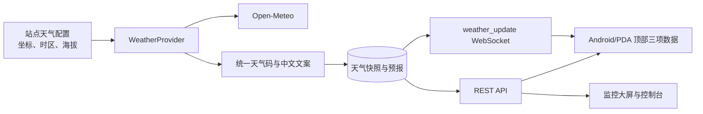

# 站点天气与环境状态模块｜汇总开发文档

> **文档级别：历史设计稿（非发布审批基线）。** 当前实施以
> [`PROJECT-APPROVAL-REVIEW.md`](/E:/CC_testP/iot-manager/docs/PROJECT-APPROVAL-REVIEW.md)、
> [`PROJECT-IMPROVEMENT-PLAN.md`](/E:/CC_testP/iot-manager/docs/PROJECT-IMPROVEMENT-PLAN.md)
> 和功能路线图为准；本稿中的“一期/后续”表述不改变 Gate、权限和供应商审查要求。
> 状态：一期已实现并验证；天气自动联动与生产级权限仍为后续工作
> 目标端：Android/PDA 客户端、监控大屏、运维控制台
> 设计基准：设备页顶部固定展示当地气温、相对湿度、气压三项实时数据；天气状况与站点海拔归入站点环境信息；数值按绿色（适宜）、黄色（观察）、红色（风险）响应。

## 1. 目标与边界

天气是**站点环境数据**，不属于某一台设备的遥测。设备的温湿度传感器仍按现有遥测链路保存和展示；外部天气只用于让现场运维人员快速了解站点外部环境，并为后续的天气联动与告警提供数据基础。

一期交付：

- 当前天气：天气状况、当地气温、体感温度、相对湿度、地面气压、风速/风向、站点海拔、更新时间。
- 预报：未来 24 小时和未来 7 天。
- 环境状态：温度、湿度、气压的三色状态，以及 ESD 与结露风险的派生状态和原因说明。
- 站点配置：经纬度、时区、手动海拔覆盖、启用开关、天气提供方。
- 实时体验：服务端刷新后推送 `weather_update`，客户端局部更新顶部数据，不刷新整个设备列表。
- 离线体验：保留最后一次成功天气及时间戳；天气过期只影响天气卡片，**绝不**改变设备控制的只读/离线规则。

一期不包含：根据天气自动下发设备命令、气象传感器校准、分钟级历史图表、多个商业天气源的自动切换、气象预警的生产级推送。

### 本次实现范围

- 已实现 `V8__add_site_weather.sql`、Open-Meteo 提供方、30 分钟站点刷新、当前天气/24 小时/7 天缓存、REST 与 `weather_update`。
- 已实现服务端环境判定和 `iot.weather.environment-rules` 阈值配置；三端均只消费服务端返回的等级。
- 已实现 Android/PDA 顶部三项数据、详情页和离线天气缓存；监控大屏展示预报；控制台可维护站点天气配置并手动刷新。
- 结露风险在配置温度遥测来源后计算；未配置时明确显示“待接入”。

## 2. 已确认的客户端界面

### 2.1 设备页（默认页）

保持目前的“设备 / 动态 / 添加”三项底部导航和现有的离线快照、连接状态、设备列表。新增区域如下：

| 位置 | 内容 | 交互与状态 |
|---|---|---|
| App 顶部标题行 | `🌡 23°C  |  💧 65%  |  ◌ 1013 hPa` | 三项数据固定且同一站点来源；每项图标、数值和状态点按三色规则响应；点击进入天气详情。加载中显示骨架，未配置显示“天气未配置”。 |
| 站点环境卡片 | 组织 / 站点 / 空间、天气图标与文案、`海拔 32 m`、天气新鲜度、ESD/结露摘要 | 正常为浅青色；环境风险仅改变状态标签和指标，不把整页染红；过期用柔和琥珀色标签；卡片同样可进入天气详情。 |
| 天气详情页 | 当前天气大卡、体感/风力/降水，24 小时横向时间轴，7 天列表 | 手势横向浏览小时预报；显示数据源与“更新于”。 |

视觉规范沿用已确认的参考图：暖白背景、深青绿主按钮和图标、浅青站点卡、浅暖黄警告卡、圆角白色设备列表。天气数据不占用底部导航，也不与“连接状态”共用同一个颜色或错误文案。

顶部结构固定为 `应用标识与标题 | 三项环境数据 | 连接设置`。例如 `23°C / 65% / 1013 hPa` 分别在温度、湿度和气压状态下着色；海拔不是健康指标，只在站点卡和详情页展示，不参与红黄绿判定。

### 2.2 环境状态与颜色规则

颜色只表达环境指标风险，**不改变设备在线、离线或命令权限**。绿色包含原图的“理想”和“正常”；“理想”仅以星标或文字补充，不增加第四种主色。红色表示“风险”，不等同于“数值偏高”：低气压、低湿度导致的 ESD 风险也应为红色。

| 指标 | 绿色：适宜 | 黄色：观察 | 红色：风险 | 页面文案 |
|---|---|---|---|---|
| 温度 | 18–28°C；20–25°C 为“理想” | <18°C 或 >28 且 <35°C | ≥35°C | 适宜 / 偏低观察 / 温度偏高 |
| 相对湿度 | 30–70%；40–60% 为“理想” | 20–<30% 或 >70–80% | <20% 或 >80% | 适宜 / 偏低或偏高观察 / 湿度风险 |
| 地面气压 | 90–110 kPa；95–105 kPa 为“理想” | 80–<90 kPa 或 >110 kPa | <80 kPa | 适宜 / 气压观察 / 气压偏低 |
| ESD 风险 | 湿度 ≥30%，低 | 湿度 20–<30%，增加 | 湿度 <20%，高 | ESD：低 / 增加 / 高 |
| 结露风险 | 露点裕量 >5°C 且湿度 ≤70% | 露点裕量 >2–≤5°C、湿度 >70%，或室内外温差过大 | 露点裕量 ≤2°C，或高湿且低温接近露点 | 结露：低 / 注意 / 高 |

气压界面仍展示 `hPa`，计算时以 `kPa = hPa / 10` 比较阈值，例如 `1013 hPa = 101.3 kPa`，因此为绿色。原需求未定义低温危险线和大于 110 kPa 的危险线；一期按上表将其列为黄色观察，后续可通过规则配置调整，不擅自升级为红色。

结露是物理风险，不能仅凭室外天气伪造。服务端使用天气温度和湿度计算露点，并读取站点指定的室内/设备表面温度遥测来计算露点裕量；未配置该遥测来源时返回 `NOT_CONFIGURED`，客户端显示中性“结露待接入”，不使用误导性的红黄绿。

推荐的可访问性颜色令牌：绿色 `#168A65`、黄色 `#B77908`、红色 `#D1435B`。每种颜色必须同时具有文字（适宜、观察、风险）、图标和 `aria-label`，不能只依赖颜色。

### 2.3 管理端

在站点设置中加入“天气”页签：站点名称、经纬度、时区、海拔（可选手动值）、启用状态、提供方、最近成功刷新时间和“立即刷新”按钮。坐标未设置时，客户端显示未配置而不猜测位置。

## 3. 架构



首个 `WeatherProvider` 使用 Open-Meteo 的 Forecast API。该 API 文档覆盖当前温度、相对湿度、天气码、地面气压、风速风向，以及小时/每日预报变量，并支持最长 16 天预报；本项目一期仅请求 24 小时和 7 天，减少流量与展示复杂度。[Open-Meteo Forecast API](https://open-meteo.com/en/docs)

提供方调用只能发生在后端。浏览器和 Android App 只访问本项目 API，避免暴露第三方契约、在每台终端重复请求，以及离线状态不一致。

## 4. 数据设计

新增 Flyway 迁移：`V8__add_site_weather.sql`。不修改现有 `sites` 表的职责，新增独立表以便日后接入多源、审计和历史保留。

| 表 | 关键字段 | 约束与用途 |
|---|---|---|
| `site_weather_settings` | `site_id`、`latitude`、`longitude`、`timezone`、`manual_elevation_m`、`enabled`、`provider_code`、`condensation_temperature_device_id`、`condensation_temperature_field` | `site_id` 唯一；纬度 -90~90、经度 -180~180；时区使用 IANA 值，如 `Asia/Shanghai`；结露温度来源可为空。 |
| `site_weather_snapshots` | `site_id`、`provider_code`、`observed_at`、`fetched_at`、`weather_code`、`condition_text`、`temperature_c`、`apparent_temperature_c`、`relative_humidity_pct`、`surface_pressure_hpa`、`wind_speed_kmh`、`wind_direction_deg`、`elevation_m`、`raw_payload_json` | 每次成功刷新保存一条当前快照；索引 `(site_id, fetched_at desc)`；保留 30 天用于排障。 |
| `site_weather_forecast_points` | `site_id`、`forecast_kind`、`forecast_at`、`weather_code`、`temperature_c`、`temperature_max_c`、`temperature_min_c`、`precipitation_probability_pct`、`wind_speed_kmh`、`fetched_at` | `forecast_kind` 为 `HOURLY` 或 `DAILY`；唯一键 `(site_id, forecast_kind, forecast_at, fetched_at)`；每次刷新替换该站点的有效 24h/7d 集合。 |

海拔的确定顺序固定为：**手动配置 > 提供方返回的站点海拔 > 未知**。海拔表示相对海平面的地理高度，不能由气压反推，也不能与气压混写。

开发环境迁移会为 `demo-site` 建立可编辑的深圳示例配置（坐标、`Asia/Shanghai`、海拔 32 m）；生产环境由控制台填写，禁止把示例坐标当作默认值。

颜色阈值一期放入版本化的服务端配置 `iot.weather.environment-rules`，不允许由移动端硬编码。每个 API 响应携带已计算的 `level`、`label`、`reason` 与 `ideal`，保证移动端、监控大屏和控制台使用同一结果；后续若需要按行业或站点配置阈值，再新增规则配置表与审计记录。

## 5. 后端设计

### 5.1 代码结构

新增 `com.iot.manager.weather` 包：

- `WeatherProvider`：可替换提供方接口。
- `OpenMeteoWeatherProvider`：JDK `HttpClient` 实现；设置连接/读取超时，解析外部响应。
- `WeatherCodeMapper`：WMO 天气码映射为稳定的中文文案、图标键与日/夜展示键。
- `EnvironmentStatusEvaluator`：以统一规则计算温度、湿度、气压、ESD 和结露的等级、原因与理想标记。
- `DewPointCalculator`：根据温湿度计算露点；有配置的站点再读取指定温度遥测计算结露风险。
- `SiteWeatherService`：读取配置、调用提供方、规范化、持久化、读取缓存与手动刷新。
- `SiteWeatherScheduler`：每 30 分钟刷新已启用且已配置坐标的站点；同站点不得并发刷新。
- `SiteWeatherController`、DTO、Repository、Entity：沿用现有 Controller/Service/Repository 分层。

Open-Meteo 请求应明确请求字段，不依赖提供方默认返回值：

```text
current=temperature_2m,relative_humidity_2m,apparent_temperature,weather_code,
surface_pressure,wind_speed_10m,wind_direction_10m
hourly=temperature_2m,relative_humidity_2m,weather_code,
precipitation_probability,wind_speed_10m
daily=weather_code,temperature_2m_max,temperature_2m_min,
precipitation_probability_max,wind_speed_10m_max
timezone=<site timezone>&forecast_days=7
```

当前数据来自天气模型的 15 分钟粒度，不应在客户端标为“秒级实时”。[Open-Meteo current conditions](https://open-meteo.com/en/docs)

### 5.2 刷新、缓存与失败处理

- 定时周期为 30 分钟；站点首次打开也只读取本地快照，不触发每个客户端各自请求第三方。
- 管理端“立即刷新”触发同一服务；每站点一分钟内只允许一次，返回当前正在刷新的结果或 `409`。
- 成功：事务内保存快照和有效预报集合；提交后广播实时事件。
- 失败：保留最后一次成功快照，记录结构化日志与失败时间；不删除旧数据。
- 新鲜度：`FRESH` ≤ 45 分钟，`STALE` 为 45 分钟至 6 小时，`EXPIRED` > 6 小时；`PENDING` 表示坐标已配置、等待首次成功同步；`UNAVAILABLE` 表示未配置或已停用。
- 任务异常不应中断其他站点的刷新；HTTP 超时、解析异常、限流均归一为可展示的天气不可用状态。

## 6. API 与实时契约

所有时间为 ISO-8601 带时区时间；温度为摄氏度、湿度为百分比、气压为 hPa、海拔为米、风速为 km/h。

### 6.1 REST

| 方法与路径 | 用途 |
|---|---|
| `GET /api/v1/sites/{siteCode}/weather` | 客户端顶部和当前天气卡；坐标已配置但未同步时返回 `PENDING`，未配置或已停用时返回 `UNAVAILABLE`，均不返回伪造数值。 |
| `GET /api/v1/sites/{siteCode}/weather/forecast?hours=24&days=7` | 天气详情页的小时/每日预报。 |
| `PUT /api/v1/sites/{siteCode}/weather-settings` | 控制台保存天气配置。 |
| `POST /api/v1/sites/{siteCode}/weather/refresh` | 控制台手动刷新。 |

`GET /api/v1/sites/demo-site/weather` 的目标响应：

```json
{
  "siteCode": "demo-site",
  "status": "FRESH",
  "source": "OPEN_METEO",
  "observedAt": "2026-08-13T10:30:00+08:00",
  "fetchedAt": "2026-08-13T10:32:06+08:00",
  "current": {
    "conditionCode": "PARTLY_CLOUDY",
    "conditionText": "多云",
    "temperatureC": 23.0,
    "apparentTemperatureC": 24.1,
    "relativeHumidityPct": 65,
    "surfacePressureHpa": 1013.0,
    "windSpeedKmh": 12.0,
    "windDirectionDeg": 135,
    "elevationM": 32.0,
    "elevationSource": "MANUAL"
  },
  "indicators": {
    "temperature": { "level": "SUITABLE", "label": "适宜", "ideal": true, "reason": "20–25°C 为理想范围" },
    "humidity": { "level": "SUITABLE", "label": "适宜", "ideal": false, "reason": "30–70% 为正常范围" },
    "pressure": { "level": "SUITABLE", "label": "适宜", "ideal": true, "reason": "95–105 kPa 为理想范围" },
    "esdRisk": { "level": "SUITABLE", "label": "低", "reason": "相对湿度不低于 30%" },
    "condensationRisk": { "level": "NOT_CONFIGURED", "label": "待接入", "reason": "未配置站点温度遥测来源" }
  }
}
```

配置写入示例：

```json
{
  "enabled": true,
  "providerCode": "OPEN_METEO",
  "latitude": 22.5431,
  "longitude": 114.0579,
  "timezone": "Asia/Shanghai",
  "manualElevationM": 32
}
```

### 6.2 WebSocket

复用 `/ws/devices` 与现有版本化 `RealtimeEvent`：

```json
{
  "type": "weather_update",
  "version": 1,
  "timestamp": 1786588326000,
  "payload": { "siteCode": "demo-site", "status": "FRESH", "current": {} }
}
```

在 `WebSocketService` 增加 `sendWeatherUpdate(...)`，并在事务提交后发送。事件携带完整的当前天气和 `indicators`；客户端只在 `payload.siteCode` 与当前站点一致时合并天气状态，收到事件后不重载设备清单。

## 7. 前端改造清单

### Android/PDA 客户端

| 文件 | 修改内容 |
|---|---|
| `client/src/js/api.js` | 增加 `getSiteWeather`、`getSiteWeatherForecast`；保留既有统一错误解析。 |
| `client/src/js/store.js` | 在不可变状态中加入 `weather` 与 `indicators`；实现 `setWeather` 和 `weather_update` 的站点过滤合并。 |
| `client/src/js/realtime.js` | 保持协议版本校验；将事件交给 Store 现有的实时分发入口。 |
| `client/src/main.js` | 首次平台快照完成后请求当前站点天气；连接恢复时按需重新读取天气。 |
| `client/src/js/ui.js` | 顶部三项摘要、站点环境天气与 ESD/结露行、详情页、状态原因、未配置/过期状态。 |
| `client/src/css/style.css` | 实现青绿色数据条、浅青环境卡、绿黄红状态令牌、天气骨架和窄屏布局；复用现有 safe-area 与底部导航规则。 |

顶部数据的展示优先级固定为：温度、湿度、地面气压。没有某项数据时显示 `--`，不能以 `0` 替代。海拔只在站点环境卡与详情页显示。颜色由服务端 `level` 决定：`SUITABLE` 为绿色、`OBSERVE` 为黄色、`RISK` 为红色；`NOT_CONFIGURED`/`UNAVAILABLE`/`PENDING` 为中性色，不冒充环境正常。

### 监控大屏与控制台

- `frontend`：新增站点天气摘要和 24h/7d 预报区域；使用 `weather_update` 原位更新，不整页刷新。
- `console`：新增站点天气配置和手动刷新；写入前校验坐标范围、时区、海拔范围。

## 8. 测试与验收

### 自动化测试

- 后端：天气码映射、温湿压红黄绿边界、ESD 边界、露点/结露计算、手动海拔优先级、提供方超时、缓存回退、坐标校验、REST 响应、定时刷新去重、提交后 WebSocket 事件、Flyway 新库迁移。
- 客户端：API URL、Store 不可变合并、站点过滤、`weather_update`、四种新鲜度、`--` 空值展示、绿黄红文字与无障碍标签、顶部点击进入详情。
- E2E：设备页显示三项数据和各自状态；断网后设备卡仍按原逻辑只读；天气过期不会伪造“连接断开”；Android 打包、安装、启动和连接设置回归。

### 人工验收清单

1. 打开设备页，在一屏内可看到温度、湿度、气压和站点天气/海拔。
2. 配置两个不同坐标的站点后，切换站点不会串天气数据。
3. 点击顶部数据可查看 24 小时与 7 天预报，文案、单位、日期均为站点时区。
4. 停止天气提供方后显示最后成功时间和过期状态；设备操作权限不因此改变。
5. 管理端修改坐标并手动刷新后，移动端无需整页刷新即可收到新天气。
6. 未设置坐标的站点只显示“天气未配置”，不展示深圳或其他默认城市数据。
7. 输入 `23°C / 65% / 1013 hPa` 时三项均为绿色；输入 `31°C / 78%` 时对应项为黄色；输入 `36°C / 85%` 时对应项为红色。
8. 湿度低于 20% 时 ESD 为红色；未配置结露温度遥测时只显示“待接入”，不产生虚假的风险颜色。

## 9. 实施批次

| 批次 | 内容 | 完成标志 |
|---|---|---|
| A：数据与服务 | V8、实体、Provider、快照、当前天气 API、单元测试 | 可通过 API 获取配置站点的当前天气与缓存状态。 |
| B：环境规则 | 三色状态计算、ESD/露点风险、状态 API、单元测试 | 每项数据有稳定的绿色/黄色/红色及可解释原因。 |
| C：移动端 | 顶部三项、环境卡、详情页、缓存与实时合并、测试 | Android/PDA 设备页达到已确认预设计图的层级与状态。 |
| D：运营端 | 监控大屏预报、控制台配置、手动刷新 | 坐标、海拔和结露温度来源可由运维人员自主维护。 |
| E：联动准备 | 天气告警/规则接口与权限审计预留 | 不自动控制设备，具备后续接入条件。 |

## 10. 风险与决策

- 天气预报具有模型误差；界面应使用“预报/更新时间”，不能标示为现场传感器读数。
- 当前项目仍是受控试点基础，认证、RBAC、租户隔离和提供方凭据管理尚未落地。将来接入商业天气源前，必须把配置与权限纳入该安全里程碑。
- `OpenMeteoWeatherProvider` 是可替换边界，不允许把外部字段名散布到 Controller 或客户端。
- 预报展示默认 24 小时和 7 天；服务端保留未来扩展到 16 天的能力，但不提前扩大移动端信息密度。
- 环境状态规则以本次确认阈值为一期默认值。低温危险线、极高气压危险线及各行业特定阈值尚未给出，当前保守地列为黄色观察，必须通过配置变更和测试后才能调整为红色。
